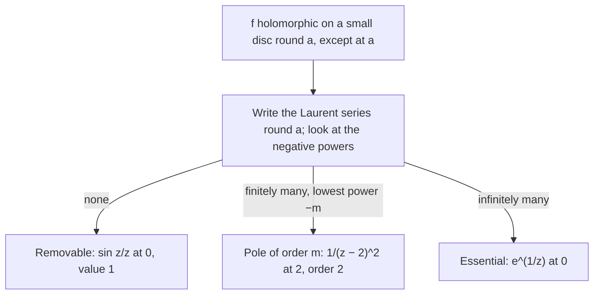
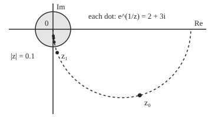

# Isolated singularities: removable, a pole or essential, and the negative powers tell you which

[Syllabus](../../../SYLLABUS.md) → [Complex analysis](../README.md) → [Laurent Series, Singularities and Residues](../README.md#s05) → Isolated singularities

---

## General Overview

Three potholes sit on a road through the plane, each a point where a formula divides by zero.

The first is sin z/z at 0. A step 0.1 east gives 0.998334; 0.1 north gives 1.001668. One slab is missing: set the value at 0 to 1 and the hole is gone. The second is 1/(z − 2)^2 at 2. At distance 0.1 its size is 100; at half that, 400, in every direction: a hole of definite depth. The third is e^(1/z) at 0: 2980.957987 at 1/8, 0.000335 at −1/8. A sinkhole with no bottom.

From here on a pothole is an **isolated singularity**: a point where a function is undefined, though holomorphic (has a complex derivative) everywhere else on a small disc round it. The kinds are **removable**, **pole** and **essential**. One test sorts them: write the Laurent series, a power series allowed negative powers ([Laurent series](01-laurent-series.md)), and read the negative powers.

**No negative powers means removable, finitely many means a pole whose order is the most negative power, infinitely many means essential; bounded near the point means no negative powers, and near an essential point the function comes within any distance of every value.**

**What kind of fact this is:** a theorem, proved on this card in Why it works; removable, pole, essential and meromorphic are definitions.

### The picture: one test, three answers



---

## The formula

Notation first. The sigma sign here adds over every whole number n, negative ones included. The negative-power terms are the **principal part**. For a radius $R > 0$, the points with $0 < |z - a| < R$ form a **punctured disc**: a disc with its centre removed.

$$f(z) = \sum_{n=-\infty}^{\infty} c_n (z-a)^n \qquad \text{for } 0 < |z - a| < R$$

**Read it aloud:** near the bad point, f is a sum of powers of z − a, some negative.

Each coefficient is a loop integral, anticlockwise round any circle of radius r in the punctured disc:

$$c_n = \frac{1}{2\pi i} \oint_{|z-a| = r} \frac{f(z)}{(z-a)^{n+1}}\, dz$$

The classification reads the principal part: **removable** if it is empty; a **pole of order m** if $c_{-m} \ne 0$ is its lowest term; **essential** if infinitely many of its coefficients are nonzero.

Three results make the test usable.

- **Riemann's removable-singularity theorem.** If $|f(z)| \le M$ on a punctured disc round a, the singularity is removable.
- **Pole form.** A pole of order m is exactly $f(z) = g(z)/(z-a)^m$ with g holomorphic at a and $g(a) \ne 0$.
- **Casorati–Weierstrass theorem.** At an essential singularity, for every value $w$ and tolerance $\varepsilon > 0$, every punctured disc round a, however small, holds a point z with $|f(z) - w| < \varepsilon$.

A function is **meromorphic** on an open set when it is holomorphic there apart from isolated points, each removable or a pole.

| Symbol | Plain meaning | In our example | Push it up and the answer… |
| --- | --- | --- | --- |
| $f$, $z$ | the function; a point of the plane | e^(1/z); z = 1/8 | — |
| $a$ | the isolated singularity | 0, or 2 for the pole | — |
| $c_n$, $c_0$, $n$ | coefficient on the power n; the constant term | c_−2 = 1 for the pole | — |
| $R$, $r$, $\delta$ | disc radius; loop radius; a proof's radius | loops of radius 1 | — |
| $m$ | pole order: the most negative power | 2 | halving distance multiplies size by 2^m |
| $g$, $h$, $q$ | helper functions, holomorphic at a | g = 1 for the pole | — |
| $M$ | a bound on the size of f near a | 1.042191 for sin z/z | — |
| $w$, $\varepsilon$, $k$ | target value; tolerance; a whole-number index | w = 2 + 3i | larger k, closer to 0 |

### When it holds

- **Holomorphic on a whole punctured disc**, or there is no Laurent series: 1/sin(1/z) has poles crowding into 0, so 0 is not isolated.
- **Bounded on the whole punctured disc, not along a path.** e^(1/z) stays below 1 along the negative real axis, yet 0 is essential.
- **Holomorphic, not merely bounded.** z-bar/z has size 1 everywhere, but is 1 on the real axis and −1 on the imaginary axis: no value at 0 fits.

---

## Why it works

### Step 0: the negative coefficients are a fingerprint

The Laurent series on a punctured disc is unique, and each coefficient is a loop integral giving the same number on every circle. So the principal part belongs to the function and the point, not to a formula.

### Step 1: no negative powers, and the hole fills

If every negative coefficient is 0, what remains is a power series, holomorphic on the full disc, centre included. Its value at a is $c_0$: for sin z/z the code's loop integral gives 1.000000. Conversely, a holomorphic extension has a Taylor series, which by uniqueness is the Laurent series.

### Step 2: bounded means removable

Put $n = -k$ in the coefficient formula. The loop has length $2\pi r$, and on it the integrand has size at most $M r^{k-1}$. An integral is at most path length times the largest size on the path, so

$$|c_{-k}| \le \frac{1}{2\pi} \cdot 2\pi r \cdot M r^{k-1} = M r^k$$

The left side does not depend on r, so shrinking r squeezes it to 0, for every k, and Step 1 fills the hole. For sin z/z the largest size on the circle of radius 0.5 is 1.042191, which is sinh(0.5)/0.5, and smaller circles give less: that bound alone proves 0 removable.

### Step 3: a lowest negative power is a pole

Suppose the lowest power is −m. Multiply by $(z-a)^m$: every power becomes 0 or more, so $g = (z-a)^m f$ is a power series with $g(a) = c_{-m} \ne 0$. Near a, g stays near that value, so |f| is about $|c_{-m}|$ over distance to the m-th power, in every direction. For 1/(z − 2)^2, g is 1; at z = 2.01, multiplying f by $(z - 2)^m$ gives sizes 100, 1 and 0.01 for m = 1, 2, 3. Only the true order leaves a finite, nonzero value. Conversely, if |f| tends to infinity at a, then a is a pole (Detailed proof, below). Merely unbounded is not enough: e^(1/z) is unbounded near 0.

### Step 4: no lowest power, and nothing settles

With infinitely many negative coefficients, no power of z − a tames f. Put 1/z into the series e^u = Σ u^k/k!: e^(1/z) = Σ z^(−k)/k!, every coefficient nonzero, so 0 is essential. The loop integrals agree: 1, 0.5 and 0.166667 on the powers −1, −2, −3. Its size depends on direction: 2980.957987 at 1/8, 0.000335 at −1/8, and exactly 1 at i/(16π), where 1/z is −16πi.

### Step 5: near an essential point, f comes close to everything

Suppose f stayed at least $\varepsilon$ from some value $w$ on a punctured disc. Then $h = 1/(f - w)$ is holomorphic there with size at most $1/\varepsilon$, so by Step 2 it fills in at a. Solving back, $f = w + 1/h$: removable if h(a) is not 0, a pole if it is. Either way a is not essential. Felice Casorati published this in 1868, Karl Weierstrass in 1876.

<details>
<summary>Detailed proof</summary>

*Riemann* is Step 2 with $|f| \le M$ on $0 < |z - a| < \delta$ and $0 < r < \delta$.

*Pole from growth.* If |f| tends to infinity at a, pick $\delta$ with $|f| \ge 1$ on the punctured disc. Then 1/f is bounded by 1, extends by Riemann, and has value 0 at a. It is not identically 0, so $1/f = (z - a)^m q$ with q holomorphic, $q(a) \ne 0$. Shrink the disc so q has no zeros: $f = (z - a)^{-m} (1/q)$, and 1/q is a power series with nonzero constant term, so the lowest power is −m.

*Casorati–Weierstrass* is Step 5, with this argument supplying the pole when h has a zero at a.

</details>

For e^(1/z) the truth is stronger: every value except 0 is hit exactly. For $w$ = 2 + 3i, 1/z must be ln|w| + i(arg w + 2πk) for a whole number k, with ln|w| = 1.282475 and arg w = 0.982794. So

$$z_k = \frac{1}{\ln|w| + i(\arg w + 2\pi k)}$$

has $e^{1/z_k} = w$. The sizes $|z_k|$ for k = 0 to 4 are 0.618910, 0.135533, 0.073477, 0.050318 and 0.038245: solutions crowd into 0.

### The picture: where e^(1/z) equals 2 + 3i

<p align="center"></p>

To scale: 300 units per unit, 0 at (90, 50). Dots z_0 to z_4 at (237.4, 162.9), (97.1, 90.0), (92.1, 71.9), (91.0, 65.1), (90.6, 61.5), on the dashed circle with centre (207.0, 50.0), radius 117.0. The shaded disc |z| < 0.1, radius 30.0, holds z_2 onwards.

### Step 6: meromorphic functions

1/(z − 2)^2 and tan z = sin z/cos z are meromorphic on the whole plane. e^(1/z) is meromorphic on the plane without 0, not on the whole plane: the domain is part of the claim.

A second road to a pole's order: a pole of order m of f is a zero of order m of 1/f. For polynomial quotients that road runs in [Rational functions](03-rational-functions-and-partial-fractions.md).

---

## Worked numbers, by hand

| Step | Arithmetic | Value |
| --- | --- | --- |
| sin z/z at 0.1 | 1 − 0.01/6 + 0.0001/120 | 0.998334; no negative powers, patched value **1** |
| 1/(z − 2)^2 at distances 0.1, 0.05 | 1/0.1^2, 1/0.05^2 | 100, 400 |
| order test at 2.01 | (z − 2)^m f for m = 1, 2, 3 | 100, 1, 0.01: order **2** |
| e^(1/z), powers −1, −2, −3 | 1/1!, 1/2!, 1/3! | 1, 0.5, 0.166667, never ending: **essential** |
| e^(1/z) at 1/8, −1/8 | e^8, e^(−8) | 2980.957987, 0.000335 |
| solve e^(1/z) = 2 + 3i, k = 4 | 1/(1.282475 + i(0.982794 + 8π)) | size 0.038245 |

A division by zero may hide a harmless gap, a hole of fixed depth, or a point where every value crowds in; the negative powers say which.

### What breaks if you drop a piece

| Mistake | Comes out at | What went wrong |
| --- | --- | --- |
| Zero denominator read as a pole | sin z/z is 0.998334 at 0.1 | the numerator's zero cancels |
| Order read as a term count | 1 negative term, so "order 1" | order is the lowest power, −2 |
| One ray read as a pole | e^(1/z): 2980.957987 at 1/8, 0.000335 at −1/8 | a pole grows in every direction |
| Riemann without holomorphy | z-bar/z: 1 on one axis, −1 on the other | bounded alone fills no hole |

---

## Code, from first principles, and it actually runs

Road one finds each Laurent coefficient as a trapezoid sum over 64 points of a circle of radius 1. Road two uses independent facts: the series 1/k!, direct values, the order test, sinh(0.5)/0.5, and exact solutions of e^(1/z) = w. The trapezoid error on the coefficient 1 of e^(1/z) falls from 0.008336089 with 4 points to 0.000002756 with 8, and below print with 16. e^z is built from exp, cos and sin; Rust defines its own (re, im) struct.

### Python

```python
# Isolated singularities -- the check behind the card.  Standard library only.
# Three potholes: sin z/z at 0, 1/(z - 2)^2 at 2, e^(1/z) at 0.  Road one reads
# Laurent coefficients off a trapezoid sum round a circle; road two uses known
# series, values near the point, and exact solutions of e^(1/z) = w.
import math

def cexp(z):                                     # e^z from exp, cos and sin
    return math.exp(z.real) * complex(math.cos(z.imag), math.sin(z.imag))

def show(z):                                     # 'a + bi' with six decimals
    re, im = (0.0 if abs(t) < 5e-7 else t for t in (z.real, z.imag))
    return f"{re:.6f} {'-' if im < 0 else '+'} {abs(im):.6f}i"

def coeff(f, a, n, r=1.0, N=64):                 # c_n = (1/2 pi i) loop f (z-a)^(-n-1) dz
    s = 0
    for j in range(N):
        u = r * cexp(2j * math.pi * j / N)
        s += f(a + u) * u ** (-n)
    return s / N

sinc = lambda z: (cexp(1j * z) - cexp(-1j * z)) / (2j * z)
pole = lambda z: 1 / (z - 2) ** 2
ess = lambda z: cexp(1 / z)
fact = [1.0]
for k in range(1, 4): fact.append(fact[-1] * k)
cs = {}
for name, f, a in (("sin z/z at 0", sinc, 0), ("1/(z-2)^2 at 2", pole, 2), ("e^(1/z) at 0", ess, 0)):
    cs[name] = [coeff(f, a, n) for n in (-3, -2, -1, 0)]
    print(f"{name}: c_-3, c_-2, c_-1 = " + ", ".join(show(c) for c in cs[name][:3]))
print("e^(1/z) by its series, 1/k! for k = 3, 2, 1: " + ", ".join(f"{1 / fact[k]:.6f}" for k in (3, 2, 1)))
print("trapezoid error on c_-1 of e^(1/z), N = 4, 8, 16: " + ", ".join(f"{abs(coeff(ess, 0, -1, 1.0, N) - 1):.9f}" for N in (4, 8, 16)))
print(f"sin z/z: c_0 = {show(cs['sin z/z at 0'][3])}; value at 0.1: {sinc(0.1).real:.6f}; at 0.1i: {sinc(0.1j).real:.6f}")
M = max(abs(sinc(0.5 * cexp(2j * math.pi * j / 64))) for j in range(64))
print(f"sin z/z bounded: max modulus on |z| = 0.5 is {M:.6f}; sinh(0.5)/0.5 = {(math.exp(0.5) - math.exp(-0.5)) / 2 / 0.5:.6f}")
print(f"1/(z-2)^2: modulus at distance 0.1: {abs(pole(2.1)):.6f}; at distance 0.05: {abs(pole(2 + 0.05j)):.6f}")
print("order test at z = 2.01, |(z-2)^m f(z)| for m = 1, 2, 3: " + ", ".join(f"{abs(0.01 ** m * pole(2.01)):.6f}" for m in (1, 2, 3)))
print(f"e^(1/z) at z = 1/8: {ess(0.125).real:.6f}; at z = -1/8: {ess(-0.125).real:.6f}; at z = i/(16 pi): {show(ess(1j / (16 * math.pi)))}")
w = complex(2, 3)
L, th = math.log(abs(w)), math.atan2(w.imag, w.real)
zs = [1 / complex(L, th + 2 * math.pi * k) for k in range(5)]
print(f"target w = {show(w)}; ln|w| = {L:.6f}, arg w = {th:.6f}; z_k = 1/(ln|w| + i(arg w + 2 pi k))")
print("|z_k|: " + ", ".join(f"{abs(z):.6f}" for z in zs))
print("largest |e^(1/z_k) - w|: " + f"{max(abs(ess(z) - w) for z in zs):.9f}")
print("figure, 300 units per unit, 0 at (90, 50), z_0 to z_4: " + " ".join(f"({90 + 300 * z.real:.1f}, {50 - 300 * z.imag:.1f})" for z in zs))
print(f"figure, circle through every z_k: centre ({90 + 150 / L:.1f}, 50.0), radius {150 / L:.1f}; ring |z| = 0.1: radius 30.0")
neg = [coeff(pole, 2, n) for n in range(-1, -7, -1)]
nz = [n for n, c in zip(range(-1, -7, -1), neg) if abs(c) > 1e-9]
print(f"mistake, counting terms: 1/(z-2)^2 has {len(nz)} nonzero negative coefficient; most negative power {min(nz)}")
bar = lambda z: z.conjugate() / z
print(f"mistake, no holomorphy: conj(z)/z at 0.001 is {show(bar(0.001))}; at 0.001i is {show(bar(0.001j))}")
p = cs["1/(z-2)^2 at 2"]
assert abs(p[1] - 1) < 1e-12 and abs(p[0]) < 1e-12 and abs(p[2]) < 1e-12 and abs(0.0001 * pole(2.01) - 1) < 1e-9
assert all(abs(cs["e^(1/z) at 0"][3 - k] - 1 / fact[k]) < 1e-12 for k in (1, 2, 3))
assert all(abs(c) < 1e-12 for c in cs["sin z/z at 0"][:3]) and abs(cs["sin z/z at 0"][3] - 1) < 1e-12 and abs(sinc(1e-3) - 1) < 1e-6
assert max(abs(ess(z) - w) for z in zs) < 1e-9 and abs(zs[4]) < 0.05
print("ALL CHECKS PASS")
```

**Ran 2026-09-28 on macOS, Python 3.14.6, standard library only. All checks passed. Output, pasted from the run:**

```
sin z/z at 0: c_-3, c_-2, c_-1 = 0.000000 + 0.000000i, 0.000000 + 0.000000i, 0.000000 + 0.000000i
1/(z-2)^2 at 2: c_-3, c_-2, c_-1 = 0.000000 + 0.000000i, 1.000000 + 0.000000i, 0.000000 + 0.000000i
e^(1/z) at 0: c_-3, c_-2, c_-1 = 0.166667 + 0.000000i, 0.500000 + 0.000000i, 1.000000 + 0.000000i
e^(1/z) by its series, 1/k! for k = 3, 2, 1: 0.166667, 0.500000, 1.000000
trapezoid error on c_-1 of e^(1/z), N = 4, 8, 16: 0.008336089, 0.000002756, 0.000000000
sin z/z: c_0 = 1.000000 + 0.000000i; value at 0.1: 0.998334; at 0.1i: 1.001668
sin z/z bounded: max modulus on |z| = 0.5 is 1.042191; sinh(0.5)/0.5 = 1.042191
1/(z-2)^2: modulus at distance 0.1: 100.000000; at distance 0.05: 400.000000
order test at z = 2.01, |(z-2)^m f(z)| for m = 1, 2, 3: 100.000000, 1.000000, 0.010000
e^(1/z) at z = 1/8: 2980.957987; at z = -1/8: 0.000335; at z = i/(16 pi): 1.000000 + 0.000000i
target w = 2.000000 + 3.000000i; ln|w| = 1.282475, arg w = 0.982794; z_k = 1/(ln|w| + i(arg w + 2 pi k))
|z_k|: 0.618910, 0.135533, 0.073477, 0.050318, 0.038245
largest |e^(1/z_k) - w|: 0.000000000
figure, 300 units per unit, 0 at (90, 50), z_0 to z_4: (237.4, 162.9) (97.1, 90.0) (92.1, 71.9) (91.0, 65.1) (90.6, 61.5)
figure, circle through every z_k: centre (207.0, 50.0), radius 117.0; ring |z| = 0.1: radius 30.0
mistake, counting terms: 1/(z-2)^2 has 1 nonzero negative coefficient; most negative power -2
mistake, no holomorphy: conj(z)/z at 0.001 is 1.000000 + 0.000000i; at 0.001i is -1.000000 + 0.000000i
ALL CHECKS PASS
```

### Rust

Same numbers, same labels, built with `rustc --edition 2021 -O`.

```rust
// Isolated singularities -- the same check as the Python, in Rust.  No crates.
// Three potholes: sin z/z at 0, 1/(z - 2)^2 at 2, e^(1/z) at 0.  Road one reads
// Laurent coefficients off a trapezoid sum round a circle; road two uses known
// series, values near the point, and exact solutions of e^(1/z) = w.
use std::f64::consts::PI;
use std::ops::{Add, Div, Mul, Sub};
#[derive(Clone, Copy)]
struct C { re: f64, im: f64 }
fn c(re: f64, im: f64) -> C { C { re, im } }
impl Add for C { type Output = C; fn add(self, o: C) -> C { c(self.re + o.re, self.im + o.im) } }
impl Sub for C { type Output = C; fn sub(self, o: C) -> C { c(self.re - o.re, self.im - o.im) } }
impl Mul for C { type Output = C; fn mul(self, o: C) -> C { c(self.re * o.re - self.im * o.im, self.re * o.im + self.im * o.re) } }
impl Div for C { type Output = C; fn div(self, o: C) -> C { let d = o.re * o.re + o.im * o.im;
    c((self.re * o.re + self.im * o.im) / d, (self.im * o.re - self.re * o.im) / d) } }
fn abs(z: C) -> f64 { z.re.hypot(z.im) }
fn cexp(z: C) -> C { let m = z.re.exp(); c(m * z.im.cos(), m * z.im.sin()) }   // e^z from exp, cos, sin
fn powi(u: C, n: i32) -> C { let mut p = c(1.0, 0.0); for _ in 0..n.abs() { p = p * u } if n < 0 { c(1.0, 0.0) / p } else { p } }
fn show(z: C) -> String {                                                        // 'a + bi' with six decimals
    let (re, im) = (if z.re.abs() < 5e-7 { 0.0 } else { z.re }, if z.im.abs() < 5e-7 { 0.0 } else { z.im });
    format!("{:.6} {} {:.6}i", re, if im < 0.0 { "-" } else { "+" }, im.abs())
}
fn coeff(f: fn(C) -> C, a: C, n: i32, r: f64, big_n: usize) -> C {             // c_n = (1/2 pi i) loop f (z-a)^(-n-1) dz
    let mut s = c(0.0, 0.0);
    for j in 0..big_n { let u = cexp(c(0.0, 2.0 * PI * j as f64 / big_n as f64)) * c(r, 0.0); s = s + f(a + u) * powi(u, -n) }
    s / c(big_n as f64, 0.0)
}
fn sinc(z: C) -> C { let iz = c(0.0, 1.0) * z; (cexp(iz) - cexp(c(0.0, 0.0) - iz)) / (c(0.0, 2.0) * z) }
fn pole(z: C) -> C { let d = z - c(2.0, 0.0); c(1.0, 0.0) / (d * d) }
fn ess(z: C) -> C { cexp(c(1.0, 0.0) / z) }
fn bar(z: C) -> C { c(z.re, -z.im) / z }
fn join(v: &[String]) -> String { v.join(", ") }

fn main() {
    let fact = [1.0, 1.0, 2.0, 6.0];
    let cases: [(&str, fn(C) -> C, C); 3] = [("sin z/z at 0", sinc, c(0.0, 0.0)), ("1/(z-2)^2 at 2", pole, c(2.0, 0.0)), ("e^(1/z) at 0", ess, c(0.0, 0.0))];
    let mut cs: Vec<Vec<C>> = Vec::new();
    for (name, f, a) in cases.iter() {
        let v: Vec<C> = [-3, -2, -1, 0].iter().map(|&n| coeff(*f, *a, n, 1.0, 64)).collect();
        println!("{}: c_-3, c_-2, c_-1 = {}", name, join(&v[..3].iter().map(|&z| show(z)).collect::<Vec<_>>()));
        cs.push(v);
    }
    println!("e^(1/z) by its series, 1/k! for k = 3, 2, 1: {}", join(&[3, 2, 1].iter().map(|&k| format!("{:.6}", 1.0 / fact[k])).collect::<Vec<_>>()));
    println!("trapezoid error on c_-1 of e^(1/z), N = 4, 8, 16: {}", join(&[4, 8, 16].iter().map(|&n| format!("{:.9}", abs(coeff(ess, c(0.0, 0.0), -1, 1.0, n) - c(1.0, 0.0)))).collect::<Vec<_>>()));
    println!("sin z/z: c_0 = {}; value at 0.1: {:.6}; at 0.1i: {:.6}", show(cs[0][3]), sinc(c(0.1, 0.0)).re, sinc(c(0.0, 0.1)).re);
    let m = (0..64).map(|j| abs(sinc(cexp(c(0.0, 2.0 * PI * j as f64 / 64.0)) * c(0.5, 0.0)))).fold(0.0, f64::max);
    println!("sin z/z bounded: max modulus on |z| = 0.5 is {:.6}; sinh(0.5)/0.5 = {:.6}", m, (0.5f64.exp() - (-0.5f64).exp()) / 2.0 / 0.5);
    println!("1/(z-2)^2: modulus at distance 0.1: {:.6}; at distance 0.05: {:.6}", abs(pole(c(2.1, 0.0))), abs(pole(c(2.0, 0.05))));
    println!("order test at z = 2.01, |(z-2)^m f(z)| for m = 1, 2, 3: {}", join(&[1, 2, 3].iter().map(|&k| format!("{:.6}", 0.01f64.powi(k) * abs(pole(c(2.01, 0.0))))).collect::<Vec<_>>()));
    println!("e^(1/z) at z = 1/8: {:.6}; at z = -1/8: {:.6}; at z = i/(16 pi): {}", ess(c(0.125, 0.0)).re, ess(c(-0.125, 0.0)).re, show(ess(c(0.0, 1.0 / (16.0 * PI)))));
    let w = c(2.0, 3.0);
    let (l, th) = (abs(w).ln(), w.im.atan2(w.re));
    let zs: Vec<C> = (0..5).map(|k| c(1.0, 0.0) / c(l, th + 2.0 * PI * k as f64)).collect();
    println!("target w = {}; ln|w| = {:.6}, arg w = {:.6}; z_k = 1/(ln|w| + i(arg w + 2 pi k))", show(w), l, th);
    println!("|z_k|: {}", join(&zs.iter().map(|&z| format!("{:.6}", abs(z))).collect::<Vec<_>>()));
    let err = zs.iter().map(|&z| abs(ess(z) - w)).fold(0.0, f64::max);
    println!("largest |e^(1/z_k) - w|: {:.9}", err);
    println!("figure, 300 units per unit, 0 at (90, 50), z_0 to z_4: {}", zs.iter().map(|z| format!("({:.1}, {:.1})", 90.0 + 300.0 * z.re, 50.0 - 300.0 * z.im)).collect::<Vec<_>>().join(" "));
    println!("figure, circle through every z_k: centre ({:.1}, 50.0), radius {:.1}; ring |z| = 0.1: radius 30.0", 90.0 + 150.0 / l, 150.0 / l);
    let nz: Vec<i32> = (1..7).map(|k| -k).filter(|&n| abs(coeff(pole, c(2.0, 0.0), n, 1.0, 64)) > 1e-9).collect();
    println!("mistake, counting terms: 1/(z-2)^2 has {} nonzero negative coefficient; most negative power {}", nz.len(), nz.iter().min().unwrap());
    println!("mistake, no holomorphy: conj(z)/z at 0.001 is {}; at 0.001i is {}", show(bar(c(0.001, 0.0))), show(bar(c(0.0, 0.001))));
    let p = &cs[1];
    assert!(abs(p[1] - c(1.0, 0.0)) < 1e-12 && abs(p[0]) < 1e-12 && abs(p[2]) < 1e-12 && (0.0001 * abs(pole(c(2.01, 0.0))) - 1.0).abs() < 1e-9);
    assert!([1usize, 2, 3].iter().all(|&k| abs(cs[2][3 - k] - c(1.0 / fact[k], 0.0)) < 1e-12));
    assert!(cs[0][..3].iter().all(|&z| abs(z) < 1e-12) && abs(cs[0][3] - c(1.0, 0.0)) < 1e-12 && abs(sinc(c(1e-3, 0.0)) - c(1.0, 0.0)) < 1e-6);
    assert!(err < 1e-9 && abs(zs[4]) < 0.05);
    println!("ALL CHECKS PASS");
}
```

**Ran 2026-09-28 on macOS, rustc 1.98.1, no crates. All checks passed. Output, pasted from the run:**

```
sin z/z at 0: c_-3, c_-2, c_-1 = 0.000000 + 0.000000i, 0.000000 + 0.000000i, 0.000000 + 0.000000i
1/(z-2)^2 at 2: c_-3, c_-2, c_-1 = 0.000000 + 0.000000i, 1.000000 + 0.000000i, 0.000000 + 0.000000i
e^(1/z) at 0: c_-3, c_-2, c_-1 = 0.166667 + 0.000000i, 0.500000 + 0.000000i, 1.000000 + 0.000000i
e^(1/z) by its series, 1/k! for k = 3, 2, 1: 0.166667, 0.500000, 1.000000
trapezoid error on c_-1 of e^(1/z), N = 4, 8, 16: 0.008336089, 0.000002756, 0.000000000
sin z/z: c_0 = 1.000000 + 0.000000i; value at 0.1: 0.998334; at 0.1i: 1.001668
sin z/z bounded: max modulus on |z| = 0.5 is 1.042191; sinh(0.5)/0.5 = 1.042191
1/(z-2)^2: modulus at distance 0.1: 100.000000; at distance 0.05: 400.000000
order test at z = 2.01, |(z-2)^m f(z)| for m = 1, 2, 3: 100.000000, 1.000000, 0.010000
e^(1/z) at z = 1/8: 2980.957987; at z = -1/8: 0.000335; at z = i/(16 pi): 1.000000 + 0.000000i
target w = 2.000000 + 3.000000i; ln|w| = 1.282475, arg w = 0.982794; z_k = 1/(ln|w| + i(arg w + 2 pi k))
|z_k|: 0.618910, 0.135533, 0.073477, 0.050318, 0.038245
largest |e^(1/z_k) - w|: 0.000000000
figure, 300 units per unit, 0 at (90, 50), z_0 to z_4: (237.4, 162.9) (97.1, 90.0) (92.1, 71.9) (91.0, 65.1) (90.6, 61.5)
figure, circle through every z_k: centre (207.0, 50.0), radius 117.0; ring |z| = 0.1: radius 30.0
mistake, counting terms: 1/(z-2)^2 has 1 nonzero negative coefficient; most negative power -2
mistake, no holomorphy: conj(z)/z at 0.001 is 1.000000 + 0.000000i; at 0.001i is -1.000000 + 0.000000i
ALL CHECKS PASS
```

The two outputs match line for line.

> [!TIP]
> **Try changing**
> Guess first, then run it.
> - **A deeper hole.** Make the pole `1 / (z - 2) ** 3`. The 1 moves to the power −3 and the first assert stops the run.
> - **A smaller loop.** Call `coeff(ess, 0, -1, 0.2)`. Still 1.000000: the coefficient ignores the circle, Step 2's lever.
> - **Too few points.** Change `N=64` in `coeff` to `N=4`. The e^(1/z) coefficients pick up the error 0.008336089 and the second assert fails.

---

## The usual mistake

> [!warning]
> **A zero denominator is not yet a pole.** sin z/z divides by zero at 0, yet is removable, with value 1. The Laurent series or a bound decides, not the formula's shape.
>
> - **Counting terms for the order.** 1/(z − 2)^2 has one negative term but order 2.
> - **Trusting samples.** Large floating-point values prove nothing; the kinds are statements about infinitely many coefficients.

---

## Where you meet it in real life

- **Signal processing.** sinc, sin(πx)/(πx), is set to 1 at 0: a patched removable singularity.
- **Numerical code.** (e^z − 1)/z loses digits near its removable 0, so libraries switch to its power series: Step 1 in practice.
- **Circuits and control.** A response is a quotient of polynomials whose poles and orders set how it rings and decays ([Rational functions](03-rational-functions-and-partial-fractions.md)).
- **Contour integrals.** A loop sees only $c_{-1}$: [Residues](04-residues.md), summed in [The residue theorem](05-the-residue-theorem.md).

> **Say it back**
> An isolated singularity is one bad point with a holomorphic function all round it. With no negative powers in the Laurent series the hole fills, as sin z/z fills with 1. A lowest negative power −m makes a pole of order m, as for 1/(z − 2)^2 with m = 2. Infinitely many make it essential, and the function comes within any distance of every value, as e^(1/z) does. Bounded near the point means removable.

---

## What this builds on

- [Laurent series](01-laurent-series.md): the series with negative powers, its uniqueness, and the loop-integral formula for each coefficient.

## Where this goes next

- [Rational functions](03-rational-functions-and-partial-fractions.md): quotients of polynomials, whose only singularities are poles, split into principal parts.
- [Residues](04-residues.md): the coefficient on the power −1, found without the whole series.

---

## Sources

Verified 28 Sep 2026: every link below resolves to the publisher's page.

- Lebl, Jiří. *Guide to Cultivating Complex Analysis*. [Author's page and full text](https://www.jirka.org/ca/). Free; defines and classifies isolated singularities.
- Stein, Elias M., and Rami Shakarchi. *Complex Analysis*. Princeton University Press, 2003. [Publisher page](https://press.princeton.edu/books/hardcover/9780691113852/complex-analysis). Chapter 3 on meromorphic functions: removable singularities, poles, Casorati–Weierstrass.
- O'Connor, J. J., and E. F. Robertson. "Felice Casorati." MacTutor Archive, University of St Andrews. [Biography](https://mathshistory.st-andrews.ac.uk/Biographies/Casorati/). Dates Casorati's 1868 treatise and Weierstrass's 1876 paper.
