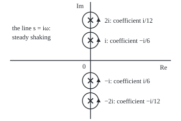
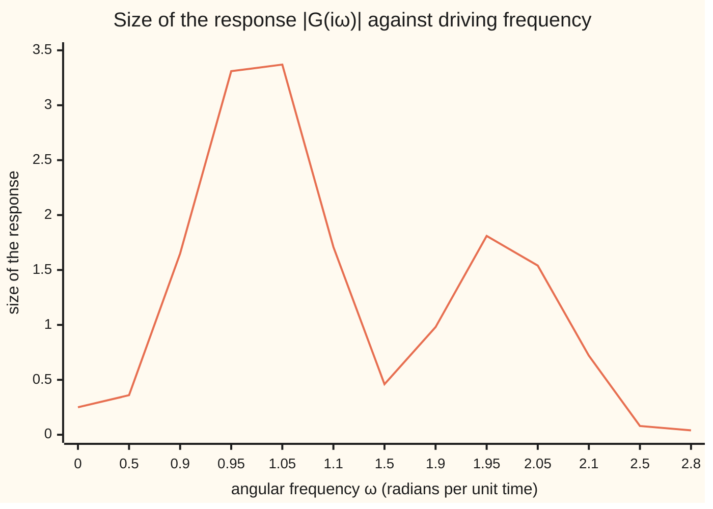

# Rational functions: a ratio of polynomials is the sum of its principal parts, one per pole

[Syllabus](../../../SYLLABUS.md) → [Complex analysis](../README.md) → [Laurent Series, Singularities and Residues](../README.md#s05) → Rational functions

---

## General Overview

A motor shakes a guitar string steadily. How strongly the string answers is its **response function**, a ratio of two polynomials in a complex variable s. With its two lowest modes at angular frequencies 1 and 2 (scaled units), the response is

G(s) = 1/((s^2 + 1)(s^2 + 4)).

Steady shaking at angular frequency ω (radians per unit time) is, by the engineers' convention, the point s = iω. At ω = 0.5 the answer has size 0.36; at ω = 0.95, 3.31. At ω = 1 and ω = 2 the bottom is zero and the answer is infinite: two resonances. The four points where the bottom vanishes, i, −i, 2i and −2i, are the **poles** of G: isolated points where it blows up ([Isolated singularities](02-classifying-singularities.md)).

Each pole carries its own blow-up term, the **principal part**: the negative powers of its Laurent series ([Laurent series](01-laurent-series.md)). Add the four and nothing is left over:

G(s) = (−i/6)/(s − i) + (i/6)/(s + i) + (i/12)/(s − 2i) + (−i/12)/(s + 2i) = (1/3)(1/(s^2 + 1) − 1/(s^2 + 4)).

That split is the **partial fraction decomposition**.

**A ratio of polynomials, with the top of lower degree than the bottom, is exactly the sum of its principal parts, one for each pole; and a zero of order n of a function is a pole of order n of its reciprocal.**

**What kind of fact this is:** a theorem, proved on this card in Why it works; the orders it counts are definitions.

### The picture: four poles on the frequency line

<p align="center"></p>

To scale, 40 units per unit of s. Crosses are poles; circles, radius 0.4, are the loops the code walks.

---

## The formula

Notation first, in words. A **rational function** is a ratio f = P/Q of polynomials with no common factor; deg P is the degree of P, its highest power. A root p of Q is a pole; its **order** m is how many times (s − p) divides Q, and order 1 is **simple**. A function has a **zero of order n** at p when it equals (s − p)^n times a function holomorphic and nonzero at p; for P/Q, that is (s − p) dividing the top n times. The coefficient of 1/(s − p)^k at p is written $c_{-k}$, as in the Laurent series, and $Q'$ is the derivative of Q.

$$\frac{P(s)}{Q(s)} = \sum_{\text{poles } p}\ \sum_{k=1}^{m} \frac{c_{-k}(p)}{(s-p)^k}, \qquad \deg P < \deg Q$$

**Read it aloud:** when the top has lower degree, the ratio is the sum over every pole of its principal part, one term per unit of order.

At a simple pole no expansion is needed:

$$c_{-1}(p) = \frac{P(p)}{Q'(p)}$$

**Read it aloud:** the top over the slope of the bottom, both at the pole.

This is the **cover-up rule**: cover the factor (s − p), evaluate the rest at p. At a pole of order m, write f(s) = g(s)/(s − p)^m, with $g$ holomorphic (complex-differentiable) near p and g(p) ≠ 0. Then

$$c_{-m+j}(p) = \frac{g^{(j)}(p)}{j!}, \qquad j = 0, 1, \dots, m-1$$

**Read it aloud:** the coefficients are the first m Taylor coefficients of g at the pole.

| Symbol | Plain meaning | In our example | Push it up and the answer… |
| --- | --- | --- | --- |
| $s$ | the complex input; s = iω is shaking at frequency ω | test points 3 and 1 + 0.5i | near a pole, blows up |
| $\omega$ | angular frequency, radians per unit time | resonances at 1 and 2 | past 2, dies away |
| $f$, $P$, $Q$ | the ratio, its top, its bottom | G; 1; s^4 + 5s^2 + 4 | — |
| $Q'$ | the derivative of Q | Q'(i) = 6i | smaller coefficient |
| $p$ | a pole: a root of Q not cancelled by P | ±i, ±2i | — |
| $m$, $n$ | order of a pole, of a zero | 1 for G; 2 for F = 1/(s^2 + 1)^2 | more terms |
| $c_{-k}$, $k$, $j$ | coefficient of 1/(s − p)^k; counters | at i: −0.166667i | stronger resonance |
| $g$, $j!$ | f with the pole factored out; 1 × 2 × … × j | for F at i, 1/(s + i)^2 | — |

### When it holds

- **Top degree below bottom degree.** Else divide first ([Polynomial long division](../../03-Algebra/02-Polynomials/04-polynomial-division.md)). For s^4/Q the principal parts miss the quotient, 1.
- **Common factors cancelled.** (s^2 + 1)/Q has no pole at ±i: near i it is 1/3.
- **Complex roots allowed.** Every polynomial factors into linear pieces over the complex numbers, so every rational function splits. Over the reals, conjugate poles pair into quadratic pieces.

---

## Why it works

### Step 1: a pole of order m is f = g/(s − p)^m with g(p) ≠ 0

At i, factor the bottom: (s − i)(s + i)(s^2 + 4). So G(s) = g(s)/(s − i) with g(s) = 1/((s + i)(s^2 + 4)), and g(i) = 1/(2i × 3) = −i/6, not zero. The order is 1.

The code finds the order without factoring. Near p, |f| is about |g(p)|/|h|^m, h being the gap from p, so a tenfold smaller gap multiplies |f| by 10^m: 10 at each pole of G, 100 at i for F = 1/(s^2 + 1)^2.

### Step 2: zeros and poles trade places under the reciprocal

If f = g/(s − p)^m with g(p) ≠ 0, then 1/f = (s − p)^m × (1/g), with 1/g holomorphic and nonzero at p: a zero of order m. Read backwards, a zero of order n is a pole of order n of the reciprocal. The bottom of G has simple zeros at ±i and ±2i, so G has simple poles there; the code sees |1/G| shrink tenfold with the gap. Cancelled factors subtract: (s^2 + 1)/Q has order 1 above and below at i, net 0, no pole.

### Step 3: the coefficients are Taylor coefficients of g

Expand g at p: g(s) = g(p) + g'(p)(s − p) + … . Divide by (s − p)^m. The first m terms now carry negative powers: the principal part, term j with coefficient g^(j)(p)/j!.

At a simple pole only g(p) matters. Write Q(s) = (s − p)R(s); the product rule gives Q'(p) = R(p), so g(p) = P(p)/Q'(p). At i: Q'(i) = 4i^3 + 10i = 6i, so the coefficient is 1/(6i) = −i/6.

### Step 4: what is left is a polynomial that tends to zero, so it is zero

Let D be f minus all its principal parts. Near a pole p, f minus p's principal part is the Taylor tail of g over (s − p)^m, which stays finite, and the other parts are finite at p. So D has no poles: it is a polynomial. Far out, f and each part tend to 0, so D does too, and a polynomial that tends to 0 is zero.

<details>
<summary>Detailed proof</summary>

Let S be the sum of the principal parts of f = P/Q (lowest terms, deg P < deg Q), and D = f − S = A/B in lowest terms. If B had a root b, then A(b) ≠ 0 and |D| would be unbounded near b. Off the roots of Q, f and S are finite; at a root b of Q, f minus its own principal part is g's Taylor tail over (s − b)^m, holomorphic at b, and the other parts are finite. Either way D is bounded near b, a contradiction. So B is constant and D is a polynomial.

Far out, |f(s)| ≤ C/|s| for a constant C and each c/(s − p)^k tends to 0, so D → 0. A nonzero polynomial is a nonzero constant or grows without bound, so D = 0. The split is unique because the Laurent series at each pole is ([Laurent series](01-laurent-series.md)).

</details>

### Step 5: conjugate poles pair into real pieces

G has real coefficients, so poles and coefficients come in mirror pairs: −i/6 at i, i/6 at −i. Added, they give (−i/6)(2i)/(s^2 + 1) = (1/3)/(s^2 + 1); the pair at ±2i gives −(1/3)/(s^2 + 4). That is the real split that [Partial fractions](../../06-Calculus%20and%20analysis/04-Integrals/05-partial-fractions.md) integrates.

A second road walks a small loop round the pole: c_{−k} is 1/(2πi) times the loop integral of f(s)(s − p)^(k − 1). The coefficient c_{−1} alone is the subject of [Residues](04-residues.md).

---

## Worked numbers, by hand

| Step | Arithmetic | Value |
| --- | --- | --- |
| poles | s^2 + 1 = 0, s^2 + 4 = 0 | ±i, ±2i, each order 1 |
| slope of the bottom | Q'(s) = 4s^3 + 10s | Q'(i) = 6i, Q'(2i) = −12i |
| coefficient at i | 1/(6i) | −i/6 = −0.166667i |
| coefficient at 2i | 1/(−12i) | i/12 = 0.083333i |
| at −i, −2i | mirror images | i/6, −i/12 |
| pair ±i | (−i/6)(2i) | 1/3 over s^2 + 1 |
| pair ±2i | (i/12)(4i) | −1/3 over s^2 + 4 |
| check at s = 3 | (1/3)(1/10 − 1/13) | **0.007692 = G(3)** |

The string's response is two resonances: weight 1/3 at ω = 1, −1/3 at ω = 2.

### The picture: the string's answer along the frequency line



The line is |G(iω)| at unevenly spaced ω; ω = 1 and ω = 2, where it is infinite, are skipped. The spikes sit over the poles i and 2i.

### What breaks if you drop a piece

| Mistake | Comes out at | What went wrong |
| --- | --- | --- |
| s^4/Q split without dividing | −0.376923 at s = 3, not 0.623077 | the quotient, 1, is lost |
| F = 1/(s^2 + 1)^2 with 1/(s − p) terms only | 0.050000 at s = 3, not 0.010000 | the −0.25/(s − p)^2 terms are missing |
| (s^2 + 1)/Q called a pole at i | order 0, value 0.333333 | the top's zero cancels the bottom's |

The code prints all three.


---

## Code, from first principles, and it actually runs

Both programs find the poles by Newton's method (repeatedly replace s by s − Q(s)/Q'(s)), measure orders by growth rate, and reach every coefficient by two roads: the cover-up rule, and a trapezoid sum round a loop of radius 0.4, its shrinking error printed. The split is summed back against G at two test points. The second case, F = 1/(s^2 + 1)^2, checks order-2 poles by derivatives of g and by the loop.

### Python

```python
# Rational functions and partial fractions: the check behind the card.  Python
# standard library only; complex numbers are the built-in 1j type.  G is the
# string's response 1/((s^2 + 1)(s^2 + 4)); F = 1/(s^2 + 1)^2 is the second case.
import math
G = lambda s: 1 / ((s * s + 1) * (s * s + 4))
F = lambda s: 1 / (s * s + 1) ** 2
Q = lambda s: s ** 4 + 5 * s * s + 4             # the bottom of G, multiplied out
dQ = lambda s: 4 * s ** 3 + 10 * s               # its derivative
f6 = lambda x: f"{round(x, 6) + 0.0:.6f}"         # six decimals, never -0.000000
def c(z):                                        # a complex number as 'a + bi'
    return f"{f6(z.real)} {'-' if round(z.imag, 6) < 0 else '+'} {f6(abs(z.imag))}i"
def newton(s):                                   # road to the poles: Newton on Q
    for _ in range(60):
        s = s - Q(s) / dQ(s)
    return s
def order(f, p):                                 # how fast |f| grows as the gap to p shrinks 10x
    return round(math.log(abs(f(p + 1e-4)) / abs(f(p + 1e-3))) / math.log(10))
def loop(f, p, k, n=64, r=0.4):                  # (1/2 pi i) x loop integral of f (s - p)^(k - 1)
    tot = 0
    for j in range(n):
        w = r * complex(math.cos(2 * math.pi * j / n), math.sin(2 * math.pi * j / n))
        tot += f(p + w) * w ** k
    return tot / n
poles = [newton(s) for s in (0.3 + 1.3j, 0.3 - 1.3j, 0.3 + 2.4j, 0.3 - 2.4j)]
cover, ring = [1 / dQ(p) for p in poles], [loop(G, p, 1) for p in poles]   # roads one and two
print("G(s) = 1/((s^2 + 1)(s^2 + 4)): top degree 0, bottom degree 4")
for p, a, b in zip(poles, cover, ring):
    print(f"pole {c(p)}: order {order(G, p)}, zero of 1/G of order {-order(lambda s: 1 / G(s), p)};"
          f" Q'(p) {c(dQ(p))}, cover-up {c(a)}, loop {c(b)}")
assert all(abs(a - b) < 1e-12 and order(G, p) == 1 == -order(lambda s: 1 / G(s), p)
           for p, a, b in zip(poles, cover, ring))
pair = [(2 * cover[k].real, -2 * (cover[k] * poles[k].conjugate()).real) for k in (0, 2)]
print(f"pairs: i, -i give s-term {f6(pair[0][0])} and constant {f6(pair[0][1])} over s^2 + 1; "
      f"2i, -2i give {f6(pair[1][0])} and {f6(pair[1][1])} over s^2 + 4")
parts = lambda s: sum(a / (s - p) for p, a in zip(poles, cover))
for s in (3, 1 + 0.5j):
    print(f"at s = {c(s)}: G {c(G(s))}, sum of principal parts {c(parts(s))},"
          f" (1/3)(1/(s^2+1) - 1/(s^2+4)) {c((1 / (s * s + 1) - 1 / (s * s + 4)) / 3)}")
    assert abs(G(s) - parts(s)) < 1e-14 and abs(G(s) - (1 / (s * s + 1) - 1 / (s * s + 4)) / 3) < 1e-14
err = [abs(loop(G, 1j, 1, n) - cover[0]) for n in (4, 8, 16, 24)]
print("loop-sum error at i, 4, 8, 16, 24 points: " + ", ".join(f"{e:.12f}" for e in err))
fd = [(p, 1 / (2 * p) ** 2, -2 / (2 * p) ** 3) for p in (1j, -1j)]   # derivative road: g(p), g'(p)
for p, m2, m1 in fd:
    print(f"F = 1/(s^2 + 1)^2, pole {c(p)}: order {order(F, p)}; c(-2) {c(m2)} (loop {c(loop(F, p, 2))}),"
          f" c(-1) {c(m1)} (loop {c(loop(F, p, 1))})")
    assert order(F, p) == 2 and abs(m2 - loop(F, p, 2)) < 1e-12 and abs(m1 - loop(F, p, 1)) < 1e-12
full = sum(m2 / (3 - p) ** 2 + m1 / (3 - p) for p, m2, m1 in fd)
simple = sum(m1 / (3 - p) for p, m2, m1 in fd)
print(f"F at s = 3: {f6(F(3))}; all principal parts {f6(full.real)}; the 1/(s - p) terms alone {f6(simple.real)}")
top = sum(p ** 4 / dQ(p) / (3 - p) for p in poles)
print(f"mistake, s^4/Q at s = 3: {f6(81 / Q(3))}; principal parts alone {f6(top.real)};"
      f" gap {f6(81 / Q(3) - top.real)}, the quotient of s^4 by Q")
assert abs(top - (-5 * 9 - 4) / Q(3)) < 1e-14   # division: s^4 = 1 x Q + (-5s^2 - 4)
H = lambda s: (s * s + 1) / ((s * s + 1) * (s * s + 4))
print(f"mistake, (s^2 + 1)/Q near i: order {order(H, 1j)}, value at i + 0.000001 {c(H(1j + 1e-6))}")
ws = (0, 0.5, 0.9, 0.95, 1.05, 1.1, 1.5, 1.9, 1.95, 2.05, 2.1, 2.5, 2.8)
print("chart, |G(iw)| at w = 0 ... 2.8: " + ", ".join(f"{abs(G(1j * w)):.2f}" for w in ws))
print("figure, 40 px per unit, origin (180, 120): poles at " + ", ".join(
    f"({180 + 40 * p.real:.0f}, {120 - 40 * p.imag:.0f})" for p in poles) + "; loops of radius 0.4 = 16 px")
print("ALL CHECKS PASS")
```

**Ran 2026-09-28 on macOS, Python 3.14.6, standard library only. All checks passed. Output, pasted from the run:**

```
G(s) = 1/((s^2 + 1)(s^2 + 4)): top degree 0, bottom degree 4
pole 0.000000 + 1.000000i: order 1, zero of 1/G of order 1; Q'(p) 0.000000 + 6.000000i, cover-up 0.000000 - 0.166667i, loop 0.000000 - 0.166667i
pole 0.000000 - 1.000000i: order 1, zero of 1/G of order 1; Q'(p) 0.000000 - 6.000000i, cover-up 0.000000 + 0.166667i, loop 0.000000 + 0.166667i
pole 0.000000 + 2.000000i: order 1, zero of 1/G of order 1; Q'(p) 0.000000 - 12.000000i, cover-up 0.000000 + 0.083333i, loop 0.000000 + 0.083333i
pole 0.000000 - 2.000000i: order 1, zero of 1/G of order 1; Q'(p) 0.000000 + 12.000000i, cover-up 0.000000 - 0.083333i, loop 0.000000 - 0.083333i
pairs: i, -i give s-term 0.000000 and constant 0.333333 over s^2 + 1; 2i, -2i give 0.000000 and -0.333333 over s^2 + 4
at s = 3.000000 + 0.000000i: G 0.007692 + 0.000000i, sum of principal parts 0.007692 + 0.000000i, (1/3)(1/(s^2+1) - 1/(s^2+4)) 0.007692 + 0.000000i
at s = 1.000000 + 0.500000i: G 0.076393 - 0.067905i, sum of principal parts 0.076393 - 0.067905i, (1/3)(1/(s^2+1) - 1/(s^2+4)) 0.076393 - 0.067905i
loop-sum error at i, 4, 8, 16, 24 points: 0.002430129742, 0.000055067492, 0.000000035793, 0.000000000023
F = 1/(s^2 + 1)^2, pole 0.000000 + 1.000000i: order 2; c(-2) -0.250000 + 0.000000i (loop -0.250000 + 0.000000i), c(-1) 0.000000 - 0.250000i (loop 0.000000 - 0.250000i)
F = 1/(s^2 + 1)^2, pole 0.000000 - 1.000000i: order 2; c(-2) -0.250000 + 0.000000i (loop -0.250000 + 0.000000i), c(-1) 0.000000 + 0.250000i (loop 0.000000 + 0.250000i)
F at s = 3: 0.010000; all principal parts 0.010000; the 1/(s - p) terms alone 0.050000
mistake, s^4/Q at s = 3: 0.623077; principal parts alone -0.376923; gap 1.000000, the quotient of s^4 by Q
mistake, (s^2 + 1)/Q near i: order 0, value at i + 0.000001 0.333333 + 0.000000i
chart, |G(iw)| at w = 0 ... 2.8: 0.25, 0.36, 1.65, 3.31, 3.37, 1.71, 0.46, 0.98, 1.81, 1.54, 0.72, 0.08, 0.04
figure, 40 px per unit, origin (180, 120): poles at (180, 80), (180, 160), (180, 40), (180, 200); loops of radius 0.4 = 16 px
ALL CHECKS PASS
```

### Rust

Built with `rustc --edition 2021 -O`.

```rust
// Rational functions and partial fractions: the same check as the Python, in
// Rust.  No crates; complex numbers are a small (re, im) struct defined here.
// G is the string's response 1/((s^2 + 1)(s^2 + 4)); F = 1/(s^2 + 1)^2.
use std::ops::{Add, Div, Mul, Sub};
#[derive(Clone, Copy)]
struct C { re: f64, im: f64 }
fn c(re: f64, im: f64) -> C { C { re, im } }
impl Add for C { type Output = C; fn add(self, o: C) -> C { c(self.re + o.re, self.im + o.im) } }
impl Sub for C { type Output = C; fn sub(self, o: C) -> C { c(self.re - o.re, self.im - o.im) } }
impl Mul for C { type Output = C; fn mul(self, o: C) -> C { c(self.re * o.re - self.im * o.im, self.re * o.im + self.im * o.re) } }
impl Div for C { type Output = C; fn div(self, o: C) -> C { let d = o.re * o.re + o.im * o.im;
    c((self.re * o.re + self.im * o.im) / d, (self.im * o.re - self.re * o.im) / d) } }
fn r(x: f64) -> C { c(x, 0.0) }
fn abs(z: C) -> f64 { (z.re * z.re + z.im * z.im).sqrt() }
fn f6(x: f64) -> String { format!("{:.6}", (x * 1e6).round() / 1e6 + 0.0) }   // never -0.000000
fn s(z: C) -> String { format!("{} {} {}i", f6(z.re), if (z.im * 1e6).round() < 0.0 { "-" } else { "+" }, f6(z.im.abs())) }
fn g(z: C) -> C { r(1.0) / ((z * z + r(1.0)) * (z * z + r(4.0))) }
fn f(z: C) -> C { let q = z * z + r(1.0); r(1.0) / (q * q) }
fn q(z: C) -> C { z * z * z * z + r(5.0) * z * z + r(4.0) }     // the bottom of G, multiplied out
fn dq(z: C) -> C { r(4.0) * z * z * z + r(10.0) * z }            // its derivative
fn newton(mut z: C) -> C { for _ in 0..60 { z = z - q(z) / dq(z) } z }
fn order(h: &dyn Fn(C) -> C, p: C) -> i64 {                      // growth of |h| as the gap shrinks 10x
    ((abs(h(p + r(1e-4))) / abs(h(p + r(1e-3)))).ln() / 10f64.ln()).round() as i64 }
fn lp(h: &dyn Fn(C) -> C, p: C, k: i32, n: usize) -> C {          // (1/2 pi i) x loop integral of h (s - p)^(k - 1)
    let mut tot = r(0.0);
    for j in 0..n {
        let t = 2.0 * std::f64::consts::PI * j as f64 / n as f64;
        let w = c(0.4 * t.cos(), 0.4 * t.sin());
        let mut wk = r(1.0);
        for _ in 0..k { wk = wk * w }
        tot = tot + h(p + w) * wk;
    }
    tot / r(n as f64)
}
fn main() {
    let poles: Vec<C> = [c(0.3, 1.3), c(0.3, -1.3), c(0.3, 2.4), c(0.3, -2.4)].iter().map(|&z| newton(z)).collect();
    let cover: Vec<C> = poles.iter().map(|&p| r(1.0) / dq(p)).collect();   // road one: the cover-up rule
    let ring: Vec<C> = poles.iter().map(|&p| lp(&g, p, 1, 64)).collect();  // road two: a loop integral
    let inv = |z: C| r(1.0) / g(z);
    println!("G(s) = 1/((s^2 + 1)(s^2 + 4)): top degree 0, bottom degree 4");
    for k in 0..4 {
        println!("pole {}: order {}, zero of 1/G of order {}; Q'(p) {}, cover-up {}, loop {}",
                 s(poles[k]), order(&g, poles[k]), -order(&inv, poles[k]), s(dq(poles[k])), s(cover[k]), s(ring[k]));
        assert!(abs(cover[k] - ring[k]) < 1e-12 && order(&g, poles[k]) == 1 && -order(&inv, poles[k]) == 1);
    }
    let pr = |k: usize| (2.0 * cover[k].re, -2.0 * (cover[k] * c(poles[k].re, -poles[k].im)).re);
    println!("pairs: i, -i give s-term {} and constant {} over s^2 + 1; 2i, -2i give {} and {} over s^2 + 4",
             f6(pr(0).0), f6(pr(0).1), f6(pr(2).0), f6(pr(2).1));
    let parts = |z: C| (0..4).fold(r(0.0), |a, k| a + cover[k] / (z - poles[k]));
    for z in [r(3.0), c(1.0, 0.5)] {
        let real = (r(1.0) / (z * z + r(1.0)) - r(1.0) / (z * z + r(4.0))) / r(3.0);
        println!("at s = {}: G {}, sum of principal parts {}, (1/3)(1/(s^2+1) - 1/(s^2+4)) {}", s(z), s(g(z)), s(parts(z)), s(real));
        assert!(abs(g(z) - parts(z)) < 1e-14 && abs(g(z) - real) < 1e-14);
    }
    let err: Vec<String> = [4, 8, 16, 24].iter().map(|&n| format!("{:.12}", abs(lp(&g, c(0.0, 1.0), 1, n) - cover[0]))).collect();
    println!("loop-sum error at i, 4, 8, 16, 24 points: {}", err.join(", "));
    let (mut full, mut simple) = (r(0.0), r(0.0));
    for p in [c(0.0, 1.0), c(0.0, -1.0)] {                       // derivative road: g(p), g'(p)
        let two_p = r(2.0) * p;
        let (m2, m1) = (r(1.0) / (two_p * two_p), r(-2.0) / (two_p * two_p * two_p));
        let (l2, l1) = (lp(&f, p, 2, 64), lp(&f, p, 1, 64));
        println!("F = 1/(s^2 + 1)^2, pole {}: order {}; c(-2) {} (loop {}), c(-1) {} (loop {})", s(p), order(&f, p), s(m2), s(l2), s(m1), s(l1));
        assert!(order(&f, p) == 2 && abs(m2 - l2) < 1e-12 && abs(m1 - l1) < 1e-12);
        full = full + m2 / ((r(3.0) - p) * (r(3.0) - p)) + m1 / (r(3.0) - p);
        simple = simple + m1 / (r(3.0) - p);
    }
    println!("F at s = 3: {}; all principal parts {}; the 1/(s - p) terms alone {}", f6(f(r(3.0)).re), f6(full.re), f6(simple.re));
    let top = (0..4).fold(r(0.0), |a, k| { let p = poles[k]; a + p * p * p * p / dq(p) / (r(3.0) - p) });
    let q3 = q(r(3.0)).re;
    println!("mistake, s^4/Q at s = 3: {}; principal parts alone {}; gap {}, the quotient of s^4 by Q", f6(81.0 / q3), f6(top.re), f6(81.0 / q3 - top.re));
    assert!(abs(top - r((-5.0 * 9.0 - 4.0) / q3)) < 1e-14);      // division: s^4 = 1 x Q + (-5s^2 - 4)
    let h = |z: C| (z * z + r(1.0)) / ((z * z + r(1.0)) * (z * z + r(4.0)));
    println!("mistake, (s^2 + 1)/Q near i: order {}, value at i + 0.000001 {}", order(&h, c(0.0, 1.0)), s(h(c(1e-6, 1.0))));
    let ws = [0.0, 0.5, 0.9, 0.95, 1.05, 1.1, 1.5, 1.9, 1.95, 2.05, 2.1, 2.5, 2.8];
    let ch: Vec<String> = ws.iter().map(|&w| format!("{:.2}", abs(g(c(0.0, w))))).collect();
    println!("chart, |G(iw)| at w = 0 ... 2.8: {}", ch.join(", "));
    let fig: Vec<String> = poles.iter().map(|p| format!("({:.0}, {:.0})", 180.0 + 40.0 * p.re, 120.0 - 40.0 * p.im)).collect();
    println!("figure, 40 px per unit, origin (180, 120): poles at {}; loops of radius 0.4 = 16 px", fig.join(", "));
    println!("ALL CHECKS PASS");
}
```

**Ran 2026-09-28 on macOS, rustc 1.98.1, no crates. All checks passed. Output, pasted from the run:**

```
G(s) = 1/((s^2 + 1)(s^2 + 4)): top degree 0, bottom degree 4
pole 0.000000 + 1.000000i: order 1, zero of 1/G of order 1; Q'(p) 0.000000 + 6.000000i, cover-up 0.000000 - 0.166667i, loop 0.000000 - 0.166667i
pole 0.000000 - 1.000000i: order 1, zero of 1/G of order 1; Q'(p) 0.000000 - 6.000000i, cover-up 0.000000 + 0.166667i, loop 0.000000 + 0.166667i
pole 0.000000 + 2.000000i: order 1, zero of 1/G of order 1; Q'(p) 0.000000 - 12.000000i, cover-up 0.000000 + 0.083333i, loop 0.000000 + 0.083333i
pole 0.000000 - 2.000000i: order 1, zero of 1/G of order 1; Q'(p) 0.000000 + 12.000000i, cover-up 0.000000 - 0.083333i, loop 0.000000 - 0.083333i
pairs: i, -i give s-term 0.000000 and constant 0.333333 over s^2 + 1; 2i, -2i give 0.000000 and -0.333333 over s^2 + 4
at s = 3.000000 + 0.000000i: G 0.007692 + 0.000000i, sum of principal parts 0.007692 + 0.000000i, (1/3)(1/(s^2+1) - 1/(s^2+4)) 0.007692 + 0.000000i
at s = 1.000000 + 0.500000i: G 0.076393 - 0.067905i, sum of principal parts 0.076393 - 0.067905i, (1/3)(1/(s^2+1) - 1/(s^2+4)) 0.076393 - 0.067905i
loop-sum error at i, 4, 8, 16, 24 points: 0.002430129742, 0.000055067492, 0.000000035793, 0.000000000023
F = 1/(s^2 + 1)^2, pole 0.000000 + 1.000000i: order 2; c(-2) -0.250000 + 0.000000i (loop -0.250000 + 0.000000i), c(-1) 0.000000 - 0.250000i (loop 0.000000 - 0.250000i)
F = 1/(s^2 + 1)^2, pole 0.000000 - 1.000000i: order 2; c(-2) -0.250000 + 0.000000i (loop -0.250000 + 0.000000i), c(-1) 0.000000 + 0.250000i (loop 0.000000 + 0.250000i)
F at s = 3: 0.010000; all principal parts 0.010000; the 1/(s - p) terms alone 0.050000
mistake, s^4/Q at s = 3: 0.623077; principal parts alone -0.376923; gap 1.000000, the quotient of s^4 by Q
mistake, (s^2 + 1)/Q near i: order 0, value at i + 0.000001 0.333333 + 0.000000i
chart, |G(iw)| at w = 0 ... 2.8: 0.25, 0.36, 1.65, 3.31, 3.37, 1.71, 0.46, 0.98, 1.81, 1.54, 0.72, 0.08, 0.04
figure, 40 px per unit, origin (180, 120): poles at (180, 80), (180, 160), (180, 40), (180, 200); loops of radius 0.4 = 16 px
ALL CHECKS PASS
```

The two outputs match line for line.

> [!TIP]
> **Try changing**
> Guess first, then run it.
> - **Widen the loops.** Set `r=0.4` to `r=1.2` in `loop`. The loop round i also encloses 2i and prints −0.083333i, which is −i/6 + i/12; the first assert stops it.
> - **Fewer steps.** Set `n=64` to `n=8`. The loop at i is off in the fifth decimal, as the error line predicts; the first assert stops it.
> - **A cube.** Change F to `1 / (s * s + 1) ** 3`. The order prints 3, the order-2 road misses the loop, and the third assert stops it.

---

## The usual mistake

> [!warning]
> **Splitting before dividing.** Principal parts die away far out, so they cannot produce a polynomial; when the top's degree is not lower, divide first. For s^4/Q the parts miss the quotient, 1.
>
> - **One term for a repeated pole.** Order 2 needs a squared term too.
> - **The cover-up rule at a repeated pole.** Q'(p) is zero there; use the Taylor coefficients of g.
> - **Every zero of the bottom called a pole.** Cancel common factors first.

---

## Where you meet it in real life

- **Vibration and circuits.** A structure or filter with several modes has a rational response; its partial fractions list the modes and their weights. [Poles and zeros](../../13-Engineering%20mathematics/02-Linear%20Systems%20and%20Transforms/03-poles-zeros-and-stability.md) reads stability off where the poles sit.
- **Undoing the Laplace transform.** Each piece c/(s − p) becomes the motion c e^(pt): the string's pieces are sine waves at frequencies 1 and 2 ([Inverting a Laplace transform](../08-Transforms%20in%20Outline/07-inverse-laplace-by-residues.md)).
- **Counting.** A sequence whose terms each add the two before has a rational generating function; splitting it gives every term in closed form.

> **Say it back**
> A rational function blows up only at uncancelled roots of its bottom. Each pole has a principal part with one term per unit of order. When the top has lower degree, the function is the sum of those parts: the rest has no poles and dies away, so it is zero. At a simple pole the coefficient is P(p)/Q'(p). A zero of order n of a function is a pole of order n of its reciprocal.

---

## What this builds on

- [Isolated singularities](02-classifying-singularities.md): what a pole is.
- [Partial fractions](../../06-Calculus%20and%20analysis/04-Integrals/05-partial-fractions.md): the real version of the split, for integrals.
- [Polynomial long division](../../03-Algebra/02-Polynomials/04-polynomial-division.md): the division that comes first when the top is too big.

## Where this goes next

- [Inverting a Laplace transform](../08-Transforms%20in%20Outline/07-inverse-laplace-by-residues.md): each principal part turned back into motion in time.
- [Poles and zeros](../../13-Engineering%20mathematics/02-Linear%20Systems%20and%20Transforms/03-poles-zeros-and-stability.md): the side of the imaginary axis a pole sits on decides whether a system settles.
- [Root locus](../../13-Engineering%20mathematics/03-Feedback%20Control/05-root-locus.md): how the poles move when a feedback gain is turned up.

Why c_{−1} alone controls every loop integral: [Residues](04-residues.md).

---

## Sources

Verified 2026-09-28: every link below resolves to a page naming the cited work.

- Stein, Elias M., and Rami Shakarchi. *Complex Analysis*. Princeton University Press, 2003. [Publisher page](https://press.princeton.edu/books/hardcover/9780691113852/complex-analysis). Chapter 3: zeros, poles, orders and principal parts.
- Beck, Matthias, Gerald Marchesi, Dennis Pixton, and Lucas Sabalka. *A First Course in Complex Analysis*. [Book page and free text](https://matthbeck.github.io/complex.html). Poles, Laurent series and partial fractions, introductory.
- Graham, Ronald L., Donald E. Knuth, and Oren Patashnik. *Concrete Mathematics*, 2nd ed. Addison-Wesley, 1994. [Publisher page](https://www.informit.com/store/concrete-mathematics-a-foundation-for-computer-science-9780201558029). Section 7.3 splits rational generating functions into partial fractions.
