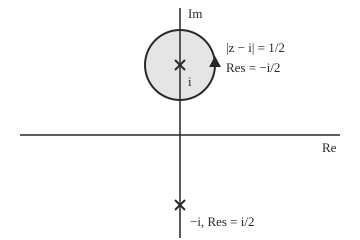

# Residues: the one coefficient that survives a loop, and three ways to compute it

[Syllabus](../../../SYLLABUS.md) → [Complex analysis](../README.md) → [Laurent Series, Singularities and Residues](../README.md#s05) → Residues

---

## General Overview

Picture a toll booth at each bad point, or singularity, of a function. The function 1/(z^2 + 1) is fine everywhere except at i and −i, where its denominator is zero. Integrate it once round a small loop about i and the toll is π, whatever the loop's size or shape, as long as it circles i alone.

Near i the function is a sum of powers of (z − i), negative powers included. Round the loop every power pays nothing except the power −1, which pays 2πi times its coefficient. At i that coefficient is −i/2, and 2πi × (−i/2) = π.

That coefficient has a real name, the **residue**: the coefficient of 1/(z − a) in the series about a bad point a. The toll is always 2πi times it. Three tools get it without the whole series: a limit at a simple pole, a derivative at a higher pole, and the series itself when neither applies. Three booths show them: 1/(z^2 + 1) at i has residue −i/2; e^z/z^3 at 0 has 1/2; z e^(1/z) at 0 has 1/2.

**The residue of a function at an isolated bad point is the coefficient of 1/(z − a) in its series there, the one term a loop round that point does not cancel; limits, derivatives or the series itself compute it.**

**What kind of fact this is:** a definition; the three ways of computing it are theorems, proved on this card in Why it works.

### The picture: the booth at i and the loop that pays it

<p align="center"></p>

To scale: 70 units per 1, with 0 at (180, 135), i at (180, 65), −i at (180, 205) and the loop's radius 1/2 drawn as 35. The triangle shows the anticlockwise direction; −i lies outside the loop.

---

## The formula

Notation first, in words. The residue of f at a is written $\operatorname{Res}(f, a)$. Near an isolated bad point, f is a two-sided power series with coefficients $c_n$ ([Laurent series](01-laurent-series.md)). A ring on the integral sign means one anticlockwise lap.

$$f(z) = \sum_{n=-\infty}^{\infty} c_n (z-a)^n, \qquad \operatorname{Res}(f, a) = c_{-1} = \frac{1}{2\pi i}\oint_{|z-a|=r} f(z)\,dz$$

**Read it aloud:** the residue is the coefficient of one over (z minus a), equal to a small loop's integral divided by 2πi.

At a **simple pole** (blowing up like 1/(z − a), no worse):

$$\operatorname{Res}(f, a) = \lim_{z \to a}\,(z-a)\,f(z) = \frac{p(a)}{q'(a)} \quad \text{when } f = \frac{p}{q},\ q(a) = 0,\ q'(a) \neq 0$$

**Read it aloud:** cancel the bad factor and let z arrive at a; for a fraction, top at a over the bottom's slope at a.

At a **pole of order m** (blows up like 1/(z − a)^m):

$$\operatorname{Res}(f, a) = \frac{1}{(m-1)!}\,\lim_{z \to a} \frac{d^{m-1}}{dz^{m-1}}\Big[(z-a)^m f(z)\Big]$$

**Read it aloud:** cancel all m bad factors, differentiate m − 1 times, let z arrive at a, divide by (m − 1) factorial.

At an **essential singularity** (no m tames it), expand and read off $c_{-1}$.

| Symbol | Plain meaning | In our example | Push it up and the answer… |
| --- | --- | --- | --- |
| $z$, $a$, $i$ | a point; the bad point; i^2 = −1 | a = i | a new booth |
| $f$ | the function | 1/(z^2 + 1) | double f, double the residue |
| $c_n$, $n$ | coefficient of (z − a)^n; the power | n = −1 gives −i/2 | only n = −1 reaches a loop |
| $\operatorname{Res}(f, a)$ | the residue | −i/2, 1/2, 1/2 | the toll, 2πi Res, follows it |
| $m$, $(m-1)!$ | pole order; 1 × 2 × … × (m − 1) | 3, and 2! = 2 | one more derivative |
| $H$ | the tamed factor (z − a)^m f(z) | e^z | — |
| $p$, $q$, $q'$ | top, bottom, the bottom's derivative | 1, z^2 + 1, 2z | q'(a) = 0 breaks p/q' |
| $r$, $N$, $h$ | loop radius; points in the loop sum; step toward a | 1/2; 4 to 64; 0.1 to 0.001 | larger N, smaller error |

### When it holds

- **The bad point is isolated.** f must be holomorphic (have a complex derivative) on a ring 0 < |z − a| < R. The logarithm at 0 fails: its branch cut runs into the point.
- **The limit and p/q' need a simple pole.** At the double pole of 1/(z^2 + 1)^2 at i, q'(i) = 0 and p/q' divides by zero; the residue is −i/4.
- **The derivative formula needs m at least the true order.** Too small and the limit blows up; too large still works.
- **An essential singularity has no m.** Only the series or the loop works.

---

## Why it works

### Step 0: a loop cancels every power except one

On the circle z = a + r e^(it), t from 0 to 2π, the step dz is i r e^(it) dt, so

$$\oint (z-a)^n\,dz = i\,r^{n+1}\int_0^{2\pi} e^{i(n+1)t}\,dt,$$

and e^(i(n+1)t) circles the origin a whole number of times, averaging 0, unless n = −1; then the integral is 2πi. Term by term, the loop returns 2πi times $c_{-1}$ alone.

### Step 1: at a simple pole, one multiplication exposes it

A simple pole means the series starts at n = −1. Multiply by (z − a): every term after the first carries a factor (z − a), so letting z arrive at a leaves $c_{-1}$.

For 1/(z^2 + 1) = 1/((z − i)(z + i)), the product (z − i)f(z) is 1/(z + i). At z = i + 0.1 it is 0.024938 − 0.498753i; at i + 0.001, 0.000250 − 0.500000i. The limit is 1/(2i) = −i/2.

### Step 2: for a fraction, the bottom's slope does the cancelling

Write f = p/q with q(a) = 0 and q'(a) ≠ 0. Near a, q(z) = q'(a)(z − a) + (terms in (z − a)^2 and up), so

$$(z-a)\frac{p(z)}{q(z)} = \frac{p(z)}{q'(a) + (\text{terms in } z-a)} \to \frac{p(a)}{q'(a)}.$$

With p = 1 and q = z^2 + 1, q'(i) = 2i: the residue at i is 1/(2i) = −i/2, and at −i it is i/2, with no factoring.

### Step 3: at a pole of order m, differentiate the tamed factor

Order m means the series starts at n = −m. Multiply by (z − a)^m and the result, H, is an ordinary power series:

$$H(z) = c_{-m} + c_{-m+1}(z-a) + \cdots + c_{-1}(z-a)^{m-1} + \cdots$$

The residue sits in the slot of power m − 1, which by Taylor's formula holds H's (m − 1)-th derivative at a divided by (m − 1)! ([Taylor series](../../06-Calculus%20and%20analysis/06-Series/05-taylor-series.md)). For e^z/z^3: m = 3, H = e^z = 1 + z + z^2/2! + …, and the z^2 slot is H''(0)/2! = 1/2.

### Step 4: at an essential singularity, read the series

Near 0, e^(1/z) = 1 + 1/z + 1/(2! z^2) + …, with infinitely many negative powers, so no m tames it ([Isolated singularities](02-classifying-singularities.md)). Multiply by z:

$$z\,e^{1/z} = z + 1 + \frac{1}{2!\,z} + \frac{1}{3!\,z^2} + \cdots$$

The only 1/z term is z × 1/(2! z^2), so the residue is 1/2. Swapping z for 1/w turns z e^(1/z) dz into −e^w/w^3 dw on a clockwise loop; the two sign flips cancel, so the second and third booths have the same residue, with matching loop errors in the code.

<details>
<summary>Detailed proof</summary>

**The loop picks out the residue.** For f holomorphic on 0 < |z − a| < R, the Laurent series converges uniformly on each circle |z − a| = r < R ([Laurent series](01-laurent-series.md)): for every ε > 0 the partial sums lie within ε of f there, their integrals within 2πrε of f's. Step 0 then gives 2πi $c_{-1}$ for every such r.

**Order m.** H(z) = (z − a)^m f(z) extends holomorphically to a, and by uniqueness of the series its Taylor coefficient of (z − a)^j is $c_{j-m}$. Taking j = m − 1 gives $c_{-1}$ = H^(m−1)(a)/(m − 1)!; the limit form holds because H's derivatives are continuous at a. With k > m in place of m, (z − a)^(k−m) H still holds $c_{-1}$ in slot k − 1, so overestimating the order is harmless.

**The quotient.** Write q(z) = (z − a)s(z) with s holomorphic and s(a) = q'(a) ≠ 0; then (z − a)p/q = p/s, whose value at a is p(a)/q'(a).

</details>

A second route for fractions of polynomials: the residues at simple poles are the coefficients of the partial fractions, as in [Rational functions](03-rational-functions-and-partial-fractions.md).

---

## Worked numbers, by hand

| Step | Arithmetic | Value |
| --- | --- | --- |
| house: split the bottom | z^2 + 1 = (z − i)(z + i), so (z − i)f = 1/(z + i) | simple pole at i |
| same by p/q' | p = 1, q'(i) = 2i | 1/(2i) = **−i/2** |
| the loop's toll | 2πi × (−i/2) | **π = 3.141593** |
| e^z/z^3: tame it | m = 3, H = e^z | H''(0) = 1 |
| divide by (m − 1)! | 1/2! | **1/2** |
| z e^(1/z): read the series | z × 1/(2! z^2) | **1/2** |

A loop round i alone costs π; round both i and −i it pays −i/2 + i/2 = 0.

### What breaks if you drop a piece

| Mistake | Comes out at | What went wrong |
| --- | --- | --- |
| Simple-pole limit on e^z/z^3 | z f(z) at z = 0.001 is 1001000.5 | order 3 needs three factors cancelled |
| Dropping the (m − 1)! | H''(0) = 1, twice the residue | a Taylor slot is the derivative divided by the factorial |
| Reading e^(1/z) instead of z e^(1/z) | 1, not 1/2 | multiplying by z shifts every power by one |
| p/q' at the double pole of 1/(z^2 + 1)^2 | q'(i) = 0: division by zero | needs a simple zero; the derivative formula gives −i/4 |

---

## Code, from first principles, and it actually runs

Two roads per booth, sharing no arithmetic. Road one is the formula: limit and p/q' for 1/(z^2 + 1), a central difference (a second derivative from three nearby values) for e^z/z^3, the series term for z e^(1/z). Road two is the loop: f times the step, summed over N points of a circle, divided by 2πi; its error is printed at N = 4, 8 and 12.

### Python

```python
# Residues -- the check behind the card.  Python standard library only.
# Three tolls, each reached by a formula and by a loop sum round a circle.
from math import cos, sin, exp, pi, floor, log10

def cexp(z):                        # e^(x+iy) = e^x (cos y + i sin y)
    return exp(z.real) * complex(cos(z.imag), sin(z.imag))

def loop(f, a, r, n):               # (1/2 pi i) x the loop integral, trapezoid, n points
    total = 0
    for k in range(n):
        w = r * complex(cos(2 * pi * k / n), sin(2 * pi * k / n))
        total += f(a + w) * w       # dz = i w dt, and dt = 2 pi / n
    return total / n

def c(z):                           # 'a + bi' with six decimals, no minus zero
    x, y = [0.0 if abs(t) < 5e-7 else t for t in (z.real, z.imag)]
    return f"{x:.6f} {'-' if y < 0 else '+'} {abs(y):.6f}i"

def sci(x):                         # 1.2e-5 style, the same in both languages
    e = floor(log10(x)); m = x / 10 ** e
    if round(m, 1) >= 10: m, e = m / 10, e + 1
    return f"{m:.1f}e{e}"

house = lambda z: 1 / (z * z + 1)
cube = lambda z: cexp(z) / z ** 3
ess = lambda z: z * cexp(1 / z)
twice = lambda z: 1 / (z * z + 1) ** 2
print("figure, 70 units per 1, 0 at (180, 135), i at (180, 65), -i at (180, 205), loop radius 35")
for h in (0.1, 0.01, 0.001):        # road 1a: the limit of (z - i) f(z)
    print(f"1/(z^2+1), limit road, (z - i) f(z) at z = i + {h}: {c(h * house(1j + h))}")
pq = 1 / (2 * 1j)                   # road 1b: p(i)/q'(i) with p = 1, q' = 2z
print(f"1/(z^2+1), p/q' road: 1/(2i) = {c(pq)} at i; 1/(-2i) = {c(1 / (-2j))} at -i")
print("1/(z^2+1), loop road r = 0.5, error: " +
      ", ".join(f"N={n} {sci(abs(loop(house, 1j, 0.5, n) - pq))}" for n in (4, 8, 12)))
res1 = loop(house, 1j, 0.5, 64)
print(f"1/(z^2+1), loop road N=64: {c(res1)}; toll 2 pi i x Res = {c(2j * pi * res1)}")
h = 1e-3                            # road 1: H = e^z, H''(0)/2! by a central difference
res2 = (cexp(h) - 2 * cexp(0) + cexp(-h)).real / h ** 2 / 2
print(f"e^z/z^3, derivative road H''(0)/2!: {res2:.6f}")
print("e^z/z^3, loop road r = 1, error: " +
      ", ".join(f"N={n} {sci(abs(loop(cube, 0, 1, n) - 0.5))}" for n in (4, 8, 12)))
res3 = 1 / 2                        # road 1: z x (1/2!) z^-2 is the only 1/z term
print(f"z e^(1/z), series road: z x 1/(2! z^2) gives {res3:.6f}")
print("z e^(1/z), loop road r = 1, error: " +
      ", ".join(f"N={n} {sci(abs(loop(ess, 0, 1, n) - res3))}" for n in (4, 8, 12)))
print(f"mistake, simple-pole limit on e^z/z^3: z f(z) at z = 0.001 is {(0.001 * cube(0.001)).real:.1f}")
print(f"mistake, dropping the 2!: H''(0) = {2 * res2:.6f}, twice the residue")
print(f"mistake, 1/z coefficient of e^(1/z) alone: {loop(lambda z: cexp(1 / z), 0, 1, 64).real:.6f}")
d4 = (1 / (1j + h + 1j) ** 2 - 1 / (1j - h + 1j) ** 2) / (2 * h)  # H = 1/(z+i)^2, H'(i)
res4 = loop(twice, 1j, 0.5, 64)
print(f"mistake, p/q' at the double pole of 1/(z^2+1)^2: q'(i) = 0; H'(i) = {c(d4)}, loop {c(res4)}")
assert abs(res1 - pq) < 1e-12                          # loop sum against p/q'
assert abs(loop(cube, 0, 1, 24) - res2) < 1e-6         # loop sum against the derivative road
assert abs(loop(ess, 0, 1, 24) - res3) < 1e-12         # loop sum against the series
assert abs(res4 - d4) < 1e-6                           # double pole: loop against H'(i)
print("ALL CHECKS PASS")
```

**Ran 2026-09-28 on macOS, Python 3.14.6, standard library only. All checks passed. Output, pasted from the run:**

```
figure, 70 units per 1, 0 at (180, 135), i at (180, 65), -i at (180, 205), loop radius 35
1/(z^2+1), limit road, (z - i) f(z) at z = i + 0.1: 0.024938 - 0.498753i
1/(z^2+1), limit road, (z - i) f(z) at z = i + 0.01: 0.002500 - 0.499988i
1/(z^2+1), limit road, (z - i) f(z) at z = i + 0.001: 0.000250 - 0.500000i
1/(z^2+1), p/q' road: 1/(2i) = 0.000000 - 0.500000i at i; 1/(-2i) = 0.000000 + 0.500000i at -i
1/(z^2+1), loop road r = 0.5, error: N=4 2.0e-3, N=8 7.6e-6, N=12 3.0e-8
1/(z^2+1), loop road N=64: 0.000000 - 0.500000i; toll 2 pi i x Res = 3.141593 + 0.000000i
e^z/z^3, derivative road H''(0)/2!: 0.500000
e^z/z^3, loop road r = 1, error: N=4 1.4e-3, N=8 2.8e-7, N=12 1.1e-11
z e^(1/z), series road: z x 1/(2! z^2) gives 0.500000
z e^(1/z), loop road r = 1, error: N=4 1.4e-3, N=8 2.8e-7, N=12 1.1e-11
mistake, simple-pole limit on e^z/z^3: z f(z) at z = 0.001 is 1001000.5
mistake, dropping the 2!: H''(0) = 1.000000, twice the residue
mistake, 1/z coefficient of e^(1/z) alone: 1.000000
mistake, p/q' at the double pole of 1/(z^2+1)^2: q'(i) = 0; H'(i) = 0.000000 - 0.250000i, loop 0.000000 - 0.250000i
ALL CHECKS PASS
```

### Rust

Same numbers, same labels, built with `rustc --edition 2021 -O`. The two outputs agree byte for byte.

```rust
// Residues -- the same check in Rust, std only, with its own complex type.
// Three tolls, each reached by a formula and by a loop sum round a circle.
use std::f64::consts::PI;
use std::ops::{Add, Div, Mul, Sub};

#[derive(Clone, Copy)]
struct C { re: f64, im: f64 }
fn cx(re: f64, im: f64) -> C { C { re, im } }
impl Add for C { type Output = C; fn add(self, o: C) -> C { cx(self.re + o.re, self.im + o.im) } }
impl Sub for C { type Output = C; fn sub(self, o: C) -> C { cx(self.re - o.re, self.im - o.im) } }
impl Mul for C { type Output = C;
    fn mul(self, o: C) -> C { cx(self.re * o.re - self.im * o.im, self.re * o.im + self.im * o.re) } }
impl Div for C { type Output = C;
    fn div(self, o: C) -> C { let d = o.re * o.re + o.im * o.im;
        cx((self.re * o.re + self.im * o.im) / d, (self.im * o.re - self.re * o.im) / d) } }
fn r(x: f64) -> C { cx(x, 0.0) }
fn abs(z: C) -> f64 { z.re.hypot(z.im) }
fn cexp(z: C) -> C { let m = z.re.exp(); cx(m * z.im.cos(), m * z.im.sin()) }

// (1/2 pi i) x the loop integral round a circle, trapezoid rule with n points
fn lp(f: &dyn Fn(C) -> C, a: C, rad: f64, n: usize) -> C {
    let mut total = r(0.0);
    for k in 0..n {
        let t = 2.0 * PI * k as f64 / n as f64;
        let w = cx(rad * t.cos(), rad * t.sin());
        total = total + f(a + w) * w;
    }
    total / r(n as f64)
}
fn c(z: C) -> String {
    let x = if z.re.abs() < 5e-7 { 0.0 } else { z.re };
    let y = if z.im.abs() < 5e-7 { 0.0 } else { z.im };
    format!("{:.6} {} {:.6}i", x, if y < 0.0 { "-" } else { "+" }, y.abs())
}
fn sci(x: f64) -> String {
    let mut e = x.log10().floor() as i32;
    let mut m = x / 10f64.powi(e);
    if (m * 10.0).round() / 10.0 >= 10.0 { m /= 10.0; e += 1; }
    format!("{:.1}e{}", m, e)
}
fn errs(f: &dyn Fn(C) -> C, a: C, rad: f64, want: C) -> String {
    [4, 8, 12].iter().map(|&n| format!("N={} {}", n, sci(abs(lp(f, a, rad, n) - want))))
        .collect::<Vec<_>>().join(", ")
}

fn main() {
    let i = cx(0.0, 1.0);
    let house = |z: C| r(1.0) / (z * z + r(1.0));
    let cube = |z: C| cexp(z) / (z * z * z);
    let ess = |z: C| z * cexp(r(1.0) / z);
    let twice = |z: C| { let q = z * z + r(1.0); r(1.0) / (q * q) };
    println!("figure, 70 units per 1, 0 at (180, 135), i at (180, 65), -i at (180, 205), loop radius 35");
    for h in [0.1, 0.01, 0.001] {
        println!("1/(z^2+1), limit road, (z - i) f(z) at z = i + {}: {}", h, c(r(h) * house(i + r(h))));
    }
    let pq = r(1.0) / (r(2.0) * i);
    println!("1/(z^2+1), p/q' road: 1/(2i) = {} at i; 1/(-2i) = {} at -i", c(pq), c(r(1.0) / (r(-2.0) * i)));
    println!("1/(z^2+1), loop road r = 0.5, error: {}", errs(&house, i, 0.5, pq));
    let res1 = lp(&house, i, 0.5, 64);
    println!("1/(z^2+1), loop road N=64: {}; toll 2 pi i x Res = {}", c(res1), c(r(2.0 * PI) * i * res1));
    let h = 1e-3; // H = e^z, H''(0)/2! by a central difference
    let res2 = (cexp(r(h)) - r(2.0) * cexp(r(0.0)) + cexp(r(-h))).re / (h * h) / 2.0;
    println!("e^z/z^3, derivative road H''(0)/2!: {:.6}", res2);
    println!("e^z/z^3, loop road r = 1, error: {}", errs(&cube, r(0.0), 1.0, r(0.5)));
    let res3 = 0.5; // z x (1/2!) z^-2 is the only 1/z term
    println!("z e^(1/z), series road: z x 1/(2! z^2) gives {:.6}", res3);
    println!("z e^(1/z), loop road r = 1, error: {}", errs(&ess, r(0.0), 1.0, r(res3)));
    println!("mistake, simple-pole limit on e^z/z^3: z f(z) at z = 0.001 is {:.1}", (r(0.001) * cube(r(0.001))).re);
    println!("mistake, dropping the 2!: H''(0) = {:.6}, twice the residue", 2.0 * res2);
    println!("mistake, 1/z coefficient of e^(1/z) alone: {:.6}", lp(&|z: C| cexp(r(1.0) / z), r(0.0), 1.0, 64).re);
    let hh = |z: C| { let s = z + i; r(1.0) / (s * s) }; // H = 1/(z+i)^2
    let d4 = (hh(i + r(h)) - hh(i - r(h))) / r(2.0 * h);
    let res4 = lp(&twice, i, 0.5, 64);
    println!("mistake, p/q' at the double pole of 1/(z^2+1)^2: q'(i) = 0; H'(i) = {}, loop {}", c(d4), c(res4));
    assert!(abs(res1 - pq) < 1e-12); // loop sum against p/q'
    assert!(abs(lp(&cube, r(0.0), 1.0, 24) - r(res2)) < 1e-6); // loop against the derivative road
    assert!(abs(lp(&ess, r(0.0), 1.0, 24) - r(res3)) < 1e-12); // loop against the series
    assert!(abs(res4 - d4) < 1e-6); // double pole: loop against H'(i)
    println!("ALL CHECKS PASS");
}
```

**Ran 2026-09-28 on macOS, rustc 1.98.1, no crates. All checks passed. Output, pasted from the run:**

```
figure, 70 units per 1, 0 at (180, 135), i at (180, 65), -i at (180, 205), loop radius 35
1/(z^2+1), limit road, (z - i) f(z) at z = i + 0.1: 0.024938 - 0.498753i
1/(z^2+1), limit road, (z - i) f(z) at z = i + 0.01: 0.002500 - 0.499988i
1/(z^2+1), limit road, (z - i) f(z) at z = i + 0.001: 0.000250 - 0.500000i
1/(z^2+1), p/q' road: 1/(2i) = 0.000000 - 0.500000i at i; 1/(-2i) = 0.000000 + 0.500000i at -i
1/(z^2+1), loop road r = 0.5, error: N=4 2.0e-3, N=8 7.6e-6, N=12 3.0e-8
1/(z^2+1), loop road N=64: 0.000000 - 0.500000i; toll 2 pi i x Res = 3.141593 + 0.000000i
e^z/z^3, derivative road H''(0)/2!: 0.500000
e^z/z^3, loop road r = 1, error: N=4 1.4e-3, N=8 2.8e-7, N=12 1.1e-11
z e^(1/z), series road: z x 1/(2! z^2) gives 0.500000
z e^(1/z), loop road r = 1, error: N=4 1.4e-3, N=8 2.8e-7, N=12 1.1e-11
mistake, simple-pole limit on e^z/z^3: z f(z) at z = 0.001 is 1001000.5
mistake, dropping the 2!: H''(0) = 1.000000, twice the residue
mistake, 1/z coefficient of e^(1/z) alone: 1.000000
mistake, p/q' at the double pole of 1/(z^2+1)^2: q'(i) = 0; H'(i) = 0.000000 - 0.250000i, loop 0.000000 - 0.250000i
ALL CHECKS PASS
```

> [!TIP]
> **Try changing**
> - **Widen the house loop.** Guess first: the N=64 line at r = 1.5, then r = 2.5? At 1.5 the circle still misses −i: −i/2 again. At 2.5 it encloses both booths: −i/2 + i/2 = 0.
> - **Starve the loop.** Guess first: N = 8 in place of 64? Off by 7.6e-6, the N=8 error already printed.
> - **Lower the pole.** Guess first: change e^z/z^3 to e^z/z^2. Now m = 2 and the residue is H'(0) = 1, the same number the "dropping the 2!" line prints.

---

## The usual mistake

> [!warning]
> **The residue is not the value of the tamed factor.** At a pole of order m it is the slot of power m − 1 in H's series; only at a simple pole is that slot H(a). For e^z/z^3, H(0) = 1 but the residue is 1/2.
>
> - **Assuming a pole is simple.** For e^z/z^3, z f(z) = 1001000.5 at z = 0.001, a limit that never settles.
> - **Losing the shift.** Multiplying by z moves every coefficient one place: e^(1/z) has residue 1, z e^(1/z) has 1/2.
> - **Reading a zero residue as no pole.** 1/z^2 has residue 0, yet a pole of order 2.
> - **Quoting the toll as the residue.** The loop round i pays 2πi times the residue: π = 3.141593, while the residue is −i/2.

---

## Where you meet it in real life

- **Real integrals.** The integral of 1/(1 + x^2) over the real line is π, the booth at i's toll, proved by closing the line into a loop in [The residue theorem](05-the-residue-theorem.md).
- **Circuits and control.** A circuit's response, written as a fraction in a complex variable, returns to a signal in time as a sum of residues at its poles; the engineers' "cover-up" trick is the simple-pole limit.
- **Counting primes.** Perron's formula reads sums over whole numbers off residues of zeta-built functions.

> **Say it back**
> Near an isolated bad point a function is a series in powers of (z − a), negative ones included. A loop round the point returns 2πi times the coefficient of 1/(z − a): the residue. At a simple pole, cancel the bad factor and take the limit, or divide the top by the bottom's slope. At a pole of order m, differentiate the tamed factor m − 1 times and divide by (m − 1)!; at an essential singularity, read the series.

---

## What this builds on

- [Isolated singularities](02-classifying-singularities.md): the pole order m, and why e^(1/z) has none.

## Where this goes next

- [The residue theorem](05-the-residue-theorem.md): a loop round several booths pays the sum of their tolls, 2πi times the sum of their residues.
- Perron's formula: residues turning a sum over whole numbers into a loop integral.

---

## Sources

Verified 2026-09-28: every link below resolves to the publisher's page.

- Lebl, Jiří. *Guide to Cultivating Complex Analysis*. [Book page and free text](https://www.jirka.org/ca/). Defines the residue as a Laurent coefficient and derives the pole formulas.
- Stein, Elias M., and Rami Shakarchi. *Complex Analysis*. Princeton University Press, 2003. [Publisher page](https://press.princeton.edu/books/hardcover/9780691113852/complex-analysis). Chapter 3 proves the order-m formula.
- Orloff, Jeremy. *Complex Variables with Applications*, MIT 18.04, Spring 2018. MIT OpenCourseWare. [Lecture notes](https://ocw.mit.edu/courses/18-04-complex-variables-with-applications-spring-2018/pages/lecture-notes/). Worked residues at simple, higher and essential singularities.
