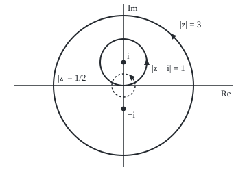

# The residue theorem: a loop integral is 2 pi i times the sum of the residues inside

[Syllabus](../../../SYLLABUS.md) → [Complex analysis](../../../SYLLABUS.md#w07) → [Laurent Series, Singularities and Residues](../../../SYLLABUS.md#w07-s05) → The residue theorem

---

## General Overview

Take f(z) = 1/(z^2 + 1). It is finite everywhere in the plane except at i and −i, where z^2 + 1 is zero. Think of those two points as toll booths on a free road.

Walk once anticlockwise round the circle of radius 1 centred at i, adding f(z) times each small step dz. That sum is the loop integral ([Deforming a loop](../03-Contour%20Integrals%20and%20Cauchy%27s%20Theorem/04-deforming-contours-and-winding-numbers.md)). At 64 points it comes to 3.141593: π to six decimals. Round the circle of radius 3 centred at 0, enclosing both booths, the total is 0. Round radius 1/2, enclosing neither, it is 0 again.

Each booth inside charges a fixed toll; booths outside charge nothing. From here on the booths are **poles**: points where a function blows up like one over a power of the distance. The toll at a pole is 2πi times a single number, the pole's **residue** ([Residues](04-residues.md)). The pole at i has residue −i/2, so its toll is 2πi × (−i/2) = π. The pole at −i has residue i/2 and toll −π. Round both, the tolls cancel.

**A loop integral of a function that is smooth except at a few isolated points depends only on which of those points the loop encloses: it equals 2πi times the sum of their residues.**

**What kind of fact this is:** a theorem, proved on this card in Why it works, with the full argument in a folded Detailed proof.

### The picture: three loops and two tolls

<p align="center"></p>

To scale: 34 units per 1, with 0 at (180, 125), i at (180, 91) and −i at (180, 159). Radii 34, 102 and 17 draw |z − i| = 1, |z| = 3 and the dashed |z| = 1/2; triangles show the direction. The code's fourth loop, |z + i| = 1, mirrors the first below the real axis.

---

## The formula

Reminder: a loop is written $\gamma$ (gamma), the integral round it with a ringed integral sign, and the residue at a point a, $\operatorname{Res}(f, a)$, is the coefficient of 1/(z − a) in the Laurent series of f round a ([Laurent series](01-laurent-series.md)).

$$\oint_\gamma f(z)\,dz = 2\pi i \sum_{k=1}^{m} \operatorname{Res}(f, a_k)$$

**Read it aloud:** the integral of f once anticlockwise round the loop equals two pi i times the sum of the residues at the singular points inside it.

For a loop that winds more than once, or clockwise, each residue is weighted by its winding number:

$$\oint_\gamma f(z)\,dz = 2\pi i \sum_{k=1}^{m} n(\gamma, a_k)\,\operatorname{Res}(f, a_k)$$

**Read it aloud:** each pole pays its toll once per anticlockwise turn round it.

| Symbol | Plain meaning | In our example | Push it up and the answer… |
| --- | --- | --- | --- |
| $f$, $z$ | the function, and its input point | 1/(z^2 + 1) | — |
| $\gamma$ | a closed loop, run anticlockwise | \|z − i\| = 1 | may catch more poles |
| $a$, $a_k$, $m$ | an isolated singular point; the k-th inside; their count | i; m = 1 | one more toll |
| $\operatorname{Res}(f, a)$ | the residue | −i/2 at i, i/2 at −i | a bigger toll |
| $c_n$ | Laurent coefficient of (z − a)^n; at n = −1, the residue | −i/2 at n = −1 | — |
| $\rho$, $\theta$ | small-circle radius; angle round it | 0.01; 0 to 2π | nothing changes |
| $n(\gamma, a)$ | winding number: net anticlockwise turns round a | 1; 2 run twice | the toll repeats |
| $i$, $\pi$ | i^2 = −1, a quarter turn; the half-turn angle | 2πi ≈ 6.283185i | — |

### When it holds

- **f is holomorphic (has a complex derivative) on and inside the loop, except at finitely many isolated points.** Drop this and the count means nothing: z-bar has no poles, yet its integral round |z| = 1 is 2πi.
- **No singular point sits on the loop itself.** The circle |z| = 1 runs through i and −i, where f is infinite; the integral along it does not exist.
- **Winding numbers count.** A simple anticlockwise loop winds once round each point inside, zero times round each outside. Run clockwise, |z − i| = 1 gives −π; twice, 2π.

---

## Why it works

### Step 0: away from the poles, a loop can be moved freely

Sliding a loop across a region where f is holomorphic leaves its integral unchanged, as proved on [Deforming a loop](../03-Contour%20Integrals%20and%20Cauchy%27s%20Theorem/04-deforming-contours-and-winding-numbers.md). So the loop can shrink until only tiny circles remain, one round each pole inside.

### Step 1: shrink the loop onto small circles

Pull |z − i| = 1 in towards i. At radius 0.01 the 64-point sum still gives 3.141593. With several poles inside, the loop is pinched into one small circle per pole, joined by thin corridors walked once each way, which cancel. What remains is the sum of the small-circle integrals.

### Step 2: on a small circle, only the 1/(z − a) term survives

Near a pole a, f is its Laurent series: terms $c_n$ times (z − a)^n, for n over all whole numbers. Walk a circle of radius $\rho$ round a: z = a + ρe^(iθ), so dz = iρe^(iθ) dθ as the angle $\theta$ runs from 0 to 2π. One term then gives

(z − a)^n dz = i ρ^(n+1) e^(i(n+1)θ) dθ.

For n other than −1, e^(i(n+1)θ) turns a whole number of times round, and the arrows cancel to 0. For n = −1 the factor is e^0 = 1, and the integral is i × 2π = 2πi, whatever the radius. So the circle keeps exactly 2πi times $c_n$ at n = −1, which is the residue.

For f = 1/((z − i)(z + i)) near i, the factor 1/(z + i) is close to 1/(2i), so the residue is 1/(2i) = −i/2.

### Step 3: add the tolls

Each small circle pays 2πi times its residue, and the loop pays their sum. For |z − i| = 1 it is 2πi × (−i/2) = −πi^2 = π.

<details>
<summary>Detailed proof</summary>

Let f be holomorphic on an open set containing the loop $\gamma$ and its inside, except at points $a_1, \dots, a_m$ inside, none on $\gamma$. Choose $\rho > 0$ so small that the closed discs of radius $\rho$ round each $a_k$ are disjoint and lie inside $\gamma$.

**Deformation.** Join $\gamma$ to each small circle by a corridor. The result is one loop: $\gamma$ anticlockwise, each small circle clockwise, each corridor twice in opposite directions, with f holomorphic on and inside it. By Cauchy's theorem its integral is 0. The corridors cancel, so the integral round $\gamma$ is the sum of the anticlockwise small-circle integrals.

**Termwise integration.** For some radius $R > \rho$ reaching no other singular point, on the punctured disc $0 < |z - a_k| < R$, f equals its Laurent series $\sum_n c_n (z - a_k)^n$, and the series converges uniformly on the circle $|z - a_k| = \rho$: for each $\varepsilon > 0$ there is an N with the partial sums over $|n| \le N$ within $\varepsilon$ of f at every point of the circle. So the integral of f round the circle is the limit of the integrals of the partial sums, each within $2\pi\rho\,\varepsilon$ of it. Each partial sum integrates term by term, and Step 2 gives $2\pi i\, c_{-1}$ for every $N \ge 1$. Hence the small circle gives $2\pi i \operatorname{Res}(f, a_k)$.

**Winding numbers.** For a general loop lying in a disc where f is holomorphic except at the $a_k$, subtract from f the negative-power terms at each pole. The remainder has no singular points left and integrates to 0; powers below −1 have antiderivatives and integrate to 0; each $c_{-1}/(z - a_k)$ gives $2\pi i\, n(\gamma, a_k)\, c_{-1}$ by the definition of the winding number.

</details>

A second road, for rational functions: partial fractions ([Rational functions](03-rational-functions-and-partial-fractions.md)). Here 1/(z^2 + 1) = (1/(2i)) × (1/(z − i) − 1/(z + i)), and each 1/(z − a) round a loop gives 2πi times the winding number round a.

---

## Worked numbers, by hand

| Step | Arithmetic | Value |
| --- | --- | --- |
| Find the poles | z^2 + 1 = (z − i)(z + i) = 0 | i and −i |
| Residue at i | 1/(z + i) at z = i is 1/(2i) = −i/2, since i × (−i) = 1 | −i/2 |
| Residue at −i | 1/(z − i) at z = −i is 1/(−2i) | i/2 |
| \|z − i\| = 1 | −i at distance 2: only i inside | 2πi × (−i/2) = **π = 3.141593** |
| \|z + i\| = 1 | only −i inside | 2πi × (i/2) = −π = −3.141593 |
| \|z\| = 3 | both at distance 1, inside | 2πi × (−i/2 + i/2) = **0** |
| \|z\| = 1/2 | both at distance 1, outside | **0** |

Any loop avoiding the poles pays π times its winding number round i, minus π times its winding number round −i. Shape and size matter only through those two counts.

### What breaks if you drop a piece

| Mistake | Comes out at | What went wrong |
| --- | --- | --- |
| \|z − i\| = 1 run clockwise | −3.141593 | winding number −1 |
| Residue at i taken as 1 | 6.283185i | the factor 1/(z + i) dropped |
| Both residues summed for \|z − i\| = 1 | 0, not π | the pole at −i is outside |
| z-bar round \|z\| = 1, as if the theorem applied | 6.283185i, not 0 | z-bar is not holomorphic |

The code prints all four.

---

## Code, from first principles, and it actually runs

Two roads. Road one takes each residue by its own limit, (z − a)f(z) with the factor cancelled and z set to a, times 2πi. Road two ignores residues: it adds f(z) dz at 64 evenly spaced points round each circle, a trapezoid sum. The error of that sum on |z − i| = 1 falls from 1.2e-2 at 8 points to 4.8e-5 at 16 and 7.3e-10 at 32. The asserts check the four circles, the shrunk circle, the double turn and the z-bar break.

### Python

```python
# The residue theorem -- the check behind the card.  f(z) = 1/(z^2 + 1) has
# poles at i and -i.  Road one: each residue by its own limit, times 2 pi i.
# Road two: a trapezoid sum of f(z) dz round each circle, nothing borrowed.
import math
POLES = [1j, -1j]

def f(z):
    return 1 / (z * z + 1)

def loop(g, c, r, n, turns=1):          # trapezoid sum of g(z) dz round |z - c| = r
    total, step = 0, 2 * math.pi / n * (1 if turns > 0 else -1)
    for k in range(n * abs(turns)):
        w = complex(math.cos(k * step), math.sin(k * step))
        total += g(c + r * w) * 1j * r * w * step
    return total

def res(a):                             # (z - a) f(z) = 1/(z - b), b the other pole; let z -> a
    b = [p for p in POLES if p != a][0]
    return 1 / (a - b)

def show(z):
    re, im = round(z.real, 6) + 0.0, round(z.imag, 6) + 0.0
    return f"{re:.6f} {'-' if im < 0 else '+'} {abs(im):.6f}i"

def sci(x):
    e = math.floor(math.log10(x))
    return f"{x / 10 ** e:.1f}e{e}"

TWO_PI_I = 2j * math.pi
print(f"residue at i, by the limit: {show(res(1j))}; at -i: {show(res(-1j))}")
circles = [("|z - i| = 1", 1j, 1), ("|z + i| = 1", -1j, 1), ("|z| = 3", 0, 3), ("|z| = 1/2", 0, 0.5)]
gaps = []
for name, c, r in circles:
    inside = [a for a in POLES if abs(a - c) < r]
    theorem = TWO_PI_I * sum(res(a) for a in inside)
    direct = loop(f, c, r, 64)
    gaps.append(abs(direct - theorem))
    tag = ", ".join("i" if a == 1j else "-i" for a in inside) or "none"
    print(f"{name}: encloses {tag}; 2 pi i x residues = {show(theorem)}; trapezoid, 64 points = {show(direct)}")
errs = [abs(loop(f, 1j, 1, n) - math.pi) for n in (8, 16, 32)]
print(f"|z - i| = 1, trapezoid error at 8, 16, 32 points: {', '.join(sci(e) for e in errs)}")
tiny, big = loop(f, 1j, 0.01, 64), loop(f, 1j, 1, 64)
print(f"shrunk to |z - i| = 0.01: {show(tiny)}")
twice = loop(f, 1j, 1, 64, turns=2)
print(f"twice round |z - i| = 1: {show(twice)}")
print(f"mistake, |z - i| = 1 run clockwise: {show(loop(f, 1j, 1, 64, turns=-1))}")
print(f"mistake, residue at i taken as 1: 2 pi i x 1 = {show(TWO_PI_I)}")
print(f"mistake, |z - i| = 1 with the outside pole counted too: {show(TWO_PI_I * (res(1j) + res(-1j)))}")
conj = loop(lambda z: z.conjugate(), 0, 1, 64)
print(f"break, z-bar round |z| = 1 (no poles, not holomorphic): {show(conj)}, not 0")
s, cx, cy = 34, 180, 125
print(f"figure, {s} units per 1, 0 at ({cx}, {cy}); i at ({cx}, {cy - s}), -i at ({cx}, {cy + s}); "
      f"radii {s}, {3 * s}, {s // 2}")
assert max(gaps) < 1e-9                                  # two roads agree on all four circles
assert abs(tiny - big) < 1e-9 and errs[2] < errs[1] < errs[0]  # shrinking the loop changes nothing
assert abs(twice - 2 * TWO_PI_I * res(1j)) < 1e-9        # winding twice counts the residue twice
assert abs(conj - TWO_PI_I) < 1e-9                       # z-bar dz = i d(theta) round the unit circle
print("ALL CHECKS PASS")
```

**Ran 2026-09-28 on macOS, Python 3.14.6, standard library only. All checks passed. Output, pasted from the run:**

```
residue at i, by the limit: 0.000000 - 0.500000i; at -i: 0.000000 + 0.500000i
|z - i| = 1: encloses i; 2 pi i x residues = 3.141593 + 0.000000i; trapezoid, 64 points = 3.141593 + 0.000000i
|z + i| = 1: encloses -i; 2 pi i x residues = -3.141593 + 0.000000i; trapezoid, 64 points = -3.141593 + 0.000000i
|z| = 3: encloses i, -i; 2 pi i x residues = 0.000000 + 0.000000i; trapezoid, 64 points = 0.000000 + 0.000000i
|z| = 1/2: encloses none; 2 pi i x residues = 0.000000 + 0.000000i; trapezoid, 64 points = 0.000000 + 0.000000i
|z - i| = 1, trapezoid error at 8, 16, 32 points: 1.2e-2, 4.8e-5, 7.3e-10
shrunk to |z - i| = 0.01: 3.141593 + 0.000000i
twice round |z - i| = 1: 6.283185 + 0.000000i
mistake, |z - i| = 1 run clockwise: -3.141593 + 0.000000i
mistake, residue at i taken as 1: 2 pi i x 1 = 0.000000 + 6.283185i
mistake, |z - i| = 1 with the outside pole counted too: 0.000000 + 0.000000i
break, z-bar round |z| = 1 (no poles, not holomorphic): 0.000000 + 6.283185i, not 0
figure, 34 units per 1, 0 at (180, 125); i at (180, 91), -i at (180, 159); radii 34, 102, 17
ALL CHECKS PASS
```

### Rust

Same numbers, same labels, built with `rustc --edition 2021 -O`. Complex arithmetic is a small struct written out at the top.

```rust
// The residue theorem -- the same check as the Python, in Rust.  No crates.
// f(z) = 1/(z^2 + 1) has poles at i and -i.  Road one: each residue by its own
// limit, times 2 pi i.  Road two: a trapezoid sum of f(z) dz round each circle.
use std::f64::consts::PI;
use std::ops::{Add, Div, Mul, Sub};
#[derive(Clone, Copy, PartialEq)]
struct C { re: f64, im: f64 }
impl Add for C { type Output = C; fn add(self, o: C) -> C { C { re: self.re + o.re, im: self.im + o.im } } }
impl Sub for C { type Output = C; fn sub(self, o: C) -> C { C { re: self.re - o.re, im: self.im - o.im } } }
impl Mul for C { type Output = C; fn mul(self, o: C) -> C {
    C { re: self.re * o.re - self.im * o.im, im: self.re * o.im + self.im * o.re } } }
impl Div for C { type Output = C; fn div(self, o: C) -> C {
    let d = o.re * o.re + o.im * o.im;
    C { re: (self.re * o.re + self.im * o.im) / d, im: (self.im * o.re - self.re * o.im) / d } } }
fn c(re: f64, im: f64) -> C { C { re, im } }
fn abs(z: C) -> f64 { (z.re * z.re + z.im * z.im).sqrt() }
const I: C = C { re: 0.0, im: 1.0 };
const POLES: [C; 2] = [C { re: 0.0, im: 1.0 }, C { re: 0.0, im: -1.0 }];

fn f(z: C) -> C { c(1.0, 0.0) / (z * z + c(1.0, 0.0)) }

fn lp(g: &dyn Fn(C) -> C, cen: C, r: f64, n: usize, turns: i32) -> C {  // trapezoid sum of g(z) dz
    let step = 2.0 * PI / n as f64 * if turns > 0 { 1.0 } else { -1.0 };
    let mut total = c(0.0, 0.0);
    for k in 0..n * turns.unsigned_abs() as usize {
        let w = c((k as f64 * step).cos(), (k as f64 * step).sin());
        total = total + g(cen + c(r, 0.0) * w) * I * c(r, 0.0) * w * c(step, 0.0);
    }
    total
}

fn res(a: C) -> C {                    // (z - a) f(z) = 1/(z - b), b the other pole; let z -> a
    let b = if a == POLES[0] { POLES[1] } else { POLES[0] };
    c(1.0, 0.0) / (a - b)
}

fn show(z: C) -> String {
    let (re, im) = ((z.re * 1e6).round() / 1e6 + 0.0, (z.im * 1e6).round() / 1e6 + 0.0);
    format!("{:.6} {} {:.6}i", re, if im < 0.0 { "-" } else { "+" }, im.abs())
}

fn sci(x: f64) -> String { let e = x.log10().floor(); format!("{:.1}e{}", x / 10f64.powf(e), e as i32) }

fn main() {
    let two_pi_i = c(0.0, 2.0 * PI);
    println!("residue at i, by the limit: {}; at -i: {}", show(res(POLES[0])), show(res(POLES[1])));
    let circles = [("|z - i| = 1", POLES[0], 1.0), ("|z + i| = 1", POLES[1], 1.0),
                   ("|z| = 3", c(0.0, 0.0), 3.0), ("|z| = 1/2", c(0.0, 0.0), 0.5)];
    let mut gap: f64 = 0.0;
    for (name, cen, r) in circles {
        let inside: Vec<C> = POLES.iter().copied().filter(|&a| abs(a - cen) < r).collect();
        let theorem = inside.iter().fold(c(0.0, 0.0), |s, &a| s + two_pi_i * res(a));
        let direct = lp(&f, cen, r, 64, 1);
        gap = gap.max(abs(direct - theorem));
        let tags: Vec<&str> = inside.iter().map(|&a| if a == POLES[0] { "i" } else { "-i" }).collect();
        let tag = if tags.is_empty() { "none".to_string() } else { tags.join(", ") };
        println!("{}: encloses {}; 2 pi i x residues = {}; trapezoid, 64 points = {}", name, tag, show(theorem), show(direct));
    }
    let errs: Vec<f64> = [8, 16, 32].iter().map(|&n| abs(lp(&f, I, 1.0, n, 1) - c(PI, 0.0))).collect();
    println!("|z - i| = 1, trapezoid error at 8, 16, 32 points: {}", errs.iter().map(|&e| sci(e)).collect::<Vec<_>>().join(", "));
    let (tiny, big) = (lp(&f, I, 0.01, 64, 1), lp(&f, I, 1.0, 64, 1));
    println!("shrunk to |z - i| = 0.01: {}", show(tiny));
    let twice = lp(&f, I, 1.0, 64, 2);
    println!("twice round |z - i| = 1: {}", show(twice));
    println!("mistake, |z - i| = 1 run clockwise: {}", show(lp(&f, I, 1.0, 64, -1)));
    println!("mistake, residue at i taken as 1: 2 pi i x 1 = {}", show(two_pi_i));
    println!("mistake, |z - i| = 1 with the outside pole counted too: {}", show(two_pi_i * (res(POLES[0]) + res(POLES[1]))));
    let conj = lp(&|z: C| c(z.re, -z.im), c(0.0, 0.0), 1.0, 64, 1);
    println!("break, z-bar round |z| = 1 (no poles, not holomorphic): {}, not 0", show(conj));
    let (s, cx, cy) = (34, 180, 125);
    println!("figure, {} units per 1, 0 at ({}, {}); i at ({}, {}), -i at ({}, {}); radii {}, {}, {}",
             s, cx, cy, cx, cy - s, cx, cy + s, s, 3 * s, s / 2);
    assert!(gap < 1e-9);                                          // two roads agree on all four circles
    assert!(abs(tiny - big) < 1e-9 && errs[2] < errs[1] && errs[1] < errs[0]); // shrinking changes nothing
    assert!(abs(twice - c(2.0, 0.0) * two_pi_i * res(POLES[0])) < 1e-9); // winding twice counts it twice
    assert!(abs(conj - two_pi_i) < 1e-9);                         // z-bar dz = i d(theta) round |z| = 1
    println!("ALL CHECKS PASS");
}
```

**Ran 2026-09-28 on macOS, rustc 1.98.1, no crates. All checks passed. Output, pasted from the run:**

```
residue at i, by the limit: 0.000000 - 0.500000i; at -i: 0.000000 + 0.500000i
|z - i| = 1: encloses i; 2 pi i x residues = 3.141593 + 0.000000i; trapezoid, 64 points = 3.141593 + 0.000000i
|z + i| = 1: encloses -i; 2 pi i x residues = -3.141593 + 0.000000i; trapezoid, 64 points = -3.141593 + 0.000000i
|z| = 3: encloses i, -i; 2 pi i x residues = 0.000000 + 0.000000i; trapezoid, 64 points = 0.000000 + 0.000000i
|z| = 1/2: encloses none; 2 pi i x residues = 0.000000 + 0.000000i; trapezoid, 64 points = 0.000000 + 0.000000i
|z - i| = 1, trapezoid error at 8, 16, 32 points: 1.2e-2, 4.8e-5, 7.3e-10
shrunk to |z - i| = 0.01: 3.141593 + 0.000000i
twice round |z - i| = 1: 6.283185 + 0.000000i
mistake, |z - i| = 1 run clockwise: -3.141593 + 0.000000i
mistake, residue at i taken as 1: 2 pi i x 1 = 0.000000 + 6.283185i
mistake, |z - i| = 1 with the outside pole counted too: 0.000000 + 0.000000i
break, z-bar round |z| = 1 (no poles, not holomorphic): 0.000000 + 6.283185i, not 0
figure, 34 units per 1, 0 at (180, 125); i at (180, 91), -i at (180, 159); radii 34, 102, 17
ALL CHECKS PASS
```

The two outputs match line for line.

> [!TIP]
> **Try changing**
> Guess first, then run it.
> - **Fewer points.** Change `loop(f, c, r, 64)` to `loop(f, c, r, 8)` inside the circle loop. The trapezoid misses π in the second decimal, and the first assert stops the run.
> - **Put a pole on the loop.** Give the first circle radius 2. One of its 64 points lands on −i, the sum explodes, and the first assert stops the run.
> - **Swap the sign of the residue.** Change `1 / (a - b)` to `1 / (b - a)`. Road one now says −π for |z − i| = 1; road two still says π, and the first assert stops the run.

---

## The usual mistake

> [!warning]
> **Counting every pole of the function, not the poles inside the loop.** The same f gives π, −π or 0 depending on which poles the loop surrounds. Summing both residues for |z − i| = 1 gives 0; the true value is π.
>
> - **Dropping the rest of the function.** At i the residue is 1/(2i), not 1: the factor 1/(z + i) is evaluated at the pole. Taking 1 gives 6.283185i.
> - **Losing the direction.** Clockwise reverses the sign: −3.141593 instead of π.
> - **Using the theorem where f is not holomorphic.** z-bar has no singular points, so a residue count predicts 0; its integral round |z| = 1 is 6.283185i.

---

## Where you meet it in real life

- **Integrals along the real line.** The integral of 1/(1 + x^2) over the whole real line is π, the toll at i, once a large half circle closes the line into a loop: [The semicircle contour](../06-Real%20Integrals%20and%20Counting%20Zeros/01-semicircle-contours.md).
- **Integrals of sines and cosines over a full turn.** z = e^(iθ) makes them loops round |z| = 1: [Integrals round a full turn](../06-Real%20Integrals%20and%20Counting%20Zeros/02-trigonometric-integrals-on-the-unit-circle.md).
- **Control and signal engineering.** A system's response over time is a residue sum over its poles: [Inverting a Laplace transform](../08-Transforms%20in%20Outline/07-inverse-laplace-by-residues.md).
- **Counting roots.** The residues of f′/f count the zeros of f inside a loop: [The argument principle](../06-Real%20Integrals%20and%20Counting%20Zeros/06-the-argument-principle.md).
- **The primes.** Riemann's prime-counting formula is a residue sum over the zeros of zeta: The explicit formula.

> **Say it back**
> A loop integral of a function holomorphic except at isolated points depends only on which points the loop surrounds. Shrink the loop onto small circles round them. On each, only the 1/(z − a) term survives, giving 2πi times the residue. Add them, weighted by winding number. For 1/(z^2 + 1), a loop round i pays π, round −i pays −π, round both or neither pays 0.

---

## What this builds on

- [Residues](04-residues.md): what a residue is, and how to compute one at a simple pole.
- [Deforming a loop](../03-Contour%20Integrals%20and%20Cauchy%27s%20Theorem/04-deforming-contours-and-winding-numbers.md): moving a loop without changing its integral, and the winding number that weights each residue.

## Where this goes next

- [The semicircle contour](../06-Real%20Integrals%20and%20Counting%20Zeros/01-semicircle-contours.md): real integrals closed by a half circle.
- [Integrals round a full turn](../06-Real%20Integrals%20and%20Counting%20Zeros/02-trigonometric-integrals-on-the-unit-circle.md): trigonometric integrals as loops.
- [The keyhole contour](../06-Real%20Integrals%20and%20Counting%20Zeros/05-keyhole-contours.md): loops dodging a branch cut.
- [The argument principle](../06-Real%20Integrals%20and%20Counting%20Zeros/06-the-argument-principle.md): the residues of f′/f count zeros.
- [Inverting a Laplace transform](../08-Transforms%20in%20Outline/07-inverse-laplace-by-residues.md): signals as sums over poles.
- The explicit formula: primes as a residue sum.

---

## Sources

Verified 2026-09-28: every link below resolves to the publisher's page.

- Stein, Elias M., and Rami Shakarchi. *Complex Analysis*. Princeton Lectures in Analysis II. Princeton University Press, 2003. [Publisher page](https://press.princeton.edu/books/hardcover/9780691113852/complex-analysis). Chapter 3: the residue formula, by small circles.
- Orloff, Jeremy. "Topic 8: Residue Theorem." 18.04 Complex Variables with Applications, MIT OpenCourseWare, Spring 2018. [Course notes](https://ocw.mit.edu/courses/18-04-complex-variables-with-applications-spring-2018/resources/mit18_04s18_topic8/). Free; the theorem, a proof and worked examples.
- O'Connor, J. J., and E. F. Robertson. "Augustin-Louis Cauchy." MacTutor Archive, University of St Andrews. [Biography](https://mathshistory.st-andrews.ac.uk/Biographies/Cauchy/). Dates Cauchy's calculus of residues to 1826.
