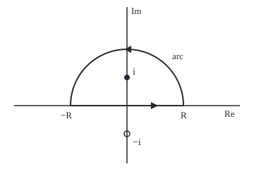

# The semicircle contour: close the real line with a big arc, let the arc vanish, and read the integral off the poles above

[Syllabus](../../../SYLLABUS.md) → [Complex analysis](../README.md) → [Real Integrals and Counting Zeros](../README.md#s06) → The semicircle contour

---

## General Overview

A lighthouse stands 1 km off a long, straight shore. Its beam turns at a steady rate. For half of each turn it faces the shore, and its spot runs along the sand: slowly at the foot, the point nearest the lamp, then ever faster towards the horizon.

At x km from the foot, the share of the half-turn landing on each kilometre is 1/(π(1 + x^2)): 0.318310 per km at the foot. The kilometre either side of the foot gets exactly half the sweep; the 2 km either side get 0.704833. The whole shore must get a share of 1, so the area under 1/(1 + x^2) over the whole real line must be π.

This card finds that area without an antiderivative. Walk the real line from −R to R and return along a half-circle of radius R above it: a closed loop. The residue theorem prices the loop from the one pole inside, at i. The half-circle's part shrinks to nothing as R grows, so the loop's value is the real integral. The same steps give π/2 for 1/(1 + x^2)^2, where the pole is double.

**For a ratio of polynomials whose bottom degree beats the top by at least 2, with no zero of the bottom on the real line, the integral over the whole real line is 2πi times the sum of the residues at the poles above the real axis.**

**What kind of fact this is:** a theorem, proved on this card in Why it works from the residue theorem and the ML bound.

### The picture: the loop at R = 2

<p align="center"></p>

To scale: 40 units per 1, 0 at (180, 150). Segment from (100.00, 150.00) to (260.00, 150.00), arc top (180.00, 70.00), pole i at (180.00, 110.00) inside, pole −i at (180.00, 190.00) outside (hollow). Triangles show the anticlockwise direction.

---

## The formula

A reminder: the residue of f at a pole a, written $\operatorname{Res}(f, a)$, is the coefficient of 1/(z − a) in f's expansion near a, and a loop integral equals 2πi times the residues inside ([The residue theorem](../05-Laurent%20Series%2C%20Singularities%20and%20Residues/05-the-residue-theorem.md)).

Let $f = p/q$ be a ratio of polynomials, q never zero on the real line, and the degree of q at least that of p plus 2. Then

$$\int_{-\infty}^{\infty} f(x)\,dx = 2\pi i \sum_{\operatorname{Im} a > 0} \operatorname{Res}(f, a).$$

**Read it aloud:** the area under f along the whole real line is 2πi times its residues above the axis.

The engine is one exact equation, true once R exceeds every pole's distance from 0:

$$\int_{-R}^{R} f(x)\,dx + \int_{C_R} f(z)\,dz = 2\pi i \sum_{\operatorname{Im} a > 0} \operatorname{Res}(f, a).$$

**Read it aloud:** segment plus arc equals the residue sum, at every finite radius.

The **ML bound** kills the arc: a path integral's size is at most M, the function's largest size on the path, times L, the path's length.

| Symbol | Plain meaning | In our example | Push it up and the answer… |
| --- | --- | --- | --- |
| $x$, $z$ | a point on the shore, in km; a point of the plane | x = 1 | — |
| $f$, $p$, $q$ | the function integrated; its top and bottom polynomials | 1/(1 + z^2), and its square | a bigger bottom degree: faster fall-off |
| $i$, $\pi$ | the quarter turn, with i^2 = −1; a half turn in radians | pole at i | — |
| $a$ | a pole: a zero of q, where f blows up | i and −i | only those above the axis count |
| $R$ | the radius of the half-circle, and how far along the shore | 2, 4, 8, 16 | the arc's share shrinks |
| $C_R$, $t$ | the upper arc $z = Re^{it}$, t running from 0 to π | length 2π at R = 2 | longer arc, far smaller f |
| $M$, $L$ | the largest size of f on the arc; the arc's length πR | M ≤ 1/(R^2 − 1) | bound tends to 0 |
| $\theta$ | the beam's angle from the line to the foot, with x = tan θ | 0 at the foot | the spot runs faster |

### When it holds

- **Bottom degree at least top degree plus 2.** Then f shrinks like 1/R^2 on the arc and ML gives about π/R. With a gap of 1, as in z/(1 + z^2), the arc stays at πi for every R > 1.
- **No pole on the real line.** Otherwise the real integral itself blows up; [Poles on the path](04-indented-contours-and-principal-values.md) handles it.
- **Both tails converge on their own.** The loop gives the symmetric limit, −R to R together; the degree gap makes each tail finite, so that limit is the improper integral. For x/(1 + x^2) the symmetric limit is 0 while each tail diverges.
- **A ratio of polynomials.** For e^(ix) times a ratio with a gap of only 1, the arc needs a finer estimate: [Jordan's lemma](03-oscillatory-integrals-and-jordans-lemma.md).

---

## Why it works

### Step 0: price a loop by its poles, then make the arc vanish

The real line is not a loop, so the residue theorem cannot touch it. Close it with an arc, price the loop by its poles, and show the arc fades. What is left is the real integral.

### Step 1: close the path

Fix R larger than every pole's distance from 0. Walk the real axis from −R to R, then the arc $z = Re^{it}$ for t from 0 to π. This anticlockwise loop encloses the half-disc above the axis: poles above are inside, poles below outside. For the lighthouse, 1 + z^2 = (z − i)(z + i), so the poles are i and −i, and only i is inside once R > 1.

### Step 2: price the loop by residues

Near i, $f(z) = \frac{1}{z - i}\cdot\frac{1}{z + i}$, and the second factor is smooth there. So the residue is 1/(z + i) at z = i: 1/(2i) = −i/2. The loop is worth 2πi × (−i/2) = π for every R > 1.

For $1/(1 + z^2)^2$ the pole at i is double: $f(z) = \frac{1}{(z - i)^2}\cdot\frac{1}{(z + i)^2}$. The coefficient of 1/(z − i) is the first derivative of $(z + i)^{-2}$ at i, which is $-2/(2i)^3 = -i/4$. The loop is worth 2πi × (−i/4) = π/2.

### Step 3: bound the arc by ML

Why ML holds: a path integral is a limit of sums of f(z) times small steps Δz. Each term's size is at most M times the step's length, and the lengths add up to L.

On the arc |z| = R. The reverse triangle inequality, |u + v| ≥ |u| − |v|, gives $|1 + z^2| \ge R^2 - 1$. So M ≤ 1/(R^2 − 1), L = πR, and

$$\left|\int_{C_R} \frac{dz}{1 + z^2}\right| \le \frac{\pi R}{R^2 - 1}.$$

At R = 2 the bound is 2.094395 and the arc 0.927295; at R = 16, 0.197120 and 0.124838. The bound falls like π/R, the arc like 2/R. For the square the bound is $\pi R/(R^2 - 1)^2$.

### Step 4: let R grow

The loop's value stays fixed while the arc tends to 0, so the segment tends to the loop's value. The degree gap makes each tail finite ([Improper integrals](../../06-Calculus%20and%20analysis/04-Integrals/07-improper-integrals.md)), so the symmetric limit is the improper integral:

$$\int_{-\infty}^{\infty} \frac{dx}{1 + x^2} = \pi, \qquad \int_{-\infty}^{\infty} \frac{dx}{(1 + x^2)^2} = \frac{\pi}{2}.$$

<details>
<summary>Detailed proof: the general degree-gap case</summary>

Let p have degree m, with P the sum of the sizes of its coefficients. Let q have degree n ≥ m + 2, top coefficient b, and Q the sum of the sizes of its other coefficients. For |z| ≥ 1 the triangle inequality gives |p(z)| ≤ P|z|^m and |q(z)| ≥ |b||z|^n − Q|z|^(n−1), which is at least |b||z|^n/2 once |z| ≥ 2Q/|b|. So for large |z|

$$|f(z)| \le \frac{2P}{|b|}\,|z|^{m-n} \le \frac{C}{|z|^{2}}, \qquad C = \frac{2P}{|b|}.$$

Arc: ML gives at most πR × C/R^2 = πC/R, which tends to 0. Tails: each is at most C/R, so both converge on their own. For large R, Step 1's loop encloses exactly the poles with Im a > 0, the residue theorem fixes its value, and letting R grow gives the formula.

</details>

The lighthouse gives a second route. With x = tan θ, dx = dθ/cos^2 θ and 1 + x^2 = 1/cos^2 θ, so the first integral is the integral of 1 over θ from −π/2 to π/2, which is π; the second is the integral of cos^2 θ, π/2. The code runs both routes. Poles on the path are [Poles on the path](04-indented-contours-and-principal-values.md); square roots and logarithms need [The keyhole contour](05-keyhole-contours.md).

---

## Worked numbers, by hand

| Step | Arithmetic | Value |
| --- | --- | --- |
| Poles | 1 + z^2 = (z − i)(z + i) | i inside, −i outside |
| Residue at i | 1/(z + i) at z = i: 1/(2i) | −0.5i |
| Loop value | 2πi × (−0.5i) | 3.141593 |
| Check at R = 2 | segment 2.214297 + arc 0.927295 | 3.141593 |
| Lighthouse share | π/π | **1** |
| Squared: residue | −2/(2i)^3 | −0.25i |
| Squared: loop value | 2πi × (−0.25i) | **1.570796** |

### What breaks if you drop a piece

| Mistake | Comes out at | What went wrong |
| --- | --- | --- |
| Drop the arc at R = 2 | 2.214297, not 3.141593 | The arc is 0.927295 there; it vanishes only in the limit |
| Add both poles' residues | 0 | −i is outside the upper loop |
| Simple-pole rule at the double pole | −1.570796i | The residue of a double pole needs a derivative |
| Degree gap 1: z/(1 + z^2) | arc 3.141593i at R = 2 and at R = 16 | f falls only like 1/R; ML allows 3.153913 at R = 16 |

---

## Code, from first principles, and it actually runs

Both programs take three roads to π and π/2. Road one: 2πi times the residue. Road two: the real integral summed at 4000 midpoints in the beam angle θ, with x = tan θ. Road three: at R = 2, trapezoid sums along the segment and the arc, added. The four asserts: roads one and two agree; the closed loop matches road one; every arc sits under its ML bound; the arcs shrink as R doubles, while the gap-1 arc does not.

### Python

```python
# The semicircle contour -- the check behind the card.  Standard library only.
# Road one: 2 pi i times the residue at i, the one pole above the real axis.
# Road two: the lighthouse's own angle, x = tan t, summed along the real line.
# Road three: segment plus arc at finite R, each a trapezoid sum, against road one.
import math

def show(w):                                  # 'a + bi', six decimals, no -0.000000
    a, b = round(w.real, 6) + 0.0, round(w.imag, 6) + 0.0
    return f"{a:.6f} {'-' if b < 0 else '+'} {abs(b):.6f}i"
def f(z, k): return 1 / (1 + z * z) ** k      # k = 1: the lighthouse curve; k = 2: its square
def gap1(z, k): return z / (1 + z * z)        # degree gap only 1: breaks the method
def trap(g, a, b, n=20000):                   # trapezoid sum of g from a to b
    h = (b - a) / n
    return h * (sum(g(a + j * h) for j in range(1, n)) + (g(a) + g(b)) / 2)
def arc(R, k, g=f):                           # z = R e^(it), dz = i z dt, t from 0 to pi
    return trap(lambda t: g(R * complex(math.cos(t), math.sin(t)), k) * 1j * R * complex(math.cos(t), math.sin(t)), 0, math.pi)
def angle_road(k, n=4000):                    # x = tan t, dx = dt / cos^2 t, midpoints only
    h = math.pi / n
    return h * sum(f(math.tan(-math.pi / 2 + (j + 0.5) * h), k) / math.cos(-math.pi / 2 + (j + 0.5) * h) ** 2 for j in range(n))

res1 = 1 / (1j + 1j)                          # (z - i) f(z) = 1/(z + i), at z = i
res2 = -2 / (1j + 1j) ** 3                    # d/dz of 1/(z + i)^2 = -2/(z + i)^3, at z = i
road1 = (2j * math.pi * res1, 2j * math.pi * res2)
road2 = (angle_road(1), angle_road(2))
share = lambda R: trap(lambda x: f(x, 1) / math.pi, -R, R)
print(f"lighthouse: share per km at the foot {1 / math.pi:.6f}; within 1 km {share(1):.6f}; within 2 km {share(2):.6f}")
print(f"residue at i of 1/(1+z^2): {show(res1)}; of 1/(1+z^2)^2: {show(res2)}")
print(f"road 1, 2 pi i x residue: {show(road1[0])} and {show(road1[1])}")
print(f"road 2, beam angle x = tan t, 4000 steps: {road2[0]:.6f} and {road2[1]:.6f}")
print(f"share of the whole shore: {road2[0] / math.pi:.6f}")
arcs = {}
for R in (2, 4, 8, 16):
    arcs[R] = (arc(R, 1), arc(R, 2))
    ml = (math.pi * R / (R * R - 1), math.pi * R / (R * R - 1) ** 2)
    print(f"R = {R}: arc {show(arcs[R][0])} (ML {ml[0]:.6f}); squared {show(arcs[R][1])} (ML {ml[1]:.6f})")
    assert abs(arcs[R][0]) <= ml[0] and abs(arcs[R][1]) <= ml[1]
seg = (trap(lambda x: f(x, 1), -2, 2), trap(lambda x: f(x, 2), -2, 2))
print(f"R = 2 closed: segment {seg[0]:.6f} + arc = {show(seg[0] + arcs[2][0])}; squared {seg[1]:.6f} + arc = {show(seg[1] + arcs[2][1])}")
print(f"mistake, arc dropped at R = 2: {seg[0]:.6f} instead of {math.pi:.6f}")
print(f"mistake, both poles summed: {show(2j * math.pi * (res1 + 1 / (-1j - 1j)))}")
print(f"mistake, simple-pole rule at the double pole: {show(2j * math.pi / (1j + 1j) ** 2)}")
g2, g16 = arc(2, 1, gap1), arc(16, 1, gap1)
print(f"degree gap 1, z/(1+z^2): arc at R = 2 {show(g2)}, at R = 16 {show(g16)}, ML at 16 {math.pi * 256 / 255:.6f}")
o, s = (180, 150), 40                         # figure: 0 at (180, 150), 40 units per 1, R = 2
print(f"figure, segment ({o[0] - 2 * s:.2f}, {o[1]:.2f}) to ({o[0] + 2 * s:.2f}, {o[1]:.2f}), arc top ({o[0]:.2f}, {o[1] - 2 * s:.2f}), poles ({o[0]:.2f}, {o[1] - s:.2f}) and ({o[0]:.2f}, {o[1] + s:.2f})")
assert abs(road1[0] - road2[0]) < 1e-9 and abs(road1[1] - road2[1]) < 1e-9
assert abs(seg[0] + arcs[2][0] - road1[0]) < 1e-7 and abs(seg[1] + arcs[2][1] - road1[1]) < 1e-7
assert abs(arcs[16][0]) < abs(arcs[8][0]) < abs(arcs[4][0]) < abs(arcs[2][0]) and abs(g16 - g2) < 1e-7
print("ALL CHECKS PASS")
```

**Ran 2026-09-28 on macOS, Python 3.14.6, standard library only. All checks passed. Output, pasted from the run:**

```
lighthouse: share per km at the foot 0.318310; within 1 km 0.500000; within 2 km 0.704833
residue at i of 1/(1+z^2): 0.000000 - 0.500000i; of 1/(1+z^2)^2: 0.000000 - 0.250000i
road 1, 2 pi i x residue: 3.141593 + 0.000000i and 1.570796 + 0.000000i
road 2, beam angle x = tan t, 4000 steps: 3.141593 and 1.570796
share of the whole shore: 1.000000
R = 2: arc 0.927295 + 0.000000i (ML 2.094395); squared 0.063648 + 0.000000i (ML 0.698132)
R = 4: arc 0.489957 + 0.000000i (ML 0.837758); squared 0.009685 + 0.000000i (ML 0.055851)
R = 8: arc 0.248710 + 0.000000i (ML 0.398932); squared 0.001278 + 0.000000i (ML 0.006332)
R = 16: arc 0.124838 + 0.000000i (ML 0.197120); squared 0.000162 + 0.000000i (ML 0.000773)
R = 2 closed: segment 2.214297 + arc = 3.141593 + 0.000000i; squared 1.507149 + arc = 1.570796 + 0.000000i
mistake, arc dropped at R = 2: 2.214297 instead of 3.141593
mistake, both poles summed: 0.000000 + 0.000000i
mistake, simple-pole rule at the double pole: 0.000000 - 1.570796i
degree gap 1, z/(1+z^2): arc at R = 2 0.000000 + 3.141593i, at R = 16 0.000000 + 3.141593i, ML at 16 3.153913
figure, segment (100.00, 150.00) to (260.00, 150.00), arc top (180.00, 70.00), poles (180.00, 110.00) and (180.00, 190.00)
ALL CHECKS PASS
```

### Rust

Same numbers, same labels, built with `rustc --edition 2021 -O`.

```rust
// The semicircle contour -- the same check as the Python, in Rust.  No crates.
// Road one: 2 pi i times the residue at i, the one pole above the real axis.
// Road two: the lighthouse's own angle, x = tan t, summed along the real line.
// Road three: segment plus arc at finite R, each a trapezoid sum, against road one.
use std::f64::consts::PI;
#[derive(Clone, Copy)]
struct C { re: f64, im: f64 }
fn c(re: f64, im: f64) -> C { C { re, im } }
fn add(a: C, b: C) -> C { c(a.re + b.re, a.im + b.im) }
fn mul(a: C, b: C) -> C { c(a.re * b.re - a.im * b.im, a.re * b.im + a.im * b.re) }
fn div(a: C, b: C) -> C { let d = b.re * b.re + b.im * b.im; c((a.re * b.re + a.im * b.im) / d, (a.im * b.re - a.re * b.im) / d) }
fn scale(a: C, k: f64) -> C { c(a.re * k, a.im * k) }
fn abs(a: C) -> f64 { a.re.hypot(a.im) }
fn show(w: C) -> String { // 'a + bi', six decimals, no -0.000000
    let a = format!("{:.6}", w.re);
    let a = if a == "-0.000000" { "0.000000".to_string() } else { a };
    let b = format!("{:.6}", w.im.abs());
    let sign = if w.im < 0.0 && b != "0.000000" { '-' } else { '+' };
    format!("{} {} {}i", a, sign, b)
}
fn f(z: C, k: i32) -> C { // k = 1: the lighthouse curve; k = 2: its square
    let d = add(c(1.0, 0.0), mul(z, z));
    div(c(1.0, 0.0), if k == 1 { d } else { mul(d, d) })
}
fn gap1(z: C, _k: i32) -> C { div(z, add(c(1.0, 0.0), mul(z, z))) } // degree gap only 1
fn trap(g: &dyn Fn(f64) -> C, a: f64, b: f64) -> C { // trapezoid sum of g from a to b
    let n = 20000; let h = (b - a) / n as f64;
    let mut s = scale(add(g(a), g(b)), 0.5);
    for j in 1..n { s = add(s, g(a + j as f64 * h)) }
    scale(s, h)
}
fn arc(r: f64, k: i32, g: fn(C, i32) -> C) -> C { // z = R e^(it), dz = i z dt, t from 0 to pi
    trap(&|t: f64| { let z = c(r * t.cos(), r * t.sin()); mul(g(z, k), mul(c(0.0, 1.0), z)) }, 0.0, PI)
}
fn angle_road(k: i32) -> f64 { // x = tan t, dx = dt / cos^2 t, midpoints only
    let (n, h) = (4000, PI / 4000.0);
    (0..n).map(|j| { let t = -PI / 2.0 + (j as f64 + 0.5) * h; f(c(t.tan(), 0.0), k).re / t.cos().powi(2) }).sum::<f64>() * h
}
fn main() {
    let two_i = c(0.0, 2.0);
    let res1 = div(c(1.0, 0.0), two_i); // (z - i) f(z) = 1/(z + i), at z = i
    let res2 = div(c(-2.0, 0.0), mul(two_i, mul(two_i, two_i))); // d/dz of 1/(z + i)^2, at z = i
    let road1 = (mul(c(0.0, 2.0 * PI), res1), mul(c(0.0, 2.0 * PI), res2));
    let road2 = (angle_road(1), angle_road(2));
    let share = |r: f64| trap(&|x: f64| scale(f(c(x, 0.0), 1), 1.0 / PI), -r, r).re;
    println!("lighthouse: share per km at the foot {:.6}; within 1 km {:.6}; within 2 km {:.6}", 1.0 / PI, share(1.0), share(2.0));
    println!("residue at i of 1/(1+z^2): {}; of 1/(1+z^2)^2: {}", show(res1), show(res2));
    println!("road 1, 2 pi i x residue: {} and {}", show(road1.0), show(road1.1));
    println!("road 2, beam angle x = tan t, 4000 steps: {:.6} and {:.6}", road2.0, road2.1);
    println!("share of the whole shore: {:.6}", road2.0 / PI);
    let mut arcs = Vec::new();
    for r in [2.0f64, 4.0, 8.0, 16.0] {
        let a = (arc(r, 1, f), arc(r, 2, f));
        let ml = (PI * r / (r * r - 1.0), PI * r / (r * r - 1.0).powi(2));
        println!("R = {}: arc {} (ML {:.6}); squared {} (ML {:.6})", r, show(a.0), ml.0, show(a.1), ml.1);
        assert!(abs(a.0) <= ml.0 && abs(a.1) <= ml.1);
        arcs.push(a);
    }
    let seg = (trap(&|x: f64| f(c(x, 0.0), 1), -2.0, 2.0).re, trap(&|x: f64| f(c(x, 0.0), 2), -2.0, 2.0).re);
    let (cl1, cl2) = (add(c(seg.0, 0.0), arcs[0].0), add(c(seg.1, 0.0), arcs[0].1));
    println!("R = 2 closed: segment {:.6} + arc = {}; squared {:.6} + arc = {}", seg.0, show(cl1), seg.1, show(cl2));
    println!("mistake, arc dropped at R = 2: {:.6} instead of {:.6}", seg.0, PI);
    println!("mistake, both poles summed: {}", show(mul(c(0.0, 2.0 * PI), add(res1, div(c(1.0, 0.0), c(0.0, -2.0))))));
    println!("mistake, simple-pole rule at the double pole: {}", show(div(c(0.0, 2.0 * PI), mul(two_i, two_i))));
    let (g2, g16) = (arc(2.0, 1, gap1), arc(16.0, 1, gap1));
    println!("degree gap 1, z/(1+z^2): arc at R = 2 {}, at R = 16 {}, ML at 16 {:.6}", show(g2), show(g16), PI * 256.0 / 255.0);
    let (ox, oy, s) = (180.0, 150.0, 40.0); // figure: 0 at (180, 150), 40 units per 1, R = 2
    println!("figure, segment ({:.2}, {:.2}) to ({:.2}, {:.2}), arc top ({:.2}, {:.2}), poles ({:.2}, {:.2}) and ({:.2}, {:.2})",
        ox - 2.0 * s, oy, ox + 2.0 * s, oy, ox, oy - 2.0 * s, ox, oy - s, ox, oy + s);
    assert!(abs(add(road1.0, c(-road2.0, 0.0))) < 1e-9 && abs(add(road1.1, c(-road2.1, 0.0))) < 1e-9);
    assert!(abs(add(cl1, scale(road1.0, -1.0))) < 1e-7 && abs(add(cl2, scale(road1.1, -1.0))) < 1e-7);
    assert!(abs(arcs[3].0) < abs(arcs[2].0) && abs(arcs[2].0) < abs(arcs[1].0) && abs(arcs[1].0) < abs(arcs[0].0) && abs(add(g16, scale(g2, -1.0))) < 1e-7);
    println!("ALL CHECKS PASS");
}
```

**Ran 2026-09-28 on macOS, rustc 1.98.1, no crates. All checks passed. Output, pasted from the run:**

```
lighthouse: share per km at the foot 0.318310; within 1 km 0.500000; within 2 km 0.704833
residue at i of 1/(1+z^2): 0.000000 - 0.500000i; of 1/(1+z^2)^2: 0.000000 - 0.250000i
road 1, 2 pi i x residue: 3.141593 + 0.000000i and 1.570796 + 0.000000i
road 2, beam angle x = tan t, 4000 steps: 3.141593 and 1.570796
share of the whole shore: 1.000000
R = 2: arc 0.927295 + 0.000000i (ML 2.094395); squared 0.063648 + 0.000000i (ML 0.698132)
R = 4: arc 0.489957 + 0.000000i (ML 0.837758); squared 0.009685 + 0.000000i (ML 0.055851)
R = 8: arc 0.248710 + 0.000000i (ML 0.398932); squared 0.001278 + 0.000000i (ML 0.006332)
R = 16: arc 0.124838 + 0.000000i (ML 0.197120); squared 0.000162 + 0.000000i (ML 0.000773)
R = 2 closed: segment 2.214297 + arc = 3.141593 + 0.000000i; squared 1.507149 + arc = 1.570796 + 0.000000i
mistake, arc dropped at R = 2: 2.214297 instead of 3.141593
mistake, both poles summed: 0.000000 + 0.000000i
mistake, simple-pole rule at the double pole: 0.000000 - 1.570796i
degree gap 1, z/(1+z^2): arc at R = 2 0.000000 + 3.141593i, at R = 16 0.000000 + 3.141593i, ML at 16 3.153913
figure, segment (100.00, 150.00) to (260.00, 150.00), arc top (180.00, 70.00), poles (180.00, 110.00) and (180.00, 190.00)
ALL CHECKS PASS
```

The two outputs match line for line.

> [!TIP]
> **Try changing**
> Guess first, then run it.
> - **The wrong residue.** Change `res1 = 1 / (1j + 1j)` to `res1 = 1 / (1j)`. Guess the loop value: 2π. The assert comparing road one with road two stops it.
> - **Forget dz.** In `arc`, delete the factor `* 1j * R * complex(math.cos(t), math.sin(t))`. The loop misses π; the closed-loop assert stops it.
> - **A bigger radius.** Add `32` to the tuple `(2, 4, 8, 16)`. Guess the arc: about half of 0.124838, since it falls like 2/R. The asserts still pass.

---

## The usual mistake

> [!warning]
> **Dropping the arc because it "looks small".** The arc is zero only in the limit. At R = 2 it carries 0.927295 of the 3.141593. It may be dropped only once a bound such as ML shows it tends to 0, and that bound needs the degree gap of 2.
>
> - **Counting every pole.** Adding the residue at −i too gives 0; that pole is outside the loop.
> - **Using the simple-pole rule at a double pole.** Evaluating $1/(z + i)^2$ at i gives −1.570796i, not π/2.
> - **Taking the symmetric limit as the integral.** For x/(1 + x^2) it is 0, though the integral diverges.

---

## Where you meet it in real life

- **Rotating beams.** A lighthouse, or a spinning laser over a flat floor, lands with share 1/(π(1 + x^2)) per unit length; that this totals 1 is this card's integral.
- **Resonance.** Near its peak, a driven oscillator's power against frequency has this bell shape after rescaling; its total area, found by this loop, links a resonance's peak to its width.
- **Filters.** Total noise power through a filter is a ratio of polynomials integrated over all frequencies, read off the poles above the axis.
- **The next contours.** Periodic integrals go round a full turn instead: [Integrals round a full turn](02-trigonometric-integrals-on-the-unit-circle.md).

> **Say it back**
> The real line is not a loop, so close it with a half-circle above the axis. The residue theorem prices the loop from the poles inside: for 1/(1 + x^2), the pole at i with residue −i/2, so π. The arc is at most its length times the function's largest size on it, πR/(R^2 − 1), which tends to 0. So the integral is π, and the whole shore catches the whole sweep. A double pole needs a derivative, giving π/2 for the square.

---

## What this builds on

- [The residue theorem](../05-Laurent%20Series%2C%20Singularities%20and%20Residues/05-the-residue-theorem.md): a loop integral is 2πi times the residues inside.
- [Improper integrals](../../06-Calculus%20and%20analysis/04-Integrals/07-improper-integrals.md): an integral to infinity, and why each tail must converge on its own.

## Where this goes next

- [Jordan's lemma](03-oscillatory-integrals-and-jordans-lemma.md): the arc for integrals with a factor e^(ix).

For x e^(ix)/(1 + x^2) the degree gap is only 1, so the ML bound no longer kills the arc; Jordan's lemma shows why the factor e^(iz) still makes it vanish.

---

## Sources

Verified 28 Sep 2026: every link below resolves to the publisher's page, and each page names the cited work.

- Stein, Elias M., and Rami Shakarchi. *Complex Analysis*. Princeton University Press, 2003. [Publisher page](https://press.princeton.edu/books/hardcover/9780691113852/complex-analysis). Chapter 3: the residue formula and its real-integral examples.
- Orloff, Jeremy. "Topic 9: Definite integrals using the residue theorem." MIT OpenCourseWare 18.04, Spring 2018. [Course notes](https://ocw.mit.edu/courses/18-04-complex-variables-with-applications-spring-2018/resources/mit18_04s18_topic9/). Semicircle contours for rational functions, with the arc estimate.
- Lebl, Jiří. *Guide to Cultivating Complex Analysis*. [Book page and free text](https://www.jirka.org/ca/). Semicircle examples and the path-length bound.
