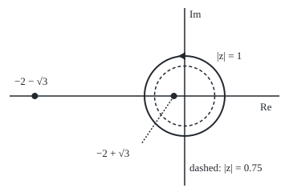

# Integrals round a full turn: set z = e to the i-theta and the trig integral becomes a residue on the unit circle

Complex analysis → Real Integrals and Counting Zeros → The unit-circle substitution → Integrals round a full turn

---

## General Overview

A Ferris wheel has radius 20 m and its hub 40 m up. Measure the angle t in radians from the top. A car rides at height 40 + 20 cos t metres: 60 m at the top, 20 m at the bottom. In units of the radius, that height is 2 + cos t.

The average height over a turn is 2 radii, the hub. A different average takes one over the height, as any effect that weakens with distance does. That is the integral of 1/(2 + cos t) from 0 to 2π, divided by 2π. The answer is 0.577350 = 1/√3, not the 0.5 that one over the average height gives: the low half of the turn counts for more.

As t runs from 0 to 2π, the point e^(it) runs once round the circle of radius 1 about 0, so an integral over a full turn is a loop integral in disguise. Rewrite it in that point, find where it blows up inside the circle, and the residue theorem finishes.

**Setting z = e^(it) turns a full-turn integral of a fraction in cos t and sin t into a loop integral round the unit circle, worth 2π i times the residues inside.**

**What kind of fact this is:** a method, justified in Why it works by Euler's formula and the residue theorem; the closed form for 1/(A + B cos t + C sin t) is a theorem, proved in the folded Detailed proof.

### The picture: the loop and the two poles

<p align="center"></p>

To scale: 50 units per 1, origin at (230, 120); the poles sit at (216.60, 120) and (43.40, 120). The solid circle is the path of z = e^(it); the triangle shows the anticlockwise direction. The dashed circle, radius 0.75, is the code's third road.

---

## The formula

Reminders: z is the point e^(it) ([eulers-formula](../01-Complex%20Numbers%20and%20the%20Plane/04-eulers-formula.md)); the loop sign over |z| = 1 is the contour integral once anticlockwise round the unit circle ([contour-integrals](../03-Contour%20Integrals%20and%20Cauchy%27s%20Theorem/01-contour-integrals.md)); Res is the residue ([the-residue-theorem](../05-Laurent%20Series%2C%20Singularities%20and%20Residues/05-the-residue-theorem.md)). The translations:

$$\cos t = \frac{z + 1/z}{2}, \qquad \sin t = \frac{z - 1/z}{2i}, \qquad dt = \frac{dz}{iz}$$

**Read it aloud:** cosine is the average of the point and its reciprocal; a step in angle is a step along the circle divided by i times the point.

The wheel's integral, carried through:

$$I = \int_0^{2\pi} \frac{dt}{2 + \cos t} = \oint_{|z|=1} \frac{2\,dz}{i\,(z^2 + 4z + 1)} = 2\pi i \,\operatorname{Res}_{z = z_+} \frac{2}{i\,(z^2 + 4z + 1)} = \frac{2\pi}{\sqrt 3}$$

**Read it aloud:** the integral over one turn is a loop integral of a fraction in z, which is 2π i times the residue at the one pole inside, z₊ = −2 + √3, giving 2π over root 3.

The general shape, for constants with $A > \sqrt{B^2 + C^2}$:

$$\int_0^{2\pi} \frac{dt}{A + B\cos t + C\sin t} = \frac{2\pi}{\sqrt{A^2 - B^2 - C^2}}$$

**Read it aloud:** one over a constant plus a wave, over a full turn, is 2π over the root of the constant squared minus the wave's size squared.

| Symbol | Plain meaning | In our example | Push it up and the answer… |
| --- | --- | --- | --- |
| $t$ | angle turned, radians from the top | 0 to 2π | — |
| $z$ | the point e^(it) on the unit circle | at t = π, z = −1 | — |
| $A$, $B$, $C$ | constant, cos weight, sin weight | 2, 1, 0; second case 5, 0, 4 | A up: smaller; B or C up: larger |
| $q(z)$ | iz times (A + B cos t + C sin t), written in z | (i/2)(z^2 + 4z + 1) | — |
| $z_+$, $z_-$ | roots of q: poles inside and outside | −0.267949, −3.732051 | pole nearer the circle: larger |
| $\operatorname{Res}$ | residue; at a simple root of q, 1/q' | 0.000000 − 0.577350i | — |
| $I$ | the integral over one turn | 3.627599 | — |
| $N$ | steps in the trapezoid sum | 4, 8, 16, 64 | error falls fast |

### When it holds

- **A full turn.** The range must be 0 to 2π so that z closes its loop. Over part of a turn the path is an arc, and the residue theorem says nothing about an arc.
- **A fraction built from cos t and sin t.** Then the swap gives a fraction of polynomials in z, with only poles. A root such as √(2 + cos t) brings a branch cut.
- **No pole on the circle.** The denominator must never be zero for real t: A > √(B^2 + C^2). At A = √(B^2 + C^2), as in 1/(1 + cos t), a pole lands on the circle and the integral is infinite; the code's sums for 1/(1 + cos t) grow without bound.
- **Poles counted after simplifying.** The swap brings powers of 1/z. Here the z cancels, so 0 is not a pole; in other integrals it is one, and missing it gives a wrong answer.

---

## Why it works

### Step 0: a full turn is a full loop

As t runs from 0 to 2π, z = e^(it) runs once anticlockwise round the unit circle. Written in z, the integral in t is an integral along that loop.

### Step 1: cosine from the point and its reciprocal

On the unit circle, 1/z = e^(−it), the mirror image of z in the real axis: its conjugate ([conjugate-and-modulus](../01-Complex%20Numbers%20and%20the%20Plane/02-conjugate-and-modulus.md)). Adding the two cancels the imaginary parts: z + 1/z = 2 cos t. Subtracting cancels the real parts: z − 1/z = 2i sin t. At t = π, z = 1/z = −1, and the sum −2 is twice cos π.

### Step 2: the step in angle

Differentiate z = e^(it) in t: dz/dt = iz, so dt = dz/(iz).

### Step 3: the wheel's integrand in z

Swap in cos t: 2 + (z + 1/z)/2 = (z^2 + 4z + 1)/(2z). Take the reciprocal, multiply by dz/(iz), and the z cancels:

$$\frac{1}{2 + \cos t}\,dt = \frac{2\,dz}{i\,(z^2 + 4z + 1)}$$

So 0 is not a pole; the poles are the roots of z^2 + 4z + 1.

### Step 4: one pole in, one out

The quadratic formula gives −2 + √3 = −0.267949 and −2 − √3 = −3.732051. Their product is the constant term, 1: each is the other's reciprocal.

No accident: swapping z for 1/z̄ (read z-bar) turns z + 1/z and (z − 1/z)/(2i) into their conjugates, so for real A, B, C the roots pair off as z and 1/z̄: same direction, distances r and 1/r. That is reflection in the unit circle: unless a root sits on it, one of each pair lies inside.

### Step 5: the residue, then the answer

Write the integrand as 1/q(z) with q(z) = (i/2)(z^2 + 4z + 1). Near a simple root z₀ of q, the residue (z − z₀)/q(z) tends to 1/q'(z₀), since q(z)/(z − z₀) is a difference quotient. Here q'(z) = i(z + 2), and at the inside pole z + 2 = √3, so

$$\operatorname{Res}_{z = z_+} = \frac{1}{i\sqrt 3} = -0.577350\,i$$

Times 2π i, the i's cancel: I = 2π/√3 = 3.627599. Divided by 2π, the average is 1/√3 = 0.577350.

<details>
<summary>Detailed proof: the general closed form</summary>

Let R = √(B^2 + C^2), with 0 < R < A, and choose φ with B = R cos φ, C = R sin φ. Then B cos t + C sin t = R cos(t − φ). Shifting t by φ only moves the start of the turn, so the integral equals that of 1/(A + R cos t).

Steps 1 to 3 turn that into 2 dz / (iR (z^2 + 2(A/R) z + 1)), with roots z₊, z₋ = (−A ± √(A^2 − R^2))/R, real and distinct. Their product is 1 and |z₋| > A/R > 1, so exactly z₊ lies inside.

The residue at z₊ is 2/(iR (z₊ − z₋)) = 1/(i√(A^2 − R^2)). Times 2π i: 2π/√(A^2 − B^2 − C^2). For 1/(5 + 4 sin t), A = 5, R = 4: 2π/3 = 2.094395. If R = 0 the integrand is 1/A and the answer 2π/A.

</details>

A road with no complex numbers: the substitution u = tan(t/2) turns the wheel's integral into the integral of 2/(3 + u^2) along the whole real line, again 2π/√3. Integrals along the whole line are the business of [semicircle-contours](01-semicircle-contours.md).

---

## Worked numbers, by hand

| Step | Arithmetic | Value |
| --- | --- | --- |
| Denominator in z | 2 + (z + 1/z)/2 | (z^2 + 4z + 1)/(2z) |
| Integrand in z | 2z/(z^2 + 4z + 1) times 1/(iz) | 2/(i(z^2 + 4z + 1)) |
| Poles | −2 ± √3 | −0.267949 inside; −3.732051 outside |
| Residue inside | 2/(i(2z + 4)) at z = −2 + √3 = 1/(i√3) | −0.577350i |
| Integral | 2π i × 1/(i√3) = 2π/√3 | **3.627599** |
| Average over a turn | 3.627599 / 2π = 1/√3 | **0.577350** |
| Equivalent height | √3 radii × 20 m | 34.641016 m |

For this average the car rides as if at 34.641016 m, below the hub's 40 m. That is the harmonic mean of the height: one over the average of one over it.

### What breaks if you drop a piece

| Mistake | Comes out at | What went wrong |
| --- | --- | --- |
| One over the average height | 0.500000, integral 3.141593 | Averaging a reciprocal is not reciprocating an average |
| Both poles counted | 0 | The outside pole is not enclosed |
| dt read as dz | −0.972012i | An imaginary answer to a real integral |
| Pole on the circle: 1/(1 + cos t) | sums 25.132741, 201.061930, 1608.495439 at N = 8, 64, 512 | A double pole at z = −1; the integral is infinite |

The code prints all four.

---

## Code, from first principles, and it actually runs

Three roads. Road one finds the roots of q and takes 2π i times 1/q' at the inside root, rechecking that residue by its limit. Road two is a trapezoid sum straight over t, no complex numbers; its error falls from 0.037592700720 at N = 4 to 0.000000005123 at N = 16. Road three sums dz/q(z) round the circle of radius 0.75, which encloses the same pole. A second case, 1/(5 + 4 sin t), takes the same roads.

### Python

```python
# Integrals round a full turn -- the check behind the card.  Standard library.
# The integral of 1/(A + B cos t + C sin t) over one turn, three roads:
# road 1: z = e^(it) turns it into the loop integral of 1/q(z) round |z| = 1,
#         and 2 pi i times the residue at the pole inside gives the answer;
# road 2: a trapezoid sum straight over t, no complex numbers at all;
# road 3: a trapezoid sum of 1/q(z) dz round the smaller circle |z| = 0.75.
import math

def show(w):                                  # 'a + bi', six decimals, no -0.000000
    a, b = round(w.real, 6) + 0.0, round(w.imag, 6) + 0.0
    return f"{a:.6f} {'-' if b < 0 else '+'} {abs(b):.6f}i"

def quad(A, B, C):                            # q(z) = iz (A + B cos t + C sin t)
    return (C + 1j * B) / 2, 1j * A, (1j * B - C) / 2

def residue_road(A, B, C):
    p2, p1, p0 = quad(A, B, C)
    root = (p1 * p1 - 4 * p2 * p0) ** 0.5
    poles = sorted([(-p1 + root) / (2 * p2), (-p1 - root) / (2 * p2)], key=abs)
    res = [1 / (2 * p2 * z + p1) for z in poles]  # simple pole: 1 / q'(z)
    return poles, res, 2j * math.pi * res[0]

def trapezoid_t(f, n):                        # road 2: equal steps round one turn
    return sum(f(2 * math.pi * k / n) for k in range(n)) * 2 * math.pi / n

def loop_sum(A, B, C, r, n):                  # road 3: sum of dz / q(z) round |z| = r
    p2, p1, p0 = quad(A, B, C)
    zs = [r * complex(math.cos(2 * math.pi * k / n), math.sin(2 * math.pi * k / n)) for k in range(n)]
    return sum(1j * z / (p2 * z * z + p1 * z + p0) for z in zs) * 2 * math.pi / n

wheel = lambda t: 1 / (2 + math.cos(t))
poles, res, road1 = residue_road(2, 1, 0)
h = 1e-6                                      # the residue again, by its limit
limit = h / sum(c * (poles[0] + h) ** k for k, c in zip((2, 1, 0), quad(2, 1, 0)))
exact = 2 * math.pi / math.sqrt(2 * 2 - 1 * 1)
print(f"poles of z^2 + 4z + 1: inside {poles[0].real:.6f}, outside {poles[1].real:.6f}, product {(poles[0] * poles[1]).real:.6f}")
print(f"residue inside, 1/q'(z): {show(res[0])}; by the limit, h = 1e-6: {show(limit)}")
print(f"road 1, 2 pi i x residue: {show(road1)}; 2 pi / sqrt 3 = {exact:.6f}")
errs = []
for n in (4, 8, 16):
    errs.append(abs(trapezoid_t(wheel, n) - exact))
    print(f"road 2, trapezoid in t, N = {n}: {trapezoid_t(wheel, n):.6f}, error {errs[-1]:.12f}")
road2, road3 = trapezoid_t(wheel, 64), loop_sum(2, 1, 0, 0.75, 128)
print(f"road 2, N = 64: {road2:.6f}; road 3, loop |z| = 0.75, N = 128: {show(road3)}")
print(f"average over one turn: {road1.real / (2 * math.pi):.6f}; harmonic-mean height {2 * math.pi / road1.real:.6f} radii = {40 * math.pi / road1.real:.6f} m")
poles2, res2, case2 = residue_road(5, 0, 4)
trap2, loop2 = trapezoid_t(lambda t: 1 / (5 + 4 * math.sin(t)), 64), loop_sum(5, 0, 4, 0.75, 128)
print(f"second case 1/(5 + 4 sin t): inside pole {show(poles2[0])}, outside {show(poles2[1])}")
print(f"second case: residue road {show(case2)}, trapezoid {trap2:.6f}, loop {show(loop2)}, 2 pi/3 = {2 * math.pi / 3:.6f}")
print(f"mistake, one over the average height: {1 / 2:.6f}, integral {2 * math.pi / 2:.6f}")
print(f"mistake, both poles counted: {show(2j * math.pi * (res[0] + res[1]))}; outside pole only: {show(2j * math.pi * res[1])}")
print(f"mistake, dt read as dz: {show(2j * math.pi * 2 * poles[0] / (poles[0] - poles[1]))}")
blow = [trapezoid_t(lambda t: 1 / (1 + math.cos(t + math.pi / n)), n) for n in (8, 64, 512)]
print("hypothesis dropped, 1/(1 + cos t), midpoint sums N = 8, 64, 512: " + ", ".join(f"{b:.6f}" for b in blow))
print(f"figure, 50 per unit, origin (230, 120), inside pole ({230 + 50 * poles[0].real:.2f}, 120), outside pole ({230 + 50 * poles[1].real:.2f}, 120), radii 50 and 37.5")
assert abs(road1 - road2) < 1e-12                          # residue against the plain t sum
assert abs(road3 - exact) < 1e-12 and abs(limit - res[0]) < 1e-5  # a different loop, same answer
assert errs[0] > errs[1] > errs[2] and errs[2] < 1e-7 and blow[0] < blow[1] < blow[2]
assert abs(case2 - trap2) < 1e-12 and abs(loop2 - 2 * math.pi / 3) < 1e-12
print("ALL CHECKS PASS")
```

**Ran 2026-09-28 on macOS, Python 3.14.6, standard library only. All checks passed. Output, pasted from the run:**

```
poles of z^2 + 4z + 1: inside -0.267949, outside -3.732051, product 1.000000
residue inside, 1/q'(z): 0.000000 - 0.577350i; by the limit, h = 1e-6: 0.000000 - 0.577350i
road 1, 2 pi i x residue: 3.627599 + 0.000000i; 2 pi / sqrt 3 = 3.627599
road 2, trapezoid in t, N = 4: 3.665191, error 0.037592700720
road 2, trapezoid in t, N = 8: 3.627792, error 0.000192788177
road 2, trapezoid in t, N = 16: 3.627599, error 0.000000005123
road 2, N = 64: 3.627599; road 3, loop |z| = 0.75, N = 128: 3.627599 + 0.000000i
average over one turn: 0.577350; harmonic-mean height 1.732051 radii = 34.641016 m
second case 1/(5 + 4 sin t): inside pole 0.000000 - 0.500000i, outside 0.000000 - 2.000000i
second case: residue road 2.094395 + 0.000000i, trapezoid 2.094395, loop 2.094395 + 0.000000i, 2 pi/3 = 2.094395
mistake, one over the average height: 0.500000, integral 3.141593
mistake, both poles counted: 0.000000 + 0.000000i; outside pole only: -3.627599 + 0.000000i
mistake, dt read as dz: 0.000000 - 0.972012i
hypothesis dropped, 1/(1 + cos t), midpoint sums N = 8, 64, 512: 25.132741, 201.061930, 1608.495439
figure, 50 per unit, origin (230, 120), inside pole (216.60, 120), outside pole (43.40, 120), radii 50 and 37.5
ALL CHECKS PASS
```

### Rust

Same labels, built with `rustc --edition 2021 -O`, with its own complex type and square root.

```rust
// Integrals round a full turn -- the same check as the Python, in Rust.  No crates.
// The integral of 1/(A + B cos t + C sin t) over one turn, three roads:
// road 1: z = e^(it) turns it into the loop integral of 1/q(z) round |z| = 1,
//         and 2 pi i times the residue at the pole inside gives the answer;
// road 2: a trapezoid sum straight over t, no complex numbers at all;
// road 3: a trapezoid sum of 1/q(z) dz round the smaller circle |z| = 0.75.
use std::f64::consts::PI;
#[derive(Clone, Copy)]
struct C { re: f64, im: f64 }
fn c(re: f64, im: f64) -> C { C { re, im } }
fn add(a: C, b: C) -> C { c(a.re + b.re, a.im + b.im) }
fn sub(a: C, b: C) -> C { c(a.re - b.re, a.im - b.im) }
fn mul(a: C, b: C) -> C { c(a.re * b.re - a.im * b.im, a.re * b.im + a.im * b.re) }
fn div(a: C, b: C) -> C { let d = b.re * b.re + b.im * b.im; c((a.re * b.re + a.im * b.im) / d, (a.im * b.re - a.re * b.im) / d) }
fn sc(a: C, k: f64) -> C { c(a.re * k, a.im * k) }
fn modulus(a: C) -> f64 { a.re.hypot(a.im) }
fn csqrt(a: C) -> C { let (r, t) = (modulus(a).sqrt(), a.im.atan2(a.re) / 2.0); c(r * t.cos(), r * t.sin()) }
fn show(w: C) -> String { // 'a + bi', six decimals, no -0.000000
    let a = format!("{:.6}", w.re);
    let a = if a == "-0.000000" { "0.000000".to_string() } else { a };
    let b = format!("{:.6}", w.im.abs());
    let sign = if w.im < 0.0 && b != "0.000000" { '-' } else { '+' };
    format!("{} {} {}i", a, sign, b)
}
fn quad(a: f64, b: f64, cc: f64) -> [C; 3] { [c(cc / 2.0, b / 2.0), c(0.0, a), c(-cc / 2.0, b / 2.0)] } // q = iz(A + B cos t + C sin t)
fn q_at(p: [C; 3], z: C) -> C { add(add(mul(p[0], mul(z, z)), mul(p[1], z)), p[2]) }
fn residue_road(a: f64, b: f64, cc: f64) -> ([C; 2], [C; 2], C) {
    let p = quad(a, b, cc);
    let root = csqrt(sub(mul(p[1], p[1]), sc(mul(p[0], p[2]), 4.0)));
    let mut poles = [div(sub(root, p[1]), sc(p[0], 2.0)), div(sc(add(p[1], root), -1.0), sc(p[0], 2.0))];
    if modulus(poles[0]) > modulus(poles[1]) { poles.swap(0, 1) }
    let res = [0, 1].map(|k| div(c(1.0, 0.0), add(sc(mul(p[0], poles[k]), 2.0), p[1]))); // 1 / q'(z)
    (poles, res, mul(c(0.0, 2.0 * PI), res[0]))
}
fn trapezoid_t(f: &dyn Fn(f64) -> f64, n: usize) -> f64 { // road 2: equal steps round one turn
    (0..n).map(|k| f(2.0 * PI * k as f64 / n as f64)).sum::<f64>() * 2.0 * PI / n as f64
}
fn loop_sum(a: f64, b: f64, cc: f64, r: f64, n: usize) -> C { // road 3: dz / q(z) round |z| = r
    let (p, mut s) = (quad(a, b, cc), c(0.0, 0.0));
    for k in 0..n {
        let t = 2.0 * PI * k as f64 / n as f64;
        let z = c(r * t.cos(), r * t.sin());
        s = add(s, div(mul(c(0.0, 1.0), z), q_at(p, z)));
    }
    sc(s, 2.0 * PI / n as f64)
}
fn main() {
    let wheel = |t: f64| 1.0 / (2.0 + t.cos());
    let (poles, res, road1) = residue_road(2.0, 1.0, 0.0);
    let h = 1e-6; // the residue again, by its limit
    let limit = div(c(h, 0.0), q_at(quad(2.0, 1.0, 0.0), add(poles[0], c(h, 0.0))));
    let exact = 2.0 * PI / (2.0f64 * 2.0 - 1.0 * 1.0).sqrt();
    println!("poles of z^2 + 4z + 1: inside {:.6}, outside {:.6}, product {:.6}", poles[0].re, poles[1].re, mul(poles[0], poles[1]).re);
    println!("residue inside, 1/q'(z): {}; by the limit, h = 1e-6: {}", show(res[0]), show(limit));
    println!("road 1, 2 pi i x residue: {}; 2 pi / sqrt 3 = {:.6}", show(road1), exact);
    let mut errs = Vec::new();
    for n in [4usize, 8, 16] {
        errs.push((trapezoid_t(&wheel, n) - exact).abs());
        println!("road 2, trapezoid in t, N = {}: {:.6}, error {:.12}", n, trapezoid_t(&wheel, n), errs[errs.len() - 1]);
    }
    let (road2, road3) = (trapezoid_t(&wheel, 64), loop_sum(2.0, 1.0, 0.0, 0.75, 128));
    println!("road 2, N = 64: {:.6}; road 3, loop |z| = 0.75, N = 128: {}", road2, show(road3));
    println!("average over one turn: {:.6}; harmonic-mean height {:.6} radii = {:.6} m", road1.re / (2.0 * PI), 2.0 * PI / road1.re, 40.0 * PI / road1.re);
    let (poles2, _, case2) = residue_road(5.0, 0.0, 4.0);
    let (trap2, loop2) = (trapezoid_t(&|t: f64| 1.0 / (5.0 + 4.0 * t.sin()), 64), loop_sum(5.0, 0.0, 4.0, 0.75, 128));
    println!("second case 1/(5 + 4 sin t): inside pole {}, outside {}", show(poles2[0]), show(poles2[1]));
    println!("second case: residue road {}, trapezoid {:.6}, loop {}, 2 pi/3 = {:.6}", show(case2), trap2, show(loop2), 2.0 * PI / 3.0);
    println!("mistake, one over the average height: {:.6}, integral {:.6}", 1.0 / 2.0, 2.0 * PI / 2.0);
    let both = mul(c(0.0, 2.0 * PI), add(res[0], res[1]));
    println!("mistake, both poles counted: {}; outside pole only: {}", show(both), show(mul(c(0.0, 2.0 * PI), res[1])));
    println!("mistake, dt read as dz: {}", show(mul(c(0.0, 4.0 * PI), div(poles[0], sub(poles[0], poles[1])))));
    let blow: Vec<f64> = [8usize, 64, 512].iter().map(|&n| trapezoid_t(&|t: f64| 1.0 / (1.0 + (t + PI / n as f64).cos()), n)).collect();
    println!("hypothesis dropped, 1/(1 + cos t), midpoint sums N = 8, 64, 512: {:.6}, {:.6}, {:.6}", blow[0], blow[1], blow[2]);
    println!("figure, 50 per unit, origin (230, 120), inside pole ({:.2}, 120), outside pole ({:.2}, 120), radii 50 and 37.5", 230.0 + 50.0 * poles[0].re, 230.0 + 50.0 * poles[1].re);
    assert!(modulus(sub(road1, c(road2, 0.0))) < 1e-12); // residue against the plain t sum
    assert!(modulus(sub(road3, c(exact, 0.0))) < 1e-12 && modulus(sub(limit, res[0])) < 1e-5);
    assert!(errs[0] > errs[1] && errs[1] > errs[2] && errs[2] < 1e-7 && blow[0] < blow[1] && blow[1] < blow[2]);
    assert!(modulus(sub(case2, c(trap2, 0.0))) < 1e-12 && modulus(sub(loop2, c(2.0 * PI / 3.0, 0.0))) < 1e-12);
    println!("ALL CHECKS PASS");
}
```

**Ran 2026-09-28 on macOS, rustc 1.98.1, no crates. All checks passed. Output, pasted from the run:**

```
poles of z^2 + 4z + 1: inside -0.267949, outside -3.732051, product 1.000000
residue inside, 1/q'(z): 0.000000 - 0.577350i; by the limit, h = 1e-6: 0.000000 - 0.577350i
road 1, 2 pi i x residue: 3.627599 + 0.000000i; 2 pi / sqrt 3 = 3.627599
road 2, trapezoid in t, N = 4: 3.665191, error 0.037592700720
road 2, trapezoid in t, N = 8: 3.627792, error 0.000192788177
road 2, trapezoid in t, N = 16: 3.627599, error 0.000000005123
road 2, N = 64: 3.627599; road 3, loop |z| = 0.75, N = 128: 3.627599 + 0.000000i
average over one turn: 0.577350; harmonic-mean height 1.732051 radii = 34.641016 m
second case 1/(5 + 4 sin t): inside pole 0.000000 - 0.500000i, outside 0.000000 - 2.000000i
second case: residue road 2.094395 + 0.000000i, trapezoid 2.094395, loop 2.094395 + 0.000000i, 2 pi/3 = 2.094395
mistake, one over the average height: 0.500000, integral 3.141593
mistake, both poles counted: 0.000000 + 0.000000i; outside pole only: -3.627599 + 0.000000i
mistake, dt read as dz: 0.000000 - 0.972012i
hypothesis dropped, 1/(1 + cos t), midpoint sums N = 8, 64, 512: 25.132741, 201.061930, 1608.495439
figure, 50 per unit, origin (230, 120), inside pole (216.60, 120), outside pole (43.40, 120), radii 50 and 37.5
ALL CHECKS PASS
```

The two outputs match line for line.

> [!TIP]
> **Try changing**
> Guess first, then run it.
> - **Shrink the second loop.** In `loop_sum(2, 1, 0, 0.75, 128)` change `0.75` to `0.2`. It misses the pole at −0.267949, sums to 0, and the second assert stops the run.
> - **Grow it.** Change `0.75` to `5`. Both residues cancel, and the second assert stops it.
> - **Cosine for sine.** Change `residue_road(5, 0, 4)` to `residue_road(5, 4, 0)`. The poles move to the real axis, yet the answer stays 2.094395 and every assert passes: shifting a full turn changes nothing.

---

## The usual mistake

> [!warning]
> **Dropping the 1/(iz) that comes with dt.** Swapping cos t but not dt integrates 2z/(z^2 + 4z + 1) instead, and the residue theorem returns −0.972012i: an imaginary integral of a positive real function.
>
> - **Counting both poles.** The outside one cancels the answer to 0; the outside one alone gives −3.627599, negative for a positive function.
> - **Ignoring a pole on the circle.** For 1/(1 + cos t) the pole sits at z = −1, on the path. The sums 25.132741, 201.061930, 1608.495439 never settle: the integral is infinite.

---

## Where you meet it in real life

- **Orbits.** A planet's distance from the sun is p/(1 + e cos t), with e the orbit's eccentricity (how far from round). Averages over an orbit are integrals of powers of 1/(1 + e cos t) over one turn.
- **Heat in a disc.** The Poisson kernel, (1 − r^2)/(1 − 2r cos t + r^2), fills in a steady temperature inside a disc from its rim; this method shows it averages to exactly 1.
- **Numerical integration.** The trapezoid errors above fall this fast because the nearest pole sits well off the circle; a pole nearer the circle slows the fall.

> **Say it back**
> Over one full turn, z = e^(it) runs once round the unit circle. Cos t becomes (z + 1/z)/2 and dt becomes dz/(iz), so the integral is a loop integral of a fraction in z. Its poles pair off by reflection in the circle, and only those inside count. For the wheel, the pole inside is −2 + √3, its residue 1/(i√3), and the integral 2π/√3, an average of 0.577350.

---

## What this builds on

- [the-residue-theorem](../05-Laurent%20Series%2C%20Singularities%20and%20Residues/05-the-residue-theorem.md): a loop integral is 2π i times the residues inside, the engine of Step 5.
- [eulers-formula](../01-Complex%20Numbers%20and%20the%20Plane/04-eulers-formula.md): e^(it) is the point at angle t on the unit circle, which gives Steps 1 and 2.

## Where this goes next

- [oscillatory-integrals-and-jordans-lemma](03-oscillatory-integrals-and-jordans-lemma.md): cos and sin again, along the whole line rather than round one turn.
- [the-argument-principle](06-the-argument-principle.md): the same loop round a circle, used to count zeros instead of adding residues.

---

## Sources

Verified 28 Sep 2026: every link below resolves to the publisher's page.

- Stein, Elias M., and Rami Shakarchi. *Complex Analysis*. Princeton University Press, 2003. [Publisher page](https://press.princeton.edu/books/hardcover/9780691113852/complex-analysis). The residue formula and its use on real integrals.
- Orloff, Jeremy. "Topic 9: Definite integrals using the residue theorem." 18.04 Complex Variables with Applications, MIT OpenCourseWare, Spring 2018. [Course notes](https://ocw.mit.edu/courses/18-04-complex-variables-with-applications-spring-2018/resources/mit18_04s18_topic9/). Free notes that work integrals over a full period by z = e^(iθ).
