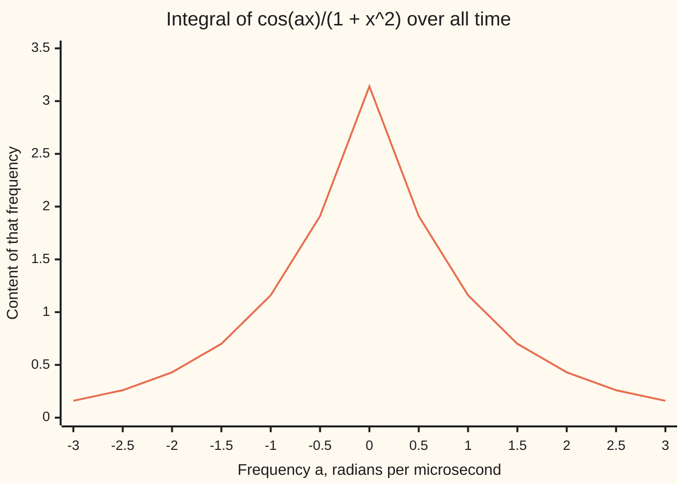
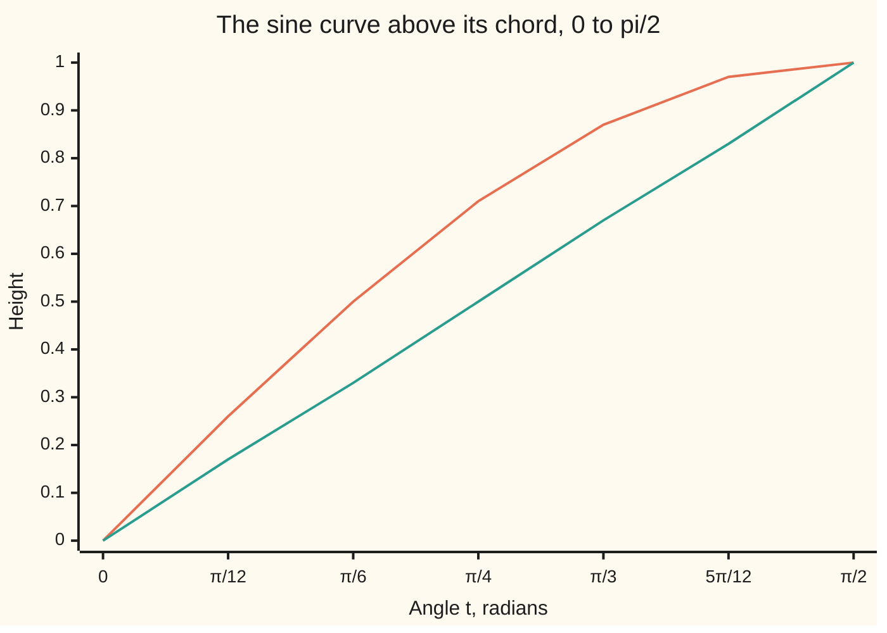

# Jordan's lemma: with an e to the iax factor the big arc still vanishes, so cosine integrals fall to residues

[Syllabus](../../../SYLLABUS.md) → [Complex analysis](../README.md) → [Real Integrals and Counting Zeros](../README.md#s06) → Jordan's lemma

---

## General Overview

A radio receiver meets a click: a voltage pulse shaped like 1/(1 + x^2), with x the time in microseconds from the peak. A filter tuned to frequency a, in radians per microsecond, measures how much of that tone the click holds: the integral of the pulse times cos(ax) over all time.

At a = 1 that integral is 1.155727. At a = 0 it is π, the area under the pulse, found on [The semicircle contour](01-semicircle-contours.md). In general it is π e^(−|a|): the click's content falls off exponentially with frequency, the same on both sides of zero.

Two obstacles block the semicircle method. First, cos z is huge off the real line. The fix is to write cos(ax) as the real part of e^(iax), a wave that shrinks as it rises into the upper half-plane. Second, for a slower-falling partner such as x/(1 + x^2), the length-times-maximum bound no longer kills the arc. Jordan's lemma does: the wave's decay over most of the arc is worth a whole factor of R.

**Replace the cosine by e^(iax), close the real line with an arc in the half-plane where that wave decays, and the arc vanishes whenever the rest of the integrand shrinks to zero there, however slowly; the integral is then the residues' contribution.**

**What kind of fact this is:** a theorem, proved on this card in Why it works from the inequality sin t ≥ 2t/π.

### The picture: the click's content at each frequency



One line: π e^(−|a|), to two decimals. The peak at a = 0 is π, the pulse's area; the corner there comes from the |a|.

---

## The formula

A reminder from [Euler's formula](../01-Complex%20Numbers%20and%20the%20Plane/04-eulers-formula.md): e^(iθ) = cos θ + i sin θ, so on the real line cos(ax) is the real part of e^(iax). Off the line, at z = x + iy, the size of e^(iaz) is e^(−ay): for a > 0 it shrinks as y grows.

**Jordan's lemma.** Let $a > 0$. Let $C_R$ be the upper half-circle of radius R about 0, and let $M_R$ be the largest size on it of a continuous function g. Then

$$\left|\int_{C_R} g(z)\,e^{iaz}\,dz\right| \le \frac{\pi}{a}\,M_R.$$

**Read it aloud:** on the upper arc, the wave's decay makes the integral no bigger than π over a times g's largest size there; the arc's length R has cancelled.

So if $M_R \to 0$, the arc vanishes. The ML bound (arc length πR times $M_R$) needs $M_R$ to fall faster than 1/R.

Applied to the click, with the one pole i above the axis:

$$\int_{-\infty}^{\infty} \frac{\cos ax}{1 + x^2}\,dx = \operatorname{Re}\left[2\pi i\,\operatorname{Res}\!\left(\frac{e^{iaz}}{1 + z^2},\, i\right)\right] = \pi e^{-a}, \qquad a > 0.$$

**Read it aloud:** the cosine integral is the real part of 2πi times the residue of the wave-times-pulse at i, which is π e^(−a).

| Symbol | Plain meaning | In our example | Push it up and the answer… |
| --- | --- | --- | --- |
| $x$, $z$ | time in microseconds; a point x + iy of the plane | the real line, then the half-plane above | — |
| $y$ | height above the real axis, Im z | R sin t on the arc | e^(iaz) shrinks as e^(−ay) |
| $a$ | frequency, radians per microsecond | 1 | the content falls as e^(−a) |
| $g$ | the part of the integrand that does not oscillate | 1/(1 + z^2); then z/(1 + z^2) | — |
| $R$, $C_R$, $t$ | the arc's radius; the arc z = Re^(it); its angle, 0 to π | R = 2, 4, 8, 16 | the arc shrinks |
| $M_R$ | g's largest size on the arc | at most R/(R^2 − 1) for z/(1 + z^2) | a bigger arc bound |
| $\operatorname{Res}$ | the residue: coefficient of 1/(z − i) near the pole | −0.183940i | — |
| $i$, $\pi$, $e$ | the quarter turn, i^2 = −1; the half-turn; the base of natural logs | pole at i | — |

### When it holds

- **a > 0, arc above.** For a < 0 the wave grows upward: at a = −1 the upper arc at R = 8 carries 7.354818. Close below, clockwise.
- **g shrinks on the arc, at any rate.** With g = 1 the arc is −2 sin(aR)/a, which swings for ever: −1.978717 at R = 8, 0.575807 at R = 16.
- **e^(iax) in the loop, never cos(az).** Take the real part after integrating; this is valid because g is real on the real line.
- **No pole on the real line.** Otherwise see [Poles on the path](04-indented-contours-and-principal-values.md).

---

## Why it works

### Step 0: trade the cosine for a wave that decays upward

cos z = (e^(iz) + e^(−iz))/2. At z = iy the second term is e^(y)/2, enormous far up, so no upper arc can vanish with it on board. The wave e^(iaz) alone has size e^(−ay): at most 1, and tiny high up. Integrate e^(iax) g(x) and take the real part at the end.

### Step 1: close the loop and price it

Close the segment from −R to R with the upper arc, as on [The semicircle contour](01-semicircle-contours.md). For the click, e^(iaz)/(1 + z^2) = e^(iaz)/((z − i)(z + i)). The residue at i is the rest evaluated at i: e^(ia·i)/(2i) = e^(−a)/(2i). At a = 1 that is −0.183940i. The loop is worth 2πi e^(−a)/(2i) = π e^(−a) = 1.155727, for every R > 1.

### Step 2: bound the arc, point by point

On the arc z = Re^(it), so y = R sin t and the step |dz| = R dt. Then

$$\left|\int_{C_R} g\,e^{iaz}\,dz\right| \le \int_0^\pi M_R\, e^{-aR\sin t}\, R\,dt = M_R R \int_0^\pi e^{-aR\sin t}\,dt.$$

ML would replace e^(−aR sin t) by its largest value, 1, throwing the decay away. The wave is near size 1 only at the arc's ends; elsewhere it is tiny.

### Step 3: the sine lies above its chord

On 0 ≤ t ≤ π/2 the sine bends downward (its second derivative, −sin t, is not positive), so it lies above its chord from (0, 0) to (π/2, 1): sin t ≥ 2t/π.



The upper line is sin t; the lower is the chord 2t/π. They meet only at the ends.

### Step 4: integrate the easier exponential

By symmetry about t = π/2, the integral to π is twice the one to π/2. There sin t ≥ 2t/π gives e^(−aR sin t) ≤ e^(−2aRt/π), which integrates exactly:

$$\int_0^\pi e^{-aR\sin t}\,dt \le 2\int_0^{\pi/2} e^{-2aRt/\pi}\,dt = \frac{\pi}{aR}\left(1 - e^{-aR}\right) < \frac{\pi}{aR}.$$

Multiply by $M_R R$ from Step 2: the R cancels, leaving π$M_R$/a. That is Jordan's lemma. At aR = 8 the integral is 0.254724 against the bound 0.392699.

### Step 5: let R grow

For the click, $M_R$ ≤ 1/(R^2 − 1), so even ML suffices, and the real part gives π e^(−a).

Jordan earns its keep on the tilted pulse z e^(iaz)/(1 + z^2), where $M_R$ ≤ R/(R^2 − 1) falls only like 1/R. ML gives about π for every R, 3.153913 at R = 16. Jordan gives πR/(a(R^2 − 1)), 0.197120 at R = 16, tending to 0. The residue at i is e^(−a)/2, so the loop is πi e^(−a), and its imaginary part is the sine integral:

$$\int_{-\infty}^{\infty} \frac{x \sin ax}{1 + x^2}\,dx = \pi e^{-a} = 1.155727 \text{ at } a = 1.$$

<details>
<summary>Detailed proof: from the loop to the improper integral</summary>

Fix a > 0; let g = p/q, q with no real zeros, degree of q at least degree of p plus 1. As on the semicircle card, |g(z)| ≤ C/|z| for large |z|, so $M_R$ ≤ C/R → 0.

For R beyond every pole, segment plus arc equals 2πi times the residues of g e^(iaz) above the axis. By Jordan the arc is at most πC/(aR), so the segment tends to the residue sum.

That limit is symmetric, −R to R together. When the degrees differ by exactly 1, each tail converges only through cancellation: on [R, S], integrating by parts with e^(iax) = d(e^(iax))/(ia) leaves boundary terms at most 2C/(aR) plus the integral of |g′|/a, which is at most 2C/(aR) once g is monotone for large x. So each tail converges and the symmetric limit is the improper integral. For a < 0 use the lower arc, clockwise.

</details>

A second road needs no complex numbers: Simpson's rule on cos(x)/(1 + x^2) from 0 to L, plus the tail beyond L from integrating by parts twice. It is off by 8.5e-06 at L = 25 and 4.0e-10 at L = 400.

---

## Worked numbers, by hand

| Step | Arithmetic | Value |
| --- | --- | --- |
| Pole inside | 1 + z^2 = (z − i)(z + i) | i |
| Residue at i | e^(i·i)/(2i) = e^(−1)/(2i) | −0.183940i |
| Loop value | 2πi × e^(−1)/(2i) = π e^(−1) | 1.155727 |
| Check at R = 4 | segment 1.108700 + arc 0.047027 | 1.155727 |
| Jordan bound, tilted pulse, R = 16 | π × 16/(1 × 255) | 0.197120 |
| Real part | cosine integral at a = 1 | **1.155727** |

A filter tuned to 1 radian per microsecond picks up 1.155727 from the click: a share e^(−1) of the 3.14 it would catch at zero frequency.

### What breaks if you drop a piece

| Mistake | Comes out at | What went wrong |
| --- | --- | --- |
| cos(az) kept in the loop | 4.847731 (π cosh 1); arc at R = 8 still 3.662814 | e^(−iz) inside cos z grows upward; the arc never fades |
| a = −1 closed upward | 8.539734 (π e) | e^(−iz) grows upward; close below for a < 0 |
| g = 1, which does not shrink | arc −1.978717 at R = 8, 0.575807 at R = 16 | Jordan needs $M_R$ → 0 |
| Real part taken for the sine integral | 0 | x sin(ax) is the imaginary part of x e^(iax) |

---

## Code, from first principles, and it actually runs

Both programs reach 1.155727 by three roads: 2πi times the residue; the real line alone, by Simpson's rule plus a tail; and segment plus arc at R = 4. The four asserts: at every radius the wave's arc integral stays under π/(aR) and the tilted arc under Jordan's bound; road two matches π e^(−|a|) at all twelve nonzero chart frequencies; the closed loops match the residues; sin t ≥ 2t/π at 1001 points.

### Python

```python
# Jordan's lemma -- the check behind the card.  Standard library only.
# The Cauchy pulse 1/(1+x^2): its frequency content at a is the integral of
# cos(ax)/(1+x^2) over the real line, claimed to be pi e^(-|a|).
# Road 1: 2 pi i x residue at i.  Road 2: the real line only, Simpson plus a tail.
# Road 3: segment plus upper arc at finite R, each a trapezoid sum.
import math

def show(w):                                  # 'a + bi', six decimals, no -0.000000
    a, b = round(w.real, 6) + 0.0, round(w.imag, 6) + 0.0
    return f"{a:.6f} {'-' if b < 0 else '+'} {abs(b):.6f}i"
def cexp(w): return math.exp(w.real) * complex(math.cos(w.imag), math.sin(w.imag))
def trap(g, lo, hi, n=40000):                 # trapezoid sum of g from lo to hi
    h = (hi - lo) / n
    return h * (sum(g(lo + j * h) for j in range(1, n)) + (g(lo) + g(hi)) / 2)
def arc(g, R):                                # z = R e^(it), dz = i z dt, t from 0 to pi
    return trap(lambda t: g(R * cexp(1j * t)) * 1j * R * cexp(1j * t), 0, math.pi)
def real_line(a, L=400.0, n=40000):           # road 2: 2 x (Simpson on [0, L] + tail by parts)
    h = L / n
    s = sum((1 if j in (0, n) else 4 if j % 2 else 2) * math.cos(a * j * h) / (1 + (j * h) ** 2) for j in range(n + 1))
    tail = -math.sin(a * L) / (a * (1 + L * L)) + 2 * L * math.cos(a * L) / (a * a * (1 + L * L) ** 2)
    return 2 * (s * h / 3 + tail)

a = 1.0
pulse = lambda z: cexp(1j * a * z) / (1 + z * z)        # e^(iaz)/(1+z^2)
tilted = lambda z: z * cexp(1j * a * z) / (1 + z * z)   # degree gap 1: needs Jordan
res = cexp(1j * a * 1j) / (2j)                          # (z - i) x pulse, at z = i
road1 = 2j * math.pi * res
print(f"pulse, a = {a:g}: residue at i {show(res)}; road 1, 2 pi i x residue: {show(road1)}")
r2 = {L: real_line(a, L, int(100 * L)) for L in (25, 100, 400)}
print("road 2, real line to L plus tail: " + "; ".join(f"L = {L}: {v:.6f} (off {abs(v - road1.real):.1e})" for L, v in r2.items()))
seg, arc4 = trap(lambda x: pulse(complex(x, 0)), -4, 4), arc(pulse, 4)
print(f"road 3, R = 4: segment {show(seg)} + arc {show(arc4)} = {show(seg + arc4)}")
for R in (2, 4, 8, 16):
    J, ta = trap(lambda t: math.exp(-a * R * math.sin(t)), 0, math.pi), abs(arc(tilted, R))
    ml, jb = math.pi * R * R / (R * R - 1), math.pi * R / (a * (R * R - 1))
    print(f"R = {R}: e^(-aR sin t) summed {J:.6f} < pi/(aR) {math.pi / (a * R):.6f}; tilted arc {ta:.6f}, ML {ml:.6f}, Jordan {jb:.6f}")
    assert J < math.pi / (a * R) and ta <= jb
res_t = 1j * cexp(1j * a * 1j) / (2j)                   # (z - i) x tilted, at z = i
closed16 = trap(lambda x: tilted(complex(x, 0)), -16, 16) + arc(tilted, 16)
print(f"tilted, x e^(iax)/(1+x^2): 2 pi i x residue {show(2j * math.pi * res_t)}; R = 16 closed {show(closed16)}")
freqs = [k / 2 for k in range(-6, 7)]
print("chart, pi e^(-|a|) at a = -3 to 3 by 0.5: " + ", ".join(f"{math.pi * math.exp(-abs(f)):.2f}" for f in freqs))
ts = [k * math.pi / 12 for k in range(7)]
print("chart, t = k pi/12: sin t " + ", ".join(f"{math.sin(t):.2f}" for t in ts) + "; 2t/pi " + ", ".join(f"{2 * t / math.pi:.2f}" for t in ts))
cosk = lambda z: (cexp(1j * z) + cexp(-1j * z)) / 2 / (1 + z * z)
print(f"mistake, cos(az) kept: loop gives {show(2j * math.pi * (cexp(-1) + cexp(1)) / 2 / 2j)}; its arc at R = 8 {show(arc(cosk, 8))}")
neg = lambda z: cexp(-1j * z) / (1 + z * z)
print(f"mistake, a = -1 closed upward: 2 pi i x residue {show(2j * math.pi * cexp(1) / 2j)}; arc at R = 8 {show(arc(neg, 8))}")
flat = lambda z: cexp(1j * a * z)
print(f"mistake, g = 1 does not shrink: arc at R = 8 {show(arc(flat, 8))}, at R = 16 {show(arc(flat, 16))}")
print(f"mistake, real part taken for the sine integral: {(2j * math.pi * res_t).real:.6f}")
assert all(abs(real_line(f) - math.pi * math.exp(-abs(f))) < 1e-7 for f in freqs if f != 0)
assert abs(seg + arc4 - road1) < 1e-7 and abs(closed16 - 2j * math.pi * res_t) < 1e-6
assert all(math.sin(k * math.pi / 2000) >= k / 1000 - 1e-15 for k in range(1001))
print("ALL CHECKS PASS")
```

**Ran 2026-09-28 on macOS, Python 3.14.6, standard library only. All checks passed. Output, pasted from the run:**

```
pulse, a = 1: residue at i 0.000000 - 0.183940i; road 1, 2 pi i x residue: 1.155727 + 0.000000i
road 2, real line to L plus tail: L = 25: 1.155736 (off 8.5e-06); L = 100: 1.155727 (off 6.5e-08); L = 400: 1.155727 (off 4.0e-10)
road 3, R = 4: segment 1.108700 + 0.000000i + arc 0.047027 + 0.000000i = 1.155727 + 0.000000i
R = 2: e^(-aR sin t) summed 1.074901 < pi/(aR) 1.570796; tilted arc 0.110617, ML 4.188790, Jordan 2.094395
R = 4: e^(-aR sin t) summed 0.536809 < pi/(aR) 0.785398; tilted arc 0.352688, ML 3.351032, Jordan 0.837758
R = 8: e^(-aR sin t) summed 0.254724 < pi/(aR) 0.392699; tilted arc 0.007425, ML 3.191459, Jordan 0.398932
R = 16: e^(-aR sin t) summed 0.125508 < pi/(aR) 0.196350; tilted arc 0.120541, ML 3.153913, Jordan 0.197120
tilted, x e^(iax)/(1+x^2): 2 pi i x residue 0.000000 + 1.155727i; R = 16 closed 0.000000 + 1.155727i
chart, pi e^(-|a|) at a = -3 to 3 by 0.5: 0.16, 0.26, 0.43, 0.70, 1.16, 1.91, 3.14, 1.91, 1.16, 0.70, 0.43, 0.26, 0.16
chart, t = k pi/12: sin t 0.00, 0.26, 0.50, 0.71, 0.87, 0.97, 1.00; 2t/pi 0.00, 0.17, 0.33, 0.50, 0.67, 0.83, 1.00
mistake, cos(az) kept: loop gives 4.847731 + 0.000000i; its arc at R = 8 3.662814 + 0.000000i
mistake, a = -1 closed upward: 2 pi i x residue 8.539734 + 0.000000i; arc at R = 8 7.354818 + 0.000000i
mistake, g = 1 does not shrink: arc at R = 8 -1.978717 + 0.000000i, at R = 16 0.575807 + 0.000000i
mistake, real part taken for the sine integral: 0.000000
ALL CHECKS PASS
```

### Rust

Same numbers, same labels, built with `rustc --edition 2021 -O`.

```rust
// Jordan's lemma -- the same check as the Python, in Rust.  No crates.
// The Cauchy pulse 1/(1+x^2): its frequency content at a is the integral of
// cos(ax)/(1+x^2) over the real line, claimed to be pi e^(-|a|).
// Road 1: 2 pi i x residue at i.  Road 2: the real line only, Simpson plus a tail.
// Road 3: segment plus upper arc at finite R, each a trapezoid sum.
use std::f64::consts::PI;
#[derive(Clone, Copy)]
struct C { re: f64, im: f64 }
fn c(re: f64, im: f64) -> C { C { re, im } }
fn add(a: C, b: C) -> C { c(a.re + b.re, a.im + b.im) }
fn mul(a: C, b: C) -> C { c(a.re * b.re - a.im * b.im, a.re * b.im + a.im * b.re) }
fn div(a: C, b: C) -> C { let d = b.re * b.re + b.im * b.im; c((a.re * b.re + a.im * b.im) / d, (a.im * b.re - a.re * b.im) / d) }
fn scale(a: C, k: f64) -> C { c(a.re * k, a.im * k) }
fn abs(a: C) -> f64 { a.re.hypot(a.im) }
fn cexp(w: C) -> C { scale(c(w.im.cos(), w.im.sin()), w.re.exp()) }
fn show(w: C) -> String { // 'a + bi', six decimals, no -0.000000
    let a = format!("{:.6}", w.re);
    let a = if a == "-0.000000" { "0.000000".to_string() } else { a };
    let b = format!("{:.6}", w.im.abs());
    format!("{} {} {}i", a, if w.im < 0.0 && b != "0.000000" { '-' } else { '+' }, b)
}
fn trap(g: &dyn Fn(f64) -> C, lo: f64, hi: f64) -> C { // trapezoid sum of g from lo to hi
    let (n, h) = (40000, (hi - lo) / 40000.0);
    let mut s = scale(add(g(lo), g(hi)), 0.5);
    for j in 1..n { s = add(s, g(lo + j as f64 * h)) }
    scale(s, h)
}
fn arc(g: &dyn Fn(C) -> C, r: f64) -> C { // z = R e^(it), dz = i z dt, t from 0 to pi
    trap(&|t: f64| { let z = c(r * t.cos(), r * t.sin()); mul(g(z), mul(c(0.0, 1.0), z)) }, 0.0, PI)
}
fn real_line(a: f64, l: f64, n: usize) -> f64 { // road 2: 2 x (Simpson on [0, L] + tail by parts)
    let h = l / n as f64;
    let s: f64 = (0..=n).map(|j| { let x = j as f64 * h; let w = if j == 0 || j == n { 1.0 } else if j % 2 == 1 { 4.0 } else { 2.0 };
        w * (a * x).cos() / (1.0 + x * x) }).sum();
    let tail = -(a * l).sin() / (a * (1.0 + l * l)) + 2.0 * l * (a * l).cos() / (a * a * (1.0 + l * l).powi(2));
    2.0 * (s * h / 3.0 + tail)
}
fn main() {
    let a = 1.0;
    let one = c(1.0, 0.0);
    let pulse = move |z: C| div(cexp(mul(c(0.0, a), z)), add(one, mul(z, z))); // e^(iaz)/(1+z^2)
    let tilted = move |z: C| mul(z, pulse(z)); // degree gap 1: needs Jordan
    let res = div(cexp(c(-a, 0.0)), c(0.0, 2.0)); // (z - i) x pulse, at z = i
    let road1 = mul(c(0.0, 2.0 * PI), res);
    println!("pulse, a = {}: residue at i {}; road 1, 2 pi i x residue: {}", a, show(res), show(road1));
    let r2: Vec<String> = [25.0, 100.0, 400.0].iter().map(|&l: &f64| { let v = real_line(a, l, (100.0 * l) as usize);
        let (d, e) = ((v - road1.re).abs(), (v - road1.re).abs().log10().floor()); // '8.5e-06', as Python prints it
        format!("L = {}: {:.6} (off {:.1}e-{:02})", l, v, d / 10f64.powf(e), -e) }).collect();
    println!("road 2, real line to L plus tail: {}", r2.join("; "));
    let (seg, arc4) = (trap(&|x: f64| pulse(c(x, 0.0)), -4.0, 4.0), arc(&pulse, 4.0));
    println!("road 3, R = 4: segment {} + arc {} = {}", show(seg), show(arc4), show(add(seg, arc4)));
    for r in [2.0f64, 4.0, 8.0, 16.0] {
        let j = trap(&|t: f64| c((-a * r * t.sin()).exp(), 0.0), 0.0, PI).re;
        let (ta, ml, jb) = (abs(arc(&tilted, r)), PI * r * r / (r * r - 1.0), PI * r / (a * (r * r - 1.0)));
        println!("R = {}: e^(-aR sin t) summed {:.6} < pi/(aR) {:.6}; tilted arc {:.6}, ML {:.6}, Jordan {:.6}", r, j, PI / (a * r), ta, ml, jb);
        assert!(j < PI / (a * r) && ta <= jb);
    }
    let road1_t = mul(c(0.0, 2.0 * PI), div(mul(c(0.0, 1.0), cexp(c(-a, 0.0))), c(0.0, 2.0))); // residue: (z - i) x tilted, at z = i
    let closed16 = add(trap(&|x: f64| tilted(c(x, 0.0)), -16.0, 16.0), arc(&tilted, 16.0));
    println!("tilted, x e^(iax)/(1+x^2): 2 pi i x residue {}; R = 16 closed {}", show(road1_t), show(closed16));
    let freqs: Vec<f64> = (-6..=6).map(|k| k as f64 / 2.0).collect();
    let fc: Vec<String> = freqs.iter().map(|f| format!("{:.2}", PI * (-f.abs()).exp())).collect();
    println!("chart, pi e^(-|a|) at a = -3 to 3 by 0.5: {}", fc.join(", "));
    let ts: Vec<f64> = (0..7).map(|k| k as f64 * PI / 12.0).collect();
    let st: Vec<String> = ts.iter().map(|t| format!("{:.2}", t.sin())).collect();
    let ch: Vec<String> = ts.iter().map(|t| format!("{:.2}", 2.0 * t / PI)).collect();
    println!("chart, t = k pi/12: sin t {}; 2t/pi {}", st.join(", "), ch.join(", "));
    let cosk = move |z: C| div(scale(add(cexp(mul(c(0.0, 1.0), z)), cexp(mul(c(0.0, -1.0), z))), 0.5), add(one, mul(z, z)));
    let cosh_loop = scale(c(1.0f64.exp() + (-1.0f64).exp(), 0.0), PI / 2.0); // 2 pi i x cosh(1)/(2i)
    println!("mistake, cos(az) kept: loop gives {}; its arc at R = 8 {}", show(cosh_loop), show(arc(&cosk, 8.0)));
    let neg = move |z: C| div(cexp(mul(c(0.0, -1.0), z)), add(one, mul(z, z)));
    println!("mistake, a = -1 closed upward: 2 pi i x residue {}; arc at R = 8 {}", show(c(PI * 1.0f64.exp(), 0.0)), show(arc(&neg, 8.0)));
    let flat = move |z: C| cexp(mul(c(0.0, a), z));
    println!("mistake, g = 1 does not shrink: arc at R = 8 {}, at R = 16 {}", show(arc(&flat, 8.0)), show(arc(&flat, 16.0)));
    println!("mistake, real part taken for the sine integral: {:.6}", road1_t.re);
    assert!(freqs.iter().filter(|&&f| f != 0.0).all(|&f| (real_line(f, 400.0, 40000) - PI * (-f.abs()).exp()).abs() < 1e-7));
    assert!(abs(add(add(seg, arc4), scale(road1, -1.0))) < 1e-7 && abs(add(closed16, scale(road1_t, -1.0))) < 1e-6);
    assert!((0..=1000).all(|k| (k as f64 * PI / 2000.0).sin() >= k as f64 / 1000.0 - 1e-15));
    println!("ALL CHECKS PASS");
}
```

**Ran 2026-09-28 on macOS, rustc 1.98.1, no crates. All checks passed. Output, pasted from the run:**

```
pulse, a = 1: residue at i 0.000000 - 0.183940i; road 1, 2 pi i x residue: 1.155727 + 0.000000i
road 2, real line to L plus tail: L = 25: 1.155736 (off 8.5e-06); L = 100: 1.155727 (off 6.5e-08); L = 400: 1.155727 (off 4.0e-10)
road 3, R = 4: segment 1.108700 + 0.000000i + arc 0.047027 + 0.000000i = 1.155727 + 0.000000i
R = 2: e^(-aR sin t) summed 1.074901 < pi/(aR) 1.570796; tilted arc 0.110617, ML 4.188790, Jordan 2.094395
R = 4: e^(-aR sin t) summed 0.536809 < pi/(aR) 0.785398; tilted arc 0.352688, ML 3.351032, Jordan 0.837758
R = 8: e^(-aR sin t) summed 0.254724 < pi/(aR) 0.392699; tilted arc 0.007425, ML 3.191459, Jordan 0.398932
R = 16: e^(-aR sin t) summed 0.125508 < pi/(aR) 0.196350; tilted arc 0.120541, ML 3.153913, Jordan 0.197120
tilted, x e^(iax)/(1+x^2): 2 pi i x residue 0.000000 + 1.155727i; R = 16 closed 0.000000 + 1.155727i
chart, pi e^(-|a|) at a = -3 to 3 by 0.5: 0.16, 0.26, 0.43, 0.70, 1.16, 1.91, 3.14, 1.91, 1.16, 0.70, 0.43, 0.26, 0.16
chart, t = k pi/12: sin t 0.00, 0.26, 0.50, 0.71, 0.87, 0.97, 1.00; 2t/pi 0.00, 0.17, 0.33, 0.50, 0.67, 0.83, 1.00
mistake, cos(az) kept: loop gives 4.847731 + 0.000000i; its arc at R = 8 3.662814 + 0.000000i
mistake, a = -1 closed upward: 2 pi i x residue 8.539734 + 0.000000i; arc at R = 8 7.354818 + 0.000000i
mistake, g = 1 does not shrink: arc at R = 8 -1.978717 + 0.000000i, at R = 16 0.575807 + 0.000000i
mistake, real part taken for the sine integral: 0.000000
ALL CHECKS PASS
```

The two outputs match line for line.

> [!TIP]
> **Try changing**
> Guess first, then run it.
> - **A higher tone.** Set `a = 2.0`. Guess: π e^(−2), about 0.43, the chart's value at a = 2. Every road moves there together, and all four asserts still pass.
> - **Take the wrong residue.** Change `/ (2j)` in the line defining `res` to `/ (1j)`. The loop value doubles; the second-to-last assert stops it.
> - **Throw away dz.** In `arc`, delete `1j * R * cexp(1j * t)` and its `*`. Road three misses; an assert stops it.

---

## The usual mistake

> [!warning]
> **Putting cos(az) into the contour.** Off the real line cos z contains e^(−iz), which grows upward. The loop is then worth π cosh 1 = 4.847731, and the arc at R = 8 still carries 3.662814. Use e^(iaz); take the real part at the end.
>
> - **Closing on the wrong side.** For a < 0 close below; the upper residue gives π e = 8.539734 at a = −1.
> - **Mixing real and imaginary parts.** The cosine integral is the real part, the sine integral the imaginary part.

---

## Where you meet it in real life

- **Spectral lines and filters.** A damped oscillation decaying like e^(−|t|) has the bell 1/(1 + x^2) as its spectrum, the Lorentzian line shape of atomic physics. This card runs the pair backwards: a bell-shaped click has exponential content in frequency.
- **The Fourier transform.** The integral of f(x) e^(iax), for every a at once, is [The Fourier transform](../08-Transforms%20in%20Outline/03-fourier-transform.md); Jordan's lemma fills its tables.
- **sin x / x.** The integral of sin x / x needs this lemma plus a detour round the pole at 0: [Poles on the path](04-indented-contours-and-principal-values.md).

> **Say it back**
> The cosine blows up off the real line, so write cos(ax) as the real part of e^(iax), which decays upward when a > 0. Close the real line with the upper arc and price the loop by its residues. Since sin t ≥ 2t/π, the arc is at most π/a times g's largest size there, so any g that shrinks at all loses its arc. For the click 1/(1 + x^2), the content at frequency a is π e^(−|a|), 1.155727 at a = 1.

---

## What this builds on

- [The semicircle contour](01-semicircle-contours.md): closing the real line with an upper arc, the ML bound, and the area π under 1/(1 + x^2).

## Where this goes next

- [Poles on the path](04-indented-contours-and-principal-values.md): a pole on the real line, as in sin x / x, dodged by a small half-circle.
- [The Fourier transform](../08-Transforms%20in%20Outline/03-fourier-transform.md): the same integral for every frequency, as one function.

For sin x / x the partner e^(iz)/z has its pole at 0, on the path itself; what a contour does then is the open question.

---

## Sources

Verified 28 Sep 2026: every link below opens a page naming the cited work.

- Stein, Elias M., and Rami Shakarchi. *Complex Analysis*. Princeton University Press, 2003. [Publisher page](https://press.princeton.edu/books/hardcover/9780691113852/complex-analysis). Chapter 3 works the transform of 1/(1 + x^2) by residues.
- Orloff, Jeremy. "Topic 9: Definite integrals using the residue theorem." MIT OpenCourseWare 18.04, Spring 2018. [Course notes](https://ocw.mit.edu/courses/18-04-complex-variables-with-applications-spring-2018/resources/mit18_04s18_topic9/). Decay theorems for e^(iaz) integrands; cosines as real parts.
- Lebl, Jiří. *Guide to Cultivating Complex Analysis*. [Book page and free text](https://www.jirka.org/ca/). Residues and arc bounds.
