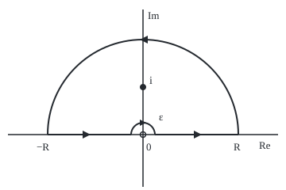
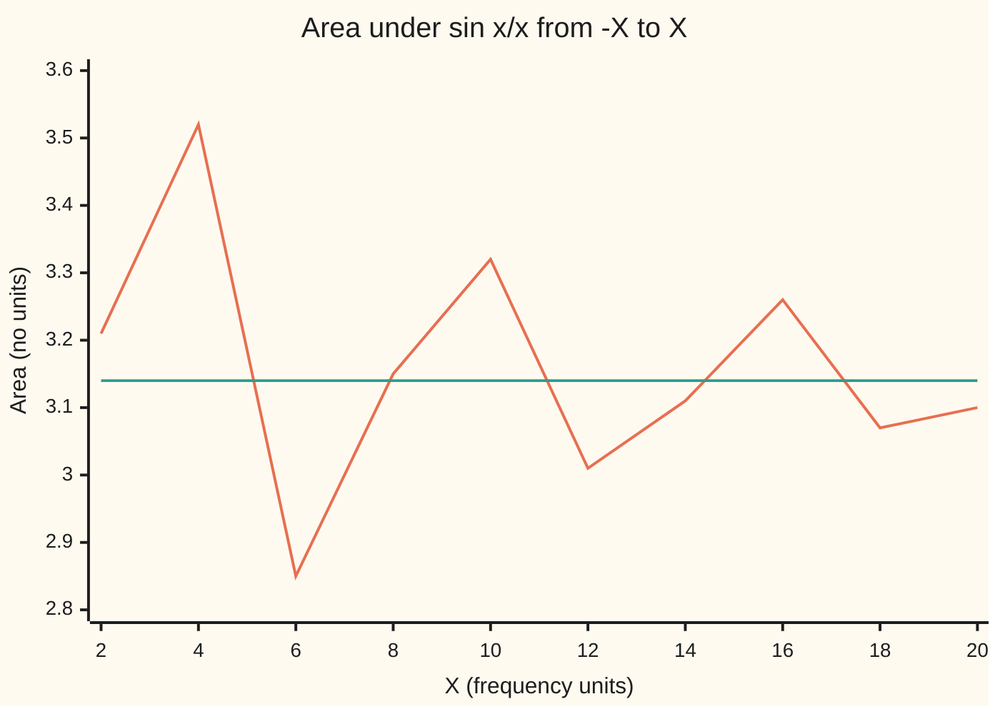

# Poles on the path: dent the contour round them and collect half a residue, and the principal value is what is left

[Syllabus](../../../SYLLABUS.md) → [Complex analysis](../../../SYLLABUS.md#w07) → [Real Integrals and Counting Zeros](../../../SYLLABUS.md#w07-s06) → Poles on the path

---

## General Overview

A camera shutter opens for a fixed moment and shuts. The light it passes is a square pulse: full brightness while open, nothing otherwise. Split that pulse into steady waves. With the open time scaled to 2 units, the strength of the wave at frequency x is proportional to sin x/x: a hump of height 1 at x = 0, then ripples shrinking like 1/x.

Its total signed area, lobes above minus lobes below, is π. Rebuilding the pulse divides that area by π, so the waves added back at the pulse's middle give brightness 1: fully open.

The contour method of [Jordan's lemma](03-oscillatory-integrals-and-jordans-lemma.md) trades sin x/x for e^(iz)/z, which has a pole at 0, right on the path. The fix is a tiny half-circle round it: a dent. The dent does not shrink to nothing; it keeps half the pole's residue. What the rest of the path measures is the principal value: the integral with equal gaps cut out either side of the pole. For 1/(x(1 + x^2)) the pieces left and right of 0 are each infinite, yet the principal value is 0.

**A tiny half-circle round a simple pole on the path contributes −iπ times the residue, so the principal value of a real integral is 2πi times the residues above the axis plus iπ times the residues on it.**

**What kind of fact this is:** a theorem, proved on this card in Why it works; the principal value it computes is a definition.

### The picture: the dented loop at R = 2

<p align="center"></p>

To scale: 60 units per 1, 0 at (180, 170), R = 2, ε = 0.25. Segments (60.00, 170.00)-(165.00, 170.00) and (195.00, 170.00)-(300.00, 170.00); dent top (180.00, 155.00); arc top (180.00, 50.00); i at (180.00, 110.00). Hollow: the pole at 0, outside. Dot: the second example's pole, inside. The dent runs clockwise.

---

## The formula

A reminder: the residue $\operatorname{Res}(f, a)$ is the coefficient of 1/(z − a) in f's expansion near a pole a, and a loop integral is 2πi times the residues inside ([The residue theorem](../05-Laurent%20Series%2C%20Singularities%20and%20Residues/05-the-residue-theorem.md)). At a **simple pole** f behaves like c/(z − a), nothing worse.

The definition: cut a gap of half-width ε either side of the pole a, integrate the rest, then shrink the gap and widen the ends:

$$\operatorname{PV}\int_{-\infty}^{\infty} f(x)\,dx = \lim_{\varepsilon \to 0,\ R \to \infty}\left(\int_{-R}^{a-\varepsilon} f(x)\,dx + \int_{a+\varepsilon}^{R} f(x)\,dx\right).$$

**Read it aloud:** the integral with equal gaps cut round the pole, in the limit as the gaps close.

The dent. Let $\Gamma_\varepsilon$ be the arc $z = a + \varepsilon e^{it}$, with t running from an angle α to an angle β. At a simple pole with residue c,

$$\lim_{\varepsilon \to 0} \int_{\Gamma_\varepsilon} f(z)\,dz = i(\beta - \alpha)\,c.$$

**Read it aloud:** a shrinking arc round a simple pole picks up i times the angle it sweeps times the residue.

The upper dent runs from angle π to 0, so it picks up −iπc. When the big arc $C_R$ fades as R grows,

$$\operatorname{PV}\int_{-\infty}^{\infty} f(x)\,dx = 2\pi i \sum_{\operatorname{Im} b > 0} \operatorname{Res}(f, b) + i\pi \sum_{a \text{ real}} \operatorname{Res}(f, a).$$

**Read it aloud:** full residues above the axis, half residues on it.

| Symbol | Plain meaning | In our example | Push it up and the answer… |
| --- | --- | --- | --- |
| $f$, $x$, $z$ | the function; a real point; a point of the plane | e^(iz)/z, then 1/(z(1 + z^2)) | — |
| $a$, $c$ | a simple pole on the real line; its residue | a = 0, c = 1 in both | the dent's share grows |
| $b$ | a pole above the real axis | i, for the second example | — |
| $\varepsilon$, $\Gamma_\varepsilon$ | the dent's radius; the dent itself | 0.5, 0.1, 0.01 | dent moves away from −iπc |
| $R$, $C_R$ | the big arc's radius; the big arc | 5, 10, 20 | the arc fades |
| $t$, $\alpha$, $\beta$ | angle along an arc; its start and end | π to 0 on the dent | a bigger share |
| $\operatorname{PV}$ | principal value: equal gaps, then the limit | iπ, then 0 | — |
| $i$, $\pi$ | the quarter turn, i^2 = −1; a half turn in radians | the dent sweeps π | — |

### When it holds

- **A simple pole on the path.** At a double pole the dent blows up: for 1/z^2 it is −2/ε, −200 at ε = 0.01, though the residue is 0.
- **Equal gaps.** Take the left gap twice the right and the second example tends to ln 2 = 0.693147, not 0.
- **The big arc fades.** A degree gap of 2 ([The semicircle contour](01-semicircle-contours.md)) or a factor e^(iz) does it.
- **Not the ordinary integral.** When each side converges on its own, the two agree; for 1/(x(1 + x^2)) only the principal value exists.

---

## Why it works

### Step 0: a half-turn round a pole is half of a full turn

The integral of 1/(z − a) round a pole counts only the angle swept, not the radius. A full turn gives 2πi times the residue, so a clockwise half-turn gives −πi times it.

### Step 1: prove the arc rule

Near a simple pole, $f(z) = c/(z - a) + g(z)$, where g is holomorphic at a and so bounded, say by M, on a small disc. On the arc, z − a = εe^(it) and dz = iεe^(it) dt. The singular part integrates exactly:

$$\int_\alpha^\beta \frac{c}{\varepsilon e^{it}}\, i\varepsilon e^{it}\,dt = i(\beta - \alpha)\,c.$$

The radius cancels. The remainder is at most M times the length ε|β − α|, which tends to 0.

For e^(iz)/z, c = 1 and g(z) = (e^(iz) − 1)/z. Its series gives |g| ≤ (e^ε − 1)/ε, so the dent is within π(e^ε − 1) of −iπ: at ε = 0.1 it is −2.941704i, off by 0.199889, bound 0.330404.

### Step 2: close the dented loop for sin x/x

Walk from −R to −ε, over the dent to ε, on to R, and back along the big arc. The pole at 0 is dented out, so nothing is inside and Cauchy's theorem makes the loop 0 ([Cauchy's theorem](../03-Contour%20Integrals%20and%20Cauchy%27s%20Theorem/03-cauchys-theorem.md)).

At x and −x, e^(ix)/x adds to 2i sin x/x: the cosine parts cancel. So the segments give 2i times the area under sin x/x from ε to R. At ε = 0.1, R = 10 the pieces are 3.116806i, −2.941704i and −0.175103i, summing to 0. Jordan's lemma bounds the big arc by π/R. Let ε shrink and R grow:

$$\operatorname{PV}\int_{-\infty}^{\infty} \frac{e^{ix}}{x}\,dx - i\pi = 0, \qquad \text{so} \qquad \int_{-\infty}^{\infty} \frac{\sin x}{x}\,dx = \pi.$$

The imaginary part is the shutter's area; sin x/x has no pole, so it needs no principal value.

### Step 3: a real pole with a pole inside

For $f(z) = 1/(z(1 + z^2))$ the pole at 0 has residue 1 and the pole at i has residue 1/(i · 2i) = −1/2. The dented loop now encloses i:

$$\operatorname{PV}\int_{-\infty}^{\infty} \frac{dx}{x(1 + x^2)} + (-i\pi)(1) = 2\pi i\left(-\tfrac{1}{2}\right) = -i\pi.$$

So the principal value is 0. On the big arc |f| ≤ 1/(R(R^2 − 1)) and the length is πR, so the arc is at most π/(R^2 − 1).

### Step 4: the one-sided pieces are infinite

F(x) = ln|x| − ½ ln(1 + x^2) has derivative 1/x − x/(1 + x^2) = f(x). So the piece from ε to 1 is −½ ln 2 − ln ε + ½ ln(1 + ε^2): 4.258647 at ε = 0.01, 8.863767 at ε = 0.0001, without bound. The left piece is its mirror, since f is odd, so the matched sum is 0 for every ε. The ordinary integral does not exist.

<details>
<summary>Detailed proof: the limits, with every bound</summary>

**Arc rule.** At a simple pole, g = f − c/(z − a) is continuous on a closed disc |z − a| ≤ ε0, so |g| ≤ M there. For ε < ε0 the remainder is at most Mε|β − α|, below any tolerance η > 0 once ε < η/(M|β − α|). The singular part is i(β − α)c exactly.

**sin x/x.** Segments + dent + big arc = 0 for every 0 < ε < R. The dent is within π(e^ε − 1) of −iπ and the arc within π/R; the bounds are separate, so the joint limit holds however ε and R move. So the integral of sin x/x from ε to R tends to π/2.

**Convergence on its own.** Split the half-line at multiples of π. The humps alternate in sign and shrink to 0, so their sums converge: the alternating series test. The integral of |sin x/x| diverges, since the k-th hump is at least 2/((k + 1)π), a harmonic tail.

**Unequal gaps.** Gaps λε and ε give F(λε) − F(ε), which tends to ln λ.

</details>

A second road needs no complex numbers: add the humps of sin x/x between multiples of π, then average neighbouring running totals until they settle. Pushing the pole off the line by a small iδ instead of denting gives the principal value plus or minus iπ times the residue; that split drives The Hilbert transform.

---

## Worked numbers, by hand

| Step | Arithmetic | Value |
| --- | --- | --- |
| Residue of e^(iz)/z at 0 | z · e^(iz)/z at z = 0 | 1 |
| Dent's limit | −iπ × 1 | −3.141593i |
| Loop has nothing inside | PV − iπ = 0 | PV = 3.141593i |
| Shutter's area | imaginary part | **3.141593** |
| Second example: residue at i | 1/(i · 2i) | −0.5 |
| Loop | 2πi × (−0.5) | −3.141593i |
| Its principal value | −iπ − (−iπ) | **0** |

Divided by π, the area rebuilds the pulse's middle at brightness 1: fully open.

### The picture: the running area settles on π



Orange: the area from −X to X. Teal: π. The swings shrink only like 1/X.

### What breaks if you drop a piece

| Mistake | Comes out at | What went wrong |
| --- | --- | --- |
| Full residue at the dent | 6.283185 | The dent is half a turn, not a whole one |
| Dent given the anticlockwise sign | −3.141593 | The upper dent runs from angle π down to 0 |
| Left gap 2ε, right gap ε, ε = 0.001 | 0.693146, tending to ln 2 | Unequal gaps are not a principal value |
| Double pole 1/z^2, ε = 0.01 | dent −200 | The half-residue rule needs a simple pole |

---

## Code, from first principles, and it actually runs

Two roads to π. Road one: the residue at 0 by its own limit, then the dent rule. Road two: the humps of sin x/x, each a Simpson sum (area under matched parabolas), then repeated averaging. Every arc is a Simpson sum on its own path. Four asserts: arcs within their bounds; the sin x/x loop sums to 0; the roads agree; the second loop's arc within π/(R^2 − 1), and the loop equal to 2πi times the residue at i.

### Python

```python
# Poles on the path -- the check behind the card.  Standard library only.
# Road one: dent the path round the pole at 0.  The dent keeps -i pi times the
# residue, so PV of e^(ix)/x is i pi and the area under sin x/x is pi.
# Road two: add the humps of sin x/x between multiples of pi, then average the
# partial sums until they settle.  Second example: 1/(x(1+x^2)), PV 0.
import math

def show(w):                                     # 'a + bi', six decimals, no -0.000000
    a, b = round(w.real, 6) + 0.0, round(w.imag, 6) + 0.0
    return f"{a:.6f} {'-' if b < 0 else '+'} {abs(b):.6f}i"
def simpson(g, a, b, n=2000):                    # Simpson's rule on n (even) panels
    h = (b - a) / n
    return h / 3 * (g(a) + g(b) + sum((4 if j % 2 else 2) * g(a + j * h) for j in range(1, n)))
def arc(f, r, start, end):                       # z = r e^(it), dz = i z dt, t from start to end
    return simpson(lambda t: f(r * complex(math.cos(t), math.sin(t))) * 1j * r * complex(math.cos(t), math.sin(t)), start, end)
def wave(z): return complex(math.cos(z.real), math.sin(z.real)) * math.exp(-z.imag) / z   # e^(iz)/z
def rat(z): return 1 / (z * (1 + z * z))         # 1/(z(1+z^2))
def r6(x): return f"{round(x, 6) + 0.0:.6f}"      # six decimals, no -0.000000
def sinc(x): return math.sin(x) / x if x else 1.0
def F(x): return math.log(abs(x)) - 0.5 * math.log(1 + x * x)   # antiderivative of 1/(x(1+x^2)), x not 0

def res(f, a, d=1e-5):                           # residue by its limit (z - a) f(z), from both sides
    return (d * f(a + d) - d * f(a - d)) / 2
c_wave, c_rat, c_i = res(wave, 0j), res(rat, 0j), res(rat, 1j)
print(f"residues by limit: e^(iz)/z at 0 {show(c_wave)}; 1/(z(1+z^2)) at 0 {show(c_rat)}, at i {show(c_i)}")
for eps, R in ((0.5, 5), (0.1, 10), (0.01, 20)):
    dent, big = arc(wave, eps, math.pi, 0), arc(wave, R, 0, math.pi)
    off, bound = abs(dent + 1j * math.pi * c_wave), math.pi * (math.exp(eps) - 1)
    print(f"dent eps = {eps}: {show(dent)}, off -pi i by {off:.6f} (bound {bound:.6f}); big arc R = {R}: size {abs(big):.6f} (Jordan bound {math.pi / R:.6f})")
    assert off <= bound and abs(big) <= math.pi / R
seg = 2j * simpson(sinc, 0.1, 10)                # the two real pieces of e^(ix)/x, eps = 0.1, R = 10
dent, big = arc(wave, 0.1, math.pi, 0), arc(wave, 10, 0, math.pi)
print(f"closed at eps = 0.1, R = 10: segments {show(seg)} + dent {show(dent)} + arc {show(big)} = {show(seg + dent + big)}")
assert abs(seg + dent + big) < 1e-8              # Cauchy: no pole inside, so the loop is 0
road1 = math.pi * c_wave.real                    # PV of e^(ix)/x = -(dent limit) = i pi c
print(f"road 1, dent: PV of e^(ix)/x = {show(1j * road1)}, so area under sin x/x = {road1:.6f}")
sums = [0.0]                                     # road 2: the humps, then repeated averaging
for k in range(40):
    sums.append(sums[-1] + simpson(sinc, k * math.pi, (k + 1) * math.pi, 400))
sums = sums[1:]
for _ in range(20):
    sums = [(p + q) / 2 for p, q in zip(sums, sums[1:])]
road2 = 2 * sums[-1]
print(f"road 2, 40 humps summed and averaged 20 times: {road2:.6f}")
assert abs(road1 - road2) < 1e-9
print("chart, area from -X to X, X = 2, 4, ..., 20:", ", ".join(f"{2 * simpson(sinc, 0, X):.2f}" for X in range(2, 21, 2)), f"(pi {math.pi:.2f})")
for eps in (0.01, 0.0001):
    print(f"1/(x(1+x^2)), gap eps = {eps}: right piece {F(1) - F(eps):.6f}, left piece {F(-eps) - F(-1):.6f}, sum {r6(F(1) - F(eps) + F(-eps) - F(-1))}")
real = F(-0.01) - F(-10) + F(10) - F(0.01)        # both real pieces, eps = 0.01, R = 10
dent, big, loop = arc(rat, 0.01, math.pi, 0), arc(rat, 10, 0, math.pi), 2j * math.pi * c_i
print(f"closed at eps = 0.01, R = 10: real {r6(real)} + dent {show(dent)} + arc {show(big)} (bound {math.pi / 99:.6f}) = {show(real + dent + big)}; 2 pi i x Res at i = {show(loop)}")
assert abs(big) <= math.pi / 99 and abs(real + dent + big - loop) < 1e-8   # arc bound pi/(R^2 - 1)
print(f"PV of 1/(x(1+x^2)) = loop - dent limit = {show(loop + 1j * math.pi * c_rat)}")
print(f"mistake, full residue at 0: {2 * math.pi * c_wave.real:.6f}; dent run anticlockwise: {-road1:.6f}; left gap 2 eps = 0.001: {F(0.002) - F(0.001):.6f} (ln 2 = {math.log(2):.6f})")
print(f"mistake, double pole 1/z^2, dent eps = 0.01: {show(arc(lambda z: 1 / (z * z), 0.01, math.pi, 0))}, though its residue is 0")
o, s = (180, 170), 60                            # figure: 0 at (180, 170), 60 units per 1, R = 2, eps = 0.25
print(f"figure, segments ({o[0] - 2 * s:.2f}, {o[1]:.2f})-({o[0] - s / 4:.2f}, {o[1]:.2f}) and ({o[0] + s / 4:.2f}, {o[1]:.2f})-({o[0] + 2 * s:.2f}, {o[1]:.2f}); dent top ({o[0]:.2f}, {o[1] - s / 4:.2f}); arc top ({o[0]:.2f}, {o[1] - 2 * s:.2f}); i at ({o[0]:.2f}, {o[1] - s:.2f})")
print("ALL CHECKS PASS")
```

**Ran 2026-09-28 on macOS, Python 3.14.6, standard library only. All checks passed. Output, pasted from the run:**

```
residues by limit: e^(iz)/z at 0 1.000000 + 0.000000i; 1/(z(1+z^2)) at 0 1.000000 + 0.000000i, at i -0.500000 + 0.000000i
dent eps = 0.5: 0.000000 - 2.155378i, off -pi i by 0.986215 (bound 2.038018); big arc R = 5: size 0.041730 (Jordan bound 0.628319)
dent eps = 0.1: 0.000000 - 2.941704i, off -pi i by 0.199889 (bound 0.330404); big arc R = 10: size 0.175103 (Jordan bound 0.314159)
dent eps = 0.01: 0.000000 - 3.121593i, off -pi i by 0.020000 (bound 0.031574); big arc R = 20: size 0.045109 (Jordan bound 0.157080)
closed at eps = 0.1, R = 10: segments 0.000000 + 3.116806i + dent 0.000000 - 2.941704i + arc 0.000000 - 0.175103i = 0.000000 + 0.000000i
road 1, dent: PV of e^(ix)/x = 0.000000 + 3.141593i, so area under sin x/x = 3.141593
road 2, 40 humps summed and averaged 20 times: 3.141593
chart, area from -X to X, X = 2, 4, ..., 20: 3.21, 3.52, 2.85, 3.15, 3.32, 3.01, 3.11, 3.26, 3.07, 3.10 (pi 3.14)
1/(x(1+x^2)), gap eps = 0.01: right piece 4.258647, left piece -4.258647, sum 0.000000
1/(x(1+x^2)), gap eps = 0.0001: right piece 8.863767, left piece -8.863767, sum 0.000000
closed at eps = 0.01, R = 10: real 0.000000 + dent 0.000000 - 3.141593i + arc 0.000000 + 0.000000i (bound 0.031733) = 0.000000 - 3.141593i; 2 pi i x Res at i = 0.000000 - 3.141593i
PV of 1/(x(1+x^2)) = loop - dent limit = 0.000000 + 0.000000i
mistake, full residue at 0: 6.283185; dent run anticlockwise: -3.141593; left gap 2 eps = 0.001: 0.693146 (ln 2 = 0.693147)
mistake, double pole 1/z^2, dent eps = 0.01: -200.000000 + 0.000000i, though its residue is 0
figure, segments (60.00, 170.00)-(165.00, 170.00) and (195.00, 170.00)-(300.00, 170.00); dent top (180.00, 155.00); arc top (180.00, 50.00); i at (180.00, 110.00)
ALL CHECKS PASS
```

### Rust

Same numbers, same labels, built with `rustc --edition 2021 -O`.

```rust
// Poles on the path -- the same check as the Python, in Rust.  No crates.
// Road one: dent the path round the pole at 0.  The dent keeps -i pi times the
// residue, so PV of e^(ix)/x is i pi and the area under sin x/x is pi.
// Road two: add the humps of sin x/x between multiples of pi, then average the
// partial sums until they settle.  Second example: 1/(x(1+x^2)), PV 0.
use std::f64::consts::PI;
#[derive(Clone, Copy)]
struct C { re: f64, im: f64 }
fn c(re: f64, im: f64) -> C { C { re, im } }
fn add(a: C, b: C) -> C { c(a.re + b.re, a.im + b.im) }
fn sub(a: C, b: C) -> C { c(a.re - b.re, a.im - b.im) }
fn mul(a: C, b: C) -> C { c(a.re * b.re - a.im * b.im, a.re * b.im + a.im * b.re) }
fn div(a: C, b: C) -> C { let d = b.re * b.re + b.im * b.im; c((a.re * b.re + a.im * b.im) / d, (a.im * b.re - a.re * b.im) / d) }
fn scale(a: C, k: f64) -> C { c(a.re * k, a.im * k) }
fn abs(a: C) -> f64 { a.re.hypot(a.im) }
fn r6(x: f64) -> String { let s = format!("{:.6}", x); if s == "-0.000000" { "0.000000".to_string() } else { s } }
fn show(w: C) -> String { // 'a + bi', six decimals, no -0.000000
    let b = format!("{:.6}", w.im.abs());
    format!("{} {} {}i", r6(w.re), if w.im < 0.0 && b != "0.000000" { '-' } else { '+' }, b)
}
fn simpson(g: &dyn Fn(f64) -> C, a: f64, b: f64, n: usize) -> C { // Simpson's rule on n (even) panels
    let h = (b - a) / n as f64;
    let mut s = add(g(a), g(b));
    for j in 1..n { s = add(s, scale(g(a + j as f64 * h), if j % 2 == 1 { 4.0 } else { 2.0 })) }
    scale(s, h / 3.0)
}
fn arc(f: &dyn Fn(C) -> C, r: f64, start: f64, end: f64) -> C { // z = r e^(it), dz = i z dt
    simpson(&|t: f64| { let z = c(r * t.cos(), r * t.sin()); mul(f(z), c(-z.im, z.re)) }, start, end, 2000)
}
fn wave(z: C) -> C { div(scale(c(z.re.cos(), z.re.sin()), (-z.im).exp()), z) } // e^(iz)/z
fn rat(z: C) -> C { div(c(1.0, 0.0), mul(z, add(c(1.0, 0.0), mul(z, z)))) } // 1/(z(1+z^2))
fn sinc(x: f64) -> C { c(if x == 0.0 { 1.0 } else { x.sin() / x }, 0.0) }
fn big_f(x: f64) -> f64 { x.abs().ln() - 0.5 * (1.0 + x * x).ln() } // antiderivative of 1/(x(1+x^2))
fn res(f: fn(C) -> C, a: C) -> C { // residue by its limit (z - a) f(z), from both sides
    let d = 1e-5;
    scale(sub(scale(f(add(a, c(d, 0.0))), d), scale(f(sub(a, c(d, 0.0))), d)), 0.5)
}
fn main() {
    let (c_wave, c_rat, c_i) = (res(wave, c(0.0, 0.0)), res(rat, c(0.0, 0.0)), res(rat, c(0.0, 1.0)));
    println!("residues by limit: e^(iz)/z at 0 {}; 1/(z(1+z^2)) at 0 {}, at i {}", show(c_wave), show(c_rat), show(c_i));
    for (eps, r) in [(0.5f64, 5.0f64), (0.1, 10.0), (0.01, 20.0)] {
        let (dent, big) = (arc(&wave, eps, PI, 0.0), arc(&wave, r, 0.0, PI));
        let (off, bound) = (abs(add(dent, mul(c(0.0, PI), c_wave))), PI * (eps.exp() - 1.0));
        println!("dent eps = {}: {}, off -pi i by {:.6} (bound {:.6}); big arc R = {}: size {:.6} (Jordan bound {:.6})", eps, show(dent), off, bound, r, abs(big), PI / r);
        assert!(off <= bound && abs(big) <= PI / r);
    }
    let seg = mul(c(0.0, 2.0), simpson(&sinc, 0.1, 10.0, 2000)); // the two real pieces of e^(ix)/x
    let (dent, big) = (arc(&wave, 0.1, PI, 0.0), arc(&wave, 10.0, 0.0, PI));
    let total = add(seg, add(dent, big));
    println!("closed at eps = 0.1, R = 10: segments {} + dent {} + arc {} = {}", show(seg), show(dent), show(big), show(total));
    assert!(abs(total) < 1e-8); // Cauchy: no pole inside, so the loop is 0
    let road1 = PI * c_wave.re; // PV of e^(ix)/x = -(dent limit) = i pi c
    println!("road 1, dent: PV of e^(ix)/x = {}, so area under sin x/x = {:.6}", show(c(0.0, road1)), road1);
    let mut sums: Vec<f64> = Vec::new(); // road 2: the humps, then repeated averaging
    let mut acc = 0.0;
    for k in 0..40 { acc += simpson(&sinc, k as f64 * PI, (k + 1) as f64 * PI, 400).re; sums.push(acc) }
    for _ in 0..20 { sums = sums.windows(2).map(|w| (w[0] + w[1]) / 2.0).collect() }
    let road2 = 2.0 * sums[sums.len() - 1];
    println!("road 2, 40 humps summed and averaged 20 times: {:.6}", road2);
    assert!((road1 - road2).abs() < 1e-9);
    let chart: Vec<String> = (1..=10).map(|k| format!("{:.2}", 2.0 * simpson(&sinc, 0.0, 2.0 * k as f64, 2000).re)).collect();
    println!("chart, area from -X to X, X = 2, 4, ..., 20: {} (pi {:.2})", chart.join(", "), PI);
    for eps in [0.01f64, 0.0001] {
        let (right, left) = (big_f(1.0) - big_f(eps), big_f(-eps) - big_f(-1.0));
        println!("1/(x(1+x^2)), gap eps = {}: right piece {:.6}, left piece {:.6}, sum {}", eps, right, left, r6(right + left));
    }
    let real = big_f(-0.01) - big_f(-10.0) + big_f(10.0) - big_f(0.01); // both real pieces, eps = 0.01, R = 10
    let (dent, big, lp) = (arc(&rat, 0.01, PI, 0.0), arc(&rat, 10.0, 0.0, PI), mul(c(0.0, 2.0 * PI), c_i));
    let closed = add(c(real, 0.0), add(dent, big));
    println!("closed at eps = 0.01, R = 10: real {} + dent {} + arc {} (bound {:.6}) = {}; 2 pi i x Res at i = {}", r6(real), show(dent), show(big), PI / 99.0, show(closed), show(lp));
    assert!(abs(big) <= PI / 99.0 && abs(sub(closed, lp)) < 1e-8); // arc bound pi/(R^2 - 1)
    println!("PV of 1/(x(1+x^2)) = loop - dent limit = {}", show(add(lp, mul(c(0.0, PI), c_rat))));
    println!("mistake, full residue at 0: {:.6}; dent run anticlockwise: {:.6}; left gap 2 eps = 0.001: {:.6} (ln 2 = {:.6})", 2.0 * PI * c_wave.re, -road1, big_f(0.002) - big_f(0.001), 2f64.ln());
    println!("mistake, double pole 1/z^2, dent eps = 0.01: {}, though its residue is 0", show(arc(&|z: C| div(c(1.0, 0.0), mul(z, z)), 0.01, PI, 0.0)));
    let (ox, oy, s) = (180.0, 170.0, 60.0); // figure: 0 at (180, 170), 60 units per 1, R = 2, eps = 0.25
    println!("figure, segments ({:.2}, {:.2})-({:.2}, {:.2}) and ({:.2}, {:.2})-({:.2}, {:.2}); dent top ({:.2}, {:.2}); arc top ({:.2}, {:.2}); i at ({:.2}, {:.2})",
        ox - 2.0 * s, oy, ox - s / 4.0, oy, ox + s / 4.0, oy, ox + 2.0 * s, oy, ox, oy - s / 4.0, ox, oy - 2.0 * s, ox, oy - s);
    println!("ALL CHECKS PASS");
}
```

**Ran 2026-09-28 on macOS, rustc 1.98.1, no crates. All checks passed. Output, pasted from the run:**

```
residues by limit: e^(iz)/z at 0 1.000000 + 0.000000i; 1/(z(1+z^2)) at 0 1.000000 + 0.000000i, at i -0.500000 + 0.000000i
dent eps = 0.5: 0.000000 - 2.155378i, off -pi i by 0.986215 (bound 2.038018); big arc R = 5: size 0.041730 (Jordan bound 0.628319)
dent eps = 0.1: 0.000000 - 2.941704i, off -pi i by 0.199889 (bound 0.330404); big arc R = 10: size 0.175103 (Jordan bound 0.314159)
dent eps = 0.01: 0.000000 - 3.121593i, off -pi i by 0.020000 (bound 0.031574); big arc R = 20: size 0.045109 (Jordan bound 0.157080)
closed at eps = 0.1, R = 10: segments 0.000000 + 3.116806i + dent 0.000000 - 2.941704i + arc 0.000000 - 0.175103i = 0.000000 + 0.000000i
road 1, dent: PV of e^(ix)/x = 0.000000 + 3.141593i, so area under sin x/x = 3.141593
road 2, 40 humps summed and averaged 20 times: 3.141593
chart, area from -X to X, X = 2, 4, ..., 20: 3.21, 3.52, 2.85, 3.15, 3.32, 3.01, 3.11, 3.26, 3.07, 3.10 (pi 3.14)
1/(x(1+x^2)), gap eps = 0.01: right piece 4.258647, left piece -4.258647, sum 0.000000
1/(x(1+x^2)), gap eps = 0.0001: right piece 8.863767, left piece -8.863767, sum 0.000000
closed at eps = 0.01, R = 10: real 0.000000 + dent 0.000000 - 3.141593i + arc 0.000000 + 0.000000i (bound 0.031733) = 0.000000 - 3.141593i; 2 pi i x Res at i = 0.000000 - 3.141593i
PV of 1/(x(1+x^2)) = loop - dent limit = 0.000000 + 0.000000i
mistake, full residue at 0: 6.283185; dent run anticlockwise: -3.141593; left gap 2 eps = 0.001: 0.693146 (ln 2 = 0.693147)
mistake, double pole 1/z^2, dent eps = 0.01: -200.000000 + 0.000000i, though its residue is 0
figure, segments (60.00, 170.00)-(165.00, 170.00) and (195.00, 170.00)-(300.00, 170.00); dent top (180.00, 155.00); arc top (180.00, 50.00); i at (180.00, 110.00)
ALL CHECKS PASS
```

The two outputs match line for line.

> [!TIP]
> **Try changing**
> Guess first, then run it.
> - **Forget dz.** In `arc`, delete `1j * r * `. The first assert stops it: the dent at ε = 0.5 misses its bound.
> - **The whole residue.** Set `road1 = 2 * math.pi * c_wave.real`. It reads 6.283185; the road assert stops it.
> - **Fewer averagings.** Change `range(20)` to `range(2)`. Road two misses π in the sixth decimal and the road assert stops it.

---

## The usual mistake

> [!warning]
> **Letting the dent shrink to nothing.** Round a simple pole the function grows like 1/ε exactly as the arc's length shrinks like ε, so the dent stays at −iπ times the residue. Drop it and sin x/x comes out at 0.
>
> - **Counting the pole fully.** That gives 6.283185. Dent below instead and the pole is inside: dent +iπ, loop 2πi, principal value iπ again.
> - **Principal value read as an ordinary integral.** For 1/(x(1 + x^2)) each side is infinite, 8.863767 at ε = 0.0001.
> - **Unmatched gaps.** Left gap twice the right gives ln 2, not 0.

---

## Where you meet it in real life

- **Optics and cameras.** A slit or a shutter has a sin x/x profile; its area π fixes the rebuilt pulse's height.
- **Signal processing.** An ideal low-pass filter, keeping frequencies below a cut-off, smooths with a sin x/x kernel.
- **Physics.** Poles on the real frequency axis are pushed off by a small iδ: a principal value plus or minus iπ times a residue.
- **Analytic signals.** The principal value against 1/(x − t) is the Hilbert transform: The Hilbert transform.

> **Say it back**
> A pole on the path is stepped round on a tiny half-circle. At a simple pole that half-circle keeps −iπ times the residue. The real line then carries the principal value: equal gaps cut round the pole. For e^(ix)/x nothing is inside, so the area under sin x/x is π. For 1/(x(1 + x^2)) each side is infinite, but the principal value is 0.

---

## What this builds on

- [Jordan's lemma](03-oscillatory-integrals-and-jordans-lemma.md): the factor e^(iz) and the bound π/R that makes the big arc fade.

## Where this goes next

- The Hilbert transform: the principal value against 1/(x − t) as a transform in its own right.

A dent handles one pole; taking the principal value against 1/(x − t) at every t at once is an operation on whole signals, and what it does to a wave is the Hilbert transform.

---

## Sources

Verified 28 Sep 2026: every link below opens a page naming the cited work.

- Orloff, Jeremy. "Topic 9: Definite integrals using the residue theorem." MIT OpenCourseWare 18.04, Spring 2018. [Course notes](https://ocw.mit.edu/courses/18-04-complex-variables-with-applications-spring-2018/resources/mit18_04s18_topic9/). Principal values, the half-residue arc theorem and indented contours.
- Stein, Elias M., and Rami Shakarchi. *Complex Analysis*. Princeton University Press, 2003. [Publisher page](https://press.princeton.edu/books/hardcover/9780691113852/complex-analysis). Chapter 2's exercises reach the integral of sin x/x on an indented semicircle.
