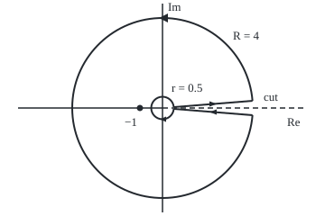

# The keyhole contour: wrap a branch cut, and the two banks disagree by exactly the factor that solves the integral

Complex analysis → Real Integrals and Counting Zeros → Integrals with a branch cut → The keyhole contour

---

## General Overview

An old door lock has a keyhole: a round hole with a narrow slot running out of it. Trace its edge with a pencil: out along one side of the slot, round the big curve, back along the other side, round the small curve, home.

Lay that shape on the plane: small curve round 0, slot along the positive real axis, big curve a circle of radius R. That closed path is a **keyhole contour**. Its two straight sides are the **banks**, just above and just below the positive real axis.

The target: the area under 1/(√x (1 + x)) from 0 to infinity. It is exactly π = 3.141593, found with no antiderivative. A square root has two values, so in the plane it needs a **branch cut**, a line where the chosen value jumps ([branch-cuts-and-complex-powers](../02-Holomorphic%20Functions/05-branch-cuts-and-complex-powers.md)). Put the cut along the positive axis. Just above it the root reads √x; just below, −√x. Opposite signs, walked in opposite directions, so the banks add: two copies of the area. The residue at −1 prices the loop, the circles fade, and an equation for the area is left, for any power between 0 and 1.

**For 0 < a < 1, the area under x^(a−1)/(1 + x) from 0 to infinity is π/sin(πa), because the keyhole's two banks carry the same integral multiplied by 1 and by e^(2πia), and the residue at −1 fixes their difference.**

**What kind of fact this is:** a theorem, proved on this card in Why it works; the limits are in the folded Detailed proof.

### The picture: the keyhole with r = 0.5 and R = 4

<p align="center"></p>

To scale: 25 units per 1, 0 at (180, 120). The banks are drawn at angle 0.08 either side of the dashed cut so both show. Direction: out along the top, anticlockwise round the big circle, in along the bottom, clockwise round the small one.

---

## The formula

A branch of the power $z^{a-1}$ is fixed by choosing the angle $\theta$ of z; here it runs from 0 to 2π:

$$z^{a-1} = |z|^{a-1}\, e^{i(a-1)\theta}, \qquad 0 < \theta < 2\pi.$$

Reminder: Res, the residue at a pole p, is the coefficient of 1/(z − p) there; a loop integral is 2πi times the residues inside ([the-residue-theorem](../05-Laurent%20Series%2C%20Singularities%20and%20Residues/05-the-residue-theorem.md)).

$$I(a) = \int_0^\infty \frac{x^{a-1}}{1+x}\,dx = \frac{\pi}{\sin(\pi a)}, \qquad 0 < a < 1.$$

**Read it aloud:** the area under x to the a minus 1, over 1 plus x, from 0 to infinity, is π over the sine of π a.

The engine is one exact equation, for every r below 1 and R above 1:

$$\big(1 - e^{2\pi i a}\big)\int_r^R \frac{x^{a-1}}{1+x}\,dx \;+\; \oint_{|z|=R} F \;+\; \oint_{|z|=r} F \;=\; 2\pi i\,\operatorname{Res}(F, -1), \qquad F(z) = \frac{z^{a-1}}{1+z}.$$

**Read it aloud:** the banks give one minus e to the 2πia, times the real integral; add both circles; the total is 2πi times the residue at −1.

| Symbol | Plain meaning | In our example | Push it up and the answer… |
| --- | --- | --- | --- |
| $a$ | the power, strictly between 0 and 1 | 1/2, then 1/4 and 3/4 | falls to π at 1/2, then rises |
| $x$ | a point on the positive real axis | from 0 to infinity | — |
| $z$, $\theta$ | a point of the plane; its angle, in (0, 2π) | −1 has angle π | — |
| $F$ | the complex integrand $z^{a-1}/(1+z)$ | pole at −1 only | — |
| $I$ | the real area being sought | π at a = 1/2 | — |
| $r$, $R$ | radii of the small and big circles | 0.5 and 4 | R up, or r down: that circle's share shrinks towards 0 |
| $e^{2\pi i a}$ | the bottom bank's factor | −1 at a = 1/2 | — |
| Res | the residue of F at −1: the value of $z^{a-1}$ there | $e^{i\pi(a-1)}$, which is −i at a = 1/2 | — |

### When it holds

- **0 < a < 1.** Near 0 the integrand is about x^(a−1), finite in area only if a > 0; far out about x^(a−2), finite only if a < 1. At a = 1 the big circle stays at 6.283185i.
- **One branch, used everywhere.** At −1 the angle is π, not −π; −π gives −3.141593, a negative area.
- **The bottom bank walked inward.** Its direction adds a minus sign. Forget it and a = 1/4 gives −4.442883i.
- **No pole on the cut.** Another rational factor Q works if Q has no pole on the positive axis and x^a Q(x) → 0 at 0 and at infinity; sum the residues of every pole.

---

## Why it works

### Step 0: the jump across the cut is the lever

Out along a line and back along it cancels. Across a branch cut the power jumps by a fixed factor, so the out-and-back walk leaves a multiple of the real integral. The residue theorem prices the loop; solve for the multiple.

### Step 1: choose the branch, read the two banks

With the angle in (0, 2π), the power is holomorphic (has a complex derivative) everywhere off the positive real axis. Approach a point x > 0 from above: the angle tends to 0 and $z^{a-1}$ tends to the real power x^(a−1). From below the angle tends to 2π and the value tends to

$$x^{a-1} e^{2\pi i (a-1)} = x^{a-1} e^{2\pi i a}.$$

At a = 1/2 the factor is e^(iπ) = −1: the square root flips sign.

### Step 2: price the loop by its one pole

The keyhole encloses one pole, −1, where 1 + z vanishes. It is simple (1 + z vanishes to first order), so the residue is the rest of F there: $z^{a-1}$ at z = −1, angle π, size 1. So Res = e^(iπ(a−1)) = −e^(iπa). At a = 1/2 that is −i, and the loop is worth 2πi × (−i) = 2π = 6.283185.

### Step 3: add up the four pieces

The top bank, walked outward, gives the real integral from r to R. The bottom bank carries the same integrand times e^(2πia), walked inward, so it gives −e^(2πia) times that number. Together: the factor 1 − e^(2πia). At a = 1/2, r = 0.5, R = 4 the code sums each piece by trapezoids:

| Piece | Value |
| --- | --- |
| top bank | 0.983338 |
| bottom bank | 0.983338 |
| big circle | 1.854590 |
| small circle | 2.461919 |
| **total** | **6.283185 = 2π** |

The banks agree because −e^(iπ) = +1. At a = 1/4 the pieces total 4.442883 − 4.442883i, again 2πi times the residue.

### Step 4: the circles fade

The **ML bound**: a path integral is at most M, the integrand's largest size on the path, times L, the path's length. On |z| = R the power has size R^(a−1) and |1 + z| ≥ R − 1. So

$$\left|\oint_{|z|=R} F\right| \le \frac{2\pi R^{a}}{R-1}, \qquad \left|\oint_{|z|=r} F\right| \le \frac{2\pi r^{a}}{1-r}.$$

The first tends to 0 because a < 1; the second because a > 0. At a = 1/2 the big circle measures 1.854590, 0.497420, 0.124959 at R = 4, 64, 1024, each under its bound; the small circle 2.461919, 0.497420, 0.124959 at r = 1/2, 1/64, 1/1024.

### Step 5: solve

Let r shrink and R grow. The banks' integral tends to I(a), the circles to 0:

$$\big(1 - e^{2\pi i a}\big)\, I(a) = -2\pi i\, e^{i\pi a}.$$

Factor out e^(iπa): 1 − e^(2πia) = e^(iπa)(e^(−iπa) − e^(iπa)) = −2i e^(iπa) sin(πa). Divide:

$$I(a) = \frac{-2\pi i\, e^{i\pi a}}{-2i\, e^{i\pi a} \sin(\pi a)} = \frac{\pi}{\sin(\pi a)}.$$

For 0 < a < 1, sin(πa) > 0, so the answer is positive and real, as an area must be.

<details>
<summary>Detailed proof</summary>

**The real integral exists.** The integrand lies between half and all of x^(a−1) on (0, 1], and of x^(a−2) on [1, ∞): finite area exactly when 0 < a < 1. It is positive, so J(r, R), the integral from r to R, rises to I(a).

**The loop stays off the cut.** Fix 0 < r < 1 < R and a small angle δ > 0. Run the keyhole with its banks on the rays at angles δ and 2π − δ. This path lies where the branch is holomorphic and winds once round −1, so it gives exactly 2πi e^(iπ(a−1)).

**Let δ → 0.** On the ray at angle δ, F(z) dz = x^(a−1) e^(iaδ) dx/(1 + x e^(iδ)), uniformly continuous in (x, δ) on a closed bounded set, so the ray integral tends to J(r, R). At 2π − δ the limit is −e^(2πia) J(r, R); the arcs tend to the circles. That is the engine equation.

**Let r → 0, R → ∞.** The ML bounds tend to 0 and J(r, R) → I(a). Step 5's algebra finishes.

</details>

A second road avoids the plane: x = e^u turns the area into that of e^(au)/(1 + e^u) over the whole line, a smooth hill the code sums directly. At a = 1/2, x = t^2 gives 2 dt/(1 + t^2) from 0 to infinity, π again, as in [semicircle-contours](01-semicircle-contours.md).

---

## Worked numbers, by hand

At a = 1/2:

| Step | Arithmetic | Value |
| --- | --- | --- |
| Bottom-bank factor | e^(2πi × 1/2) = e^(iπ) | −1 |
| Banks combined | 1 − (−1) | 2, so 2I |
| Residue at −1 | e^(iπ(1/2 − 1)) = e^(−iπ/2) | −i |
| Loop value | 2πi × (−i) | 6.283185 |
| Solve | 2I = 2π | **I = 3.141593** |
| Check | π/sin(π/2) = π/1 | 3.141593 |
| Second case, a = 1/4 | π/sin(π/4) = π√2 | 4.442883 |
| a = 3/4 | x = 1/u turns I(3/4) into I(1/4) | 4.442883 |

The curve is infinitely tall at 0 and never reaches zero height, yet the area under it is π.

### What breaks if you drop a piece

| Mistake | Comes out at | What went wrong |
| --- | --- | --- |
| Bottom bank given the top value | four pieces 4.316509, not 6.283185 | the banks cancel |
| Angle of −1 read as −π | −3.141593 | residue on another branch |
| Bottom bank not reversed, a = 1/4 | −4.442883i | the inward minus sign lost |
| a = 1 | big circle 6.283185i at R = 4 and R = 64 | the big circle never fades |

---

## Code, from first principles, and it actually runs

The power is built by hand from size and angle. Road one sums the real area after x = e^u, from u = −80 to 80, and meets π/sin(πa) at three powers. Road two sums the keyhole's four pieces by trapezoids and meets 2πi times the residue; its error falls by 16 each time the step count quadruples. Asserts: road one against the closed form and the residue route; the keyhole against 2πi times the residue; every circle under its bound and shrinking.

### Python

```python
# The keyhole contour -- the check behind the card.  Standard library only.
# Road one: the real integral of x^(a-1)/(1+x), summed after x = e^u.
# Road two: a trapezoid sum round the keyhole, against 2 pi i times the residue at -1.
# The branch of z^(a-1) is built by hand, argument in [0, 2 pi]: no library power of z.
import math

def show(w):                                  # 'a + bi', six decimals, no -0.000000
    a, b = round(w.real, 6) + 0.0, round(w.imag, 6) + 0.0
    return f"{a:.6f} {'-' if b < 0 else '+'} {abs(b):.6f}i"
def e(t): return complex(math.cos(t), math.sin(t))              # e^(it)
def power(rho, th, a): return rho ** (a - 1) * e((a - 1) * th)  # z^(a-1) at z = rho e^(i th)
def trap(g, lo, hi, n):                       # trapezoid sum of g from lo to hi, n steps
    h = (hi - lo) / n
    return h * (sum(g(lo + j * h) for j in range(1, n)) + (g(lo) + g(hi)) / 2)
def real_road(a):                             # x = e^u, dx = e^u du, u from -80 to 80
    return trap(lambda u: math.exp(a * u) / (1 + math.exp(u)), -80, 80, 4000)
def bank(a, th, r, R, n):                     # z = x e^(i th) on a bank, x from r to R, via x = e^u
    return trap(lambda u: power(math.exp(u), th, a) * math.exp(u) / (1 + math.exp(u)), math.log(r), math.log(R), n)
def circle(a, rho, t0, t1, n=4000):           # z = rho e^(it), dz = i z dt, t from t0 to t1
    return trap(lambda t: power(rho, t, a) * 1j * rho * e(t) / (1 + rho * e(t)), t0, t1, n)
def keyhole(a, r, R, n=4000, low=2 * math.pi):   # out along the top bank, round, in along the bottom, back round 0
    return (bank(a, 0, r, R, n), -bank(a, low, r, R, n), circle(a, R, 0, 2 * math.pi, n), circle(a, r, 2 * math.pi, 0, n))
res = lambda a: power(1, math.pi, a)          # (z + 1) F(z) = z^(a-1), at z = -1 = e^(i pi)
solve = lambda a: 2j * math.pi * res(a) / (1 - e(2 * math.pi * a))

for a in (0.25, 0.5, 0.75):
    print(f"a = {a:.2f}: pi/sin(pi a) = {math.pi / math.sin(math.pi * a):.6f}; real line, x = e^u: {real_road(a):.6f}; residue route: {show(solve(a))}")
    assert abs(real_road(a) - math.pi / math.sin(math.pi * a)) < 1e-8 and abs(solve(a) - real_road(a)) < 1e-8
print(f"a = 0.50: residue at -1 {show(res(0.5))}; bottom-bank factor e^(2 pi i a) {show(e(math.pi))}")
p = keyhole(0.5, 0.5, 4)
print(f"keyhole a = 0.50, r = 0.5, R = 4: top bank {show(p[0])}; bottom bank {show(p[1])}")
print(f"  big circle {show(p[2])}; small circle {show(p[3])}")
print(f"  four pieces {show(sum(p))}; 2 pi i x residue {show(2j * math.pi * res(0.5))}")
q = keyhole(0.25, 0.5, 4)
print(f"keyhole a = 0.25: four pieces {show(sum(q))}; 2 pi i x residue {show(2j * math.pi * res(0.25))}")
errs = [abs(sum(keyhole(0.5, 0.5, 4, n)) - 2j * math.pi * res(0.5)) for n in (250, 1000, 4000)]
print("keyhole error at n = 250, 1000, 4000 steps: " + ", ".join(f"{x:.9f}" for x in errs))
assert abs(sum(p) - 2j * math.pi * res(0.5)) < 1e-5 and abs(sum(q) - 2j * math.pi * res(0.25)) < 1e-5
big = [(abs(circle(0.5, R, 0, 2 * math.pi)), 2 * math.pi * R ** 0.5 / (R - 1)) for R in (4, 64, 1024)]
small = [(abs(circle(0.5, r, 2 * math.pi, 0)), 2 * math.pi * r ** 0.5 / (1 - r)) for r in (1 / 2, 1 / 64, 1 / 1024)]
print("big circle size (bound) at R = 4, 64, 1024: " + "; ".join(f"{s:.6f} ({b:.6f})" for s, b in big))
print("small circle size (bound) at r = 1/2, 1/64, 1/1024: " + "; ".join(f"{s:.6f} ({b:.6f})" for s, b in small))
assert all(s <= b for s, b in big + small) and big[2][0] < big[1][0] < big[0][0] and small[2][0] < small[1][0] < small[0][0]
w = keyhole(0.5, 0.5, 4, low=0)
print(f"mistake, bottom bank given the top value: four pieces {show(sum(w))}, not 6.283185 + 0.000000i")
print(f"mistake, arg(-1) taken as -pi: a = 0.50 gives {show(2j * math.pi * power(1, -math.pi, 0.5) / (1 - e(math.pi)))}")
print(f"mistake, bottom bank not reversed: a = 0.25 gives {show(2j * math.pi * res(0.25) / (1 + e(math.pi / 2)))}")
print(f"a = 1, no decay: big circle {show(circle(1, 4, 0, 2 * math.pi))} at R = 4, {show(circle(1, 64, 0, 2 * math.pi))} at R = 64")
d, o, s = 0.08, (180, 120), 25                # figure: 0 at (180, 120), 25 units per 1, r = 0.5, R = 4
pt = lambda rho, t: f"({o[0] + s * rho * math.cos(t):.2f}, {o[1] - s * rho * math.sin(t):.2f})"
print(f"figure, top bank {pt(0.5, d)} to {pt(4, d)}, bottom {pt(4, -d)} to {pt(0.5, -d)}, pole {pt(1, math.pi)}")
print("ALL CHECKS PASS")
```

**Ran 2026-09-28 on macOS, Python 3.14.6, standard library only. All checks passed. Output, pasted from the run:**

```
a = 0.25: pi/sin(pi a) = 4.442883; real line, x = e^u: 4.442883; residue route: 4.442883 + 0.000000i
a = 0.50: pi/sin(pi a) = 3.141593; real line, x = e^u: 3.141593; residue route: 3.141593 + 0.000000i
a = 0.75: pi/sin(pi a) = 4.442883; real line, x = e^u: 4.442883; residue route: 4.442883 + 0.000000i
a = 0.50: residue at -1 0.000000 - 1.000000i; bottom-bank factor e^(2 pi i a) -1.000000 + 0.000000i
keyhole a = 0.50, r = 0.5, R = 4: top bank 0.983338 + 0.000000i; bottom bank 0.983338 + 0.000000i
  big circle 1.854590 + 0.000000i; small circle 2.461919 + 0.000000i
  four pieces 6.283185 + 0.000000i; 2 pi i x residue 6.283185 + 0.000000i
keyhole a = 0.25: four pieces 4.442883 - 4.442883i; 2 pi i x residue 4.442883 - 4.442883i
keyhole error at n = 250, 1000, 4000 steps: 0.000023194, 0.000001450, 0.000000091
big circle size (bound) at R = 4, 64, 1024: 1.854590 (4.188790); 0.497420 (0.797865); 0.124959 (0.196541)
small circle size (bound) at r = 1/2, 1/64, 1/1024: 2.461919 (8.885766); 0.497420 (0.797865); 0.124959 (0.196541)
mistake, bottom bank given the top value: four pieces 4.316509 + 0.000000i, not 6.283185 + 0.000000i
mistake, arg(-1) taken as -pi: a = 0.50 gives -3.141593 + 0.000000i
mistake, bottom bank not reversed: a = 0.25 gives 0.000000 - 4.442883i
a = 1, no decay: big circle 0.000000 + 6.283185i at R = 4, 0.000000 + 6.283185i at R = 64
figure, top bank (192.46, 119.00) to (279.68, 112.01), bottom (279.68, 127.99) to (192.46, 121.00), pole (155.00, 120.00)
ALL CHECKS PASS
```

### Rust

Same labels, built with `rustc --edition 2021 -O`.

```rust
// The keyhole contour -- the same check as the Python, in Rust.  No crates.
// Road one: the real integral of x^(a-1)/(1+x), summed after x = e^u.
// Road two: a trapezoid sum round the keyhole, against 2 pi i times the residue at -1.
// The branch of z^(a-1) is built by hand, argument in [0, 2 pi]: no library power of z.
use std::f64::consts::PI;
#[derive(Clone, Copy)]
struct C { re: f64, im: f64 }
fn c(re: f64, im: f64) -> C { C { re, im } }
fn add(a: C, b: C) -> C { c(a.re + b.re, a.im + b.im) }
fn sub(a: C, b: C) -> C { c(a.re - b.re, a.im - b.im) }
fn mul(a: C, b: C) -> C { c(a.re * b.re - a.im * b.im, a.re * b.im + a.im * b.re) }
fn div(a: C, b: C) -> C { let d = b.re * b.re + b.im * b.im; c((a.re * b.re + a.im * b.im) / d, (a.im * b.re - a.re * b.im) / d) }
fn sc(a: C, k: f64) -> C { c(a.re * k, a.im * k) }
fn abs(a: C) -> f64 { a.re.hypot(a.im) }
fn show(w: C) -> String { // 'a + bi', six decimals, no -0.000000
    let a = format!("{:.6}", w.re);
    let a = if a == "-0.000000" { "0.000000".to_string() } else { a };
    let b = format!("{:.6}", w.im.abs());
    format!("{} {} {}i", a, if w.im < 0.0 && b != "0.000000" { '-' } else { '+' }, b)
}
fn e(t: f64) -> C { c(t.cos(), t.sin()) } // e^(it)
fn power(rho: f64, th: f64, a: f64) -> C { sc(e((a - 1.0) * th), rho.powf(a - 1.0)) } // z^(a-1) at z = rho e^(i th)
fn trap(g: &dyn Fn(f64) -> C, lo: f64, hi: f64, n: usize) -> C { // trapezoid sum, n steps
    let h = (hi - lo) / n as f64;
    let mut s = sc(add(g(lo), g(hi)), 0.5);
    for j in 1..n { s = add(s, g(lo + j as f64 * h)) }
    sc(s, h)
}
fn real_road(a: f64) -> f64 { trap(&|u: f64| c((a * u).exp() / (1.0 + u.exp()), 0.0), -80.0, 80.0, 4000).re }
fn bank(a: f64, th: f64, r: f64, big: f64, n: usize) -> C { // z = x e^(i th), x = e^u from r to R
    trap(&|u: f64| sc(power(u.exp(), th, a), u.exp() / (1.0 + u.exp())), r.ln(), big.ln(), n)
}
fn circle(a: f64, rho: f64, t0: f64, t1: f64, n: usize) -> C { // z = rho e^(it), dz = i z dt
    trap(&|t: f64| div(mul(mul(power(rho, t, a), c(0.0, rho)), e(t)), add(c(1.0, 0.0), sc(e(t), rho))), t0, t1, n)
}
fn keyhole(a: f64, r: f64, big: f64, n: usize, low: f64) -> [C; 4] { // top bank out, round, bottom bank in, back round 0
    [bank(a, 0.0, r, big, n), sc(bank(a, low, r, big, n), -1.0), circle(a, big, 0.0, 2.0 * PI, n), circle(a, r, 2.0 * PI, 0.0, n)]
}
fn total(p: [C; 4]) -> C { add(add(p[0], p[1]), add(p[2], p[3])) }
fn res(a: f64) -> C { power(1.0, PI, a) } // (z + 1) F(z) = z^(a-1), at z = -1 = e^(i pi)
fn solve(a: f64) -> C { div(mul(c(0.0, 2.0 * PI), res(a)), sub(c(1.0, 0.0), e(2.0 * PI * a))) }
fn main() {
    let tpi = c(0.0, 2.0 * PI);
    for a in [0.25, 0.5, 0.75] {
        println!("a = {:.2}: pi/sin(pi a) = {:.6}; real line, x = e^u: {:.6}; residue route: {}", a, PI / (PI * a).sin(), real_road(a), show(solve(a)));
        assert!((real_road(a) - PI / (PI * a).sin()).abs() < 1e-8 && abs(sub(solve(a), c(real_road(a), 0.0))) < 1e-8);
    }
    println!("a = 0.50: residue at -1 {}; bottom-bank factor e^(2 pi i a) {}", show(res(0.5)), show(e(PI)));
    let p = keyhole(0.5, 0.5, 4.0, 4000, 2.0 * PI);
    println!("keyhole a = 0.50, r = 0.5, R = 4: top bank {}; bottom bank {}", show(p[0]), show(p[1]));
    println!("  big circle {}; small circle {}", show(p[2]), show(p[3]));
    println!("  four pieces {}; 2 pi i x residue {}", show(total(p)), show(mul(tpi, res(0.5))));
    let q = keyhole(0.25, 0.5, 4.0, 4000, 2.0 * PI);
    println!("keyhole a = 0.25: four pieces {}; 2 pi i x residue {}", show(total(q)), show(mul(tpi, res(0.25))));
    let errs: Vec<String> = [250, 1000, 4000].iter().map(|&n| format!("{:.9}", abs(sub(total(keyhole(0.5, 0.5, 4.0, n, 2.0 * PI)), mul(tpi, res(0.5)))))).collect();
    println!("keyhole error at n = 250, 1000, 4000 steps: {}", errs.join(", "));
    assert!(abs(sub(total(p), mul(tpi, res(0.5)))) < 1e-5 && abs(sub(total(q), mul(tpi, res(0.25)))) < 1e-5);
    let big: Vec<(f64, f64)> = [4.0f64, 64.0, 1024.0].iter().map(|&r| (abs(circle(0.5, r, 0.0, 2.0 * PI, 4000)), 2.0 * PI * r.sqrt() / (r - 1.0))).collect();
    let small: Vec<(f64, f64)> = [0.5f64, 1.0 / 64.0, 1.0 / 1024.0].iter().map(|&r| (abs(circle(0.5, r, 2.0 * PI, 0.0, 4000)), 2.0 * PI * r.sqrt() / (1.0 - r))).collect();
    let fmt = |v: &Vec<(f64, f64)>| v.iter().map(|(s, b)| format!("{:.6} ({:.6})", s, b)).collect::<Vec<_>>().join("; ");
    println!("big circle size (bound) at R = 4, 64, 1024: {}", fmt(&big));
    println!("small circle size (bound) at r = 1/2, 1/64, 1/1024: {}", fmt(&small));
    assert!(big.iter().chain(small.iter()).all(|(s, b)| s <= b) && big[2].0 < big[1].0 && big[1].0 < big[0].0 && small[2].0 < small[1].0 && small[1].0 < small[0].0);
    println!("mistake, bottom bank given the top value: four pieces {}, not 6.283185 + 0.000000i", show(total(keyhole(0.5, 0.5, 4.0, 4000, 0.0))));
    println!("mistake, arg(-1) taken as -pi: a = 0.50 gives {}", show(div(mul(tpi, power(1.0, -PI, 0.5)), sub(c(1.0, 0.0), e(PI)))));
    println!("mistake, bottom bank not reversed: a = 0.25 gives {}", show(div(mul(tpi, res(0.25)), add(c(1.0, 0.0), e(PI / 2.0)))));
    println!("a = 1, no decay: big circle {} at R = 4, {} at R = 64", show(circle(1.0, 4.0, 0.0, 2.0 * PI, 4000)), show(circle(1.0, 64.0, 0.0, 2.0 * PI, 4000)));
    let (d, ox, oy, s) = (0.08f64, 180.0, 120.0, 25.0); // figure: 0 at (180, 120), 25 units per 1, r = 0.5, R = 4
    let pt = |rho: f64, t: f64| format!("({:.2}, {:.2})", ox + s * rho * t.cos(), oy - s * rho * t.sin());
    println!("figure, top bank {} to {}, bottom {} to {}, pole {}", pt(0.5, d), pt(4.0, d), pt(4.0, -d), pt(0.5, -d), pt(1.0, PI));
    println!("ALL CHECKS PASS");
}
```

**Ran 2026-09-28 on macOS, rustc 1.98.1, no crates. All checks passed. Output, pasted from the run:**

```
a = 0.25: pi/sin(pi a) = 4.442883; real line, x = e^u: 4.442883; residue route: 4.442883 + 0.000000i
a = 0.50: pi/sin(pi a) = 3.141593; real line, x = e^u: 3.141593; residue route: 3.141593 + 0.000000i
a = 0.75: pi/sin(pi a) = 4.442883; real line, x = e^u: 4.442883; residue route: 4.442883 + 0.000000i
a = 0.50: residue at -1 0.000000 - 1.000000i; bottom-bank factor e^(2 pi i a) -1.000000 + 0.000000i
keyhole a = 0.50, r = 0.5, R = 4: top bank 0.983338 + 0.000000i; bottom bank 0.983338 + 0.000000i
  big circle 1.854590 + 0.000000i; small circle 2.461919 + 0.000000i
  four pieces 6.283185 + 0.000000i; 2 pi i x residue 6.283185 + 0.000000i
keyhole a = 0.25: four pieces 4.442883 - 4.442883i; 2 pi i x residue 4.442883 - 4.442883i
keyhole error at n = 250, 1000, 4000 steps: 0.000023194, 0.000001450, 0.000000091
big circle size (bound) at R = 4, 64, 1024: 1.854590 (4.188790); 0.497420 (0.797865); 0.124959 (0.196541)
small circle size (bound) at r = 1/2, 1/64, 1/1024: 2.461919 (8.885766); 0.497420 (0.797865); 0.124959 (0.196541)
mistake, bottom bank given the top value: four pieces 4.316509 + 0.000000i, not 6.283185 + 0.000000i
mistake, arg(-1) taken as -pi: a = 0.50 gives -3.141593 + 0.000000i
mistake, bottom bank not reversed: a = 0.25 gives 0.000000 - 4.442883i
a = 1, no decay: big circle 0.000000 + 6.283185i at R = 4, 0.000000 + 6.283185i at R = 64
figure, top bank (192.46, 119.00) to (279.68, 112.01), bottom (279.68, 127.99) to (192.46, 121.00), pole (155.00, 120.00)
ALL CHECKS PASS
```

The outputs match line for line.

> [!TIP]
> **Try changing**
> Guess first, then run it.
> - **A power near 1.** Change `(0.25, 0.5, 0.75)` to `(0.25, 0.5, 0.9)`. Is u from −80 to 80 wide enough? No: the right tail falls only like e^(−0.1u), road one reads 10.163053 against 10.166407, and the first assert stops it.
> - **Forget the jump.** Change `low=2 * math.pi` to `low=0`. The pieces total 4.316509 and the keyhole assert stops it.
> - **A bigger keyhole.** Change `keyhole(0.5, 0.5, 4)` to `keyhole(0.5, 0.5, 64)`. Each bank grows to 1.661923, the big circle shrinks to 0.497420, and the four still make 6.283185.

---

## The usual mistake

> [!warning]
> **Treating the two banks as one path walked twice.** They lie over the same numbers but carry x^(a−1) above and e^(2πia) x^(a−1) below. Letting them cancel at a = 1/2, r = 0.5, R = 4 leaves 4.316509 where the loop needs 6.283185, and no equation for the area.
>
> - **Mixing branches.** Angle −π at −1 gives −3.141593.
> - **Dropping the reversal.** Without the bottom bank's minus sign, a = 1/4 gives −4.442883i, an imaginary area.
> - **Dismissing the small circle by its length.** 2πr shrinks but the power grows like r^(a−1); only the product fades, and only because a > 0.

---

## Where you meet it in real life

- **The gamma function.** The integral here equals Γ(a)Γ(1 − a), two values of the gamma function multiplied, so this card proves the reflection formula Γ(a)Γ(1 − a) = π/sin(πa), taken up in [gamma-function](../09-Special%20Functions%20and%20the%20Zeta%20Function/02-gamma-function.md).
- **Mellin transforms.** Integrating x^(a−1) times a function over the positive axis gives its Mellin transform, a tool for estimating sums in number theory.

> **Say it back**
> A fractional power needs a branch cut; put it along the positive axis, angle in (0, 2π). The keyhole runs out along the top of the cut, round a big circle, back along the bottom, round a small circle at 0. The bottom bank carries the integral times e^(2πia), walked backwards, leaving (1 − e^(2πia)) times the area. The residue at −1 prices the loop, the circles fade, and solving gives π/sin(πa): π at a = 1/2.

---

## What this builds on

- [branch-cuts-and-complex-powers](../02-Holomorphic%20Functions/05-branch-cuts-and-complex-powers.md): the branch of a power, and the factor e^(2πia) across its cut.
- [the-residue-theorem](../05-Laurent%20Series%2C%20Singularities%20and%20Residues/05-the-residue-theorem.md): a loop integral is 2πi times the residues inside.

## Where this goes next

- [gamma-function](../09-Special%20Functions%20and%20the%20Zeta%20Function/02-gamma-function.md): this integral as Γ(a)Γ(1 − a), the reflection formula.

---

## Sources

Verified 28 Sep 2026: every link below resolves to the publisher's page.

- Stein, Elias M., and Rami Shakarchi. *Complex Analysis*. Princeton University Press, 2003. [Publisher page](https://press.princeton.edu/books/hardcover/9780691113852/complex-analysis). Chapter 3 evaluates this integral in its e^(au)/(1 + e^u) form; Chapter 6 makes it the gamma reflection formula.
- Orloff, Jeremy. "Topic 9: Definite integrals using the residue theorem." MIT OpenCourseWare 18.04, Spring 2018. [Course notes](https://ocw.mit.edu/courses/18-04-complex-variables-with-applications-spring-2018/resources/mit18_04s18_topic9/). Section 9.5, integrands with branch cuts.
