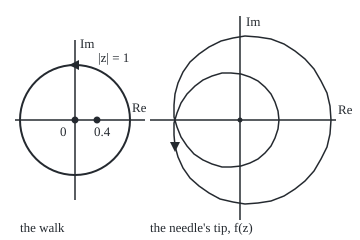
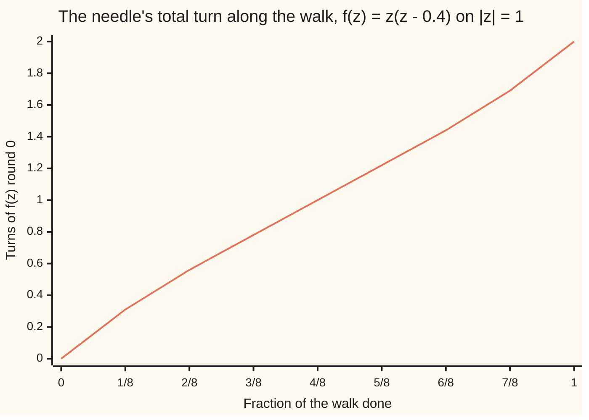

# The argument principle: walk the boundary and watch the output spin; the turns count zeros minus poles inside

[Syllabus](../../../SYLLABUS.md) → [Complex analysis](../../../SYLLABUS.md#w07) → [Real Integrals and Counting Zeros](../../../SYLLABUS.md#w07-s06) → The argument principle

---

## General Overview

Take f(z) = z(z − 0.4). It is zero at 0 and at 0.4, both inside the circle of radius 1 centred at 0. Walk that circle once anticlockwise. At each step, draw the value f(z) as an arrow from 0: a compass needle.

When the walk returns to its start, the needle has turned exactly twice round. Two turns, two zeros inside. On the circle of radius 0.2 only the zero at 0 is inside, and the needle turns once.

Poles push the other way. A **pole** is a point where the function blows up, like 1/(z − 2)^3 at 2; the power 3 is the pole's **order**. For g(z) = (z − 0.5)/(z − 2)^3 the needle turns once on the unit circle: one zero inside, no pole. On the circle of radius 3 the pole is inside too, counted three times, and the needle turns 1 − 3 = −2 times.

From here on the needle's net number of turns is the **winding number** of the output curve round 0 ([Deforming a loop](../03-Contour%20Integrals%20and%20Cauchy%27s%20Theorem/04-deforming-contours-and-winding-numbers.md)). The count never locates a zero.

**Walk a loop and follow the value of f: the number of times it winds round 0 equals the number of zeros inside minus the number of poles inside, each counted as often as its multiplicity or order.**

**What kind of fact this is:** a theorem, proved on this card in Why it works, with the full argument in a folded Detailed proof.

### The picture: the walk, and the needle's tip

<p align="center"></p>

To scale. Left: 55 units per 1, 0 at (75, 120), the zeros at (75, 120) and (97, 120). Right: 65 units per 1, 0 at (240, 120), f(z) at 72 even steps of the walk, every point printed by both checks. The tip starts at (279, 120) and circles 0 twice.

---

## The formula

Reminder: a loop integral adds f(z) times each small step dz round a closed path ([Contour integrals](../03-Contour%20Integrals%20and%20Cauchy%27s%20Theorem/01-contour-integrals.md)); arg w is the angle of the arrow w, measured anticlockwise from the positive real axis. The quotient f′/f, the derivative divided by the function, is the **logarithmic derivative**: the rate of change of ln f.

$$N - P = \frac{1}{2\pi i}\oint_C \frac{f'(z)}{f(z)}\,dz = \frac{\Delta_C \arg f}{2\pi} = n\big(f(C),\,0\big)$$

**Read it aloud:** zeros minus poles inside the loop equals the loop integral of f′ over f, divided by two pi i, which is the total turn of f's angle along the loop, in whole turns: the winding number of the output curve round 0.

| Symbol | Plain meaning | In our example | Push it up and the answer… |
| --- | --- | --- | --- |
| $f$, $z$ | the function, and the point walking the loop | z(z − 0.4); z on \|z\| = 1 | — |
| $C$ | the loop, walked once anticlockwise | \|z\| = 1 | may enclose more zeros or poles |
| $f'$ | the complex derivative of f | 2z − 0.4 | — |
| $N$ | zeros inside, each counted by its multiplicity | 2 | one more turn per zero |
| $P$ | poles inside, each counted by its order | 0; for g on \|z\| = 3, 3 | one turn fewer per pole |
| $a$, $m$, $p$ | a zero or pole; a zero's multiplicity; a pole's order | 0.4, m = 1; 2, p = 3 | — |
| $\Delta_C \arg f$ | total change in the angle of f round C, kept continuous | 4π, two full turns | — |
| $n(f(C), 0)$ | winding number of the output curve round 0 | 2 | — |

A zero of **multiplicity** m at a: f is (z − a)^m times a function nonzero at a ([Zeros and the identity theorem](../04-Taylor%20Series%2C%20Zeros%20and%20Rigidity/03-zeros-and-the-identity-theorem.md)).

### When it holds

- **f is holomorphic (has a complex derivative) inside and on C, except at poles.** Drop this and the count fails: z-bar, the conjugate, has one zero inside the unit circle, but its needle turns −1 times.
- **No zero or pole on C.** On |z| = 0.4 the walk hits the zero at 0.4, where the needle has no direction and f′/f is infinite.
- **f not identically zero.** Then its zeros are isolated, so a loop holds finitely many.

---

## Why it works

### Step 0: f′/f measures change in ln f, and round a loop only the angle changes

Write f in polar form, |f| times e^(i arg f). Then ln f = ln|f| + i arg f, and f′/f is its rate of change. Round a closed loop, |f| returns to its start, so ln|f| gains nothing. The angle can come back 2π, 4π or −2π higher. So the integral is i times the total change in angle, and dividing by 2πi gives whole turns.

### Step 1: each zero of multiplicity m contributes a residue m

Near a zero a of multiplicity m, f(z) = (z − a)^m h(z), with h nonzero at a. The product rule gives

f′/f = m/(z − a) + h′/h.

The second term has no pole at a, so the **residue** of f′/f at a, its coefficient of 1/(z − a) ([Residues](../05-Laurent%20Series%2C%20Singularities%20and%20Residues/04-residues.md)), is m. For z(z − 0.4), f′/f = (2z − 0.4)/(z(z − 0.4)) = 1/z + 1/(z − 0.4): residue 1 at each zero.

### Step 2: each pole of order p contributes a residue −p

Near a pole a of order p, f(z) = (z − a)^(−p) h(z), and the same product rule gives −p/(z − a) + h′/h. For g, g′/g = 1/(z − 0.5) − 3/(z − 2): residue 1 at the zero, −3 at the pole.

### Step 3: add the residues

f′/f is holomorphic everywhere else inside C, so by [The residue theorem](../05-Laurent%20Series%2C%20Singularities%20and%20Residues/05-the-residue-theorem.md) its loop integral is 2πi times the sum of the residues inside: 2πi(N − P). For g round |z| = 3 that is 2πi(1 − 3), and the needle turns −2 times.

The needle turns unevenly. For z(z − 0.4) on the unit circle, it has turned 0.31 of a turn after the first eighth of the walk, 1.00 halfway, and 2.00 at the end:



The line is the needle's accumulated turn. It climbs fastest at the start and end of the walk, near z = 1, the point closest to the zero at 0.4.

<details>
<summary>Detailed proof</summary>

Let f be holomorphic on an open set containing C and its inside, except at poles, with no zero or pole on C and f not identically zero. Its zeros are isolated ([Zeros and the identity theorem](../04-Taylor%20Series%2C%20Zeros%20and%20Rigidity/03-zeros-and-the-identity-theorem.md)) poles are isolated by definition, and the closed inside of C is closed and bounded, so it holds finitely many of each.

**Residues.** In Step 1, h is holomorphic and nonzero on a small disc round a, so h′/h is holomorphic there and the residue of f′/f at a is exactly m; likewise −p at a pole. Away from zeros and poles, f′/f is holomorphic. The residue theorem gives the loop integral of f′/f as 2πi(N − P).

**Turns, without a global logarithm.** Step 0 used ln f, which is only defined piece by piece. Instead, parametrise C by z(t), t from 0 to 1, and let w(t) = f(z(t)), a closed path avoiding 0. The chain rule gives w′/w = (f′(z)/f(z)) z′(t), so the loop integral of f′/f dz equals the loop integral of dw/w round f(C), which is 2πi times n(f(C), 0) by the definition of the winding number.

</details>

A second road avoids residues: Step 0 alone. Follow the angle of f continuously along the walk and read off its total change, as the checks' compass does.

---

## Worked numbers, by hand

| Step | Arithmetic | Value |
| --- | --- | --- |
| Zeros of z(z − 0.4) | z = 0 or z − 0.4 = 0 | 0 and 0.4 |
| Inside \|z\| = 1 | both closer than 1 to 0 | N = 2, P = 0 |
| Inside \|z\| = 0.2 | 0 only | **N − P = 1** |
| f′/f round \|z\| = 1 | 1/z + 1/(z − 0.4): residues 1 + 1 | **N − P = 2** |
| g = (z − 0.5)/(z − 2)^3 | zero 0.5, pole 2 of order 3 | — |
| Round \|z\| = 1 | 0.5 inside, 2 outside | **1 − 0 = 1** |
| Round \|z\| = 3 | both inside | **1 − 3 = −2** |

Two turns on |z| = 1: the quadratic z(z − 0.4) has both its zeros in the unit disc.

### What breaks if you drop a piece

| Mistake | Comes out at | What went wrong |
| --- | --- | --- |
| Compass read at only 3 or 4 points of the walk | −1 or 0 turns, not 2 | a step turned more than half a turn and was read the short way |
| Pole of order 3 counted once, \|z\| = 3 | 1 − 1 = 0, not −2 | order counts |
| z-bar round \|z\| = 1 | −1 turns, with one zero inside | z-bar is not holomorphic |

The code prints all three. At 5 points the compass reads 2.

---

## Code, from first principles, and it actually runs

Three roads; the first two share nothing but f. Road one: (1/2πi) times a trapezoid sum of f′/f dz at 256 points, the derivative written out by hand; its error for z(z − 0.4) on |z| = 1 falls from 6.6e-4 at 8 points to 4.3e-7 at 16 and 1.8e-13 at 32. Road two: the compass, with no derivative; it adds the small turn from each value of f to the next, read off atan2 (the angle of a point from its two coordinates). Road three: the located zeros and poles. The asserts pin all four cases, the shrinking error, the missed turns and the z-bar break.

### Python

```python
# The argument principle -- the check behind the card.  Walk a circle and count
# the turns of f(z) round 0 by two roads that share nothing but f.  Road one:
# (1/2 pi i) times a trapezoid sum of f'/f dz.  Road two: a compass needle,
# adding the small turn between neighbouring values of f, read off atan2.
import math

def f(z): return z * (z - 0.4), 2 * z - 0.4                      # value, derivative
def g(z): return (z - 0.5) / (z - 2) ** 3, ((z - 2) - 3 * (z - 0.5)) / (z - 2) ** 4

def walk(r, n):                          # n + 1 points round |z| = r, anticlockwise
    return [r * complex(math.cos(2 * math.pi * k / n), math.sin(2 * math.pi * k / n)) for k in range(n + 1)]

def integral(fn, r, n=256):              # road one: (1/2 pi i) x sum of f'/f dz
    total = 0
    for z in walk(r, n)[:-1]:
        v, d = fn(z)
        total += d / v * 1j * z * (2 * math.pi / n)
    return total / (2j * math.pi)

def compass(fn, r, n=256, marks=None):   # road two: add up the needle's small turns
    pts, turn, seen = walk(r, n), 0.0, [0.0]
    for k in range(n):
        q = fn(pts[k + 1])[0] / fn(pts[k])[0]
        turn += math.atan2(q.imag, q.real)
        if marks and (k + 1) % (n // marks) == 0: seen.append(turn / (2 * math.pi))
    return (turn / (2 * math.pi), seen) if marks else turn / (2 * math.pi)

def show(z):
    re, im = round(z.real, 6) + 0.0, round(z.imag, 6) + 0.0
    return f"{re:.6f} {'-' if im < 0 else '+'} {abs(im):.6f}i"

def sci(x): e = math.floor(math.log10(x)); return f"{x / 10 ** e:.1f}e{e}"

def count(zeros, poles, r):              # road three: located zeros and poles, with multiplicity
    return sum(m for a, m in zeros if abs(a) < r) - sum(m for a, m in poles if abs(a) < r)

cases = [("z(z - 0.4)", f, [(0, 1), (0.4, 1)], [], 1), ("z(z - 0.4)", f, [(0, 1), (0.4, 1)], [], 0.2),
         ("(z - 0.5)/(z - 2)^3", g, [(0.5, 1)], [(2, 3)], 1), ("(z - 0.5)/(z - 2)^3", g, [(0.5, 1)], [(2, 3)], 3)]
gaps = []
for name, fn, zs, ps, r in cases:
    truth, i1, c2 = count(zs, ps, r), integral(fn, r), compass(fn, r)
    gaps += [abs(i1 - truth), abs(c2 - truth)]
    print(f"{name} round |z| = {r}: N - P = {truth}; integral = {show(i1)}; compass = {c2:.6f}")
errs = [abs(integral(f, 1, n) - 2) for n in (8, 16, 32)]
print("z(z - 0.4), |z| = 1, integral error at 8, 16, 32 points: " + ", ".join(sci(e) for e in errs))
turns, marks = compass(f, 1, 256, 8)
print("needle turns at 0, 1/8, ..., 8/8 of the walk: " + ", ".join(f"{t:.2f}" for t in marks))
few = [compass(f, 1, n) for n in (3, 4, 5)]
print("compass sampled at only 3, 4, 5 points: " + ", ".join(str(int(math.floor(c + 0.5))) for c in few))
cz = compass(lambda z: (z.conjugate(), None), 1)     # z-bar: no derivative exists
print(f"break, z-bar round |z| = 1 (one zero inside, not holomorphic): compass = {cz:.6f}")
print(f"mistake, pole of order 3 counted once, |z| = 3: 1 - 1 = 0, not {count([(0.5, 1)], [(2, 3)], 3)}")
print("figure, left 55 units per 1, 0 at (75, 120), zeros at (75, 120) and (97, 120); right 65 units per 1, 0 at (240, 120)")
img = [f(z)[0] for z in walk(1, 72)]
print("figure, image points: " + " ".join(f"{math.floor(240 + 65 * w.real + 0.5)},{math.floor(120 - 65 * w.imag + 0.5)}" for w in img))
assert max(gaps) < 1e-9                                 # both roads land on N - P in all four cases
assert errs[2] < errs[1] < errs[0] and errs[2] < 1e-9   # the trapezoid error shrinks
assert abs(few[2] - integral(f, 1)) < 1e-9 and abs(few[0] - 2) > 2.5   # 5 points suffice, 3 miss turns
assert abs(cz + count([(0, 1)], [], 1)) < 1e-9          # z-bar turns the other way: -1, not +1
print("ALL CHECKS PASS")
```

**Ran 2026-09-28 on macOS, Python 3.14.6, standard library only. All checks passed. Output, pasted from the run:**

```
z(z - 0.4) round |z| = 1: N - P = 2; integral = 2.000000 + 0.000000i; compass = 2.000000
z(z - 0.4) round |z| = 0.2: N - P = 1; integral = 1.000000 + 0.000000i; compass = 1.000000
(z - 0.5)/(z - 2)^3 round |z| = 1: N - P = 1; integral = 1.000000 + 0.000000i; compass = 1.000000
(z - 0.5)/(z - 2)^3 round |z| = 3: N - P = -2; integral = -2.000000 + 0.000000i; compass = -2.000000
z(z - 0.4), |z| = 1, integral error at 8, 16, 32 points: 6.6e-4, 4.3e-7, 1.8e-13
needle turns at 0, 1/8, ..., 8/8 of the walk: 0.00, 0.31, 0.56, 0.78, 1.00, 1.22, 1.44, 1.69, 2.00
compass sampled at only 3, 4, 5 points: -1, 0, 2
break, z-bar round |z| = 1 (one zero inside, not holomorphic): compass = -1.000000
mistake, pole of order 3 counted once, |z| = 3: 1 - 1 = 0, not -2
figure, left 55 units per 1, 0 at (75, 120), zeros at (75, 120) and (97, 120); right 65 units per 1, 0 at (240, 120)
figure, image points: 279,120 278,111 275,102 271,94 265,87 258,81 250,77 241,74 231,73 222,73 212,76 203,80 195,86 187,94 181,103 177,113 174,123 174,135 175,146 178,157 183,168 190,178 199,186 209,193 220,199 233,202 245,204 258,203 271,201 284,196 295,189 305,181 314,171 321,159 327,147 330,134 331,120 330,106 327,93 321,81 314,69 305,59 295,51 284,44 271,39 258,37 245,36 233,38 221,41 209,47 199,54 190,62 183,72 178,83 175,94 174,105 174,117 177,127 181,137 187,146 194,154 203,160 212,164 222,167 231,167 241,166 250,163 258,159 265,153 271,146 275,138 278,129 279,120
ALL CHECKS PASS
```

### Rust

Same numbers, same labels, built with `rustc --edition 2021 -O`. Complex arithmetic is a small struct written out at the top.

```rust
// The argument principle -- the same check as the Python, in Rust.  No crates.
// Walk a circle and count the turns of f(z) round 0 by two roads that share
// nothing but f.  Road one: (1/2 pi i) times a trapezoid sum of f'/f dz.  Road
// two: a compass needle, adding the small turn between neighbouring values.
use std::f64::consts::PI;
use std::ops::{Add, Div, Mul, Sub};
#[derive(Clone, Copy)]
struct C { re: f64, im: f64 }
impl Add for C { type Output = C; fn add(self, o: C) -> C { C { re: self.re + o.re, im: self.im + o.im } } }
impl Sub for C { type Output = C; fn sub(self, o: C) -> C { C { re: self.re - o.re, im: self.im - o.im } } }
impl Mul for C { type Output = C; fn mul(self, o: C) -> C {
    C { re: self.re * o.re - self.im * o.im, im: self.re * o.im + self.im * o.re } } }
impl Div for C { type Output = C; fn div(self, o: C) -> C {
    let d = o.re * o.re + o.im * o.im;
    C { re: (self.re * o.re + self.im * o.im) / d, im: (self.im * o.re - self.re * o.im) / d } } }
fn c(re: f64, im: f64) -> C { C { re, im } }
fn abs(z: C) -> f64 { (z.re * z.re + z.im * z.im).sqrt() }
type F = fn(C) -> (C, C);                                  // value, derivative
fn f(z: C) -> (C, C) { (z * (z - c(0.4, 0.0)), c(2.0, 0.0) * z - c(0.4, 0.0)) }
fn g(z: C) -> (C, C) {
    let (a, b) = (z - c(0.5, 0.0), z - c(2.0, 0.0));
    (a / (b * b * b), (b - c(3.0, 0.0) * a) / (b * b * b * b))
}
fn zbar(z: C) -> (C, C) { (c(z.re, -z.im), c(f64::NAN, 0.0)) }  // no derivative exists

fn walk(r: f64, n: usize) -> Vec<C> {                      // n + 1 points round |z| = r
    (0..=n).map(|k| { let t = 2.0 * PI * k as f64 / n as f64; c(r * t.cos(), r * t.sin()) }).collect()
}
fn integral(h: F, r: f64, n: usize) -> C {                 // road one: (1/2 pi i) x sum of f'/f dz
    let mut total = c(0.0, 0.0);
    for &z in &walk(r, n)[..n] { let (v, d) = h(z); total = total + d / v * c(0.0, 1.0) * z * c(2.0 * PI / n as f64, 0.0); }
    total / c(0.0, 2.0 * PI)
}
fn compass(h: F, r: f64, n: usize, marks: usize) -> (f64, Vec<f64>) {  // road two: the needle's turns
    let (pts, mut turn, mut seen) = (walk(r, n), 0.0, vec![0.0]);
    for k in 0..n {
        let q = h(pts[k + 1]).0 / h(pts[k]).0;
        turn += q.im.atan2(q.re);
        if marks > 0 && (k + 1) % (n / marks) == 0 { seen.push(turn / (2.0 * PI)); }
    }
    (turn / (2.0 * PI), seen)
}
fn show(z: C) -> String {
    let (re, im) = ((z.re * 1e6).round() / 1e6 + 0.0, (z.im * 1e6).round() / 1e6 + 0.0);
    format!("{:.6} {} {:.6}i", re, if im < 0.0 { "-" } else { "+" }, im.abs())
}
fn sci(x: f64) -> String { let e = x.log10().floor(); format!("{:.1}e{}", x / 10f64.powf(e), e as i32) }
fn count(zeros: &[(f64, i32)], poles: &[(f64, i32)], r: f64) -> i32 {  // road three: located, with multiplicity
    zeros.iter().filter(|p| p.0.abs() < r).map(|p| p.1).sum::<i32>() - poles.iter().filter(|p| p.0.abs() < r).map(|p| p.1).sum::<i32>()
}

fn main() {
    let (fz, gz, gp): (&[(f64, i32)], &[(f64, i32)], &[(f64, i32)]) = (&[(0.0, 1), (0.4, 1)], &[(0.5, 1)], &[(2.0, 3)]);
    let cases: [(&str, F, &[(f64, i32)], &[(f64, i32)], f64); 4] = [("z(z - 0.4)", f, fz, &[], 1.0), ("z(z - 0.4)", f, fz, &[], 0.2),
        ("(z - 0.5)/(z - 2)^3", g, gz, gp, 1.0), ("(z - 0.5)/(z - 2)^3", g, gz, gp, 3.0)];
    let mut gap: f64 = 0.0;
    for (name, h, zs, ps, r) in cases {
        let (truth, i1, c2) = (count(zs, ps, r), integral(h, r, 256), compass(h, r, 256, 0).0);
        gap = gap.max(abs(i1 - c(truth as f64, 0.0))).max((c2 - truth as f64).abs());
        println!("{} round |z| = {}: N - P = {}; integral = {}; compass = {:.6}", name, r, truth, show(i1), c2);
    }
    let errs: Vec<f64> = [8, 16, 32].iter().map(|&n| abs(integral(f, 1.0, n) - c(2.0, 0.0))).collect();
    println!("z(z - 0.4), |z| = 1, integral error at 8, 16, 32 points: {}", errs.iter().map(|&e| sci(e)).collect::<Vec<_>>().join(", "));
    let marks = compass(f, 1.0, 256, 8).1;
    println!("needle turns at 0, 1/8, ..., 8/8 of the walk: {}", marks.iter().map(|t| format!("{:.2}", t)).collect::<Vec<_>>().join(", "));
    let few: Vec<f64> = [3, 4, 5].iter().map(|&n| compass(f, 1.0, n, 0).0).collect();
    println!("compass sampled at only 3, 4, 5 points: {}", few.iter().map(|x| format!("{}", (x + 0.5).floor() as i32)).collect::<Vec<_>>().join(", "));
    let cz = compass(zbar, 1.0, 256, 0).0;
    println!("break, z-bar round |z| = 1 (one zero inside, not holomorphic): compass = {:.6}", cz);
    println!("mistake, pole of order 3 counted once, |z| = 3: 1 - 1 = 0, not {}", count(gz, gp, 3.0));
    println!("figure, left 55 units per 1, 0 at (75, 120), zeros at (75, 120) and (97, 120); right 65 units per 1, 0 at (240, 120)");
    let img: Vec<String> = walk(1.0, 72).iter().map(|&z| { let w = f(z).0;
        format!("{},{}", (240.0 + 65.0 * w.re + 0.5).floor(), (120.0 - 65.0 * w.im + 0.5).floor()) }).collect();
    println!("figure, image points: {}", img.join(" "));
    assert!(gap < 1e-9);                                   // both roads land on N - P in all four cases
    assert!(errs[2] < errs[1] && errs[1] < errs[0] && errs[2] < 1e-9);  // the trapezoid error shrinks
    assert!((few[2] - integral(f, 1.0, 256).re).abs() < 1e-9 && (few[0] - 2.0).abs() > 2.5);  // 5 suffice, 3 miss
    assert!((cz + count(&[(0.0, 1)], &[], 1.0) as f64).abs() < 1e-9);  // z-bar turns the other way: -1
    println!("ALL CHECKS PASS");
}
```

**Ran 2026-09-28 on macOS, rustc 1.98.1, no crates. All checks passed. Output, pasted from the run:**

```
z(z - 0.4) round |z| = 1: N - P = 2; integral = 2.000000 + 0.000000i; compass = 2.000000
z(z - 0.4) round |z| = 0.2: N - P = 1; integral = 1.000000 + 0.000000i; compass = 1.000000
(z - 0.5)/(z - 2)^3 round |z| = 1: N - P = 1; integral = 1.000000 + 0.000000i; compass = 1.000000
(z - 0.5)/(z - 2)^3 round |z| = 3: N - P = -2; integral = -2.000000 + 0.000000i; compass = -2.000000
z(z - 0.4), |z| = 1, integral error at 8, 16, 32 points: 6.6e-4, 4.3e-7, 1.8e-13
needle turns at 0, 1/8, ..., 8/8 of the walk: 0.00, 0.31, 0.56, 0.78, 1.00, 1.22, 1.44, 1.69, 2.00
compass sampled at only 3, 4, 5 points: -1, 0, 2
break, z-bar round |z| = 1 (one zero inside, not holomorphic): compass = -1.000000
mistake, pole of order 3 counted once, |z| = 3: 1 - 1 = 0, not -2
figure, left 55 units per 1, 0 at (75, 120), zeros at (75, 120) and (97, 120); right 65 units per 1, 0 at (240, 120)
figure, image points: 279,120 278,111 275,102 271,94 265,87 258,81 250,77 241,74 231,73 222,73 212,76 203,80 195,86 187,94 181,103 177,113 174,123 174,135 175,146 178,157 183,168 190,178 199,186 209,193 220,199 233,202 245,204 258,203 271,201 284,196 295,189 305,181 314,171 321,159 327,147 330,134 331,120 330,106 327,93 321,81 314,69 305,59 295,51 284,44 271,39 258,37 245,36 233,38 221,41 209,47 199,54 190,62 183,72 178,83 175,94 174,105 174,117 177,127 181,137 187,146 194,154 203,160 212,164 222,167 231,167 241,166 250,163 258,159 265,153 271,146 275,138 278,129 279,120
ALL CHECKS PASS
```

The two outputs match line for line.

> [!TIP]
> **Try changing**
> Guess first, then run it.
> - **Widen the small circle.** Change the radius `0.2` to `0.5`. Now 0.4 is inside: all three roads say 2, and every assert passes.
> - **Fewer compass points.** Change `(3, 4, 5)` to `(3, 4, 4)`. The last reading is now 0, not 2, and the third assert stops the run.
> - **Claim a double zero.** In the first case, write the zero at 0.4 as `(0.4, 2)`. Road three says 3, both measuring roads say 2, and the first assert stops the run.

---

## The usual mistake

> [!warning]
> **Trusting a coarse picture of the image curve.** From 3 points the needle for z(z − 0.4) seems to turn −1 times; from 4, 0. A sampled step is read the short way round, so a step that really turns more than half a turn is miscounted. The count is a theorem; a sampled picture is a check, fine enough only when no step turns half a turn.
>
> - **Forgetting the poles, or their order.** For g on |z| = 3 the needle turns −2 times: 1 zero minus 3 for the pole. Counting the pole once gives 0.
> - **A zero on the path.** On |z| = 0.4 the walk hits the zero at 0.4 and the integral does not exist.
> - **Dropping holomorphy.** z-bar has one zero inside |z| = 1, but its needle turns −1 times.

---

## Where you meet it in real life

- **Counting a polynomial's roots in a region.** Walk the circle and count turns; no root is located. [Rouche's theorem](07-rouches-theorem.md) makes it easier still.
- **Stability of feedback control.** A feedback loop is stable when 1 + L(s) has no zeros in the right half-plane; L, the loop's transfer function, is a function of a complex variable s. The **Nyquist criterion** walks up the imaginary axis and round a large half circle, and counts how often the plot of L circles −1: [Nyquist and margins](../../13-Engineering%20mathematics/03-Feedback%20Control/06-nyquist-criterion-and-stability-margins.md).
- **Zeros of the zeta function.** Their count up to a given height is the argument principle round a rectangle: Counting the zeros.
- **Topology.** The winding number is the degree of a circle-to-circle map, generalised to spheres: Homology of spheres, and degree.

> **Say it back**
> Walk a loop and watch f as a needle from 0. Each zero inside adds turns, one per unit of multiplicity; each pole takes turns away, one per unit of order. The reason: f′/f has residue m at a zero of multiplicity m and −p at a pole of order p, and its loop integral is i times the needle's total turn. For z(z − 0.4) on the unit circle the needle turns twice; for (z − 0.5)/(z − 2)^3 once, and −2 times on the circle of radius 3.

---

## What this builds on

- [The residue theorem](../05-Laurent%20Series%2C%20Singularities%20and%20Residues/05-the-residue-theorem.md): the loop integral as 2πi times the residues inside.
- [Zeros and the identity theorem](../04-Taylor%20Series%2C%20Zeros%20and%20Rigidity/03-zeros-and-the-identity-theorem.md): zeros are isolated and each has a multiplicity.

## Where this goes next

- [Rouche's theorem](07-rouches-theorem.md): two functions close on the loop have the same count.
- [Zeta's zeros and the primes](../09-Special%20Functions%20and%20the%20Zeta%20Function/09-zeros-of-zeta-and-the-primes.md): where zeta's zeros sit, and why primes care.
- [Nyquist and margins](../../13-Engineering%20mathematics/03-Feedback%20Control/06-nyquist-criterion-and-stability-margins.md): the count as a stability test.
- Homology of spheres, and degree: winding number as degree.
- The prime number theorem: no zeta zeros on the line Re s = 1.
- Counting the zeros: the zero count up to height T.

---

## Sources

Verified 2026-09-28: every link below resolves to the publisher's or author's page.

- Stein, Elias M., and Rami Shakarchi. *Complex Analysis*. Princeton Lectures in Analysis II. Princeton University Press, 2003. [Publisher page](https://press.princeton.edu/books/hardcover/9780691113852/complex-analysis). Chapter 3: the argument principle and Rouché's theorem.
- Orloff, Jeremy. "Topic 11: Argument Principle." 18.04 Complex Variables with Applications, MIT OpenCourseWare, Spring 2018. [Course notes](https://ocw.mit.edu/courses/18-04-complex-variables-with-applications-spring-2018/resources/mit18_04s18_topic11/). Free; the theorem, the winding picture, and the Nyquist criterion.
- Åström, Karl J., and Richard M. Murray. *Feedback Systems: An Introduction for Scientists and Engineers*, 2nd ed. Princeton University Press. [Book site with full text](https://fbswiki.org/wiki/index.php/Feedback_Systems:_An_Introduction_for_Scientists_and_Engineers). The Nyquist criterion, as control engineers use it.
