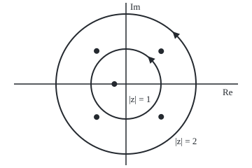

# Rouche's theorem: a dog on a short lead circles the post as often as its owner, so small changes never change the root count

[Syllabus](../../../SYLLABUS.md) → [Complex analysis](../README.md) → [Real Integrals and Counting Zeros](../README.md#s06) → Rouche's theorem

---

## General Overview

An owner walks once round a lamppost. Her dog runs about on a lead that is always shorter than her distance to the post. The dog can never reach the post, so it cannot slip round it on its own. It goes round exactly as often as she does.

Finding the five roots of z^5 + 3z + 1 = 0 takes a computer, yet the number inside the unit circle takes one line. On that circle 3z has size 3 and the rest, z^5 + 1, at most 2. So 3z is the owner, z^5 + 1 the lead, the polynomial the dog. The owner has one root inside, at 0, so the polynomial has exactly one. On the circle of radius 2 the roles swap: z^5 has size 32 and 3z + 1 at most 7, so all five roots lie within radius 2.

Likewise z^3 − 1/8: on the unit circle z^3 has size 1, more than 1/8, so z^3 − 1/8 has three roots inside, as z^3 does. Eugène Rouché published the theorem in 1862.

**If one function is strictly bigger than a second at every point of a loop, adding the second changes nothing about how many zeros lie inside: the sum has exactly as many as the bigger function.**

**What kind of fact this is:** a theorem, proved on this card in Why it works from the argument principle.

### The picture: five roots, two circles

<p align="center"></p>

To scale: 50 units per 1, with 0 at (180, 120); the root inside sits at (163.40, 120.00). Triangles mark the anticlockwise direction. The code finds the roots; the theorem never needs them.

---

## The formula

Reminders. Holomorphic means having a complex derivative at every point of a region. A closed path's winding number round 0 counts its net anticlockwise turns about 0 ([Deforming a loop](../03-Contour%20Integrals%20and%20Cauchy%27s%20Theorem/04-deforming-contours-and-winding-numbers.md)). The argument principle: a function holomorphic on and inside a loop, with no zero on it, has as many zeros inside as its image of the loop winds round 0 ([The argument principle](06-the-argument-principle.md)).

Let $f$ and $g$ be holomorphic on and inside a simple closed loop $C$, walked once anticlockwise. Write $N$ for the number of zeros inside $C$, each counted as often as its multiplicity (z^3 has one zero, at 0, counted three times). Then

$$|g(z)| < |f(z)| \ \text{ for every } z \text{ on } C \quad\Longrightarrow\quad N(f + g) = N(f).$$

**Read it aloud:** if the added function is smaller than the main one at every point of the loop, the sum has exactly as many zeros inside as the main one.

The metaphor hands over here: the owner is f(z), the dog f(z) + g(z), the lead g(z), the lamppost 0. The proof uses one helper, the dog divided by the owner:

$$h(z) = \frac{f(z) + g(z)}{f(z)} = 1 + \frac{g(z)}{f(z)}.$$

| Symbol | Plain meaning | In our example | Push it up and the answer… |
| --- | --- | --- | --- |
| $z$ | a point of the plane | a point on the circle | — |
| $f$ | the owner: the function whose zeros are known | 3z on radius 1; z^5 on radius 2 | more margin |
| $g$ | the lead: the added function | z^5 + 1; then 3z + 1 | once it reaches f, no conclusion |
| $C$ | the loop, walked once anticlockwise | the circles of radius 1 and 2 | — |
| $N$ | zeros inside the loop, with multiplicity | 1 inside radius 1; 5 inside radius 2 | — |
| $h$ | the ratio 1 + g/f | always within 1 of the point 1 | — |
| $p$, $a_k$ | a polynomial; its coefficients | z^5 + 3z + 1; a_1 = 3, a_0 = 1 | a larger circle needed |
| $R$, $n$ | a circle's radius; a polynomial's degree | R = 1, 2, 5; n = 5 | large R holds all n roots |

### When it holds

- **Holomorphic on and inside the loop, both functions.** A pole inside breaks it: f = 1 and g = 1/(4z) satisfy 1/4 < 1 on the unit circle, yet 1 + 1/(4z) has a zero at −0.25 while 1 has none.
- **Strict inequality at every point of the loop.** Equality lets a root sit on the loop: f = z^3 and g = −1 have equal sizes on the unit circle, and z^3 − 1 has its three roots on the circle and none inside.
- **Everywhere on the loop, not at samples.** The code's sampled gaps illustrate; the bounds 3 − 2 and 32 − 7 prove.

---

## Why it works

### Step 0: zero counts are turns, and a short lead cannot change turns

The argument principle turns zero counts into winding numbers. So it is enough to show the dog f + g winds round 0 as often as the owner f.

### Step 1: neither the owner nor the dog touches the post

On the loop |f| > |g| ≥ 0, so f is never 0 there. The reverse triangle inequality, |u + v| ≥ |u| − |v|, gives |f + g| ≥ |f| − |g| > 0, so neither is f + g, and both winding numbers make sense.

### Step 2: split the dog into owner times helper

Since f is not 0 on the loop, f + g = f · h there. Multiplying complex numbers adds their angles ([Polar form](../01-Complex%20Numbers%20and%20the%20Plane/03-polar-form-and-argument.md)), so round the loop the dog's turns are the owner's turns plus the helper's.

### Step 3: the helper never goes round 0

On the loop, |h − 1| = |g|/|f| < 1, so h stays in the disc of radius 1 about the point 1. That disc lies where the real part is positive, the right half-plane. A path there keeps its angle between −π/2 and π/2, so it closes with zero net turns. The dog's turns equal the owner's.

### Step 4: back to zeros

By the argument principle, the owner's turns are N(f) and the dog's are N(f + g). They are equal.

<details>
<summary>Detailed proof, in integrals</summary>

Let $f$ and $g$ be holomorphic on an open set containing $C$ and its inside, with |g| < |f| on $C$. Steps 1 and 2 give f + g = f · h on a neighbourhood of $C$, with $h$ holomorphic there, since f is not 0 near the loop. Differentiating the product and dividing by it:

$$\frac{(f+g)'}{f+g} = \frac{f'}{f} + \frac{h'}{h}.$$

On $C$, and by continuity on a thinner neighbourhood of it, $h$ takes values in the right half-plane. There the principal logarithm Log, built from ln|w| and the principal argument, is holomorphic with derivative 1/w, so Log h has derivative h'/h near $C$. A derivative integrates to 0 round a closed loop ([Antiderivatives](../03-Contour%20Integrals%20and%20Cauchy%27s%20Theorem/02-antiderivatives-and-path-independence.md)), so the h'/h term contributes 0. Dividing by 2πi, the argument principle's integral gives N(f + g) = N(f) + 0.

</details>

### Step 5: count the quintic's roots

For p(z) = z^5 + 3z + 1 on the unit circle, take f = 3z and g = z^5 + 1: the triangle inequality gives |g| ≤ 2 < 3 = |f|. The owner has one zero, at 0, so p has exactly one root in |z| < 1.

On radius 2, take f = z^5 and g = 3z + 1: |g| ≤ 7 < 32 = |f|. The owner has five zeros, all at 0, so all five roots lie in |z| < 2. None is on the unit circle, where |p| ≥ 3 − 2 = 1, so four lie between the circles.

### Step 6: the fundamental theorem of algebra, in two lines

Let $p$ be z^n + a_(n−1) z^(n−1) + … + a_0, with the coefficients $a_k$, and let A be the sum of their sizes |a_k|. On a circle of radius $R$ greater than both 1 and A, the lower terms have size at most A R^(n−1) < R^n = |z^n|. So $p$ has as many zeros inside as z^n: all $n$ of them.

For the quintic A = 4, so radius 5 suffices; Step 5 did better. [Liouville's theorem](../03-Contour%20Integrals%20and%20Cauchy%27s%20Theorem/07-liouville-and-the-fundamental-theorem-of-algebra.md) proves a root exists by another road; Rouché adds the count and a disc holding them.

A second proof deforms instead of dividing: f + t g, for t from 0 to 1, never vanishes on the loop, so its zero count varies continuously with t, and a whole number that varies continuously cannot move.

---

## Worked numbers, by hand

| Step | Arithmetic | Value |
| --- | --- | --- |
| z^3 − 1/8 on the unit circle | lead 1/8 against owner 1 | owner wins |
| its roots | owner z^3 has a triple zero at 0 | **3 inside** |
| check by de Moivre | each root has size (1/8)^(1/3) | 0.5 |
| quintic, radius 1 | lead at most 1 + 1 = 2, owner 3 | **1 root inside** |
| quintic, radius 2 | lead at most 3 × 2 + 1 = 7, owner 2^5 = 32 | **5 roots inside** |
| between the circles | 5 − 1 | **4** |
| none on the unit circle | there \|p\| ≥ 3 − 2 | at least 1 |

The code finds the real root −0.331989 and two mirror-image pairs of sizes 1.262893 and 1.374269.

### What breaks if you drop a piece

| Mistake | Comes out at | What went wrong |
| --- | --- | --- |
| Equality allowed: z^3 − 1 against z^3 | 0 roots inside, not 3 | All three roots have size 1.000000: on the loop |
| A pole in g: 1 + 1/(4z) | winds 0 times, yet 1 zero inside | The pole at 0 cancels the zero at −0.25 in the count |
| Owner z^5 on the unit circle | would claim 5 roots; truth 1 | \|3z + 1\| reaches 4 there, more than \|z^5\| = 1 |


---

## Code, from first principles, and it actually runs

Two roads. Road one walks each circle in 2000 steps and adds the dog's small turns, the angle of each step's ratio p(next)/p(this) from atan2: the winding number with no integral. Road two finds all five roots by the Durand–Kerner iteration (correct each guess by p over the product of its distances to the other guesses) and counts them by size; the cubics use de Moivre. Four asserts demand the roads agree, every root solves its equation, and both breaks show.

### Python

```python
# Rouche's theorem -- the check behind the card.  Standard library only.
# Road one: the dog's turns, the argument of f(z) followed step by step round a circle.
# Road two: the roots themselves, by Durand-Kerner or de Moivre, counted by size.
# The inequality |g| < |f| on the circle predicts both; the asserts demand they agree.
import math

def show(w):                                  # 'a + bi', six decimals, no -0.000000
    a, b = round(w.real, 6) + 0.0, round(w.imag, 6) + 0.0
    return f"{a:.6f} {'-' if b < 0 else '+'} {abs(b):.6f}i"
def loop(R, n=2000): return [R * complex(math.cos(2 * math.pi * k / n), math.sin(2 * math.pi * k / n)) for k in range(n + 1)]
def turns(h, R):                              # net turns of h(z) round 0 as z walks |z| = R once
    w = [h(z) for z in loop(R)]
    return sum(math.atan2((b / a).imag, (b / a).real) for a, b in zip(w, w[1:])) / (2 * math.pi)
def durand_kerner(h, n):                      # all n roots of a monic polynomial, found together
    zs = [complex(0.4, 0.9) ** k for k in range(n)]
    for _ in range(500):
        new = []
        for k, z in enumerate(zs):
            d = 1
            for j, w in enumerate(zs):
                if j != k: d *= z - w
            new.append(z - h(z) / d)
        zs = new
    return sorted(zs, key=lambda z: (round(z.real, 9), z.imag))
def cube_roots(c):                            # de Moivre: the three roots of z^3 = c, c > 0
    r = c ** (1 / 3)
    return [r * complex(math.cos(2 * math.pi * k / 3), math.sin(2 * math.pi * k / 3)) for k in range(3)]
def inside(zs, R): return sum(abs(z) < R - 1e-9 for z in zs)   # a root on the circle is not inside
def fx(x): return f"{round(x, 6) + 0.0:.6f}"

p = lambda z: z ** 5 + 3 * z + 1
c3 = cube_roots(1 / 8)
print(f"z^3 - 1/8 on |z| = 1: |f| = 1.000000, |g| = {1 / 8:.6f}; root sizes {', '.join(f'{abs(z):.6f}' for z in c3)}")
print(f"z^3 - 1/8: roots inside {inside(c3, 1)}; dog's turns {turns(lambda z: z ** 3 - 1 / 8, 1):.6f}; owner z^3 turns {turns(lambda z: z ** 3, 1):.6f}")
gap1 = min(abs(3 * z) - abs(z ** 5 + 1) for z in loop(1))
gap2 = min(abs(z ** 5) - abs(3 * z + 1) for z in loop(2))
print(f"quintic, |z| = 1: owner 3z, lead z^5 + 1 at most 2 < 3; least gap on the loop {gap1:.6f}")
print(f"quintic, |z| = 2: owner z^5, lead 3z + 1 at most 7 < 32; least gap on the loop {gap2:.6f}")
t1, t2 = turns(p, 1), turns(p, 2)
print(f"dog's turns: |z| = 1 {t1:.6f}, |z| = 2 {t2:.6f}; owner's turns {turns(lambda z: 3 * z, 1):.6f} and {turns(lambda z: z ** 5, 2):.6f}")
rs = durand_kerner(p, 5)
for k, z in enumerate(rs):
    print(f"root {k + 1}: {show(z)}, size {abs(z):.6f}")
n1, n2 = inside(rs, 1), inside(rs, 2)
print(f"roots in |z| < 1: {n1}; in |z| < 2: {n2}; between the circles: {n2 - n1}; least |p| on |z| = 1: {min(abs(p(z)) for z in loop(1)):.6f}")
print(f"two-line FTA: lower coefficients' sizes sum to 4, so at R = 5 the dog turns {turns(p, 5):.6f}")
e3 = cube_roots(1)
print(f"mistake, equality: z^3 - 1 has root sizes {', '.join(f'{abs(z):.6f}' for z in e3)}; inside {inside(e3, 1)}, not 3")
zero = durand_kerner(lambda z: z + 1 / 4, 1)                   # 1 + 1/(4z) = 0 exactly when z + 1/4 = 0
tp = turns(lambda z: 1 + 1 / (4 * z), 1)
print(f"mistake, a pole: 1 + 1/(4z) turns {fx(tp)}, yet its zero {show(zero[0])} is inside; 1 has none")
print(f"mistake, wrong owner on |z| = 1: |3z + 1| reaches {max(abs(3 * z + 1) for z in loop(1)):.6f} > 1 = |z^5|; true count {n1}, not 5")
print(f"silent test: z^5 + 3z + 3 has a lead reaching 4 > 3 on |z| = 1, yet {inside(durand_kerner(lambda z: z ** 5 + 3 * z + 3, 5), 1)} root inside, as before")
print("figure, 50 units per 1, 0 at (180, 120); roots at " + ", ".join(f"({180 + 50 * z.real:.2f}, {120 - 50 * z.imag:.2f})" for z in rs))
assert round(t1) == n1 == 1 and round(t2) == n2 == 5                  # dog's turns against counted roots
assert all(abs(p(z)) < 1e-12 for z in rs) and abs(t1 - n1) < 1e-9 and abs(t2 - n2) < 1e-9
assert inside(c3, 1) == round(turns(lambda z: z ** 3 - 1 / 8, 1)) == 3 and all(abs(z ** 3 - 1 / 8) < 1e-12 for z in c3)  # de Moivre against the dog
assert inside(e3, 1) == 0 and all(abs(z ** 3 - 1) < 1e-12 for z in e3) and inside(zero, 1) == 1 != round(tp)  # both breaks show
print("ALL CHECKS PASS")
```

**Ran 2026-09-28 on macOS, Python 3.14.6, standard library only. All checks passed. Output, pasted from the run:**

```
z^3 - 1/8 on |z| = 1: |f| = 1.000000, |g| = 0.125000; root sizes 0.500000, 0.500000, 0.500000
z^3 - 1/8: roots inside 3; dog's turns 3.000000; owner z^3 turns 3.000000
quintic, |z| = 1: owner 3z, lead z^5 + 1 at most 2 < 3; least gap on the loop 1.000000
quintic, |z| = 2: owner z^5, lead 3z + 1 at most 7 < 32; least gap on the loop 25.000000
dog's turns: |z| = 1 1.000000, |z| = 2 5.000000; owner's turns 1.000000 and 5.000000
root 1: -0.839072 - 0.943852i, size 1.262893
root 2: -0.839072 + 0.943852i, size 1.262893
root 3: -0.331989 + 0.000000i, size 0.331989
root 4: 1.005067 - 0.937259i, size 1.374269
root 5: 1.005067 + 0.937259i, size 1.374269
roots in |z| < 1: 1; in |z| < 2: 5; between the circles: 4; least |p| on |z| = 1: 1.453290
two-line FTA: lower coefficients' sizes sum to 4, so at R = 5 the dog turns 5.000000
mistake, equality: z^3 - 1 has root sizes 1.000000, 1.000000, 1.000000; inside 0, not 3
mistake, a pole: 1 + 1/(4z) turns 0.000000, yet its zero -0.250000 + 0.000000i is inside; 1 has none
mistake, wrong owner on |z| = 1: |3z + 1| reaches 4.000000 > 1 = |z^5|; true count 1, not 5
silent test: z^5 + 3z + 3 has a lead reaching 4 > 3 on |z| = 1, yet 1 root inside, as before
figure, 50 units per 1, 0 at (180, 120); roots at (138.05, 167.19), (138.05, 72.81), (163.40, 120.00), (230.25, 166.86), (230.25, 73.14)
ALL CHECKS PASS
```

### Rust

Same numbers, same labels, built with `rustc --edition 2021 -O`.

```rust
// Rouche's theorem -- the same check as the Python, in Rust.  No crates.
// Road one: the dog's turns, the argument of f(z) followed step by step round a circle.
// Road two: the roots themselves, by Durand-Kerner or de Moivre, counted by size.
// The inequality |g| < |f| on the circle predicts both; the asserts demand they agree.
use std::f64::consts::PI;
use std::ops::{Add, Div, Mul, Sub};
#[derive(Clone, Copy)]
struct C { re: f64, im: f64 }
fn c(re: f64, im: f64) -> C { C { re, im } }
impl Add for C { type Output = C; fn add(self, b: C) -> C { c(self.re + b.re, self.im + b.im) } }
impl Sub for C { type Output = C; fn sub(self, b: C) -> C { c(self.re - b.re, self.im - b.im) } }
impl Mul for C { type Output = C; fn mul(self, b: C) -> C { c(self.re * b.re - self.im * b.im, self.re * b.im + self.im * b.re) } }
impl Div for C { type Output = C; fn div(self, b: C) -> C { let d = b.re * b.re + b.im * b.im; c((self.re * b.re + self.im * b.im) / d, (self.im * b.re - self.re * b.im) / d) } }
fn abs(a: C) -> f64 { a.re.hypot(a.im) }
fn pw(z: C, n: u32) -> C { (0..n).fold(c(1.0, 0.0), |acc, _| acc * z) }
fn fx(x: f64) -> String { let s = format!("{:.6}", x); if s == "-0.000000" { "0.000000".into() } else { s } }
fn show(w: C) -> String { // 'a + bi', six decimals, no -0.000000
    let b = fx(w.im.abs());
    let sign = if w.im < 0.0 && b != "0.000000" { '-' } else { '+' };
    format!("{} {} {}i", fx(w.re), sign, b)
}
fn lp(r: f64) -> Vec<C> { (0..=2000).map(|k| { let t = 2.0 * PI * k as f64 / 2000.0; c(r * t.cos(), r * t.sin()) }).collect() }
fn turns(h: &dyn Fn(C) -> C, r: f64) -> f64 { // net turns of h(z) round 0 as z walks |z| = R once
    let w: Vec<C> = lp(r).into_iter().map(|z| h(z)).collect();
    w.windows(2).map(|p| { let q = p[1] / p[0]; q.im.atan2(q.re) }).sum::<f64>() / (2.0 * PI)
}
fn durand_kerner(h: &dyn Fn(C) -> C, n: usize) -> Vec<C> { // all n roots of a monic polynomial, found together
    let mut zs: Vec<C> = (0..n).map(|k| pw(c(0.4, 0.9), k as u32)).collect();
    for _ in 0..500 {
        let old = zs.clone();
        zs = (0..n).map(|k| {
            let d = (0..n).filter(|&j| j != k).fold(c(1.0, 0.0), |acc, j| acc * (old[k] - old[j]));
            old[k] - h(old[k]) / d
        }).collect();
    }
    let key = |z: &C| ((z.re * 1e9).round(), z.im);
    zs.sort_by(|a, b| key(a).partial_cmp(&key(b)).unwrap());
    zs
}
fn cube_roots(v: f64) -> Vec<C> { // de Moivre: the three roots of z^3 = v, v > 0
    let r = v.powf(1.0 / 3.0);
    (0..3).map(|k| { let t = 2.0 * PI * k as f64 / 3.0; c(r * t.cos(), r * t.sin()) }).collect()
}
fn inside(zs: &[C], r: f64) -> usize { zs.iter().filter(|&&z| abs(z) < r - 1e-9).count() } // a root on the circle is not inside
fn sizes(zs: &[C]) -> String { zs.iter().map(|&z| format!("{:.6}", abs(z))).collect::<Vec<_>>().join(", ") }
fn main() {
    let p = |z: C| pw(z, 5) + c(3.0, 0.0) * z + c(1.0, 0.0);
    let c3 = cube_roots(1.0 / 8.0);
    println!("z^3 - 1/8 on |z| = 1: |f| = 1.000000, |g| = {:.6}; root sizes {}", 1.0 / 8.0, sizes(&c3));
    println!("z^3 - 1/8: roots inside {}; dog's turns {:.6}; owner z^3 turns {:.6}", inside(&c3, 1.0),
        turns(&|z| pw(z, 3) - c(0.125, 0.0), 1.0), turns(&|z| pw(z, 3), 1.0));
    let gap1 = lp(1.0).iter().map(|&z| abs(c(3.0, 0.0) * z) - abs(pw(z, 5) + c(1.0, 0.0))).fold(f64::MAX, f64::min);
    let gap2 = lp(2.0).iter().map(|&z| abs(pw(z, 5)) - abs(c(3.0, 0.0) * z + c(1.0, 0.0))).fold(f64::MAX, f64::min);
    println!("quintic, |z| = 1: owner 3z, lead z^5 + 1 at most 2 < 3; least gap on the loop {:.6}", gap1);
    println!("quintic, |z| = 2: owner z^5, lead 3z + 1 at most 7 < 32; least gap on the loop {:.6}", gap2);
    let (t1, t2) = (turns(&p, 1.0), turns(&p, 2.0));
    println!("dog's turns: |z| = 1 {:.6}, |z| = 2 {:.6}; owner's turns {:.6} and {:.6}", t1, t2,
        turns(&|z| c(3.0, 0.0) * z, 1.0), turns(&|z| pw(z, 5), 2.0));
    let rs = durand_kerner(&p, 5);
    for (k, &z) in rs.iter().enumerate() { println!("root {}: {}, size {:.6}", k + 1, show(z), abs(z)) }
    let (n1, n2) = (inside(&rs, 1.0), inside(&rs, 2.0));
    let least = lp(1.0).iter().map(|&z| abs(p(z))).fold(f64::MAX, f64::min);
    println!("roots in |z| < 1: {}; in |z| < 2: {}; between the circles: {}; least |p| on |z| = 1: {:.6}", n1, n2, n2 - n1, least);
    println!("two-line FTA: lower coefficients' sizes sum to 4, so at R = 5 the dog turns {:.6}", turns(&p, 5.0));
    let e3 = cube_roots(1.0);
    println!("mistake, equality: z^3 - 1 has root sizes {}; inside {}, not 3", sizes(&e3), inside(&e3, 1.0));
    let zero = durand_kerner(&|z| z + c(0.25, 0.0), 1); // 1 + 1/(4z) = 0 exactly when z + 1/4 = 0
    let tp = turns(&|z| c(1.0, 0.0) + c(1.0, 0.0) / (c(4.0, 0.0) * z), 1.0);
    println!("mistake, a pole: 1 + 1/(4z) turns {}, yet its zero {} is inside; 1 has none", fx(tp), show(zero[0]));
    let reach = lp(1.0).iter().map(|&z| abs(c(3.0, 0.0) * z + c(1.0, 0.0))).fold(0.0, f64::max);
    println!("mistake, wrong owner on |z| = 1: |3z + 1| reaches {:.6} > 1 = |z^5|; true count {}, not 5", reach, n1);
    println!("silent test: z^5 + 3z + 3 has a lead reaching 4 > 3 on |z| = 1, yet {} root inside, as before", inside(&durand_kerner(&|z| pw(z, 5) + c(3.0, 0.0) * z + c(3.0, 0.0), 5), 1.0));
    let fig: Vec<String> = rs.iter().map(|z| format!("({:.2}, {:.2})", 180.0 + 50.0 * z.re, 120.0 - 50.0 * z.im)).collect();
    println!("figure, 50 units per 1, 0 at (180, 120); roots at {}", fig.join(", "));
    assert!(t1.round() as usize == n1 && n1 == 1 && t2.round() as usize == n2 && n2 == 5); // dog's turns against counted roots
    assert!(rs.iter().all(|&z| abs(p(z)) < 1e-12) && (t1 - n1 as f64).abs() < 1e-9 && (t2 - n2 as f64).abs() < 1e-9);
    assert!(inside(&c3, 1.0) == 3 && turns(&|z| pw(z, 3) - c(0.125, 0.0), 1.0).round() == 3.0 && c3.iter().all(|&z| abs(pw(z, 3) - c(0.125, 0.0)) < 1e-12)); // de Moivre against the dog
    assert!(inside(&e3, 1.0) == 0 && e3.iter().all(|&z| abs(pw(z, 3) - c(1.0, 0.0)) < 1e-12) && inside(&zero, 1.0) == 1 && tp.round() != 1.0); // both breaks show
    println!("ALL CHECKS PASS");
}
```

**Ran 2026-09-28 on macOS, rustc 1.98.1, no crates. All checks passed. Output, pasted from the run:**

```
z^3 - 1/8 on |z| = 1: |f| = 1.000000, |g| = 0.125000; root sizes 0.500000, 0.500000, 0.500000
z^3 - 1/8: roots inside 3; dog's turns 3.000000; owner z^3 turns 3.000000
quintic, |z| = 1: owner 3z, lead z^5 + 1 at most 2 < 3; least gap on the loop 1.000000
quintic, |z| = 2: owner z^5, lead 3z + 1 at most 7 < 32; least gap on the loop 25.000000
dog's turns: |z| = 1 1.000000, |z| = 2 5.000000; owner's turns 1.000000 and 5.000000
root 1: -0.839072 - 0.943852i, size 1.262893
root 2: -0.839072 + 0.943852i, size 1.262893
root 3: -0.331989 + 0.000000i, size 0.331989
root 4: 1.005067 - 0.937259i, size 1.374269
root 5: 1.005067 + 0.937259i, size 1.374269
roots in |z| < 1: 1; in |z| < 2: 5; between the circles: 4; least |p| on |z| = 1: 1.453290
two-line FTA: lower coefficients' sizes sum to 4, so at R = 5 the dog turns 5.000000
mistake, equality: z^3 - 1 has root sizes 1.000000, 1.000000, 1.000000; inside 0, not 3
mistake, a pole: 1 + 1/(4z) turns 0.000000, yet its zero -0.250000 + 0.000000i is inside; 1 has none
mistake, wrong owner on |z| = 1: |3z + 1| reaches 4.000000 > 1 = |z^5|; true count 1, not 5
silent test: z^5 + 3z + 3 has a lead reaching 4 > 3 on |z| = 1, yet 1 root inside, as before
figure, 50 units per 1, 0 at (180, 120); roots at (138.05, 167.19), (138.05, 72.81), (163.40, 120.00), (230.25, 166.86), (230.25, 73.14)
ALL CHECKS PASS
```

The two outputs match line for line.

> [!TIP]
> **Try changing**
> Guess first, then run it.
> - **A stronger owner.** Change `3 * z` in `p` to `5 * z`. Guess: counts 1 and 5 again, since both leads stay shorter. The asserts pass.
> - **A failed test.** Change the `+ 1` in `p` to `+ 3`. Rouché is silent, since the lead reaches 4 against 3. Guess the count: still 1; the asserts pass.
> - **Too few steps.** Change `n=2000` in `loop` to `n=8`. At radius 2 each step turns z^5 more than half a turn, atan2 reads it the short way, the turns print −3 and the first assert stops it.

---

## The usual mistake

> [!warning]
> **Reading a failed comparison as a changed count.** Rouché is one-way. When the lead is not shorter everywhere, the theorem is silent: z^5 + 3z + 3 fails the test against 3z on the unit circle, yet still has exactly one root inside. Try another split or another loop.
>
> - **Letting equality through.** z^3 − 1 against z^3 has |g| = |f| on the unit circle; its roots sit on the circle, 0 inside, not 3.
> - **Forgetting multiplicity.** z^3's zero at 0 counts three times; counted once, it predicts 1 root of z^3 − 1/8, not 3.
> - **A pole in the lead.** 1 + 1/(4z) winds 0 times yet has a zero at −0.25: winding counts zeros minus poles.

---

## Where you meet it in real life

- **Control systems.** A feedback loop is stable when its characteristic polynomial has no roots in the right half-plane; Rouché shows small gain changes keep that count, and the Nyquist criterion is the argument principle at work.
- **Numerical root finding.** Before the hunt, a comparison on a circle says how many roots to seek and where: all five of z^5 + 3z + 1 within radius 2.
- **Inverse transforms.** The poles of a Laplace transform decide whether a response dies away; [Inverting a Laplace transform](../08-Transforms%20in%20Outline/07-inverse-laplace-by-residues.md) reads each one as an exponential.

> **Say it back**
> A dog on a lead shorter than its owner's distance to a post goes round the post as often as she does. If |g| < |f| at every point of a loop, the ratio 1 + g/f stays in the right half-plane and never turns round 0. So f + g winds round 0 as often as f, and by the argument principle has as many zeros inside. So z^5 + 3z + 1 has one root inside the unit circle and all five inside radius 2.

---

## What this builds on

- [The argument principle](06-the-argument-principle.md): zeros inside a loop equal the image's winding number.

## Where this goes next

- [Inverting a Laplace transform](../08-Transforms%20in%20Outline/07-inverse-laplace-by-residues.md): where poles lie decides whether a system settles, the question root counts answer.
- [Zeta's zeros and the primes](../09-Special%20Functions%20and%20the%20Zeta%20Function/09-zeros-of-zeta-and-the-primes.md): counting zeros in a region, for a function with infinitely many.

---

## Sources

Verified 28 Sep 2026: every link below resolves to the publisher's page, and each page names the cited work.

- Stein, Elias M., and Rami Shakarchi. *Complex Analysis*. Princeton University Press, 2003. [Publisher page](https://press.princeton.edu/books/hardcover/9780691113852/complex-analysis). Chapter 3: the argument principle and Rouché.
- Lebl, Jiří. *Guide to Cultivating Complex Analysis*. [Author's page and free text](https://www.jirka.org/ca/). Section 5.4: Rouché's theorem.
- Orloff, Jeremy. "Topic 11: Argument Principle." MIT OpenCourseWare 18.04, Spring 2018. [Course notes](https://ocw.mit.edu/courses/18-04-complex-variables-with-applications-spring-2018/resources/mit18_04s18_topic11/). Rouché's theorem, the same quintic, and the Nyquist criterion.
