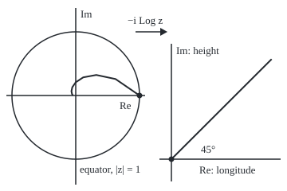
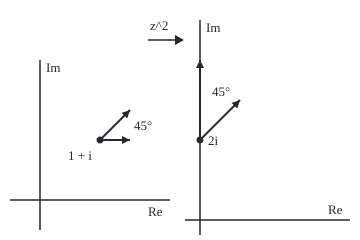

# Conformal maps: where f' is not zero a holomorphic function turns and stretches every tiny shape, so angles survive

[Syllabus](../../../SYLLABUS.md) → [Complex analysis](../README.md) → [Conformal Maps and Harmonic Functions](../README.md#s07) → Conformal maps

---

## General Overview

In 1569 Gerardus Mercator published a world chart for sailors. A ship holding a compass course of 45 degrees, north-east, crosses every meridian (a north-south line of longitude) at 45 degrees. On Mercator's chart that course is a straight line, drawn with a ruler. The price is Greenland: near latitude 72 degrees north the chart stretches lengths 3.236068 times, areas 10.472136 times.

The chart is two steps. **Stereographic projection** lays the globe flat: a line from the south pole through each northern point marks where it meets the equator's plane. The north pole lands at 0, the equator on the circle of radius 1, meridians on rays from 0, the course on a spiral into 0. Then the complex logarithm turns rays, circles and the spiral into straight lines.

Neither step keeps lengths; both keep angles. For the logarithm the reason is this card's theorem: near a point where its derivative is not zero, a holomorphic function (one with a complex derivative throughout a region) multiplies small arrows by one complex number, one turn and one stretch. Such an angle-keeping map is **conformal**. The smallest example: z^2 at 1 + i turns short arrows by 45 degrees and stretches them by 2.828427.

**Where f'(a) is not zero, a holomorphic f multiplies every small arrow at a by f'(a), so crossing angles survive, and near a it has a holomorphic inverse.**

**What kind of fact this is:** a theorem, proved on this card in Why it works; the word conformal is a definition.

### The picture: a 45-degree course, before and after the logarithm

<p align="center"></p>

To scale: left 80 units per 1, origin (95, 120); right 40 units per 1, origin (215, 200). The spiral is e^((−1 + i)t) for t from 0 to π, starting at the dot; the line is (1 + i)t for the same t.

---

## The formula

Reminders: |z| is distance from 0, arg z the angle, in (−π, π] ([Polar form](../01-Complex%20Numbers%20and%20the%20Plane/03-polar-form-and-argument.md)); f'(a) is the limit of (f(a + h) − f(a))/h as the complex step h shrinks to 0 from any direction.

$$f(a + h) = f(a) + f'(a)\,h + \varepsilon(h)\,h, \qquad \varepsilon(h) \to 0 \text{ as } h \to 0$$

**Read it aloud:** near a, a step h goes to f'(a) times h, plus a vanishing share of h. In polar form:

$$f'(a) = \rho\, e^{i\theta}, \qquad \rho = |f'(a)|, \qquad \theta = \arg f'(a)$$

**Read it aloud:** small arrows from a stretch by ρ and turn by θ. The local inverse g undoes f near a, at points w near f(a):

$$g'(w) = \frac{1}{f'(g(w))}$$

A globe point at latitude φ, longitude λ projects to z = r e^(iλ), r = tan(π/4 − φ/2). Mercator's chart is

$$w = -i\,\mathrm{Log}\, z = \lambda + i\,\ln \tan\!\left(\frac{\pi}{4} + \frac{\varphi}{2}\right), \qquad \text{stretch} = \frac{1}{\cos\varphi}$$

**Read it aloud:** across is longitude, up is ln tan(π/4 + φ/2), and lengths near latitude φ stretch by 1/cos φ.

| Symbol | Plain meaning | In our example | Push it up and the answer… |
| --- | --- | --- | --- |
| $f$, $a$, $h$ | the map, the point, a small complex step | z^2, 1 + i, h = 0.001 | chords drift further |
| $f'(a)$ | the complex derivative at a | 2 + 2i | — |
| $\rho$ | the local stretch, \|f'(a)\| | 2.828427 | small shapes grow more |
| $\theta$ | the local turn, arg f'(a), in radians | π/4, which is 45 degrees | small shapes turn further |
| $\varepsilon$ | the error share, ε(h) → 0 | for z^2 it is exactly h | — |
| $g$, $w$ | the local inverse, and a point it acts on | g(2i) = 1 + i, g'(2i) = 0.25 − 0.25i | — |
| $z$, $r$ | the stereographic point and its distance from 0 | r = 0.158384 at 72 degrees | nearer the equator |
| $\varphi$, $\lambda$ | latitude and longitude, in radians | 72 and −40 degrees | higher: 1/cos φ grows without bound |

### When it holds

- **f holomorphic near a.** Otherwise there is no single multiplier: the mirror map z-bar sends a 45-degree angle to −45.
- **f'(a) not zero.** Otherwise the next term takes over: z^2 at 0 sends rays 45 degrees apart to 90 degrees apart.
- **Small shapes only.** Chords (straight segments) from 1 + i to 1.1 + i and to 1.1 + 1.1i, 45 degrees apart, come out 46.397181 apart.
- **Local, not global.** z^2 sends both 1 + i and −1 − i to 2i. A holomorphic function one-to-one on a whole region is **univalent**; a nonzero derivative does not make it so.

---

## Why it works

### Step 0: multiplying by a complex number is turn and stretch

Multiply r e^(iα) by ρ e^(iθ): lengths multiply and angles add, giving ρr e^(i(α + θ)) ([Euler's formula](../01-Complex%20Numbers%20and%20the%20Plane/04-eulers-formula.md)). Arrows at 0 and 45 degrees, times 2 + 2i, land at 45 and 90: still 45 apart.

### Step 1: the derivative makes f look like multiplication

The gap ε(h) between (f(a + h) − f(a))/h and f'(a) shrinks to 0 by the derivative's definition: that is the formula above. For z^2 it is exact: (a + h)^2 − a^2 = 2ah + h^2, so f'(a) = 2a and ε(h) = h. Quotients measured at 1 + i with tiny steps east, north and north-east all read 2 + 2i.

### Step 2: tangent arrows turn together

Two curves leave a with velocities v and u (their tangent arrows). By the chain rule their images leave f(a) with velocities f'(a)v and f'(a)u. The angle between image arrows is the argument of their quotient:

$$\frac{f'(a)\,u}{f'(a)\,v} = \frac{u}{v}$$

The nonzero multiplier cancels: the angle is unchanged.

### The picture: two arrows at 1 + i and their images at 2i

<p align="center"></p>

To scale: left 60 units per 1, origin (40, 200); right 40 units per 1, origin (200, 220). Right arrows are f'(1 + i) times left ones.

Chords with steps s = 0.1, 0.01 and 0.001, east and s(1 + i), come out 46.397181, 45.142882 and 45.014320 degrees apart: the drift shrinks with the step, as ε(h) = h says.

<details>
<summary>Detailed proof</summary>

Let γ pass through a at time 0 with velocity v ≠ 0. Put k = γ(t) − a, set ε(0) = 0, and divide f(a + k) − f(a) = f'(a)k + ε(k)k by t:

(f(γ(t)) − f(a))/t = f'(a)·(γ(t) − a)/t + ε(γ(t) − a)·(γ(t) − a)/t.

As t → 0, (γ(t) − a)/t → v and γ(t) − a → 0. For every η > 0 there is a δ0 > 0 with |ε(k)| < η whenever |k| < δ0, so the last term tends to 0. The image curve's velocity is f'(a)v, nonzero because f'(a) is not zero. For a second curve with velocity u, the angle between image velocities is arg((f'(a)u)/(f'(a)v)) = arg(u/v), up to a whole turn.

</details>

### Step 3: where f' is zero, angles multiply

At 0 the derivative of z^2 is 0, and nothing cancels. With z = s e^(iα), z^2 = s^2 e^(2iα): the angle doubles, so rays at 0 and 45 degrees land at 0 and 90. If f(a + h) − f(a) begins with c h^m, c not zero, angles at a multiply by m and each point near f(a), other than f(a), has m preimages near a, counted by [The argument principle](../06-Real%20Integrals%20and%20Counting%20Zeros/06-the-argument-principle.md).

### Step 4: a nonzero derivative gives a holomorphic local inverse

As a map of the plane, (x, y) to (u, v), with f'(a) = A + iB, its matrix of partial derivatives is A + iB in real form ([Chain rule in several variables](../../06-Calculus%20and%20analysis/07-Several%20Variables/04-multivariable-chain-rule-and-jacobians.md)):

$$\begin{pmatrix} A & -B \\ B & A \end{pmatrix}, \qquad \det = A^2 + B^2 = |f'(a)|^2 > 0$$

f' is continuous: holomorphic functions have derivatives of every order ([Derivatives from the boundary](../03-Contour%20Integrals%20and%20Cauchy%27s%20Theorem/06-derivatives-from-the-boundary.md)). So the nonzero determinant lets the inverse function theorem for maps of the plane ([Inverse and implicit function theorems](../../06-Calculus%20and%20analysis/07-Several%20Variables/07-inverse-and-implicit-function-theorems.md)) supply small discs around a and f(a) with a smooth inverse g between them. Its matrix is the inverse matrix, multiplication by 1/f'(a) in real form, so g'(w) = 1/f'(g(w)). For z^2 near 1 + i, g(2i) = 1 + i and g'(2i) = 1/(2 + 2i) = 0.25 − 0.25i: a turn back by 45 degrees and a shrink by 2.828427. Newton's method in the code agrees. Only locally: −1 − i also squares to 2i.

### Step 5: Mercator's chart is the logarithm of the flat globe

Stereographic projection keeps angles too; Snyder (below) derives it. It puts 72 degrees north at r = 0.158384.

Then −i Log z: the principal logarithm ln|z| + i arg z ([The complex logarithm](../02-Holomorphic%20Functions/04-complex-logarithm.md)), then a quarter turn clockwise. Its derivative −i/z is never zero, so by Step 2 it keeps angles off the negative real axis, where Log jumps. It gives −i(ln r + iλ) = λ − i ln r, and −ln tan(π/4 − φ/2) = ln tan(π/4 + φ/2) since the tangents are reciprocals: Mercator's formula, 1.842730 at 72 degrees by both roads.

The stretches multiply: (1 + r^2)/2 for the projection, 1/r for the logarithm. With r = tan β and 2β = π/2 − φ, (1 + r^2)/(2r) = 1/sin 2β = 1/cos φ: 3.236068 at 72 degrees, 1 at the equator.

Meridians become vertical lines, and angles survive, so a 45-degree course crosses every vertical line at 45 degrees: a straight line. The spiral e^((−1 + i)t) becomes (1 + i)t.

[The standard maps](03-standard-maps-and-composing-them.md) chains such maps into larger ones; which regions a univalent map can carry onto a disc is [The Riemann mapping theorem](08-riemann-mapping-theorem-and-schwarz-christoffel.md).

---

## Worked numbers, by hand

| Step | Arithmetic | Value |
| --- | --- | --- |
| Derivative of z^2 at 1 + i | 2 × (1 + i) | 2 + 2i |
| Local stretch | square root of 2^2 + 2^2, which is the square root of 8 | **2.828427** |
| Local turn | angle of 2 + 2i | **45 degrees** |
| Flat globe at 72° N | tan(45° − 36°) = tan 9° | r = 0.158384 |
| Mercator height | −ln 0.158384 | 1.842730 |
| Chart stretch at 72° N | 1/cos 72° | **3.236068** |
| Area stretch | 3.236068^2 | **10.472136** |

Greenland is drawn about ten times too big, yet its bearings are true.

### What breaks if you drop a piece

| Mistake | Comes out at | What went wrong |
| --- | --- | --- |
| z^2 at 0, where f' = 0 | rays at 0 and 45 degrees land at 0 and 90 | the h^2 term doubles angles |
| z-bar, no complex derivative | 45 degrees lands at −45 | direction reversed |
| The local inverse taken as global | (1 + i)^2 = (−1 − i)^2 = 2i | two points, one image |

The code prints all three.

---

## Code, from first principles, and it actually runs

Two roads to each claim. For z^2: the formula 2z against measured quotients, chords and Newton's local inverse. For the chart: Mercator's formula against the globe pushed through stereographic projection and a hand-built logarithm, with stretch and bearing measured by tiny ground steps.

### Python

```python
# Conformal maps -- the check behind the card.  Standard library only; the
# complex log is built here from ln|z| and atan2.  Two roads each time: the
# derivative formula against measured chords, and the chart-makers' Mercator
# formula against the globe pushed through stereographic projection and the log.
from math import atan2, log, sqrt, sin, cos, tan, pi, radians, degrees, exp

def c(z): return f"{z.real:.6f} {'-' if z.imag < 0 else '+'} {abs(z.imag):.6f}i"
def turn(u, v): return degrees(atan2((u.conjugate() * v).imag, (u.conjugate() * v).real))
def clog(z): return complex(log(abs(z)), atan2(z.imag, z.real))
def f(z): return z * z
def root(w, z=1.0):                          # local inverse of z^2: Newton's method from 1
    for _ in range(60): z = z - (z * z - w) / (2 * z)
    return z
def globe(p, l): return (cos(p) * cos(l), cos(p) * sin(l), sin(p))
def stereo(P): return complex(P[0], P[1]) / (1 + P[2])   # from the south pole onto the equator's plane
def merc(p, l): return -1j * clog(stereo(globe(p, l)))    # road 2: the log of the stereographic globe

a = 1 + 1j
fa = 2 * a                                                # road 1: f'(z) = 2z
q = [(f(a + h) - f(a)) / h for h in (1e-7, 1e-7j, 1e-7 * (1 + 1j))]
print(f"f'(1 + i) = {c(fa)}; scale |f'| = {abs(fa):.6f}; turn arg f' = {turn(1, fa):.6f} degrees")
print("measured (f(a+h) - f(a))/h, h east, north, north-east: " + "; ".join(c(x) for x in q))
chords = [turn(f(a + s) - f(a), f(a + s * (1 + 1j)) - f(a)) for s in (0.1, 0.01, 0.001)]
print("image chords of directions 1 and 1 + i, steps 0.1, 0.01, 0.001: " + ", ".join(f"{x:.6f}" for x in chords))
rays = [turn(1, f(0.1 * complex(cos(t), sin(t)))) for t in (0, pi / 4)]
print(f"at 0, where f' = 0: rays at 0 and 45 degrees land at {rays[0]:.6f} and {rays[1]:.6f} degrees")
print(f"z-bar: directions at 0 and 45 degrees land at 0 and {turn(1, (1 + 1j).conjugate()):.6f} degrees")
g, h = root(2j), 1e-7 * (1 + 2j)
dg = (root(2j + h) - g) / h
print(f"local inverse: g(2i) = {c(g)}; 1/f'(g(2i)) = {c(1 / (2 * g))}; measured slope = {c(dg)}")
print(f"not one-to-one: (1 + i)^2 = {c(f(1 + 1j))} and (-1 - i)^2 = {c(f(-1 - 1j))}")
phi, lam, d = radians(72), radians(-40), 1e-6
z = stereo(globe(phi, lam))
r, w, y_formula = abs(z), merc(phi, lam), log(tan(pi / 4 + phi / 2))   # road 1: Mercator's formula
print(f"latitude 72, longitude -40: stereographic radius r = {r:.6f}; log z = {c(clog(z))}")
print(f"Mercator by formula: x = {lam:.6f}, y = {y_formula:.6f}; by -i log z: {c(w)}")
east = abs(merc(phi, lam + d / cos(phi)) - w) / d         # a ground step d due east, measured on the map
chain = (1 + r * r) / 2 / r                                # stereographic stretch times |(log z)'| = 1/r
print(f"stretch at 72 degrees: 1/cos = {1 / cos(phi):.6f}; chain (1+r^2)/(2r) = {chain:.6f}; "
      f"measured = {east:.6f}; area x {1 / cos(phi) ** 2:.6f}")
ne = merc(phi + d / sqrt(8), lam + d / sqrt(8) / cos(phi)) - merc(phi - d / sqrt(8), lam - d / sqrt(8) / cos(phi))
equator = abs(merc(0, lam + d) - merc(0, lam)) / d
print(f"a 45-degree bearing on the globe draws at {turn(ne, 1j):.6f} degrees; stretch at the equator {equator:.6f}")
arrows = [(40 + 60 * p.real, 200 - 60 * p.imag) for p in (a, a + 0.5, a + 0.5 * (1 + 1j))]
arrows += [(200 + 40 * p.real, 220 - 40 * p.imag) for p in (f(a), f(a) + fa * 0.5, f(a) + fa * 0.5 * (1 + 1j))]
print("figure, tangent arrows svg: " + " ".join(f"{x:.1f},{y:.1f}" for x, y in arrows))
spiral = [(95 + 80 * exp(-t) * cos(t), 120 - 80 * exp(-t) * sin(t)) for t in [k * pi / 8 for k in range(9)]]
print("figure, spiral e^((-1+i)t) svg: " + " ".join(f"{x:.1f},{y:.1f}" for x, y in spiral))
print(f"figure, Mercator line (1+i)t svg: 215.0,200.0 to {215 + 40 * pi:.1f},{200 - 40 * pi:.1f}")
assert all(abs(x - fa) < 1e-6 for x in q) and abs(chords[2] - 45) < 0.02 < abs(chords[0] - 45)
assert abs(dg - 1 / (2 * g)) < 1e-6 and abs(g - (1 + 1j)) < 1e-12 and abs(rays[1] - 90) < 1e-9
assert abs(w.imag - y_formula) < 1e-12 and abs(w.real - lam) < 1e-12 and abs(chain - 1 / cos(phi)) < 1e-12
assert abs(east - 1 / cos(phi)) < 1e-5 and abs(turn(ne, 1j) - 45) < 1e-6 and abs(equator - 1) < 1e-5
print("ALL CHECKS PASS")
```

**Ran 2026-09-28 on macOS, Python 3.14.6, standard library only. All checks passed. Output, pasted from the run:**

```
f'(1 + i) = 2.000000 + 2.000000i; scale |f'| = 2.828427; turn arg f' = 45.000000 degrees
measured (f(a+h) - f(a))/h, h east, north, north-east: 2.000000 + 2.000000i; 2.000000 + 2.000000i; 2.000000 + 2.000000i
image chords of directions 1 and 1 + i, steps 0.1, 0.01, 0.001: 46.397181, 45.142882, 45.014320
at 0, where f' = 0: rays at 0 and 45 degrees land at 0.000000 and 90.000000 degrees
z-bar: directions at 0 and 45 degrees land at 0 and -45.000000 degrees
local inverse: g(2i) = 1.000000 + 1.000000i; 1/f'(g(2i)) = 0.250000 - 0.250000i; measured slope = 0.250000 - 0.250000i
not one-to-one: (1 + i)^2 = 0.000000 + 2.000000i and (-1 - i)^2 = 0.000000 + 2.000000i
latitude 72, longitude -40: stereographic radius r = 0.158384; log z = -1.842730 - 0.698132i
Mercator by formula: x = -0.698132, y = 1.842730; by -i log z: -0.698132 + 1.842730i
stretch at 72 degrees: 1/cos = 3.236068; chain (1+r^2)/(2r) = 3.236068; measured = 3.236068; area x 10.472136
a 45-degree bearing on the globe draws at 45.000000 degrees; stretch at the equator 1.000000
figure, tangent arrows svg: 100.0,140.0 130.0,140.0 130.0,110.0 200.0,140.0 240.0,100.0 200.0,60.0
figure, spiral e^((-1+i)t) svg: 175.0,120.0 144.9,99.3 120.8,94.2 104.4,97.2 95.0,103.4 90.7,109.6 89.6,114.6 90.3,118.0 91.5,120.0
figure, Mercator line (1+i)t svg: 215.0,200.0 to 340.7,74.3
ALL CHECKS PASS
```

### Rust

```rust
// Conformal maps -- the same check as the Python, in Rust.  No crates; a small
// (re, im) struct carries the complex arithmetic and the log is built from
// ln|z| and atan2.  Two roads each time: the derivative formula against
// measured chords, and Mercator's formula against the log of the stereographic globe.
use std::f64::consts::PI;
use std::ops::{Add, Div, Mul, Sub};
#[derive(Clone, Copy)]
struct C { re: f64, im: f64 }
fn cx(re: f64, im: f64) -> C { C { re, im } }
impl Add for C { type Output = C; fn add(self, o: C) -> C { cx(self.re + o.re, self.im + o.im) } }
impl Sub for C { type Output = C; fn sub(self, o: C) -> C { cx(self.re - o.re, self.im - o.im) } }
impl Mul for C { type Output = C; fn mul(self, o: C) -> C { cx(self.re * o.re - self.im * o.im, self.re * o.im + self.im * o.re) } }
impl Div for C { type Output = C; fn div(self, o: C) -> C { let n = o.re * o.re + o.im * o.im; cx((self.re * o.re + self.im * o.im) / n, (self.im * o.re - self.re * o.im) / n) } }
impl C { fn abs(self) -> f64 { self.re.hypot(self.im) } fn bar(self) -> C { cx(self.re, -self.im) } fn s(self, k: f64) -> C { cx(self.re * k, self.im * k) } }
fn c(z: C) -> String { format!("{:.6} {} {:.6}i", z.re, if z.im < 0.0 { "-" } else { "+" }, z.im.abs()) }
fn turn(u: C, v: C) -> f64 { let p = u.bar() * v; p.im.atan2(p.re).to_degrees() }
fn clog(z: C) -> C { cx(z.abs().ln(), z.im.atan2(z.re)) }
fn f(z: C) -> C { z * z }
fn root(w: C) -> C { let mut z = cx(1.0, 0.0); for _ in 0..60 { z = z - (z * z - w) / z.s(2.0) } z }  // Newton from 1
fn stereo(p: f64, l: f64) -> C { cx(p.cos() * l.cos(), p.cos() * l.sin()).s(1.0 / (1.0 + p.sin())) }  // from the south pole
fn merc(p: f64, l: f64) -> C { cx(0.0, -1.0) * clog(stereo(p, l)) }  // road 2: the log of the stereographic globe
fn main() {
    let (one, i) = (cx(1.0, 0.0), cx(0.0, 1.0));
    let a = cx(1.0, 1.0);
    let fa = a.s(2.0);                                   // road 1: f'(z) = 2z
    let q: Vec<C> = [one, i, a].iter().map(|&u| { let h = u.s(1e-7); (f(a + h) - f(a)) / h }).collect();
    println!("f'(1 + i) = {}; scale |f'| = {:.6}; turn arg f' = {:.6} degrees", c(fa), fa.abs(), turn(one, fa));
    println!("measured (f(a+h) - f(a))/h, h east, north, north-east: {}", q.iter().map(|&x| c(x)).collect::<Vec<_>>().join("; "));
    let chords: Vec<f64> = [0.1, 0.01, 0.001].iter().map(|&s| turn(f(a + one.s(s)) - f(a), f(a + a.s(s)) - f(a))).collect();
    println!("image chords of directions 1 and 1 + i, steps 0.1, 0.01, 0.001: {}", chords.iter().map(|x| format!("{:.6}", x)).collect::<Vec<_>>().join(", "));
    let rays: Vec<f64> = [0.0, PI / 4.0].iter().map(|&t| turn(one, f(cx(t.cos(), t.sin()).s(0.1)))).collect();
    println!("at 0, where f' = 0: rays at 0 and 45 degrees land at {:.6} and {:.6} degrees", rays[0], rays[1]);
    println!("z-bar: directions at 0 and 45 degrees land at 0 and {:.6} degrees", turn(one, a.bar()));
    let (g, h) = (root(i.s(2.0)), cx(1.0, 2.0).s(1e-7));
    let dg = (root(i.s(2.0) + h) - g) / h;
    println!("local inverse: g(2i) = {}; 1/f'(g(2i)) = {}; measured slope = {}", c(g), c(one / g.s(2.0)), c(dg));
    println!("not one-to-one: (1 + i)^2 = {} and (-1 - i)^2 = {}", c(f(a)), c(f(a.s(-1.0))));
    let (phi, lam, d) = (72f64.to_radians(), (-40f64).to_radians(), 1e-6);
    let z = stereo(phi, lam);
    let (r, w, y_formula) = (z.abs(), merc(phi, lam), (PI / 4.0 + phi / 2.0).tan().ln());  // road 1: Mercator's formula
    println!("latitude 72, longitude -40: stereographic radius r = {:.6}; log z = {}", r, c(clog(z)));
    println!("Mercator by formula: x = {:.6}, y = {:.6}; by -i log z: {}", lam, y_formula, c(w));
    let east = (merc(phi, lam + d / phi.cos()) - w).abs() / d;   // a ground step d due east, measured on the map
    let chain = (1.0 + r * r) / 2.0 / r;                          // stereographic stretch times |(log z)'| = 1/r
    println!("stretch at 72 degrees: 1/cos = {:.6}; chain (1+r^2)/(2r) = {:.6}; measured = {:.6}; area x {:.6}",
             1.0 / phi.cos(), chain, east, 1.0 / phi.cos().powi(2));
    let e = d / 8f64.sqrt();
    let ne = merc(phi + e, lam + e / phi.cos()) - merc(phi - e, lam - e / phi.cos());
    let equator = (merc(0.0, lam + d) - merc(0.0, lam)).abs() / d;
    println!("a 45-degree bearing on the globe draws at {:.6} degrees; stretch at the equator {:.6}", turn(ne, i), equator);
    let mut arrows: Vec<(f64, f64)> = [a, a + one.s(0.5), a + a.s(0.5)].iter().map(|p| (40.0 + 60.0 * p.re, 200.0 - 60.0 * p.im)).collect();
    arrows.extend([f(a), f(a) + fa.s(0.5), f(a) + (fa * a).s(0.5)].iter().map(|p| (200.0 + 40.0 * p.re, 220.0 - 40.0 * p.im)));
    println!("figure, tangent arrows svg: {}", arrows.iter().map(|(x, y)| format!("{:.1},{:.1}", x, y)).collect::<Vec<_>>().join(" "));
    let spiral: Vec<String> = (0..9).map(|k| { let t = k as f64 * PI / 8.0; format!("{:.1},{:.1}", 95.0 + 80.0 * (-t).exp() * t.cos(), 120.0 - 80.0 * (-t).exp() * t.sin()) }).collect();
    println!("figure, spiral e^((-1+i)t) svg: {}", spiral.join(" "));
    println!("figure, Mercator line (1+i)t svg: 215.0,200.0 to {:.1},{:.1}", 215.0 + 40.0 * PI, 200.0 - 40.0 * PI);
    assert!(q.iter().all(|&x| (x - fa).abs() < 1e-6) && (chords[2] - 45.0).abs() < 0.02 && (chords[0] - 45.0).abs() > 0.02);
    assert!((dg - one / g.s(2.0)).abs() < 1e-6 && (g - a).abs() < 1e-12 && (rays[1] - 90.0).abs() < 1e-9);
    assert!((w.im - y_formula).abs() < 1e-12 && (w.re - lam).abs() < 1e-12 && (chain - 1.0 / phi.cos()).abs() < 1e-12);
    assert!((east - 1.0 / phi.cos()).abs() < 1e-5 && (turn(ne, i) - 45.0).abs() < 1e-6 && (equator - 1.0).abs() < 1e-5);
    println!("ALL CHECKS PASS");
}
```

**Ran 2026-09-28 on macOS, rustc 1.98.1, no crates. All checks passed. Output, pasted from the run:**

```
f'(1 + i) = 2.000000 + 2.000000i; scale |f'| = 2.828427; turn arg f' = 45.000000 degrees
measured (f(a+h) - f(a))/h, h east, north, north-east: 2.000000 + 2.000000i; 2.000000 + 2.000000i; 2.000000 + 2.000000i
image chords of directions 1 and 1 + i, steps 0.1, 0.01, 0.001: 46.397181, 45.142882, 45.014320
at 0, where f' = 0: rays at 0 and 45 degrees land at 0.000000 and 90.000000 degrees
z-bar: directions at 0 and 45 degrees land at 0 and -45.000000 degrees
local inverse: g(2i) = 1.000000 + 1.000000i; 1/f'(g(2i)) = 0.250000 - 0.250000i; measured slope = 0.250000 - 0.250000i
not one-to-one: (1 + i)^2 = 0.000000 + 2.000000i and (-1 - i)^2 = 0.000000 + 2.000000i
latitude 72, longitude -40: stereographic radius r = 0.158384; log z = -1.842730 - 0.698132i
Mercator by formula: x = -0.698132, y = 1.842730; by -i log z: -0.698132 + 1.842730i
stretch at 72 degrees: 1/cos = 3.236068; chain (1+r^2)/(2r) = 3.236068; measured = 3.236068; area x 10.472136
a 45-degree bearing on the globe draws at 45.000000 degrees; stretch at the equator 1.000000
figure, tangent arrows svg: 100.0,140.0 130.0,140.0 130.0,110.0 200.0,140.0 240.0,100.0 200.0,60.0
figure, spiral e^((-1+i)t) svg: 175.0,120.0 144.9,99.3 120.8,94.2 104.4,97.2 95.0,103.4 90.7,109.6 89.6,114.6 90.3,118.0 91.5,120.0
figure, Mercator line (1+i)t svg: 215.0,200.0 to 340.7,74.3
ALL CHECKS PASS
```

The two outputs match line for line.

> [!TIP]
> **Try changing**
> Guess first, then run it.
> - **A cube.** Set `f` to return `z * z * z` and `fa` to `3 * a * a`. At 1 + i: turn 90 degrees, stretch 6. At 0 angles triple. The chords close in on 45 too slowly for the first assert, which stops the run.
> - **The other local inverse.** Start Newton's method from −1. It settles on −1 − i, slope −0.25 + 0.25i, and the second assert stops it.
> - **Forget the cosine.** In the bearing line, step longitude by the same angle as latitude. The course then draws at about 17 degrees, and the last assert stops it.

---

## The usual mistake

> [!warning]
> **Conformal is local, not global.** Keeping angles at every point does not make a map one-to-one: z^2 keeps angles at 1 + i and at −1 − i, and sends both to 2i. A global inverse needs its own proof.
>
> - **Angles kept means areas kept.** Greenland's is inflated 10.472136 times.
> - **Forgetting f' ≠ 0.** At 0, z^2 doubles every angle: 45 degrees becomes 90.
> - **Chords as tangents.** Chords with step 0.1 meet at 46.397181 degrees after squaring; only the limit is 45.
> - **Calling z-bar conformal.** It reverses every angle's direction.

---

## Where you meet it in real life

- **Navigation.** On Mercator's chart a fixed bearing is a ruler line; lengths stretch by 1/cos φ.
- **Polar charts.** Stereographic projection is a standard chart of the polar regions, since it keeps small shapes.
- **Flow, heat and electric fields.** Conformal maps carry solutions from simple regions to hard ones: [Harmonic functions](04-harmonic-functions-and-conjugates.md) says why, and [Solving by mapping](07-solving-boundary-problems-by-mapping.md) does it.

> **Say it back**
> Where its derivative is not zero, a holomorphic function multiplies small arrows by it: one turn, one stretch, so crossing angles survive. Where the derivative is zero, angles multiply. A nonzero derivative gives a holomorphic inverse near the point, not across the region. Mercator's chart is the logarithm of the stereographic globe: true bearings, a swollen Greenland.

---

## What this builds on

- [The complex derivative](../02-Holomorphic%20Functions/01-complex-derivative-and-cauchy-riemann.md): the derivative, the same from every direction.
- [The complex logarithm](../02-Holomorphic%20Functions/04-complex-logarithm.md): Log z and its derivative 1/z, the engine of the chart.
- [Polar coordinates](../../05-Geometry%20and%20trig/04-Coordinates%20and%20Curves/03-polar-coordinates.md): distance and angle, how turn and stretch are read.

## Where this goes next

- [Mobius transformations](02-mobius-transformations-and-the-point-at-infinity.md): the conformal maps that are one-to-one on the whole plane with infinity added.
- Modular forms: functions that keep their shape under a whole group of conformal maps of the half plane.

---

## Sources

Verified 28 Sep 2026: every link below resolves to the publisher's page.

- Stein, Elias M., and Rami Shakarchi. *Complex Analysis*. Princeton University Press, 2003. [Publisher page](https://press.princeton.edu/books/hardcover/9780691113852/complex-analysis). Chapter 8: conformal maps and univalent functions.
- Lebl, Jiří. *Guide to Cultivating Complex Analysis*. [Author's page and full text](https://www.jirka.org/ca/). Free; angle preservation and the holomorphic local inverse.
- Snyder, John P. *Map Projections: A Working Manual*. U.S. Geological Survey Professional Paper 1395, 1987. [USGS publication page](https://pubs.usgs.gov/publication/pp1395). Mercator's formula, its stretch, and stereographic projection.
