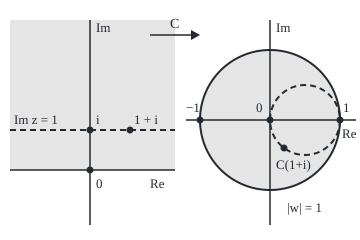

# Mobius transformations: (az + b)/(cz + d) sends circles and lines to circles and lines, once infinity counts as a point

Complex analysis → Conformal Maps and Harmonic Functions → Fraction maps of the sphere → Mobius transformations

---

## General Overview

A fisheye lens bows straight lines into circles, tears nothing, and keeps small angles. The plane has an exact version of that lens.

It is the Cayley map, C(z) = (z − i)/(z + i). It sends i to 0 and 0 to −i/i = −1. A huge input makes the i's negligible: the output creeps towards 1. At −i the bottom is 0: the output runs off to infinity.

A real x is as far from i as from −i, so C(x) has size 1: the real axis becomes the unit circle, all but the point 1. Add one point called infinity, send it to 1, and nothing is missing. From here on the lens is called a **Mobius transformation** (after August Ferdinand Möbius): any map (az + b)/(cz + d), with complex numbers a, b, c, d and ad − bc not zero.

**A Mobius transformation undoes cleanly, composes like a 2 by 2 matrix, and carries circles and lines onto circles and lines, once infinity is one extra point on every line.**

**What kind of fact this is:** a theorem, proved on this card in Why it works; the point at infinity and the map itself are definitions.

### The picture: the half plane through the lens

<p align="center"></p>

To scale: on the left 40 units per 1, origin at (90, 170); on the right 70 units per 1, origin at (270, 120). The shaded half plane lands in the shaded disc; the dashed line Im z = 1 lands on the dashed circle of centre 1/2, radius 1/2, touching the unit circle at 1.

---

## The formula

Reminder: z̄ (read "z-bar") is z mirrored in the real axis, |z| its distance from 0 ([conjugate-and-modulus](../01-Complex%20Numbers%20and%20the%20Plane/02-conjugate-and-modulus.md)). New: $\infty$ names one extra point, reached by going far out in any direction.

$$T(z) = \frac{az + b}{cz + d}, \qquad ad - bc \neq 0, \qquad T\!\left(-\tfrac{d}{c}\right) = \infty, \quad T(\infty) = \frac{a}{c}$$

**Read it aloud:** a first-degree expression over another, not proportional; the point zeroing the bottom goes to infinity, and infinity to a/c. When c = 0, infinity stays put.

The matrix does the bookkeeping:

$$T \leftrightarrow \begin{pmatrix} a & b \\ c & d \end{pmatrix}, \qquad T^{-1}(w) = \frac{dw - b}{-cw + a}$$

**Read it aloud:** composing two maps multiplies their matrices, and the undo swaps a with d and negates b and c.

For the Cayley map a = 1, b = −i, c = 1, d = i, so ad − bc = i + i = 2i.

| Symbol | Plain meaning | In our example | Push it up and the answer… |
| --- | --- | --- | --- |
| $z$, $w$ | a point, and its image | 1 + i, 0.2 − 0.4i | — |
| $a$, $b$, $c$, $d$ | the map's four numbers, its matrix | 1, −i, 1, i | scaling all four changes nothing |
| $ad - bc$ | the determinant; zero collapses the map | 2i | — |
| $\infty$ | the one point at infinity | C(−i) = ∞, C(∞) = 1 | — |
| $T$, $T^{-1}$ | any Mobius map, and its undo | C and i(1 + w)/(1 − w) | — |
| $C$ | the Cayley map (z − i)/(z + i) | i to 0, 0 to −1, ∞ to 1 | — |
| $\alpha$, $\beta$, $\gamma$ | a circle's equation numbers, α, γ real | Im z = 1: 0, −i/2, −1 | α = 0 makes a line |
| $z_1$, $z_2$, $z_3$ | three points with chosen targets | i, 0, ∞ to 0, −1, 1 | — |

### When it holds

- **ad − bc not zero.** Otherwise the map is constant: (z + 2)/(2z + 4) is 0.5 everywhere, with no undo.
- **Infinity counted as a point.** Otherwise the map has a hole, and the real axis misses the point 1.
- **Circles and lines as one family.** A circle through the pole comes out a line: |z| = 1 passes through −i.
- **Insides not promised.** The lower half plane lands outside the disc: C(−2i) = 3.

---

## Why it works

### Step 0: a map is its matrix, up to a scale

Write z as the pair (z, 1) and infinity as (1, 0); a pair (s, t) stands for s/t. The matrix multiplies it ([matrix-times-vector](../../03-Algebra/04-Matrices/02-matrix-times-vector.md)): (s, t) goes to (as + bt, cs + dt). (z, 1) gives ratio T(z); (1, 0) gives (a, c), so infinity needs no special rule.

### Step 1: composing is multiplying

One map then another multiplies by their matrices' product ([matrix-multiplication](../../03-Algebra/04-Matrices/03-matrix-multiplication.md)). Apply C twice to 2i: C(2i) = i/(3i) = 1/3, then C(1/3) = (1 − 3i)/(1 + 3i) = −0.8 − 0.6i. The squared matrix agrees. The cube is (2 − 2i) times the identity: C thrice moves nothing (Step 5).

### Step 2: undoing is the swapped matrix

The swapped matrix, called the **adjugate**, times the original is (ad − bc) times the identity, so it undoes the map. For C it gives i(1 + w)/(1 − w), which takes 0.2 − 0.4i back to 1 + i. So the map is a bijection (a perfect pairing) of the plane plus infinity, the **Riemann sphere**: the plane wrapped round a ball, infinity at the top.

### Step 3: every map is shifts, turns and one flip

If c = 0 the map is a turn-and-stretch then a shift. If c is not zero, divide out:

$$T(z) = \frac{a}{c} - \frac{ad - bc}{c^2}\cdot\frac{1}{z + d/c}$$

Shift, take 1/z, turn-and-stretch, shift. Only 1/z can bend a line, so only 1/z needs a proof.

### Step 4: 1/z keeps the circle equation

Every circle and every line is one equation:

$$\alpha\,|z|^2 + \beta z + \bar\beta\,\bar z + \gamma = 0, \qquad \alpha, \gamma \text{ real}$$

A circle |z − p|^2 = r^2 expands to α = 1, β = −p̄, γ = |p|^2 − r^2; a line has α = 0. Put z = 1/w and multiply through by |w|^2:

$$\gamma\,|w|^2 + \bar\beta\,w + \beta\,\bar w + \alpha = 0$$

The same kind of equation, α and γ swapped: 1/z keeps the family, so by Step 3 every Mobius map does. A circle through 0 has γ = 0 and becomes a line.

<details>
<summary>Detailed proof: the image is all of a circle or line</summary>

Let E solve the first equation, with |β|^2 − αγ > 0 (a real circle or line), plus ∞ when α = 0. Let F solve the second, plus ∞ when γ = 0; the swap keeps |β|^2 − αγ. For z not 0 or ∞, z is on E exactly when 1/z is on F, since |z|^2 is not zero. 0 is on E exactly when γ = 0, exactly when ∞ is on F; ∞ is on E exactly when α = 0, exactly when 0 is on F. So 1/z maps E onto F. Shifts and turn-and-stretches move centres and scale radii, and fix ∞; Step 3 finishes the proof.

</details>

### Step 5: three points fix the map

One map, built from the **cross-ratio** (a four-point quantity Mobius maps keep), sends any three distinct points to 0, 1 and ∞; one such map then another's undo sends any three to any three. The map is unique: one fixing 0, 1 and ∞ has b = c = 0 and a = d, the identity.

Hence the cube: C sends ∞ to 1, 1 to −i, −i to ∞, so C three times fixes all three.

<details>
<summary>The cross-ratio, and the map through three points</summary>

For distinct z1, z2, z3, the map
$$S(z) = \frac{(z - z_1)(z_2 - z_3)}{(z - z_3)(z_2 - z_1)}$$
sends z1 to 0, z2 to 1, z3 to ∞ (drop factors holding ∞); its value at a fourth point is the cross-ratio. For i, 0, ∞: S(z) = 1 + iz. For 0, −1, 1: R(w) = 2w/(w − 1). S then the undo of R has matrix proportional to (1, −i, 1, i): the Cayley map, from three points alone. The cross-ratio survives: S(2i) = −1 and R(C(2i)) = R(1/3) = −1.

</details>

### Step 6: why the half plane lands in the disc

For z = x + iy, compare the distances from i and from −i:

$$1 - |C(z)|^2 = \frac{|z + i|^2 - |z - i|^2}{|z + i|^2} = \frac{4y}{|z + i|^2}$$

Positive y gives |C(z)| < 1; at 1 + i both sides are 0.8. The undo has imaginary part (1 − |w|^2)/|1 − w|^2, positive on the disc, so the half plane fills it exactly.

<details>
<summary>Every map of the disc onto itself</summary>

For p inside the unit disc, the Blaschke factor (z − p)/(1 − p̄ z) sends p to 0 and keeps the disc. Every conformal map of the disc onto itself is one of these then a turn (Stein and Shakarchi, Chapter 8).

</details>

Stereographic projection, lines from a ball's north pole, builds the sphere directly.

---

## Worked numbers, by hand

| Step | Arithmetic | Value |
| --- | --- | --- |
| Determinant | 1 × i − (−i) × 1 | 2i |
| The top point | (i − i)/(i + i) | **0** |
| The origin | (0 − i)/(0 + i) | **−1** |
| Infinity | leading numbers, 1/1 | **1** |
| The pole | (−i − i)/(−i + i) = −2i/0 | **∞** |
| A point on the line Im z = 1 | 1/(1 + 2i) = (1 − 2i)/5 | 0.2 − 0.4i |
| Inside the disc | 1 − (0.04 + 0.16); 4 × 1/5 | 0.8 both ways |
| On the dashed circle | distance from 0.5: size of −0.3 − 0.4i | 0.5 |
| Undo | i(1.2 − 0.4i)/(0.8 + 0.4i) = (0.4 + 1.2i)/(0.8 + 0.4i) | **1 + i** |

So 1 + i lands on the dashed circle, inside the disc.

### What breaks if you drop a piece

| Mistake | Comes out at | What went wrong |
| --- | --- | --- |
| ad − bc = 0: (z + 2)/(2z + 4) | 0.5 at 0, at 1 and at i | Top a multiple of bottom: a constant, no undo |
| The unit circle expected to stay a circle | α = 0: the line Re w = 0 | It passes through the pole −i |
| Infinity left out | C(1000) = 0.999998 − 0.002000i, never 1 | The unit circle loses the point 1 |
| Lower half plane put in | C(−2i) = 3 | It maps outside the disc |

The code prints each.

---

## Code, from first principles, and it actually runs

Two roads. Road one maps points with the fraction, fits a circle through three images and checks 801 more. Road two never maps a point: it multiplies matrices, builds the three-point map from cross-ratios, and pushes a circle's equation through the undo matrix. They agree on the Cayley matrix and on both image circles.

### Python

```python
# Mobius transformations -- the check behind the card.  Standard library only.
# A map (az + b)/(cz + d) is kept as its matrix (a, b, c, d); a point is a pair (s, t)
# standing for s/t, so infinity is (1, 0).  Road 1 works point by point with the
# fraction; road 2 works on matrices and circle equations.
M, INF = (1, -1j, 1, 1j), (1, 0)                 # the Cayley map (z - i)/(z + i)
def mul(A, B): return (A[0]*B[0] + A[1]*B[2], A[0]*B[1] + A[1]*B[3], A[2]*B[0] + A[3]*B[2], A[2]*B[1] + A[3]*B[3])
def adj(A): return (A[3], -A[1], -A[2], A[0])    # undoes A, up to a scale
def act(A, p): return (A[0]*p[0] + A[1]*p[1], A[2]*p[0] + A[3]*p[1])
def pt(p): return None if p[1] == 0 else p[0] / p[1]      # None is infinity
def frac(A, z):                                  # road 1: the fraction and its two rules
    if z is None: return A[0] / A[2] if A[2] != 0 else None
    return None if A[2]*z + A[3] == 0 else (A[0]*z + A[1]) / (A[2]*z + A[3])
def r6(x): return f"{round(x, 6) + 0.0:.6f}"
def show(w): return "infinity" if w is None else f"{r6(w.real)} {'-' if round(w.imag, 6) < 0 else '+'} {abs(round(w.imag, 6)):.6f}i"
def to_0_1_inf(p1, p2, p3):                      # cross-ratio map: p1, p2, p3 to 0, 1, infinity
    k1, k3 = p3[1]*p2[0] - p3[0]*p2[1], p1[1]*p2[0] - p1[0]*p2[1]
    return (k1*p1[1], -k1*p1[0], k3*p3[1], -k3*p3[0])
def carry(H, A):          # road 2: alpha|z|^2 + 2Re(beta z) + gamma = 0, pushed through A
    al, be, ga = H; N = adj(A); n1, n2 = (N[0], N[2]), (N[1], N[3])
    q = lambda u, v: u[0].conjugate()*(al*v[0] + be.conjugate()*v[1]) + u[1].conjugate()*(be*v[0] + ga*v[1])
    return q(n1, n1).real, q(n2, n1), q(n2, n2).real
def through3(a, b, c):                           # road 1: the circle through three image points
    num = abs(a)**2*(b - c) + abs(b)**2*(c - a) + abs(c)**2*(a - b)
    cen = num / (a.conjugate()*(b - c) + b.conjugate()*(c - a) + c.conjugate()*(a - b)); return cen, abs(a - cen)
v = {n: frac(M, z) for n, z in [("i", 1j), ("0", 0j), ("infinity", None), ("-i", -1j), ("1", 1+0j), ("-1", -1+0j), ("2i", 2j), ("1 + i", 1+1j)]}
print(f"Cayley matrix (1, -i, 1, i), ad - bc = {show(M[0]*M[3] - M[1]*M[2])}")
print(", ".join(f"C({n}) = {show(w)}" for n, w in list(v.items())[:4]))
print(", ".join(f"C({n}) = {show(w)}" for n, w in list(v.items())[4:]))
twice, M2, M3 = frac(M, v["2i"]), mul(M, M), mul(M, mul(M, M))
print(f"C twice at 2i: by the fraction {show(twice)}; by the matrix product {show(pt(act(M2, (2j, 1))))}")
print(f"matrix cubed: ({', '.join(show(x) for x in M3)}); C three times at 2i: {show(frac(M, twice))}")
back = frac(adj(M), v["1 + i"])
print(f"adjugate (i, i, -1, 1) takes {show(v['1 + i'])} back to {show(back)}; matrix x adjugate diagonal {show(mul(M, adj(M))[0])}")
T = mul(adj(to_0_1_inf((0, 1), (-1, 1), (1, 1))), to_0_1_inf((1j, 1), (0, 1), INF))
print(f"map sending i, 0, infinity to 0, -1, 1 by cross-ratios, scaled to c = 1: ({', '.join(show(x / T[2]) for x in T)})")
crz, crw = pt(act(to_0_1_inf((1j, 1), (0, 1), INF), (2j, 1))), pt(act(to_0_1_inf((0, 1), (-1, 1), (1, 1)), (v["2i"], 1)))
print(f"cross-ratio of 2i against i, 0, infinity: {show(crz)}; of C(2i) against 0, -1, 1: {show(crw)}")
fits = []
for y in (0, 1):
    cen, rad = through3(*(frac(M, complex(x, y)) for x in (-2, 0, 2)))
    on = max(abs(abs(frac(M, complex(k / 4, y)) - cen) - rad) for k in range(-400, 401)) < 1e-12
    al, be, ga = carry((0, -0.5j, -y), M); cen2, rad2 = -be.conjugate() / al, (abs(be)**2 - al*ga) ** 0.5 / abs(al)
    fits.append((cen, rad, cen2, rad2, on))
    print(f"line Im z = {y}, road 1: circle through images of x = -2, 0, 2: centre {show(cen)}, radius {r6(rad)}; 801 more on it: {'yes' if on else 'no'}")
    print(f"line Im z = {y}, road 2: circle equation carried by the matrix: centre {show(cen2)}, radius {r6(rad2)}")
grid = [complex(x, k / 4) for x in range(-10, 10) for k in range(1, 21)]
gap = max(abs((1 - abs(frac(M, z))**2) - 4*z.imag / abs(z + 1j)**2) for z in grid)
print(f"at 1 + i: 1 - |C|^2 = {r6(1 - abs(v['1 + i'])**2)}, 4y/|z + i|^2 = {r6(4 / abs(1 + 2j)**2)}; {len(grid)} points above the axis all inside: {'yes' if max(abs(frac(M, z)) for z in grid) < 1 else 'no'}")
D, (al, be, ga) = (1, 2, 2, 4), carry((1, 0j, -1), M)
print(f"mistake, ad - bc = {r6((D[0]*D[3] - D[1]*D[2]).real)}: (z + 2)/(2z + 4) at 0, 1, i: {', '.join(show(frac(D, z)) for z in (0j, 1+0j, 1j))}")
print(f"mistake, circle |z| = 1 runs through the pole -i: alpha = {r6(al)}, beta = {show(be)}, gamma = {r6(ga)}: the line Re w = 0")
print(f"mistake, infinity left out: C(1000) = {show(frac(M, 1000+0j))}, still {r6(abs(frac(M, 1000+0j) - 1))} from 1, and C(-2i) = {show(frac(M, -2j))} lands outside")
L, R = lambda z: (90 + 40*z.real, 170 - 40*z.imag), lambda w: (270 + 70*w.real, 120 - 70*w.imag)
print("figure, left 40 per unit, right 70 per unit: " + ", ".join(f"{n} ({p[0]:.2f}, {p[1]:.2f})" for n, p in [("i", L(1j)), ("1 + i", L(1+1j)), ("C(0)", R(v["0"])), ("C(1 + i)", R(v["1 + i"])), ("centre", R(fits[1][0]))]) + f", radius {70*fits[1][1]:.2f}")
assert all(abs(T[j]*M[k] - T[k]*M[j]) < 1e-12 for j in range(4) for k in range(4))   # three points fix the map
assert abs(M3[1]) + abs(M3[2]) < 1e-12 and abs(M3[0] - M3[3]) < 1e-12 and abs(back - (1+1j)) < 1e-12
assert all(f[4] and abs(f[0] - f[2]) < 1e-12 and abs(f[1] - f[3]) < 1e-12 for f in fits)  # two roads, same circle
assert gap < 1e-12 and abs(al) < 1e-12 and abs(crz - crw) < 1e-12
print("ALL CHECKS PASS")
```

**Ran 2026-09-28 on macOS, Python 3.14.6, standard library only. All checks passed. Output, pasted from the run:**

```
Cayley matrix (1, -i, 1, i), ad - bc = 0.000000 + 2.000000i
C(i) = 0.000000 + 0.000000i, C(0) = -1.000000 + 0.000000i, C(infinity) = 1.000000 + 0.000000i, C(-i) = infinity
C(1) = 0.000000 - 1.000000i, C(-1) = 0.000000 + 1.000000i, C(2i) = 0.333333 + 0.000000i, C(1 + i) = 0.200000 - 0.400000i
C twice at 2i: by the fraction -0.800000 - 0.600000i; by the matrix product -0.800000 - 0.600000i
matrix cubed: (2.000000 - 2.000000i, 0.000000 + 0.000000i, 0.000000 + 0.000000i, 2.000000 - 2.000000i); C three times at 2i: 0.000000 + 2.000000i
adjugate (i, i, -1, 1) takes 0.200000 - 0.400000i back to 1.000000 + 1.000000i; matrix x adjugate diagonal 0.000000 + 2.000000i
map sending i, 0, infinity to 0, -1, 1 by cross-ratios, scaled to c = 1: (1.000000 + 0.000000i, 0.000000 - 1.000000i, 1.000000 + 0.000000i, 0.000000 + 1.000000i)
cross-ratio of 2i against i, 0, infinity: -1.000000 + 0.000000i; of C(2i) against 0, -1, 1: -1.000000 + 0.000000i
line Im z = 0, road 1: circle through images of x = -2, 0, 2: centre 0.000000 + 0.000000i, radius 1.000000; 801 more on it: yes
line Im z = 0, road 2: circle equation carried by the matrix: centre 0.000000 + 0.000000i, radius 1.000000
line Im z = 1, road 1: circle through images of x = -2, 0, 2: centre 0.500000 + 0.000000i, radius 0.500000; 801 more on it: yes
line Im z = 1, road 2: circle equation carried by the matrix: centre 0.500000 + 0.000000i, radius 0.500000
at 1 + i: 1 - |C|^2 = 0.800000, 4y/|z + i|^2 = 0.800000; 400 points above the axis all inside: yes
mistake, ad - bc = 0.000000: (z + 2)/(2z + 4) at 0, 1, i: 0.500000 + 0.000000i, 0.500000 + 0.000000i, 0.500000 + 0.000000i
mistake, circle |z| = 1 runs through the pole -i: alpha = 0.000000, beta = 2.000000 + 0.000000i, gamma = 0.000000: the line Re w = 0
mistake, infinity left out: C(1000) = 0.999998 - 0.002000i, still 0.002000 from 1, and C(-2i) = 3.000000 + 0.000000i lands outside
figure, left 40 per unit, right 70 per unit: i (90.00, 130.00), 1 + i (130.00, 130.00), C(0) (200.00, 120.00), C(1 + i) (284.00, 148.00), centre (305.00, 120.00), radius 35.00
ALL CHECKS PASS
```

### Rust

Same labels, built with `rustc --edition 2021 -O`, with its own complex type.

```rust
// Mobius transformations -- the same check as the Python, in Rust.  No crates.
// A map (az + b)/(cz + d) is kept as its matrix [a, b, c, d]; a point is a pair (s, t) standing for
// s/t, so infinity is (1, 0).  Road 1 works point by point; road 2 on matrices and circle equations.
use std::ops::{Add, Div, Mul, Sub};
#[derive(Clone, Copy, PartialEq)]
struct C { re: f64, im: f64 }
fn c(re: f64, im: f64) -> C { C { re, im } }
impl Add for C { type Output = C; fn add(self, o: C) -> C { c(self.re + o.re, self.im + o.im) } }
impl Sub for C { type Output = C; fn sub(self, o: C) -> C { c(self.re - o.re, self.im - o.im) } }
impl Mul for C { type Output = C; fn mul(self, o: C) -> C { c(self.re * o.re - self.im * o.im, self.re * o.im + self.im * o.re) } }
impl Div for C { type Output = C; fn div(self, o: C) -> C { let d = o.re * o.re + o.im * o.im; c((self.re * o.re + self.im * o.im) / d, (self.im * o.re - self.re * o.im) / d) } }
impl C { fn cj(self) -> C { c(self.re, -self.im) } fn abs(self) -> f64 { self.re.hypot(self.im) } }
type M4 = [C; 4]; type P = (C, C);
const O: C = C { re: 0.0, im: 0.0 };
fn mul(a: M4, b: M4) -> M4 { [a[0] * b[0] + a[1] * b[2], a[0] * b[1] + a[1] * b[3], a[2] * b[0] + a[3] * b[2], a[2] * b[1] + a[3] * b[3]] }
fn adj(a: M4) -> M4 { [a[3], O - a[1], O - a[2], a[0]] } // undoes a, up to a scale
fn act(a: M4, p: P) -> P { (a[0] * p.0 + a[1] * p.1, a[2] * p.0 + a[3] * p.1) }
fn pt(p: P) -> Option<C> { if p.1 == O { None } else { Some(p.0 / p.1) } } // None is infinity
fn frac(a: M4, z: Option<C>) -> Option<C> { match z { None => if a[2] != O { Some(a[0] / a[2]) } else { None }, // road 1
    Some(z) => { let den = a[2] * z + a[3]; if den == O { None } else { Some((a[0] * z + a[1]) / den) } } } }
fn r6(x: f64) -> String { let s = format!("{:.6}", x); if s == "-0.000000" { "0.000000".to_string() } else { s } }
fn show(w: Option<C>) -> String { match w { None => "infinity".to_string(), Some(w) => { let b = format!("{:.6}", w.im.abs());
    format!("{} {} {}i", r6(w.re), if w.im < 0.0 && b != "0.000000" { '-' } else { '+' }, b) } } }
fn to_0_1_inf(p1: P, p2: P, p3: P) -> M4 { // cross-ratio map: p1, p2, p3 to 0, 1, infinity
    let (k1, k3) = (p3.1 * p2.0 - p3.0 * p2.1, p1.1 * p2.0 - p1.0 * p2.1); [k1 * p1.1, O - k1 * p1.0, k3 * p3.1, O - k3 * p3.0]
}
fn carry(h: (C, C, C), a: M4) -> (C, C, C) { // road 2: alpha|z|^2 + 2Re(beta z) + gamma = 0, pushed through a
    let (al, be, ga) = h; let n = adj(a); let (n1, n2) = ((n[0], n[2]), (n[1], n[3]));
    let q = |u: P, v: P| u.0.cj() * (al * v.0 + be.cj() * v.1) + u.1.cj() * (be * v.0 + ga * v.1);
    (q(n1, n1), q(n2, n1), q(n2, n2))
}
fn through3(a: C, b: C, d: C) -> (C, f64) { // road 1: the circle through three image points
    let sq = |z: C| c(z.abs() * z.abs(), 0.0); let cen = (sq(a) * (b - d) + sq(b) * (d - a) + sq(d) * (a - b)) / (a.cj() * (b - d) + b.cj() * (d - a) + d.cj() * (a - b));
    (cen, (a - cen).abs())
}
fn main() {
    let (one, i) = (c(1.0, 0.0), c(0.0, 1.0)); let (m, inf): (M4, P) = ([one, O - i, one, i], (one, O));
    let names = ["i", "0", "infinity", "-i", "1", "-1", "2i", "1 + i"];
    let v: Vec<Option<C>> = [Some(i), Some(O), None, Some(O - i), Some(one), Some(c(-1.0, 0.0)), Some(c(0.0, 2.0)), Some(c(1.0, 1.0))].iter().map(|&z| frac(m, z)).collect();
    let line = |r: std::ops::Range<usize>| r.map(|k| format!("C({}) = {}", names[k], show(v[k]))).collect::<Vec<_>>().join(", ");
    println!("Cayley matrix (1, -i, 1, i), ad - bc = {}", show(Some(m[0] * m[3] - m[1] * m[2])));
    println!("{}\n{}", line(0..4), line(4..8));
    let (twice, m2, m3) = (frac(m, v[6]), mul(m, m), mul(m, mul(m, m)));
    println!("C twice at 2i: by the fraction {}; by the matrix product {}", show(twice), show(pt(act(m2, (c(0.0, 2.0), one)))));
    println!("matrix cubed: ({}); C three times at 2i: {}", m3.iter().map(|&x| show(Some(x))).collect::<Vec<_>>().join(", "), show(frac(m, twice)));
    let back = frac(adj(m), v[7]).unwrap();
    println!("adjugate (i, i, -1, 1) takes {} back to {}; matrix x adjugate diagonal {}", show(v[7]), show(Some(back)), show(Some(mul(m, adj(m))[0])));
    let (sw, sz) = (to_0_1_inf((O, one), (c(-1.0, 0.0), one), (one, one)), to_0_1_inf((i, one), (O, one), inf)); let t = mul(adj(sw), sz);
    println!("map sending i, 0, infinity to 0, -1, 1 by cross-ratios, scaled to c = 1: ({})", t.iter().map(|&x| show(Some(x / t[2]))).collect::<Vec<_>>().join(", "));
    let (crz, crw) = (pt(act(sz, (c(0.0, 2.0), one))).unwrap(), pt(act(sw, (v[6].unwrap(), one))).unwrap());
    println!("cross-ratio of 2i against i, 0, infinity: {}; of C(2i) against 0, -1, 1: {}", show(Some(crz)), show(Some(crw)));
    let mut fits = Vec::new();
    for y in [0.0, 1.0] {
        let (cen, rad) = through3(frac(m, Some(c(-2.0, y))).unwrap(), frac(m, Some(c(0.0, y))).unwrap(), frac(m, Some(c(2.0, y))).unwrap());
        let on = (-400..=400).map(|k| ((frac(m, Some(c(k as f64 / 4.0, y))).unwrap() - cen).abs() - rad).abs()).fold(0.0, f64::max) < 1e-12;
        let (al, be, ga) = carry((O, c(0.0, -0.5), c(-y, 0.0)), m);
        let (cen2, rad2) = (c(0.0, 0.0) - be.cj() / al, (be.abs() * be.abs() - (al * ga).re).sqrt() / al.abs());
        fits.push((cen, rad, cen2, rad2, on));
        println!("line Im z = {}, road 1: circle through images of x = -2, 0, 2: centre {}, radius {}; 801 more on it: {}", y, show(Some(cen)), r6(rad), if on { "yes" } else { "no" });
        println!("line Im z = {}, road 2: circle equation carried by the matrix: centre {}, radius {}", y, show(Some(cen2)), r6(rad2));
    }
    let grid: Vec<C> = (-10..10).flat_map(|x| (1..21).map(move |k| c(x as f64, k as f64 / 4.0))).collect();
    let gap = grid.iter().map(|&z| ((1.0 - frac(m, Some(z)).unwrap().abs().powi(2)) - 4.0 * z.im / (z + i).abs().powi(2)).abs()).fold(0.0, f64::max);
    let inside = grid.iter().all(|&z| frac(m, Some(z)).unwrap().abs() < 1.0);
    println!("at 1 + i: 1 - |C|^2 = {}, 4y/|z + i|^2 = {}; {} points above the axis all inside: {}", r6(1.0 - v[7].unwrap().abs().powi(2)), r6(4.0 / c(1.0, 2.0).abs().powi(2)), grid.len(), if inside { "yes" } else { "no" });
    let (d, (al, be, ga)) = ([one, c(2.0, 0.0), c(2.0, 0.0), c(4.0, 0.0)], carry((one, O, c(-1.0, 0.0)), m));
    println!("mistake, ad - bc = {}: (z + 2)/(2z + 4) at 0, 1, i: {}", r6((d[0] * d[3] - d[1] * d[2]).re), [O, one, i].iter().map(|&z| show(frac(d, Some(z)))).collect::<Vec<_>>().join(", "));
    println!("mistake, circle |z| = 1 runs through the pole -i: alpha = {}, beta = {}, gamma = {}: the line Re w = 0", r6(al.re), show(Some(be)), r6(ga.re));
    let far = frac(m, Some(c(1000.0, 0.0))).unwrap();
    println!("mistake, infinity left out: C(1000) = {}, still {} from 1, and C(-2i) = {} lands outside", show(Some(far)), r6((far - one).abs()), show(frac(m, Some(c(0.0, -2.0)))));
    let (lf, rf) = (|z: C| (90.0 + 40.0 * z.re, 170.0 - 40.0 * z.im), |w: C| (270.0 + 70.0 * w.re, 120.0 - 70.0 * w.im));
    let pts = [("i", lf(i)), ("1 + i", lf(c(1.0, 1.0))), ("C(0)", rf(v[1].unwrap())), ("C(1 + i)", rf(v[7].unwrap())), ("centre", rf(fits[1].0))];
    println!("figure, left 40 per unit, right 70 per unit: {}, radius {:.2}", pts.iter().map(|(n, p)| format!("{} ({:.2}, {:.2})", n, p.0, p.1)).collect::<Vec<_>>().join(", "), 70.0 * fits[1].1);
    assert!((0..4).all(|j| (0..4).all(|k| (t[j] * m[k] - t[k] * m[j]).abs() < 1e-12))); // three points fix the map
    assert!(m3[1].abs() + m3[2].abs() < 1e-12 && (m3[0] - m3[3]).abs() < 1e-12 && (back - c(1.0, 1.0)).abs() < 1e-12);
    assert!(fits.iter().all(|f| f.4 && (f.0 - f.2).abs() < 1e-12 && (f.1 - f.3).abs() < 1e-12)); // two roads, same circle
    assert!(gap < 1e-12 && al.abs() < 1e-12 && (crz - crw).abs() < 1e-12);
    println!("ALL CHECKS PASS");
}
```

**Ran 2026-09-28 on macOS, rustc 1.98.1, no crates. All checks passed. Output, pasted from the run:**

```
Cayley matrix (1, -i, 1, i), ad - bc = 0.000000 + 2.000000i
C(i) = 0.000000 + 0.000000i, C(0) = -1.000000 + 0.000000i, C(infinity) = 1.000000 + 0.000000i, C(-i) = infinity
C(1) = 0.000000 - 1.000000i, C(-1) = 0.000000 + 1.000000i, C(2i) = 0.333333 + 0.000000i, C(1 + i) = 0.200000 - 0.400000i
C twice at 2i: by the fraction -0.800000 - 0.600000i; by the matrix product -0.800000 - 0.600000i
matrix cubed: (2.000000 - 2.000000i, 0.000000 + 0.000000i, 0.000000 + 0.000000i, 2.000000 - 2.000000i); C three times at 2i: 0.000000 + 2.000000i
adjugate (i, i, -1, 1) takes 0.200000 - 0.400000i back to 1.000000 + 1.000000i; matrix x adjugate diagonal 0.000000 + 2.000000i
map sending i, 0, infinity to 0, -1, 1 by cross-ratios, scaled to c = 1: (1.000000 + 0.000000i, 0.000000 - 1.000000i, 1.000000 + 0.000000i, 0.000000 + 1.000000i)
cross-ratio of 2i against i, 0, infinity: -1.000000 + 0.000000i; of C(2i) against 0, -1, 1: -1.000000 + 0.000000i
line Im z = 0, road 1: circle through images of x = -2, 0, 2: centre 0.000000 + 0.000000i, radius 1.000000; 801 more on it: yes
line Im z = 0, road 2: circle equation carried by the matrix: centre 0.000000 + 0.000000i, radius 1.000000
line Im z = 1, road 1: circle through images of x = -2, 0, 2: centre 0.500000 + 0.000000i, radius 0.500000; 801 more on it: yes
line Im z = 1, road 2: circle equation carried by the matrix: centre 0.500000 + 0.000000i, radius 0.500000
at 1 + i: 1 - |C|^2 = 0.800000, 4y/|z + i|^2 = 0.800000; 400 points above the axis all inside: yes
mistake, ad - bc = 0.000000: (z + 2)/(2z + 4) at 0, 1, i: 0.500000 + 0.000000i, 0.500000 + 0.000000i, 0.500000 + 0.000000i
mistake, circle |z| = 1 runs through the pole -i: alpha = 0.000000, beta = 2.000000 + 0.000000i, gamma = 0.000000: the line Re w = 0
mistake, infinity left out: C(1000) = 0.999998 - 0.002000i, still 0.002000 from 1, and C(-2i) = 3.000000 + 0.000000i lands outside
figure, left 40 per unit, right 70 per unit: i (90.00, 130.00), 1 + i (130.00, 130.00), C(0) (200.00, 120.00), C(1 + i) (284.00, 148.00), centre (305.00, 120.00), radius 35.00
ALL CHECKS PASS
```

The two outputs match line for line.

> [!TIP]
> **Try changing**
> Guess first, then run it.
> - **Raise the line.** In `for y in (0, 1)` change `1` to `2`: centre 2/3, radius 1/3, still touching 1. Asserts pass.
> - **Swap two targets.** In the first `to_0_1_inf` call swap `(-1, 1)` and `(1, 1)`: the map found is minus Cayley, and the first assert stops it.
> - **Nudge one number.** Change `M`'s last entry to `2j`: the first assert stops it.

---

## The usual mistake

> [!warning]
> **Treating ∞ as a direction, or leaving it out.** It is one point: far out in every direction, C tends to 1. Leave it out and C(1000) = 0.999998 − 0.002000i is still 0.002000 short, and the circle has a hole.
>
> - **A circle must stay a circle.** |z| = 1 passes through −i and becomes the line Re w = 0.
> - **Insides go to insides.** C sends −2i to 3, outside.
> - **Forgetting the determinant.** (z + 2)/(2z + 4) is the constant 0.5.

---

## Where you meet it in real life

- **Radio engineering.** The Smith chart for matching antennas to cables maps impedances, a half plane, into the disc by (z − 1)/(z + 1), which is C(iz).
- **Heat in a disc.** A half-plane problem moves to the disc by C; [poisson-integral-formula](06-poisson-integral-formula.md) solves it there.
- **Non-Euclidean geometry.** The maps keeping the disc are the rigid motions of the hyperbolic plane.

> **Say it back**
> A Mobius transformation is (az + b)/(cz + d) with ad − bc not zero; it acts like its 2 by 2 matrix. With infinity added it pairs off the whole sphere. It is shifts, turns and 1/z, and 1/z keeps the circle equation. Three points fix it. Cayley sends i, 0, ∞ to 0, −1, 1, the real axis to the unit circle and the half plane onto the disc.

---

## What this builds on

- [conformal-maps](01-conformal-maps.md): a map with non-zero derivative keeps angles; T has derivative (ad − bc)/(cz + d)^2, never zero.
- [matrix-multiplication](../../03-Algebra/04-Matrices/03-matrix-multiplication.md): the product that composes two maps in Step 1.

## Where this goes next

- [standard-maps-and-composing-them](03-standard-maps-and-composing-them.md): chains with powers and the exponential.
- [poisson-integral-formula](06-poisson-integral-formula.md): disc temperatures from the rim, carried by C.
- modular-forms-in-outline: functions that keep their shape under Mobius maps with whole-number entries and determinant 1.

Mobius maps reach only regions bounded by circles and lines; reaching a wedge, a strip or a slit plane is the job of [standard-maps-and-composing-them](03-standard-maps-and-composing-them.md).

---

## Sources

Verified 28 Sep 2026: every link below resolves to the publisher's page.

- Stein, Elias M., and Rami Shakarchi. *Complex Analysis*. Princeton University Press, 2003. [Publisher page](https://press.princeton.edu/books/hardcover/9780691113852/complex-analysis). Chapter 8: the Cayley map from the half plane to the disc, and the maps of the disc onto itself.
- Lebl, Jiří. *Guide to Cultivating Complex Analysis: Working the Complex Field*. [Author's page and free text](https://www.jirka.org/ca/). The Riemann sphere and Mobius transformations, with circles and lines as one family.
