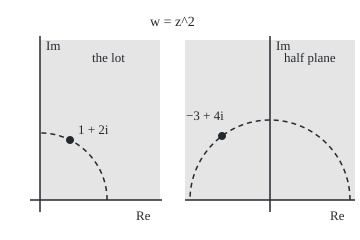
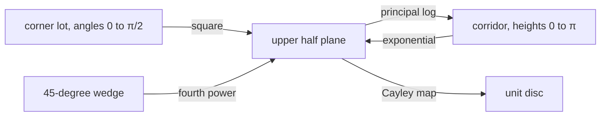

# The standard maps: z squared, e to the z, log and z to the a turn wedges, strips and half planes into one another, and you chain them to reach the shape you need

[Syllabus](../../../SYLLABUS.md) → [Complex analysis](../../../SYLLABUS.md#w07) → [Conformal Maps and Harmonic Functions](../../../SYLLABUS.md#w07-s07) → The standard maps

---

## General Overview

A corner lot is bounded by two streets meeting at a right angle. Put the corner at 0, one street along the real axis, the other up the imaginary axis. The lot is the **first quadrant**: every point with positive real and positive imaginary part, such as 1 + 2i.

Square every point. 1 + 2i goes to −3 + 4i. The right angle at the corner opens flat, and the lot fills the **upper half plane**: every point with positive imaginary part, each covered once.

The exponential lays a corridor, the band of heights between 0 and π, onto the same half plane; the logarithm rolls it back. A fourth power opens a 45-degree wedge flat. One Möbius map ([Mobius transformations](02-mobius-transformations-and-the-point-at-infinity.md)) folds the half plane into the unit disc, the points at distance less than 1 from 0. Chained, they carry each of these shapes onto any other.

**Powers open wedges because they multiply angles; the exponential and logarithm trade bands for wedges because they swap height and angle; a chain ending in one Möbius map reaches the disc.**

**What kind of fact this is:** a method: a kit of maps whose images are proved on this card in Why it works, and a recipe for chaining them.

### The picture: the corner lot squared into the half plane

<p align="center"></p>

To scale: 30 units per 1 on the left, 16 on the right, 0 where each panel's axes cross. The dashed quarter circle of radius √5 opens into the half circle of radius 5.

---

## The formula

A map sends each point $z$ of a starting region to a point $w$ of a target region; "C after squaring" means square first, then apply C. Reminder: $e^{i\theta}$ is the point at distance 1 and angle θ ([Euler's formula](../01-Complex%20Numbers%20and%20the%20Plane/04-eulers-formula.md)); Arg is the principal argument, the angle in (−π, π].

$$z = r e^{i\theta} \;\mapsto\; z^{a} = r^{a} e^{ia\theta}, \qquad a = \frac{\pi}{\alpha}$$

**Read it aloud:** a power raises the distance to the a-th power and multiplies the angle by a, so a = π over the wedge's angle opens the wedge flat.

$$e^{x+iy} = e^{x} e^{iy}, \qquad \operatorname{Log} w = \ln|w| + i \operatorname{Arg} w$$

**Read it aloud:** the exponential turns the real part into a distance and the height into an angle; the principal logarithm turns them back.

$$C(w) = \frac{w - i}{w + i}$$

**Read it aloud:** the Cayley map compares a point's distance to i with its distance to −i, sending the upper half plane into the unit disc.

| Symbol | Plain meaning | In our example | Push it up and the answer… |
| --- | --- | --- | --- |
| $z$ | a point of the starting region | 1 + 2i in the lot | — |
| $w$ | the image point | −3 + 4i | — |
| $r$, $\theta$ | distance from 0 and angle of z | 2.236068 and 1.107149 | the image moves out, turns further |
| $x$, $y$ | real part and height of a corridor point | ln 2 and π/3 | e^z moves out, turns further |
| $\alpha$ | the wedge's opening angle, in radians | π/2 for the lot, π/4 for the wedge | a smaller power opens it |
| $a$ | the power that opens the wedge, π/α | 2, then 4 | the wedge opens past flat; once aα passes 2π it overlaps |
| $C$ | the Cayley map, half plane to disc | −3 + 4i goes to 0.705882 + 0.176471i | — |

### When it holds

- **One-to-one needs room.** A power a is one-to-one on a wedge only while a times α stays at most 2π; the exponential only on bands no taller than 2π. Overshoot and points collide.
- **Corners open only at 0.** There the power's derivative is 0 (or, for a < 1, undefined) and angles are multiplied by a; elsewhere it is **conformal** (keeps angles: [Conformal maps](01-conformal-maps.md)).
- **Fractional powers and the log need a branch.** Here they are the principal branches, holomorphic (differentiable in the complex sense) off the negative real axis ([Branch cuts and complex powers](../02-Holomorphic%20Functions/05-branch-cuts-and-complex-powers.md)), a cut every region here avoids.
- **The Cayley map needs the upper half.** Points below the axis land outside the disc.

---

## Why it works

### Step 0: act on angle and distance separately

In polar form a point is a distance and an angle. Squaring doubles the angle and squares the distance, so a wedge goes to a wedge. The exponential turns height into angle, so a horizontal band becomes a wedge too.

### Step 1: squaring the corner lot

The point 1 + 2i sits at distance √5 = 2.236068 and angle 1.107149. Squared: distance 5, angle 2.214297, which is −3 + 4i. Multiplying out agrees: (1 + 2i)(1 + 2i) = 1 + 4i − 4.

The lot is every angle strictly between 0 and π/2 at every positive distance. Doubling gives every angle between 0 and π: the whole upper half plane. The principal square root undoes it, so each half-plane point has one source in the lot.

### Step 2: opening any wedge with a power

A wedge of angle α holds the angles between 0 and α; the power a = π/α stretches them to 0 to π. The 45-degree wedge needs a = 4. Its midline point $2e^{i\pi/8}$ = 1.847759 + 0.765367i goes to distance 16 at angle π/2, which is 16i.

A fractional a works the same way through the principal branch, z^a = e^(a Log z), as long as the wedge avoids the negative real axis.

### Step 3: the exponential lays the corridor flat

For a corridor point x + iy, the exponential gives distance $e^{x}$ and angle y. As x runs over all real numbers the distance runs over all positive numbers; the angle runs strictly between 0 and π. So the corridor fills the upper half plane, each point once.

The point ln 2 + iπ/3 goes to distance 2 at angle π/3, which is 1 + 1.732051i; the midline point iπ/2 goes to i. Horizontal lines become rays from 0; the bottom edge becomes the positive real axis, the top edge the negative one.

### Step 4: the logarithm rolls it back

For w in the upper half plane, Arg w lies between 0 and π, so Log w lies in the corridor, undoing the exponential. Log(−3 + 4i) = ln 5 + 2.214297i = 1.609438 + 2.214297i.

### Step 5: the Cayley map closes the half plane into a disc

A point above the real axis is nearer to i than to −i, so there C(w) has modulus less than 1. The Möbius card proves C is onto the whole disc, one-to-one. At −3 + 4i: C gives 0.705882 + 0.176471i, modulus 0.727607.

### Step 6: chain them

Each map is one-to-one from its region onto the next, so their chain is too. Each has a nonzero derivative inside its region; by the chain rule so does the composite, which is therefore conformal.

The lot reaches the disc as C after squaring: 1 + 2i → −3 + 4i → 0.705882 + 0.176471i, exactly 24/34 + (6/34)i. The corridor reaches it as C after the exponential: iπ/2 → i → 0, the centre.



Every arrow is one-to-one and onto; inverses walk back.

<details>
<summary>Detailed proof: each map is one-to-one and onto its target</summary>

**Powers.** Let the wedge hold $z = re^{i\theta}$ with r > 0 and 0 < θ < α, and let aα = π. Then $z^a = r^a e^{ia\theta}$ with 0 < aθ < π: in the upper half plane. Given $w = \rho e^{i\varphi}$ with 0 < φ < π, the point with distance $\rho^{1/a}$ and angle φ/a lies in the wedge and maps to w: onto. Two wedge points with one image have equal distances and angles differing by a multiple of 2π/a; both lie in an interval shorter than 2π/a, so they are equal: one-to-one.

**Exponential.** Given w in the upper half plane, x = ln|w| and y = Arg w is the one corridor point mapping to it, since $e^{x}$ takes each positive value once. The logarithm is that inverse.

**Cayley.** For w = s + it, $|w - i|^2 - |w + i|^2 = (s^2 + (t-1)^2) - (s^2 + (t+1)^2) = -4t$. It is negative exactly when t > 0: into the disc. Solving ζ = (w − i)/(w + i) for w gives w = i(1 + ζ)/(1 − ζ), whose height is (1 − |ζ|^2)/|1 − ζ|^2 > 0 when |ζ| < 1: onto.

</details>

That some such map exists for almost any region without holes, and how to build one for a polygon, is the subject of [The Riemann mapping theorem](08-riemann-mapping-theorem-and-schwarz-christoffel.md).

---

## Worked numbers, by hand

| Step | Arithmetic | Value |
| --- | --- | --- |
| lot point in polar form | distance √(1 + 4), angle atan2(2, 1) | 2.236068, 1.107149 |
| square it | distance squared, angle doubled | 5, 2.214297: **−3 + 4i** |
| Cayley, dividing by the conjugate | (−3 + 3i)(−3 − 5i) / (9 + 25) = (24 + 6i)/34 | **0.705882 + 0.176471i** |
| modulus | √(24^2 + 6^2)/34 | 0.727607, inside the disc |
| wedge midline, fourth power | distance 2^4, angle 4 · π/8 | **16i** |
| corridor point, exponential | distance e^(ln 2), angle π/3 | **1 + 1.732051i** |
| corridor midline, then Cayley | e^(iπ/2) = i, then (i − i)/(i + i) | **0**, the centre |

The lot's point 1 + 2i lands about three quarters of the way from the disc's centre to its rim.

### What breaks if you drop a piece

| Mistake | Comes out at | What went wrong |
| --- | --- | --- |
| Opening the 45-degree wedge with z^2 | top edge 2e^(iπ/4) at 4i, angle 1.570796; 0 of 900 grid points reach the left half | the power is π/α = 4; z^2 gives a quarter plane |
| Opening it with z^8 | 2e^(i3π/16) lands at −256i; 450 of 900 grid points below the axis | aα = 2π overshoots π: the image wraps round |
| Cayley upside down, (w + i)/(w − i) | modulus 1.374369 at −3 + 4i | it sends the upper half plane outside the disc |

---

## Code, from first principles, and it actually runs

Two roads reach every image. Road one is polar form: distance, angle from atan2, then cos and sin. Road two is algebra only: multiplying out, the exponential's series, the logarithm's odd-power series, division by the conjugate. 900-point grids test that the roads agree, that each map lands in its target and that each target point pulls back; the lot-to-disc chain is checked against whole numbers.

### Python

```python
# The standard maps -- the check behind the card.  Standard library only.  Road one: polar
# form, from math's cos, sin, exp, log, atan2.  Road two: algebra only -- multiplying out, the
# exponential's series, the log's odd-power series, dividing by the conjugate.  Grids test "onto".
import math
PI, N = math.pi, 30
def cis(t): return complex(math.cos(t), math.sin(t))
def ang(z): return math.atan2(z.imag, z.real)
def pol_pow(z, a): return abs(z) ** a * cis(a * ang(z))            # road one
def pol_exp(z): return math.exp(z.real) * cis(z.imag)
def pol_log(w): return complex(math.log(abs(w)), ang(w))
def cay1(w): return abs(w - 1j) / abs(w + 1j) * cis(ang(w - 1j) - ang(w + 1j))
def cdiv(a, b):                                                    # road two
    return complex(a.real * b.real + a.imag * b.imag, a.imag * b.real - a.real * b.imag) / (b.real ** 2 + b.imag ** 2)
def cay2(w): return cdiv(w - 1j, w + 1j)
def ser_exp(z):                                  # 1 + z + z^2/2! + z^3/3! + ...
    s, t = 0j, 1 + 0j
    for k in range(1, 80): s, t = s + t, t * z / k
    return s
def ser_log(w):          # quarter turn -iw, then Log v = 2(u + u^3/3 + ...), u = (v-1)/(v+1)
    u = cdiv(-1j * w - 1, -1j * w + 1)
    s, p, k = 0j, u, 1
    while abs(p) / k > 1e-18: s, p, k = s + p / k, p * u * u, k + 2
    return 1j * PI / 2 + 2 * s
def fmt(z):                                       # 'a + bi', six decimals, no minus zero
    a, b = [0.0 if abs(v) < 5e-7 else v for v in (z.real, z.imag)]
    return f"{a:.6f} {'-' if b < 0 else '+'} {abs(b):.6f}i"
lot = [complex(0.1 * i, 0.1 * j) for i in range(1, N + 1) for j in range(1, N + 1)]
half = [complex(-3 + 0.2 * i, 0.1 * j) for i in range(N) for j in range(1, N + 1)]
corr = [complex(-3 + 0.2 * i, PI * (j + 0.5) / N) for i in range(N) for j in range(N)]
wedge = [0.1 * i * cis(PI / 4 * (j + 0.5) / N) for i in range(1, N + 1) for j in range(N)]
gap = max([abs(pol_pow(z, 2) - z * z) for z in lot] + [abs(pol_pow(z, 4) - (z * z) * (z * z)) for z in wedge] +
          [abs(pol_exp(z) - ser_exp(z)) for z in corr] + [abs(pol_log(w) - ser_log(w)) + abs(cay1(w) - cay2(w)) for w in half])
onto = [sum(pol_pow(z, 2).imag > 0 for z in lot),
        sum(q.real > 0 and q.imag > 0 and abs(q * q - w) < 1e-9 for w in half for q in [pol_pow(w, 0.5)]),
        sum(pol_exp(z).imag > 0 for z in corr), sum(0 < pol_log(w).imag < PI for w in half),
        sum(pol_pow(z, 4).imag > 0 for z in wedge), sum(abs(cay1(w)) < 1 for w in half)]
z, p, c, w = 1 + 2j, 2 * cis(PI / 8), complex(math.log(2), PI / 3), -3 + 4j
chain1, centre = cay1(pol_pow(z, 2)), cay2(ser_exp(1j * PI / 2))
xi, yi = 1 * 1 - 2 * 2, 2 * 1 * 2                              # integer road: (1 + 2i)^2
num, den = (xi * xi + (yi - 1) * (yi + 1), (yi - 1) * xi - xi * (yi + 1)), xi * xi + (yi + 1) ** 2
print(f"corner lot, 1 + 2i: distance {abs(z):.6f}, angle {ang(z):.6f}; squared, distance {abs(z * z):.6f}, angle {ang(z * z):.6f}; z^2 by polar {fmt(pol_pow(z, 2))}, by multiplying {fmt(z * z)}")
print(f"wedge, 2e^(i pi/8) = {fmt(p)}; z^4 by polar {fmt(pol_pow(p, 4))}; by squaring twice {fmt((p * p) * (p * p))}")
for lab, q in (("ln 2 + i pi/3", c), ("i pi/2", 1j * PI / 2)): print(f"corridor, e^z at {lab}: polar {fmt(pol_exp(q))}; series {fmt(ser_exp(q))}")
print(f"log of -3 + 4i: atan2 {fmt(pol_log(w))}; series {fmt(ser_log(w))}")
print(f"Cayley of -3 + 4i: polar {fmt(cay1(w))}; conjugate {fmt(cay2(w))}; modulus {abs(cay2(w)):.6f}")
print(f"chain, lot to disc at 1 + 2i: {fmt(chain1)}; integer road {num[0]}/{den} + {num[1]}/{den} i\nchain, corridor to disc at i pi/2: {fmt(centre)}, the centre")
print(f"largest gap between the two roads over every grid point below 1e-10: {'yes' if gap < 1e-10 else 'no'}")
print("of 900 grid points each: lot to half plane {}, half plane back to lot {}, corridor to half plane {}, half plane to corridor {}, wedge to half plane {}, half plane to disc {}".format(*onto))
e1, e2 = pol_pow(2 * cis(PI / 4), 2), pol_pow(2 * cis(3 * PI / 16), 8)
left, below = sum(pol_pow(q, 2).real < 0 for q in wedge), sum(pol_pow(q, 8).imag < 0 for q in wedge)
print(f"mistake 1, wedge opened by z^2: top edge 2e^(i pi/4) lands at {fmt(e1)}, angle {ang(e1):.6f}; grid points reaching the left half: {left}")
print(f"mistake 2, wedge opened by z^8: 2e^(i 3pi/16) lands at {fmt(e2)}; grid points thrown below the axis: {below}")
print(f"mistake 3, Cayley upside down, (w + i)/(w - i) at -3 + 4i: modulus {abs(cdiv(w + 1j, w - 1j)):.6f}")
print(f"figure, left 30 per unit, 0 at (40, 200): 1 + 2i at ({40 + 30 * z.real:.2f}, {200 - 30 * z.imag:.2f}), arc radius {30 * abs(z):.2f}; right 16 per unit, 0 at (270, 200): -3 + 4i at ({270 + 16 * w.real:.2f}, {200 - 16 * w.imag:.2f}), arc radius {16 * abs(w):.2f}")
assert gap < 1e-10                                             # the two roads agree everywhere
assert onto == [N * N] * 6                                     # every grid point lands, and pulls back
assert abs(chain1 - complex(num[0], num[1]) / den) < 1e-12     # floating chain against whole numbers
assert abs(centre) < 1e-12                                     # the corridor's midline centre goes to 0
print("ALL CHECKS PASS")
```

**Ran 2026-09-28 on macOS, Python 3.14.6, standard library only. All checks passed. Output, pasted from the run:**

```
corner lot, 1 + 2i: distance 2.236068, angle 1.107149; squared, distance 5.000000, angle 2.214297; z^2 by polar -3.000000 + 4.000000i, by multiplying -3.000000 + 4.000000i
wedge, 2e^(i pi/8) = 1.847759 + 0.765367i; z^4 by polar 0.000000 + 16.000000i; by squaring twice 0.000000 + 16.000000i
corridor, e^z at ln 2 + i pi/3: polar 1.000000 + 1.732051i; series 1.000000 + 1.732051i
corridor, e^z at i pi/2: polar 0.000000 + 1.000000i; series 0.000000 + 1.000000i
log of -3 + 4i: atan2 1.609438 + 2.214297i; series 1.609438 + 2.214297i
Cayley of -3 + 4i: polar 0.705882 + 0.176471i; conjugate 0.705882 + 0.176471i; modulus 0.727607
chain, lot to disc at 1 + 2i: 0.705882 + 0.176471i; integer road 24/34 + 6/34 i
chain, corridor to disc at i pi/2: 0.000000 + 0.000000i, the centre
largest gap between the two roads over every grid point below 1e-10: yes
of 900 grid points each: lot to half plane 900, half plane back to lot 900, corridor to half plane 900, half plane to corridor 900, wedge to half plane 900, half plane to disc 900
mistake 1, wedge opened by z^2: top edge 2e^(i pi/4) lands at 0.000000 + 4.000000i, angle 1.570796; grid points reaching the left half: 0
mistake 2, wedge opened by z^8: 2e^(i 3pi/16) lands at 0.000000 - 256.000000i; grid points thrown below the axis: 450
mistake 3, Cayley upside down, (w + i)/(w - i) at -3 + 4i: modulus 1.374369
figure, left 30 per unit, 0 at (40, 200): 1 + 2i at (70.00, 140.00), arc radius 67.08; right 16 per unit, 0 at (270, 200): -3 + 4i at (222.00, 136.00), arc radius 80.00
ALL CHECKS PASS
```

### Rust

Same numbers, same labels, built with `rustc --edition 2021 -O`.

```rust
// The standard maps -- the same check as the Python, in Rust.  No crates.  Road one: polar
// form, from cos, sin, exp, ln, atan2.  Road two: algebra only -- multiplying out, the
// exponential's series, the log's odd-power series, dividing by the conjugate.  Grids test "onto".
use std::f64::consts::PI;
use std::ops::{Add, Mul, Sub};
#[derive(Clone, Copy)] struct C { re: f64, im: f64 }
fn c(re: f64, im: f64) -> C { C { re, im } }
impl Add for C { type Output = C; fn add(self, o: C) -> C { c(self.re + o.re, self.im + o.im) } }
impl Sub for C { type Output = C; fn sub(self, o: C) -> C { c(self.re - o.re, self.im - o.im) } }
impl Mul for C { type Output = C; fn mul(self, o: C) -> C { c(self.re * o.re - self.im * o.im, self.re * o.im + self.im * o.re) } }
impl C { fn abs(self) -> f64 { self.re.hypot(self.im) } fn ang(self) -> f64 { self.im.atan2(self.re) } }
impl C { fn sc(self, k: f64) -> C { c(self.re * k, self.im * k) } }                       // scale by a real k
const I: C = C { re: 0.0, im: 1.0 };
fn cis(t: f64) -> C { c(t.cos(), t.sin()) }
fn pol_pow(z: C, a: f64) -> C { cis(a * z.ang()).sc(z.abs().powf(a)) }                   // road one
fn pol_exp(z: C) -> C { cis(z.im).sc(z.re.exp()) }
fn pol_log(w: C) -> C { c(w.abs().ln(), w.ang()) }
fn cay1(w: C) -> C { cis((w - I).ang() - (w + I).ang()).sc((w - I).abs() / (w + I).abs()) }
fn cdiv(a: C, b: C) -> C { c(a.re * b.re + a.im * b.im, a.im * b.re - a.re * b.im).sc(1.0 / (b.re * b.re + b.im * b.im)) } // road two
fn cay2(w: C) -> C { cdiv(w - I, w + I) }
fn ser_exp(z: C) -> C {                                  // 1 + z + z^2/2! + z^3/3! + ...
    let (mut s, mut t) = (c(0.0, 0.0), c(1.0, 0.0));
    for k in 1..80 { s = s + t; t = (t * z).sc(1.0 / k as f64); }
    s
}
fn ser_log(w: C) -> C {  // quarter turn -iw, then Log v = 2(u + u^3/3 + ...), u = (v-1)/(v+1)
    let v = c(0.0, -1.0) * w; let u = cdiv(v - c(1.0, 0.0), v + c(1.0, 0.0));
    let (mut s, mut p, mut k) = (c(0.0, 0.0), u, 1.0);
    while p.abs() / k > 1e-18 { s = s + p.sc(1.0 / k); p = p * u * u; k += 2.0; }
    c(0.0, PI / 2.0) + s.sc(2.0)
}
fn fmt(z: C) -> String {                                 // 'a + bi', six decimals, no minus zero
    let f = |v: f64| if v.abs() < 5e-7 { 0.0 } else { v }; let (a, b) = (f(z.re), f(z.im));
    format!("{:.6} {} {:.6}i", a, if b < 0.0 { "-" } else { "+" }, b.abs())
}
fn main() {
    let n = 30;
    let (mut lot, mut half, mut corr, mut wedge) = (vec![], vec![], vec![], vec![]);
    for i in 0..n { for j in 0..n {
        let (fi, fj) = (i as f64, j as f64);
        lot.push(c(0.1 * (fi + 1.0), 0.1 * (fj + 1.0)));
        half.push(c(-3.0 + 0.2 * fi, 0.1 * (fj + 1.0)));
        corr.push(c(-3.0 + 0.2 * fi, PI * (fj + 0.5) / n as f64));
        wedge.push(cis(PI / 4.0 * (fj + 0.5) / n as f64).sc(0.1 * (fi + 1.0)));
    } }
    let mut gap: f64 = 0.0;
    for &z in &lot { gap = gap.max((pol_pow(z, 2.0) - z * z).abs()) }
    for &z in &wedge { gap = gap.max((pol_pow(z, 4.0) - (z * z) * (z * z)).abs()) }
    for &z in &corr { gap = gap.max((pol_exp(z) - ser_exp(z)).abs()) }
    for &w in &half { gap = gap.max((pol_log(w) - ser_log(w)).abs() + (cay1(w) - cay2(w)).abs()) }
    let cnt = |v: &Vec<C>, t: &dyn Fn(C) -> bool| v.iter().filter(|&&q| t(q)).count();
    let onto = [cnt(&lot, &|z| pol_pow(z, 2.0).im > 0.0),
        cnt(&half, &|w| { let q = pol_pow(w, 0.5); q.re > 0.0 && q.im > 0.0 && (q * q - w).abs() < 1e-9 }),
        cnt(&corr, &|z| pol_exp(z).im > 0.0), cnt(&half, &|w| pol_log(w).im > 0.0 && pol_log(w).im < PI),
        cnt(&wedge, &|z| pol_pow(z, 4.0).im > 0.0), cnt(&half, &|w| cay1(w).abs() < 1.0)];
    let (z, p, cc, w) = (c(1.0, 2.0), cis(PI / 8.0).sc(2.0), c(2f64.ln(), PI / 3.0), c(-3.0, 4.0));
    let (chain1, centre) = (cay1(pol_pow(z, 2.0)), cay2(ser_exp(c(0.0, PI / 2.0))));
    let (xi, yi): (i64, i64) = (1 * 1 - 2 * 2, 2 * 1 * 2);                                 // integer road: (1 + 2i)^2
    let (num, den) = ((xi * xi + (yi - 1) * (yi + 1), (yi - 1) * xi - xi * (yi + 1)), xi * xi + (yi + 1).pow(2));
    println!("corner lot, 1 + 2i: distance {:.6}, angle {:.6}; squared, distance {:.6}, angle {:.6}; z^2 by polar {}, by multiplying {}", z.abs(), z.ang(), (z * z).abs(), (z * z).ang(), fmt(pol_pow(z, 2.0)), fmt(z * z));
    println!("wedge, 2e^(i pi/8) = {}; z^4 by polar {}; by squaring twice {}", fmt(p), fmt(pol_pow(p, 4.0)), fmt((p * p) * (p * p)));
    for (lab, q) in [("ln 2 + i pi/3", cc), ("i pi/2", c(0.0, PI / 2.0))] { println!("corridor, e^z at {}: polar {}; series {}", lab, fmt(pol_exp(q)), fmt(ser_exp(q))) }
    println!("log of -3 + 4i: atan2 {}; series {}", fmt(pol_log(w)), fmt(ser_log(w)));
    println!("Cayley of -3 + 4i: polar {}; conjugate {}; modulus {:.6}", fmt(cay1(w)), fmt(cay2(w)), cay2(w).abs());
    println!("chain, lot to disc at 1 + 2i: {}; integer road {}/{} + {}/{} i\nchain, corridor to disc at i pi/2: {}, the centre", fmt(chain1), num.0, den, num.1, den, fmt(centre));
    println!("largest gap between the two roads over every grid point below 1e-10: {}", if gap < 1e-10 { "yes" } else { "no" });
    println!("of 900 grid points each: lot to half plane {}, half plane back to lot {}, corridor to half plane {}, half plane to corridor {}, wedge to half plane {}, half plane to disc {}", onto[0], onto[1], onto[2], onto[3], onto[4], onto[5]);
    let (e1, e2) = (pol_pow(cis(PI / 4.0).sc(2.0), 2.0), pol_pow(cis(3.0 * PI / 16.0).sc(2.0), 8.0));
    let (left, below) = (cnt(&wedge, &|q| pol_pow(q, 2.0).re < 0.0), cnt(&wedge, &|q| pol_pow(q, 8.0).im < 0.0));
    println!("mistake 1, wedge opened by z^2: top edge 2e^(i pi/4) lands at {}, angle {:.6}; grid points reaching the left half: {}", fmt(e1), e1.ang(), left);
    println!("mistake 2, wedge opened by z^8: 2e^(i 3pi/16) lands at {}; grid points thrown below the axis: {}", fmt(e2), below);
    println!("mistake 3, Cayley upside down, (w + i)/(w - i) at -3 + 4i: modulus {:.6}", cdiv(w + I, w - I).abs());
    println!("figure, left 30 per unit, 0 at (40, 200): 1 + 2i at ({:.2}, {:.2}), arc radius {:.2}; right 16 per unit, 0 at (270, 200): -3 + 4i at ({:.2}, {:.2}), arc radius {:.2}", 40.0 + 30.0 * z.re, 200.0 - 30.0 * z.im, 30.0 * z.abs(), 270.0 + 16.0 * w.re, 200.0 - 16.0 * w.im, 16.0 * w.abs());
    assert!(gap < 1e-10);                                                  // the two roads agree everywhere
    assert!(onto.iter().all(|&k| k == (n * n) as usize));                  // every grid point lands, and pulls back
    assert!((chain1 - c(num.0 as f64, num.1 as f64).sc(1.0 / den as f64)).abs() < 1e-12);   // against whole numbers
    assert!(centre.abs() < 1e-12);                                         // the corridor's midline centre goes to 0
    println!("ALL CHECKS PASS");
}
```

**Ran 2026-09-28 on macOS, rustc 1.98.1, no crates. All checks passed. Output, pasted from the run:**

```
corner lot, 1 + 2i: distance 2.236068, angle 1.107149; squared, distance 5.000000, angle 2.214297; z^2 by polar -3.000000 + 4.000000i, by multiplying -3.000000 + 4.000000i
wedge, 2e^(i pi/8) = 1.847759 + 0.765367i; z^4 by polar 0.000000 + 16.000000i; by squaring twice 0.000000 + 16.000000i
corridor, e^z at ln 2 + i pi/3: polar 1.000000 + 1.732051i; series 1.000000 + 1.732051i
corridor, e^z at i pi/2: polar 0.000000 + 1.000000i; series 0.000000 + 1.000000i
log of -3 + 4i: atan2 1.609438 + 2.214297i; series 1.609438 + 2.214297i
Cayley of -3 + 4i: polar 0.705882 + 0.176471i; conjugate 0.705882 + 0.176471i; modulus 0.727607
chain, lot to disc at 1 + 2i: 0.705882 + 0.176471i; integer road 24/34 + 6/34 i
chain, corridor to disc at i pi/2: 0.000000 + 0.000000i, the centre
largest gap between the two roads over every grid point below 1e-10: yes
of 900 grid points each: lot to half plane 900, half plane back to lot 900, corridor to half plane 900, half plane to corridor 900, wedge to half plane 900, half plane to disc 900
mistake 1, wedge opened by z^2: top edge 2e^(i pi/4) lands at 0.000000 + 4.000000i, angle 1.570796; grid points reaching the left half: 0
mistake 2, wedge opened by z^8: 2e^(i 3pi/16) lands at 0.000000 - 256.000000i; grid points thrown below the axis: 450
mistake 3, Cayley upside down, (w + i)/(w - i) at -3 + 4i: modulus 1.374369
figure, left 30 per unit, 0 at (40, 200): 1 + 2i at (70.00, 140.00), arc radius 67.08; right 16 per unit, 0 at (270, 200): -3 + 4i at (222.00, 136.00), arc radius 80.00
ALL CHECKS PASS
```

The two outputs match line for line.

> [!TIP]
> **Try changing**
> Guess first, then run it.
> - **A cube on the lot.** Replace the first `pol_pow(z, 2)` in `onto` with `pol_pow(z, 3)`. Which points stay above the axis? Those at angles past π/3 are tripled past π and drop below; the second assert stops the run.
> - **A taller corridor.** Change `PI * (j + 0.5) / N` to `2 * PI * (j + 0.5) / N`, heights 0 to 2π. Half the images fall below the axis.
> - **The wedge with the right power.** In mistake 2, change the 8 to 4 in `pol_pow(q, 8)`: no grid point falls below the axis.

---

## The usual mistake

> [!warning]
> **Treating a power as conformal at the corner.** z^2 keeps every angle except at 0, where its derivative vanishes and angles double. That is the point: the lot's right angle must become a straight one.
>
> - **Wrong power.** The power is π/α, not α/π and not 2 by habit. z^2 on the 45-degree wedge stops at 4i, angle 1.570796, a quarter plane.
> - **Chaining out of order.** C first sees only the lot, half of the upper half plane, and lands in the lower half of the disc; squaring that gives the disc slit along the radius from 0 to 1, not the disc.

---

## Where you meet it in real life

- **Heat and electric potential near a corner.** A room's corner or a right-angled conductor is the lot; squaring flattens it so the flat-wall answer can be carried back ([Solving by mapping](07-solving-boundary-problems-by-mapping.md)).
- **Flow in a channel.** A straight channel is the corridor; the exponential opens it to a half plane where the flow is one formula.
- **Map-making.** The Mercator projection is a logarithm: it unrolls the globe's polar view into a strip, keeping angles.
- **Harmonic functions.** A holomorphic chain carries solutions of Laplace's equation along ([Harmonic functions](04-harmonic-functions-and-conjugates.md)); on the disc, [The Poisson formula](06-poisson-integral-formula.md) finishes the job.

> **Say it back**
> A power multiplies angles, so the power π/α opens a wedge of angle α into the upper half plane. The exponential turns height into angle, laying the corridor on it; the logarithm rolls it back. The Cayley map (w − i)/(w + i) closes the half plane into the disc. Chained, they carry 1 + 2i to −3 + 4i and then to 24/34 + (6/34)i.

---

## What this builds on

- [Mobius transformations](02-mobius-transformations-and-the-point-at-infinity.md): the Cayley map as a Möbius map, one-to-one onto the disc.
- [Branch cuts and complex powers](../02-Holomorphic%20Functions/05-branch-cuts-and-complex-powers.md): z^a as e^(a Log z), and the cut every region here avoids.

## Where this goes next

- [Solving by mapping](07-solving-boundary-problems-by-mapping.md): these chains carry a temperature or potential problem to the disc and back.

---

## Sources

Verified 2026-09-28: every link below resolves to the publisher's page.

- Stein, Elias M., and Rami Shakarchi. *Complex Analysis*. Princeton University Press, 2003. [Publisher page](https://press.princeton.edu/books/hardcover/9780691113852/complex-analysis). Chapter 8 lists the standard maps and chains them to the disc.
- Orloff, Jeremy. "Topic 10: Conformal transformations." *18.04 Complex Variables with Applications*, MIT OpenCourseWare, Spring 2018. [Course notes](https://ocw.mit.edu/courses/18-04-complex-variables-with-applications-spring-2018/resources/mit18_04s18_topic10/). Tables of the elementary maps and their images.
