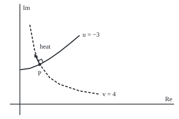

# Harmonic functions: the real and imaginary parts of a holomorphic function both solve Laplace's equation, and their level curves cross at right angles

[Syllabus](../../../SYLLABUS.md) → [Complex analysis](../README.md) → [Conformal Maps and Harmonic Functions](../README.md#s07) → Harmonic functions

---

## General Overview

A thin steel plate is heated along its east and west edges and cooled along its north and south edges until nothing changes. Measure position in decimetres from the centre and temperature in degrees above the centre's. The steady temperature at x across and y up is x^2 − y^2. At P = (1, 2) it reads −3.

Curves of equal temperature are **isotherms**. Heat runs from hot to cold along a second family, the **flow lines**: here the curves where 2xy is constant. Every flow line crosses every isotherm at a right angle.

With z = x + iy, the square z^2 is (x^2 − y^2) + i(2xy): temperature is its real part, flow its imaginary part. A settled temperature obeys one balance rule, Laplace's equation, and every holomorphic function hands over two solutions of it.

**The real and imaginary parts of a holomorphic function both satisfy Laplace's equation; a solution on a region without holes has a partner that makes it the real part of one; and wherever the derivative is not zero, the two families of level curves cross at right angles.**

**What kind of fact this is:** a theorem, proved on this card in Why it works; "harmonic" and "conjugate" are definitions, and reading them as heat is a model.

### The picture: one isotherm, one flow line

<p align="center"></p>

To scale: 40 units per decimetre, centre at (40, 210). Solid: the isotherm through P; dashed: the flow line through P; each through seven printed points. The corner marks the right angle; the arrow is the heat's direction.

---

## The formula

A subscript is a partial derivative: $u_x$ is how fast $u$ changes as x alone moves. Two subscripts do it twice: $u_{xx}$ is the rate of change of $u_x$. The sum of the two second rates is the **Laplacian**, written $\Delta$.

$$\Delta u = u_{xx} + u_{yy} = 0$$

**Read it aloud:** the bending of u eastward and its bending northward cancel at every point.

A real function with continuous second partials satisfying this on an open region is **harmonic**. A **harmonic conjugate** of $u$ is a real $v$ making $f = u + iv$ holomorphic; by the Cauchy-Riemann equations ([The complex derivative](../02-Holomorphic%20Functions/01-complex-derivative-and-cauchy-riemann.md)) that means

$$v_x = -u_y, \qquad v_y = u_x$$

**Read it aloud:** the partner's slopes are u's, swapped, one sign flipped.

Those slopes fix $v$ up to a constant. From an anchor $(a, 0)$ where $v$ is 0, walk east, then north:

$$v(x, y) = \int_a^x -u_y(s, 0)\,ds + \int_0^y u_x(x, s)\,ds$$

**Read it aloud:** add up the partner's slope along the bottom, then up the side.

The arrow of steepest rise is the **gradient**, $\nabla u = (u_x, u_y)$. The right angles are one dot product:

$$\nabla u \cdot \nabla v = u_x v_x + u_y v_y = u_x(-u_y) + u_y u_x = 0$$

| Symbol | Plain meaning | In our example | Push it up and the answer… |
| --- | --- | --- | --- |
| $x$, $y$, $z$ | across, up; z = x + iy | P = 1 + 2i | — |
| $u$ | temperature, real part of f | x^2 − y^2; −3 at P | — |
| $v$ | conjugate, imaginary part of f | 2xy; 4 at P | a constant changes nothing |
| $f$ | the holomorphic function u + iv | z^2 | — |
| $u_x$, $u_y$, $v_x$, $v_y$ | first partial derivatives | 2, −4, 4, 2 at P | — |
| $u_{xx}$, $u_{yy}$, $v_{xx}$, $v_{yy}$ | second partial derivatives | 2, −2, 0, 0 | sums stay 0 |
| $\Delta$, $\nabla$ | the Laplacian; the gradient, an arrow | 0; (2, −4) and (4, 2) at P | — |
| $a$, $s$, $r$ | anchor; running variable; distance from the wire | a = 0 or 1; r = 1, 0.5 | loop sum ignores r |

### When it holds

- **A holomorphic f.** x^2 + y^2 is no real part of one; it bends up both ways, Laplacian 4.
- **No holes, for one partner on the whole region.** Round the wire's point, log|z| is harmonic, yet the build gains 6.283185 per lap.
- **A nonzero derivative, for right angles.** At the centre $f'(0) = 0$, and the curves u = 0 (the diagonals) and v = 0 (the axes) meet at half a right angle.
- **Steady, source-free heat in a uniform plate.** Warming, an inside heater or varying conductivity adds terms. Laplace models steady potentials, not every flow.

---

## Why it works

### Step 0: Cauchy-Riemann, differentiated once more, is Laplace

The Cauchy-Riemann equations tie the slopes of u and v. Differentiated again, the mixed second partials cancel: that is the first half. Run backwards, Laplace's equation is what lets the partner's prescribed slopes fit into one function.

### Step 1: both parts are harmonic

A holomorphic f has holomorphic derivatives of every order ([Derivatives from the boundary](../03-Contour%20Integrals%20and%20Cauchy%27s%20Theorem/06-derivatives-from-the-boundary.md)), so u and v have continuous second partials and the mixed ones agree. Differentiate $u_x = v_y$ in x and $u_y = -v_x$ in y:

$$u_{xx} = v_{yx}, \qquad u_{yy} = -v_{xy}$$

Add: $u_{xx} + u_{yy} = v_{yx} - v_{xy} = 0$. The same move on v gives $v_{xx} + v_{yy} = -u_{yx} + u_{xy} = 0$.

On the plate, $u_{xx} = 2$ and $u_{yy} = -2$: up eastward as much as down northward. For v = 2xy both are 0.

### Step 2: build the partner from u alone

The recipe fixes v's slopes: eastward $-u_y$, northward $u_x$. Two walks to one point must give one value, which needs no twist: the northward slope's eastward rate equals the eastward slope's northward rate,

$$(u_x)_x = (-u_y)_y, \quad\text{that is}\quad u_{xx} + u_{yy} = 0$$

Laplace's equation is the no-twist condition. On the plate from the anchor 0: along the bottom $-u_y = 0$, then up at x = 1, $u_x = 2$ for 2 decimetres: v(1, 2) = 4. Up first, then across, gives 0 + 4 = 4. Both match 2xy. The same walk run on v gives 3 at P, which is −u: the partner of v is −u, since v − iu = −iz^2.

<details>
<summary>Detailed proof: the built v has the right slopes</summary>

On an open rectangle in the region containing the anchor $(a, 0)$, define v by the walk formula. Then $v_y = u_x(x, y)$ at once.

For $v_x$, differentiate under the integral sign, allowed by the continuous second partials:
$v_x = -u_y(x, 0) + \int_0^y u_{xx}(x, s)\,ds$.
Replace $u_{xx}$ by $-u_{yy}$, which is Laplace's equation, and integrate: $\int_0^y -u_{yy}(x, s)\,ds = -u_y(x, y) + u_y(x, 0)$. So $v_x = -u_y(x, y)$.

So u + iv satisfies Cauchy-Riemann with continuous partials: holomorphic on the rectangle. Without holes the rectangles glue: $u_x - iu_y$ is holomorphic there, has an antiderivative F by [Antiderivatives](../03-Contour%20Integrals%20and%20Cauchy%27s%20Theorem/02-antiderivatives-and-path-independence.md). Re F has u's gradient, so on a connected region it is u plus a constant, and Im F is one global v. Two partners differ by a constant, since their gradients agree.

</details>

### Step 3: level curves cross at right angles

A level curve of u runs perpendicular to $\nabla u$, since u does not change along it. At P, $\nabla u = (2, -4)$ and $\nabla v = (4, 2)$, dot product 8 − 8 = 0; at (−1.5, 0.5) they are (−3, −1) and (1, −3), again 0. Perpendicular gradients mean perpendicular level curves.

Heat moves along $-\nabla u$, which is perpendicular to $\nabla v$: heat moves along level curves of v. Isotherms are level curves of u, flow lines level curves of v.

### Step 4: why steady heat obeys Laplace

Fourier's law: heat flows at k times $-\nabla u$, k the conductivity. Steady and heater-free, every small square loses as much heat as it gains; summing the flow across its four sides gives $k(u_{xx} + u_{yy}) = 0$.

### Step 5: the hot wire has no single partner

A hot wire through the centre gives a steady temperature c − m log|z|, |z| the distance from the wire, c and m constants. Take u = log|z|, the wire's point removed. At (2, 1) its Laplacian is 0.

On the east half, building v from the anchor (1, 0) gives v(2, 1) = 0.463648, the angle of 2 + i: the partner is arg z. Walk once round the wire adding the partner's slopes. A single-valued v would give 0. The sum is 6.283185 on circles of radius 1 and 0.5, and 0 on a circle missing the wire.

Residues give it another way ([Residues](../05-Laurent%20Series%2C%20Singularities%20and%20Residues/04-residues.md)): $u_x - iu_y = 1/z$ has residue 1 and loop integral $2\pi i$, whose imaginary part is the loop sum, 6.283185. For the temperature c − log|z| it is also the wire's heat output per unit conductivity. That jump is the branch cut of [The complex logarithm](../02-Holomorphic%20Functions/04-complex-logarithm.md), seen from the real side.

A second route to the right angles: f sends isotherms to vertical lines and flow lines to horizontal ones, and where $f'$ is not 0 it keeps angles ([Conformal maps](01-conformal-maps.md)).

---

## Worked numbers, by hand

| Step | Arithmetic | Value |
| --- | --- | --- |
| temperature at P | 1^2 − 2^2 | −3 |
| second partials of u | u_xx = 2, u_yy = −2 | sum **0** |
| partner along the bottom | −u_y = 2y = 0 from x = 0 to 1 | 0 |
| partner up the side | u_x = 2x = 2 from y = 0 to 2 | 4 |
| v(1, 2) | 0 + 4, and 2 × 1 × 2 | **4** |
| gradients at P | (2x, −2y) and (2y, 2x) | (2, −4) and (4, 2) |
| dot product | 2 × 4 + (−4) × 2 | **0**, a right angle |
| loop round the wire | 2π times residue 1 | **6.283185** |

### What breaks if you drop a piece

| Mistake | Comes out at | What went wrong |
| --- | --- | --- |
| Taking x^2 + y^2 as a temperature | Laplacian 2 + 2 = 4 | \|z\|^2 is no holomorphic real part |
| Sign slip, v = −2xy | u_x = 2 against v_y = −2 at P | u − 2ixy is z-bar squared, not holomorphic |
| One partner for log\|z\| round the wire | gains 6.283185 per lap | the wire's point is a hole |

The code prints all three.

---

## Code, from first principles, and it actually runs

Road one starts from u alone: finite-difference partials, the partner built by its own Simpson integrator along two walks, and loop sums round circles. Road two is the closed form: 2xy and −u, second derivatives 2 and −2, and 2π times a residue estimated as z times $u_x - iu_y$. Four asserts compare the roads.

### Python

```python
# Harmonic functions and conjugates -- the check behind the card.  Standard library only.
# Road one works from the temperature u alone: finite differences, Simpson sums, loop sums.
# Road two is the closed form: v = 2xy, second derivatives 2 and -2, 2 pi times a residue.
import math
f6 = lambda a: f"{round(a, 6) + 0.0:.6f}"    # six decimals, no -0.000000

def d1(f, x, y, e=1e-5):                     # u_x, u_y by central differences
    return (f(x + e, y) - f(x - e, y)) / (2 * e), (f(x, y + e) - f(x, y - e)) / (2 * e)

def d2(f, x, y, e=1e-3):                     # u_xx, u_yy by second differences
    return ((f(x + e, y) - 2 * f(x, y) + f(x - e, y)) / e ** 2,
            (f(x, y + e) - 2 * f(x, y) + f(x, y - e)) / e ** 2)

def simpson(g, a, b, n=100):                 # our own integrator
    h = (b - a) / n
    return h / 3 * (g(a) + g(b) + sum((4 if k % 2 else 2) * g(a + k * h) for k in range(1, n)))

def conjugate(f, a, x, y, across_first):     # v from u alone: v_x = -u_y, v_y = u_x, v(a, 0) = 0
    if across_first:
        return simpson(lambda s: -d1(f, s, 0)[1], a, x) + simpson(lambda s: d1(f, x, s)[0], 0, y)
    return simpson(lambda s: d1(f, a, s)[0], 0, y) + simpson(lambda s: -d1(f, s, y)[1], a, x)

def loop(f, cx, r, n=400):                   # loop sum of the partner's slope (-u_y, u_x) round a circle
    ts = [2 * math.pi * k / n for k in range(n)]
    return sum(sum(p * q for p, q in zip(d1(f, cx + r * math.cos(t), r * math.sin(t)),
               (r * math.cos(t), r * math.sin(t)))) * 2 * math.pi / n for t in ts)
u, v = lambda x, y: x * x - y * y, lambda x, y: 2 * x * y      # the plate's temperature, its partner
wire = lambda x, y: 0.5 * math.log(x * x + y * y)              # log|z|
print(f"plate at P = (1, 2): temperature u = {f6(u(1, 2))}, partner v = 2xy = {f6(v(1, 2))}")
(uxx, uyy), (vxx, vyy) = d2(u, 1, 2), d2(v, 1, 2)
print(f"Laplacian of u at P: u_xx {f6(uxx)} + u_yy {f6(uyy)} = {f6(uxx + uyy)}")
print(f"Laplacian of v at P: v_xx {f6(vxx)} + v_yy {f6(vyy)} = {f6(vxx + vyy)}")
va, vb, vv = conjugate(u, 0, 1, 2, True), conjugate(u, 0, 1, 2, False), conjugate(v, 0, 1, 2, True)
print(f"v built from u alone, across then up: {f6(va)}; up then across: {f6(vb)}; partner of v itself: {f6(vv)}")
dots = []
for x, y in ((1, 2), (-1.5, 0.5)):
    (ux, uy), (vx, vy) = d1(u, x, y), d1(v, x, y)
    dots.append(ux * vx + uy * vy)
    turn = math.degrees(math.atan2(vy, vx) - math.atan2(uy, ux))
    print(f"at ({x}, {y}): grad u ({f6(ux)}, {f6(uy)}), grad v ({f6(vx)}, {f6(vy)}); dot {f6(dots[-1])}; turn {f6(turn)} deg")
(wxx, wyy), vw = d2(wire, 2, 1), conjugate(wire, 1, 2, 1, True)
print(f"hot wire, log|z| at (2, 1): Laplacian {f6(wxx + wyy)}; v built from anchor (1, 0): {f6(vw)}; atan2(1, 2) = {f6(math.atan2(1, 2))}")
loops = [loop(wire, 0, 1), loop(wire, 0, 0.5), loop(wire, 3, 1)]
print(f"loop sum of the partner's slope round the wire, radius 1: {f6(loops[0])}; radius 0.5: {f6(loops[1])}")
print(f"loop sum round a circle missing the wire (centre 3, radius 1): {f6(loops[2])}")
res = [z * complex(d1(wire, z, 0)[0], -d1(wire, z, 0)[1]) for z in (0.5, 0.1)]   # z (u_x - i u_y)
print(f"residue road: z (u_x - i u_y) at z = 0.5: {f6(res[0].real)}, at z = 0.1: {f6(res[1].real)}; 2 pi x residue = {f6(2 * math.pi * res[1].real)}")
sxx, syy = d2(lambda x, y: x * x + y * y, 1, 2)
bx, by = d1(u, 1, 2)[0], d1(lambda x, y: -2 * x * y, 1, 2)[1]
print(f"mistake 1, |z|^2 = x^2 + y^2 at P: Laplacian {f6(sxx)} + {f6(syy)} = {f6(sxx + syy)}")
print(f"mistake 2, sign slip v = -2xy at P: u_x {f6(bx)} against v_y {f6(by)}")
fig = lambda x, y: f"({40 + 40 * x:.1f},{210 - 40 * y:.1f})"
print("figure, 40 units per 1, 0 at (40,210): P " + fig(1, 2) + "; heat arrow tip " + fig(1 - 0.6 / math.sqrt(5), 2 + 1.2 / math.sqrt(5)))
print("figure, isotherm u = -3: " + " ".join(fig(x / 2, math.sqrt(x * x / 4 + 3)) for x in range(7)))
print("figure, flow line v = 4: " + " ".join(fig(x, 2 / x) for x in (0.5, 0.75, 1, 1.5, 2, 3, 4)))
assert abs(uxx - 2) < 1e-6 and abs(uyy + 2) < 1e-6              # second differences meet 2 and -2 by hand
assert all(abs(a - b) < 1e-9 for a, b in ((va, 4), (vb, 4), (vv, -u(1, 2)), (vw, math.atan2(1, 2))))  # built = closed form
assert all(abs(d) < 1e-8 for d in dots)                          # gradients perpendicular
assert all(abs(s - 2 * math.pi * res[1].real) < 1e-6 for s in loops[:2]) and abs(loops[2]) < 1e-8
print("ALL CHECKS PASS")
```

**Ran 2026-09-28 on macOS, Python 3.14.6, standard library only. All checks passed. Output, pasted from the run:**

```
plate at P = (1, 2): temperature u = -3.000000, partner v = 2xy = 4.000000
Laplacian of u at P: u_xx 2.000000 + u_yy -2.000000 = 0.000000
Laplacian of v at P: v_xx 0.000000 + v_yy 0.000000 = 0.000000
v built from u alone, across then up: 4.000000; up then across: 4.000000; partner of v itself: 3.000000
at (1, 2): grad u (2.000000, -4.000000), grad v (4.000000, 2.000000); dot 0.000000; turn 90.000000 deg
at (-1.5, 0.5): grad u (-3.000000, -1.000000), grad v (1.000000, -3.000000); dot 0.000000; turn 90.000000 deg
hot wire, log|z| at (2, 1): Laplacian 0.000000; v built from anchor (1, 0): 0.463648; atan2(1, 2) = 0.463648
loop sum of the partner's slope round the wire, radius 1: 6.283185; radius 0.5: 6.283185
loop sum round a circle missing the wire (centre 3, radius 1): 0.000000
residue road: z (u_x - i u_y) at z = 0.5: 1.000000, at z = 0.1: 1.000000; 2 pi x residue = 6.283185
mistake 1, |z|^2 = x^2 + y^2 at P: Laplacian 2.000000 + 2.000000 = 4.000000
mistake 2, sign slip v = -2xy at P: u_x 2.000000 against v_y -2.000000
figure, 40 units per 1, 0 at (40,210): P (80.0,130.0); heat arrow tip (69.3,108.5)
figure, isotherm u = -3: (40.0,140.7) (60.0,137.9) (80.0,130.0) (100.0,118.3) (120.0,104.2) (140.0,88.3) (160.0,71.4)
figure, flow line v = 4: (60.0,50.0) (70.0,103.3) (80.0,130.0) (100.0,156.7) (120.0,170.0) (160.0,183.3) (200.0,190.0)
ALL CHECKS PASS
```

### Rust

Same numbers, same labels, built with `rustc --edition 2021 -O`.

```rust
// Harmonic functions and conjugates -- the same check as the Python, in Rust.  No crates.
// Road one works from the temperature u alone: finite differences, Simpson sums, loop sums.
// Road two is the closed form: v = 2xy, second derivatives 2 and -2, 2 pi times a residue.
use std::f64::consts::PI;
type F = fn(f64, f64) -> f64;
fn f6(a: f64) -> String { let s = format!("{:.6}", a); if s == "-0.000000" { "0.000000".into() } else { s } }
fn d1(f: F, x: f64, y: f64) -> (f64, f64) { // u_x, u_y by central differences
    let e = 1e-5;
    ((f(x + e, y) - f(x - e, y)) / (2.0 * e), (f(x, y + e) - f(x, y - e)) / (2.0 * e))
}
fn d2(f: F, x: f64, y: f64) -> (f64, f64) { // u_xx, u_yy by second differences
    let e = 1e-3;
    ((f(x + e, y) - 2.0 * f(x, y) + f(x - e, y)) / (e * e), (f(x, y + e) - 2.0 * f(x, y) + f(x, y - e)) / (e * e))
}
fn simpson(g: &dyn Fn(f64) -> f64, a: f64, b: f64) -> f64 { // our own integrator
    let (n, h) = (100, (b - a) / 100.0);
    let mid: f64 = (1..n).map(|k| (if k % 2 == 1 { 4.0 } else { 2.0 }) * g(a + k as f64 * h)).sum();
    h / 3.0 * (g(a) + g(b) + mid)
}
fn conjugate(f: F, a: f64, x: f64, y: f64, across_first: bool) -> f64 { // v_x = -u_y, v_y = u_x, v(a, 0) = 0
    if across_first {
        simpson(&|s| -d1(f, s, 0.0).1, a, x) + simpson(&|s| d1(f, x, s).0, 0.0, y)
    } else {
        simpson(&|s| d1(f, a, s).0, 0.0, y) + simpson(&|s| -d1(f, s, y).1, a, x)
    }
}
fn lp(f: F, cx: f64, r: f64) -> f64 { // loop sum of the partner's slope (-u_y, u_x) round a circle
    let n = 400;
    (0..n).map(|k| {
        let t = 2.0 * PI * k as f64 / n as f64;
        let (ux, uy) = d1(f, cx + r * t.cos(), r * t.sin());
        (ux * r * t.cos() + uy * r * t.sin()) * 2.0 * PI / n as f64
    }).sum()
}
fn u(x: f64, y: f64) -> f64 { x * x - y * y } // the plate's temperature
fn v(x: f64, y: f64) -> f64 { 2.0 * x * y } // its partner
fn wire(x: f64, y: f64) -> f64 { 0.5 * (x * x + y * y).ln() } // log|z|
fn fig(x: f64, y: f64) -> String { format!("({:.1},{:.1})", 40.0 + 40.0 * x, 210.0 - 40.0 * y) }

fn main() {
    println!("plate at P = (1, 2): temperature u = {}, partner v = 2xy = {}", f6(u(1.0, 2.0)), f6(v(1.0, 2.0)));
    let ((uxx, uyy), (vxx, vyy)) = (d2(u, 1.0, 2.0), d2(v, 1.0, 2.0));
    println!("Laplacian of u at P: u_xx {} + u_yy {} = {}", f6(uxx), f6(uyy), f6(uxx + uyy));
    println!("Laplacian of v at P: v_xx {} + v_yy {} = {}", f6(vxx), f6(vyy), f6(vxx + vyy));
    let (va, vb, vv) = (conjugate(u, 0.0, 1.0, 2.0, true), conjugate(u, 0.0, 1.0, 2.0, false), conjugate(v, 0.0, 1.0, 2.0, true));
    println!("v built from u alone, across then up: {}; up then across: {}; partner of v itself: {}", f6(va), f6(vb), f6(vv));
    let mut dots = Vec::new();
    for (x, y) in [(1.0_f64, 2.0_f64), (-1.5, 0.5)] {
        let ((ux, uy), (vx, vy)) = (d1(u, x, y), d1(v, x, y));
        dots.push(ux * vx + uy * vy);
        let turn = (vy.atan2(vx) - uy.atan2(ux)).to_degrees();
        println!("at ({}, {}): grad u ({}, {}), grad v ({}, {}); dot {}; turn {} deg", x, y, f6(ux), f6(uy), f6(vx), f6(vy), f6(dots[dots.len() - 1]), f6(turn));
    }
    let ((wxx, wyy), vw) = (d2(wire, 2.0, 1.0), conjugate(wire, 1.0, 2.0, 1.0, true));
    println!("hot wire, log|z| at (2, 1): Laplacian {}; v built from anchor (1, 0): {}; atan2(1, 2) = {}", f6(wxx + wyy), f6(vw), f6(1.0_f64.atan2(2.0)));
    let loops = [lp(wire, 0.0, 1.0), lp(wire, 0.0, 0.5), lp(wire, 3.0, 1.0)];
    println!("loop sum of the partner's slope round the wire, radius 1: {}; radius 0.5: {}", f6(loops[0]), f6(loops[1]));
    println!("loop sum round a circle missing the wire (centre 3, radius 1): {}", f6(loops[2]));
    let res: Vec<f64> = [0.5, 0.1].iter().map(|&z| z * d1(wire, z, 0.0).0).collect(); // real part of z (u_x - i u_y)
    println!("residue road: z (u_x - i u_y) at z = 0.5: {}, at z = 0.1: {}; 2 pi x residue = {}", f6(res[0]), f6(res[1]), f6(2.0 * PI * res[1]));
    let (sxx, syy) = d2(|x, y| x * x + y * y, 1.0, 2.0);
    let (bx, by) = (d1(u, 1.0, 2.0).0, d1(|x, y| -2.0 * x * y, 1.0, 2.0).1);
    println!("mistake 1, |z|^2 = x^2 + y^2 at P: Laplacian {} + {} = {}", f6(sxx), f6(syy), f6(sxx + syy));
    println!("mistake 2, sign slip v = -2xy at P: u_x {} against v_y {}", f6(bx), f6(by));
    println!("figure, 40 units per 1, 0 at (40,210): P {}; heat arrow tip {}", fig(1.0, 2.0), fig(1.0 - 0.6 / 5f64.sqrt(), 2.0 + 1.2 / 5f64.sqrt()));
    let iso: Vec<String> = (0..7).map(|k| { let x = k as f64 / 2.0; fig(x, (x * x + 3.0).sqrt()) }).collect();
    println!("figure, isotherm u = -3: {}", iso.join(" "));
    let flow: Vec<String> = [0.5, 0.75, 1.0, 1.5, 2.0, 3.0, 4.0].iter().map(|&x| fig(x, 2.0 / x)).collect();
    println!("figure, flow line v = 4: {}", flow.join(" "));
    assert!((uxx - 2.0).abs() < 1e-6 && (uyy + 2.0).abs() < 1e-6); // second differences meet 2 and -2 by hand
    assert!([(va, 4.0), (vb, 4.0), (vv, -u(1.0, 2.0)), (vw, 1.0_f64.atan2(2.0))].iter().all(|(a, b)| (a - b).abs() < 1e-9)); // built = closed form
    assert!(dots.iter().all(|d| d.abs() < 1e-8)); // gradients perpendicular
    assert!(loops[..2].iter().all(|s| (s - 2.0 * PI * res[1]).abs() < 1e-6) && loops[2].abs() < 1e-8);
    println!("ALL CHECKS PASS");
}
```

**Ran 2026-09-28 on macOS, rustc 1.98.1, no crates. All checks passed. Output, pasted from the run:**

```
plate at P = (1, 2): temperature u = -3.000000, partner v = 2xy = 4.000000
Laplacian of u at P: u_xx 2.000000 + u_yy -2.000000 = 0.000000
Laplacian of v at P: v_xx 0.000000 + v_yy 0.000000 = 0.000000
v built from u alone, across then up: 4.000000; up then across: 4.000000; partner of v itself: 3.000000
at (1, 2): grad u (2.000000, -4.000000), grad v (4.000000, 2.000000); dot 0.000000; turn 90.000000 deg
at (-1.5, 0.5): grad u (-3.000000, -1.000000), grad v (1.000000, -3.000000); dot 0.000000; turn 90.000000 deg
hot wire, log|z| at (2, 1): Laplacian 0.000000; v built from anchor (1, 0): 0.463648; atan2(1, 2) = 0.463648
loop sum of the partner's slope round the wire, radius 1: 6.283185; radius 0.5: 6.283185
loop sum round a circle missing the wire (centre 3, radius 1): 0.000000
residue road: z (u_x - i u_y) at z = 0.5: 1.000000, at z = 0.1: 1.000000; 2 pi x residue = 6.283185
mistake 1, |z|^2 = x^2 + y^2 at P: Laplacian 2.000000 + 2.000000 = 4.000000
mistake 2, sign slip v = -2xy at P: u_x 2.000000 against v_y -2.000000
figure, 40 units per 1, 0 at (40,210): P (80.0,130.0); heat arrow tip (69.3,108.5)
figure, isotherm u = -3: (40.0,140.7) (60.0,137.9) (80.0,130.0) (100.0,118.3) (120.0,104.2) (140.0,88.3) (160.0,71.4)
figure, flow line v = 4: (60.0,50.0) (70.0,103.3) (80.0,130.0) (100.0,156.7) (120.0,170.0) (160.0,183.3) (200.0,190.0)
ALL CHECKS PASS
```

The two outputs match line for line.

> [!TIP]
> **Try changing**
> Guess first, then run it.
> - **Cube, not square.** Make `u` return `x ** 3 - 3 * x * y * y`, the real part of z^3. The Laplacian prints 0.000000 from 6.000000 and −6.000000, the partner −2.000000, and the first assert, pinned to 2 and −2, stops the run.
> - **Move the far circle over the wire.** Change `loop(wire, 3, 1)` to `loop(wire, 0.5, 1)`. It now encloses the wire, the line still labelled "centre 3" prints 6.283185, and the last assert stops it.
> - **Shrink the loop.** Change `loop(wire, 0, 0.5)` to `loop(wire, 0, 0.1)`. Still 6.283185; every assert passes.

---

## The usual mistake

> [!warning]
> **Assuming every harmonic function has one partner everywhere.** Laplace guarantees a partner near each point, and on a whole region only without holes. Round the wire, the would-be partner of log|z| is the angle, gaining 6.283185 per lap.
>
> - **Any two harmonic functions as a pair.** x^2 − y^2 and −2xy are both harmonic, but u_x = 2 against v_y = −2.
> - **Any smooth temperature as harmonic.** x^2 + y^2 has Laplacian 4: that plate is heated from inside.
> - **Right angles everywhere.** Where $f'$ is 0, as at the centre, level curves can meet at other angles.

---

## Where you meet it in real life

- **Heat in plates and walls.** Isotherms and flow lines of a steady slab are one holomorphic function's two families.
- **Electrostatics.** Voltage in a charge-free region is harmonic; field lines are the partner's level curves.
- **Signal processing.** The partner of a signal's real part on the boundary is its Hilbert transform: The Hilbert transform.

> **Say it back**
> A harmonic function's two second rates cancel: u_xx + u_yy = 0. Both parts of a holomorphic function are harmonic, because Cauchy-Riemann differentiated again cancels. From a harmonic u, the partner v is built by adding the prescribed slopes, and without holes every walk agrees. The gradients are perpendicular, so isotherms and flow lines cross at right angles. Round a hot wire, log|z| has no single partner: the angle gains 2π per lap.

---

## What this builds on

- [Derivatives from the boundary](../03-Contour%20Integrals%20and%20Cauchy%27s%20Theorem/06-derivatives-from-the-boundary.md): derivatives of every order, so second partials exist.
- [Antiderivatives](../03-Contour%20Integrals%20and%20Cauchy%27s%20Theorem/02-antiderivatives-and-path-independence.md): why every walk agrees without holes.
- [Partial derivatives](../../06-Calculus%20and%20analysis/07-Several%20Variables/01-partial-derivatives.md): the rates u_x and u_xx, and the gradient.

## Where this goes next

- [Mean value and maximum principle](05-mean-value-and-maximum-principle-for-harmonic-functions.md): circle averages, and no hot spot inside a steady plate.
- Harmonic functions: Laplace in any dimension, with no complex partner.
- The Hilbert transform: the conjugate taken on a line, as a transform of signals.

Here the holomorphic function came first; how the plate's edges alone fix the temperature inside begins with the circle averages of [Mean value and maximum principle](05-mean-value-and-maximum-principle-for-harmonic-functions.md).

---

## Sources

Verified 28 Sep 2026: every link below resolves to the publisher's page.

- Stein, Elias M., and Rami Shakarchi. *Complex Analysis*. Princeton University Press, 2003. [Publisher page](https://press.princeton.edu/books/hardcover/9780691113852/complex-analysis). Harmonic real parts and the boundary problems they solve.
- Lebl, Jiří. *Guide to Cultivating Complex Analysis*. [Author's page and free text](https://www.jirka.org/ca/). Proves local and global conjugates.
- Axler, Sheldon, Paul Bourdon, and Wade Ramey. *Harmonic Function Theory*, 2nd ed. Springer, 2001. [Authors' page and free text](https://axler.net/HFT.html). Harmonic functions beyond the plane.
