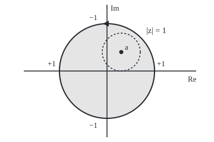
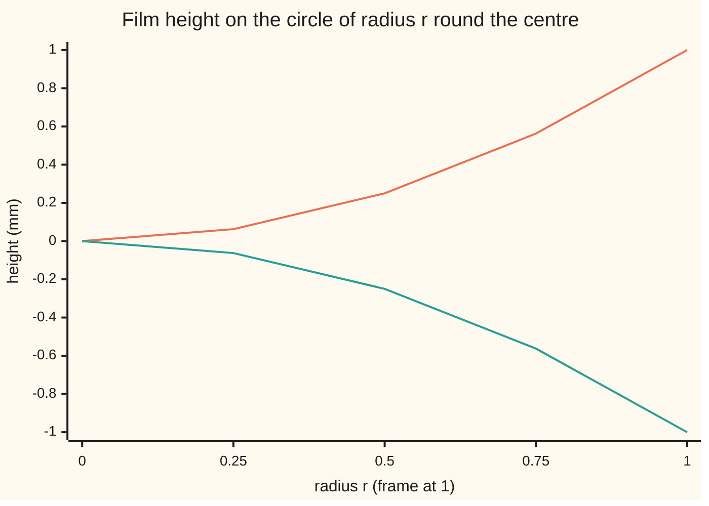

# Mean value and maximum principle: a harmonic function at a centre is the average round the circle, so its extremes sit on the boundary and the boundary fixes everything

[Syllabus](../../../SYLLABUS.md) → [Complex analysis](../../../SYLLABUS.md#w07) → [Conformal Maps and Harmonic Functions](../../../SYLLABUS.md#w07-s07) → Mean value and maximum principle

---

## General Overview

A round wire frame of radius 10 cm is bent to rise 1 mm at east and west and dip 1 mm at north and south. Dipped in soapy water, it holds a film. Measure positions in units of the radius, so the frame is the circle |z| = 1, and heights in millimetres. The frame's height at angle θ is cos 2θ.

The film settles into a saddle of height x^2 − y^2. At the centre it is 0, and on every circle round the centre its heights average to exactly 0. Nowhere inside does it pass 1 or −1. No other film fits that frame.

Write u(x, y) for the film's height. For a gently sloped film, surface tension makes the two second slopes cancel: u_xx + u_yy = 0, Laplace's equation, where u_xx and u_yy are the second partial derivatives in x and in y. A function obeying it is **harmonic** ([Harmonic functions](04-harmonic-functions-and-conjugates.md)). From here on the film is the harmonic function u = x^2 − y^2 on the unit disk.

**A harmonic function's value at any point is its average round any circle centred there, so it can have no peak or pit inside a region; its highest and lowest values sit on the boundary, and two harmonic functions that agree on the whole boundary agree everywhere inside.**

**What kind of fact this is:** a theorem, proved on this card in Why it works; it proves that the frame allows at most one film, and the film's construction is on the Poisson card.

### The picture: the frame, one point inside, one circle round it

<p align="center"></p>

To scale: 80 units per 1, centre 0 at (180, 120), frame radius 80; a = 0.3 + 0.4i at (204, 88), its dashed circle of radius 0.4 drawn at radius 32. The labels +1 and −1 are frame heights in millimetres.

---

## The formula

Notation first, in words. A point on the circle of radius r round a is $a + re^{i\theta}$, with θ its angle ([Euler's formula](../01-Complex%20Numbers%20and%20the%20Plane/04-eulers-formula.md)). The region is $D$ and its boundary, the frame, is $\partial D$, read "the boundary of D".

$$u(a) = \frac{1}{2\pi}\int_0^{2\pi} u(a + re^{i\theta})\,d\theta$$

**Read it aloud:** the value at the centre is the average of the values round the circle.

$$\min_{\partial D} u \;\le\; u(z) \;\le\; \max_{\partial D} u \quad\text{for every } z \text{ in } D$$

**Read it aloud:** inside the region the function stays between its lowest and highest boundary values.

$$u_1 = u_2 \text{ on } \partial D \;\Longrightarrow\; u_1 = u_2 \text{ on all of } D$$

**Read it aloud:** harmonic functions that agree on the whole boundary agree inside. Finding the harmonic function with given boundary values is the **Dirichlet problem**: it has at most one answer.

| Symbol | Plain meaning | In our example | Push it up and the answer… |
| --- | --- | --- | --- |
| $u$ | the harmonic function: film height | x^2 − y^2, in mm | — |
| $\Delta u$ | the Laplacian u_xx + u_yy: net bending | 0; −6 for a pushed sheet | below 0 allows a bump |
| $F$, $v$ | holomorphic partner F = u + iv; v the conjugate | z^2; 2xy | — |
| $a$ | the circle's centre | 0, then 0.3 + 0.4i | the average follows u(a) |
| $r$, $\theta$ | radius; angle in radians | 0.25 to 1; 0.4 round a | no change while the disk fits |
| $D$, $\partial D$ | the region; its boundary | unit disk; the frame | — |
| $M$ | the largest value u reaches | 1, on the frame | the inside range follows |
| $u_1$, $u_2$, $h$, $\varepsilon$ | two harmonic functions; their difference; its bound on the frame | two films, h = 0 | h stays within ε inside |

### When it holds

- **u harmonic in the region.** Drop it and the centre escapes: the sheet x^2 − y^2 + 1.5(1 − x^2 − y^2) has the same frame but stands at 1.5 in the middle.
- **The whole closed disk inside the region, for the average.** ln|z| is harmonic except at 0; on the circle of radius 1 round 0.5, which encloses 0, it averages 0, not ln 0.5 = −0.693147.
- **A bounded region, u continuous up to its edge.** On the half-plane x > 0, the harmonic functions 0 and x are both 0 on the edge, yet give 0 and 1 at z = 1.

---

## Why it works

### Step 0: a harmonic function is the real part of a holomorphic one

Holomorphic functions equal their average round a circle ([Cauchy's integral formula](../03-Contour%20Integrals%20and%20Cauchy%27s%20Theorem/05-cauchys-integral-formula.md)). On a disk, every harmonic u is the real part of a holomorphic F. The real part of an average is the average of the real parts. The rest follows.

### Step 1: the mean value property

Take a circle round a whose closed disk lies inside the region. A slightly larger disk also fits, and on it u has a conjugate v, making F = u + iv holomorphic. Cauchy's formula on the circle gives:

$$F(a) = \frac{1}{2\pi}\int_0^{2\pi} F(a + re^{i\theta})\,d\theta$$

Take real parts of both sides. The left is u(a), the right is the average of u. That is the formula.

On the film, F = z^2, and at a = 0.3 + 0.4i, F(a) = a^2 = −0.07 + 0.24i; Cauchy's loop sum, 64 points round the frame, prints the same. Its real part, −0.07, is the film's height at a and the average of u on the dashed circle.

By hand at the centre: on the circle of radius r round 0, u = r^2(cos^2 θ − sin^2 θ) = r^2 cos 2θ, which averages to 0 = u(0) over a full turn.

### Step 2: no peak or pit inside

Suppose u reaches its largest value M at an inside point a. Values on a small circle round a are at most M and average to M, so every one is M: u = M on a whole disk round a.

That spreads. Every point where u = M has a small disk round it where u = M; a set with that property is called **open**. Where u < M is open too, by continuity. A region in one piece, called **connected**, cannot split into two open parts, so u = M throughout. A harmonic function with an inside maximum is constant; applied to −u, likewise a minimum. This is the **strong maximum principle**.

<details>
<summary>Detailed proof: the average forces equality, and equality spreads</summary>

Let g(θ) = M − u(a + re^{iθ}), continuous and never negative; by Step 1 its integral over a full turn is 2π(M − u(a)) = 0. If g(θ₀) = c > 0, continuity gives an interval of length δ > 0 round θ₀ where g > c/2, so the integral is at least cδ/2 > 0, a contradiction. So g = 0 for every radius r whose closed disk fits in D.

Let S be the set where u = M. It contains a, and it is open, by the paragraph above applied at each of its points. Its complement in D, where u < M, is open by continuity. A connected D is not two disjoint non-empty open sets, so the complement is empty.

</details>

### Step 3: the extremes sit on the frame

Let D be bounded and u continuous up to its edge. A continuous function on a closed bounded set reaches a largest value. If that point is inside, Step 2 makes u constant, so the frame reaches it too. Either way the frame holds the largest value, and likewise the smallest: the second formula, the **weak maximum principle**. On the film, the circle of radius r carries u = r^2 cos 2θ, ranging from −r^2 to r^2.



Upper line: highest height on each circle, r^2. Lower line: lowest, −r^2.

### Step 4: the frame fixes the film

Let u_1 and u_2 be harmonic in bounded D, continuous up to the edge, and equal on the whole frame. Their difference h = u_1 − u_2 is harmonic, since Laplace's equation is linear, and 0 on the frame. By Step 3, h lies between 0 and 0 inside. So the two films are one. If instead two frames differ by at most ε, h stays within ε inside: a small frame error stays small.

The code checks this on a grid of step 0.1, replacing each inside node, over and over, by its four neighbours' average: the mean value property on a grid. Started from all zeros and from all fives, both runs settle on x^2 − y^2 at every node, the highest inside node at 0.81. Four-neighbour averaging is exact for this film: with grid step s, (x + s)^2 + (x − s)^2 = 2x^2 + 2s^2, and the y terms remove the same 2s^2.

A second road needs no complex numbers: by Green's theorem the average's rate of change in r is the integral of Δu over the disk divided by 2πr, which is 0; as r shrinks to 0 the average tends to u(a), so it equals u(a) at every radius. That road works in any dimension; Harnack and regularity takes it further.

---

## Worked numbers, by hand

| Step | Arithmetic | Value |
| --- | --- | --- |
| centre height | 0^2 − 0^2 | 0 |
| average round 0, any radius | r^2 × average of cos 2θ | 0 |
| height at a = 0.3 + 0.4i | 0.09 − 0.16 | **−0.07** |
| Cauchy at a | a^2 = 0.09 − 0.16 + 2 × 0.3 × 0.4 i | −0.07 + 0.24i |
| highest on circle r = 0.5 | 0.5^2 | 0.25 |
| highest on the frame | 1^2 | **1** |
| two films on one frame | difference 0 on the frame, so 0 inside | **0** |

The frame alone fixes the film, and nothing inside rises above the frame's 1 mm.

### What breaks if you drop a piece

| Mistake | Comes out at | What went wrong |
| --- | --- | --- |
| Sheet pushed from below, same frame | centre 1.5, above the frame's 1; rim average 0 | Δu = −6: not harmonic, so no mean value |
| Half-plane x > 0, films 0 and x | 0 and 1 at z = 1, same edge values | The region is unbounded |
| ln\|z\| round 0.5, radius 1 | average 0, not −0.693147 | The disk contains 0, where ln\|z\| is not harmonic |

---

## Code, from first principles, and it actually runs

Four roads: the closed form x^2 − y^2; averages of u at 64 points round circles; Cauchy's loop sum for F = z^2 against a^2; and a grid film grown by neighbour averaging from two starts.

### Python

```python
# Mean value and maximum principle -- the check behind the card.  Standard
# library only.  The soap film u = x^2 - y^2 on the wire frame |z| = 1, whose
# frame height is cos(2 theta).  Road one: closed forms.  Road two: averages
# round circles, Cauchy's loop sum, and a grid film grown by neighbour averaging.
import math

def u(x, y): return x * x - y * y
def pushed(x, y): return u(x, y) + 1.5 * (1 - x * x - y * y)   # same frame, pushed from below
def lnmod(x, y): return 0.5 * math.log(x * x + y * y)           # ln|z|, harmonic except at 0
def pt(r, k, n): return r * math.cos(2 * math.pi * k / n), r * math.sin(2 * math.pi * k / n)
def lap(g, h=0.1): return (g(h, 0) + g(-h, 0) + g(0, h) + g(0, -h) - 4 * g(0, 0)) / h ** 2   # net bending at 0
def fx(v): return f"{0.0 if abs(v) < 5e-7 else v:.6f}"          # six decimals, no -0.000000

def avg(g, cx, cy, r, n=64):               # plain average of g at n equal steps round a circle
    return sum(g(cx + p[0], cy + p[1]) for p in (pt(r, k, n) for k in range(n))) / n

def cauchy(a, n=64):                       # (1/2 pi i) x loop sum of z^2/(z - a) dz round |z| = 1
    s = 0
    for k in range(n):
        z = complex(*pt(1, k, n))
        s += z * z / (z - a) * 1j * z * (2 * math.pi / n)
    return s / (2j * math.pi)

def ring(r, n=360):                        # highest and lowest film height on the circle |z| = r
    hs = [u(*pt(r, k, n)) for k in range(n)]
    return max(hs), min(hs)

def relax(start, N=10, sweeps=3000):       # grid film, step 1/N: each inside node -> its 4 neighbours' average
    inside = [(i, j) for i in range(-N, N + 1) for j in range(-N, N + 1) if i * i + j * j < N * N]
    g = {(i, j): u(i / N, j / N) for i in range(-N - 1, N + 2) for j in range(-N - 1, N + 2)}
    g.update({p: start for p in inside})
    for _ in range(sweeps):
        for i, j in inside:
            g[i, j] = (g[i + 1, j] + g[i - 1, j] + g[i, j + 1] + g[i, j - 1]) / 4
    frame = [g[q] for i, j in inside for q in ((i+1, j), (i-1, j), (i, j+1), (i, j-1)) if q not in set(inside)]
    return g, inside, frame

a = complex(0.3, 0.4)
print("figure, 1 unit = the 10 cm frame radius, heights in mm; 80 units per 1: centre (180, 120), frame radius 80, a = 0.3 + 0.4i at (204, 88), circle round a radius 32")
print(f"round 0, radii 0.25, 0.5, 1: averages {', '.join(fx(avg(u, 0, 0, r)) for r in (0.25, 0.5, 1))}; u(0) = {fx(u(0, 0))}")
print(f"a = 0.3 + 0.4i: u(a) = {fx(u(0.3, 0.4))}; average on radius 0.4 = {fx(avg(u, 0.3, 0.4, 0.4))}")
c = cauchy(a)
print(f"Cauchy loop sum of z^2/(z - a), 64 points = {fx(c.real)} + {fx(c.imag)}i; a^2 = {fx((a*a).real)} + {fx((a*a).imag)}i")
for r in (0, 0.25, 0.5, 0.75, 1):
    hi, lo = ring(r)
    print(f"circle r = {r}: highest {fx(hi)}, lowest {fx(lo)}; r^2 = {fx(r * r)}")
g0, inside, frame = relax(0.0)
g5 = relax(5.0)[0]
print(f"grid film, step 0.1: centre {fx(g0[0, 0])}, at 0.5 {fx(g0[5, 0])}, highest inside node {fx(max(g0[p] for p in inside))}, frame nodes {fx(min(frame))} to {fx(max(frame))}")
gap = max(abs(g0[p] - g5[p]) for p in inside)
print(f"grid films from starts 0 and 5: largest gap {fx(gap)}")
print(f"Laplacian at 0 by differences: film {fx(lap(u))}, pushed sheet {fx(lap(pushed))}")
print(f"mistake 1, sheet pushed from below: centre {fx(pushed(0, 0))}, frame highest {fx(ring(1)[0])}, rim average {fx(avg(pushed, 0, 0, 1))}")
print(f"mistake 2, half-plane x > 0, films 0 and x, both 0 on the edge x = 0: at z = 1 they give {fx(0)} and {fx(1)}")
print(f"mistake 3, ln|z| round 0.5, radius 1, the hole at 0 inside: average {fx(avg(lnmod, 0.5, 0, 1))}, not ln 0.5 = {fx(math.log(0.5))}")
assert all(abs(avg(u, x, y, r) - u(x, y)) < 1e-12 for x, y, r in ((0, 0, 1), (0.3, 0.4, 0.4), (0.5, 0, 0.3)))
assert abs(c - a * a) < 1e-12                                    # Cauchy road: F(a) = a^2
assert all(abs(ring(r)[0] - r * r) < 1e-12 and abs(ring(r)[1] + r * r) < 1e-12 for r in (0.25, 0.5, 0.75, 1))
assert gap < 1e-9 and all(abs(g0[i, j] - u(i / 10, j / 10)) < 1e-9 for i, j in inside)   # one film only
print("ALL CHECKS PASS")
```

**Ran 2026-09-28 on macOS, Python 3.14.6, standard library only. All checks passed. Output, pasted from the run:**

```
figure, 1 unit = the 10 cm frame radius, heights in mm; 80 units per 1: centre (180, 120), frame radius 80, a = 0.3 + 0.4i at (204, 88), circle round a radius 32
round 0, radii 0.25, 0.5, 1: averages 0.000000, 0.000000, 0.000000; u(0) = 0.000000
a = 0.3 + 0.4i: u(a) = -0.070000; average on radius 0.4 = -0.070000
Cauchy loop sum of z^2/(z - a), 64 points = -0.070000 + 0.240000i; a^2 = -0.070000 + 0.240000i
circle r = 0: highest 0.000000, lowest 0.000000; r^2 = 0.000000
circle r = 0.25: highest 0.062500, lowest -0.062500; r^2 = 0.062500
circle r = 0.5: highest 0.250000, lowest -0.250000; r^2 = 0.250000
circle r = 0.75: highest 0.562500, lowest -0.562500; r^2 = 0.562500
circle r = 1: highest 1.000000, lowest -1.000000; r^2 = 1.000000
grid film, step 0.1: centre 0.000000, at 0.5 0.250000, highest inside node 0.810000, frame nodes -1.000000 to 1.000000
grid films from starts 0 and 5: largest gap 0.000000
Laplacian at 0 by differences: film 0.000000, pushed sheet -6.000000
mistake 1, sheet pushed from below: centre 1.500000, frame highest 1.000000, rim average 0.000000
mistake 2, half-plane x > 0, films 0 and x, both 0 on the edge x = 0: at z = 1 they give 0.000000 and 1.000000
mistake 3, ln|z| round 0.5, radius 1, the hole at 0 inside: average 0.000000, not ln 0.5 = -0.693147
ALL CHECKS PASS
```

### Rust

Same numbers, same labels, built with `rustc --edition 2021 -O`.

```rust
// Mean value and maximum principle -- the same check as the Python, in Rust.
// No crates.  The soap film u = x^2 - y^2 on the wire frame |z| = 1.  Road one:
// closed forms.  Road two: averages round circles, Cauchy's loop sum with a small
// (re, im) pair, and a grid film grown by neighbour averaging.
use std::f64::consts::PI;

fn u(x: f64, y: f64) -> f64 { x * x - y * y }
fn pushed(x: f64, y: f64) -> f64 { u(x, y) + 1.5 * (1.0 - x * x - y * y) }   // same frame, pushed from below
fn lnmod(x: f64, y: f64) -> f64 { 0.5 * (x * x + y * y).ln() }             // ln|z|, harmonic except at 0
fn pt(r: f64, k: usize, n: usize) -> (f64, f64) { let t = 2.0 * PI * k as f64 / n as f64; (r * t.cos(), r * t.sin()) }
fn lap(g: &dyn Fn(f64, f64) -> f64) -> f64 { let h = 0.1; (g(h, 0.0) + g(-h, 0.0) + g(0.0, h) + g(0.0, -h) - 4.0 * g(0.0, 0.0)) / (h * h) }   // net bending at 0
fn fx(v: f64) -> String { format!("{:.6}", if v.abs() < 5e-7 { 0.0 } else { v }) }
fn mul(p: (f64, f64), q: (f64, f64)) -> (f64, f64) { (p.0 * q.0 - p.1 * q.1, p.0 * q.1 + p.1 * q.0) }
fn div(p: (f64, f64), q: (f64, f64)) -> (f64, f64) { let d = q.0 * q.0 + q.1 * q.1; ((p.0 * q.0 + p.1 * q.1) / d, (p.1 * q.0 - p.0 * q.1) / d) }

fn avg(g: &dyn Fn(f64, f64) -> f64, cx: f64, cy: f64, r: f64) -> f64 {   // plain average, 64 equal steps
    (0..64).map(|k| { let (x, y) = pt(r, k, 64); g(cx + x, cy + y) }).sum::<f64>() / 64.0
}

fn cauchy(a: (f64, f64), n: usize) -> (f64, f64) {   // (1/2 pi i) x loop sum of z^2/(z - a) dz round |z| = 1
    let mut s = (0.0, 0.0);
    for k in 0..n {
        let z = pt(1.0, k, n);
        let t = mul(div(mul(z, z), (z.0 - a.0, z.1 - a.1)), mul((0.0, 2.0 * PI / n as f64), z));
        s = (s.0 + t.0, s.1 + t.1);
    }
    div(s, (0.0, 2.0 * PI))
}

fn ring(r: f64) -> (f64, f64) {                      // highest and lowest film height on |z| = r
    (0..360).map(|k| { let (x, y) = pt(r, k, 360); u(x, y) }).fold((f64::MIN, f64::MAX), |m, h| (m.0.max(h), m.1.min(h)))
}

const N: i32 = 10;
fn ix(i: i32, j: i32) -> usize { ((i + N + 1) * (2 * N + 3) + (j + N + 1)) as usize }
fn inside() -> Vec<(i32, i32)> { (-N..=N).flat_map(|i| (-N..=N).map(move |j| (i, j))).filter(|&(i, j)| i * i + j * j < N * N).collect() }

fn relax(start: f64) -> (Vec<f64>, Vec<f64>) {       // grid film, step 1/N: each inside node -> 4 neighbours' average
    let ins = inside();
    let mut g = vec![0.0; ((2 * N + 3) * (2 * N + 3)) as usize];
    for i in -N - 1..=N + 1 { for j in -N - 1..=N + 1 { g[ix(i, j)] = u(i as f64 / N as f64, j as f64 / N as f64) } }
    for &(i, j) in &ins { g[ix(i, j)] = start }
    for _ in 0..3000 {
        for &(i, j) in &ins { g[ix(i, j)] = (g[ix(i + 1, j)] + g[ix(i - 1, j)] + g[ix(i, j + 1)] + g[ix(i, j - 1)]) / 4.0 }
    }
    let frame = ins.iter().flat_map(|&(i, j)| [(i + 1, j), (i - 1, j), (i, j + 1), (i, j - 1)])
        .filter(|q| !ins.contains(q)).map(|(i, j)| g[ix(i, j)]).collect();
    (g, frame)
}

fn main() {
    let a = (0.3, 0.4);
    println!("figure, 1 unit = the 10 cm frame radius, heights in mm; 80 units per 1: centre (180, 120), frame radius 80, a = 0.3 + 0.4i at (204, 88), circle round a radius 32");
    let rs: Vec<String> = [0.25, 0.5, 1.0].iter().map(|&r| fx(avg(&u, 0.0, 0.0, r))).collect();
    println!("round 0, radii 0.25, 0.5, 1: averages {}; u(0) = {}", rs.join(", "), fx(u(0.0, 0.0)));
    println!("a = 0.3 + 0.4i: u(a) = {}; average on radius 0.4 = {}", fx(u(0.3, 0.4)), fx(avg(&u, 0.3, 0.4, 0.4)));
    let (c, sq) = (cauchy(a, 64), mul(a, a));
    println!("Cauchy loop sum of z^2/(z - a), 64 points = {} + {}i; a^2 = {} + {}i", fx(c.0), fx(c.1), fx(sq.0), fx(sq.1));
    for r in [0.0, 0.25, 0.5, 0.75, 1.0] {
        let (hi, lo) = ring(r);
        println!("circle r = {}: highest {}, lowest {}; r^2 = {}", r, fx(hi), fx(lo), fx(r * r));
    }
    let ((g0, frame), g5, ins) = (relax(0.0), relax(5.0).0, inside());
    let top = ins.iter().map(|&(i, j)| g0[ix(i, j)]).fold(f64::MIN, f64::max);
    let (flo, fhi) = frame.iter().fold((f64::MAX, f64::MIN), |m, &h| (m.0.min(h), m.1.max(h)));
    println!("grid film, step 0.1: centre {}, at 0.5 {}, highest inside node {}, frame nodes {} to {}", fx(g0[ix(0, 0)]), fx(g0[ix(5, 0)]), fx(top), fx(flo), fx(fhi));
    let gap = ins.iter().map(|&(i, j)| (g0[ix(i, j)] - g5[ix(i, j)]).abs()).fold(0.0, f64::max);
    println!("grid films from starts 0 and 5: largest gap {}", fx(gap));
    println!("Laplacian at 0 by differences: film {}, pushed sheet {}", fx(lap(&u)), fx(lap(&pushed)));
    println!("mistake 1, sheet pushed from below: centre {}, frame highest {}, rim average {}", fx(pushed(0.0, 0.0)), fx(ring(1.0).0), fx(avg(&pushed, 0.0, 0.0, 1.0)));
    println!("mistake 2, half-plane x > 0, films 0 and x, both 0 on the edge x = 0: at z = 1 they give {} and {}", fx(0.0), fx(1.0));
    println!("mistake 3, ln|z| round 0.5, radius 1, the hole at 0 inside: average {}, not ln 0.5 = {}", fx(avg(&lnmod, 0.5, 0.0, 1.0)), fx(0.5f64.ln()));
    assert!([(0.0, 0.0, 1.0), (0.3, 0.4, 0.4), (0.5, 0.0, 0.3)].iter().all(|&(x, y, r)| (avg(&u, x, y, r) - u(x, y)).abs() < 1e-12));
    assert!((c.0 - sq.0).hypot(c.1 - sq.1) < 1e-12);                 // Cauchy road: F(a) = a^2
    assert!([0.25, 0.5, 0.75, 1.0].iter().all(|&r| (ring(r).0 - r * r).abs() < 1e-12 && (ring(r).1 + r * r).abs() < 1e-12));
    assert!(gap < 1e-9 && ins.iter().all(|&(i, j)| (g0[ix(i, j)] - u(i as f64 / 10.0, j as f64 / 10.0)).abs() < 1e-9));   // one film only
    println!("ALL CHECKS PASS");
}
```

**Ran 2026-09-28 on macOS, rustc 1.98.1, no crates. All checks passed. Output, pasted from the run:**

```
figure, 1 unit = the 10 cm frame radius, heights in mm; 80 units per 1: centre (180, 120), frame radius 80, a = 0.3 + 0.4i at (204, 88), circle round a radius 32
round 0, radii 0.25, 0.5, 1: averages 0.000000, 0.000000, 0.000000; u(0) = 0.000000
a = 0.3 + 0.4i: u(a) = -0.070000; average on radius 0.4 = -0.070000
Cauchy loop sum of z^2/(z - a), 64 points = -0.070000 + 0.240000i; a^2 = -0.070000 + 0.240000i
circle r = 0: highest 0.000000, lowest 0.000000; r^2 = 0.000000
circle r = 0.25: highest 0.062500, lowest -0.062500; r^2 = 0.062500
circle r = 0.5: highest 0.250000, lowest -0.250000; r^2 = 0.250000
circle r = 0.75: highest 0.562500, lowest -0.562500; r^2 = 0.562500
circle r = 1: highest 1.000000, lowest -1.000000; r^2 = 1.000000
grid film, step 0.1: centre 0.000000, at 0.5 0.250000, highest inside node 0.810000, frame nodes -1.000000 to 1.000000
grid films from starts 0 and 5: largest gap 0.000000
Laplacian at 0 by differences: film 0.000000, pushed sheet -6.000000
mistake 1, sheet pushed from below: centre 1.500000, frame highest 1.000000, rim average 0.000000
mistake 2, half-plane x > 0, films 0 and x, both 0 on the edge x = 0: at z = 1 they give 0.000000 and 1.000000
mistake 3, ln|z| round 0.5, radius 1, the hole at 0 inside: average 0.000000, not ln 0.5 = -0.693147
ALL CHECKS PASS
```

The two outputs match line for line.

> [!TIP]
> **Try changing**
> Guess first, then run it.
> - **A bowl, not a film.** Make `u` return `x * x + y * y`. The average on radius 1 round 0 becomes 1, the centre stays 0, and the first assert stops it.
> - **Drop the i.** In `cauchy`, divide by `2 * math.pi`. The sum turns a quarter, to −0.24 − 0.07i; the second assert stops it.
> - **Too few sweeps.** Set `sweeps=50`. The two grid films have not met, and the fourth assert stops it.

---

## The usual mistake

> [!warning]
> **Reading a flat point as a peak.** At the centre both slopes are 0, yet on the circle of radius 0.5 the film rises to 0.25 along the real axis and falls to −0.25 along the imaginary one. A harmonic function's flat points are saddles; its peaks are on the frame.
>
> - **Taking uniqueness for existence.** A frame allows at most one film; that a round frame has one is [The Poisson formula](06-poisson-integral-formula.md).
> - **Borrowing the modulus rule.** A minimum of |f| needs f free of zeros ([The maximum modulus principle](../04-Taylor%20Series%2C%20Zeros%20and%20Rigidity/05-maximum-modulus-principle.md)); a harmonic u needs nothing, since −u is harmonic too.

---

## Where you meet it in real life

- **Steady heat in a plate.** A settled temperature is harmonic: the hottest and coldest points sit on the edge, and the edge fixes the rest.
- **Electrostatics.** In charge-free space the voltage is harmonic, with no inside minimum, so fixed charges alone cannot trap a charge stably: Earnshaw's theorem.
- **Solving by mapping.** Uniqueness is what lets a film found on the disk be carried to another region and trusted ([Solving by mapping](07-solving-boundary-problems-by-mapping.md)).

> **Say it back**
> On a disk a harmonic function is the real part of a holomorphic one, so it equals its average round any circle. An inside peak would exceed its own average unless constant. So the extremes sit on the boundary. Two harmonic functions with the same boundary values differ by one that is 0 there, hence 0 everywhere.

---

## What this builds on

- [Harmonic functions](04-harmonic-functions-and-conjugates.md): Laplace's equation, and the conjugate that makes u the real part of a holomorphic F on a disk.
- [Cauchy's integral formula](../03-Contour%20Integrals%20and%20Cauchy%27s%20Theorem/05-cauchys-integral-formula.md): a holomorphic function equals its average round a circle.

## Where this goes next

- [The Poisson formula](06-poisson-integral-formula.md): a weighted frame average gives the height at any inside point.
- Harnack and regularity: mean values in any dimension, bounding how fast a positive harmonic function varies.

---

## Sources

Verified 28 Sep 2026: every link below opens a page naming the cited work.

- Stein, Elias M., and Rami Shakarchi. *Complex Analysis*. Princeton University Press, 2003. [Publisher page](https://press.princeton.edu/books/hardcover/9780691113852/complex-analysis). Cauchy's integral formula on a circle, the route of Step 1.
- Axler, Sheldon, Paul Bourdon, and Wade Ramey. *Harmonic Function Theory*, 2nd ed. Springer, 2001. [Publisher page](https://link.springer.com/book/10.1007/b97238); [free edition](https://www.axler.net/HFT.html). Chapter 1 proves the mean value property, both maximum principles and Dirichlet uniqueness without complex numbers.
- Lebl, Jiří. *Guide to Cultivating Complex Analysis*. [Book page](https://www.jirka.org/ca/). Free; its harmonic-functions chapter proves the extremes-on-the-boundary and uniqueness statements.
