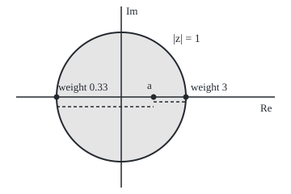
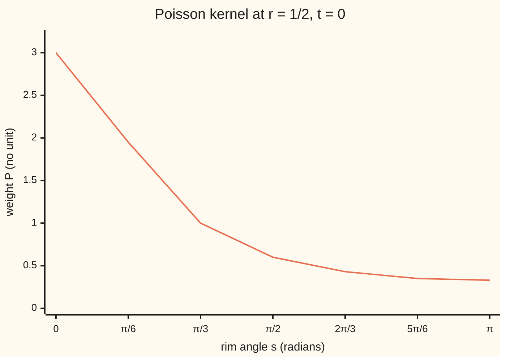

# The Poisson formula: fill a disc from its rim by weighting each boundary value by how close it is

Complex analysis → Conformal Maps and Harmonic Functions → Reading a drumhead from its rim → The Poisson formula

---

## General Overview

A drumhead of radius 1 sits on a warped hoop. At angle s round the hoop, the rim is 20 + 5 cos s millimetres above the floor: 25 on the right, 15 on the left, 20 at top and bottom. Nothing presses on the skin. How high is it halfway from the centre towards the high side?

The skin settles into a **harmonic** shape: its two second slopes cancel, so no point is a bump or a dip ([harmonic-functions-and-conjugates](04-harmonic-functions-and-conjugates.md)). The centre is the plain average of the rim, 20 ([mean-value-and-maximum-principle-for-harmonic-functions](05-mean-value-and-maximum-principle-for-harmonic-functions.md)). Off centre, near rim points must count more.

One fixed weighting does it, the **Poisson kernel**. Halfway out towards the high side it gives the nearest rim point weight 3, the farthest 0.33, and the height 22.5 millimetres; a numerical integral round the rim returns 22.500000.

**Inside a unit disc, the height of a harmonic function at distance r from the centre and angle t is a weighted average of its rim values, the rim point at angle s weighing (1 − r^2)/(1 − 2r cos(t − s) + r^2); the same weighting builds the harmonic function from any continuous rim.**

**What kind of fact this is:** a theorem, proved on this card in Why it works; building u from any continuous rim is in the folded Detailed proof.

### The picture: the drum, the point halfway out, its nearest and farthest rim points

<p align="center"></p>

To scale: 80 units per 1, centre (150, 120), rim radius 80; a = 1/2 at (190, 120), nearest rim point 1 at (230, 120), farthest, −1, at (70, 120). The dashed lines below the axis are the distances 1/2 and 3/2.

---

## The formula

Notation first. An inside point is r e^(it): distance r from the centre, angle t. A rim point is e^(is), with height h(s).

$$u(re^{it}) = \frac{1}{2\pi}\int_0^{2\pi} P_r(t-s)\,h(s)\,ds, \qquad P_r(\theta) = \frac{1-r^2}{1-2r\cos\theta+r^2}$$

**Read it aloud:** the height at radius r and angle t is the average, over all rim angles s, of rim height times the Poisson kernel at the angle between them.

The denominator is |e^(is) − r e^(it)|^2, the squared distance to the rim point, so near points weigh more.

For the upper half-plane, the region above the real line:

$$u(x+iy) = \frac{1}{\pi}\int_{-\infty}^{\infty} \frac{y}{(x-q)^2+y^2}\,h(q)\,dq$$

**Read it aloud:** the height at x + iy averages the heights along the line, each weighted by y over its squared distance.

| Symbol | Plain meaning | In our example | Push it up and the answer… |
| --- | --- | --- | --- |
| $u$ | height of the skin inside the disc | 20 + 5r cos t | — |
| $h$ | height on the rim at angle s | 20 + 5 cos s | every inside height rises by as much |
| $r$, $t$ | the inside point's distance from the centre and angle | 1/2 and 0 | r towards 1: height tends to h(t) |
| $s$ | a rim point's angle, averaged over | 0 to 2π | — |
| $P_r$ | the Poisson kernel: the weight a rim point gets | 3 at s = 0, 0.33 at s = π | larger r: weight piles up near s = t |
| $a$, $z$ | the inside point a = r e^(it); a rim point z = e^(is) | a = 1/2 | outside the rim: formula fails |
| $f$ | holomorphic, with real part u | 20 + 5z | — |
| $q$, $p$, $w$ | a point on the line; the Cayley map w = (p − i)/(p + i) of p = x + iy | p = 3i, w = 1/2 | — |

### When it holds

- **u harmonic inside, continuous up to the rim.** A finger adding 1 − r^2 leaves the rim alone and makes the height at a = 1/2 23.25; the formula still says 22.5.
- **The point strictly inside.** At r = 2 the sum gives −22.5, not a height of the drum; at r = 1 the denominator hits 0 at s = t.
- **A continuous rim, for building u.** Along the radius to a jump in the rim, inside heights tend to the jump's midpoint.
- **Bounded u, for the half-plane.** u = y is harmonic and 0 on the whole line, yet is not 0; the formula returns 0.

---

## Why it works

### Step 0: Cauchy's formula already reads the inside from the rim

Cauchy's integral formula recovers a holomorphic f inside from its rim values ([cauchys-integral-formula](../03-Contour%20Integrals%20and%20Cauchy%27s%20Theorem/05-cauchys-integral-formula.md)). Its weights are complex. Adding an integral that is zero makes them real and positive; then taking real parts gives the harmonic functions.

### Step 1: Cauchy at the point a

For f holomorphic on and inside the rim |z| = 1, and a inside,

$$f(a) = \frac{1}{2\pi i}\oint \frac{f(z)}{z-a}\,dz.$$

### Step 2: add zero, from the reflected point

Take a ≠ 0; a = 0 is the mean value property. Reflect a in the rim: 1/ā (ā is a-bar, the conjugate) lies on a's ray at distance 1/r, so 2 for a = 1/2. It is outside the rim, so f(z)/(z − 1/ā) has no bad point inside, and its loop integral is 0 by Cauchy's theorem ([cauchys-theorem](../03-Contour%20Integrals%20and%20Cauchy%27s%20Theorem/03-cauchys-theorem.md)). Subtract it:

$$f(a) = \frac{1}{2\pi i}\oint f(z)\Big(\frac{1}{z-a} - \frac{1}{z-1/\bar a}\Big)dz.$$

### Step 3: on the rim, the bracket is the kernel

Walk the rim as z = e^(is). Then dz = iz ds, so 2πi becomes 2π and the bracket gains a factor z. Using z z̄ = 1, it collapses to

$$\frac{1-|a|^2}{|z-a|^2} = P_r(t-s).$$

<details>
<summary>The algebra behind this</summary>

$\frac{z}{z-a} - \frac{z}{z-1/\bar a} = \frac{z}{z-a} + \frac{\bar a z}{1-\bar a z}$. Multiplying the second fraction top and bottom by z̄ makes it $\frac{\bar a}{\bar z-\bar a}$. Over the common denominator $(z-a)(\bar z-\bar a) = |z-a|^2$ the top is $z(\bar z-\bar a) + \bar a(z-a) = 1 - |a|^2$. Finally $|e^{is} - re^{it}|^2 = 1 - 2r\cos(t-s) + r^2$.

</details>

So f(a) is the kernel-weighted average of f round the rim. At a = 1/2 the nearest rim point gets 0.75/0.25 = 3, the farthest 0.75/2.25 = 0.33.

### Step 4: take real parts

The kernel is real, so the real part of the average is the average of real parts. A harmonic u on the disc is the real part of a holomorphic f ([harmonic-functions-and-conjugates](04-harmonic-functions-and-conjugates.md)). That gives the Poisson formula for u. If u is only continuous up to the rim, apply it on the circle of radius ρ < 1 and let ρ grow to 1.

### Step 5: the weights total 1

Put u = 1: the formula reads 1 = (1/2π) × integral of the kernel. Every weight is positive. At r = 0 every weight is 1: the mean value property is the centre case.

### Step 6: the drum

The rim height 20 + 5 cos s is the real part of f(z) = 20 + 5z on the rim. So the skin is u = Re(20 + 5z) = 20 + 5r cos t, and at r = 1/2, t = 0 it is 20 + 2.5 = **22.5**.

### Step 7: from any continuous rim

The converse holds. For any continuous rim h, the right side is harmonic inside, since the kernel is the real part of (z + a)/(z − a), holomorphic in a. As a moves out to e^(it), the weight piles up near s = t, so the average closes in on h(t).

<details>
<summary>Detailed proof: the rim values are recovered</summary>

Harmonic inside: $P_r(t-s) = \mathrm{Re}\,\frac{z+a}{z-a}$ with z = e^(is), so $u(a) = \mathrm{Re}\,\frac{1}{2\pi}\int_0^{2\pi} \frac{z+a}{z-a}h(s)\,ds$, the real part of a function holomorphic in a. It is harmonic.

Recovery: by total weight 1, $u(re^{it}) - h(t) = \frac{1}{2\pi}\int_{-\pi}^{\pi} P_r(\alpha)\big(h(t-\alpha)-h(t)\big)d\alpha$. Let M be the largest |h| and ε > 0. Continuity on the closed rim gives δ > 0 with |h(t − α) − h(t)| < ε/2 whenever |α| < δ. There, positive weights of total 1 bound the integral by ε/2. For δ ≤ |α| ≤ π and r ≥ 1/2 the denominator is $(1-r)^2 + 2r(1-\cos\alpha) \ge 1-\cos\delta$, so that part is at most $2M(1-r^2)/(1-\cos\delta)$, below ε/2 once r is near 1. So u tends to h uniformly. Uniqueness is the maximum principle: two solutions differ by a harmonic function that is 0 on the rim, hence 0 inside.

</details>

### Step 8: the half-plane, through the Cayley map

The Cayley map w = (p − i)/(p + i) is a Möbius map ([mobius-transformations-and-the-point-at-infinity](02-mobius-transformations-and-the-point-at-infinity.md)) sending the upper half-plane onto the disc and the real line onto the rim. Harmonic functions stay harmonic under it, and changing variable turns the disc kernel into y/((x − q)^2 + y^2) with 1/π in front. On the drum, 3i maps to 1/2, and the half-plane integral at 3i returns 22.500000.

<details>
<summary>The change of variable</summary>

Write C(p) = (p − i)/(p + i), q on the line: $1 - |C(p)|^2 = \frac{4y}{|p+i|^2}$, and $C(q) - C(p) = \frac{2i(q-p)}{(q+i)(p+i)}$, so $|C(q)-C(p)|^2 = \frac{4|q-p|^2}{(1+q^2)|p+i|^2}$. The disc kernel becomes $\frac{y(1+q^2)}{|q-p|^2}$, and e^(is) = C(q) gives $ds = \frac{2\,dq}{1+q^2}$. So $\frac{1}{2\pi}P\,ds = \frac{1}{\pi}\frac{y}{(x-q)^2+y^2}\,dq$.

</details>

A second road: the kernel is the rim slope of the disc's Green's function, its response to a single point source, reached by method-of-images.

---

## Worked numbers, by hand

| Step | Arithmetic | Value |
| --- | --- | --- |
| weight, nearest rim point, s = 0 | (1 − 1/4) / (1 − 1 + 1/4) | 3.00 |
| weight at s = π/2 | (3/4) / (5/4) | 0.60 |
| weight, farthest rim point, s = π | (3/4) / (9/4) | 0.33 |
| total weight | kernel averaged round the rim | 1.000000 |
| the centre | plain average of 20 + 5 cos s | 20.000000 |
| a = 1/2, closed form | 20 + 5 × 1/2 × cos 0 | **22.500000** |
| a = 1/2, kernel sum | 64 equal steps | 22.500000 |
| second case, r = 0.8, t = 2π/3 | 20 + 5 × 0.8 × (−1/2) | 18.000000 |
| half-plane, point 3i | (3i − i)/(3i + i) = 1/2; line integral | 22.500000 |

Halfway out, the skin stands 22.5 millimetres up, midway between the centre's 20 and the rim's 25: it is a tilted plane.

### What breaks if you drop a piece

| Mistake | Comes out at | What went wrong |
| --- | --- | --- |
| Dropping the 1/(2π) | 141.371669, not 22.500000 | The weights total 2π, not 1 |
| A pressed drum, bump 1 − r^2 added | true 23.25; formula 22.5 | The skin is no longer harmonic |
| A point off the drum, r = 2 | −22.5 | The kernel is negative outside the rim |

By hand: the kernel at r = 2 is minus the kernel at 1/2.

### The weights round the rim



The line is the weight each rim point gets from a = 1/2, nearest (s = 0) to farthest (s = π); the other half of the rim mirrors it.

---

## Code, from first principles, and it actually runs

Two roads to every height: the closed form 20 + 5r cos t, and the Poisson integral as a trapezoid sum of n equal steps round the rim. The kernel is also checked against Cauchy's complex form, and the half-plane integral against the disc.

### Python

```python
# The Poisson formula -- the check behind the card.  Standard library only.
# A drumhead of radius 1 has rim height h(s) = 20 + 5 cos s (millimetres).
# Road one: the closed form inside, 20 + 5 r cos t.  Road two: the Poisson
# integral itself, a trapezoid sum of kernel times rim height round the rim.
import math

def h(s):                                  # the warped rim
    return 20 + 5 * math.cos(s)

def kernel(r, x):                          # (1 - r^2) / (1 - 2 r cos x + r^2)
    return (1 - r * r) / (1 - 2 * r * math.cos(x) + r * r)

def cauchy_kernel(r, t, s):                # Re((z + a)/(z - a)), z on the rim, a = r e^(it)
    z, a = complex(math.cos(s), math.sin(s)), r * complex(math.cos(t), math.sin(t))
    return ((z + a) / (z - a)).real

def poisson(g, r, t, n=64):                # (1/2 pi) x integral of P(t - s) g(s) ds, n equal steps
    return sum(kernel(r, t - 2 * math.pi * k / n) * g(2 * math.pi * k / n) for k in range(n)) / n

def half_plane(g, x, y, n=400):            # (1/pi) x integral of y g(q) / ((x - q)^2 + y^2) dq,
    return sum(g(x + y * math.tan(-math.pi / 2 + math.pi * (k + 0.5) / n)) for k in range(n)) / n

def sci(v):                                # 1.2e-5 style, the same in both languages
    e = math.floor(math.log10(v)); m = round(v / 10 ** e, 1)
    return f"{m / 10:.1f}e{e + 1}" if m >= 10 else f"{m:.1f}e{e}"

cayley = lambda z: (z - 1j) / (z + 1j)
bump = lambda r, t: 20 + 5 * r * math.cos(t) + (1 - r * r)   # same rim, not harmonic
hq = lambda q: h(math.atan2(cayley(q).imag, cayley(q).real))  # rim data carried to the line
exact = 20 + 5 * 0.5 * math.cos(0)
print("figure, 80 units per 1: centre (150, 120), rim radius 80, a = 1/2 at (190, 120), nearest rim point (230, 120), farthest (70, 120)")
gap = max(abs(kernel(0.5, s) - cauchy_kernel(0.5, 0, s)) for s in (0.1 * k for k in range(63)))
print(f"kernel, real formula against Cauchy's form Re((z + a)/(z - a)) at 63 angles: agree to 12 decimals: {'yes' if gap < 1e-12 else 'no'}")
print("chart, P at r = 1/2, s = 0, pi/6, ..., pi: " + ", ".join(f"{kernel(0.5, k * math.pi / 6):.2f}" for k in range(7)))
print(f"kernel mass, 256 points: r = 0.5 gives {poisson(lambda s: 1, 0.5, 0, 256):.6f}; r = 0.9 gives {poisson(lambda s: 1, 0.9, 0, 256):.6f}")
print(f"centre, r = 0: {poisson(h, 0, 0):.6f}; plain rim average {sum(h(2 * math.pi * k / 64) for k in range(64)) / 64:.6f}")
print(f"r = 1/2, t = 0: closed form {exact:.6f}; kernel sum, 64 points {poisson(h, 0.5, 0):.6f}")
for n in (4, 8, 16, 32):
    print(f"r = 1/2, t = 0, {n} points: error {sci(abs(poisson(h, 0.5, 0, n) - exact))}")
second = 20 + 5 * 0.8 * math.cos(2 * math.pi / 3)
print(f"r = 0.8, t = 2pi/3: closed form {second:.6f}; kernel sum, 256 points {poisson(h, 0.8, 2 * math.pi / 3, 256):.6f}")
w = cayley(3j)
print(f"half plane: Cayley map sends 3i to {w.real:.6f} + {w.imag:.6f}i; half-plane integral at 3i = {half_plane(hq, 0, 3):.6f}")
print(f"mistake 1, dropping the 1/(2 pi): {2 * math.pi * poisson(h, 0.5, 0):.6f}, not 22.500000")
print(f"mistake 2, a pressed drum (bump 1 - r^2, same rim): true height {bump(0.5, 0):.6f}; formula says {poisson(lambda s: bump(1, s), 0.5, 0):.6f}")
print(f"mistake 3, a point off the drum, r = 2, t = 0: kernel sum gives {poisson(h, 2, 0):.6f}")
assert abs(poisson(h, 0.5, 0) - exact) < 1e-12 and abs(poisson(h, 0.8, 2 * math.pi / 3, 256) - second) < 1e-9
assert gap < 1e-12                                                    # Cauchy's form = the real formula
assert all(abs(poisson(lambda s: 1, r, 0, 256) - 1) < 1e-10 for r in (0.5, 0.9))   # total weight 1
assert abs(half_plane(hq, 0, 3) - (20 + 5 * w.real)) < 1e-9          # half plane agrees with the disc
print("ALL CHECKS PASS")
```

**Ran 2026-09-28 on macOS, Python 3.14.6, standard library only. All checks passed. Output, pasted from the run:**

```
figure, 80 units per 1: centre (150, 120), rim radius 80, a = 1/2 at (190, 120), nearest rim point (230, 120), farthest (70, 120)
kernel, real formula against Cauchy's form Re((z + a)/(z - a)) at 63 angles: agree to 12 decimals: yes
chart, P at r = 1/2, s = 0, pi/6, ..., pi: 3.00, 1.95, 1.00, 0.60, 0.43, 0.35, 0.33
kernel mass, 256 points: r = 0.5 gives 1.000000; r = 0.9 gives 1.000000
centre, r = 0: 20.000000; plain rim average 20.000000
r = 1/2, t = 0: closed form 22.500000; kernel sum, 64 points 22.500000
r = 1/2, t = 0, 4 points: error 3.5e0
r = 1/2, t = 0, 8 points: error 2.1e-1
r = 1/2, t = 0, 16 points: error 8.0e-4
r = 1/2, t = 0, 32 points: error 1.2e-8
r = 0.8, t = 2pi/3: closed form 18.000000; kernel sum, 256 points 18.000000
half plane: Cayley map sends 3i to 0.500000 + 0.000000i; half-plane integral at 3i = 22.500000
mistake 1, dropping the 1/(2 pi): 141.371669, not 22.500000
mistake 2, a pressed drum (bump 1 - r^2, same rim): true height 23.250000; formula says 22.500000
mistake 3, a point off the drum, r = 2, t = 0: kernel sum gives -22.500000
ALL CHECKS PASS
```

### Rust

Same numbers, same labels, built with `rustc --edition 2021 -O`.

```rust
// The Poisson formula -- the same check as the Python, in Rust.  No crates; a
// small (re, im) struct does the complex arithmetic.  A drumhead of radius 1 has
// rim height h(s) = 20 + 5 cos s (millimetres).  Road one: the closed form
// 20 + 5 r cos t.  Road two: the Poisson integral as a trapezoid sum round the rim.
use std::f64::consts::PI;

#[derive(Clone, Copy)]
struct C { re: f64, im: f64 }
fn c(re: f64, im: f64) -> C { C { re, im } }
fn add(a: C, b: C) -> C { c(a.re + b.re, a.im + b.im) }
fn sub(a: C, b: C) -> C { c(a.re - b.re, a.im - b.im) }
fn div(a: C, b: C) -> C {
    let d = b.re * b.re + b.im * b.im;
    c((a.re * b.re + a.im * b.im) / d, (a.im * b.re - a.re * b.im) / d)
}

fn h(s: f64) -> f64 { 20.0 + 5.0 * s.cos() }                             // the warped rim
fn kernel(r: f64, x: f64) -> f64 { (1.0 - r * r) / (1.0 - 2.0 * r * x.cos() + r * r) }
fn cauchy_kernel(r: f64, t: f64, s: f64) -> f64 {                          // Re((z + a)/(z - a))
    let (z, a) = (c(s.cos(), s.sin()), c(r * t.cos(), r * t.sin()));
    div(add(z, a), sub(z, a)).re
}
fn poisson(g: &dyn Fn(f64) -> f64, r: f64, t: f64, n: usize) -> f64 {     // (1/2 pi) x integral of P g
    (0..n).map(|k| { let s = 2.0 * PI * k as f64 / n as f64; kernel(r, t - s) * g(s) }).sum::<f64>() / n as f64
}
fn half_plane(g: &dyn Fn(f64) -> f64, x: f64, y: f64, n: usize) -> f64 { // q = x + y tan(theta)
    (0..n).map(|k| g(x + y * (-PI / 2.0 + PI * (k as f64 + 0.5) / n as f64).tan())).sum::<f64>() / n as f64
}
fn cayley(z: C) -> C { div(sub(z, c(0.0, 1.0)), add(z, c(0.0, 1.0))) }
fn sci(x: f64) -> String {                                                // 1.2e-5 style
    let e = x.log10().floor() as i32;
    let m = (x / 10f64.powi(e) * 10.0).round() / 10.0;
    if m >= 10.0 { format!("{:.1}e{}", m / 10.0, e + 1) } else { format!("{:.1}e{}", m, e) }
}

fn main() {
    let bump = |r: f64, t: f64| 20.0 + 5.0 * r * t.cos() + (1.0 - r * r);   // same rim, not harmonic
    let hq = |q: f64| { let w = cayley(c(q, 0.0)); h(w.im.atan2(w.re)) };    // rim data carried to the line
    let one = |_s: f64| 1.0;
    let exact = 20.0 + 5.0 * 0.5 * 0f64.cos();
    println!("figure, 80 units per 1: centre (150, 120), rim radius 80, a = 1/2 at (190, 120), nearest rim point (230, 120), farthest (70, 120)");
    let gap = (0..63).map(|k| (kernel(0.5, 0.1 * k as f64) - cauchy_kernel(0.5, 0.0, 0.1 * k as f64)).abs()).fold(0.0, f64::max);
    println!("kernel, real formula against Cauchy's form Re((z + a)/(z - a)) at 63 angles: agree to 12 decimals: {}", if gap < 1e-12 { "yes" } else { "no" });
    let pts: Vec<String> = (0..7).map(|k| format!("{:.2}", kernel(0.5, k as f64 * PI / 6.0))).collect();
    println!("chart, P at r = 1/2, s = 0, pi/6, ..., pi: {}", pts.join(", "));
    println!("kernel mass, 256 points: r = 0.5 gives {:.6}; r = 0.9 gives {:.6}", poisson(&one, 0.5, 0.0, 256), poisson(&one, 0.9, 0.0, 256));
    let avg = (0..64).map(|k| h(2.0 * PI * k as f64 / 64.0)).sum::<f64>() / 64.0;
    println!("centre, r = 0: {:.6}; plain rim average {:.6}", poisson(&h, 0.0, 0.0, 64), avg);
    println!("r = 1/2, t = 0: closed form {:.6}; kernel sum, 64 points {:.6}", exact, poisson(&h, 0.5, 0.0, 64));
    for n in [4, 8, 16, 32] {
        println!("r = 1/2, t = 0, {} points: error {}", n, sci((poisson(&h, 0.5, 0.0, n) - exact).abs()));
    }
    let second = 20.0 + 5.0 * 0.8 * (2.0 * PI / 3.0).cos();
    let second_sum = poisson(&h, 0.8, 2.0 * PI / 3.0, 256);
    println!("r = 0.8, t = 2pi/3: closed form {:.6}; kernel sum, 256 points {:.6}", second, second_sum);
    let w = cayley(c(0.0, 3.0));
    let hp = half_plane(&hq, 0.0, 3.0, 400);
    println!("half plane: Cayley map sends 3i to {:.6} + {:.6}i; half-plane integral at 3i = {:.6}", w.re, w.im, hp);
    println!("mistake 1, dropping the 1/(2 pi): {:.6}, not 22.500000", 2.0 * PI * poisson(&h, 0.5, 0.0, 64));
    println!("mistake 2, a pressed drum (bump 1 - r^2, same rim): true height {:.6}; formula says {:.6}", bump(0.5, 0.0), poisson(&|s| bump(1.0, s), 0.5, 0.0, 64));
    println!("mistake 3, a point off the drum, r = 2, t = 0: kernel sum gives {:.6}", poisson(&h, 2.0, 0.0, 64));
    assert!((poisson(&h, 0.5, 0.0, 64) - exact).abs() < 1e-12 && (second_sum - second).abs() < 1e-9);
    assert!(gap < 1e-12);                                                  // Cauchy's form = the real formula
    assert!([0.5, 0.9].iter().all(|&r| (poisson(&one, r, 0.0, 256) - 1.0).abs() < 1e-10));   // total weight 1
    assert!((hp - (20.0 + 5.0 * w.re)).abs() < 1e-9);                     // half plane agrees with the disc
    println!("ALL CHECKS PASS");
}
```

**Ran 2026-09-28 on macOS, rustc 1.98.1, no crates. All checks passed. Output, pasted from the run:**

```
figure, 80 units per 1: centre (150, 120), rim radius 80, a = 1/2 at (190, 120), nearest rim point (230, 120), farthest (70, 120)
kernel, real formula against Cauchy's form Re((z + a)/(z - a)) at 63 angles: agree to 12 decimals: yes
chart, P at r = 1/2, s = 0, pi/6, ..., pi: 3.00, 1.95, 1.00, 0.60, 0.43, 0.35, 0.33
kernel mass, 256 points: r = 0.5 gives 1.000000; r = 0.9 gives 1.000000
centre, r = 0: 20.000000; plain rim average 20.000000
r = 1/2, t = 0: closed form 22.500000; kernel sum, 64 points 22.500000
r = 1/2, t = 0, 4 points: error 3.5e0
r = 1/2, t = 0, 8 points: error 2.1e-1
r = 1/2, t = 0, 16 points: error 8.0e-4
r = 1/2, t = 0, 32 points: error 1.2e-8
r = 0.8, t = 2pi/3: closed form 18.000000; kernel sum, 256 points 18.000000
half plane: Cayley map sends 3i to 0.500000 + 0.000000i; half-plane integral at 3i = 22.500000
mistake 1, dropping the 1/(2 pi): 141.371669, not 22.500000
mistake 2, a pressed drum (bump 1 - r^2, same rim): true height 23.250000; formula says 22.500000
mistake 3, a point off the drum, r = 2, t = 0: kernel sum gives -22.500000
ALL CHECKS PASS
```

The two outputs match line for line.

> [!TIP]
> **Try changing**
> Guess first, then run it.
> - **Fewer points.** Change the 64 in the default `n=64` to 8: the error line predicts 2.1e-1; the first assert stops it.
> - **A rippled rim.** Change `math.cos(s)` in h to `math.cos(2 * s)`: the kernel turns cos 2s into r^2 cos 2t, giving 21.25; the first assert stops it.
> - **Near the rim.** Change every `0.9` to `0.99`: the kernel becomes a spike 256 points cannot resolve, the mass reads 1.165240, and the third assert stops it.

---

## The usual mistake

> [!warning]
> **Averaging the rim plainly away from the centre.** That gives the centre's 20 wherever the point is. At a = 1/2 the weights run from 3.00 to 0.33, and the height is 22.5.

---

## Where you meet it in real life

- **Steady heat in a round plate, or voltage in a hollow tube.** With the rim held at known values and no source inside, the field is harmonic, and the formula gives it everywhere.
- **Signal smoothing.** Averaging a repeating signal against the kernel at radius r shrinks its n-th frequency by r^n, damping fast wiggles more than slow ones (gaussian-and-poisson-kernels).

> **Say it back**
> A harmonic function on a disc is fixed by its rim. Cauchy's formula plus a zero integral from the reflected point becomes a real weighted average. Each weight is 1 − r^2 over a squared distance, and they total 1. Rim 20 + 5 cos s gives 22.5 halfway out. The Cayley map carries this to the half-plane.

---

## What this builds on

- [mean-value-and-maximum-principle-for-harmonic-functions](05-mean-value-and-maximum-principle-for-harmonic-functions.md): the centre case of the formula, and the maximum principle that makes the answer unique.
- [mobius-transformations-and-the-point-at-infinity](02-mobius-transformations-and-the-point-at-infinity.md): the Cayley map that carries the disc onto the half-plane.

## Where this goes next

- [solving-boundary-problems-by-mapping](07-solving-boundary-problems-by-mapping.md): other shapes, mapped to the disc first.
- method-of-images: Step 2's reflected point as a mirror charge.
- gaussian-and-poisson-kernels: the kernel among positive weights that pile up at a point.

---

## Sources

Verified 28 Sep 2026: every link below opens a page naming the cited work.

- Lebl, Jiří. *Guide to Cultivating Complex Analysis*. [Book page and free PDF](https://www.jirka.org/ca/). Derives the kernel; solves the disc's rim problem.
- Axler, Sheldon, Paul Bourdon, and Wade Ramey. *Harmonic Function Theory*, 2nd ed. Springer, 2001. [Author's book page](https://www.axler.net/HFT.html). Ball and half-space kernels, fully proved.
- Orloff, Jeremy. "Topic 10: Conformal transformations." MIT OpenCourseWare 18.04, Spring 2018. [Course notes](https://ocw.mit.edu/courses/18-04-complex-variables-with-applications-spring-2018/resources/mit18_04s18_topic10/). Rim problems solved by conformal maps.
