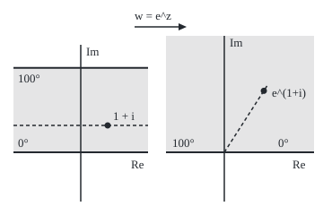

# Solving by mapping: a harmonic function stays harmonic under a conformal map, so solve on the disc or half plane and carry the answer back

[Syllabus](../../../SYLLABUS.md) → [Complex analysis](../README.md) → [Conformal Maps and Harmonic Functions](../README.md#s07) → Solving by mapping

---

## General Overview

A long corridor has its floor held at 0 degrees and its ceiling at 100. Draw it as the strip of points z = x + iy with y between 0 and π: floor y = 0, ceiling y = π. Once the heat stops moving, what is the temperature at 1 + i?

Steady temperature is **harmonic**: at every inside point it equals the average of its values round any small circle there ([Harmonic functions](04-harmonic-functions-and-conjugates.md)). Here a guess works: the temperature climbs evenly, 100y/π degrees, so 31.830989 at 1 + i.

Most regions allow no guess. A conformal map (holomorphic with nonzero derivative, so it keeps angles) bends the corridor onto the upper half plane, where the answer takes one line; it is then carried back point by point. The corridor tests the method against the guess; a quarter plane, with a corner, is the second case.

**A harmonic function evaluated at the output of a conformal map is again harmonic, and a one-to-one map carries walls to walls, so a steady-temperature problem on a hard region is solved on the half plane or disc and carried back.**

**What kind of fact this is:** a theorem, proved on this card in Why it works, plus the method it licenses.

### The picture: the corridor and its image under e^z

<p align="center"></p>

To scale, 30 units per unit length. The dashed line y = 1 lands on the ray at angle 1; 1 + i lands at distance e = 2.718282 from 0.

---

## The formula

Let f be a holomorphic map and U a real function with continuous second partial derivatives. The **Laplacian** of U, written $\Delta U$, adds its two second partial derivatives, in x and in y; U is harmonic exactly when $\Delta U = 0$. $U \circ f$, read "U after f", has value U(f(z)) at z.

$$\Delta(U \circ f)(z) = \lvert f'(z)\rvert^2 \,(\Delta U)(f(z))$$

**Read it aloud:** the Laplacian of U after f equals the Laplacian of U at the image point, times the square of the map's local stretch.

When U is harmonic the right side is 0, so $u = U \circ f$ is harmonic too. On the upper half plane, the points w with positive imaginary part, the temperature that is 0 on the positive real axis and 100 on the negative one is

$$U(w) = \frac{100}{\pi}\arg w,$$

**Read it aloud:** the temperature is the angle of w, measured from the positive real axis, scaled so that the angle π reads 100.

Here arg w lies in (0, π). For a temperature g(t) at each wall point t of the real axis, the half plane's Poisson integral gives the answer at w = a + ib (the disc's formula from [The Poisson formula](06-poisson-integral-formula.md), carried over by a Möbius map):

$$U(a + ib) = \frac{1}{\pi}\int_{-\infty}^{\infty} \frac{b\,g(t)}{(t - a)^2 + b^2}\,dt$$

**Read it aloud:** a weighted average of the wall temperatures, heaviest near w.

| Symbol | Plain meaning | In our example | Push it up and the answer… |
| --- | --- | --- | --- |
| $z$, $x$, $y$ | a point of the hard region; its real and imaginary parts | 1 + i; 1 + 2i | larger y, warmer corridor |
| $w$ | a point of the half plane | e^(1+i) = 1.468694 + 2.287355i | larger angle, warmer |
| $f$ | the conformal map from the hard region onto the half plane | e^z; z^2 | — |
| $f'$ | the complex derivative of f; its modulus is the local stretch | e^(1+i), modulus 2.718282 | a non-zero Laplacian grows by its square |
| $U$ | the temperature on the half plane, known | (100/π) arg w | — |
| $u$ | the temperature wanted, u(z) = U(f(z)) | 100y/π; (200/π) arg z | — |
| $\Delta$ | the Laplacian | 0 for any steady temperature | — |
| $a$, $b$, $t$, $g$ | parts of w; a wall point; its temperature | g = 100 for t < 0, else 0 | hotter wall, hotter inside |

### When it holds

- **f one-to-one and onto the easy region.** A folding map asks one point for two temperatures: z^2 on the half plane sends 2 and −2 both to 4.
- **Walls go to walls, continuously.** At a corner the map may stop being conformal (z^2 at 0, where f' = 0) and the wall value may jump; the answer stays bounded but has no value at that point.
- **The answer is bounded.** 100y/π + e^x sin y has the same wall values and grows without limit.
- **No heat sources.** A non-zero Laplacian is multiplied by $\lvert f' \rvert^2$; only 0 crosses unchanged.

---

## Why it works

### Step 0: a conformal map is locally turn and stretch, and the Laplacian ignores turns

Near any point, a holomorphic f moves a small step h to roughly f'(z) times h: turn by the angle of f'(z), stretch by its modulus ([Conformal maps](01-conformal-maps.md)). The Laplacian is the same in every rotated frame, and a stretch by a factor multiplies second derivatives by its square.

### Step 1: the chain rule makes Step 0 exact

Write f = φ + iψ, with φ and ψ its real and imaginary parts. Differentiate U(φ, ψ) twice by the chain rule and add. The Cauchy–Riemann equations (φ_x = ψ_y and φ_y = −ψ_x, a subscript marking a partial derivative) collapse the result: cross terms cancel, both squared-slope terms equal $\lvert f' \rvert^2$, and the terms carrying $\Delta\varphi$ and $\Delta\psi$ vanish, since φ and ψ are harmonic.

At 1 + i with f = e^z and U = (Re w)^2, whose Laplacian is 2 everywhere, finite differences give 14.778113; the formula gives 2 e^2 = 14.778112.

<details>
<summary>Detailed proof: the chain rule, term by term</summary>

Let v(x, y) = U(φ, ψ), and write U_1, U_2 for U's partial derivatives in its first and second slots. Then

$$v_x = U_1\varphi_x + U_2\psi_x,$$
$$v_{xx} = U_{11}\varphi_x^2 + 2U_{12}\varphi_x\psi_x + U_{22}\psi_x^2 + U_1\varphi_{xx} + U_2\psi_{xx},$$

and the same with y in place of x. Adding,

$$\Delta v = U_{11}(\varphi_x^2 + \varphi_y^2) + 2U_{12}(\varphi_x\psi_x + \varphi_y\psi_y) + U_{22}(\psi_x^2 + \psi_y^2) + U_1\Delta\varphi + U_2\Delta\psi.$$

Cauchy–Riemann gives φ_x ψ_x + φ_y ψ_y = φ_x ψ_x − ψ_x φ_x = 0. It also gives φ_x^2 + φ_y^2 = ψ_x^2 + ψ_y^2 = φ_x^2 + ψ_x^2 = $\lvert f' \rvert^2$, since f' = φ_x + iψ_x. Differentiating Cauchy–Riemann once more gives φ_xx + φ_yy = ψ_yx − ψ_xy = 0, and likewise Δψ = 0. What remains is $\Delta v = \lvert f' \rvert^2 (U_{11} + U_{22})$, evaluated at f(z). Only holomorphy was used; one-to-one matters in Step 2.

</details>

### Step 2: walls ride along with the map

Let f be one-to-one onto the easy region and extend continuously to the edges, walls to walls. Each wall temperature moves to the image point; solve there for a bounded U. Then u = U after f is harmonic by Step 1, and as z nears a wall point, f(z) nears its image, so u nears the right value. Bounded answers are unique: the difference of two is bounded, harmonic and 0 on the walls, and the maximum principle ([Mean value and maximum principle](05-mean-value-and-maximum-principle-for-harmonic-functions.md)), in its form for bounded functions, forces it to 0.

### Step 3: the corridor through e^z

With z = x + iy, e^z = e^x (cos y + i sin y): modulus e^x, angle y ([The standard maps](03-standard-maps-and-composing-them.md)). For y between 0 and π the angle fills (0, π) exactly once, so the corridor goes one-to-one onto the upper half plane. The floor y = 0 goes to e^x, the positive real axis, at 0 degrees. The ceiling y = π goes to −e^x, the negative real axis, at 100.

U(w) = (100/π) arg w is harmonic, since arg w is the imaginary part of the holomorphic logarithm ([The complex logarithm](../02-Holomorphic%20Functions/04-complex-logarithm.md)). Carried back: u(z) = (100/π) arg e^z = 100y/π, the guess. At 1 + i, e^(1+i) = 1.468694 + 2.287355i, its angle is 1, and u = 31.830989.

### Step 4: the quarter plane through z^2

The quarter plane holds the points with positive real and imaginary parts. Hold the positive real axis at 0 degrees and the positive imaginary axis at 100. Squaring doubles angles, so z^2 sends angles in (0, π/2) one-to-one onto (0, π): the quarter plane onto the half plane. The wall 2 goes to 4, at 0 degrees; the wall 2i goes to −4, at 100. Carried back:

$$u(z) = \frac{100}{\pi}\arg(z^2) = \frac{200}{\pi}\arg z.$$

At 1 + 2i: z^2 = −3 + 4i and u = 70.483276. At the corner, f' = 2z = 0, so z^2 is not conformal there. The corner lies on the wall, not inside, so Step 1 still holds inside; but u nears every value from 0 to 100 along different rays into 0.

A second road: U is the real part of G(w) = −(100i/π) log w, and G after f is holomorphic, so its real part is harmonic ([Harmonic functions](04-harmonic-functions-and-conjugates.md)). For the corridor, log e^z = z, giving 100y/π again.

---

## Worked numbers, by hand

| Step | Arithmetic | Value |
| --- | --- | --- |
| map 1 + i | e^1 (cos 1 + i sin 1) | 1.468694 + 2.287355i |
| its angle | the angle of e^(x+iy) is y | 1 |
| half-plane temperature there | (100/π) × 1 | **31.830989** |
| map 1 + 2i | (1 + 2i)^2 = 1 + 4i − 4 | −3 + 4i |
| half-plane temperature there | (100/π) arg(−3 + 4i) = (200/π) arg(1 + 2i) | **70.483276** |
| quarter-plane walls | 2 goes to 4, 2i to −4 | 0 and 100 |

In the corridor, 1 + i sits under a third of the way up and reads under a third of 100 degrees.

### What breaks if you drop a piece

| Mistake | Comes out at | What went wrong |
| --- | --- | --- |
| Half-plane formula on the quarter plane, no map | 35.241638 at 1 + 2i; 50 on the wall at 2i | A corner is not a straight wall |
| Squaring the half plane | 2 and −2 both land on 4 | The map folds the 0 and 100 walls onto one ray |
| Unbounded 100y/π + e^x sin y | 34.118344 at 1 + i; 22076.465795 at 10 + (π/2)i | Right walls, but unbounded |
| Factor dropped, U = (Re w)^2 | Laplacian 2 instead of 14.778112 | Only a Laplacian of 0 crosses unscaled |

The code prints all four.

---

## Code, from first principles, and it actually runs

Three roads: the closed forms; the half-plane Poisson integral at the mapped point, by a hand-written Simpson's rule that never uses an angle; and the |f'|^2 rule, tested by a finite-difference Laplacian on a non-harmonic function under both maps.

### Python

```python
# Solving by mapping -- the check behind the card.  Standard library only.
# Strip 0 < Im z < pi, walls at 0 and 100 degrees, carried to the upper half plane
# by e^z; the quarter plane carried there by z^2.  Road one: the closed forms
# 100y/pi and (200/pi) arg z.  Road two: the half-plane Poisson integral at the
# mapped point, summed by Simpson's rule.  Road three: the rule
# Laplacian(u of f) = |f'|^2 Laplacian(u), by finite differences.
import math

def ez(z): return math.exp(z.real) * complex(math.cos(z.imag), math.sin(z.imag))
def U(w): return 100 / math.pi * math.atan2(w.imag, w.real)   # half plane: 0 right, 100 left

def poisson(w, n):                   # (1/pi) * integral over t < 0 of 100 b / ((t - a)^2 + b^2)
    a, b = w.real, w.imag            # with t = -tan p, p from 0 to pi/2; Simpson, n panels
    k = lambda p: b / ((math.sin(p) + a * math.cos(p)) ** 2 + (b * math.cos(p)) ** 2)
    h = math.pi / 2 / n
    s = k(0) + k(math.pi / 2) + sum((4 if j % 2 else 2) * k(j * h) for j in range(1, n))
    return 100 / math.pi * s * h / 3

def lap(v, x, y, h=1e-3):            # five-point Laplacian
    return (v(x + h, y) + v(x - h, y) + v(x, y + h) + v(x, y - h) - 4 * v(x, y)) / h ** 2

def fmt(z): return f"{z.real:.6f} {'-' if z.imag < 0 else '+'} {abs(z.imag):.6f}i"

z0, z1 = complex(1, 1), complex(1, 2)
w0, w1 = ez(z0), z1 * z1
strip = 100 * z0.imag / math.pi
quarter = 200 / math.pi * math.atan2(z1.imag, z1.real)
print(f"figure, 30 px per unit; strip 0 at (90, 170), top wall y = {170 - 30 * math.pi:.2f}, "
      f"z0 at ({90 + 30 * z0.real:.2f}, {170 - 30 * z0.imag:.2f}); half plane 0 at (250, 170), "
      f"e^z0 at ({250 + 30 * w0.real:.2f}, {170 - 30 * w0.imag:.2f}), "
      f"ray end ({250 + 90 * math.cos(1):.2f}, {170 - 90 * math.sin(1):.2f})")
print(f"strip, z0 = {fmt(z0)}: e^z0 = {fmt(w0)}, |e^z0| = {abs(w0):.6f}")
print(f"strip, closed form 100y/pi = {strip:.6f}; half-plane answer at e^z0 = {U(w0):.6f}")
for n in (16, 64, 256):
    p = poisson(w0, n)
    print(f"strip, Poisson integral at e^z0, {n} panels = {p:.9f}, error {abs(p - strip):.9f}")
print(f"strip walls at x = 1: U(e^1) = {U(ez(complex(1, 0))):.6f}; "
      f"U(e^(1 + pi i)) = {U(ez(complex(1, math.pi))):.6f}")
print(f"quarter, z1 = {fmt(z1)}: z1^2 = {fmt(w1)}; closed form (200/pi) arg z1 = {quarter:.6f}")
print(f"quarter, half-plane answer at z1^2 = {U(w1):.6f}; Poisson, 256 panels = {poisson(w1, 256):.6f}")
print(f"quarter walls: U(2^2) = {U(complex(4, 0)):.6f}; U((2i)^2) = {U(complex(-4, 0)):.6f}")
v1 = lambda x, y: (ez(complex(x, y)).real) ** 2          # u = (Re w)^2 has Laplacian 2
v2 = lambda x, y: ((complex(x, y) ** 2).real) ** 2
r1, r2 = 2 * abs(ez(z0)) ** 2, 2 * abs(2 * z1) ** 2        # 2 |f'|^2: f' = e^z, and 2z
print(f"rule, (Re e^z)^2 at z0: finite differences {lap(v1, 1, 1):.6f}; 2|f'|^2 = {r1:.6f}")
print(f"rule, (Re z^2)^2 at z1: finite differences {lap(v2, 1, 2):.6f}; 2|f'|^2 = {r2:.6f}")
print(f"break 1, half-plane formula on the quarter plane: at z1 {U(z1):.6f}; on the wall at 2i {U(2j):.6f}")
print(f"break 2, z^2 folds the half plane's walls: 2^2 = {fmt(complex(2, 0) ** 2)}, "
      f"(-2)^2 = {fmt(complex(-2, 0) ** 2)}")
extra = lambda z: 100 * z.imag / math.pi + ez(z).imag       # also 0 and 100 on the walls
print(f"break 3, 100y/pi + e^x sin y: walls {extra(complex(1, 0)):.6f} and "
      f"{extra(complex(1, math.pi)):.6f}; at z0 {extra(z0):.6f}; at 10 + (pi/2)i {extra(complex(10, math.pi / 2)):.6f}")
print(f"break 4, factor |f'|^2 dropped: Laplacian 2.000000 instead of {r1:.6f}")
assert abs(poisson(w0, 256) - strip) < 1e-6                 # Poisson road = 100y/pi
assert abs(poisson(w1, 256) - quarter) < 1e-6               # Poisson road = (200/pi) arg z
assert abs(lap(v1, 1, 1) - r1) < 1e-4                       # the |f'|^2 rule, e^z
assert abs(lap(v2, 1, 2) - r2) < 1e-4                       # the |f'|^2 rule, z^2
print("ALL CHECKS PASS")
```

**Ran 2026-09-28 on macOS, Python 3.14.6, standard library only. All checks passed. Output, pasted from the run:**

```
figure, 30 px per unit; strip 0 at (90, 170), top wall y = 75.75, z0 at (120.00, 140.00); half plane 0 at (250, 170), e^z0 at (294.06, 101.38), ray end (298.63, 94.27)
strip, z0 = 1.000000 + 1.000000i: e^z0 = 1.468694 + 2.287355i, |e^z0| = 2.718282
strip, closed form 100y/pi = 31.830989; half-plane answer at e^z0 = 31.830989
strip, Poisson integral at e^z0, 16 panels = 31.828429075, error 0.002559544
strip, Poisson integral at e^z0, 64 panels = 31.830976324, error 0.000012295
strip, Poisson integral at e^z0, 256 panels = 31.830988570, error 0.000000048
strip walls at x = 1: U(e^1) = 0.000000; U(e^(1 + pi i)) = 100.000000
quarter, z1 = 1.000000 + 2.000000i: z1^2 = -3.000000 + 4.000000i; closed form (200/pi) arg z1 = 70.483276
quarter, half-plane answer at z1^2 = 70.483276; Poisson, 256 panels = 70.483277
quarter walls: U(2^2) = 0.000000; U((2i)^2) = 100.000000
rule, (Re e^z)^2 at z0: finite differences 14.778113; 2|f'|^2 = 14.778112
rule, (Re z^2)^2 at z1: finite differences 40.000004; 2|f'|^2 = 40.000000
break 1, half-plane formula on the quarter plane: at z1 35.241638; on the wall at 2i 50.000000
break 2, z^2 folds the half plane's walls: 2^2 = 4.000000 + 0.000000i, (-2)^2 = 4.000000 + 0.000000i
break 3, 100y/pi + e^x sin y: walls 0.000000 and 100.000000; at z0 34.118344; at 10 + (pi/2)i 22076.465795
break 4, factor |f'|^2 dropped: Laplacian 2.000000 instead of 14.778112
ALL CHECKS PASS
```

### Rust

```rust
// Solving by mapping -- the same check as the Python, in Rust.  No crates.
// Strip 0 < Im z < pi, walls at 0 and 100 degrees, carried to the upper half plane
// by e^z; the quarter plane carried there by z^2.  Road one: the closed forms
// 100y/pi and (200/pi) arg z.  Road two: the half-plane Poisson integral at the
// mapped point, summed by Simpson's rule.  Road three: the rule
// Laplacian(u of f) = |f'|^2 Laplacian(u), by finite differences.
use std::f64::consts::PI;

#[derive(Clone, Copy)]
struct C { re: f64, im: f64 }
fn c(re: f64, im: f64) -> C { C { re, im } }
fn mul(a: C, b: C) -> C { c(a.re * b.re - a.im * b.im, a.re * b.im + a.im * b.re) }
fn md(a: C) -> f64 { a.re.hypot(a.im) }
fn ez(z: C) -> C { let r = z.re.exp(); c(r * z.im.cos(), r * z.im.sin()) }
fn u(w: C) -> f64 { 100.0 / PI * w.im.atan2(w.re) }            // half plane: 0 right, 100 left

fn poisson(w: C, n: usize) -> f64 {  // (1/pi) * integral over t < 0 of 100 b / ((t - a)^2 + b^2)
    let (a, b) = (w.re, w.im);       // with t = -tan p, p from 0 to pi/2; Simpson, n panels
    let k = |p: f64| b / ((p.sin() + a * p.cos()).powi(2) + (b * p.cos()).powi(2));
    let h = PI / 2.0 / n as f64;
    let mut s = 0.0;
    for j in 1..n { s += if j % 2 == 1 { 4.0 } else { 2.0 } * k(j as f64 * h); }
    100.0 / PI * (k(0.0) + k(PI / 2.0) + s) * h / 3.0
}

fn lap(v: &dyn Fn(f64, f64) -> f64, x: f64, y: f64) -> f64 {   // five-point Laplacian
    let h = 1e-3;
    (v(x + h, y) + v(x - h, y) + v(x, y + h) + v(x, y - h) - 4.0 * v(x, y)) / (h * h)
}

fn fmt(z: C) -> String { format!("{:.6} {} {:.6}i", z.re, if z.im < 0.0 { "-" } else { "+" }, z.im.abs()) }

fn main() {
    let (z0, z1) = (c(1.0, 1.0), c(1.0, 2.0));
    let (w0, w1) = (ez(z0), mul(z1, z1));
    let strip = 100.0 * z0.im / PI;
    let quarter = 200.0 / PI * z1.im.atan2(z1.re);
    println!("figure, 30 px per unit; strip 0 at (90, 170), top wall y = {:.2}, z0 at ({:.2}, {:.2}); half plane 0 at (250, 170), e^z0 at ({:.2}, {:.2}), ray end ({:.2}, {:.2})",
        170.0 - 30.0 * PI, 90.0 + 30.0 * z0.re, 170.0 - 30.0 * z0.im,
        250.0 + 30.0 * w0.re, 170.0 - 30.0 * w0.im, 250.0 + 90.0 * 1f64.cos(), 170.0 - 90.0 * 1f64.sin());
    println!("strip, z0 = {}: e^z0 = {}, |e^z0| = {:.6}", fmt(z0), fmt(w0), md(w0));
    println!("strip, closed form 100y/pi = {:.6}; half-plane answer at e^z0 = {:.6}", strip, u(w0));
    for n in [16, 64, 256] {
        let p = poisson(w0, n);
        println!("strip, Poisson integral at e^z0, {} panels = {:.9}, error {:.9}", n, p, (p - strip).abs());
    }
    println!("strip walls at x = 1: U(e^1) = {:.6}; U(e^(1 + pi i)) = {:.6}", u(ez(c(1.0, 0.0))), u(ez(c(1.0, PI))));
    println!("quarter, z1 = {}: z1^2 = {}; closed form (200/pi) arg z1 = {:.6}", fmt(z1), fmt(w1), quarter);
    println!("quarter, half-plane answer at z1^2 = {:.6}; Poisson, 256 panels = {:.6}", u(w1), poisson(w1, 256));
    println!("quarter walls: U(2^2) = {:.6}; U((2i)^2) = {:.6}", u(c(4.0, 0.0)), u(c(-4.0, 0.0)));
    let v1 = |x: f64, y: f64| ez(c(x, y)).re.powi(2);          // u = (Re w)^2 has Laplacian 2
    let v2 = |x: f64, y: f64| mul(c(x, y), c(x, y)).re.powi(2);
    let (r1, r2) = (2.0 * md(ez(z0)).powi(2), 2.0 * md(c(2.0 * z1.re, 2.0 * z1.im)).powi(2)); // 2 |f'|^2
    let (l1, l2) = (lap(&v1, 1.0, 1.0), lap(&v2, 1.0, 2.0));
    println!("rule, (Re e^z)^2 at z0: finite differences {:.6}; 2|f'|^2 = {:.6}", l1, r1);
    println!("rule, (Re z^2)^2 at z1: finite differences {:.6}; 2|f'|^2 = {:.6}", l2, r2);
    println!("break 1, half-plane formula on the quarter plane: at z1 {:.6}; on the wall at 2i {:.6}", u(z1), u(c(0.0, 2.0)));
    println!("break 2, z^2 folds the half plane's walls: 2^2 = {}, (-2)^2 = {}",
        fmt(mul(c(2.0, 0.0), c(2.0, 0.0))), fmt(mul(c(-2.0, 0.0), c(-2.0, 0.0))));
    let extra = |z: C| 100.0 * z.im / PI + ez(z).im;             // also 0 and 100 on the walls
    println!("break 3, 100y/pi + e^x sin y: walls {:.6} and {:.6}; at z0 {:.6}; at 10 + (pi/2)i {:.6}",
        extra(c(1.0, 0.0)), extra(c(1.0, PI)), extra(z0), extra(c(10.0, PI / 2.0)));
    println!("break 4, factor |f'|^2 dropped: Laplacian 2.000000 instead of {:.6}", r1);
    assert!((poisson(w0, 256) - strip).abs() < 1e-6);            // Poisson road = 100y/pi
    assert!((poisson(w1, 256) - quarter).abs() < 1e-6);          // Poisson road = (200/pi) arg z
    assert!((l1 - r1).abs() < 1e-4);                             // the |f'|^2 rule, e^z
    assert!((l2 - r2).abs() < 1e-4);                             // the |f'|^2 rule, z^2
    println!("ALL CHECKS PASS");
}
```

**Ran 2026-09-28 on macOS, rustc 1.98.1, no crates. All checks passed. Output, pasted from the run:**

```
figure, 30 px per unit; strip 0 at (90, 170), top wall y = 75.75, z0 at (120.00, 140.00); half plane 0 at (250, 170), e^z0 at (294.06, 101.38), ray end (298.63, 94.27)
strip, z0 = 1.000000 + 1.000000i: e^z0 = 1.468694 + 2.287355i, |e^z0| = 2.718282
strip, closed form 100y/pi = 31.830989; half-plane answer at e^z0 = 31.830989
strip, Poisson integral at e^z0, 16 panels = 31.828429075, error 0.002559544
strip, Poisson integral at e^z0, 64 panels = 31.830976324, error 0.000012295
strip, Poisson integral at e^z0, 256 panels = 31.830988570, error 0.000000048
strip walls at x = 1: U(e^1) = 0.000000; U(e^(1 + pi i)) = 100.000000
quarter, z1 = 1.000000 + 2.000000i: z1^2 = -3.000000 + 4.000000i; closed form (200/pi) arg z1 = 70.483276
quarter, half-plane answer at z1^2 = 70.483276; Poisson, 256 panels = 70.483277
quarter walls: U(2^2) = 0.000000; U((2i)^2) = 100.000000
rule, (Re e^z)^2 at z0: finite differences 14.778113; 2|f'|^2 = 14.778112
rule, (Re z^2)^2 at z1: finite differences 40.000004; 2|f'|^2 = 40.000000
break 1, half-plane formula on the quarter plane: at z1 35.241638; on the wall at 2i 50.000000
break 2, z^2 folds the half plane's walls: 2^2 = 4.000000 + 0.000000i, (-2)^2 = 4.000000 + 0.000000i
break 3, 100y/pi + e^x sin y: walls 0.000000 and 100.000000; at z0 34.118344; at 10 + (pi/2)i 22076.465795
break 4, factor |f'|^2 dropped: Laplacian 2.000000 instead of 14.778112
ALL CHECKS PASS
```

> [!TIP]
> **Try changing**
> - **Warmer floor.** Guess first: with the floor at 20 degrees, what is the corridor's temperature? Set U to 20 + (80/π) arg w. Answer: u = 20 + 80y/π.
> - **A narrower wedge.** Guess first: which power opens the wedge of angle π/3 onto the half plane? Answer: z^3, giving u = (300/π) arg z.

---

## The usual mistake

> [!warning]
> **Evaluating the easy region's answer at z instead of at f(z).** The half-plane formula (100/π) arg z used straight on the quarter plane gives 35.241638 at 1 + 2i, not 70.483276, and 50 on the wall that should read 100. The point must travel first.
>
> - **Carrying the map the wrong way.** The map runs from the hard region to the easy one, and u = U after f.
> - **Trusting a map that folds.** z^2 on the half plane sends 2 and −2 both to 4, so the 0 and 100 walls claim one ray.
> - **Forgetting boundedness.** 100y/π + e^x sin y fits both walls and reads 34.118344 at 1 + i: harmonic, but not the steady temperature.

---

## Where you meet it in real life

- **Heat in plates.** Steady temperature in a fin or a notched plate is harmonic; tables of conformal maps send such shapes onto the half plane.
- **Electrostatics.** Voltage between conductors at fixed potentials is harmonic; two plates meeting at a right angle are the quarter-plane problem.
- **Ideal fluid flow.** The potential of a steady, swirl-free flow is harmonic; flow round a corner or a wing section is solved by mapping.

> **Say it back**
> A conformal map turns and stretches each small patch; the Laplacian ignores turns and scales by the stretch squared, so harmonic stays harmonic. A one-to-one map carries the walls and their temperatures too. By e^z the corridor's answer comes back as 100y/π; by z^2 the quarter plane's comes back as (200/π) arg z. A folding map, an unbounded answer or a heat source breaks the transfer.

---

## What this builds on

- [The Poisson formula](06-poisson-integral-formula.md): the answer on the disc for any wall temperatures, and so on the half plane.
- [The standard maps](03-standard-maps-and-composing-them.md): e^z opening a strip, powers opening a wedge.

## Where this goes next

- [The Riemann mapping theorem](08-riemann-mapping-theorem-and-schwarz-christoffel.md): every simply connected region (one with no holes) except the whole plane maps onto the disc, and polygons have a formula for the map.

---

## Sources

Verified 28 Sep 2026: every link below resolves to the publisher's page.

- Orloff, Jeremy. "Topic 5: Introduction to harmonic functions." MIT 18.04 *Complex Variables with Applications*, MIT OpenCourseWare, 2018. [Course notes](https://ocw.mit.edu/courses/18-04-complex-variables-with-applications-spring-2018/resources/mit18_04s18_topic5/). Harmonic functions and harmonic conjugates.
- Orloff, Jeremy. "Topic 10: Conformal transformations." MIT 18.04 *Complex Variables with Applications*, MIT OpenCourseWare, 2018. [Course notes](https://ocw.mit.edu/courses/18-04-complex-variables-with-applications-spring-2018/resources/mit18_04s18_topic10/). Conformal maps and their use on steady-temperature problems.
- Stein, Elias M., and Rami Shakarchi. *Complex Analysis*. Princeton University Press, 2003. [Publisher page](https://press.princeton.edu/books/hardcover/9780691113852/complex-analysis). Chapter 8: conformal mappings, with the Dirichlet problem in a strip.
