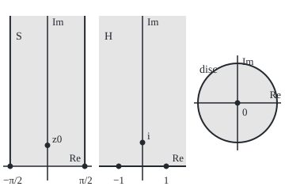

# The Riemann mapping theorem: any region without holes, short of the whole plane, is a disc in disguise, and Schwarz-Christoffel writes the map for polygons

[Syllabus](../../../SYLLABUS.md) → [Complex analysis](../../../SYLLABUS.md#w07) → [Conformal Maps and Harmonic Functions](../../../SYLLABUS.md#w07-s07) → The Riemann mapping theorem

---

## General Overview

A swimming pool of any outline, kidney or L-shape, can be redrawn as a round pool if it has no island: stretched unevenly, every small angle kept, nothing torn or folded. A map that does this is **conformal**: holomorphic (it has a complex derivative at every point), one-to-one, with nonzero derivative ([Conformal maps](01-conformal-maps.md)). From here on the pool is a **region** (an open set in one piece) and the round pool is the **unit disc**, the points at distance less than 1 from 0.

The concrete pool is a half strip: the points z = x + iy with x between −π/2 and π/2 and y above 0. It is a lane of width π, open at the top, with square corners. The function sin z sends it onto the upper half plane, the points with positive imaginary part; the corners land on −1 and 1. The Cayley map $C(w) = (w - i)/(w + i)$, a Möbius map ([Mobius transformations](02-mobius-transformations-and-the-point-at-infinity.md)), then bends the half plane round into the disc, i to 0.

Riemann's theorem says such a map exists and counts them. The Schwarz-Christoffel formula writes it out for polygons, rebuilding sin z from the lane's two corners.

**Every region without holes, other than the whole plane, has a conformal map onto the unit disc, unique once one chosen point goes to the centre with a real, positive derivative there.**

**What kind of fact this is:** a theorem; uniqueness and the disc's self-maps are proved in Why it works, existence is stated from Stein and Shakarchi (chapter 8) with the proof's shape in words.

### The picture: the half strip, the half plane, the disc

<p align="center"></p>

To scale: 30 units per unit length, 50 in the disc. sin z sends the corners to ±1 and z0 = 0.881374i to i; the Cayley step sends i to 0.

---

## The formula

Notation first, in words. A region is **without holes**, or simply connected, when every loop in it shrinks to a point without leaving it. The unit disc is written $\mathbb{D}$. A bar is the conjugate, read "a-bar": $\bar a$ flips the sign of a's imaginary part.

**The Riemann mapping theorem.** Let D be a region without holes, not the whole plane, and $z_0$ a point in it. Exactly one one-to-one holomorphic map $F$ of D onto $\mathbb{D}$ has

$$F(z_0) = 0, \qquad F'(z_0) \text{ real and positive.}$$

**Read it aloud:** one conformal map sends the region onto the disc, the chosen point to the centre, its direction unturned.

Every conformal map of the disc onto itself is a **Blaschke factor** times a turn:

$$\varphi(u) = e^{i\theta}\,\frac{u - a}{1 - \bar a\,u}, \qquad \lvert a\rvert < 1.$$

**Read it aloud:** send the point a to the centre, divide so the rim stays on the rim, then turn by the angle $\theta$.

So the disc's self-maps have three real parameters: two for a, one for $\theta$. $F(z_0) = 0$ fixes a; a positive $F'(z_0)$ fixes $\theta$.

**The Schwarz-Christoffel formula.** Take a polygon with interior angles $\alpha_1\pi, \dots, \alpha_n\pi$, its corners the images of real points $x_1 < \dots < x_n$. With complex constants $A$ (scale and turn) and $B$ (shift), a map of the upper half plane $H$ onto its inside is

$$f(w) = A \int_0^{w} (t - x_1)^{\alpha_1 - 1} \cdots (t - x_n)^{\alpha_n - 1}\, dt + B.$$

**Read it aloud:** each corner gives one factor, a power set by its angle; the integral traces the polygon.

The half strip has right angles, $\alpha_k = 1/2$, at $x_k = \pm 1$; the top, where the walls meet at infinity, is the image of $w = \infty$ and needs no factor. The two factors multiply to $1/\sqrt{t^2 - 1}$, a constant times $1/\sqrt{1 - t^2}$; absorbing it, $A = 1$, $B = 0$:

$$f(w) = \int_0^{w} \frac{dt}{\sqrt{1 - t^2}}, \qquad \sin f(w) = w.$$

| Symbol | Plain meaning | In our example | Push it up and the answer… |
| --- | --- | --- | --- |
| $z$, $w$, $t$ | a point of the region; of the half plane; on the integral's path | $w = 1 + i$ | — |
| $S$, $H$, $\mathbb{D}$ | half strip; upper half plane; unit disc | width π | — |
| $F$, $G$, $z_0$, $y_0$, $w_1$ | the normalised map; a second map; the point $F$ sends to 0, and its height; the point of $H$ that $G$ sends to 0 | $z_0 = 0.881374i$, $w_1 = 1 + 2i$ | — |
| $C$ | the Cayley map $(w - i)/(w + i)$, half plane onto disc | i to 0 | — |
| $a$, $\bar a$ | the point a disc map sends to 0; its conjugate | 0.2 + 0.4i | nearer the rim, larger stretch at a |
| $\varphi$, $\psi$, $\theta$ | Blaschke factor times turn; any disc self-map; the turn | $\theta = -2.214297$ | — |
| $x_k$, $\alpha_k$, $n$ | points that become corners; interior angle over π; corner count | ±1; 1/2; 2 | larger $\alpha_k$, wider corner |
| $f$, $A$, $B$ | the Schwarz-Christoffel map; scale-and-turn; shift | the reverse of sin; 1; 0 | larger A, bigger polygon |

### When it holds

- **No holes.** In the ring 1 < |z| < 2 a loop round the hole cannot shrink; in the disc every loop can, and a map would carry the shrinking back.
- **Not the whole plane.** A map of the plane into the disc is bounded and holomorphic everywhere, so constant by Liouville ([Liouville's theorem](../03-Contour%20Integrals%20and%20Cauchy%27s%20Theorem/07-liouville-and-the-fundamental-theorem-of-algebra.md)).
- **Both normalising conditions.** Drop "real and positive" and every turn of $F$ qualifies.
- **Schwarz-Christoffel.** Straight edges; three corner points $x_k$ are free, the rest solved numerically.

---

## Why it works

### Step 0: maps compose, so only the disc's own maps need listing

If $F$ and $G$ both carry D onto the disc, $G$ after the reverse of $F$ carries the disc onto itself: uniqueness is a question about the disc alone.

### Step 1: a Blaschke factor keeps the rim on the rim

On the rim $\lvert u\rvert = 1$, so $\lvert 1 - \bar a u\rvert = \lvert \bar u - \bar a\rvert = \lvert u - a\rvert$: top and bottom are equal in size. Inside, the maximum modulus principle ([The maximum modulus principle](../04-Taylor%20Series%2C%20Zeros%20and%20Rigidity/05-maximum-modulus-principle.md)) keeps the modulus below 1. It sends a to 0; the factor built on −a undoes it.

### Step 2: every self-map of the disc is a Blaschke factor times a turn

Undo a self-map's choice of centre with a Blaschke factor; what is left fixes 0, and the Schwarz lemma (a disc self-map fixing 0 never moves a point farther from 0) forces a pure turn.

<details>
<summary>Detailed proof: the disc's self-maps</summary>

Let $\psi$ map $\mathbb{D}$ conformally onto itself with $\psi(a) = 0$. Write $\varphi_a(u) = (u - a)/(1 - \bar a u)$, whose reverse is $\varphi_{-a}$. Then $s = \psi \circ \varphi_{-a}$ maps the disc onto itself with $s(0) = 0$.

The Schwarz lemma (folded on the maximum-modulus card) gives $\lvert s(u)\rvert \le \lvert u\rvert$. The reverse of s also fixes 0, so $\lvert u\rvert \le \lvert s(u)\rvert$. Equality everywhere is the lemma's equality case: $s(u) = e^{i\theta}u$, so $\psi = e^{i\theta}\varphi_a$.

</details>

### Step 3: uniqueness spends the three parameters

If $F$ and $G$ both send $z_0$ to 0, Step 2 gives $G = e^{i\theta}F$; positive derivatives force $e^{i\theta} = 1$.

With a moved centre, $G = (\sin z - w_1)/(\sin z - \bar w_1)$, $w_1 = 1 + 2i$, also maps the half strip onto the disc. At five test points it equals the Blaschke factor with a = 0.2 + 0.4i after $F$, turned by $\theta = -2.214297$.

### Step 4: existence, the shape of the proof

1. **Squeeze D into the disc.** D misses a point p; with no holes, $\sqrt{z - p}$ is holomorphic on D. It never takes both q and −q, so its image misses a small disc, and a Möbius map moves it inside $\mathbb{D}$.
2. **Take the most stretching map.** Among one-to-one maps into $\mathbb{D}$ sending $z_0$ to 0, Montel's theorem (bounded holomorphic families have convergent subsequences) gives one with largest $\lvert F'(z_0)\rvert$, still one-to-one.
3. **It fills the disc.** If it missed a point, two Blaschke factors round a square root would stretch more at $z_0$.

### Step 5: why sin z maps the half strip onto the half plane

$\sin(x + iy) = \sin x \cosh y + i \cos x \sinh y$. Inside S, $\cos x > 0$ and $\sinh y > 0$, so the image lies in $H$: $\sin(0.5 + 0.5i) = 0.540613 + 0.457304i$. The floor goes to $\sin x$, from −1 to 1; the right wall to $\cosh y$, from 1 up (1.543081 at height 1); the left wall to the mirror image.

Points with equal sines differ by a multiple of 2π or add to an odd multiple of π; no such pair lies in S, so sin is one-to-one there. Step 6 builds the reverse for every point of $H$: it is onto.

### Step 6: Schwarz-Christoffel rebuilds the same map

Walk t along the real axis. Between −1 and 1, $f'$ is positive: $f$ runs right, along the floor. Past 1, the root of $1 - t^2$ is imaginary and $f$ runs straight up a wall. Each factor turns the direction by $(1 - \alpha_k)\pi$ at its corner and nowhere else.

The corner is $f(1) = \int_0^1 dt/\sqrt{1 - t^2}$. Put $t = 1 - u^2$ to remove the blow-up at 1: the integrand becomes $2/\sqrt{2 - u^2}$. Simpson's rule gives 1.570796 = π/2, with errors 0.000683695, 0.000056456, 0.000003907 on 4, 8, 16 steps. Also $f(i) = 0.881374i = z_0$, matching $\log(1 + \sqrt 2) = 0.881374$; and $f(1 + i) = 0.666239 + 1.061275i$, whose sine is $1 + i$.

So $f$ reverses sin, and $F = i\,C(\sin z)$ is the half strip's Riemann map.

---

## Worked numbers, by hand

| Step | Arithmetic | Value |
| --- | --- | --- |
| corners | $\sin(\pm\pi/2)$ | ±1 |
| right wall at height 1 | $\cosh 1$ | 1.543081 |
| the point sent to i | $\sinh y_0 = 1$, $y_0 = \log(1 + \sqrt 2)$ | $z_0 = 0.881374i$ |
| on to the disc | $F(z_0) = i\,C(i)$ | **0** |
| Cayley stretch at i | $C'(w) = 2i/(w + i)^2$ at i | −0.5i |
| sin stretch at $z_0$ | $\cos(iy_0) = \cosh y_0 = \sqrt 2$ | 1.414214 |
| stretch of $F$ | $i \times (-0.5i) \times \sqrt 2$ | **0.707107** |
| Schwarz-Christoffel corner | $\int_0^1 dt/\sqrt{1 - t^2}$ | **1.570796** |

The factor i turns the stretch at $z_0$ positive: $F$ is the promised map.

### What breaks if you drop a piece

| Mistake | Comes out at | What went wrong |
| --- | --- | --- |
| Whole plane, as a growing disc of radius R | best stretch 1/R: 0.100000, 0.010000, 0.001000 | Only constants map the plane into the disc |
| Strip twice as wide | $\sin(2.5 + i) = 0.923491 - 0.941505i$ | sin is not one-to-one there ($\sin(\pi - z) = \sin z$) and leaves the half plane |
| No condition on direction | derivative −0.707107i at $z_0$ | Every turn of $F$ also works |
| Exponent $+1/2$ for $-1/2$ | corner at 0.785398, not 1.570796 | The power is $\alpha_k - 1$ |

The code prints all four.

---

## Code, from first principles, and it actually runs

Two roads to one map: sin z in closed form, and the Schwarz-Christoffel integral by Simpson's rule, its square root built from the modulus and atan2. They must agree on the corners, the centre point and 1 + i; then $G$ is tested against a turned Blaschke factor after $F$.

### Python

```python
# The Riemann mapping theorem and Schwarz-Christoffel -- the check behind the card.  Standard
# library only.  The half strip S: |Re z| < pi/2, Im z > 0.  Road one: sin z in closed form,
# then a Cayley map onto the disc.  Road two: the Schwarz-Christoffel integral of
# 1/sqrt(1 - t^2), summed by Simpson's rule, which must hit the same corners and undo sin.
import math

def sin(z):                              # sin(x + iy) = sin x cosh y + i cos x sinh y
    x, ch, sh = z.real, (math.exp(z.imag) + math.exp(-z.imag)) / 2, (math.exp(z.imag) - math.exp(-z.imag)) / 2
    return complex(math.sin(x) * ch, math.cos(x) * sh)
def root(w):                             # principal square root, from |w| and atan2
    t = math.atan2(w.imag, w.real) / 2
    return math.sqrt(abs(w)) * complex(math.cos(t), math.sin(t))
def simpson(g, n=2000):                  # integral of g over [0, 1], n even
    return (g(0) + g(1) + sum((4 if k % 2 else 2) * g(k / n) for k in range(1, n))) / (3 * n)
def sc(w):                               # Schwarz-Christoffel: 1/sqrt(1 - t^2) from 0 to w, straight path
    return simpson(lambda s: w / root(1 - (s * w) ** 2))
def cayley(w): return (w - 1j) / (w + 1j)            # upper half plane onto disc, i to 0
def F(z): return 1j * cayley(sin(z))                 # the normalised Riemann map of S
def blaschke(a, u): return (u - a) / (1 - a.conjugate() * u)
def fmt(z):                              # 'a + bi', six decimals, no minus sign on a zero
    re, im = (0.0 if abs(v) < 5e-7 else v for v in (z.real, z.imag))
    return f"{re:.6f} {'-' if im < 0 else '+'} {abs(im):.6f}i"
def d(f, z, h=1e-5): return (f(z + h) - f(z - h)) / (2 * h)
hp, q = math.pi / 2, 30
corner = simpson(lambda u: 2 / math.sqrt(2 - u * u))   # t = 1 - u^2 removes the corner blow-up
z0 = sc(1j)                                            # road two finds the point sent to the centre
w1 = 1 + 2j                                            # a second map of S, sending sin^-1(w1) to 0
G = lambda z: (sin(z) - w1) / (sin(z) - w1.conjugate())
a = 1j * cayley(w1)                                    # = F(z1), where sin z1 = w1
tests = [0.3 + 0.2j, -1.2 + 2.5j, 0.9 + 0.05j, 0.0 + 4.0j, 1.5 + 0.7j]
rot = G(tests[0]) / blaschke(a, F(tests[0]))
miss = max(abs(G(z) - rot * blaschke(a, F(z))) for z in tests)
edge = [complex(-hp + k * math.pi / 200, 0) for k in range(1, 200)] + [complex(s * hp, k / 20) for s in (-1, 1) for k in range(1, 100)]
ring = max(abs(abs(F(z)) - 1) for z in edge) + max(abs(abs(blaschke(a, complex(math.cos(k / 9), math.sin(k / 9)))) - 1) for k in range(57))
print(f"figure, {q} px per unit, 0 at (60, 210) and (180, 210); corners at ({60 - q * hp:.2f}, 210) ({60 + q * hp:.2f}, 210); "
      f"z0 at (60, {210 - q * z0.imag:.2f}); -1, 1, i at ({180 - q:.0f}, 210) ({180 + q:.0f}, 210) (180, {210 - q:.0f}); disc centre (300, 130), radius 50")
print(f"road one, corners: sin(-pi/2) = {fmt(sin(complex(-hp, 0)))}; sin(pi/2) = {fmt(sin(complex(hp, 0)))}")
print(f"road one, edges: sin(pi/2 + 1i) = {fmt(sin(complex(hp, 1)))}; sin(0.5) = {fmt(sin(0.5 + 0j))}; inside sin(0.5 + 0.5i) = {fmt(sin(0.5 + 0.5j))}")
print("road two, corner error |f(1) - pi/2| with 4, 8, 16 steps:", " ".join(f"{abs(simpson(lambda u: 2 / math.sqrt(2 - u * u), n) - hp):.9f}" for n in (4, 8, 16)))
print(f"road two, f(1) = {corner:.6f}; f(-1) = {-corner:.6f}; pi/2 = {hp:.6f}")
print(f"road two, f(i) = {fmt(z0)}; log(1 + sqrt 2) = {math.log(1 + math.sqrt(2)):.6f}")
print(f"road two, f(1 + i) = {fmt(sc(1 + 1j))}; road one, sin of that = {fmt(sin(sc(1 + 1j)))}")
print(f"Riemann map F = i(sin z - i)/(sin z + i): F(z0) = {fmt(F(z0))}; F'(z0) = {fmt(d(F, z0))}; sqrt(2)/2 = {math.sqrt(2) / 2:.6f}")
print(f"by hand: stretch of sin at z0 = {fmt(d(sin, z0))}; of the Cayley step at i = {fmt(d(cayley, 1j))}")
print(f"edges to the circle: ||F| - 1| and ||phi_a| - 1| below 1e-12 on 397 edge and 57 circle points: {'yes' if ring < 1e-12 else 'no'}; |F(0.5 + 0.5i)| = {abs(F(0.5 + 0.5j)):.6f}")
print(f"second map G, w1 = 1 + 2i: a = {fmt(a)}; rotation angle {math.atan2(rot.imag, rot.real):.6f}, |rotation| = {abs(rot):.6f}")
print(f"G equals rotation x Blaschke(a) after F at 5 points, gap below 1e-12: {'yes' if miss < 1e-12 else 'no'}")
print("break 1, the plane as a disc of radius R = 10, 100, 1000: stretch at 0 of z/R =", " ".join(f"{d(lambda z: z / R, 0j).real:.6f}" for R in (10, 100, 1000)))
print(f"break 2, strip twice as wide: sin(2.5 + 1i) = {fmt(sin(2.5 + 1j))}, below the real axis")
print(f"break 3, no rotation: (sin z - i)/(sin z + i) has derivative {fmt(d(lambda z: cayley(sin(z)), z0))} at z0")
print(f"break 4, exponent +1/2 for -1/2: corner at {simpson(lambda u: 2 * u * u * math.sqrt(2 - u * u)):.6f}, not {hp:.6f}")
assert abs(corner - hp) < 1e-9                                  # Simpson's corner = pi/2
assert abs(sin(sc(1 + 1j)) - (1 + 1j)) < 1e-9                   # the SC integral undoes sin
assert abs(F(z0)) < 1e-9 and abs(d(F, z0) - math.sqrt(2) / 2) < 1e-7   # SC's point is the centre; stretch
assert miss < 1e-12 and ring < 1e-12 and abs(abs(rot) - 1) < 1e-12   # every other map is a turn x Blaschke
print("ALL CHECKS PASS")
```

**Ran 2026-09-28 on macOS, Python 3.14.6, standard library only. All checks passed. Output, pasted from the run:**

```
figure, 30 px per unit, 0 at (60, 210) and (180, 210); corners at (12.88, 210) (107.12, 210); z0 at (60, 183.56); -1, 1, i at (150, 210) (210, 210) (180, 180); disc centre (300, 130), radius 50
road one, corners: sin(-pi/2) = -1.000000 + 0.000000i; sin(pi/2) = 1.000000 + 0.000000i
road one, edges: sin(pi/2 + 1i) = 1.543081 + 0.000000i; sin(0.5) = 0.479426 + 0.000000i; inside sin(0.5 + 0.5i) = 0.540613 + 0.457304i
road two, corner error |f(1) - pi/2| with 4, 8, 16 steps: 0.000683695 0.000056456 0.000003907
road two, f(1) = 1.570796; f(-1) = -1.570796; pi/2 = 1.570796
road two, f(i) = 0.000000 + 0.881374i; log(1 + sqrt 2) = 0.881374
road two, f(1 + i) = 0.666239 + 1.061275i; road one, sin of that = 1.000000 + 1.000000i
Riemann map F = i(sin z - i)/(sin z + i): F(z0) = 0.000000 + 0.000000i; F'(z0) = 0.707107 + 0.000000i; sqrt(2)/2 = 0.707107
by hand: stretch of sin at z0 = 1.414214 + 0.000000i; of the Cayley step at i = 0.000000 - 0.500000i
edges to the circle: ||F| - 1| and ||phi_a| - 1| below 1e-12 on 397 edge and 57 circle points: yes; |F(0.5 + 0.5i)| = 0.492822
second map G, w1 = 1 + 2i: a = 0.200000 + 0.400000i; rotation angle -2.214297, |rotation| = 1.000000
G equals rotation x Blaschke(a) after F at 5 points, gap below 1e-12: yes
break 1, the plane as a disc of radius R = 10, 100, 1000: stretch at 0 of z/R = 0.100000 0.010000 0.001000
break 2, strip twice as wide: sin(2.5 + 1i) = 0.923491 - 0.941505i, below the real axis
break 3, no rotation: (sin z - i)/(sin z + i) has derivative 0.000000 - 0.707107i at z0
break 4, exponent +1/2 for -1/2: corner at 0.785398, not 1.570796
ALL CHECKS PASS
```

### Rust

Built with `rustc --edition 2021 -O`.

```rust
// The Riemann mapping theorem and Schwarz-Christoffel -- the same check as the Python, in Rust.
// No crates.  The half strip S: |Re z| < pi/2, Im z > 0.  Road one: sin z in closed form, then
// a Cayley map onto the disc.  Road two: the Schwarz-Christoffel integral of 1/sqrt(1 - t^2),
// summed by Simpson's rule, which must hit the same corners and undo sin.
use std::f64::consts::PI;

#[derive(Clone, Copy)]
struct C { re: f64, im: f64 }
fn c(re: f64, im: f64) -> C { C { re, im } }
fn add(a: C, b: C) -> C { c(a.re + b.re, a.im + b.im) }
fn sub(a: C, b: C) -> C { c(a.re - b.re, a.im - b.im) }
fn mul(a: C, b: C) -> C { c(a.re * b.re - a.im * b.im, a.re * b.im + a.im * b.re) }
fn div(a: C, b: C) -> C { let d = b.re * b.re + b.im * b.im; let t = mul(a, c(b.re, -b.im)); c(t.re / d, t.im / d) }
fn sc_(a: C, k: f64) -> C { c(a.re * k, a.im * k) }
fn md(a: C) -> f64 { a.re.hypot(a.im) }
fn conj(a: C) -> C { c(a.re, -a.im) }
fn sin(z: C) -> C {                                        // sin(x + iy) = sin x cosh y + i cos x sinh y
    let (ch, sh) = ((z.im.exp() + (-z.im).exp()) / 2.0, (z.im.exp() - (-z.im).exp()) / 2.0);
    c(z.re.sin() * ch, z.re.cos() * sh)
}
fn root(w: C) -> C { let t = w.im.atan2(w.re) / 2.0; sc_(c(t.cos(), t.sin()), md(w).sqrt()) }   // principal root
fn simpson(g: &dyn Fn(f64) -> C, n: usize) -> C {        // integral of g over [0, 1], n even
    let mut t = add(g(0.0), g(1.0));
    for k in 1..n { t = add(t, sc_(g(k as f64 / n as f64), if k % 2 == 1 { 4.0 } else { 2.0 })); }
    sc_(t, 1.0 / (3.0 * n as f64))
}
fn sc(w: C) -> C {                                         // Schwarz-Christoffel: 1/sqrt(1 - t^2) from 0 to w
    simpson(&|s| { let t = sc_(w, s); div(w, root(sub(c(1.0, 0.0), mul(t, t)))) }, 2000)
}
fn cayley(w: C) -> C { div(sub(w, c(0.0, 1.0)), add(w, c(0.0, 1.0))) }   // upper half plane onto disc, i to 0
fn ff(z: C) -> C { mul(c(0.0, 1.0), cayley(sin(z))) }     // the normalised Riemann map of S
fn blaschke(a: C, u: C) -> C { div(sub(u, a), sub(c(1.0, 0.0), mul(conj(a), u))) }
fn fmt(z: C) -> String {                                   // 'a + bi', six decimals, no minus sign on a zero
    let (re, im) = (if z.re.abs() < 5e-7 { 0.0 } else { z.re }, if z.im.abs() < 5e-7 { 0.0 } else { z.im });
    format!("{:.6} {} {:.6}i", re, if im < 0.0 { "-" } else { "+" }, im.abs())
}
fn d(f: &dyn Fn(C) -> C, z: C) -> C { sc_(sub(f(add(z, c(1e-5, 0.0))), f(sub(z, c(1e-5, 0.0)))), 1.0 / 2e-5) }
fn yn(b: bool) -> &'static str { if b { "yes" } else { "no" } }
fn main() {
    let (hp, q) = (PI / 2.0, 30.0);
    let corner_n = |n: usize| simpson(&|u| c(2.0 / (2.0 - u * u).sqrt(), 0.0), n).re;   // t = 1 - u^2
    let corner = corner_n(2000);
    let z0 = sc(c(0.0, 1.0));                              // road two finds the point sent to the centre
    let w1 = c(1.0, 2.0);                                  // a second map of S, sending sin^-1(w1) to 0
    let g = |z: C| div(sub(sin(z), w1), sub(sin(z), conj(w1)));
    let a = mul(c(0.0, 1.0), cayley(w1));                  // = F(z1), where sin z1 = w1
    let tests = [c(0.3, 0.2), c(-1.2, 2.5), c(0.9, 0.05), c(0.0, 4.0), c(1.5, 0.7)];
    let rot = div(g(tests[0]), blaschke(a, ff(tests[0])));
    let miss = tests.iter().map(|&z| md(sub(g(z), mul(rot, blaschke(a, ff(z)))))).fold(0.0, f64::max);
    let mut edge: Vec<C> = (1..200).map(|k| c(-hp + k as f64 * PI / 200.0, 0.0)).collect();
    for s in [-1.0, 1.0] { for k in 1..100 { edge.push(c(s * hp, k as f64 / 20.0)); } }
    let ring = edge.iter().map(|&z| (md(ff(z)) - 1.0).abs()).fold(0.0, f64::max)
        + (0..57).map(|k| (md(blaschke(a, c((k as f64 / 9.0).cos(), (k as f64 / 9.0).sin()))) - 1.0).abs()).fold(0.0, f64::max);
    let dz0 = d(&ff, z0);
    let w11 = sc(c(1.0, 1.0));
    println!("figure, {} px per unit, 0 at (60, 210) and (180, 210); corners at ({:.2}, 210) ({:.2}, 210); z0 at (60, {:.2}); -1, 1, i at ({:.0}, 210) ({:.0}, 210) (180, {:.0}); disc centre (300, 130), radius 50",
             q, 60.0 - q * hp, 60.0 + q * hp, 210.0 - q * z0.im, 180.0 - q, 180.0 + q, 210.0 - q);
    println!("road one, corners: sin(-pi/2) = {}; sin(pi/2) = {}", fmt(sin(c(-hp, 0.0))), fmt(sin(c(hp, 0.0))));
    println!("road one, edges: sin(pi/2 + 1i) = {}; sin(0.5) = {}; inside sin(0.5 + 0.5i) = {}", fmt(sin(c(hp, 1.0))), fmt(sin(c(0.5, 0.0))), fmt(sin(c(0.5, 0.5))));
    println!("road two, corner error |f(1) - pi/2| with 4, 8, 16 steps: {}", [4, 8, 16].iter().map(|&n| format!("{:.9}", (corner_n(n) - hp).abs())).collect::<Vec<_>>().join(" "));
    println!("road two, f(1) = {:.6}; f(-1) = {:.6}; pi/2 = {:.6}", corner, -corner, hp);
    println!("road two, f(i) = {}; log(1 + sqrt 2) = {:.6}", fmt(z0), (1.0 + 2f64.sqrt()).ln());
    println!("road two, f(1 + i) = {}; road one, sin of that = {}", fmt(w11), fmt(sin(w11)));
    println!("Riemann map F = i(sin z - i)/(sin z + i): F(z0) = {}; F'(z0) = {}; sqrt(2)/2 = {:.6}", fmt(ff(z0)), fmt(dz0), 2f64.sqrt() / 2.0);
    println!("by hand: stretch of sin at z0 = {}; of the Cayley step at i = {}", fmt(d(&sin, z0)), fmt(d(&cayley, c(0.0, 1.0))));
    println!("edges to the circle: ||F| - 1| and ||phi_a| - 1| below 1e-12 on 397 edge and 57 circle points: {}; |F(0.5 + 0.5i)| = {:.6}", yn(ring < 1e-12), md(ff(c(0.5, 0.5))));
    println!("second map G, w1 = 1 + 2i: a = {}; rotation angle {:.6}, |rotation| = {:.6}", fmt(a), rot.im.atan2(rot.re), md(rot));
    println!("G equals rotation x Blaschke(a) after F at 5 points, gap below 1e-12: {}", yn(miss < 1e-12));
    println!("break 1, the plane as a disc of radius R = 10, 100, 1000: stretch at 0 of z/R = {}",
             [10.0, 100.0, 1000.0].iter().map(|&r| format!("{:.6}", d(&|z| sc_(z, 1.0 / r), c(0.0, 0.0)).re)).collect::<Vec<_>>().join(" "));
    println!("break 2, strip twice as wide: sin(2.5 + 1i) = {}, below the real axis", fmt(sin(c(2.5, 1.0))));
    println!("break 3, no rotation: (sin z - i)/(sin z + i) has derivative {} at z0", fmt(d(&|z| cayley(sin(z)), z0)));
    println!("break 4, exponent +1/2 for -1/2: corner at {:.6}, not {:.6}", simpson(&|u| c(2.0 * u * u * (2.0 - u * u).sqrt(), 0.0), 2000).re, hp);
    assert!((corner - hp).abs() < 1e-9);                                  // Simpson's corner = pi/2
    assert!(md(sub(sin(w11), c(1.0, 1.0))) < 1e-9);                        // the SC integral undoes sin
    assert!(md(ff(z0)) < 1e-9 && md(sub(dz0, c(2f64.sqrt() / 2.0, 0.0))) < 1e-7);   // SC's point is the centre; stretch
    assert!(miss < 1e-12 && ring < 1e-12 && (md(rot) - 1.0).abs() < 1e-12);   // every other map is a turn x Blaschke
    println!("ALL CHECKS PASS");
}
```

**Ran 2026-09-28 on macOS, rustc 1.98.1, no crates. All checks passed. Output, pasted from the run:**

```
figure, 30 px per unit, 0 at (60, 210) and (180, 210); corners at (12.88, 210) (107.12, 210); z0 at (60, 183.56); -1, 1, i at (150, 210) (210, 210) (180, 180); disc centre (300, 130), radius 50
road one, corners: sin(-pi/2) = -1.000000 + 0.000000i; sin(pi/2) = 1.000000 + 0.000000i
road one, edges: sin(pi/2 + 1i) = 1.543081 + 0.000000i; sin(0.5) = 0.479426 + 0.000000i; inside sin(0.5 + 0.5i) = 0.540613 + 0.457304i
road two, corner error |f(1) - pi/2| with 4, 8, 16 steps: 0.000683695 0.000056456 0.000003907
road two, f(1) = 1.570796; f(-1) = -1.570796; pi/2 = 1.570796
road two, f(i) = 0.000000 + 0.881374i; log(1 + sqrt 2) = 0.881374
road two, f(1 + i) = 0.666239 + 1.061275i; road one, sin of that = 1.000000 + 1.000000i
Riemann map F = i(sin z - i)/(sin z + i): F(z0) = 0.000000 + 0.000000i; F'(z0) = 0.707107 + 0.000000i; sqrt(2)/2 = 0.707107
by hand: stretch of sin at z0 = 1.414214 + 0.000000i; of the Cayley step at i = 0.000000 - 0.500000i
edges to the circle: ||F| - 1| and ||phi_a| - 1| below 1e-12 on 397 edge and 57 circle points: yes; |F(0.5 + 0.5i)| = 0.492822
second map G, w1 = 1 + 2i: a = 0.200000 + 0.400000i; rotation angle -2.214297, |rotation| = 1.000000
G equals rotation x Blaschke(a) after F at 5 points, gap below 1e-12: yes
break 1, the plane as a disc of radius R = 10, 100, 1000: stretch at 0 of z/R = 0.100000 0.010000 0.001000
break 2, strip twice as wide: sin(2.5 + 1i) = 0.923491 - 0.941505i, below the real axis
break 3, no rotation: (sin z - i)/(sin z + i) has derivative 0.000000 - 0.707107i at z0
break 4, exponent +1/2 for -1/2: corner at 0.785398, not 1.570796
ALL CHECKS PASS
```

The two outputs match line for line.

> [!TIP]
> **Try changing**
> Guess first, then run it.
> - **Move the second map's target.** Set `w1 = 3 + 0.5j`. The point a and the turn change; the gap line still reads yes.
> - **Coarsen Simpson.** Set `n=2000` to `n=16`. The corner misses π/2 by 0.000003907; the first assert stops the run.
> - **Widen the strip.** In the edge list, change `s * hp` to `s * math.pi`. The walls leave the real axis; the fourth assert fails.

---

## The usual mistake

> [!warning]
> **Reading the theorem as a formula.** It proves the map exists and is unique; it does not write it down. Explicit maps come from recipes such as Schwarz-Christoffel; most regions need numerical work.

---

## Where you meet it in real life

- **Heat and electric fields in odd shapes.** Map to the disc, solve there, carry the answer back ([Solving by mapping](07-solving-boundary-problems-by-mapping.md)); the theorem guarantees the first step.
- **Channels and polygons.** Flow past a step in a channel uses a numerical Schwarz-Christoffel map.

> **Say it back**
> Any region without holes, other than the whole plane, maps conformally onto the unit disc. The map is unique once one point goes to the centre with a positive derivative, because the disc's self-maps, Blaschke factors times turns, have three parameters. sin z sends the half strip of width π onto the upper half plane, corners to ±1. The Schwarz-Christoffel integral rebuilds that map from the two right angles.

---

## What this builds on

- [Solving by mapping](07-solving-boundary-problems-by-mapping.md): why a map onto a simple region is worth having; this card says when one exists.

## Where this goes next

- [The Poisson formula](06-poisson-integral-formula.md): the disc's formula now solves boundary problems on any such region.

Left open: placing the $x_k$ for four or more corners, a numerical problem (Driscoll and Trefethen).

---

## Sources

Verified 28 Sep 2026: every link below resolves to the publisher's page.

- Stein, Elias M., and Rami Shakarchi. *Complex Analysis*. Princeton University Press, 2003. [Publisher page](https://press.princeton.edu/books/hardcover/9780691113852/complex-analysis). Chapter 8: disc self-maps, the theorem with proof, polygon maps.
- Driscoll, Tobin A., and Lloyd N. Trefethen. *Schwarz-Christoffel Mapping*. Cambridge University Press, 2002. [Publisher page](https://doi.org/10.1017/CBO9780511546808). The formula and its numerical computation.
- Lebl, Jiří. *Guide to Cultivating Complex Analysis: Working the Complex Field*. [Author page and full text](https://www.jirka.org/ca/). Free; chapter 6, "Montel and Riemann".
