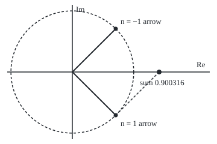
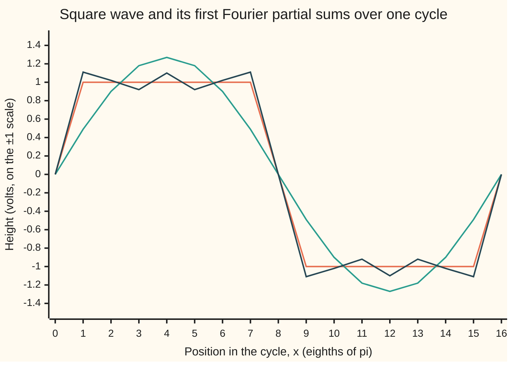

# Fourier series: any repeating signal is a sum of spinning arrows e to the inx, and each coefficient is an average

Complex analysis → Transforms in Outline → Signals as spinning arrows → Fourier series

---

## General Overview

A synthesiser's square-wave oscillator plays A below middle C, 220 cycles a second. Its voltage sits at +1 for half of each cycle and −1 for the other half. It sounds buzzy, unlike a tuning fork on the same note.

The difference is hidden tones. A spectrum analyser shows energy at 220, 660 and 1100 Hz and every further odd multiple of 220, each quieter than the last. Even multiples are silent.

Each pure tone is an arrow spinning round a circle, the point e^(inx) of [eulers-formula](../01-Complex%20Numbers%20and%20the%20Plane/04-eulers-formula.md). How much of each arrow the signal holds is one average over a cycle.

**A signal that repeats every 2π is a sum of arrows c_n e^(inx), each spinning n times per cycle, and each coefficient c_n is the average over one cycle of the signal times e^(−inx).**

**What kind of fact this is:** a theorem. The coefficient formula is proved in Why it works; that the sum returns the signal, under the conditions in When it holds, is proved in fourier-coefficients-and-orthogonality; Parseval's identity is stated, its proof folded.

### The picture: two arrows make one real tone

<p align="center"></p>

To scale: 160 units per 1, origin at (120, 120). At x = π/4 the n = 1 arrow is 0.450158 − 0.450158i, tip at (192.03, 192.03); its partner is 0.450158 + 0.450158i, tip at (192.03, 47.97). Both ride the dashed circle of radius 0.636620, turning opposite ways. Their sum is real: 0.900316, the first tone's height at that moment.

---

## The formula

Notation first, in words. The sigma sign adds the terms for every whole number n, negative ones included. Vertical bars, as in |c|, give the modulus: the length of the arrow c. The coefficient c_n is a complex number: its length sets the loudness of tone n, its angle where that arrow starts.

$$f(x)=\sum_{n=-\infty}^{\infty} c_n\, e^{inx}, \qquad c_n=\frac{1}{2\pi}\int_{-\pi}^{\pi} f(x)\, e^{-inx}\, dx$$

**Read it aloud:** the signal is a sum of spinning arrows; the amount of arrow n is the signal's average over a cycle, once turned back by n times the angle.

Two partner arrows, n and −n, give one real sine-and-cosine pair:

$$a_n=c_n+c_{-n}, \qquad b_n=i\,(c_n - c_{-n}), \qquad f(x)=c_0+\sum_{n=1}^{\infty} \big(a_n \cos nx+b_n \sin nx\big)$$

**Read it aloud:** the cosine amount is the sum of the partners; the sine amount is i times their difference.

For the square wave, f = +1 on (0, π) and −1 on (−π, 0):

$$c_n=\frac{2}{i\pi n}\ \ (n \text{ odd}), \qquad c_n=0\ \ (n \text{ even}), \qquad f(x)=\frac{4}{\pi}\Big(\sin x+\frac{\sin 3x}{3}+\frac{\sin 5x}{5}+\cdots\Big)$$

**Read it aloud:** only odd tones; arrow n > 0 starts straight down, its partner straight up, each of length two over π|n|; as sines, four over π n.

| Symbol | Plain meaning | In our example | Push it up and the answer… |
| --- | --- | --- | --- |
| $x$ | position in the cycle, in radians | x = 2π × 220 × t, t in seconds | the pattern repeats every 2π |
| $f(x)$ | the signal's height at x | +1 on (0, π), −1 on (−π, 0) | every c_n grows in proportion |
| $n$ | tone number; arrow n turns n times per cycle | ±1, ±3, ±5: 220, 660, 1100 Hz | higher pitch, n × 220 Hz |
| $e^{inx}$ | the arrow of length 1 at angle nx | at x = 0 every arrow points to 1 | — |
| $c_n$ | amount of arrow n: length and starting angle | c_1 = −0.636620i, c_(−1) = +0.636620i | falls like 1/n across a jump |
| $a_n$, $b_n$ | cosine and sine amounts in the real form | a_n = 0; b_1, b_3, b_5 = 1.273240, 0.424413, 0.254648 | — |
| $S_N(x)$ | partial sum: the arrows from −N to N added | S_5(π/2) = 1.103474 | closer to f, except next to the jump |
| $N$ | highest tone kept | 1, 5, 21, 101 | overshoot moves toward the jump; its peak falls only toward 1.178980 |

### When it holds

- **Repeats every 2π, finite average size.** Otherwise, as for 1/x near 0, the averages do not exist.
- **Piecewise smooth, for each point.** With finitely many jumps, S_N(x) tends to f(x) where f is continuous and to the jump's midpoint at a jump: 0 at x = 0, however f(0) is set.
- **Also continuous, for uniform closeness.** Only without jumps does the largest error shrink to 0. Beside each jump the square wave's sums overshoot above 1.178980 for every N: the Gibbs phenomenon.
- **Finite average of |f|^2, for closeness on average.** Then the average of |f − S_N|^2 tends to 0 and Parseval holds. All three are proved in fourier-coefficients-and-orthogonality.

---

## Why it works

### Step 0: arrows at different speeds average to nothing

An arrow that turns a whole number of times, k ≠ 0, per cycle points every way equally often, so it averages to 0. An arrow that does not turn averages to 1.

### Step 1: the averages, computed

For a whole number k ≠ 0, e^(ikx) has antiderivative e^(ikx)/(ik), by [eulers-formula](../01-Complex%20Numbers%20and%20the%20Plane/04-eulers-formula.md). At x = π and x = −π it takes the same value, since e^(ikπ) and e^(−ikπ) are both (−1)^k. With k = m − n, e^(imx) e^(−inx) is e^(ikx), so

$$\frac{1}{2\pi}\int_{-\pi}^{\pi} e^{imx}\, e^{-inx}\, dx=\begin{cases} 1 & m=n \\ 0 & m \neq n \end{cases}$$

This is orthogonality: two different arrows, one turned back against the other, average to zero.

### Step 2: each coefficient is an average

Suppose f is a sum of arrows c_m e^(imx). Multiply by e^(−inx), turning every arrow back by n times the angle. Arrow n stops turning; every other arrow still turns. Average over one cycle: by Step 1 only c_n survives. Swapping the average with the infinite sum needs the sum to converge well enough ([complex-limits-series-and-regions](../01-Complex%20Numbers%20and%20the%20Plane/06-complex-limits-series-and-regions.md)).

### Step 3: partners make a real signal

Expand the partners with Euler's formula: c_n e^(inx) + c_(−n) e^(−inx) = (c_n + c_(−n)) cos nx + i(c_n − c_(−n)) sin nx. That gives a_n and b_n. For a real signal c_(−n) is the conjugate of c_n (its mirror image in the real axis), so imaginary parts cancel, as in the picture. The square wave's partners −0.636620i and +0.636620i give a_1 = 0, b_1 = 4/π = 1.273240.

### Step 4: smoothness sets how fast the coefficients fall

If f is smooth and repeats, [integration-by-parts](../../06-Calculus%20and%20analysis/04-Integrals/04-integration-by-parts.md) shows the coefficient of the slope f′ is in times c_n; the boundary terms cancel because both factors repeat. So each derivative buys a factor 1/n. A jump allows none: the square wave's coefficients fall only like 1/n, so it sounds bright. A triangle wave, cornered but unbroken, falls like 1/n^2.

### Step 5: Parseval

The average of |f|^2 over a cycle equals the sum of |c_n|^2: the power of a signal is the sum of the powers of its tones. For the square wave |f|^2 = 1, and each odd pair contributes 2 × 4/(π^2 n^2), so

$$1=\frac{8}{\pi^2}\Big(1+\frac{1}{9}+\frac{1}{25}+\cdots\Big), \qquad 1+\frac{1}{9}+\frac{1}{25}+\cdots=\frac{\pi^2}{8}$$

Three terms give 1.151111; the full odd sum is 1.233700550.

<details>
<summary>Detailed proof: Parseval's identity, in outline</summary>

Let S_N be the sum of the arrows from −N to N. For |n| ≤ N the average of (f − S_N) e^(−inx) is c_n − c_n = 0 by Step 2, so the error f − S_N is orthogonal to S_N.

Orthogonal pieces add their powers, as a right triangle's sides do: the average of |f|^2 is that of |S_N|^2 plus that of |f − S_N|^2, and by Step 1 the first is the sum of |c_n|^2 for |n| ≤ N. For N = 5 the mean-square error is 1 − 0.933056 = 0.066944, matched by integrating (f − S_5)^2.

The error is never negative, so partial sums of |c_n|^2 never exceed the average of |f|^2 (Bessel's inequality). Equality in the limit says the arrows suffice: completeness-of-the-trigonometric-system.

</details>

The real form reaches the same series with three formulas where one does; sampling instead of averaging is [discrete-fourier-transform](02-discrete-fourier-transform.md).

---

## Worked numbers, by hand

| Step | Arithmetic | Value |
| --- | --- | --- |
| Split at the jump | c_n = (1/2π)(integral of e^(−inx) over (0, π) − over (−π, 0)) | two pieces |
| High half | (1 − e^(−inπ))/(in) = (1 − (−1)^n)/(in) | 2/(in) for odd n, 0 for even |
| Low half | (e^(inπ) − 1)/(in) = ((−1)^n − 1)/(in) | −2/(in) for odd n |
| Difference over 2π | (4/(in))/(2π) | 2/(iπn) |
| Odd tones 1, 3, 5 | 2/(iπ), 2/(3iπ), 2/(5iπ) | −0.636620i, −0.212207i, −0.127324i |
| Sine amounts | b_n = i(c_n − c_(−n)) = 4/(πn) | 1.273240, 0.424413, 0.254648 |
| Three tones at x = π/2 | (4/π)(1 − 1/3 + 1/5) | **1.103474** |

Mid-way through the high half, three tones already stand at 1.103474 against a true level of 1: 220, 660 and 1100 Hz carry most of the sound.

### The picture: three tones against the square wave



Orange: the square wave, through 0 at the jumps, where the series lands. Teal: the first tone alone, S_1, height 1.27. Dark blue: tones 1, 3 and 5, S_5, already square-shouldered and rippling about the true level.

### What breaks if you drop a piece

| Mistake | Comes out at | What went wrong |
| --- | --- | --- |
| 1/π in front of the average, not 1/(2π) | c_1 = −1.273240i; S_5(π/2) = 2.206949 | 1/π belongs to the real form; every tone doubles |
| e^(+inx) in the average | c_1 = +0.636620i; S_5(π/2) = −1.103474 | that average is c_(−n): the wave flips |
| Only n > 0 kept | 0.5000 at x = π/2, not 1 | each real tone is two arrows; one gives half |
| Continuity dropped: the value at the jump | S_5(0) = S_101(0) = 0.000000 | a jump gets the midpoint of −1 and +1 |

---

## Code, from first principles, and it actually runs

Two roads to every coefficient, n from −7 to 7: the closed form 2/(iπn), and the average itself by Simpson's rule (a weighted sum over 2,000 slices per half-cycle). Sine amounts come from the partners and from the real average of f times sin nx. Parseval is checked two ways: the odd sum against π^2/8, and S_5's mean-square error against a direct integral. Gibbs peaks approach (2/π) Si(π), where Si(π) is the integral of sin t / t from 0 to π.

### Python

```python
# Fourier series of a square wave -- the check behind the card.  Standard library.
# f(x) = +1 on (0, pi), -1 on (-pi, 0), repeating every 2 pi: a synthesiser's square tone.
# Road 1: the closed form c_n = 2/(i pi n) for odd n, 0 for even n.
# Road 2: each c_n as an average, (1/2 pi) times the integral of f(x) e^(-inx), by Simpson's rule.
# Parseval, the mean-square error and the Gibbs peak each get a second road as well.
import math
PI = math.pi

def show(w):                                  # 'a + bi', six decimals, no -0.000000
    a, b = round(w.real, 6) + 0.0, round(w.imag, 6) + 0.0
    return f"{a:.6f} {'-' if b < 0 else '+'} {abs(b):.6f}i"

def simpson(g, a, b, m=2000):                 # m even panels
    h = (b - a) / m
    return (g(a) + g(b) + sum((4 if k % 2 else 2) * g(a + k * h) for k in range(1, m))) * h / 3

def spin(n, x): return complex(math.cos(n * x), math.sin(n * x))                  # e^(inx)
def average(g): return (simpson(g, 0, PI) - simpson(g, -PI, 0)) / (2 * PI)        # of f(x) g(x)
def closed(n): return 2 / (1j * PI * n) if n % 2 else 0j
def partial(x, N): return sum(closed(n) * spin(n, x) for n in range(-N, N + 1)).real  # S_N(x)

ns = range(-7, 8)
numeric = {n: average(lambda x: spin(-n, x)) for n in ns}
print("c_n closed form, n = 1, 3, 5: " + ", ".join(show(closed(n)) for n in (1, 3, 5)))
print("c_n by averaging, n = 1, 3, 5: " + ", ".join(show(numeric[n]) for n in (1, 3, 5)))
print("c_n by averaging, n = 0, 2, -1: " + ", ".join(show(numeric[n]) for n in (0, 2, -1)))
b_conv = [(1j * (closed(n) - closed(-n))).real for n in (1, 3, 5)]
b_real = [average(lambda x: math.sin(n * x)) * 2 for n in (1, 3, 5)]
print("b_n = i(c_n - c_-n), n = 1, 3, 5: " + ", ".join(f"{b:.6f}" for b in b_conv) + "; by (1/pi) int f sin nx: " + ", ".join(f"{b:.6f}" for b in b_real))
print(f"a_n = c_n + c_-n, n = 1, 3: {(closed(1) + closed(-1)).real:.6f}, {(closed(3) + closed(-3)).real:.6f}; tone 220 Hz: harmonics at {220}, {3 * 220}, {5 * 220} Hz")
xs = [k * PI / 8 for k in range(17)]
print("chart, square wave: " + ", ".join(f"{(0 if k % 8 == 0 else 1 if k < 8 else -1):.2f}" for k in range(17)))
for N, name in ((1, "first harmonic S_1"), (5, "three harmonics S_5")):
    print(f"chart, {name}: " + ", ".join(f"{round(partial(x, N), 2) + 0.0:.2f}" for x in xs))
arrow, partner = closed(1) * spin(1, PI / 4), closed(-1) * spin(-1, PI / 4)
print(f"arrows at x = pi/4: {show(arrow)} + {show(partner)} = {show(arrow + partner)}; |c_1| = {abs(closed(1)):.6f}")
print(f"figure, 160 per unit, origin (120, 120), arrow ({120 + 160 * arrow.real:.2f}, {120 - 160 * arrow.imag:.2f}), partner ({120 + 160 * partner.real:.2f}, {120 - 160 * partner.imag:.2f}), sum ({120 + 160 * (arrow + partner).real:.2f}, 120), radius {160 * abs(closed(1)):.2f}")
p5 = sum(abs(closed(n)) ** 2 for n in range(-5, 6))
odd = sum(1 / n ** 2 for n in range(1, 2 * 10 ** 6, 2)) + 1 / (4 * 10 ** 6)    # plus the tail, about 1/(2N)
print(f"Parseval: 1 + 1/9 + 1/25 = {1 + 1 / 9 + 1 / 25:.6f}; odd n to 2e6 plus tail = {odd:.9f}; pi^2/8 = {PI ** 2 / 8:.9f}")
S5 = lambda x: partial(x, 5)
msq = (simpson(lambda x: (1 - S5(x)) ** 2, 0, PI) + simpson(lambda x: (-1 - S5(x)) ** 2, -PI, 0)) / (2 * PI)
print(f"S_5: sum |c_n|^2 = {p5:.6f}; mean-square error by Parseval {1 - p5:.6f}, by integrating (f - S_5)^2 {msq:.6f}")
peaks = [max(partial(k * 4 * PI / ((N + 1) * 2000), N) for k in range(1, 2001)) for N in (5, 21, 101)]
gibbs = 2 / PI * simpson(lambda t: math.sin(t) / t if t else 1.0, 0, PI)
print("Gibbs peak of S_N, N = 5, 21, 101: " + ", ".join(f"{p:.6f}" for p in peaks) + f"; limit (2/pi) Si(pi) = {gibbs:.6f}")
print(f"hypothesis dropped, at the jump x = 0: S_5 = {partial(0, 5):.6f}, S_101 = {partial(0, 101):.6f}; f is -1 just left, +1 just right")
print(f"mistake, 1/pi for 1/2 pi: c_1 = {show(2 * closed(1))}, S_5(pi/2) = {2 * S5(PI / 2):.6f}; true S_5(pi/2) = {S5(PI / 2):.6f}")
flip = {n: average(lambda x: spin(n, x)) for n in range(-5, 6)}                    # e^(+inx) in the average
print(f"mistake, e^(+inx) in the average: c_1 = {show(flip[1])}, S_5(pi/2) = {sum(flip[n] * spin(n, PI / 2) for n in flip).real:.6f}")
half = sum(closed(n) * spin(n, PI / 2) for n in range(1, 200001, 2))
print(f"mistake, n > 0 only, n to 200000, at x = pi/2: {half.real:.4f} instead of 1")
assert all(abs(numeric[n] - closed(n)) < 1e-9 for n in ns)                        # average against formula
assert all(abs(u - v) < 1e-9 for u, v in zip(b_conv, b_real))                     # complex form against real form
assert abs(msq - (1 - p5)) < 1e-9 and abs(odd - PI ** 2 / 8) < 1e-9               # Parseval, two ways
assert peaks[0] > peaks[1] > peaks[2] > gibbs and peaks[2] - gibbs < 1e-3         # Gibbs does not go away
print("ALL CHECKS PASS")
```

**Ran 2026-09-28 on macOS, Python 3.14.6, standard library only. All checks passed. Output, pasted from the run:**

```
c_n closed form, n = 1, 3, 5: 0.000000 - 0.636620i, 0.000000 - 0.212207i, 0.000000 - 0.127324i
c_n by averaging, n = 1, 3, 5: 0.000000 - 0.636620i, 0.000000 - 0.212207i, 0.000000 - 0.127324i
c_n by averaging, n = 0, 2, -1: 0.000000 + 0.000000i, 0.000000 + 0.000000i, 0.000000 + 0.636620i
b_n = i(c_n - c_-n), n = 1, 3, 5: 1.273240, 0.424413, 0.254648; by (1/pi) int f sin nx: 1.273240, 0.424413, 0.254648
a_n = c_n + c_-n, n = 1, 3: 0.000000, 0.000000; tone 220 Hz: harmonics at 220, 660, 1100 Hz
chart, square wave: 0.00, 1.00, 1.00, 1.00, 1.00, 1.00, 1.00, 1.00, 0.00, -1.00, -1.00, -1.00, -1.00, -1.00, -1.00, -1.00, 0.00
chart, first harmonic S_1: 0.00, 0.49, 0.90, 1.18, 1.27, 1.18, 0.90, 0.49, 0.00, -0.49, -0.90, -1.18, -1.27, -1.18, -0.90, -0.49, 0.00
chart, three harmonics S_5: 0.00, 1.11, 1.02, 0.92, 1.10, 0.92, 1.02, 1.11, 0.00, -1.11, -1.02, -0.92, -1.10, -0.92, -1.02, -1.11, 0.00
arrows at x = pi/4: 0.450158 - 0.450158i + 0.450158 + 0.450158i = 0.900316 + 0.000000i; |c_1| = 0.636620
figure, 160 per unit, origin (120, 120), arrow (192.03, 192.03), partner (192.03, 47.97), sum (264.05, 120), radius 101.86
Parseval: 1 + 1/9 + 1/25 = 1.151111; odd n to 2e6 plus tail = 1.233700550; pi^2/8 = 1.233700550
S_5: sum |c_n|^2 = 0.933056; mean-square error by Parseval 0.066944, by integrating (f - S_5)^2 0.066944
Gibbs peak of S_N, N = 5, 21, 101: 1.188357, 1.179669, 1.179012; limit (2/pi) Si(pi) = 1.178980
hypothesis dropped, at the jump x = 0: S_5 = 0.000000, S_101 = 0.000000; f is -1 just left, +1 just right
mistake, 1/pi for 1/2 pi: c_1 = 0.000000 - 1.273240i, S_5(pi/2) = 2.206949; true S_5(pi/2) = 1.103474
mistake, e^(+inx) in the average: c_1 = 0.000000 + 0.636620i, S_5(pi/2) = -1.103474
mistake, n > 0 only, n to 200000, at x = pi/2: 0.5000 instead of 1
ALL CHECKS PASS
```

### Rust

Same labels, built with `rustc --edition 2021 -O`, with its own complex type.

```rust
// Fourier series of a square wave -- the same check as the Python, in Rust.  No crates.
// f(x) = +1 on (0, pi), -1 on (-pi, 0), repeating every 2 pi: a synthesiser's square tone.
// Road 1: the closed form c_n = 2/(i pi n) for odd n, 0 for even n.
// Road 2: each c_n as an average, (1/2 pi) times the integral of f(x) e^(-inx), by Simpson's rule.
// Parseval, the mean-square error and the Gibbs peak each get a second road as well.
use std::f64::consts::PI;
#[derive(Clone, Copy)]
struct C { re: f64, im: f64 }
fn c(re: f64, im: f64) -> C { C { re, im } }
fn add(a: C, b: C) -> C { c(a.re + b.re, a.im + b.im) }
fn sub(a: C, b: C) -> C { c(a.re - b.re, a.im - b.im) }
fn mul(a: C, b: C) -> C { c(a.re * b.re - a.im * b.im, a.re * b.im + a.im * b.re) }
fn sc(a: C, k: f64) -> C { c(a.re * k, a.im * k) }
fn modulus(a: C) -> f64 { a.re.hypot(a.im) }
fn show(w: C) -> String { // 'a + bi', six decimals, no -0.000000
    let a = format!("{:.6}", w.re);
    let a = if a == "-0.000000" { "0.000000".to_string() } else { a };
    let b = format!("{:.6}", w.im.abs());
    format!("{} {} {}i", a, if w.im < 0.0 && b != "0.000000" { '-' } else { '+' }, b)
}
fn simpson(g: &dyn Fn(f64) -> C, a: f64, b: f64, m: usize) -> C { // m even panels
    let h = (b - a) / m as f64;
    let mut s = add(g(a), g(b));
    for k in 1..m { s = add(s, sc(g(a + k as f64 * h), if k % 2 == 1 { 4.0 } else { 2.0 })) }
    sc(s, h / 3.0)
}
fn spin(n: i64, x: f64) -> C { c((n as f64 * x).cos(), (n as f64 * x).sin()) } // e^(inx)
fn average(g: &dyn Fn(f64) -> C) -> C { sc(sub(simpson(g, 0.0, PI, 2000), simpson(g, -PI, 0.0, 2000)), 1.0 / (2.0 * PI)) } // of f(x) g(x)
fn closed(n: i64) -> C { if n % 2 != 0 { c(0.0, -2.0 / (PI * n as f64)) } else { c(0.0, 0.0) } }
fn partial(x: f64, n: i64) -> f64 { (-n..=n).map(|k| mul(closed(k), spin(k, x)).re).sum() } // S_N(x)
fn real(g: &dyn Fn(f64) -> f64, a: f64, b: f64) -> f64 { simpson(&|x| c(g(x), 0.0), a, b, 2000).re }
fn list(v: &[f64], d: usize) -> String { // d = 2 rounds first, as the Python does, so no -0.00
    v.iter().map(|&x| format!("{:.*}", d, if d == 2 { (x * 100.0).round() / 100.0 + 0.0 } else { x })).collect::<Vec<_>>().join(", ")
}
fn main() {
    let numeric: Vec<C> = (-7..=7).map(|n| average(&|x| spin(-n, x))).collect(); // index n + 7
    println!("c_n closed form, n = 1, 3, 5: {}", [1, 3, 5].map(|n| show(closed(n))).join(", "));
    println!("c_n by averaging, n = 1, 3, 5: {}", [1, 3, 5].map(|n| show(numeric[n as usize + 7])).join(", "));
    println!("c_n by averaging, n = 0, 2, -1: {}", [0i64, 2, -1].map(|n| show(numeric[(n + 7) as usize])).join(", "));
    let b_conv = [1, 3, 5].map(|n| mul(c(0.0, 1.0), sub(closed(n), closed(-n))).re);
    let b_real = [1, 3, 5].map(|n| average(&|x| c((n as f64 * x).sin(), 0.0)).re * 2.0);
    println!("b_n = i(c_n - c_-n), n = 1, 3, 5: {}; by (1/pi) int f sin nx: {}", list(&b_conv, 6), list(&b_real, 6));
    println!("a_n = c_n + c_-n, n = 1, 3: {:.6}, {:.6}; tone 220 Hz: harmonics at {}, {}, {} Hz", add(closed(1), closed(-1)).re, add(closed(3), closed(-3)).re, 220, 3 * 220, 5 * 220);
    let xs: Vec<f64> = (0..17).map(|k| k as f64 * PI / 8.0).collect();
    let sq: Vec<f64> = (0..17).map(|k| if k % 8 == 0 { 0.0 } else if k < 8 { 1.0 } else { -1.0 }).collect();
    println!("chart, square wave: {}", list(&sq, 2));
    for (n, name) in [(1, "first harmonic S_1"), (5, "three harmonics S_5")] {
        println!("chart, {}: {}", name, list(&xs.iter().map(|&x| partial(x, n)).collect::<Vec<_>>(), 2));
    }
    let (arrow, partner) = (mul(closed(1), spin(1, PI / 4.0)), mul(closed(-1), spin(-1, PI / 4.0)));
    let sum = add(arrow, partner);
    println!("arrows at x = pi/4: {} + {} = {}; |c_1| = {:.6}", show(arrow), show(partner), show(sum), modulus(closed(1)));
    println!("figure, 160 per unit, origin (120, 120), arrow ({:.2}, {:.2}), partner ({:.2}, {:.2}), sum ({:.2}, 120), radius {:.2}",
        120.0 + 160.0 * arrow.re, 120.0 - 160.0 * arrow.im, 120.0 + 160.0 * partner.re, 120.0 - 160.0 * partner.im, 120.0 + 160.0 * sum.re, 160.0 * modulus(closed(1)));
    let p5: f64 = (-5..=5).map(|n| modulus(closed(n)).powi(2)).sum();
    let odd: f64 = (1..2_000_000u64).step_by(2).map(|n| 1.0 / (n as f64 * n as f64)).sum::<f64>() + 1.0 / 4e6; // plus the tail
    println!("Parseval: 1 + 1/9 + 1/25 = {:.6}; odd n to 2e6 plus tail = {:.9}; pi^2/8 = {:.9}", 1.0 + 1.0 / 9.0 + 1.0 / 25.0, odd, PI * PI / 8.0);
    let msq = (real(&|x| (1.0 - partial(x, 5)).powi(2), 0.0, PI) + real(&|x| (-1.0 - partial(x, 5)).powi(2), -PI, 0.0)) / (2.0 * PI);
    println!("S_5: sum |c_n|^2 = {:.6}; mean-square error by Parseval {:.6}, by integrating (f - S_5)^2 {:.6}", p5, 1.0 - p5, msq);
    let peaks = [5i64, 21, 101].map(|n| (1..=2000).map(|k| partial(k as f64 * 4.0 * PI / ((n + 1) as f64 * 2000.0), n)).fold(f64::MIN, f64::max));
    let gibbs = 2.0 / PI * real(&|t| if t == 0.0 { 1.0 } else { t.sin() / t }, 0.0, PI);
    println!("Gibbs peak of S_N, N = 5, 21, 101: {}; limit (2/pi) Si(pi) = {:.6}", list(&peaks, 6), gibbs);
    println!("hypothesis dropped, at the jump x = 0: S_5 = {:.6}, S_101 = {:.6}; f is -1 just left, +1 just right", partial(0.0, 5) + 0.0, partial(0.0, 101) + 0.0);
    println!("mistake, 1/pi for 1/2 pi: c_1 = {}, S_5(pi/2) = {:.6}; true S_5(pi/2) = {:.6}", show(sc(closed(1), 2.0)), 2.0 * partial(PI / 2.0, 5), partial(PI / 2.0, 5));
    let flip: Vec<C> = (-5..=5).map(|n| average(&|x| spin(n, x))).collect(); // e^(+inx) in the average
    let rebuilt: f64 = (-5..=5).map(|n| mul(flip[(n + 5) as usize], spin(n, PI / 2.0)).re).sum();
    println!("mistake, e^(+inx) in the average: c_1 = {}, S_5(pi/2) = {:.6}", show(flip[6]), rebuilt);
    let half: f64 = (1..200001i64).step_by(2).map(|n| mul(closed(n), spin(n, PI / 2.0)).re).sum();
    println!("mistake, n > 0 only, n to 200000, at x = pi/2: {:.4} instead of 1", half);
    assert!((-7..=7).all(|n| modulus(sub(numeric[(n + 7) as usize], closed(n))) < 1e-9)); // average against formula
    assert!(b_conv.iter().zip(b_real.iter()).all(|(u, v)| (u - v).abs() < 1e-9)); // complex form against real form
    assert!((msq - (1.0 - p5)).abs() < 1e-9 && (odd - PI * PI / 8.0).abs() < 1e-9); // Parseval, two ways
    assert!(peaks[0] > peaks[1] && peaks[1] > peaks[2] && peaks[2] > gibbs && peaks[2] - gibbs < 1e-3); // Gibbs stays
    println!("ALL CHECKS PASS");
}
```

**Ran 2026-09-28 on macOS, rustc 1.98.1, no crates. All checks passed. Output, pasted from the run:**

```
c_n closed form, n = 1, 3, 5: 0.000000 - 0.636620i, 0.000000 - 0.212207i, 0.000000 - 0.127324i
c_n by averaging, n = 1, 3, 5: 0.000000 - 0.636620i, 0.000000 - 0.212207i, 0.000000 - 0.127324i
c_n by averaging, n = 0, 2, -1: 0.000000 + 0.000000i, 0.000000 + 0.000000i, 0.000000 + 0.636620i
b_n = i(c_n - c_-n), n = 1, 3, 5: 1.273240, 0.424413, 0.254648; by (1/pi) int f sin nx: 1.273240, 0.424413, 0.254648
a_n = c_n + c_-n, n = 1, 3: 0.000000, 0.000000; tone 220 Hz: harmonics at 220, 660, 1100 Hz
chart, square wave: 0.00, 1.00, 1.00, 1.00, 1.00, 1.00, 1.00, 1.00, 0.00, -1.00, -1.00, -1.00, -1.00, -1.00, -1.00, -1.00, 0.00
chart, first harmonic S_1: 0.00, 0.49, 0.90, 1.18, 1.27, 1.18, 0.90, 0.49, 0.00, -0.49, -0.90, -1.18, -1.27, -1.18, -0.90, -0.49, 0.00
chart, three harmonics S_5: 0.00, 1.11, 1.02, 0.92, 1.10, 0.92, 1.02, 1.11, 0.00, -1.11, -1.02, -0.92, -1.10, -0.92, -1.02, -1.11, 0.00
arrows at x = pi/4: 0.450158 - 0.450158i + 0.450158 + 0.450158i = 0.900316 + 0.000000i; |c_1| = 0.636620
figure, 160 per unit, origin (120, 120), arrow (192.03, 192.03), partner (192.03, 47.97), sum (264.05, 120), radius 101.86
Parseval: 1 + 1/9 + 1/25 = 1.151111; odd n to 2e6 plus tail = 1.233700550; pi^2/8 = 1.233700550
S_5: sum |c_n|^2 = 0.933056; mean-square error by Parseval 0.066944, by integrating (f - S_5)^2 0.066944
Gibbs peak of S_N, N = 5, 21, 101: 1.188357, 1.179669, 1.179012; limit (2/pi) Si(pi) = 1.178980
hypothesis dropped, at the jump x = 0: S_5 = 0.000000, S_101 = 0.000000; f is -1 just left, +1 just right
mistake, 1/pi for 1/2 pi: c_1 = 0.000000 - 1.273240i, S_5(pi/2) = 2.206949; true S_5(pi/2) = 1.103474
mistake, e^(+inx) in the average: c_1 = 0.000000 + 0.636620i, S_5(pi/2) = -1.103474
mistake, n > 0 only, n to 200000, at x = pi/2: 0.5000 instead of 1
ALL CHECKS PASS
```

The two outputs match line for line.

> [!TIP]
> **Try changing**
> Guess first, then run it.
> - **A coarse average.** In `simpson`, change `m=2000` to `m=20`. The averages drift to −0.636622i, −0.212266i, −0.127614i; the first assert stops the run.
> - **More tones near the jump.** Change `(5, 21, 101)` to `(5, 21, 401)` in the Gibbs line. The peak is 1.178982: still above 1.178980; every assert passes.
> - **Forget the tail.** Change `1 / (4 * 10 ** 6)` to `0`. The odd sum falls short of π^2/8 by about 1/(4 × 10^6); the third assert stops the run.

---

## The usual mistake

> [!warning]
> **Expecting more tones to remove the overshoot.** The peak beside the jump is 1.188357 up to tone 5, 1.179669 up to 21, 1.179012 up to 101; the limit is 1.178980, not 1. More tones push the overshoot toward the jump, but its height falls only toward 1.178980: convergence at every point, not uniform.
>
> - **Wrong constant.** With 1/π in place of 1/(2π) every coefficient doubles: c_1 = −1.273240i.
> - **Wrong sign in the exponent.** Averaging against e^(+inx) returns c_(−n); the rebuilt wave flips to −1.103474 at x = π/2.
> - **Positive n only.** Half of every real tone is lost: 0.5000 where the wave is 1.

---

## Where you meet it in real life

- **Synthesisers.** A square oscillator has only odd harmonics, falling like 1/n. A filter dimming the upper ones softens the buzz; its action on each coefficient is [convolution-theorem](04-convolution-theorem.md).
- **Heat.** Fourier invented the series for heat flow: each tone of a temperature profile fades at its own rate.
- **Digital audio.** A sampled signal has only finitely many tones, found by [discrete-fourier-transform](02-discrete-fourier-transform.md).

> **Say it back**
> A signal repeating every 2π is a sum of arrows e^(inx), each turning n times per cycle. Different arrows average to zero against each other, so the amount of arrow n is the average of the signal times e^(−inx). Partners n and −n make a real cosine and sine. The square wave has only odd tones, c_n = 2/(iπn), and Parseval gives 1 + 1/9 + 1/25 + … = π^2/8. Beside a jump the sums overshoot to about 1.178980, however many tones are kept.

---

## What this builds on

- [eulers-formula](../01-Complex%20Numbers%20and%20the%20Plane/04-eulers-formula.md): e^(ix) is the point at angle x on the unit circle.
- [complex-limits-series-and-regions](../01-Complex%20Numbers%20and%20the%20Plane/06-complex-limits-series-and-regions.md): when an infinite complex sum converges.
- [integration-by-parts](../../06-Calculus%20and%20analysis/04-Integrals/04-integration-by-parts.md): ties smoothness to how fast coefficients fall.

## Where this goes next

- [discrete-fourier-transform](02-discrete-fourier-transform.md): the same coefficients from finitely many samples.
- [fourier-transform](03-fourier-transform.md): a signal that never repeats; the tones fill a continuum.
- completeness-of-the-trigonometric-system: why the arrows are enough; Parseval in full.
- wieners-lemma-and-invertible-filters: when a filter's action on the coefficients can be undone.
- fourier-coefficients-and-orthogonality: the three kinds of convergence, proved.
- poisson-summation-and-sampling: series and transform tied together.
- equidistribution-and-weyls-criterion: arrow averages deciding whether a sequence spreads evenly.
- isoperimetric-and-four-vertex-theorems: Parseval proving the circle encloses the most area.

A repeating signal has a list of tones; a camera shutter's one-second pulse never repeats, and what replaces the list is [fourier-transform](03-fourier-transform.md).

---

## Sources

Verified 28 Sep 2026: every link below resolves to the publisher's page.

- Stein, Elias M., and Rami Shakarchi. *Fourier Analysis: An Introduction*. Princeton University Press, 2003. [Publisher page](https://press.princeton.edu/books/hardcover/9780691113845/fourier-analysis). Coefficients, convergence and Parseval, with proofs.
- Mattuck, Arthur, Haynes Miller, Jeremy Orloff, and John Lewis. "Fourier Series: Basics." 18.03SC Differential Equations, MIT OpenCourseWare, Fall 2011. [Course page](https://ocw.mit.edu/courses/18-03sc-differential-equations-fall-2011/pages/unit-iii-fourier-series-and-laplace-transform/fourier-series-basics/). Free notes on orthogonality and computing coefficients.
- O'Connor, J. J., and E. F. Robertson. "Joseph Fourier." MacTutor Archive, University of St Andrews. [Biography](https://mathshistory.st-andrews.ac.uk/Biographies/Fourier/). Fourier's heat problem and his series.
