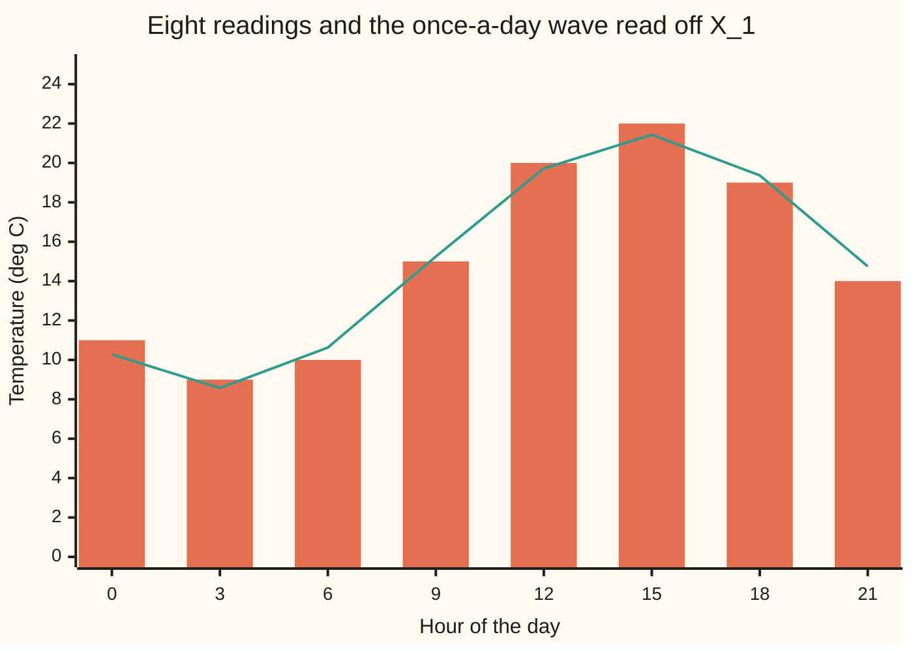
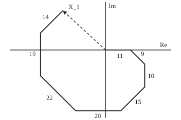

# The discrete Fourier transform: N samples become N frequencies through the N-th roots of unity, and the matrix is unitary

[Syllabus](../../../SYLLABUS.md) → [Complex analysis](../../../SYLLABUS.md#w07) → [Transforms in Outline](../../../SYLLABUS.md#w07-s08) → The discrete Fourier transform

---

## General Overview

A weather station logs the air temperature every three hours. One day gives eight readings, in degrees Celsius: 11 at midnight, then 9, 10, 15, 20, 22, 19, and 14 at 21:00. How big is the daily swing, and when does it peak?

The discrete Fourier transform turns the 8 readings into 8 complex numbers, one per frequency: how much "once a day", "twice a day" and so on they hold. The once-a-day number is −18.899495 + 17.485281i. Its length gives a swing of 6.436837 degrees either side of the mean, 15; its angle puts the peak just before 15:00.

The tool is one 8 by 8 table built from the 8th roots of unity, the eight points on the unit circle whose 8th power is 1. Multiplying by the table is the transform; its mirror image, the conjugate table, divided by 8, undoes it. Nothing is lost: the sum of squared readings, 1968, reappears as the outputs' squared sizes, 15744, divided by 8.

**The discrete Fourier transform multiplies N samples by the N by N matrix of powers of one N-th root of unity; because different powers cancel round the circle, the conjugate matrix divided by N undoes it, and the matrix divided by the square root of N keeps lengths.**

**What kind of fact this is:** a theorem (inversion, the unitary matrix, and Parseval's energy identity), proved on this card in Why it works; the transform itself is a definition.

### The picture: one day of readings and its daily cycle



Bars: the readings. Line: the mean plus the one cosine wave the k = 1 output describes, amplitude 6.436837.

---

## The formula

Notation first, in words. The N samples are $x_n$, with $n$ counting slots from 0 to N − 1. The N outputs are $X_k$, with $k$ counting frequency in whole cycles per record. A bar over a number is its conjugate ([Conjugate and modulus](../01-Complex%20Numbers%20and%20the%20Plane/02-conjugate-and-modulus.md)). The sigma sign adds over the counter under it.

$$w = e^{-2\pi i/N}, \qquad X_k = \sum_{n=0}^{N-1} x_n\, w^{kn}, \qquad x_n = \frac{1}{N}\sum_{k=0}^{N-1} X_k\, \overline{w}^{\,kn}$$

**Read it aloud:** to get frequency k, turn sample n clockwise by k times n steps of one N-th of a circle and add; to get the samples back, turn the other way, add, and divide by N.

As a matrix ([Matrix times vector](../../03-Algebra/04-Matrices/02-matrix-times-vector.md)): $F$ has $w^{kn}$ in row k, column n, and the outputs are $F$ times the samples. Scale it to $U = F/\sqrt{N}$. Then

$$\overline{U}^{\,T} U = I, \qquad \sum_{n=0}^{N-1} \lvert x_n\rvert^2 = \frac{1}{N}\sum_{k=0}^{N-1} \lvert X_k\rvert^2$$

**Read it aloud:** the conjugate transpose of U undoes U, which is what unitary means; so the samples' energy equals the outputs' energy divided by N.

T is the transpose, rows swapped with columns, and I the identity matrix ([Complex vectors and matrices](../01-Complex%20Numbers%20and%20the%20Plane/07-complex-vectors-and-matrices.md)). For real samples, outputs k and N − k are conjugate twins that together make one cosine wave, $A\cos(2\pi kn/N + \varphi)$, with amplitude $A = 2\lvert X_k\rvert/N$ and phase $\varphi = \arg X_k$.

| Symbol | Plain meaning | In our example | Push it up and the answer… |
| --- | --- | --- | --- |
| $N$ | number of samples, and of frequencies | 8 readings, 3 hours apart | finer frequency steps, more work |
| $n$, $k$ | slot counter; cycles per record | n = 5 is 15:00; k = 1 is once a day | k past N/2 mirrors a lower frequency |
| $x_n$ | sample n | 11, 9, 10, 15, 20, 22, 19, 14 | every output moves by its turned share |
| $w$ | one clockwise step, e to the −2πi/N | 0.707107 − 0.707107i | — |
| $X_k$ ($X_0$, $X_1$, $X_7$) | output k | $X_0$ = 120; $X_1$ = −18.899495 + 17.485281i; $X_7$ its conjugate | — |
| $F$, $\overline{F}$ | the matrix of powers of w, and its conjugate | 8 by 8, entries on the unit circle | — |
| $U$ | F divided by the square root of N | keeps lengths | — |
| $A$, $\varphi$ | amplitude and phase of one wave | 6.436837 degrees; 2.395043 rad | a bigger swing; an earlier peak |

### When it holds

- **Any N complex numbers.** Inversion and Parseval hold for every list; the conditions below are for reading k as a frequency.
- **Equally spaced samples.** With uneven spacing, output k no longer measures k cycles per record.
- **The record read as one period.** A record whose end does not join its start leaks energy into every frequency.
- **The 1/N on one side only.** Drop it from the inverse and the samples return 8 times too big: 88, 72, 80.
- **Frequencies above N/2 as mirrors.** Eight samples a day cannot tell 7 cycles a day from 1 cycle run backwards.

---

## Why it works

### Step 0: powers of a root of unity cancel round the circle

The number w is an 8th root of unity, a turn of one eighth of a circle ([Powers and roots](../01-Complex%20Numbers%20and%20the%20Plane/05-powers-roots-and-roots-of-unity.md)). Its eight powers sit evenly round the unit circle and add to zero. So do the powers of w^m whenever m is not a multiple of 8. When m is a multiple of 8, every power is 1 and the sum is 8. Everything below is this one fact.

### Step 1: each output is a walk of turned samples

Take k = 1. Lay the readings end to end as arrows: 11 pointing east, 9 turned an eighth clockwise, 10 a quarter, and so on. Where the walk ends is $X_1$.

<p align="center"></p>

To scale: 4.5 units per degree Celsius. Solid arrows are readings, labelled; the dashed arrow is $X_1$.

A steady day would walk round an octagon back to the start: Step 0. The warm afternoon arrows are longer and point west and north-west, so the walk overshoots that way; the overshoot measures the swing. For k = 0 nothing turns: $X_0$ = 120 is the plain sum, 8 times the mean.

### Step 2: the columns are perpendicular, so the conjugate matrix inverts

Row j of $\overline{F}$ against column k of $F$ adds eight products w^(kn) times the conjugate of w^(jn), each equal to w^((k − j)n), since conjugating a point on the unit circle turns it back. By Step 0 the total is 8 when j = k and 0 otherwise. So $\overline{F}$ times $F$ is 8 times the identity, and dividing by 8 gives the inverse. F is symmetric, since $w^{kn} = w^{nk}$, so $\overline{F}$ is also its conjugate transpose.

### Step 3: unitary means lengths are kept, and that is Parseval

Divide $F$ by the square root of 8 and every column has length 1: $U$ is unitary, a rigid turn in N complex dimensions that stretches nothing. So the samples and $U$ times the samples have the same squared length. Undo the scaling: 15744 = 8 × 1968.

<details>
<summary>Detailed proof: inversion and Parseval for every N</summary>

For a whole number m, if w^m = 1 the sum of w^(mn) over n = 0 to N − 1 is N. Otherwise the geometric-series formula gives (1 − w^(mN)) / (1 − w^m) = 0, since w^(mN) = 1. And w^m = 1 exactly when N divides m, which for a difference of two counters between 0 and N − 1 means the counters are equal.

**Inversion.** The conjugate of w is w^(−1), since w times its conjugate is its squared modulus, 1. Put the forward sum into the inverse: (1/N) times the sum over k of $X_k$ w^(−kn) becomes (1/N) times the sum over slots p of sample p times the sum over k of w^(k(p − n)). The inner sum is N when p = n and 0 otherwise, leaving $x_n$.

**Parseval.** Expand the sum over k of $X_k$ times its conjugate: the inner sum over k of w^(k(n − p)) keeps only slot pairs with n = p, each with factor N, leaving N times the sum of |$x_n$|^2.

</details>

### Step 4: twins make one cosine wave

Real samples make $X_{N-k}$ the conjugate of $X_k$: here $X_7$ = −18.899495 − 17.485281i. In the inverse sum the twins add to twice a real part. With $X_1$ of length 25.747349 and angle 2.395043 rad, that is a cosine of amplitude 2 × 25.747349 / 8 = 6.436837, peaking where its angle is a whole turn, at hour 14.851609.

### Step 5: the fast route

The matrix costs N × N = 64 complex multiplications. Splitting even slots from odd gives two 4-point transforms, stitched by one turn per output pair; repeating the split is the fast Fourier transform, FFT: 12 multiplications for N = 8. The fast Fourier transform builds it properly; the code uses it as the second road.

---

## Worked numbers, by hand

Each power of w has parts 0, ±1 or ±0.707107, so the sums group.

| Step | Arithmetic | Value |
| --- | --- | --- |
| $X_0$ | 11 + 9 + 10 + 15 + 20 + 22 + 19 + 14 | 120 |
| mean | 120 / 8 | 15 |
| real part of $X_1$ | 11 − 20 + 0.707107 × (9 − 15 − 22 + 14) | −18.899495 |
| imaginary part of $X_1$ | −10 + 19 + 0.707107 × (−9 − 15 + 22 + 14) | 17.485281 |
| size of $X_1$ | square root of (18.899495^2 + 17.485281^2) | 25.747349 |
| amplitude | 2 × 25.747349 / 8 | **6.436837 degrees** |
| phase, peak | arg = 2.395043 rad; 2πn/8 + 2.395043 = 2π at n = 4.950536; × 3 hours | **hour 14.851609** |
| energy check | 11^2 + 9^2 + … + 14^2 = 1968; sum of sizes squared 15744, / 8 | **1968 = 1968** |

The day swings 6.436837 degrees about 15, warmest just before 15:00.

### What breaks if you drop a piece

| Mistake | Comes out at | What went wrong |
| --- | --- | --- |
| Inverse without 1/N | 88, 72, 80, … | Each column has squared length 8, not 1 |
| Inverse with F, not its conjugate | 11, 14, 19, 22, 20, 15, 10, 9 | Turning the same way twice runs the day backwards |
| Parseval without 1/N | 15744 against 1968 | The unscaled matrix stretches squared lengths by 8 |
| Amplitude as the size of $X_1$ over N | 3.218419, not 6.436837 | The twin at k = 7 carries the other half |

---

## Code, from first principles, and it actually runs

Two roads to the outputs share no arithmetic: the matrix, built by repeated multiplication by w, and the FFT, which takes each turn from cosine and sine. The inverse is taken twice: by the conjugate matrix, and by adding cosine waves. Rust defines its own complex pair type.

### Python

```python
# The discrete Fourier transform -- the check behind the card.  Standard library only.  Eight
# three-hourly temperatures (deg C, midnight to 21:00).  Road one: the 8 by 8 matrix of powers of
# w = e^(-2 pi i/8).  Road two: the FFT.  Inverse twice: conjugate matrix / N, and a cosine rebuild.
import math
x, N = [11, 9, 10, 15, 20, 22, 19, 14], 8
count = {"matrix": 0, "fft": 0, "inverse": 0}

def fmt(z):
    re, im = round(z.real, 6) + 0.0, round(z.imag, 6) + 0.0
    return f"{re:.6f} {'-' if im < 0 else '+'} {abs(im):.6f}i"
mod, f6 = (lambda z: math.sqrt(z.real ** 2 + z.imag ** 2)), (lambda v: f"{v:.6f}")
def row(zs, f=fmt): return ", ".join(f(z) for z in zs)

w = complex(math.cos(2 * math.pi / N), -math.sin(2 * math.pi / N))
pw = [1 + 0j]
for _ in range(N - 1): pw.append(pw[-1] * w)          # w^0 .. w^7 by repeated multiplication
F = [[pw[k * n % N] for n in range(N)] for k in range(N)]
Fbar = [[z.conjugate() for z in r] for r in F]
def apply(M, v, tag):                                  # road one: matrix times vector
    count[tag] += len(M) * len(v)
    return [sum((m * a for m, a in zip(r, v)), 0j) for r in M]
def fft(a):                                            # road two: halve, recurse, recombine
    n = len(a)
    if n == 1: return [complex(a[0])]
    ev, od, out = fft(a[0::2]), fft(a[1::2]), [0j] * n
    for k in range(n // 2):
        t = complex(math.cos(2 * math.pi * k / n), -math.sin(2 * math.pi * k / n)) * od[k]
        count["fft"] += 1
        out[k], out[k + n // 2] = ev[k] + t, ev[k] - t
    return out
X, Y = apply(F, x, "matrix"), fft(x)
back = [z / N for z in apply(Fbar, X, "inverse")]
amp, ph = [mod(z) for z in X], [math.atan2(z.imag, z.real) for z in X]
cyc = lambda n, k: 2 * amp[k] / N * math.cos(2 * math.pi * k * n / N + ph[k])
rebuild = [X[0].real / N + sum(cyc(n, k) for k in (1, 2, 3)) + X[4].real / N * (-1) ** n for n in range(N)]
curve, peak = [X[0].real / N + cyc(n, 1) for n in range(N)], (-ph[1] / (2 * math.pi) % 1) * 24
e_t, e_f = sum(v * v for v in x), sum(a * a for a in amp)
gap_u = max(mod(sum(Fbar[j][n] * F[k][n] for n in range(N)) / N - (j == k)) for j in range(N) for k in range(N))
walk, s = [], 0j
for n in range(N): s += x[n] * pw[n]; walk.append(f"({210 + 4.5 * s.real:.1f}, {100 - 4.5 * s.imag:.1f})")

print(f"samples, hours 0 to 21: {x}; w = {fmt(w)}; w^8 = {fmt(pw[7] * w)}")
print(f"X by matrix, k = 0..3: {row(X[:4])}\nX by matrix, k = 4..7: {row(X[4:])}")
print(f"FFT matches matrix: {'yes' if max(mod(a - b) for a, b in zip(X, Y)) < 1e-12 else 'no'}; multiplications: matrix {count['matrix']}, FFT {count['fft']}")
print(f"|X_k|, k = 0..7: {row(amp, f6)}")
print(f"daily cycle: mean {X[0].real / N:.6f}, amplitude 2|X_1|/N = {2 * amp[1] / N:.6f}, arg X_1 = {ph[1]:.6f} rad, peak at hour {peak:.6f}")
print(f"mean + daily cycle at the 8 hours: {row(curve, lambda v: f'{v:.2f}')}")
print(f"inverse, conjugate matrix / N: {row((z.real for z in back), f6)}")
print(f"rebuild from amplitudes and phases: {row(rebuild, f6)}")
print(f"Parseval: sum x^2 = {e_t:.6f}; sum |X|^2 = {e_f:.6f}; divided by N = {e_f / N:.6f}\nunitary: conj(F) F / N equals the identity to within 1e-12: {'yes' if gap_u < 1e-12 else 'no'}")
print(f"figure, walk for X_1, 4.5 px per degree, origin (210, 100): {' '.join(walk)}")
print(f"mistake 1, inverse without 1/N: {row((z.real * N for z in back[:3]), f6)}, ...")
print(f"mistake 2, inverse with F, not conj(F): {row((z.real / N for z in apply(F, X, 'inverse')), f6)}")
print(f"mistake 3, Parseval without 1/N: {e_f:.6f} against {e_t:.6f}\nmistake 4, amplitude as |X_1|/N, twin k = 7 forgotten: {amp[1] / N:.6f}, not {2 * amp[1] / N:.6f}")
assert max(mod(a - b) for a, b in zip(X, Y)) < 1e-12                  # matrix against FFT
assert max(abs(b.real - v) + abs(b.imag) for b, v in zip(back, x)) < 1e-12 and max(abs(r - v) for r, v in zip(rebuild, x)) < 1e-12
assert abs(e_t - e_f / N) < 1e-9                                        # Parseval, time side against frequency side
assert gap_u < 1e-12                                                    # the scaled matrix is unitary
print("ALL CHECKS PASS")
```

**Ran 2026-09-28 on macOS, Python 3.14.6, standard library only. All checks passed. Output, pasted from the run:**

```
samples, hours 0 to 21: [11, 9, 10, 15, 20, 22, 19, 14]; w = 0.707107 - 0.707107i; w^8 = 1.000000 + 0.000000i
X by matrix, k = 0..3: 120.000000 + 0.000000i, -18.899495 + 17.485281i, 2.000000 - 2.000000i, 0.899495 - 0.514719i
X by matrix, k = 4..7: 0.000000 + 0.000000i, 0.899495 + 0.514719i, 2.000000 + 2.000000i, -18.899495 - 17.485281i
FFT matches matrix: yes; multiplications: matrix 64, FFT 12
|X_k|, k = 0..7: 120.000000, 25.747349, 2.828427, 1.036352, 0.000000, 1.036352, 2.828427, 25.747349
daily cycle: mean 15.000000, amplitude 2|X_1|/N = 6.436837, arg X_1 = 2.395043 rad, peak at hour 14.851609
mean + daily cycle at the 8 hours: 10.28, 8.57, 10.63, 15.25, 19.72, 21.43, 19.37, 14.75
inverse, conjugate matrix / N: 11.000000, 9.000000, 10.000000, 15.000000, 20.000000, 22.000000, 19.000000, 14.000000
rebuild from amplitudes and phases: 11.000000, 9.000000, 10.000000, 15.000000, 20.000000, 22.000000, 19.000000, 14.000000
Parseval: sum x^2 = 1968.000000; sum |X|^2 = 15744.000000; divided by N = 1968.000000
unitary: conj(F) F / N equals the identity to within 1e-12: yes
figure, walk for X_1, 4.5 px per degree, origin (210, 100): (259.5, 100.0) (288.1, 128.6) (288.1, 173.6) (240.4, 221.4) (150.4, 221.4) (80.4, 151.4) (80.4, 65.9) (125.0, 21.3)
mistake 1, inverse without 1/N: 88.000000, 72.000000, 80.000000, ...
mistake 2, inverse with F, not conj(F): 11.000000, 14.000000, 19.000000, 22.000000, 20.000000, 15.000000, 10.000000, 9.000000
mistake 3, Parseval without 1/N: 15744.000000 against 1968.000000
mistake 4, amplitude as |X_1|/N, twin k = 7 forgotten: 3.218419, not 6.436837
ALL CHECKS PASS
```

### Rust

Same numbers, same labels, built with `rustc --edition 2021 -O`.

```rust
// The discrete Fourier transform -- the same check as the Python, in Rust.  No crates.  Eight
// three-hourly temperatures (deg C, midnight to 21:00).  Road one: the 8 by 8 matrix of powers of
// w = e^(-2 pi i/8).  Road two: the FFT.  Inverse twice: conjugate matrix / N, and a cosine rebuild.
use std::f64::consts::PI;
use std::ops::{Add, Mul, Sub};
#[derive(Clone, Copy)]
struct C { re: f64, im: f64 }
impl Add for C { type Output = C; fn add(self, o: C) -> C { c(self.re + o.re, self.im + o.im) } }
impl Sub for C { type Output = C; fn sub(self, o: C) -> C { c(self.re - o.re, self.im - o.im) } }
impl Mul for C { type Output = C; fn mul(self, o: C) -> C { c(self.re * o.re - self.im * o.im, self.re * o.im + self.im * o.re) } }
fn c(re: f64, im: f64) -> C { C { re, im } }
fn conj(z: C) -> C { c(z.re, -z.im) } fn modu(z: C) -> f64 { (z.re * z.re + z.im * z.im).sqrt() }
fn r6(v: f64) -> f64 { (v * 1e6).round() / 1e6 + 0.0 }
fn fmt(z: C) -> String { let (re, im) = (r6(z.re), r6(z.im)); format!("{:.6} {} {:.6}i", re, if im < 0.0 { "-" } else { "+" }, im.abs()) }
fn row(zs: &[C]) -> String { zs.iter().map(|&z| fmt(z)).collect::<Vec<_>>().join(", ") }
fn rowf(vs: &[f64], d: usize) -> String { vs.iter().map(|v| format!("{:.*}", d, v)).collect::<Vec<_>>().join(", ") }
fn apply(m: &[Vec<C>], v: &[C], count: &mut usize) -> Vec<C> {        // road one: matrix times vector
    *count += m.len() * v.len();
    m.iter().map(|r| r.iter().zip(v).fold(c(0.0, 0.0), |s, (&a, &b)| s + a * b)).collect()
}
fn fft(a: &[C], count: &mut usize) -> Vec<C> {                         // road two: halve, recurse, recombine
    let n = a.len();
    if n == 1 { return vec![a[0]]; }
    let (ev, od): (Vec<C>, Vec<C>) = (a.iter().step_by(2).cloned().collect(), a.iter().skip(1).step_by(2).cloned().collect());
    let (e, o) = (fft(&ev, count), fft(&od, count));
    let mut out = vec![c(0.0, 0.0); n];
    for k in 0..n / 2 {
        let ang = 2.0 * PI * k as f64 / n as f64;
        let t = c(ang.cos(), -ang.sin()) * o[k];
        *count += 1; out[k] = e[k] + t; out[k + n / 2] = e[k] - t;
    }
    out
}
fn main() {
    let (xs, n) = ([11.0, 9.0, 10.0, 15.0, 20.0, 22.0, 19.0, 14.0], 8usize); let nf = n as f64;
    let x: Vec<C> = xs.iter().map(|&v| c(v, 0.0)).collect();
    let (mut cm, mut cf, mut ci) = (0usize, 0usize, 0usize); let w = c((2.0 * PI / nf).cos(), -(2.0 * PI / nf).sin());
    let mut pw = vec![c(1.0, 0.0)];
    for _ in 0..n - 1 { let l = *pw.last().unwrap(); pw.push(l * w); }   // w^0 .. w^7 by repeated multiplication
    let f: Vec<Vec<C>> = (0..n).map(|k| (0..n).map(|j| pw[k * j % n]).collect()).collect();
    let fbar: Vec<Vec<C>> = f.iter().map(|r| r.iter().map(|&z| conj(z)).collect()).collect();
    let (xx, yy) = (apply(&f, &x, &mut cm), fft(&x, &mut cf));
    let back: Vec<f64> = apply(&fbar, &xx, &mut ci).iter().map(|z| z.re / nf).collect();
    let back_im = apply(&fbar, &xx, &mut ci).iter().map(|z| (z.im / nf).abs()).fold(0.0, f64::max);
    let amp: Vec<f64> = xx.iter().map(|&z| modu(z)).collect(); let ph: Vec<f64> = xx.iter().map(|z| z.im.atan2(z.re)).collect();
    let cyc = |j: usize, k: usize| 2.0 * amp[k] / nf * (2.0 * PI * (k * j) as f64 / nf + ph[k]).cos();
    let rebuild: Vec<f64> = (0..n).map(|j| xx[0].re / nf + (1..4).map(|k| cyc(j, k)).sum::<f64>() + xx[4].re / nf * if j % 2 == 0 { 1.0 } else { -1.0 }).collect();
    let curve: Vec<f64> = (0..n).map(|j| xx[0].re / nf + cyc(j, 1)).collect();
    let peak = (-ph[1] / (2.0 * PI)).rem_euclid(1.0) * 24.0;
    let (e_t, e_f) = (xs.iter().map(|v| v * v).sum::<f64>(), amp.iter().map(|a| a * a).sum::<f64>());
    let mut gap_u: f64 = 0.0;
    for j in 0..n { for k in 0..n {
        let s = (0..n).fold(c(0.0, 0.0), |s, m| s + fbar[j][m] * f[k][m]);
        gap_u = gap_u.max(modu(c(s.re / nf - if j == k { 1.0 } else { 0.0 }, s.im / nf)));
    } }
    let (mut s, mut walk) = (c(0.0, 0.0), Vec::new());
    for j in 0..n { s = s + c(xs[j], 0.0) * pw[j]; walk.push(format!("({:.1}, {:.1})", 210.0 + 4.5 * s.re, 100.0 - 4.5 * s.im)); }
    let fft_gap = xx.iter().zip(&yy).map(|(&a, &b)| modu(a - b)).fold(0.0, f64::max); let yes = |b: bool| if b { "yes" } else { "no" };
    println!("samples, hours 0 to 21: {:?}; w = {}; w^8 = {}", xs.iter().map(|&v| v as i32).collect::<Vec<_>>(), fmt(w), fmt(pw[7] * w));
    println!("X by matrix, k = 0..3: {}\nX by matrix, k = 4..7: {}", row(&xx[..4]), row(&xx[4..]));
    println!("FFT matches matrix: {}; multiplications: matrix {}, FFT {}", yes(fft_gap < 1e-12), cm, cf);
    println!("|X_k|, k = 0..7: {}", rowf(&amp, 6));
    println!("daily cycle: mean {:.6}, amplitude 2|X_1|/N = {:.6}, arg X_1 = {:.6} rad, peak at hour {:.6}", xx[0].re / nf, 2.0 * amp[1] / nf, ph[1], peak);
    println!("mean + daily cycle at the 8 hours: {}", rowf(&curve, 2));
    println!("inverse, conjugate matrix / N: {}", rowf(&back, 6));
    println!("rebuild from amplitudes and phases: {}", rowf(&rebuild, 6));
    println!("Parseval: sum x^2 = {:.6}; sum |X|^2 = {:.6}; divided by N = {:.6}", e_t, e_f, e_f / nf);
    println!("unitary: conj(F) F / N equals the identity to within 1e-12: {}", yes(gap_u < 1e-12));
    println!("figure, walk for X_1, 4.5 px per degree, origin (210, 100): {}", walk.join(" "));
    println!("mistake 1, inverse without 1/N: {}, ...", rowf(&back[..3].iter().map(|v| v * nf).collect::<Vec<_>>(), 6));
    println!("mistake 2, inverse with F, not conj(F): {}", rowf(&apply(&f, &xx, &mut ci).iter().map(|z| z.re / nf).collect::<Vec<_>>(), 6));
    println!("mistake 3, Parseval without 1/N: {:.6} against {:.6}", e_f, e_t);
    println!("mistake 4, amplitude as |X_1|/N, twin k = 7 forgotten: {:.6}, not {:.6}", amp[1] / nf, 2.0 * amp[1] / nf);
    assert!(fft_gap < 1e-12);                                                         // matrix against FFT
    assert!(back_im < 1e-12 && back.iter().zip(&xs).all(|(b, v)| (b - v).abs() < 1e-12) && rebuild.iter().zip(&xs).all(|(r, v)| (r - v).abs() < 1e-12));
    assert!((e_t - e_f / nf).abs() < 1e-9);                                           // Parseval, time side against frequency side
    assert!(gap_u < 1e-12);                                                           // the scaled matrix is unitary
    println!("ALL CHECKS PASS");
}
```

**Ran 2026-09-28 on macOS, rustc 1.98.1, no crates. All checks passed. Output, pasted from the run:**

```
samples, hours 0 to 21: [11, 9, 10, 15, 20, 22, 19, 14]; w = 0.707107 - 0.707107i; w^8 = 1.000000 + 0.000000i
X by matrix, k = 0..3: 120.000000 + 0.000000i, -18.899495 + 17.485281i, 2.000000 - 2.000000i, 0.899495 - 0.514719i
X by matrix, k = 4..7: 0.000000 + 0.000000i, 0.899495 + 0.514719i, 2.000000 + 2.000000i, -18.899495 - 17.485281i
FFT matches matrix: yes; multiplications: matrix 64, FFT 12
|X_k|, k = 0..7: 120.000000, 25.747349, 2.828427, 1.036352, 0.000000, 1.036352, 2.828427, 25.747349
daily cycle: mean 15.000000, amplitude 2|X_1|/N = 6.436837, arg X_1 = 2.395043 rad, peak at hour 14.851609
mean + daily cycle at the 8 hours: 10.28, 8.57, 10.63, 15.25, 19.72, 21.43, 19.37, 14.75
inverse, conjugate matrix / N: 11.000000, 9.000000, 10.000000, 15.000000, 20.000000, 22.000000, 19.000000, 14.000000
rebuild from amplitudes and phases: 11.000000, 9.000000, 10.000000, 15.000000, 20.000000, 22.000000, 19.000000, 14.000000
Parseval: sum x^2 = 1968.000000; sum |X|^2 = 15744.000000; divided by N = 1968.000000
unitary: conj(F) F / N equals the identity to within 1e-12: yes
figure, walk for X_1, 4.5 px per degree, origin (210, 100): (259.5, 100.0) (288.1, 128.6) (288.1, 173.6) (240.4, 221.4) (150.4, 221.4) (80.4, 151.4) (80.4, 65.9) (125.0, 21.3)
mistake 1, inverse without 1/N: 88.000000, 72.000000, 80.000000, ...
mistake 2, inverse with F, not conj(F): 11.000000, 14.000000, 19.000000, 22.000000, 20.000000, 15.000000, 10.000000, 9.000000
mistake 3, Parseval without 1/N: 15744.000000 against 1968.000000
mistake 4, amplitude as |X_1|/N, twin k = 7 forgotten: 3.218419, not 6.436837
ALL CHECKS PASS
```

The two outputs match line for line.

> [!TIP]
> **Try changing**
> - **Add 2 to every reading.** Guess first: which outputs move? Only $X_0$: a constant has no swing.
> - **Move the 11 to the end, so the record starts at 03:00.** Guess first: does the amplitude change? No. Only the angles turn, and the peak moves one slot, three hours, earlier on the new clock.
> - **Flip the sign of the sine in w.** Guess first: what happens? Each $X_k$ becomes its conjugate, its twin's value. The FFT still turns clockwise, so the first assert stops the run.

---

## The usual mistake

> [!warning]
> **Where the 1/N goes is a convention, and mixing two conventions breaks every number.** This card puts 1/N on the inverse, as most software does. Some texts put it on the forward sum instead; the unitary form puts one over the square root of N on each side, and Parseval then has no factor. Take this card's forward sum and an inverse that expects the 1/N already paid, and nothing divides: 88 for 11, or 15744 against 1968.

---

## Where you meet it in real life

- **Weather and climate records.** Daily and yearly cycles are read off one output each.
- **Audio and images.** Spectrum displays and compression run on the FFT.
- **Filtering.** Multiplying outputs frequency by frequency is a sliding weighted sum of the samples: [Convolution](04-convolution-theorem.md).

> **Say it back**
> The discrete Fourier transform turns N samples into N outputs by turning sample n through k times n steps of one N-th of a circle and adding. Output k measures k cycles per record; for eight temperatures, output 1 gives a daily swing of 6.436837 degrees peaking near 15:00. Powers of a root of unity cancel, so the conjugate matrix divided by N undoes the transform and energy is kept up to that factor. The FFT gets the same outputs with far fewer multiplications.

---

## What this builds on

- [Powers and roots](../01-Complex%20Numbers%20and%20the%20Plane/05-powers-roots-and-roots-of-unity.md): the roots of unity and their zero sum.
- [Complex vectors and matrices](../01-Complex%20Numbers%20and%20the%20Plane/07-complex-vectors-and-matrices.md): the conjugate transpose and what unitary means.
- [Fourier series](01-fourier-series-in-complex-form.md): the same idea with an integral in place of a finite sum.
- [Matrix times vector](../../03-Algebra/04-Matrices/02-matrix-times-vector.md): the transform as rows times a column.

## Where this goes next

- [Transform pricing](../../12-Financial%20mathematics/06-Numerical%20Methods%20for%20Pricing/09-carr-madan-fft-and-cos-methods.md): option prices for many strikes from one FFT.
- The DFT and the FFT: windows, leakage and spectra of real signals.
- Von Neumann analysis: each grid frequency tested for growth.
- The fast Fourier transform: the even-odd split built and costed.
- Sampling: why k past N/2 is a mirror.
- The large sieve: Parseval-type bounds used to count primes.
- Shor and Grover: the transform as a quantum circuit that finds periods.

Eight readings give eight frequencies; what the spectrum becomes as readings grow dense and the record long is the question [The Fourier transform](03-fourier-transform.md) answers.

---

## Sources

Verified 2026-09-28: every link below resolves to the publisher's page.

- Stein, Elias M., and Rami Shakarchi. *Fourier Analysis: An Introduction*. Princeton University Press, 2003. [Publisher page](https://press.princeton.edu/books/hardcover/9780691113845/fourier-analysis). Chapter 7: inversion and Parseval on N points, and the FFT.
- Smith, Julius O., III. *Mathematics of the Discrete Fourier Transform (DFT)*, 2nd ed. CCRMA, Stanford University. [Full text](https://ccrma.stanford.edu/~jos/mdft/). Roots of unity, the matrix form, the normalised DFT and Parseval.
