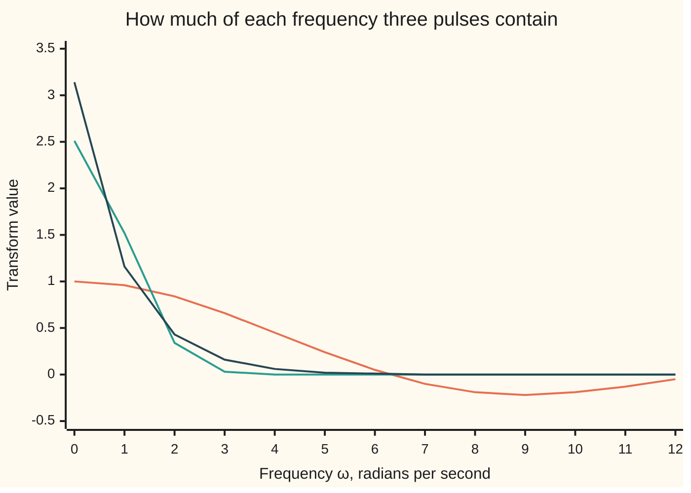
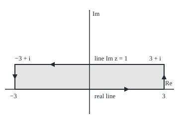

# The Fourier transform: a continuous dial of frequencies, and the Gaussian is its own transform

Complex analysis → Transforms in Outline → Spectra of single pulses → The Fourier transform

---

## General Overview

A camera flash fires once: fully on for one second, centred on noon, off at every other time. It never repeats, so no Fourier series fits it ([fourier-series-in-complex-form](01-fourier-series-in-complex-form.md)).

Still, how much of each steady tone is in it? Pick a frequency ω (omega), in radians per second: ω = 2π is one turn a second. Multiply the flash by a probe wave spinning at that rate and add up over all time. The flash holds 0.958851 at ω = 1, 0.636620 at ω = π, and nothing at ω = 2π, where the probe turns once during the flash and cancels itself.

Done for every ω, this gives the flash's **spectrum**, by a rule called the **Fourier transform**. Frequency becomes a smooth dial, not a list of harmonics.

**The Fourier transform measures how much of each frequency a one-off signal holds, by integrating it against a spinning probe; the Gaussian bell comes back as a bell, and an inverse integral with 1/(2π) in front rebuilds the signal.**

**What kind of fact this is:** a definition; its three transform pairs are theorems proved on this card in Why it works, and the inversion theorem is proved there in outline, fully in a folded proof.

### The picture: three spectra



First line: the flash, 2 sin(ω/2)/ω, below zero past 2π, its ripples shrinking like 1/ω. Second: the Gaussian bell e^(−t^2/2), spectrum √(2π) e^(−ω^2/2). Third: the Cauchy bell 1/(1 + t^2), spectrum π e^(−|ω|). All three are symmetric, so only ω ≥ 0 is drawn.

---

## The formula

Notation first. A hat, $\hat f$, read "f-hat", names the transform of f. The probe $e^{-i\omega t}$ is a point going clockwise round the unit circle, ω radians a second ([eulers-formula](../01-Complex%20Numbers%20and%20the%20Plane/04-eulers-formula.md)).

$$\hat f(\omega) = \int_{-\infty}^{\infty} f(t)\, e^{-i\omega t}\, dt$$

**Read it aloud:** f-hat at ω is the signal times a wave spinning at rate ω, summed over all time.

The **inversion theorem** runs the other way:

$$f(t) = \frac{1}{2\pi}\int_{-\infty}^{\infty} \hat f(\omega)\, e^{i\omega t}\, d\omega$$

**Read it aloud:** the signal at time t is every frequency's share, spun forward to t, summed over the dial, divided by 2π.

The three pairs on this card:

| Signal $f(t)$ | Transform $\hat f(\omega)$ | At ω = 1 |
| --- | --- | --- |
| flash: 1 for −1/2 < t < 1/2, else 0 | 2 sin(ω/2)/ω; 1 at ω = 0 | 0.958851 |
| Gaussian bell e^(−t^2/2) | √(2π) e^(−ω^2/2) | 1.520347 |
| Cauchy bell 1/(1 + t^2) | π e^(−\|ω\|) | 1.155727 |

| Symbol | Plain meaning | In our example | Push it up and the answer… |
| --- | --- | --- | --- |
| $t$ | time, seconds from the pulse's middle | −1/2 to 1/2 | — |
| $\omega$ | frequency, radians per second | 1, π, 2π | the bells fall; the flash ripples toward 0 |
| $f$, $\hat f$ | the signal; its transform, "f-hat" | flash; 2 sin(ω/2)/ω | — |
| $z$, $y$ | a point t + iy; its height, Im z | the line Im z = 1 | — |
| $R$ | half-width of the rectangle | 3, then 8 | its sides fade |
| $\operatorname{Res}$ | residue: the coefficient of 1/(z − z0) near a pole z0 | 0.183940i at −i | — |
| $W$ | where the inverse integral is cut off | 400 | the rebuilt flash sharpens |
| $i$, $\pi$, $e$ | quarter turn, i^2 = −1; half-turn; base of natural logs | pole at −i | — |

### When it holds

- **Finite area under |f|.** For f = 1 the integral from −L to L against e^(−it) swings for ever: 1.978716 at L = 8, −0.575807 at L = 16.
- **Inversion is exact where f is continuous and |f-hat| has finite area.** Both bells qualify. The flash's spectrum shrinks only like 1/ω, and at a jump the inverse gives the midpoint.
- **One convention throughout.** Books using cycles per second move the 2π; mixing conventions is off by 2π.
- **Close the Cauchy loop where the probe decays.** At height y its size is e^(ωy): for ω > 0, close below.

---

## Why it works

### Step 0: a series whose period grows without end

Repeat the flash every T seconds. Its Fourier series uses frequencies 2πk/T, k whole, with coefficients f-hat(2πk/T)/T: samples of the transform. At T = 2, a square wave, the k = 1 coefficient is f-hat(π)/2 = 0.318310.

As T grows the samples fill the ω line, the sum becomes an integral, and the spacing 2π/T becomes dω, so the 1/T becomes the inverse's 1/(2π). Step 4 is the proof.

### Step 1: the flash, by one antiderivative

The integral runs over the flash's one second, and e^(−iωt) has antiderivative e^(−iωt)/(−iω):

$$\hat f(\omega) = \frac{e^{i\omega/2} - e^{-i\omega/2}}{i\omega} = \frac{2i\sin(\omega/2)}{i\omega} = \frac{2\sin(\omega/2)}{\omega}.$$

At ω = 1 this is 0.958851. At ω = 2π the probe turns once during the flash and the sum is 0. At ω = 0 it is the flash's area, 1.

### Step 2: the Gaussian, by sliding the line of integration

Complete the square in the exponent of e^(−t^2/2) e^(−iωt):

$$-\tfrac{t^2}{2} - i\omega t = -\tfrac{(t + i\omega)^2}{2} - \tfrac{\omega^2}{2}.$$

So f-hat(ω) is e^(−ω^2/2) times the integral of e^(−z^2/2) along the line z = t + iω, one unit up at ω = 1.

The function e^(−z^2/2) is holomorphic (it has a complex derivative everywhere), so its integral round any closed loop is 0 ([cauchys-theorem](../03-Contour%20Integrals%20and%20Cauchy%27s%20Theorem/03-cauchys-theorem.md)). Take the rectangle with corners −R, R, R + i, −R + i. At R = 3 the real edge gives 2.499861, the top 2.517307, the right side 0.008723 − 0.000733i, and the loop sums to 0.

On a side the integrand's size is e^(−(R^2 − y^2)/2), which dies fast. At R = 8 both long edges read 2.506628, which is √(2π), the bell's area ([gaussian-integral](../../06-Calculus%20and%20analysis/08-Multiple%20Integrals/04-gaussian-integral.md)). So

$$\int_{-\infty}^{\infty} e^{-t^2/2}\, e^{-i\omega t}\, dt = \sqrt{2\pi}\; e^{-\omega^2/2}.$$

At ω = 1: e^(−1/2) × 2.506628 = 1.520347. The bell comes back as a bell.

### The picture: the rectangle for the Gaussian, ω = 1

<p align="center"></p>

To scale, 50 units to one unit of the plane. The loop runs right, up, left, down; its total is 0, so the top edge equals the bottom once the sides fade.

### Step 3: the Cauchy bell, by a residue

At ω = 1 the integrand is e^(−iz)/(1 + z^2), with poles at ±i, and the probe's size e^(y) decays downward. Close below with a half-circle, whose integral Jordan's lemma sends to 0; the loop is clockwise, so the integral is −2πi times the residue at −i.

Since 1 + z^2 = (z − i)(z + i), the residue is e^(−i·(−i))/(−2i) = e^(−1)/(−2i) = 0.183940i. Then −2πi × 0.183940i = π e^(−1) = 1.155727. The bell is symmetric, so the sine part cancels and this is the cosine integral on the Jordan's lemma card. For ω < 0 close above and get π e^(ω). Together: π e^(−|ω|).

### Step 4: the inversion theorem

**Theorem.** If |f| and |f-hat| both have finite area, the inverse formula returns f(t) wherever f is continuous.

The proof's shape: damp high frequencies with a Gaussian, so the two integrals may swap order. Step 2 turns the damping into a narrow bell of area 1 in time, and the rebuilt value becomes f averaged over a short window round t, which tends to f(t).

The Gaussian rebuilt at t = 1 reads 0.606531, which is e^(−1/2). The Cauchy bell rebuilt reads 1.000000 at t = 0 and 0.500000 at t = 1, which is 1/(1 + t^2). The flash, cut at W = 400, reads 0.998463 inside, 0.500420 at its edge and 0.001298 outside: the jump rebuilds as its midpoint.

<details>
<summary>Detailed proof: the inversion theorem</summary>

For a small width ε > 0, let $I_\varepsilon$ be (1/2π) × the integral of f-hat(ω) e^(iωt) e^(−ε^2 ω^2/2) over ω. The damping rises to 1 as ε → 0 and |f-hat| has finite area, so $I_\varepsilon$ tends to the inverse integral.

Write f-hat as its integral over s. The double integrand is at most |f(s)| e^(−ε^2 ω^2/2), with finite double integral, so the order may swap. The inner integral over ω is Step 2 with time and frequency exchanged: the bell $g_\varepsilon(t - s)$ = e^(−(t − s)^2/(2ε^2))/(ε√(2π)), of area 1. So $I_\varepsilon$ − f(t) is the integral of (f(s) − f(t)) $g_\varepsilon(t - s)$ over s.

Near t, within δ where |f(s) − f(t)| is below a chosen tolerance, the integral is below the tolerance. Beyond δ the bell is at most e^(−δ^2/(2ε^2))/(ε√(2π)), which tends to 0, times the area of |f|, plus |f(t)| times the bell's tail, also tending to 0. So $I_\varepsilon$ → f(t). At a jump each half of the bell carries 1/2: the midpoint.

</details>

The Laplace transform of the flash shifted to start at 0 is (1 − e^(−s))/s ([laplace-transform](05-laplace-transform.md)). At s = i it is 0.841471 − 0.459698i, of size 0.958851: a delay turns the phase and keeps the size.

---

## Worked numbers, by hand

| Step | Arithmetic | Value |
| --- | --- | --- |
| Flash at ω = 1 | 2 sin(1/2)/1 | 0.958851 |
| Flash at ω = π | 2 sin(π/2)/π = 2/π | 0.636620 |
| Gaussian at ω = 1 | √(2π) × e^(−1/2) = 2.506628 × e^(−1/2) | 1.520347 |
| Cauchy residue at −i | e^(−1)/(−2i) | 0.183940i |
| Cauchy at ω = 1 | −2πi × 0.183940i = π e^(−1) | 1.155727 |
| Cauchy rebuilt at t = 0 | (1/2π) × (area under π e^(−\|ω\|), which is 2π) | **1.000000** |

A detector tuned to 1 radian per second sees 0.958851, nearly the flash's whole area; tuned to 2π it sees nothing.

### What breaks if you drop a piece

| Mistake | Comes out at | What went wrong |
| --- | --- | --- |
| Cauchy loop closed upward, ω = 1 | 8.539734, which is π e | the probe grows upward; the arc never fades |
| Inverse without 1/(2π) | 6.283185, Cauchy bell at t = 0 | the 2π belongs to inversion |
| The constant f = 1 | 1.978716 at L = 8, −0.575807 at L = 16 | no finite area, so no limit |
| Flash rebuilt at its edge read as 1 | 0.500420 at t = 1/2 | a jump rebuilds as its midpoint |

The code prints all four.

---

## Code, from first principles, and it actually runs

Two roads to each transform: the closed form or residue, and the defining integral by Simpson's rule (thin parabola-topped strips). The asserts check the roads agree at all thirteen chart frequencies, the residue, the rectangle, and the three inverses.

### Python

```python
# The Fourier transform -- the check behind the card.  Standard library only.
# f-hat(w) = integral of f(t) e^(-iwt) dt over all t, w in radians per second.
# Road 1: closed forms and a residue.  Road 2: the integral itself, summed on the
# real line.  Then the Gaussian's contour shift, and inversion, rebuilt numerically.
import math

def cexp(z): return math.exp(z.real) * complex(math.cos(z.imag), math.sin(z.imag))
def show(z):                                   # 'a + bi', six decimals, no -0.000000
    a, b = round(z.real, 6) + 0.0, round(z.imag, 6) + 0.0
    return f"{a:.6f} {'-' if b < 0 else '+'} {abs(b):.6f}i"
def simpson(g, lo, hi, n=20000):               # Simpson's rule, n even
    h = (hi - lo) / n
    return h / 3 * sum((1 if j in (0, n) else 4 if j % 2 else 2) * g(lo + j * h) for j in range(n + 1))
def pulse(w): return 2 * math.sin(w / 2) / w if w else 1.0
def gauss(w): return math.sqrt(2 * math.pi) * math.exp(-w * w / 2)
def cauchy(w): return math.pi * math.exp(-abs(w))
def pulse_n(w): return simpson(lambda t: cexp(-1j * w * t), -0.5, 0.5)
def gauss_n(w): return simpson(lambda t: cexp(complex(-t * t / 2, -w * t)), -12, 12)
def cauchy_n(w, L=400.0):                      # even: 2 x cosine integral to L, plus the tail by parts
    tail = -math.sin(w * L) / (w * (1 + L * L)) + 2 * L * math.cos(w * L) / (w * w * (1 + L * L) ** 2)
    return 2 * (simpson(lambda t: math.cos(w * t) / (1 + t * t), 0, L, 80000) + tail)

w = 1.0
print(f"pulse, w = 1: 2 sin(w/2)/w {pulse(w):.6f}; Simpson on the pulse {show(pulse_n(w))}; "
      f"w = pi: {pulse(math.pi):.6f}; w = 2 pi: {pulse(2 * math.pi):.6f}; w = 0: {pulse(0):.6f}")
print(f"Gaussian, w = 1: sqrt(2 pi) e^(-w^2/2) {gauss(w):.6f}; Simpson on the real line {show(gauss_n(w))}")
res = cexp(-1j * w * -1j) / (-2j)              # e^(-iwz)/(z - i), at z = -i
print(f"Cauchy, w = 1: residue at -i {show(res)}; clockwise, -2 pi i x residue {show(-2j * math.pi * res)}")
print(f"Cauchy, w = 1: pi e^(-|w|) {cauchy(w):.6f}; Simpson to 400 plus tail {cauchy_n(w):.6f}")
g = lambda z: cexp(-z * z / 2)                 # the Gaussian, holomorphic everywhere
edges = {}
for R in (3, 8):
    bot, top = simpson(g, -R, R), simpson(lambda t: g(complex(t, w)), -R, R)
    rt, lf = simpson(lambda y: 1j * g(complex(R, y)), 0, w), simpson(lambda y: 1j * g(complex(-R, y)), 0, w)
    edges[R] = (bot, top, bot + rt - top - lf)
    print(f"R = {R}: real line {show(bot)}; line Im z = 1 {show(top)}; right side {show(rt)}; loop {show(edges[R][2])}")
print(f"shifted: e^(-1/2) x (line Im z = 1, R = 8) = {show(math.exp(-0.5) * edges[8][1])}")
print("figure, 50 units per unit, origin (180, 180): -3 at (30, 180), 3 at (330, 180), 3 + i at (330, 130), -3 + i at (30, 130)")
ws = range(13)
for name, F in (("pulse", pulse), ("Gaussian", gauss), ("Cauchy", cauchy)):
    print(f"chart, {name} at w = 0 to 12: " + ", ".join(f"{F(k):.2f}" for k in ws))
back_g = simpson(lambda v: gauss(v) * math.cos(v), -12, 12) / (2 * math.pi)
back_c = [simpson(lambda v: cauchy(v) * math.cos(v * t), 0, 40) / math.pi for t in (0, 1)]
back_p = [simpson(lambda v: pulse(v) * math.cos(v * t), 0, 400, 40000) / math.pi for t in (0, 0.5, 1)]
print(f"inverse, Gaussian at t = 1: {back_g:.6f} against e^(-1/2) {math.exp(-0.5):.6f}")
print(f"inverse, Cauchy at t = 0: {back_c[0]:.6f}, at t = 1: {back_c[1]:.6f} against 1/(1 + t^2)")
print(f"inverse, pulse with w cut at 400, t = 0, 1/2, 1: " + ", ".join(f"{v:.6f}" for v in back_p))
lap = (1 - cexp(-1j * w)) / (1j * w)           # Laplace transform (1 - e^(-s))/s of the pulse on [0, 1], s = iw
print(f"Laplace cross-check, s = i: {show(lap)}, size {abs(lap):.6f}")
print(f"mistake, closed upward at w = 1: 2 pi i x residue at i {show(2j * math.pi * cexp(w) / 2j)}")
print(f"mistake, inverse without 1/(2 pi): Cauchy at t = 0 gives {2 * math.pi * back_c[0]:.6f}")
print(f"mistake, f = 1 on -L to L at w = 1: L = 8 {show(simpson(lambda t: cexp(-1j * t), -8, 8))}, "
      f"L = 16 {show(simpson(lambda t: cexp(-1j * t), -16, 16))}")
assert all(abs(pulse_n(k) - pulse(k)) < 1e-9 and abs(gauss_n(k) - gauss(k)) < 1e-9 for k in ws)
assert all(abs(cauchy_n(k) - cauchy(k)) < 1e-7 for k in range(1, 7)) and abs(-2j * math.pi * res - cauchy(w)) < 1e-12
assert abs(edges[8][2]) < 1e-9 and abs(math.exp(-0.5) * edges[8][1] - gauss_n(w)) < 1e-9
assert abs(back_g - math.exp(-0.5)) < 1e-9 and abs(back_c[1] - 0.5) < 1e-9 and abs(back_p[1] - 0.5) < 2e-3
print("ALL CHECKS PASS")
```

**Ran 2026-09-28 on macOS, Python 3.14.6, standard library only. All checks passed. Output, pasted from the run:**

```
pulse, w = 1: 2 sin(w/2)/w 0.958851; Simpson on the pulse 0.958851 + 0.000000i; w = pi: 0.636620; w = 2 pi: 0.000000; w = 0: 1.000000
Gaussian, w = 1: sqrt(2 pi) e^(-w^2/2) 1.520347; Simpson on the real line 1.520347 + 0.000000i
Cauchy, w = 1: residue at -i 0.000000 + 0.183940i; clockwise, -2 pi i x residue 1.155727 + 0.000000i
Cauchy, w = 1: pi e^(-|w|) 1.155727; Simpson to 400 plus tail 1.155727
R = 3: real line 2.499861 + 0.000000i; line Im z = 1 2.517307 + 0.000000i; right side 0.008723 - 0.000733i; loop 0.000000 + 0.000000i
R = 8: real line 2.506628 + 0.000000i; line Im z = 1 2.506628 + 0.000000i; right side 0.000000 + 0.000000i; loop 0.000000 + 0.000000i
shifted: e^(-1/2) x (line Im z = 1, R = 8) = 1.520347 + 0.000000i
figure, 50 units per unit, origin (180, 180): -3 at (30, 180), 3 at (330, 180), 3 + i at (330, 130), -3 + i at (30, 130)
chart, pulse at w = 0 to 12: 1.00, 0.96, 0.84, 0.66, 0.45, 0.24, 0.05, -0.10, -0.19, -0.22, -0.19, -0.13, -0.05
chart, Gaussian at w = 0 to 12: 2.51, 1.52, 0.34, 0.03, 0.00, 0.00, 0.00, 0.00, 0.00, 0.00, 0.00, 0.00, 0.00
chart, Cauchy at w = 0 to 12: 3.14, 1.16, 0.43, 0.16, 0.06, 0.02, 0.01, 0.00, 0.00, 0.00, 0.00, 0.00, 0.00
inverse, Gaussian at t = 1: 0.606531 against e^(-1/2) 0.606531
inverse, Cauchy at t = 0: 1.000000, at t = 1: 0.500000 against 1/(1 + t^2)
inverse, pulse with w cut at 400, t = 0, 1/2, 1: 0.998463, 0.500420, 0.001298
Laplace cross-check, s = i: 0.841471 - 0.459698i, size 0.958851
mistake, closed upward at w = 1: 2 pi i x residue at i 8.539734 + 0.000000i
mistake, inverse without 1/(2 pi): Cauchy at t = 0 gives 6.283185
mistake, f = 1 on -L to L at w = 1: L = 8 1.978716 + 0.000000i, L = 16 -0.575807 + 0.000000i
ALL CHECKS PASS
```

### Rust

Same numbers, same labels, built with `rustc --edition 2021 -O`.

```rust
// The Fourier transform -- the same check as the Python, in Rust.  No crates.
// f-hat(w) = integral of f(t) e^(-iwt) dt over all t, w in radians per second.
// Road 1: closed forms and a residue.  Road 2: the integral itself, summed on the
// real line.  Then the Gaussian's contour shift, and inversion, rebuilt numerically.
use std::f64::consts::PI;
#[derive(Clone, Copy)] struct C { re: f64, im: f64 }
fn c(re: f64, im: f64) -> C { C { re, im } }
fn add(a: C, b: C) -> C { c(a.re + b.re, a.im + b.im) }
fn sub(a: C, b: C) -> C { c(a.re - b.re, a.im - b.im) }
fn mul(a: C, b: C) -> C { c(a.re * b.re - a.im * b.im, a.re * b.im + a.im * b.re) }
fn div(a: C, b: C) -> C { let d = b.re * b.re + b.im * b.im; c((a.re * b.re + a.im * b.im) / d, (a.im * b.re - a.re * b.im) / d) }
fn scale(a: C, k: f64) -> C { c(a.re * k, a.im * k) }
fn abs(a: C) -> f64 { a.re.hypot(a.im) }
fn cexp(z: C) -> C { scale(c(z.im.cos(), z.im.sin()), z.re.exp()) }
fn show(z: C) -> String { // 'a + bi', six decimals, no -0.000000
    let a = format!("{:.6}", z.re); let a = if a == "-0.000000" { "0.000000".to_string() } else { a };
    let b = format!("{:.6}", z.im.abs());
    format!("{} {} {}i", a, if z.im < 0.0 && b != "0.000000" { '-' } else { '+' }, b)
}
fn simpson(g: &dyn Fn(f64) -> C, lo: f64, hi: f64, n: usize) -> C { // Simpson's rule, n even
    let h = (hi - lo) / n as f64;
    let mut s = c(0.0, 0.0); for j in 0..=n { let k = if j == 0 || j == n { 1.0 } else if j % 2 == 1 { 4.0 } else { 2.0 }; s = add(s, scale(g(lo + j as f64 * h), k)) }
    scale(s, h / 3.0)
}
fn simr(g: &dyn Fn(f64) -> f64, lo: f64, hi: f64, n: usize) -> f64 { simpson(&|t| c(g(t), 0.0), lo, hi, n).re }
fn pulse(w: f64) -> f64 { if w == 0.0 { 1.0 } else { 2.0 * (w / 2.0).sin() / w } }
fn gauss(w: f64) -> f64 { (2.0 * PI).sqrt() * (-w * w / 2.0).exp() }
fn cauchy(w: f64) -> f64 { PI * (-w.abs()).exp() }
fn pulse_n(w: f64) -> C { simpson(&|t| cexp(c(0.0, -w * t)), -0.5, 0.5, 20000) }
fn gauss_n(w: f64) -> C { simpson(&|t| cexp(c(-t * t / 2.0, -w * t)), -12.0, 12.0, 20000) }
fn cauchy_n(w: f64) -> f64 { // even: 2 x cosine integral to L, plus the tail by parts
    let l = 400.0;
    let tail = -(w * l).sin() / (w * (1.0 + l * l)) + 2.0 * l * (w * l).cos() / (w * w * (1.0 + l * l).powi(2));
    2.0 * (simr(&|t| (w * t).cos() / (1.0 + t * t), 0.0, l, 80000) + tail)
}
fn main() {
    let w = 1.0;
    println!("pulse, w = 1: 2 sin(w/2)/w {:.6}; Simpson on the pulse {}; w = pi: {:.6}; w = 2 pi: {:.6}; w = 0: {:.6}",
        pulse(w), show(pulse_n(w)), pulse(PI), pulse(2.0 * PI), pulse(0.0));
    println!("Gaussian, w = 1: sqrt(2 pi) e^(-w^2/2) {:.6}; Simpson on the real line {}", gauss(w), show(gauss_n(w)));
    let res = div(cexp(c(-w, 0.0)), c(0.0, -2.0)); // e^(-iwz)/(z - i), at z = -i
    let road1 = mul(c(0.0, -2.0 * PI), res);
    println!("Cauchy, w = 1: residue at -i {}; clockwise, -2 pi i x residue {}", show(res), show(road1));
    println!("Cauchy, w = 1: pi e^(-|w|) {:.6}; Simpson to 400 plus tail {:.6}", cauchy(w), cauchy_n(w));
    let g = |z: C| cexp(scale(mul(z, z), -0.5)); // the Gaussian, holomorphic everywhere
    let mut edges = Vec::new();
    for r in [3.0f64, 8.0] {
        let (bot, top) = (simpson(&|t| g(c(t, 0.0)), -r, r, 20000), simpson(&|t| g(c(t, w)), -r, r, 20000));
        let rt = simpson(&|y| mul(c(0.0, 1.0), g(c(r, y))), 0.0, w, 20000);
        let lf = simpson(&|y| mul(c(0.0, 1.0), g(c(-r, y))), 0.0, w, 20000);
        let lp = sub(sub(add(bot, rt), top), lf);
        println!("R = {}: real line {}; line Im z = 1 {}; right side {}; loop {}", r, show(bot), show(top), show(rt), show(lp));
        edges.push((top, lp));
    }
    println!("shifted: e^(-1/2) x (line Im z = 1, R = 8) = {}", show(scale(edges[1].0, (-0.5f64).exp())));
    println!("figure, 50 units per unit, origin (180, 180): -3 at (30, 180), 3 at (330, 180), 3 + i at (330, 130), -3 + i at (30, 130)");
    let fs: [(&str, fn(f64) -> f64); 3] = [("pulse", pulse), ("Gaussian", gauss), ("Cauchy", cauchy)];
    for (name, f) in fs {
        let v: Vec<String> = (0..13).map(|k| format!("{:.2}", f(k as f64))).collect();
        println!("chart, {} at w = 0 to 12: {}", name, v.join(", "));
    }
    let back_g = simr(&|v| gauss(v) * v.cos(), -12.0, 12.0, 20000) / (2.0 * PI);
    let back_c: Vec<f64> = [0.0f64, 1.0].iter().map(|&t| simr(&|v| cauchy(v) * (v * t).cos(), 0.0, 40.0, 20000) / PI).collect();
    let back_p: Vec<f64> = [0.0f64, 0.5, 1.0].iter().map(|&t| simr(&|v| pulse(v) * (v * t).cos(), 0.0, 400.0, 40000) / PI).collect();
    println!("inverse, Gaussian at t = 1: {:.6} against e^(-1/2) {:.6}", back_g, (-0.5f64).exp());
    println!("inverse, Cauchy at t = 0: {:.6}, at t = 1: {:.6} against 1/(1 + t^2)", back_c[0], back_c[1]);
    println!("inverse, pulse with w cut at 400, t = 0, 1/2, 1: {:.6}, {:.6}, {:.6}", back_p[0], back_p[1], back_p[2]);
    let lap = div(sub(c(1.0, 0.0), cexp(c(0.0, -w))), c(0.0, w)); // Laplace (1 - e^(-s))/s of the pulse on [0, 1], s = iw
    println!("Laplace cross-check, s = i: {}, size {:.6}", show(lap), abs(lap));
    println!("mistake, closed upward at w = 1: 2 pi i x residue at i {}", show(mul(c(0.0, 2.0 * PI), div(cexp(c(w, 0.0)), c(0.0, 2.0)))));
    println!("mistake, inverse without 1/(2 pi): Cauchy at t = 0 gives {:.6}", 2.0 * PI * back_c[0]);
    let flat = |l: f64| simpson(&|t| cexp(c(0.0, -t)), -l, l, 20000);
    println!("mistake, f = 1 on -L to L at w = 1: L = 8 {}, L = 16 {}", show(flat(8.0)), show(flat(16.0)));
    assert!((0..13).all(|k| { let k = k as f64; abs(sub(pulse_n(k), c(pulse(k), 0.0))) < 1e-9 && abs(sub(gauss_n(k), c(gauss(k), 0.0))) < 1e-9 }));
    assert!((1..7).all(|k| (cauchy_n(k as f64) - cauchy(k as f64)).abs() < 1e-7) && abs(sub(road1, c(cauchy(w), 0.0))) < 1e-12);
    assert!(abs(edges[1].1) < 1e-9 && abs(sub(scale(edges[1].0, (-0.5f64).exp()), gauss_n(w))) < 1e-9);
    assert!((back_g - (-0.5f64).exp()).abs() < 1e-9 && (back_c[1] - 0.5).abs() < 1e-9 && (back_p[1] - 0.5).abs() < 2e-3);
    println!("ALL CHECKS PASS");
}
```

**Ran 2026-09-28 on macOS, rustc 1.98.1, no crates. All checks passed. Output, pasted from the run:**

```
pulse, w = 1: 2 sin(w/2)/w 0.958851; Simpson on the pulse 0.958851 + 0.000000i; w = pi: 0.636620; w = 2 pi: 0.000000; w = 0: 1.000000
Gaussian, w = 1: sqrt(2 pi) e^(-w^2/2) 1.520347; Simpson on the real line 1.520347 + 0.000000i
Cauchy, w = 1: residue at -i 0.000000 + 0.183940i; clockwise, -2 pi i x residue 1.155727 + 0.000000i
Cauchy, w = 1: pi e^(-|w|) 1.155727; Simpson to 400 plus tail 1.155727
R = 3: real line 2.499861 + 0.000000i; line Im z = 1 2.517307 + 0.000000i; right side 0.008723 - 0.000733i; loop 0.000000 + 0.000000i
R = 8: real line 2.506628 + 0.000000i; line Im z = 1 2.506628 + 0.000000i; right side 0.000000 + 0.000000i; loop 0.000000 + 0.000000i
shifted: e^(-1/2) x (line Im z = 1, R = 8) = 1.520347 + 0.000000i
figure, 50 units per unit, origin (180, 180): -3 at (30, 180), 3 at (330, 180), 3 + i at (330, 130), -3 + i at (30, 130)
chart, pulse at w = 0 to 12: 1.00, 0.96, 0.84, 0.66, 0.45, 0.24, 0.05, -0.10, -0.19, -0.22, -0.19, -0.13, -0.05
chart, Gaussian at w = 0 to 12: 2.51, 1.52, 0.34, 0.03, 0.00, 0.00, 0.00, 0.00, 0.00, 0.00, 0.00, 0.00, 0.00
chart, Cauchy at w = 0 to 12: 3.14, 1.16, 0.43, 0.16, 0.06, 0.02, 0.01, 0.00, 0.00, 0.00, 0.00, 0.00, 0.00
inverse, Gaussian at t = 1: 0.606531 against e^(-1/2) 0.606531
inverse, Cauchy at t = 0: 1.000000, at t = 1: 0.500000 against 1/(1 + t^2)
inverse, pulse with w cut at 400, t = 0, 1/2, 1: 0.998463, 0.500420, 0.001298
Laplace cross-check, s = i: 0.841471 - 0.459698i, size 0.958851
mistake, closed upward at w = 1: 2 pi i x residue at i 8.539734 + 0.000000i
mistake, inverse without 1/(2 pi): Cauchy at t = 0 gives 6.283185
mistake, f = 1 on -L to L at w = 1: L = 8 1.978716 + 0.000000i, L = 16 -0.575807 + 0.000000i
ALL CHECKS PASS
```

The two outputs match line for line.

> [!TIP]
> **Try changing**
> Guess first, then run it.
> - **A shorter flash.** In `pulse_n`, change `-0.5, 0.5` to `-0.25, 0.25`. Guess: the first zero moves from 2π to 4π, and the first assert fails.
> - **Flip the residue's sign.** In `res`, change `/ (-2j)` to `/ (2j)`. The answer turns negative; the second assert fails.
> - **Lose the 2π.** In `gauss`, change `2 * math.pi` to `math.pi`. The first assert fails.

---

## The usual mistake

> [!warning]
> **Reading the spectrum as amounts of separate tones.** f-hat(1) = 0.958851 is a density: how thickly the flash packs frequencies near 1. Only a repeated flash has harmonics, samples of this curve divided by the period.
>
> - **Forgetting the 1/(2π).** The Cauchy bell rebuilt at t = 0 reads 6.283185, not 1.
> - **Closing toward growth.** Closing upward for ω = 1 gives π e = 8.539734.
> - **Expecting the flash back exactly.** Its edge rebuilds as 0.500420, heading for 1/2.

---

## Where you meet it in real life

- **Photography and radar.** Halve a pulse and its band of frequencies doubles: the uncertainty-principle in engineering form.
- **Spectroscopy.** A vibration dying like e^(−|t|) has the Cauchy bell as spectrum: the Lorentzian line shape.
- **Filtering.** A filter multiplies a spectrum; [convolution-theorem](04-convolution-theorem.md) says what that does in time, and [discrete-fourier-transform](02-discrete-fourier-transform.md) computes spectra from samples.
- **Option pricing.** Some models give only a transform; inversion gives prices ([carr-madan-fft-and-cos-methods](../../12-Financial%20mathematics/06-Numerical%20Methods%20for%20Pricing/09-carr-madan-fft-and-cos-methods.md)).

> **Say it back**
> The Fourier transform integrates a signal against a probe spinning at rate ω, for every ω. The one-second flash gives 2 sin(ω/2)/ω. Completing the square and sliding the line shows the Gaussian comes back as a bell. The Cauchy bell gives π e^(−|ω|), from one residue, closing where the probe decays. The inverse, with 1/(2π) in front, rebuilds the signal; a jump rebuilds as its midpoint.

---

## What this builds on

- [oscillatory-integrals-and-jordans-lemma](../06-Real%20Integrals%20and%20Counting%20Zeros/03-oscillatory-integrals-and-jordans-lemma.md): the vanishing arc and the value π e^(−1) for the Cauchy bell.
- [fourier-series-in-complex-form](01-fourier-series-in-complex-form.md): harmonics and coefficients for a repeating signal, the case this card lets the period outgrow.
- [improper-integrals](../../06-Calculus%20and%20analysis/04-Integrals/07-improper-integrals.md): what an integral over all time means, and when it converges.

## Where this goes next

- [convolution-theorem](04-convolution-theorem.md): smoothing in time becomes multiplying spectra.
- [strips-of-convergence-and-shifting-the-line](06-strips-of-convergence-and-shifting-the-line.md): ω made complex, and where the integral converges.
- [characteristic-functions-and-inversion](../../09-Probability%20and%20statistics/06-Limit%20Theorems%20in%20Practice/04-characteristic-functions-and-inversion.md): transforms of probability densities, inverted.
- [carr-madan-fft-and-cos-methods](../../12-Financial%20mathematics/06-Numerical%20Methods%20for%20Pricing/09-carr-madan-fft-and-cos-methods.md): option prices from the inversion integral.
- sampling-and-the-nyquist-theorem: how often to sample a signal whose spectrum stops.
- uncertainty-principle: narrow in time forces wide in frequency.
- the-fourier-transform-as-a-unitary-operator: the transform keeps energy, up to 2π.
- tempered-distributions-and-the-fourier-transform: a transform for f = 1 and other signals without finite area.
- sampling-the-dirac-comb-and-nyquist: sampling as multiplying by a train of spikes.
- fourier-transform-on-l1-and-riemann-lebesgue: why every finite-area signal's spectrum fades at high frequency.

The flash's spectrum is known; what multiplying it by a filter's spectrum does back in time is [convolution-theorem](04-convolution-theorem.md).

---

## Sources

Verified 28 Sep 2026: every link below opens a page naming the cited work.

- Stein, Elias M., and Rami Shakarchi. *Complex Analysis*. Princeton University Press, 2003. [Publisher page](https://press.princeton.edu/books/hardcover/9780691113852/complex-analysis). The Gaussian by a shifted rectangle.
- Stein, Elias M., and Rami Shakarchi. *Fourier Analysis: An Introduction*. Princeton University Press, 2003. [Publisher page](https://press.princeton.edu/books/hardcover/9780691113845/fourier-analysis). The inversion theorem by Gaussian damping.
- Orloff, Jeremy. "Topic 9: Definite integrals using the residue theorem." MIT OpenCourseWare 18.04, Spring 2018. [Course notes](https://ocw.mit.edu/courses/18-04-complex-variables-with-applications-spring-2018/resources/mit18_04s18_topic9/). Closing where e^(iax) decays.
