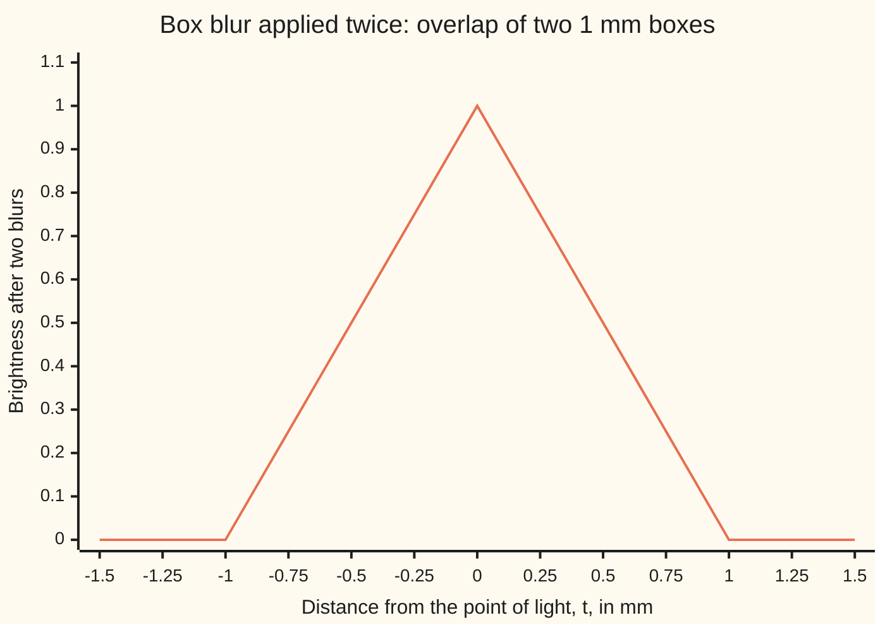
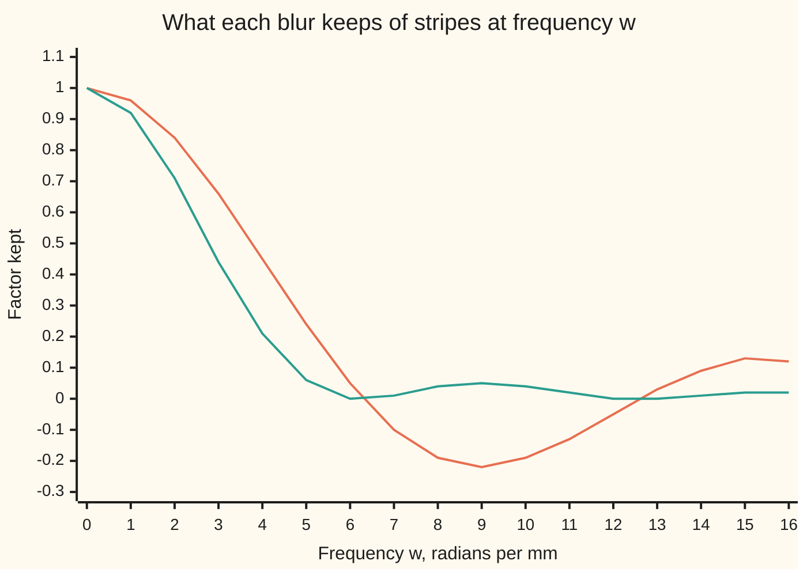

# Convolution: smear one signal with another, and under the transform the smear becomes a multiplication

[Syllabus](../../../SYLLABUS.md) → [Complex analysis](../README.md) → [Transforms in Outline](../README.md#s08) → Convolution

---

## General Overview

A photo editor's box blur replaces each point of a picture by the average of everything within half a millimetre of it. Along one row of the picture, that window is a box: height 1 over a width of 1 mm, zero elsewhere.

Blur twice. A sharp point of light becomes, after one pass, a flat bar 1 mm wide; after the second, a tent, sloping to zero 1 mm either side. Two box blurs are one tent blur.

Now take light and dark stripes 2 mm apart. One box blur leaves 0.636620 of their contrast. Two blurs leave 0.405285, which is 0.636620 squared. Each pass multiplies by the same factor.

The smearing is called **convolution**, the word used from here on. The rule the stripes show is the **convolution theorem**: the Fourier transform (a signal's recipe of stripes, one strength per frequency, from [The Fourier transform](03-fourier-transform.md)) of a convolution is the product of the two transforms.

**Convolving two signals slides one across the other and adds up the overlap; under the Fourier transform that sliding sum becomes plain multiplication, frequency by frequency.**

**What kind of fact this is:** a theorem, proved on this card in Why it works, with the full argument in a folded Detailed proof; convolution itself is a definition.

### The picture: a box smeared with a box is a tent



The tent: at each distance t, how far a box at 0 and a box slid to t overlap. The code prints every point.

---

## The formula

Notation first, in words. A star, $f * g$, means "f smeared by g": the convolution, not multiplication. A hat, $\hat f(\omega)$, is the Fourier transform at frequency $\omega$ (omega).

$$(f * g)(t) = \int_{-\infty}^{\infty} f(s)\, g(t - s)\, ds$$

**Read it aloud:** to find the smeared signal at the point t, weight a copy of g, flipped and slid to t, by f at every point s, and add up.

The transform, with the turning arrow e^(−iωt) (the unit-circle point at angle −ωt):

$$\hat f(\omega) = \int_{-\infty}^{\infty} f(t)\, e^{-i\omega t}\, dt$$

The theorem:

$$\widehat{f * g}(\omega) = \hat f(\omega)\, \hat g(\omega)$$

**Read it aloud:** the transform of the smear is the transform of one signal times the transform of the other, at each frequency separately.

| Symbol | Plain meaning | In our example | Push it up and the answer… |
| --- | --- | --- | --- |
| $b$, $p$ | the box on −0.5 to 0.5 mm; the box on 0 to 1 mm, a one-sided motion blur | p-hat(π) = −0.636620i | — |
| $f$, $g$ | two signals, such as a row's brightness and a blur | the box b, twice | a taller smear |
| $s$ | the point being weighted, run over the line | −0.5 to 0.5 mm | — |
| $t$ | where the smear is read | 0.25 mm | the tent falls |
| $(f * g)(t)$ | the convolution: f smeared by g, read at t | 1 − \|t\|, the tent | — |
| $\omega$ | frequency, radians per mm; stripes 2 mm apart have ω = π | π | finer stripes, mostly weaker |
| $\hat f(\omega)$ | the transform: how much stripe at ω the signal holds | b-hat(π) = 0.636620 | — |
| $e^{-i\omega t}$ | the turning arrow; i is the quarter turn, i^2 = −1 | e^(−iπ) = −1 at t = 1 mm | — |

For the box, the transform works out by hand as b-hat(ω) = sin(ω/2)/(ω/2), the shelf's 2 sin(ω/2)/ω. The tent's is its square, sin^2(ω/2)/(ω/2)^2.

### When it holds

- **Both signals are absolutely integrable: the areas under |f| and |g| are finite.** Drop this and the smear can fail to exist: f = g = 1 gives a sliding sum of 20.0, 200.0, 2000.0 as the range widens.
- **The transform has no constant in front.** A convention with 1/√(2π) before each integral puts a √(2π) into the theorem.
- **The second signal is flipped: g(t − s), not g(s − t).** Without the flip the operation is correlation; for a real g its transform is f-hat times the conjugate of g-hat.

---

## Why it works

### Step 0: a stripe goes through a blur unchanged in shape

Feed the turning stripe e^(iωt) into a blur g. The output at t is the integral of g(s) e^(iω(t − s)) ds, and e^(iω(t − s)) = e^(iωt) e^(−iωs). The first factor leaves the integral; what remains is the integral of g(s) e^(−iωs) ds, which is g-hat(ω).

So the output is the same stripe times the number g-hat(ω). A blur cannot change a stripe's frequency, only rescale and turn it. For the box at ω = π the factor is 0.636620.

### Step 1: two blurs multiply their factors

Blur the stripe with f, then with g. The first pass multiplies by f-hat(ω), the second by g-hat(ω). The stripes 2 mm apart keep 0.636620 × 0.636620 = 0.405285. Blurring twice is blurring once with f * g, so the transform of f * g is f-hat times g-hat.

### Step 2: the same fact, straight from the integrals

The transform of f * g is a double integral ([Double integrals](../../06-Calculus%20and%20analysis/08-Multiple%20Integrals/01-double-integrals.md)) of f(s) g(t − s) e^(−iωt) over s and t. Swap the order, so s is outside, and put u = t − s. The turning arrow splits: e^(−iωt) = e^(−iωs) e^(−iωu). A shift by s is a turn by ωs. The double integral falls apart into the integral of f(s) e^(−iωs) ds times the integral of g(u) e^(−iωu) du: f-hat(ω) times g-hat(ω).

<details>
<summary>Detailed proof</summary>

Let the areas under |f| and |g| be A and B, both finite. For a function that is never negative the order of a double integral does not matter (Tonelli's theorem), so integrate |f(s)| |g(t − s)| over t first: with s fixed the inner integral is B, and the outer gives A × B. So the integral of |f * g| is at most A × B, and f * g has a transform.

Since |e^(−iωt)| = 1, the integrand f(s) g(t − s) e^(−iωt) has absolute value with the same finite double integral, and a double integral with that property may be taken in either order (Fubini's theorem). Take s outside. In the inner integral over t, substitute u = t − s, with du = dt and the whole line still the range: it is e^(−iωs) g-hat(ω). The outer integral is then g-hat(ω) times the integral of f(s) e^(−iωs) ds, which is f-hat(ω) g-hat(ω). The swap is the only step that needs a hypothesis.

</details>

### Step 3: off-centre, the turn shows

The one-sided box p on 0 to 1 mm, the shelf's one-second shutter pulse read in millimetres, is the centred box slid by 0.5 mm. The slide multiplies its transform by the turn e^(−iω/2), which is −i at ω = π: p-hat(π) = −0.636620i. Squared, −0.405285. The tent's centre now sits at 1 mm, half a cycle of the 2 mm stripes, so light and dark swap.

For lists of numbers the same theorem holds with sums in place of integrals; see [The discrete Fourier transform](02-discrete-fourier-transform.md).

---

## Worked numbers, by hand

| Step | Arithmetic | Value |
| --- | --- | --- |
| Box on −0.5 to 0.5 against the box slid to t = 0.25 | overlap from −0.25 to 0.5 | 0.750000 |
| The tent formula | 1 − \|0.25\| | 0.750000 |
| b-hat at ω = π | sin(π/2)/(π/2) = 2/π | 0.636620 |
| Transform of b * b, by the theorem | (2/π)^2 = 4/π^2 | **0.405285** |
| Transform of the tent, directly | 2 × integral from 0 to 1 of (1 − t) cos(πt) dt = 2 × 2/π^2 | 0.405285 |
| p-hat at ω = π | (1 − e^(−iπ))/(iπ) = 2/(iπ) | −0.636620i |
| Transform of p * p | (2/(iπ))^2 = 4/(i^2 π^2) | −0.405285 |

### The picture: the box's spectrum and its square



Orange: b-hat, one blur; below zero it swaps light and dark. Green: the tent's transform, computed from the sliding sums by Simpson's rule; it is b-hat squared, so never negative.

### What breaks if you drop a piece

| Mistake | Comes out at | What went wrong |
| --- | --- | --- |
| Multiplying the signals point by point, b × b | 0.636620 at ω = π, not 0.405285 | b × b is b again: no smearing happened |
| No flip: p(s) p(s − t) | +0.405285, not −0.405285 | that is correlation; its transform is \|p-hat\|^2 and the turn is lost |
| f = g = 1, not integrable | 20.0, 200.0, 2000.0 over widening ranges | the sliding sum has no limit, so there is no smear to transform |

The code prints all three.

---

## Code, from first principles, and it actually runs

Two roads. Road one computes each smear as a sliding sum of f(s) g(t − s) on a grid 1/400 mm fine. Road two transforms those sampled smears by Simpson's rule and compares them with the hand formulas multiplied: gaps of 6.5e-10 for the tent and 2.6e-11 off-centre. Four asserts check the tent, the theorem twice, and the unflipped version.

### Python

```python
# The convolution theorem -- the check behind the card.  A box blur b, 1 mm
# wide, is smeared with itself.  Road one: the convolution integral as a sum.
# Road two: Fourier transforms by Simpson's rule, against b-hat squared.
import math
H = 1 / 400                                    # grid step, in mm

def box(t): return 1.0 if -0.5 <= t < 0.5 else 0.0
def shutter(t): return 1.0 if 0 <= t < 1 else 0.0

def conv(f, g, t, lo, hi):                     # midpoint sum of f(s) g(t - s) ds
    return sum(f(lo + (k + 0.5) * H) * g(t - lo - (k + 0.5) * H) for k in range(round((hi - lo) / H))) * H

def fourier(vals, lo, w):                      # Simpson's rule for v(t) e^(-iwt) dt, nodes lo + kH
    tot, last = 0, len(vals) - 1
    for k, v in enumerate(vals):
        c = 1 if k in (0, last) else (4 if k % 2 else 2)
        tot += c * v * complex(math.cos(w * (lo + k * H)), -math.sin(w * (lo + k * H)))
    return tot * H / 3

def bhat(w): return 1.0 if w == 0 else math.sin(w / 2) / (w / 2)      # by hand, the box
def phat(w): return (1 - complex(math.cos(w), -math.sin(w))) / (1j * w)  # by hand, the shutter
def show(z): return f"{round(z.real, 6) + 0.0:.6f} {'-' if round(z.imag, 6) < 0 else '+'} {abs(z.imag):.6f}i"
def row(xs, d=6): return ", ".join(f"{round(x, d) + 0.0:.{d}f}" for x in xs)
def sci(x): e = math.floor(math.log10(x)); return f"{x / 10 ** e:.1f}e{e}"

nodes = [-1 + k * H for k in range(801)]
tent = [conv(box, box, t, -0.5, 0.5) for t in nodes]
quarter = [0, 0.25, 0.5, 0.75, 1]
print(f"b * b by the sliding sum at t = 0, 0.25, 0.5, 0.75, 1 mm: {row(conv(box, box, t, -0.5, 0.5) for t in quarter)}")
print(f"the tent 1 - |t| at the same points: {row(1 - abs(t) for t in quarter)}")
print(f"chart, b * b at t = -1.5 to 1.5 in steps of 0.25: {row((conv(box, box, k / 4, -0.5, 0.5) for k in range(-6, 7)), 2)}")
bnum = fourier([1.0] * 401, -0.5, math.pi)
print(f"w = pi (stripes 2 mm apart): b-hat by Simpson {bnum.real:.6f}; by hand sin(w/2)/(w/2) {bhat(math.pi):.6f}")
tnum = fourier(tent, -1, math.pi)
print(f"w = pi: transform of b * b by Simpson {tnum.real:.6f}; b-hat squared {bhat(math.pi) ** 2:.6f}")
ws = range(17)
gap = max(abs(fourier(tent, -1, w) - bhat(w) ** 2) for w in ws)
print(f"largest gap, transform of b * b against b-hat squared, w = 0 to 16: {sci(gap)}")
print(f"chart, b-hat at w = 0 to 16: {row((fourier([1.0] * 401, -0.5, w).real for w in ws), 2)}")
print(f"chart, transform of b * b at w = 0 to 16: {row((fourier(tent, -1, w).real for w in ws), 2)}")
ptri = [conv(shutter, shutter, t, 0, 1) for t in [k * H for k in range(801)]]
pgap = max(abs(fourier(ptri, 0, w) - phat(w) ** 2) for w in (math.pi, 2))
print(f"motion blur p on 0 to 1 mm: p-hat(pi) = {show(phat(math.pi))}; p-hat(pi)^2 = {show(phat(math.pi) ** 2)}")
print(f"transform of p * p by Simpson: at pi {show(fourier(ptri, 0, math.pi))}; at 2 {show(fourier(ptri, 0, 2))}")
print(f"p-hat(2)^2 by hand: {show(phat(2) ** 2)}; largest gap {sci(pgap)}")
print(f"mistake, pointwise product b x b = b: transform at pi {bnum.real:.6f}, not {tnum.real:.6f}")
corr = fourier([conv(shutter, lambda u: shutter(-u), t, 0, 1) for t in nodes], -1, math.pi)
print(f"mistake, no flip, p(s) p(s - t): transform at pi {show(corr)}; |p-hat(pi)|^2 = {abs(phat(math.pi)) ** 2:.6f}")
print(f"break, f = g = 1 (not integrable): sum over |s| < L at L = 10, 100, 1000: "
      f"{row((conv(lambda s: 1.0, lambda s: 1.0, 0, -L, L) for L in (10, 100, 1000)), 1)}")
dconv = lambda a, c: [sum(a[j] * c[k - j] for j in range(len(a)) if 0 <= k - j < len(c)) for k in range(len(a) + len(c) - 1)]
print(f"3-pixel box blur applied twice, weights over 9: {dconv([1, 1, 1], [1, 1, 1])}")
dice = [sum(1 for x in range(1, 7) for y in range(1, 7) if x + y == n) for n in range(2, 13)]
print(f"two dice, ways to make 2 to 12: {dconv([1] * 6, [1] * 6)}; by listing all 36 rolls: {dice}")
assert max(abs(v - (1 - abs(t))) for v, t in zip(tent, nodes)) < 1e-12   # road one: the sum is the tent
assert gap < 1e-6                                                          # road two: transform of b * b = b-hat^2
assert pgap < 1e-6                                                         # off-centre, complex: p-hat^2, phase and all
assert abs(corr - abs(phat(math.pi)) ** 2) < 1e-6                           # no flip: |p-hat|^2, phase lost
print("ALL CHECKS PASS")
```

**Ran 2026-09-28 on macOS, Python 3.14.6, standard library only. All checks passed. Output, pasted from the run:**

```
b * b by the sliding sum at t = 0, 0.25, 0.5, 0.75, 1 mm: 1.000000, 0.750000, 0.500000, 0.250000, 0.000000
the tent 1 - |t| at the same points: 1.000000, 0.750000, 0.500000, 0.250000, 0.000000
chart, b * b at t = -1.5 to 1.5 in steps of 0.25: 0.00, 0.00, 0.00, 0.25, 0.50, 0.75, 1.00, 0.75, 0.50, 0.25, 0.00, 0.00, 0.00
w = pi (stripes 2 mm apart): b-hat by Simpson 0.636620; by hand sin(w/2)/(w/2) 0.636620
w = pi: transform of b * b by Simpson 0.405285; b-hat squared 0.405285
largest gap, transform of b * b against b-hat squared, w = 0 to 16: 6.5e-10
chart, b-hat at w = 0 to 16: 1.00, 0.96, 0.84, 0.66, 0.45, 0.24, 0.05, -0.10, -0.19, -0.22, -0.19, -0.13, -0.05, 0.03, 0.09, 0.13, 0.12
chart, transform of b * b at w = 0 to 16: 1.00, 0.92, 0.71, 0.44, 0.21, 0.06, 0.00, 0.01, 0.04, 0.05, 0.04, 0.02, 0.00, 0.00, 0.01, 0.02, 0.02
motion blur p on 0 to 1 mm: p-hat(pi) = 0.000000 - 0.636620i; p-hat(pi)^2 = -0.405285 + 0.000000i
transform of p * p by Simpson: at pi -0.405285 + 0.000000i; at 2 -0.294663 - 0.643849i
p-hat(2)^2 by hand: -0.294663 - 0.643849i; largest gap 2.6e-11
mistake, pointwise product b x b = b: transform at pi 0.636620, not 0.405285
mistake, no flip, p(s) p(s - t): transform at pi 0.405285 + 0.000000i; |p-hat(pi)|^2 = 0.405285
break, f = g = 1 (not integrable): sum over |s| < L at L = 10, 100, 1000: 20.0, 200.0, 2000.0
3-pixel box blur applied twice, weights over 9: [1, 2, 3, 2, 1]
two dice, ways to make 2 to 12: [1, 2, 3, 4, 5, 6, 5, 4, 3, 2, 1]; by listing all 36 rolls: [1, 2, 3, 4, 5, 6, 5, 4, 3, 2, 1]
ALL CHECKS PASS
```

### Rust

Same numbers, same labels, built with `rustc --edition 2021 -O`. Complex arithmetic is a small struct written out at the top.

```rust
// The convolution theorem -- the same check as the Python, in Rust.  No crates.
// A box blur b, 1 mm wide, is smeared with itself.  Road one: the convolution
// integral as a sum.  Road two: Fourier transforms by Simpson's rule.
use std::f64::consts::PI;
use std::ops::{Add, Div, Mul, Sub};
#[derive(Clone, Copy)]
struct C { re: f64, im: f64 }
impl Add for C { type Output = C; fn add(self, o: C) -> C { c(self.re + o.re, self.im + o.im) } }
impl Sub for C { type Output = C; fn sub(self, o: C) -> C { c(self.re - o.re, self.im - o.im) } }
impl Mul for C { type Output = C; fn mul(self, o: C) -> C { c(self.re * o.re - self.im * o.im, self.re * o.im + self.im * o.re) } }
impl Div for C { type Output = C; fn div(self, o: C) -> C {
    let d = o.re * o.re + o.im * o.im;
    c((self.re * o.re + self.im * o.im) / d, (self.im * o.re - self.re * o.im) / d) } }
fn c(re: f64, im: f64) -> C { C { re, im } }
fn abs(z: C) -> f64 { (z.re * z.re + z.im * z.im).sqrt() }
const H: f64 = 1.0 / 400.0;                    // grid step, in mm

fn bx(t: f64) -> f64 { if -0.5 <= t && t < 0.5 { 1.0 } else { 0.0 } }
fn shutter(t: f64) -> f64 { if 0.0 <= t && t < 1.0 { 1.0 } else { 0.0 } }
fn conv(f: &dyn Fn(f64) -> f64, g: &dyn Fn(f64) -> f64, t: f64, lo: f64, hi: f64) -> f64 {
    let n = ((hi - lo) / H).round() as usize;  // midpoint sum of f(s) g(t - s) ds
    (0..n).map(|k| f(lo + (k as f64 + 0.5) * H) * g(t - lo - (k as f64 + 0.5) * H)).sum::<f64>() * H
}
fn fourier(vals: &[f64], lo: f64, w: f64) -> C {  // Simpson's rule for v(t) e^(-iwt) dt
    let (mut tot, last) = (c(0.0, 0.0), vals.len() - 1);
    for (k, &v) in vals.iter().enumerate() {
        let wt = if k == 0 || k == last { 1.0 } else if k % 2 == 1 { 4.0 } else { 2.0 };
        let x = w * (lo + k as f64 * H);
        tot = tot + c(wt * v, 0.0) * c(x.cos(), -x.sin());
    }
    tot * c(H / 3.0, 0.0)
}
fn bhat(w: f64) -> f64 { if w == 0.0 { 1.0 } else { (w / 2.0).sin() / (w / 2.0) } }
fn phat(w: f64) -> C { (c(1.0, 0.0) - c(w.cos(), -w.sin())) / c(0.0, w) }
fn show(z: C) -> String {
    let (re, im) = ((z.re * 1e6).round() / 1e6 + 0.0, (z.im * 1e6).round() / 1e6);
    format!("{:.6} {} {:.6}i", re, if im < 0.0 { "-" } else { "+" }, z.im.abs())
}
fn row(xs: &[f64], d: usize) -> String {
    xs.iter().map(|&x| format!("{:.*}", d, (x * 10f64.powi(d as i32)).round() / 10f64.powi(d as i32) + 0.0)).collect::<Vec<_>>().join(", ")
}
fn sci(x: f64) -> String { let e = x.log10().floor(); format!("{:.1}e{}", x / 10f64.powf(e), e as i32) }
fn dconv(a: &[i32], b: &[i32]) -> Vec<i32> {
    (0..a.len() + b.len() - 1).map(|k| (0..a.len()).filter(|&j| k >= j && k - j < b.len()).map(|j| a[j] * b[k - j]).sum()).collect()
}
fn main() {
    let nodes: Vec<f64> = (0..801).map(|k| -1.0 + k as f64 * H).collect();
    let tent: Vec<f64> = nodes.iter().map(|&t| conv(&bx, &bx, t, -0.5, 0.5)).collect();
    let q = [0.0, 0.25, 0.5, 0.75, 1.0];
    println!("b * b by the sliding sum at t = 0, 0.25, 0.5, 0.75, 1 mm: {}", row(&q.map(|t| conv(&bx, &bx, t, -0.5, 0.5)), 6));
    println!("the tent 1 - |t| at the same points: {}", row(&q.map(|t: f64| 1.0 - t.abs()), 6));
    let ch: Vec<f64> = (-6..7).map(|k| conv(&bx, &bx, k as f64 / 4.0, -0.5, 0.5)).collect();
    println!("chart, b * b at t = -1.5 to 1.5 in steps of 0.25: {}", row(&ch, 2));
    let (ones, bnum, tnum) = (vec![1.0; 401], fourier(&[1.0; 401], -0.5, PI).re, fourier(&tent, -1.0, PI).re);
    println!("w = pi (stripes 2 mm apart): b-hat by Simpson {:.6}; by hand sin(w/2)/(w/2) {:.6}", bnum, bhat(PI));
    println!("w = pi: transform of b * b by Simpson {:.6}; b-hat squared {:.6}", tnum, bhat(PI).powi(2));
    let ws: Vec<f64> = (0..17).map(|w| w as f64).collect();
    let gap = ws.iter().map(|&w| abs(fourier(&tent, -1.0, w) - c(bhat(w).powi(2), 0.0))).fold(0.0, f64::max);
    println!("largest gap, transform of b * b against b-hat squared, w = 0 to 16: {}", sci(gap));
    println!("chart, b-hat at w = 0 to 16: {}", row(&ws.iter().map(|&w| fourier(&ones, -0.5, w).re).collect::<Vec<_>>(), 2));
    println!("chart, transform of b * b at w = 0 to 16: {}", row(&ws.iter().map(|&w| fourier(&tent, -1.0, w).re).collect::<Vec<_>>(), 2));
    let ptri: Vec<f64> = (0..801).map(|k| conv(&shutter, &shutter, k as f64 * H, 0.0, 1.0)).collect();
    let pgap = [PI, 2.0].iter().map(|&w| abs(fourier(&ptri, 0.0, w) - phat(w) * phat(w))).fold(0.0, f64::max);
    println!("motion blur p on 0 to 1 mm: p-hat(pi) = {}; p-hat(pi)^2 = {}", show(phat(PI)), show(phat(PI) * phat(PI)));
    println!("transform of p * p by Simpson: at pi {}; at 2 {}", show(fourier(&ptri, 0.0, PI)), show(fourier(&ptri, 0.0, 2.0)));
    println!("p-hat(2)^2 by hand: {}; largest gap {}", show(phat(2.0) * phat(2.0)), sci(pgap));
    println!("mistake, pointwise product b x b = b: transform at pi {:.6}, not {:.6}", bnum, tnum);
    let corr = fourier(&nodes.iter().map(|&t| conv(&shutter, &|u| shutter(-u), t, 0.0, 1.0)).collect::<Vec<_>>(), -1.0, PI);
    println!("mistake, no flip, p(s) p(s - t): transform at pi {}; |p-hat(pi)|^2 = {:.6}", show(corr), abs(phat(PI)).powi(2));
    let big: Vec<f64> = [10.0, 100.0, 1000.0].iter().map(|&l| conv(&|_| 1.0, &|_| 1.0, 0.0, -l, l)).collect();
    println!("break, f = g = 1 (not integrable): sum over |s| < L at L = 10, 100, 1000: {}", row(&big, 1));
    println!("3-pixel box blur applied twice, weights over 9: {:?}", dconv(&[1, 1, 1], &[1, 1, 1]));
    let dice: Vec<i32> = (2..13).map(|n| (1..7).flat_map(|x| (1..7).map(move |y| x + y)).filter(|&s| s == n).count() as i32).collect();
    println!("two dice, ways to make 2 to 12: {:?}; by listing all 36 rolls: {:?}", dconv(&[1; 6], &[1; 6]), dice);
    assert!(tent.iter().zip(&nodes).map(|(v, t)| (v - (1.0 - t.abs())).abs()).fold(0.0, f64::max) < 1e-12); // the tent
    assert!(gap < 1e-6);                                                  // transform of b * b = b-hat^2
    assert!(pgap < 1e-6);                                                 // off-centre, complex: p-hat^2
    assert!(abs(corr - c(abs(phat(PI)).powi(2), 0.0)) < 1e-6);            // no flip: |p-hat|^2, phase lost
    println!("ALL CHECKS PASS");
}
```

**Ran 2026-09-28 on macOS, rustc 1.98.1, no crates. All checks passed. Output, pasted from the run:**

```
b * b by the sliding sum at t = 0, 0.25, 0.5, 0.75, 1 mm: 1.000000, 0.750000, 0.500000, 0.250000, 0.000000
the tent 1 - |t| at the same points: 1.000000, 0.750000, 0.500000, 0.250000, 0.000000
chart, b * b at t = -1.5 to 1.5 in steps of 0.25: 0.00, 0.00, 0.00, 0.25, 0.50, 0.75, 1.00, 0.75, 0.50, 0.25, 0.00, 0.00, 0.00
w = pi (stripes 2 mm apart): b-hat by Simpson 0.636620; by hand sin(w/2)/(w/2) 0.636620
w = pi: transform of b * b by Simpson 0.405285; b-hat squared 0.405285
largest gap, transform of b * b against b-hat squared, w = 0 to 16: 6.5e-10
chart, b-hat at w = 0 to 16: 1.00, 0.96, 0.84, 0.66, 0.45, 0.24, 0.05, -0.10, -0.19, -0.22, -0.19, -0.13, -0.05, 0.03, 0.09, 0.13, 0.12
chart, transform of b * b at w = 0 to 16: 1.00, 0.92, 0.71, 0.44, 0.21, 0.06, 0.00, 0.01, 0.04, 0.05, 0.04, 0.02, 0.00, 0.00, 0.01, 0.02, 0.02
motion blur p on 0 to 1 mm: p-hat(pi) = 0.000000 - 0.636620i; p-hat(pi)^2 = -0.405285 + 0.000000i
transform of p * p by Simpson: at pi -0.405285 + 0.000000i; at 2 -0.294663 - 0.643849i
p-hat(2)^2 by hand: -0.294663 - 0.643849i; largest gap 2.6e-11
mistake, pointwise product b x b = b: transform at pi 0.636620, not 0.405285
mistake, no flip, p(s) p(s - t): transform at pi 0.405285 + 0.000000i; |p-hat(pi)|^2 = 0.405285
break, f = g = 1 (not integrable): sum over |s| < L at L = 10, 100, 1000: 20.0, 200.0, 2000.0
3-pixel box blur applied twice, weights over 9: [1, 2, 3, 2, 1]
two dice, ways to make 2 to 12: [1, 2, 3, 4, 5, 6, 5, 4, 3, 2, 1]; by listing all 36 rolls: [1, 2, 3, 4, 5, 6, 5, 4, 3, 2, 1]
ALL CHECKS PASS
```

The two outputs match line for line.

> [!TIP]
> **Try changing**
> Guess first, then run it.
> - **Forget the flip.** Change `g(t - lo - (k + 0.5) * H)` to `g(lo + (k + 0.5) * H - t)`. The symmetric tent survives; p * p loses its turn and the third assert stops the run.
> - **The wrong box spectrum.** Change `math.sin(w / 2) / (w / 2)` to `math.sin(w) / w`, a 2 mm box. The second assert stops the run.
> - **Blur three times.** Convolve `tent` with the box again and compare its transform with `bhat(w) ** 3`: at ω = π the factor becomes 0.636620 cubed.

---

## The usual mistake

> [!warning]
> **Reading the star as multiplication.** f * g is a sliding integral, not f times g. The box times itself is the box again, transform 0.636620 at ω = π; the box smeared with itself is the tent, 0.405285. Multiplying in one domain is convolving in the other, never both: the transform of f times g is the convolution of the transforms, divided by 2π.
>
> - **Dropping the flip.** For the one-sided blur the transform at π comes out +0.405285, not −0.405285: the 1 mm shift is lost.
> - **Mixing conventions.** Constants such as √(2π) move with the convention; the theorem's shape does not.
> - **A signal that does not die away.** f = g = 1 has no smear: 20.0, 200.0, 2000.0 as the range widens.

---

## Where you meet it in real life

- **Photo editing.** A 3-pixel box blur applied twice has weights 1, 2, 3, 2, 1 over 9: the discrete tent. Undoing a blur divides by its transform, frequency by frequency, so stripes a blur sent to nearly zero cannot come back.
- **Sums of two independent quantities.** Two dice make 2 to 12 in 1, 2, 3, 4, 5, 6, 5, 4, 3, 2, 1 ways out of 36: six equal weights convolved with themselves. The spread of any sum of two independent amounts is the convolution of their spreads.
- **Transform pricing.** An option's price is its payoff smeared against the spread of possible future prices. Carr and Madan multiply transforms instead and invert with the fast Fourier transform, pricing every strike in one pass.
- **Engineering systems.** A circuit's output is its input convolved with its response to one sharp kick; under the Laplace transform ([The Laplace transform](05-laplace-transform.md)) this becomes a product, which turns a differential equation into algebra.

> **Say it back**
> Convolution smears one signal with another: flip the second, slide it to each point, add up the overlap. Two 1 mm box blurs make a tent. A stripe passes through any blur unchanged in shape, multiplied by the blur's transform at its frequency, so two blurs multiply their factors. Swapping the order of a double integral proves it, provided both signals have finite area.

---

## What this builds on

- [The Fourier transform](03-fourier-transform.md): the transform, its convention, and the box's spectrum sin(ω/2)/(ω/2).
- [Double integrals](../../06-Calculus%20and%20analysis/08-Multiple%20Integrals/01-double-integrals.md): when the order of a double integral may be swapped.

## Where this goes next

- The DFT and the FFT: convolving long sampled signals by multiplying their discrete transforms.
- The fast Fourier transform: the algorithm that makes the multiply-instead route fast.
- Tempered distributions: smearing signals that are not integrable, such as a constant or a single sharp spike.
- The convolution theorem: every steady, linear system is a convolution with its response to one kick.

The theorem needed both signals to have finite area, and f = g = 1 broke it; what a transform and a smear mean for signals that never die away is the question tempered distributions answer.

---

## Sources

Verified 2026-09-28: every link below resolves to the publisher's page.

- Stein, Elias M., and Rami Shakarchi. *Fourier Analysis: An Introduction*. Princeton University Press, 2003. [Publisher page](https://press.princeton.edu/books/hardcover/9780691113845/fourier-analysis). Convolution, the theorem, and the integrability it needs, proved with care.
- Osgood, Brad. *The Fourier Transform and its Applications*, Stanford EE261 lecture notes. [Course page](https://see.stanford.edu/Course/EE261). Convolution as smearing and filtering, with the flip explained at length.
- Carr, Peter, and Dilip B. Madan. "Option valuation using the fast Fourier transform." *Journal of Computational Finance* 2(4), 1999. [DOI](https://doi.org/10.21314/JCF.1999.043). Pricing by multiplying transforms.
