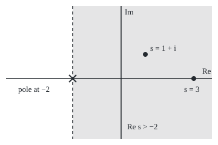
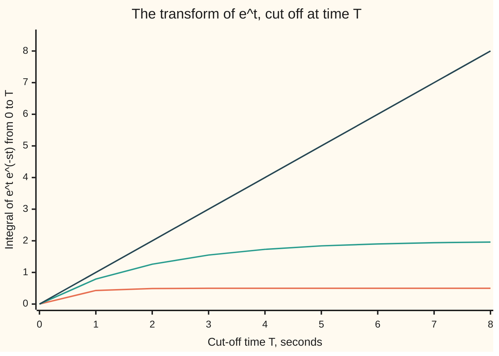

# The Laplace transform: multiply by e to the minus st and integrate from zero, and derivatives become multiplication by s

[Syllabus](../../../SYLLABUS.md) → [Complex analysis](../../../SYLLABUS.md#w07) → [Transforms in Outline](../../../SYLLABUS.md#w07-s08) → The Laplace transform

---

## General Overview

A car doing 5 metres per second brakes, and its speed falls at twice its current value, per second. As a rule, v' = −2v, where v is the speed in metres per second and v' its rate of change. How fast is it going after one second, and how far does it roll?

Weigh the whole speed record by a fading exponential and add it up. The rule about rates becomes algebra: V = 5/(s + 2), where s sets how fast the weight fades. A table read backwards gives v = 5e^(−2t), 0.676676 m/s after one second; the weighing at s = 0 gives the distance, 2.5 metres.

The weighing is the **Laplace transform**. It works on any signal that starts at t = 0, such as a camera shutter open for one second, whose transform is (1 − e^(−s))/s.

**The Laplace transform weighs a signal from time zero on by e^(−st) and adds it up; it lives right of a vertical line in the plane of s, and turns each derivative into multiplication by s, minus the starting value.**

**What kind of fact this is:** a definition; the four transform pairs, the half plane where each converges and the derivative rule are theorems proved on this card in Why it works.

### The picture: where the car's transform lives

<p align="center"></p>

Drawn to scale, 40 units to one unit of the plane. The car's transform converges in the shaded half plane, whose dashed edge runs through the pole at −2. The transforms of 1, t and cos t converge only right of the imaginary axis.

---

## The formula

Notation first, in words. A curly L, $\mathcal{L}$, read "the Laplace transform of", turns a signal into a new function, named by the capital letter: $\mathcal{L}[f] = F$. The variable $s$ is a complex number, a point of the plane. Its real part, Re s, sets how fast the weight fades; its imaginary part only turns the weight ([The elementary functions](../02-Holomorphic%20Functions/03-exponential-sine-and-cosine-in-the-plane.md)).

$$F(s)=\int_0^\infty f(t)e^{-st}dt$$

**Read it aloud:** F at s is the whole signal from time zero on, each moment weighted by e to the minus s t, added up.

The derivative rule:

$$\mathcal{L}[f'](s)=sF(s)-f(0)$$

**Read it aloud:** the transform of a rate of change is s times the transform, minus where the signal started.

The pairs on this card:

| Signal, t ≥ 0 | Transform | Converges where | At s = 3 | At s = 1 + i |
| --- | --- | --- | --- | --- |
| 1 | 1/s | Re s > 0 | 0.333333 | 0.5 − 0.5i |
| t | 1/s^2 | Re s > 0 | 0.111111 | −0.5i |
| e^(at) | 1/(s − a) | Re s > a | 0.2 (a = −2) | 0.3 − 0.1i |
| cos(bt) | s/(s^2 + b^2) | Re s > 0 | 0.3 (b = 1) | 0.6 − 0.2i |
| shutter: 1 until t = 1, then 0 | (1 − e^(−s))/s | every s | 0.316738 | — |

| Symbol | Plain meaning | In our example | Push it up and the answer… |
| --- | --- | --- | --- |
| $t$ | seconds since the signal started | since braking | — |
| $s$ | the weight's complex rate | 3, and 1 + i | F shrinks |
| $f$, $F$, $\mathcal{L}$ | a signal from t = 0; its transform; "transform it" | 1; 1/s | — |
| $a$, $b$ | growth rate in e^(at); turning rate in cos(bt) | −2; 1 | raise a: the half plane shrinks |
| $v$, $V$ | the car's speed, m/s; its transform | 5e^(−2t); 5/(s + 2) | — |
| $f'$, $f(0)$ | rate of change of f; its starting value | −10e^(−2t); 5 | — |
| $T$ | where a check cuts the integral off | 10 | — |
| $e$, $i$ | base of natural logs; the quarter turn, i^2 = −1 | e^(−st) | — |

### When it holds

- **The signal grows no faster than some exponential.** If |f(t)| stays below M e^(at), for some constant M, the integral converges for Re s > a. The signal e^(t^2) outgrows every exponential and has no transform anywhere.
- **Only t ≥ 0 counts.** Signals that agree from time zero on share a transform. f(0) is the value just after the start.
- **The derivative rule needs f without jumps.** The shutter drops from 1 to 0 at t = 1; its derivative transforms to 0, but the rule gives −0.049787 at s = 3.

---

## Why it works

### Step 0: the weight fades, and differentiating it gives it back

The size of e^(−st) is e^(−(Re s) t), so for Re s > 0 the weight fades and tames a slowly growing signal. The weight's own derivative is −s times itself, so integrating by parts moves a derivative off the signal onto the weight, where it comes out as a factor of s.

### Step 1: four transforms, each by one antiderivative

**The constant 1.** The antiderivative of e^(−st) is −e^(−st)/s: −1/s at t = 0, and heading to 0 as t grows if Re s > 0. So F(s) = 1/s.

**The exponential e^(at).** e^(at) e^(−st) = e^(−(s − a)t), the constant's integrand with s − a for s. So F(s) = 1/(s − a), for Re s > a. The car's a = −2 gives 1/(s + 2).

**The ramp t.** Integrate by parts ([Integration by parts](../../06-Calculus%20and%20analysis/04-Integrals/04-integration-by-parts.md)), differentiating t. The boundary term vanishes when Re s > 0, leaving (1/s) times the constant's transform: 1/s^2.

**The wave cos(bt).** Write it as two turning arrows, (e^(ibt) + e^(−ibt))/2: exponentials with a = ±ib, real part 0, so Re s > 0. Adding:

$$\frac{1}{2}\left(\frac{1}{s-ib}+\frac{1}{s+ib}\right)=\frac{s}{s^2+b^2}.$$

The code sums each integral directly and matches all eight table values.

### Step 2: the half plane of convergence

If |f(t)| stays below M e^(at), the integrand stays below M e^(−(Re s − a) t), which has a finite integral for Re s > a: the transform converges absolutely ([Improper integrals](../../06-Calculus%20and%20analysis/04-Integrals/07-improper-integrals.md)). Re s > a is a half plane: everything right of a vertical line ([Limits and regions in the plane](../01-Complex%20Numbers%20and%20the%20Plane/06-complex-limits-series-and-regions.md)).

Take e^t, so a = 1, and cut the integral off at time T. At s = 1.5 it reaches 1.986524 by T = 10, heading for 2. At s = 1/2 it is 294.826318 and racing away.



Lines: s = 3, flat at 0.5; s = 1.5, climbing to 2; s = 1, the edge, a straight line.

Inside its half plane F is holomorphic (has a complex derivative at every point), and F'(s) is minus the transform of t f(t): the derivative of 1/s is −1/s^2.

<details>
<summary>Detailed proof: F is holomorphic for Re s &gt; a</summary>

Fix s with Re s = σ > a, set δ = (σ − a)/2, and take complex h with |h| < δ. Then

$$\frac{F(s+h)-F(s)}{h}+\int_0^\infty t f(t) e^{-st}dt=\int_0^\infty f(t)e^{-st} \left(\frac{e^{-ht}-1}{h}+t\right) dt.$$

By the exponential's power series, |(e^(−ht) − 1)/h + t| ≤ |h| t^2 e^(|h| t)/2. With |f(t)| ≤ M e^(at), the right side is at most

$$\frac{M |h|}{2} \int_0^\infty t^2 e^{-(\sigma-a-|h|) t}dt \le \frac{M |h|}{2} \cdot \frac{2}{\delta^3}=\frac{M |h|}{\delta^3},$$

since σ − a − |h| > δ. This tends to 0 as h → 0 from any direction, so F has the complex derivative −∫ t f(t) e^(−st) dt.

</details>

### Step 3: the derivative rule

Let f be continuous for t ≥ 0, f' have a transform, and f(t) e^(−st) → 0 as t grows. Integrate by parts, differentiating the weight:

$$\int_0^\infty f'(t)e^{-st}dt=\Big[f(t)e^{-st}\Big]_0^\infty+s \int_0^\infty f(t)e^{-st}dt=-f(0)+sF(s).$$

The bracket is 0 at the far end and f(0) at the start.

On the car at s = 3: −10e^(−2t) transforms to −2, and the rule gives 3 × 1 − 5 = −2. On the wave at s = 1 + i: −sin t transforms to −0.2 + 0.4i, and (1 + i)(0.6 − 0.2i) − 1 agrees.

At a jump the bracket splits and leaves an extra term. The shutter falls by 1 at t = 1; its derivative transforms to 0, but s F − f(0) is −e^(−s), −0.049787 at s = 3.

### Step 4: the car in one line

Transform both sides of v' = −2v, with v(0) = 5:

$$sV-5=-2V \quad\Longrightarrow\quad V(s)=\frac{5}{s+2}.$$

That is the e^(at) row with a = −2, times 5. So v = 5e^(−2t), and v(1) = 0.676676 m/s. Reading the table backwards rests on Lerch's theorem, stated without proof: continuous signals with equal transforms are equal. The direct way back, an integral up a vertical line inside the half plane (the Bromwich integral), is [Inverting a Laplace transform](07-inverse-laplace-by-residues.md).

At s = 0, right of the pole at −2, the weight is 1, so V(0) is the distance: 2.5 metres.

The shutter's transform, the integral of e^(−st) from 0 to 1, is (1 − e^(−s))/s at every s. At s = i it is 0.841471 − 0.459698i, of size 0.958851, which is 2 sin(1/2), the centred shutter's Fourier transform at frequency 1 ([The Fourier transform](03-fourier-transform.md)). Starting at 0 instead of −1/2 only turns the value. On the imaginary axis the two transforms meet.

---

## Worked numbers, by hand

| Step | Arithmetic | Value |
| --- | --- | --- |
| Transform both sides | s V − 5 = −2V | — |
| Solve for V | V = 5/(s + 2) | V(3) = 5/5 = 1 |
| Read the table | the e^(at) row, a = −2, times 5 | v = 5e^(−2t) |
| Speed after one second | 5e^(−2) | 0.676676 m/s |
| Distance, from V at s = 0 | 5/(0 + 2) | **2.5 m** |

The car rolls 2.5 metres, and after one second it is slower than a walk.

### What breaks if you drop a piece

| Mistake | Comes out at | What went wrong |
| --- | --- | --- |
| Rule without f(0) | 3, not −2, at s = 3; sV = −2V forces V = 0, a car that never moved | f(0) is the boundary term |
| 1/(s − 1) at s = 1/2 | −2; the cut integral is 294.826318 at T = 10 | s is left of the line Re s = 1 |
| e^(t^2) at s = 10 | cut at T = 10, 11, 12: 0.2, 5062.0, 1912010653.3 | it outgrows every exponential |
| The rule on the shutter | 0 by the derivative, −0.049787 by the rule | a jump leaves its own term |

The code prints all four.

---

## Code, from first principles, and it actually runs

Road one is the closed forms of Why it works. Road two is the integral itself, summed by Simpson's rule (thin parabola-topped strips), and the car stepped forward by the Runge-Kutta method (four slope samples per step), with no transform in sight. Four asserts set each road against the other.

### Python

```python
# The Laplace transform -- the check behind the card.  Standard library only.
# F(s) = integral from 0 to infinity of f(t) e^(-st) dt, for a complex number s.
# Road 1: the closed forms proved on the card.  Road 2: the integral itself, summed
# by Simpson's rule, and the braking car v' = -2v stepped forward in time by RK4.
import math

def cexp(z): return math.exp(z.real) * complex(math.cos(z.imag), math.sin(z.imag))
def show(z):                                   # 'a + bi', six decimals, no -0.000000
    a, b = round(z.real, 6) + 0.0, round(z.imag, 6) + 0.0
    return f"{a:.6f} {'-' if b < 0 else '+'} {abs(b):.6f}i"
def simpson(g, lo, hi, n=40000):               # Simpson's rule, n even
    h = (hi - lo) / n
    return h / 3 * sum((1 if j in (0, n) else 4 if j % 2 else 2) * g(lo + j * h) for j in range(n + 1))
def lap(f, s, T=40.0): return simpson(lambda t: f(t) * cexp(-s * t), 0, T)

pairs = [("1", lambda t: 1.0, lambda s: 1 / s), ("t", lambda t: t, lambda s: 1 / (s * s)),
         ("e^(-2t)", lambda t: math.exp(-2 * t), lambda s: 1 / (s + 2)),
         ("cos t", math.cos, lambda s: s / (s * s + 1))]
worst = 0.0
for s in (3, 1 + 1j):
    closed, summed = [F(s) for _, _, F in pairs], [lap(f, s) for _, f, _ in pairs]
    worst = max([worst] + [abs(a - b) for a, b in zip(closed, summed)])
    for label, vals in (("closed form", closed), ("Simpson to t = 40", summed)):
        print(f"s = {show(s)}, {label}: " + "; ".join(f"{n} -> {show(v)}" for (n, _, _), v in zip(pairs, vals)))
cut = {s: simpson(lambda t: math.exp((1 - s) * t), 0, 10) for s in (3, 1.5, 1, 0.5)}
print("e^t cut at T = 10: " + "; ".join(f"s = {s} -> {v:.6f}" for s, v in cut.items())
      + f"; formula 1/(s - 1) at s = 0.5 gives {1 / (0.5 - 1):.6f}")
chart = {s: [simpson(lambda t: math.exp((1 - s) * t), 0, T, 4000) for T in range(9)] for s in (3, 1.5, 1)}
for s, row in chart.items():
    print(f"chart, e^t cut at T = 0 to 8, s = {s}: " + ", ".join(f"{v:.2f}" for v in row))
v = lambda t: 5 * math.exp(-2 * t)             # the braking car's speed, m/s
V = lambda s: 5 / (s + 2)                      # its transform, from the e^(at) row with a = -2
d1, d2 = lap(lambda t: -2 * v(t), 3), lap(lambda t: -math.sin(t), 1 + 1j)
print(f"derivative rule, s = 3, f = 5e^(-2t): Simpson on f' {show(d1)}; s F - f(0) = 3 x 1 - 5 = {3 * V(3) - v(0):.6f}; "
      f"without f(0): {3 * V(3):.6f}")
print(f"derivative rule, s = 1 + i, f = cos t: Simpson on f' {show(d2)}; s F - f(0) = {show((1 + 1j) * pairs[3][2](1 + 1j) - 1)}")
x, u, h = 0.0, 5.0, 0.001                      # RK4 on distance x' = u, speed u' = -2u
for k in range(20000):
    a1, b1 = u, -2 * u; a2, b2 = u + h / 2 * b1, -2 * (u + h / 2 * b1)
    a3, b3 = u + h / 2 * b2, -2 * (u + h / 2 * b2); a4, b4 = u + h * b3, -2 * (u + h * b3)
    x, u = x + h / 6 * (a1 + 2 * a2 + 2 * a3 + a4), u + h / 6 * (b1 + 2 * b2 + 2 * b3 + b4)
    if k == 999: v_one = u
print(f"braking car: V(3) = 5/(3 + 2) = {V(3):.6f}, Simpson on 5e^(-2t) {show(lap(v, 3))}; V(0) = {V(0):.6f}")
print(f"stepped by RK4: v(1) = {v_one:.6f} against 5e^(-2) = {v(1):.6f}; distance to t = 20 {x:.6f} m")
p = lambda s: (1 - cexp(-s)) / s               # the one-second pulse on 0 to 1
print(f"pulse: (1 - e^(-s))/s at s = 3 {show(p(3))}, Simpson {show(lap(lambda t: 1.0, 3, 1.0))}; "
      f"at s = i {show(p(1j))}, size {abs(p(1j)):.6f}; its jump breaks the rule: s F - f(0) at s = 3 {show(3 * p(3) - 1)}")
print(f"mistake, 5/(s + 2) read as 5e^(2t): speed at t = 1 {5 * math.exp(2):.6f} m/s")
print("mistake, e^(t^2) at s = 10 cut at T = 10, 11, 12: "
      + ", ".join(f"{simpson(lambda t: math.exp(t * t - 10 * t), 0, T):.1f}" for T in (10, 11, 12)))
print("figure, 40 units per unit, origin (200, 130): pole -2 at (120, 130), s = 3 at (320, 130), s = 1 + i at (240, 90)")
assert worst < 1e-9 and abs(lap(lambda t: 1.0, 3, 1.0) - p(3)) < 1e-12   # closed forms against the integral
assert abs(d1 - (3 * V(3) - 5)) < 1e-9 and abs(d2 - ((1 + 1j) * pairs[3][2](1 + 1j) - 1)) < 1e-9
assert abs(v_one - v(1)) < 1e-10 and abs(x - V(0)) < 1e-9                 # the stepped car against V(s)
assert all(abs(chart[1][T] - T) < 1e-9 for T in range(9)) and abs(cut[0.5] - 2 * (math.exp(5) - 1)) < 1e-6
print("ALL CHECKS PASS")
```

**Ran 2026-09-28 on macOS, Python 3.14.6, standard library only. All checks passed. Output, pasted from the run:**

```
s = 3.000000 + 0.000000i, closed form: 1 -> 0.333333 + 0.000000i; t -> 0.111111 + 0.000000i; e^(-2t) -> 0.200000 + 0.000000i; cos t -> 0.300000 + 0.000000i
s = 3.000000 + 0.000000i, Simpson to t = 40: 1 -> 0.333333 + 0.000000i; t -> 0.111111 + 0.000000i; e^(-2t) -> 0.200000 + 0.000000i; cos t -> 0.300000 + 0.000000i
s = 1.000000 + 1.000000i, closed form: 1 -> 0.500000 - 0.500000i; t -> 0.000000 - 0.500000i; e^(-2t) -> 0.300000 - 0.100000i; cos t -> 0.600000 - 0.200000i
s = 1.000000 + 1.000000i, Simpson to t = 40: 1 -> 0.500000 - 0.500000i; t -> 0.000000 - 0.500000i; e^(-2t) -> 0.300000 - 0.100000i; cos t -> 0.600000 - 0.200000i
e^t cut at T = 10: s = 3 -> 0.500000; s = 1.5 -> 1.986524; s = 1 -> 10.000000; s = 0.5 -> 294.826318; formula 1/(s - 1) at s = 0.5 gives -2.000000
chart, e^t cut at T = 0 to 8, s = 3: 0.00, 0.43, 0.49, 0.50, 0.50, 0.50, 0.50, 0.50, 0.50
chart, e^t cut at T = 0 to 8, s = 1.5: 0.00, 0.79, 1.26, 1.55, 1.73, 1.84, 1.90, 1.94, 1.96
chart, e^t cut at T = 0 to 8, s = 1: 0.00, 1.00, 2.00, 3.00, 4.00, 5.00, 6.00, 7.00, 8.00
derivative rule, s = 3, f = 5e^(-2t): Simpson on f' -2.000000 + 0.000000i; s F - f(0) = 3 x 1 - 5 = -2.000000; without f(0): 3.000000
derivative rule, s = 1 + i, f = cos t: Simpson on f' -0.200000 + 0.400000i; s F - f(0) = -0.200000 + 0.400000i
braking car: V(3) = 5/(3 + 2) = 1.000000, Simpson on 5e^(-2t) 1.000000 + 0.000000i; V(0) = 2.500000
stepped by RK4: v(1) = 0.676676 against 5e^(-2) = 0.676676; distance to t = 20 2.500000 m
pulse: (1 - e^(-s))/s at s = 3 0.316738 + 0.000000i, Simpson 0.316738 + 0.000000i; at s = i 0.841471 - 0.459698i, size 0.958851; its jump breaks the rule: s F - f(0) at s = 3 -0.049787 + 0.000000i
mistake, 5/(s + 2) read as 5e^(2t): speed at t = 1 36.945280 m/s
mistake, e^(t^2) at s = 10 cut at T = 10, 11, 12: 0.2, 5062.0, 1912010653.3
figure, 40 units per unit, origin (200, 130): pole -2 at (120, 130), s = 3 at (320, 130), s = 1 + i at (240, 90)
ALL CHECKS PASS
```

### Rust

Same numbers, same labels, built with `rustc --edition 2021 -O`.

```rust
// The Laplace transform -- the same check as the Python, in Rust.  No crates.
// F(s) = integral from 0 to infinity of f(t) e^(-st) dt, for a complex number s.
// Road 1: the closed forms proved on the card.  Road 2: the integral itself, summed
// by Simpson's rule, and the braking car v' = -2v stepped forward in time by RK4.
#[derive(Clone, Copy)] struct C { re: f64, im: f64 } fn c(re: f64, im: f64) -> C { C { re, im } }
fn add(a: C, b: C) -> C { c(a.re + b.re, a.im + b.im) }
fn sub(a: C, b: C) -> C { add(a, c(-b.re, -b.im)) }
fn mul(a: C, b: C) -> C { c(a.re * b.re - a.im * b.im, a.re * b.im + a.im * b.re) }
fn div(a: C, b: C) -> C { let d = b.re * b.re + b.im * b.im; c((a.re * b.re + a.im * b.im) / d, (a.im * b.re - a.re * b.im) / d) }
fn scale(a: C, k: f64) -> C { c(a.re * k, a.im * k) }
fn abs(a: C) -> f64 { a.re.hypot(a.im) }
fn cexp(z: C) -> C { scale(c(z.im.cos(), z.im.sin()), z.re.exp()) }
fn show(z: C) -> String { // 'a + bi', six decimals, no -0.000000
    let a = format!("{:.6}", z.re); let a = if a == "-0.000000" { "0.000000".to_string() } else { a };
    let b = format!("{:.6}", z.im.abs());
    format!("{} {} {}i", a, if z.im < 0.0 && b != "0.000000" { '-' } else { '+' }, b)
}
fn simpson(g: &dyn Fn(f64) -> C, lo: f64, hi: f64, n: usize) -> C { // Simpson's rule, n even
    let h = (hi - lo) / n as f64;
    let mut s = c(0.0, 0.0);
    for j in 0..=n { let k = if j == 0 || j == n { 1.0 } else if j % 2 == 1 { 4.0 } else { 2.0 }; s = add(s, scale(g(lo + j as f64 * h), k)) }
    scale(s, h / 3.0)
}
fn lap(f: &dyn Fn(f64) -> f64, s: C, t_end: f64) -> C { simpson(&|t| scale(cexp(scale(s, -t)), f(t)), 0.0, t_end, 40000) }
fn simr(g: &dyn Fn(f64) -> f64, lo: f64, hi: f64, n: usize) -> f64 { simpson(&|t| c(g(t), 0.0), lo, hi, n).re }
fn main() {
    let one = c(1.0, 0.0); let fs: [(&str, fn(f64) -> f64); 4] = [("1", |_| 1.0), ("t", |t| t), ("e^(-2t)", |t| (-2.0 * t).exp()), ("cos t", |t| t.cos())];
    let closed = |k: usize, s: C| -> C { match k { 0 => div(one, s), 1 => div(one, mul(s, s)), 2 => div(one, add(s, c(2.0, 0.0))), _ => div(s, add(mul(s, s), one)) } };
    let mut worst: f64 = 0.0;
    for s in [c(3.0, 0.0), c(1.0, 1.0)] {
        let cl: Vec<C> = (0..4).map(|k| closed(k, s)).collect();
        let sm: Vec<C> = (0..4).map(|k| lap(&fs[k].1, s, 40.0)).collect();
        for k in 0..4 { worst = worst.max(abs(sub(cl[k], sm[k]))) }
        for (label, vals) in [("closed form", &cl), ("Simpson to t = 40", &sm)] {
            let parts: Vec<String> = (0..4).map(|k| format!("{} -> {}", fs[k].0, show(vals[k]))).collect();
            println!("s = {}, {}: {}", show(s), label, parts.join("; "));
        }
    }
    let cut: Vec<(&str, f64)> = [("3", 3.0), ("1.5", 1.5), ("1", 1.0), ("0.5", 0.5)].iter()
        .map(|&(n, s)| (n, simr(&|t| ((1.0 - s) * t).exp(), 0.0, 10.0, 40000))).collect();
    let parts: Vec<String> = cut.iter().map(|(n, v)| format!("s = {} -> {:.6}", n, v)).collect();
    println!("e^t cut at T = 10: {}; formula 1/(s - 1) at s = 0.5 gives {:.6}", parts.join("; "), 1.0 / (0.5 - 1.0));
    let mut chart = Vec::new();
    for (n, s) in [("3", 3.0), ("1.5", 1.5), ("1", 1.0)] {
        let row: Vec<f64> = (0..9).map(|t_end| simr(&|t| ((1.0 - s) * t).exp(), 0.0, t_end as f64, 4000)).collect();
        let txt: Vec<String> = row.iter().map(|v| format!("{:.2}", v)).collect();
        println!("chart, e^t cut at T = 0 to 8, s = {}: {}", n, txt.join(", "));
        chart.push(row);
    }
    let v = |t: f64| 5.0 * (-2.0 * t).exp(); // the braking car's speed, m/s
    let big_v = |s: C| div(c(5.0, 0.0), add(s, c(2.0, 0.0))); // its transform, a = -2
    let (s3, s1i) = (c(3.0, 0.0), c(1.0, 1.0));
    let (d1, d2) = (lap(&|t| -2.0 * v(t), s3, 40.0), lap(&|t| -t.sin(), s1i, 40.0));
    println!("derivative rule, s = 3, f = 5e^(-2t): Simpson on f' {}; s F - f(0) = 3 x 1 - 5 = {:.6}; without f(0): {:.6}",
        show(d1), 3.0 * big_v(s3).re - v(0.0), 3.0 * big_v(s3).re);
    let rule2 = sub(mul(s1i, closed(3, s1i)), one);
    println!("derivative rule, s = 1 + i, f = cos t: Simpson on f' {}; s F - f(0) = {}", show(d2), show(rule2));
    let (mut x, mut u, h, mut v_one) = (0.0f64, 5.0f64, 0.001f64, 0.0f64); // RK4 on x' = u, u' = -2u
    for k in 0..20000 {
        let (a1, b1) = (u, -2.0 * u); let (a2, b2) = (u + h / 2.0 * b1, -2.0 * (u + h / 2.0 * b1));
        let (a3, b3) = (u + h / 2.0 * b2, -2.0 * (u + h / 2.0 * b2)); let (a4, b4) = (u + h * b3, -2.0 * (u + h * b3));
        x += h / 6.0 * (a1 + 2.0 * a2 + 2.0 * a3 + a4); u += h / 6.0 * (b1 + 2.0 * b2 + 2.0 * b3 + b4);
        if k == 999 { v_one = u }
    }
    println!("braking car: V(3) = 5/(3 + 2) = {:.6}, Simpson on 5e^(-2t) {}; V(0) = {:.6}", big_v(s3).re, show(lap(&v, s3, 40.0)), big_v(c(0.0, 0.0)).re);
    println!("stepped by RK4: v(1) = {:.6} against 5e^(-2) = {:.6}; distance to t = 20 {:.6} m", v_one, v(1.0), x);
    let p = |s: C| div(sub(one, cexp(scale(s, -1.0))), s); // the one-second pulse on 0 to 1
    let p3n = lap(&|_| 1.0, s3, 1.0);
    println!("pulse: (1 - e^(-s))/s at s = 3 {}, Simpson {}; at s = i {}, size {:.6}; its jump breaks the rule: s F - f(0) at s = 3 {}",
        show(p(s3)), show(p3n), show(p(c(0.0, 1.0))), abs(p(c(0.0, 1.0))), show(sub(mul(s3, p(s3)), one)));
    println!("mistake, 5/(s + 2) read as 5e^(2t): speed at t = 1 {:.6} m/s", 5.0 * 2.0f64.exp());
    let blow: Vec<String> = [10.0, 11.0, 12.0].iter().map(|&te| format!("{:.1}", simr(&|t| (t * t - 10.0 * t).exp(), 0.0, te, 40000))).collect();
    println!("mistake, e^(t^2) at s = 10 cut at T = 10, 11, 12: {}", blow.join(", "));
    println!("figure, 40 units per unit, origin (200, 130): pole -2 at (120, 130), s = 3 at (320, 130), s = 1 + i at (240, 90)");
    assert!(worst < 1e-9 && abs(sub(p3n, p(s3))) < 1e-12); // closed forms against the integral
    assert!(abs(sub(d1, c(3.0 * big_v(s3).re - 5.0, 0.0))) < 1e-9 && abs(sub(d2, rule2)) < 1e-9);
    assert!((v_one - v(1.0)).abs() < 1e-10 && (x - big_v(c(0.0, 0.0)).re).abs() < 1e-9); // stepped car against V(s)
    assert!((0..9).all(|t| (chart[2][t] - t as f64).abs() < 1e-9) && (cut[3].1 - 2.0 * (5.0f64.exp() - 1.0)).abs() < 1e-6);
    println!("ALL CHECKS PASS");
}
```

**Ran 2026-09-28 on macOS, rustc 1.98.1, no crates. All checks passed. Output, pasted from the run:**

```
s = 3.000000 + 0.000000i, closed form: 1 -> 0.333333 + 0.000000i; t -> 0.111111 + 0.000000i; e^(-2t) -> 0.200000 + 0.000000i; cos t -> 0.300000 + 0.000000i
s = 3.000000 + 0.000000i, Simpson to t = 40: 1 -> 0.333333 + 0.000000i; t -> 0.111111 + 0.000000i; e^(-2t) -> 0.200000 + 0.000000i; cos t -> 0.300000 + 0.000000i
s = 1.000000 + 1.000000i, closed form: 1 -> 0.500000 - 0.500000i; t -> 0.000000 - 0.500000i; e^(-2t) -> 0.300000 - 0.100000i; cos t -> 0.600000 - 0.200000i
s = 1.000000 + 1.000000i, Simpson to t = 40: 1 -> 0.500000 - 0.500000i; t -> 0.000000 - 0.500000i; e^(-2t) -> 0.300000 - 0.100000i; cos t -> 0.600000 - 0.200000i
e^t cut at T = 10: s = 3 -> 0.500000; s = 1.5 -> 1.986524; s = 1 -> 10.000000; s = 0.5 -> 294.826318; formula 1/(s - 1) at s = 0.5 gives -2.000000
chart, e^t cut at T = 0 to 8, s = 3: 0.00, 0.43, 0.49, 0.50, 0.50, 0.50, 0.50, 0.50, 0.50
chart, e^t cut at T = 0 to 8, s = 1.5: 0.00, 0.79, 1.26, 1.55, 1.73, 1.84, 1.90, 1.94, 1.96
chart, e^t cut at T = 0 to 8, s = 1: 0.00, 1.00, 2.00, 3.00, 4.00, 5.00, 6.00, 7.00, 8.00
derivative rule, s = 3, f = 5e^(-2t): Simpson on f' -2.000000 + 0.000000i; s F - f(0) = 3 x 1 - 5 = -2.000000; without f(0): 3.000000
derivative rule, s = 1 + i, f = cos t: Simpson on f' -0.200000 + 0.400000i; s F - f(0) = -0.200000 + 0.400000i
braking car: V(3) = 5/(3 + 2) = 1.000000, Simpson on 5e^(-2t) 1.000000 + 0.000000i; V(0) = 2.500000
stepped by RK4: v(1) = 0.676676 against 5e^(-2) = 0.676676; distance to t = 20 2.500000 m
pulse: (1 - e^(-s))/s at s = 3 0.316738 + 0.000000i, Simpson 0.316738 + 0.000000i; at s = i 0.841471 - 0.459698i, size 0.958851; its jump breaks the rule: s F - f(0) at s = 3 -0.049787 + 0.000000i
mistake, 5/(s + 2) read as 5e^(2t): speed at t = 1 36.945280 m/s
mistake, e^(t^2) at s = 10 cut at T = 10, 11, 12: 0.2, 5062.0, 1912010653.3
figure, 40 units per unit, origin (200, 130): pole -2 at (120, 130), s = 3 at (320, 130), s = 1 + i at (240, 90)
ALL CHECKS PASS
```

The two outputs match line for line.

> [!TIP]
> **Try changing**
> Guess first, then run it.
> - **Forget a power of s.** Change `1 / (s * s)` to `1 / s`: the ramp's two roads part, and the first assert fails.
> - **Leave the half plane.** Change `(3, 1 + 1j)` to `(3, -0.5 + 1j)`: only e^(−2t) still converges, and the first assert fails.
> - **Start the car faster.** In the RK4 line, change `5.0` to `10.0`: it rolls 5 metres, V(0) says 2.5, and the third assert fails.

---

## The usual mistake

> [!warning]
> **Treating the formula as the transform everywhere.** The transform of e^t equals 1/(s − 1) only right of Re s = 1. At s = 1/2 the formula says −2 for a positive signal; the cut integral reads 294.826318 and climbing. What the formula means beyond the line is [Where a transform lives](06-strips-of-convergence-and-shifting-the-line.md).
>
> - **Reading the sign backwards.** 5/(s + 2) is 5e^(−2t); reading 5e^(2t) has the car at 36.945280 m/s after one second.

---

## Where you meet it in real life

- **Control engineering.** A system's transform is its transfer function; poles left of the imaginary axis, like the car's at −2, mean responses die away.
- **Electric circuits.** A capacitor draining through a resistor follows the car's rule. Each capacitor or coil becomes a factor of s; driving the circuit is a convolution, a product after transforming ([Convolution](04-convolution-theorem.md)).

> **Say it back**
> The Laplace transform weighs a signal from time zero on by e^(−st) and adds it up. It converges right of a vertical line, Re s > a, for a signal growing no faster than e^(at). A derivative becomes s times the transform, minus the starting value. So v' = −2v with v(0) = 5 becomes V = 5/(s + 2), read back as 5e^(−2t).

---

## What this builds on

- [The elementary functions](../02-Holomorphic%20Functions/03-exponential-sine-and-cosine-in-the-plane.md): the size of e^(−st) is e^(−(Re s)t), and cos as two turning exponentials.
- [Limits and regions in the plane](../01-Complex%20Numbers%20and%20the%20Plane/06-complex-limits-series-and-regions.md): half planes as regions, and limits taken from any direction.
- [Improper integrals](../../06-Calculus%20and%20analysis/04-Integrals/07-improper-integrals.md): an integral out to infinity, and absolute convergence by comparison.
- [Integration by parts](../../06-Calculus%20and%20analysis/04-Integrals/04-integration-by-parts.md): the one move behind the ramp's transform and the derivative rule.

## Where this goes next

- [Where a transform lives](06-strips-of-convergence-and-shifting-the-line.md): the car's 5/(s + 2) is a formula on the whole plane but an integral only right of −2. That card finds where convergence starts and joins Laplace and Fourier into one transform.

---

## Sources

Verified 28 Sep 2026: every link below opens a page naming the cited work.

- Schiff, Joel L. *The Laplace Transform: Theory and Applications*. Springer, 1999. [Publisher page](https://link.springer.com/book/10.1007/978-0-387-22757-3). The table, exponential order, jumps, Lerch's theorem.
- Doetsch, Gustav. *Introduction to the Theory and Application of the Laplace Transformation*. Springer, 1974. [Publisher page](https://link.springer.com/book/10.1007/978-3-642-65690-3). The half plane of convergence, and holomorphy there.
- Mattuck, Arthur, Haynes Miller, Jeremy Orloff, and John Lewis. "Unit III: Fourier Series and Laplace Transform." 18.03SC Differential Equations, MIT OpenCourseWare, Fall 2011. [Course page](https://ocw.mit.edu/courses/18-03sc-differential-equations-fall-2011/pages/unit-iii-fourier-series-and-laplace-transform/). The car's method for equations with starting values.
