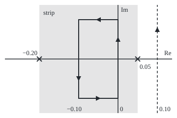

# Where a transform lives: a strip or half plane of convergence, and inside it the line of integration slides without changing the answer

[Syllabus](../../../SYLLABUS.md) → [Complex analysis](../README.md) → [Transforms in Outline](../README.md#s08) → Where a transform lives

---

## General Overview

A savings balance of 1 dollar grows at 5 percent a year, compounded continuously: after t years it holds e^(0.05t) dollars.

It has no Fourier transform ([The Fourier transform](03-fourier-transform.md)). At frequency 0 its defining integral, summed to 100 years, reads 2948.263182; summed to 200, 440509.315896. It never settles.

Multiply by a damping factor e^(−0.10t). The product e^(−0.05t) dies away, and its transform exists: 20 at frequency 0. The damping must beat the growth.

A complex number s = σ + iω holds a damping rate σ and a frequency ω. A transform converges on a vertical band of such points, and its inverse may run up any vertical line in the band.

**A transform converges on a vertical strip fixed by the signal's growth at each end; damping by e^(−at) moves the line to Re s = a, and inside the strip the line slides without changing the inverse.**

**What kind of fact this is:** a theorem, proved on this card in Why it works, with one step's full proof folded.

---

## The formula

The **two-sided Laplace transform** is the Laplace transform ([The Laplace transform](05-laplace-transform.md)) run over all time, past as well as future.

$$F(s) = \int_{-\infty}^{\infty} f(t)\, e^{-st}\, dt, \qquad \alpha < \operatorname{Re} s < \beta$$

**Read it aloud:** F at s is the signal, damped at rate Re s and spun at rate Im s, summed over all time, for s between the edges α and β.

The inverse runs up a vertical line:

$$f(t) = \frac{1}{2\pi i}\int_{\sigma - i\infty}^{\sigma + i\infty} F(s)\, e^{st}\, ds \quad \text{for every } \sigma \text{ with } \alpha < \sigma < \beta$$

**Read it aloud:** the signal at t is the transform, spun forward to t, integrated up any vertical line in the strip.

On the line s = a + iω, e^(−st) is e^(−at) times e^(−iωt), so:

$$\int_{-\infty}^{\infty} e^{-at} f(t)\, e^{-i\omega t}\, dt = F(a + i\omega)$$

**Read it aloud:** the Fourier transform of the signal damped by e^(−at) is F along the line Re s = a.

| Symbol | Plain meaning | In our example | Push it up and the answer… |
| --- | --- | --- | --- |
| $t$ | time in years; today is 0 | 5, and −10 | — |
| $s$ | a complex rate σ + iω; i is the quarter turn, i^2 = −1 | 0.10, 0.1i | — |
| $\sigma$, $\omega$ | Re s, the damping rate; Im s, the frequency, radians per year | 0.10, 0.05 | more damping, smaller transform |
| $f$, $F$ | the balance e^(0.05t) from today on; its transform | F(0.10) = 20 | — |
| $h$, $H$ | the balance grown then drawn down; its transform | H(0) = 25 | — |
| $a$ | a damping rate | 0.10 | must exceed 0.05 |
| $\alpha$, $\beta$ | the strip's left and right edges | −0.20, 0.05 for h | further apart: more lines to choose from |
| $R$, $\operatorname{Res}$ | half-height of a rectangle; the residue at a pole | 0.1, 1, 10; −e^(0.05t) | the rectangle's ends fade |

### When it holds

- **Exponential growth at most, at each end.** e^(t^2) has no transform anywhere.
- **An open strip.** At the edge s = 0.05 the balance's sums read 100 and 200 at 100 and 200 years.
- **A line inside the strip.** The line at 0.10, past a pole, gives −0.916146 at t = 5, not 0.367879.
- **A transform that fades up the strip.** H = 0.25/((0.05 − s)(s + 0.20)) falls like 0.25/R^2 at height R, so the rectangle's short sides vanish.
- **Continuity at t.** At a jump the inverse gives the midpoint.

---

## Why it works

### Step 0: only the real part of s decides convergence

The factor e^(−st) is e^(−σt) times e^(−iωt), and the second part has size 1. So the integrand's size is |f(t)| e^(−σt) whatever ω is. Convergence depends on σ alone: the region is a band of whole vertical lines.

### Step 1: the balance from today on converges on a half plane

Take f(t) = e^(0.05t) for t ≥ 0 and 0 before. Summed to T years:

$$\int_0^T e^{(0.05 - s)t}\, dt = \frac{1 - e^{(0.05 - s)T}}{s - 0.05}.$$

The leftover term has size e^((0.05 − σ)T), which dies exactly when σ > 0.05. At s = 0.10 the sums read 19.865241 at 100 years and 19.999092 at 200, heading for 20. At s = 0.03 they read 319.452805 and 2679.907502. So F(s) = 1/(s − 0.05) on Re s > 0.05, and the edge is the growth rate, where F has its pole.

### Step 2: a signal with two ends converges on a strip

Let the balance grow at 5 percent up to today, then be drawn down at 20 percent a year: h is e^(0.05t) for t < 0 and e^(−0.20t) for t ≥ 0.

The past half needs σ < 0.05; the future half needs σ > −0.20. Both hold on the strip −0.20 < Re s < 0.05, where

$$H(s) = \frac{1}{0.05 - s} + \frac{1}{s + 0.20}.$$

The strip holds the imaginary axis, so h has a Fourier transform undamped: at s = 0.1i both H and the summed integral give 8 + 6i. H(0) = 25 is the area under h.

The balance run over all time has no strip: its future needs σ > 0.05, its past σ < 0.05. At s = 0.10 its past half reads 2948.263182 summed back 100 years and 440509.315896 back 200.

### Step 3: inside the strip the transform is holomorphic

**Theorem.** On the open strip, F is holomorphic (has a complex derivative), and its derivative is the transform of −t f(t).

In words: differentiating e^(−st) brings down −t. Strictly inside, a little spare damping remains before each edge, and it beats the factor t. H's poles, 0.05 and −0.20, sit exactly on the edges.

<details>
<summary>Detailed proof: the transform is holomorphic in the strip</summary>

Fix s0 inside and δ > 0 with Re s0 ± 2δ inside. For s within δ of s0, |f(t) e^(−st)| ≤ g(t) = |f(t)| (e^(−(Re s0 − δ)t) + e^(−(Re s0 + δ)t)), which has finite integral. Each partial integral over −T to T is holomorphic (swap the order in a loop integral; Cauchy gives 0; by Morera's theorem, zero loop integrals make a continuous function holomorphic). The tail beyond T is at most the integral of g over |t| > T, which tends to 0 uniformly in s, and a uniform limit of holomorphic functions is holomorphic.

</details>

### Step 4: the line slides by Cauchy's theorem

Join the lines Re s = −0.10 and Re s = 0 into a rectangle from height −R to R, anticlockwise. By [Cauchy's theorem](../03-Contour%20Integrals%20and%20Cauchy%27s%20Theorem/03-cauchys-theorem.md) the loop is 0, as the code finds at t = 5 for R = 0.1 and 10.

The loop is the right side up, minus the left side up, plus two short sides. At t = 5 the top side measures 0.753695 at R = 0.1, 0.019309 at R = 1 and 0.000197 at R = 10. They vanish, so the two line integrals are equal. Both give 0.367879 = h(5) at t = 5 and 0.606531 = h(−10) at t = −10.

### Step 5: crossing an edge adds a residue

Slide the line from Re s = 0 to 0.10. The rectangle now holds the pole at 0.05, where 1/(0.05 − s) = −1/(s − 0.05) gives H(s) e^(st) the residue −e^(0.05t). At t = 5 the loop is −8.067770i, which is 2πi times that residue ([The residue theorem](../05-Laurent%20Series%2C%20Singularities%20and%20Residues/05-the-residue-theorem.md)).

So the line at 0.10 returns h(t) − e^(0.05t): −0.916146 at t = 5, 0 at t = −10. That signal starts today: it is the one whose transform is H on Re s > 0.05. Crossing to Re s = −0.25 gives h(t) − e^(−0.20t), a signal living only in the past: −6.782525 at t = −10.

### Step 6: damping is moving the line

The balance's region misses the imaginary axis; damping by any a > 0.05 moves the reading line inside. With a = 0.10 and ω = 0.05, F(0.10 + 0.05i) = 1/(0.05 + 0.05i) = 10 − 10i, and summing the damped balance against e^(−0.05it) gives the same.

Read backwards, with ds = i dω, the inverse up Re s = σ is the Fourier inverse of e^(−σt) f(t), times e^(σt): the same f from every σ in the strip, a second road to Step 4.

---

## Worked numbers, by hand

| Step | Arithmetic | Value |
| --- | --- | --- |
| Balance's transform at s = 0.10 | 1/(0.10 − 0.05) | 20 |
| Damped by 0.10, frequency 0.05 | 1/(0.05 + 0.05i) = (0.05 − 0.05i)/0.005 | 10 − 10i |
| h's Fourier transform at ω = 0.1 | (0.05 + 0.1i)/0.0125 + (0.20 − 0.1i)/0.05 | 8 + 6i |
| h at t = 5, from either line | e^(−0.20 × 5) | **0.367879** |
| House pulse at s = −1 | (1 − e^(1))/(−1) = e − 1 | 1.718282 |

As a payment stream, F(0.10) = 20 is the balance's present value at a 10 percent discount rate: the growing-perpetuity rule 1/(r − g). The shelf's one-second pulse, (1 − e^(−s))/s, lives on the whole plane; at s = i it reads 0.841471 − 0.459698i, as on the Fourier card.

### What breaks if you drop a piece

| Mistake | Comes out at | What went wrong |
| --- | --- | --- |
| Fourier transform of the raw balance | 2948.263182, then 440509.315896 | s = 0 is left of the edge |
| Damping by exactly 0.05 | 100, then 200 | the open half plane excludes its edge |
| Line slid past the pole at 0.05 | −0.916146 at t = 5, not 0.367879 | the residue −e^(0.05t) was added |
| Line slid past the pole at −0.20 | −6.782525 at t = −10, not 0.606531 | the residue e^(−0.20t) was taken off |

The code prints all four.

### The picture: the strip, its poles and the rectangle

<p align="center"></p>

Drawn to scale, 800 units to one unit of the s-plane, origin where the axes cross. Shaded: h's strip, with poles (crosses) at −0.20 and 0.05. The rectangle runs anticlockwise between Re s = −0.10 and 0, heights ±0.1; the dashed line Re s = 0.10 lies outside.

---

## Code, from first principles, and it actually runs

Two roads: the closed forms F and H with their residues, and the defining integrals summed by Simpson's rule (thin parabola-topped strips), including the inverse up four vertical lines. The asserts test sums, lines and rectangle loops against the closed forms.

### Python

```python
# Where a transform lives -- the check behind the card.  Standard library only.
# The balance f(t) = e^(0.05t) for t >= 0, and the drawn-down balance h(t):
# e^(0.05t) before today (t < 0), e^(-0.20t) from today on.  Road 1: closed forms
# and residues.  Road 2: the defining integrals and the inverse line integrals, summed.
import math
c, d = 0.05, 0.20                                  # growth before today, draw-down after
def cexp(z): return math.exp(z.real) * complex(math.cos(z.imag), math.sin(z.imag))
def show(z):                                       # 'a + bi', six decimals, no -0.000000
    a, b = round(z.real, 6) + 0.0, round(z.imag, 6) + 0.0
    return f"{a:.6f} {'-' if b < 0 else '+'} {abs(b):.6f}i"
def simpson(g, lo, hi, n):                         # Simpson's rule, n even
    k = (hi - lo) / n
    return k / 3 * sum((1 if j in (0, n) else 4 if j % 2 else 2) * g(lo + j * k) for j in range(n + 1))
def F(s): return 1 / (s - c)                       # road 1: the balance's transform, Re s > 0.05
def H(s): return 1 / (c - s) + 1 / (s + d)         # road 1: h's transform, -0.20 < Re s < 0.05
def h(t): return math.exp(c * t) if t < 0 else math.exp(-d * t)
def bal(t): return math.exp(c * t)
def fwd(g, s, lo, hi, n=60000): return simpson(lambda t: g(t) * cexp(-s * t), lo, hi, n)   # road 2
def seg(p, q, t, n):                               # integral of H(s) e^(st) ds, straight from p to q
    return simpson(lambda u: H(p + u * (q - p)) * cexp((p + u * (q - p)) * t), 0, 1, n) * (q - p)
def line(sig, t, R=2000):                          # (1 / 2 pi i) x integral up the line Re s = sig
    a, b = complex(sig, -1), complex(sig, 1)
    tot = seg(complex(sig, -R), a, t, 200000) + seg(a, b, t, 4000) + seg(b, complex(sig, R), t, 200000)
    return tot / (2j * math.pi)
def loop(s1, s2, R, t):                            # anticlockwise round the rectangle s1 to s2, -R to R
    p = [complex(s1, -R), complex(s2, -R), complex(s2, R), complex(s1, R)]
    return sum(seg(p[k], p[(k + 1) % 4], t, 40000) for k in range(4))
one = fwd(bal, 0.1, 0, 600)
damped = fwd(lambda t: bal(t) * math.exp(-0.1 * t), 0.05j, 0, 600)
print(f"balance, s = 0.10: 1/(s - 0.05) {F(0.1):.6f}; summed to T = 600 {show(one)}")
print(f"balance damped by a = 0.10, Fourier at w = 0.05: F(a + iw) {show(F(0.1 + 0.05j))}; summed {show(damped)}")
for s in (0.10, 0.05, 0.03, 0.0):
    p = [fwd(bal, s, 0, T, 20000).real for T in (100, 200)]
    print(f"balance summed to T = 100, 200 at s = {s:.2f}: {p[0]:.6f}, {p[1]:.6f}")
p = [fwd(bal, 0.1, -T, 0, 20000).real for T in (100, 200)]
print(f"all-time balance, past half at s = 0.10, from -100, -200: {p[0]:.6f}, {p[1]:.6f}")
two = fwd(h, 0.1j, -700, 0) + fwd(h, 0.1j, 0, 200)
print(f"drawn-down h, s = 0.1i: H {show(H(0.1j))}; summed {show(two)}; H(0) {H(0):.6f}")
L = {}
for sig in (0.0, -0.10, 0.10, -0.25):
    L[sig] = [line(sig, t) for t in (5, -10)]
    print(f"inverse up Re s = {sig:.2f}: t = 5 {show(L[sig][0])}, t = -10 {show(L[sig][1])}")
print(f"h itself: {h(5):.6f}, {h(-10):.6f}; minus e^(0.05t): {h(5) - bal(5):.6f}, {h(-10) - bal(-10):.6f}; "
      f"minus e^(-0.20t): {h(5) - math.exp(-d * 5):.6f}, {h(-10) - math.exp(2):.6f}")
inside = [loop(-0.1, 0, R, 5) for R in (0.1, 10)]
print(f"rectangle Re s -0.10 to 0, t = 5: loop at R = 0.1 {show(inside[0])}, at R = 10 {show(inside[1])}")
tops = [abs(seg(complex(0, R), complex(-0.1, R), 5, 4000)) for R in (0.1, 1, 10)]
print(f"top side size at R = 0.1, 1, 10: {tops[0]:.6f}, {tops[1]:.6f}, {tops[2]:.6f}")
pole, res = loop(0, 0.1, 0.1, 5), -bal(5)          # residue of H(s) e^(st) at 0.05 is -e^(0.05t)
print(f"rectangle Re s 0 to 0.10 round the pole 0.05, t = 5: loop {show(pole)}; 2 pi i x residue {show(2j * math.pi * res)}")
pul = fwd(lambda t: 1.0, -1, 0, 1, 2000)
print(f"house pulse (1 - e^(-s))/s: s = -1 {math.e - 1:.6f}, summed {show(pul)}; s = i {show((1 - cexp(-1j)) / 1j)}")
x, y = (lambda sg: round(240 + 800 * sg)), (lambda im: round(120 - 800 * im))
print(f"figure, 800 units per unit, origin (240, 120): poles x = {x(-d)}, {x(c)}; lines x = {x(-0.1)}, {x(0)}, {x(0.1)}; rectangle y = {y(0.1)} to {y(-0.1)}")
assert abs(one - F(0.1)) < 1e-9 and abs(damped - F(0.1 + 0.05j)) < 1e-9 and abs(two - H(0.1j)) < 1e-9
assert all(abs(L[sig][k] - h(t)) < 1e-6 for sig in (0.0, -0.10) for k, t in enumerate((5, -10)))
assert all(abs(L[0.10][k] - h(t) + bal(t)) < 1e-6 and abs(L[-0.25][k] - h(t) + math.exp(-d * t)) < 1e-6 for k, t in enumerate((5, -10)))
assert abs(inside[1]) < 1e-9 and abs(pole - 2j * math.pi * res) < 1e-8 and tops[2] < tops[1] < tops[0]
print("ALL CHECKS PASS")
```

**Ran 2026-09-28 on macOS, Python 3.14.6, standard library only. All checks passed. Output, pasted from the run:**

```
balance, s = 0.10: 1/(s - 0.05) 20.000000; summed to T = 600 20.000000 + 0.000000i
balance damped by a = 0.10, Fourier at w = 0.05: F(a + iw) 10.000000 - 10.000000i; summed 10.000000 - 10.000000i
balance summed to T = 100, 200 at s = 0.10: 19.865241, 19.999092
balance summed to T = 100, 200 at s = 0.05: 100.000000, 200.000000
balance summed to T = 100, 200 at s = 0.03: 319.452805, 2679.907502
balance summed to T = 100, 200 at s = 0.00: 2948.263182, 440509.315896
all-time balance, past half at s = 0.10, from -100, -200: 2948.263182, 440509.315896
drawn-down h, s = 0.1i: H 8.000000 + 6.000000i; summed 8.000000 + 6.000000i; H(0) 25.000000
inverse up Re s = 0.00: t = 5 0.367879 + 0.000000i, t = -10 0.606531 + 0.000000i
inverse up Re s = -0.10: t = 5 0.367879 + 0.000000i, t = -10 0.606531 + 0.000000i
inverse up Re s = 0.10: t = 5 -0.916146 + 0.000000i, t = -10 0.000000 + 0.000000i
inverse up Re s = -0.25: t = 5 0.000000 + 0.000000i, t = -10 -6.782525 + 0.000000i
h itself: 0.367879, 0.606531; minus e^(0.05t): -0.916146, 0.000000; minus e^(-0.20t): 0.000000, -6.782525
rectangle Re s -0.10 to 0, t = 5: loop at R = 0.1 0.000000 + 0.000000i, at R = 10 0.000000 + 0.000000i
top side size at R = 0.1, 1, 10: 0.753695, 0.019309, 0.000197
rectangle Re s 0 to 0.10 round the pole 0.05, t = 5: loop 0.000000 - 8.067770i; 2 pi i x residue 0.000000 - 8.067770i
house pulse (1 - e^(-s))/s: s = -1 1.718282, summed 1.718282 + 0.000000i; s = i 0.841471 - 0.459698i
figure, 800 units per unit, origin (240, 120): poles x = 80, 280; lines x = 160, 240, 320; rectangle y = 40 to 200
ALL CHECKS PASS
```

### Rust

Same numbers, same labels, built with `rustc --edition 2021 -O`.

```rust
// Where a transform lives -- the same check as the Python, in Rust.  No crates.
// The balance f(t) = e^(0.05t) for t >= 0, and the drawn-down balance h(t):
// e^(0.05t) before today (t < 0), e^(-0.20t) from today on.  Road 1: closed forms
// and residues.  Road 2: the defining integrals and the inverse line integrals, summed.
use std::f64::consts::PI;
const CG: f64 = 0.05; const DD: f64 = 0.20; // growth before today, draw-down after
#[derive(Clone, Copy)] struct C { re: f64, im: f64 }
fn c(re: f64, im: f64) -> C { C { re, im } }
fn add(a: C, b: C) -> C { c(a.re + b.re, a.im + b.im) }
fn sub(a: C, b: C) -> C { c(a.re - b.re, a.im - b.im) }
fn mul(a: C, b: C) -> C { c(a.re * b.re - a.im * b.im, a.re * b.im + a.im * b.re) }
fn div(a: C, b: C) -> C { let q = b.re * b.re + b.im * b.im; c((a.re * b.re + a.im * b.im) / q, (a.im * b.re - a.re * b.im) / q) }
fn scale(a: C, k: f64) -> C { c(a.re * k, a.im * k) }
fn abs(a: C) -> f64 { a.re.hypot(a.im) }
fn cexp(z: C) -> C { scale(c(z.im.cos(), z.im.sin()), z.re.exp()) }
fn show(z: C) -> String { // 'a + bi', six decimals, no -0.000000
    let a = format!("{:.6}", z.re); let a = if a == "-0.000000" { "0.000000".to_string() } else { a };
    let b = format!("{:.6}", z.im.abs());
    format!("{} {} {}i", a, if z.im < 0.0 && b != "0.000000" { '-' } else { '+' }, b)
}
fn simpson(g: &dyn Fn(f64) -> C, lo: f64, hi: f64, n: usize) -> C { // Simpson's rule, n even
    let k = (hi - lo) / n as f64; let mut s = c(0.0, 0.0);
    for j in 0..=n { let w = if j == 0 || j == n { 1.0 } else if j % 2 == 1 { 4.0 } else { 2.0 }; s = add(s, scale(g(lo + j as f64 * k), w)) }
    scale(s, k / 3.0)
}
fn big_f(s: C) -> C { div(c(1.0, 0.0), sub(s, c(CG, 0.0))) } // road 1: the balance's transform, Re s > 0.05
fn big_h(s: C) -> C { add(div(c(1.0, 0.0), sub(c(CG, 0.0), s)), div(c(1.0, 0.0), add(s, c(DD, 0.0)))) } // -0.20 < Re s < 0.05
fn h(t: f64) -> f64 { if t < 0.0 { (CG * t).exp() } else { (-DD * t).exp() } }
fn bal(t: f64) -> f64 { (CG * t).exp() }
fn fwd(g: &dyn Fn(f64) -> f64, s: C, lo: f64, hi: f64, n: usize) -> C { simpson(&|t| scale(cexp(scale(s, -t)), g(t)), lo, hi, n) } // road 2
fn seg(p: C, q: C, t: f64, n: usize) -> C { // integral of H(s) e^(st) ds, straight from p to q
    let dq = sub(q, p);
    mul(simpson(&|u| { let s = add(p, scale(dq, u)); mul(big_h(s), cexp(scale(s, t))) }, 0.0, 1.0, n), dq)
}
fn line(sig: f64, t: f64) -> C { // (1 / 2 pi i) x integral up the line Re s = sig
    let (a, b, r) = (c(sig, -1.0), c(sig, 1.0), 2000.0);
    let tot = add(add(seg(c(sig, -r), a, t, 200000), seg(a, b, t, 4000)), seg(b, c(sig, r), t, 200000));
    div(tot, c(0.0, 2.0 * PI))
}
fn rect(s1: f64, s2: f64, r: f64, t: f64) -> C { // anticlockwise round the rectangle s1 to s2, -R to R
    let p = [c(s1, -r), c(s2, -r), c(s2, r), c(s1, r)];
    (0..4).fold(c(0.0, 0.0), |acc, k| add(acc, seg(p[k], p[(k + 1) % 4], t, 40000)))
}
fn main() {
    let one = fwd(&bal, c(0.1, 0.0), 0.0, 600.0, 60000);
    let damped = fwd(&|t| bal(t) * (-0.1 * t).exp(), c(0.0, 0.05), 0.0, 600.0, 60000);
    println!("balance, s = 0.10: 1/(s - 0.05) {:.6}; summed to T = 600 {}", big_f(c(0.1, 0.0)).re, show(one));
    println!("balance damped by a = 0.10, Fourier at w = 0.05: F(a + iw) {}; summed {}", show(big_f(c(0.1, 0.05))), show(damped));
    for s in [0.10f64, 0.05, 0.03, 0.0] {
        let p: Vec<f64> = [100.0, 200.0].iter().map(|&tt| fwd(&bal, c(s, 0.0), 0.0, tt, 20000).re).collect();
        println!("balance summed to T = 100, 200 at s = {:.2}: {:.6}, {:.6}", s, p[0], p[1]);
    }
    let p: Vec<f64> = [100.0, 200.0].iter().map(|&tt| fwd(&bal, c(0.1, 0.0), -tt, 0.0, 20000).re).collect();
    println!("all-time balance, past half at s = 0.10, from -100, -200: {:.6}, {:.6}", p[0], p[1]);
    let two = add(fwd(&h, c(0.0, 0.1), -700.0, 0.0, 60000), fwd(&h, c(0.0, 0.1), 0.0, 200.0, 60000));
    println!("drawn-down h, s = 0.1i: H {}; summed {}; H(0) {:.6}", show(big_h(c(0.0, 0.1))), show(two), big_h(c(0.0, 0.0)).re);
    let sigs = [0.0f64, -0.10, 0.10, -0.25];
    let lv: Vec<[C; 2]> = sigs.iter().map(|&sg| [line(sg, 5.0), line(sg, -10.0)]).collect();
    for (k, sg) in sigs.iter().enumerate() { println!("inverse up Re s = {:.2}: t = 5 {}, t = -10 {}", sg, show(lv[k][0]), show(lv[k][1])) }
    println!("h itself: {:.6}, {:.6}; minus e^(0.05t): {:.6}, {:.6}; minus e^(-0.20t): {:.6}, {:.6}",
        h(5.0), h(-10.0), h(5.0) - bal(5.0), h(-10.0) - bal(-10.0), h(5.0) - (-DD * 5.0).exp(), h(-10.0) - 2f64.exp());
    let inside = [rect(-0.1, 0.0, 0.1, 5.0), rect(-0.1, 0.0, 10.0, 5.0)];
    println!("rectangle Re s -0.10 to 0, t = 5: loop at R = 0.1 {}, at R = 10 {}", show(inside[0]), show(inside[1]));
    let tops: Vec<f64> = [0.1, 1.0, 10.0].iter().map(|&r| abs(seg(c(0.0, r), c(-0.1, r), 5.0, 4000))).collect();
    println!("top side size at R = 0.1, 1, 10: {:.6}, {:.6}, {:.6}", tops[0], tops[1], tops[2]);
    let (pole, res) = (rect(0.0, 0.1, 0.1, 5.0), -bal(5.0)); // residue of H(s) e^(st) at 0.05 is -e^(0.05t)
    let want = c(0.0, 2.0 * PI * res);
    println!("rectangle Re s 0 to 0.10 round the pole 0.05, t = 5: loop {}; 2 pi i x residue {}", show(pole), show(want));
    let pul = fwd(&|_| 1.0, c(-1.0, 0.0), 0.0, 1.0, 2000);
    let at_i = div(sub(c(1.0, 0.0), cexp(c(0.0, -1.0))), c(0.0, 1.0));
    println!("house pulse (1 - e^(-s))/s: s = -1 {:.6}, summed {}; s = i {}", std::f64::consts::E - 1.0, show(pul), show(at_i));
    let (x, y) = (|sg: f64| (240.0 + 800.0 * sg).round() as i64, |im: f64| (120.0 - 800.0 * im).round() as i64);
    println!("figure, 800 units per unit, origin (240, 120): poles x = {}, {}; lines x = {}, {}, {}; rectangle y = {} to {}",
        x(-DD), x(CG), x(-0.1), x(0.0), x(0.1), y(0.1), y(-0.1));
    assert!(abs(sub(one, big_f(c(0.1, 0.0)))) < 1e-9 && abs(sub(damped, big_f(c(0.1, 0.05)))) < 1e-9 && abs(sub(two, big_h(c(0.0, 0.1)))) < 1e-9);
    assert!((0..2).all(|j| [5.0, -10.0].iter().enumerate().all(|(k, &t)| abs(sub(lv[j][k], c(h(t), 0.0))) < 1e-6)));
    assert!([5.0f64, -10.0].iter().enumerate().all(|(k, &t)| abs(sub(lv[2][k], c(h(t) - bal(t), 0.0))) < 1e-6 && abs(sub(lv[3][k], c(h(t) - (-DD * t).exp(), 0.0))) < 1e-6));
    assert!(abs(inside[1]) < 1e-9 && abs(sub(pole, want)) < 1e-8 && tops[2] < tops[1] && tops[1] < tops[0]);
    println!("ALL CHECKS PASS");
}
```

**Ran 2026-09-28 on macOS, rustc 1.98.1, no crates. All checks passed. Output, pasted from the run:**

```
balance, s = 0.10: 1/(s - 0.05) 20.000000; summed to T = 600 20.000000 + 0.000000i
balance damped by a = 0.10, Fourier at w = 0.05: F(a + iw) 10.000000 - 10.000000i; summed 10.000000 - 10.000000i
balance summed to T = 100, 200 at s = 0.10: 19.865241, 19.999092
balance summed to T = 100, 200 at s = 0.05: 100.000000, 200.000000
balance summed to T = 100, 200 at s = 0.03: 319.452805, 2679.907502
balance summed to T = 100, 200 at s = 0.00: 2948.263182, 440509.315896
all-time balance, past half at s = 0.10, from -100, -200: 2948.263182, 440509.315896
drawn-down h, s = 0.1i: H 8.000000 + 6.000000i; summed 8.000000 + 6.000000i; H(0) 25.000000
inverse up Re s = 0.00: t = 5 0.367879 + 0.000000i, t = -10 0.606531 + 0.000000i
inverse up Re s = -0.10: t = 5 0.367879 + 0.000000i, t = -10 0.606531 + 0.000000i
inverse up Re s = 0.10: t = 5 -0.916146 + 0.000000i, t = -10 0.000000 + 0.000000i
inverse up Re s = -0.25: t = 5 0.000000 + 0.000000i, t = -10 -6.782525 + 0.000000i
h itself: 0.367879, 0.606531; minus e^(0.05t): -0.916146, 0.000000; minus e^(-0.20t): 0.000000, -6.782525
rectangle Re s -0.10 to 0, t = 5: loop at R = 0.1 0.000000 + 0.000000i, at R = 10 0.000000 + 0.000000i
top side size at R = 0.1, 1, 10: 0.753695, 0.019309, 0.000197
rectangle Re s 0 to 0.10 round the pole 0.05, t = 5: loop 0.000000 - 8.067770i; 2 pi i x residue 0.000000 - 8.067770i
house pulse (1 - e^(-s))/s: s = -1 1.718282, summed 1.718282 + 0.000000i; s = i 0.841471 - 0.459698i
figure, 800 units per unit, origin (240, 120): poles x = 80, 280; lines x = 160, 240, 320; rectangle y = 40 to 200
ALL CHECKS PASS
```

The two outputs match line for line.

> [!TIP]
> **Try changing**
> Guess first, then run it.
> - **Damp by the growth rate.** In the line defining `damped`, change `-0.1 * t` to `-0.05 * t`. Guess: the product is flat, its sum circles without settling, and the first assert fails.
> - **Drop the i.** In `line`, change `2j * math.pi` to `2 * math.pi`. The rebuilt values turn a quarter and the second assert fails.
> - **Flip the residue.** Change `-bal(5)` to `bal(5)`. The loop still reads −8.067770i and the last assert fails.

---

## The usual mistake

> [!warning]
> **Quoting a transform without its region.** The formula H belongs to three signals. On −0.20 < Re s < 0.05 it is h. On Re s > 0.05 it is a signal starting today, −0.916146 at t = 5. On Re s < −0.20 it lives in the past, −6.782525 at t = −10. The line of the inverse picks one.
>
> - **Reading a Fourier transform off the formula.** 1/(s − 0.05) has a value at s = 0.1i, but the balance's integral there diverges.
> - **Sliding across a pole.** Moving the line from 0 to 0.10 adds the loop −8.067770i at t = 5, before dividing by 2πi.

---

## Where you meet it in real life

- **Option pricing.** A call price does not fade as the log-strike k falls, so it has no Fourier transform. Carr and Madan damp it by e^(ak), a chosen inside the strip ([Transform pricing](../../12-Financial%20mathematics/06-Numerical%20Methods%20for%20Pricing/09-carr-madan-fft-and-cos-methods.md)).
- **Valuation.** The growing-perpetuity price 1/(r − g) is the balance's transform at s = r; its failure at r ≤ g is the half plane's edge.

> **Say it back**
> The size of e^(−st) depends only on Re s, so a transform converges on a vertical band: Re s > 0.05 for the balance from today, −0.20 < Re s < 0.05 when it is later drawn down. Inside, the transform is holomorphic and Cauchy's theorem lets the inverse's line slide. Crossing an edge crosses a pole and changes the signal by its residue. Damping by e^(−at) reads the transform on Re s = a.

---

## What this builds on

- [The Laplace transform](05-laplace-transform.md): the one-sided transform, here run over all time.
- [The Fourier transform](03-fourier-transform.md): the transform on the imaginary axis and its inversion with 1/(2π).
- [Cauchy's theorem](../03-Contour%20Integrals%20and%20Cauchy%27s%20Theorem/03-cauchys-theorem.md): the zero loop integral that lets the line slide.

## Where this goes next

- [Inverting a Laplace transform](07-inverse-laplace-by-residues.md): slide the line left past every pole and sum the residues.
- [The Mellin transform](../09-Special%20Functions%20and%20the%20Zeta%20Function/07-mellin-transform.md): the same strips for the transform built on powers t^s.

---

## Sources

Verified 28 Sep 2026: every link below opens a page naming the cited work.

- Stein, Elias M., and Rami Shakarchi. *Complex Analysis*. Princeton University Press, 2003. [Publisher page](https://press.princeton.edu/books/hardcover/9780691113852/complex-analysis). Chapter 4: Fourier transforms holomorphic in a strip, and shifting the line.
- Orloff, Jeremy. "Topic 12: Laplace transform." MIT OpenCourseWare 18.04, Spring 2018. [Course notes](https://ocw.mit.edu/courses/18-04-complex-variables-with-applications-spring-2018/resources/mit18_04s18_topic12/). Exponential type, the half plane of convergence, the inverse up a vertical line.
- Carr, Peter, and Dilip B. Madan. "Option valuation using the fast Fourier transform." *Journal of Computational Finance* 2(4), 1999. [DOI](https://doi.org/10.21314/JCF.1999.043). Damping a call price by e^(ak) so its transform exists.
