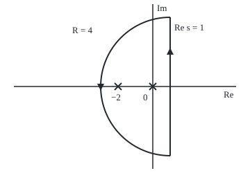
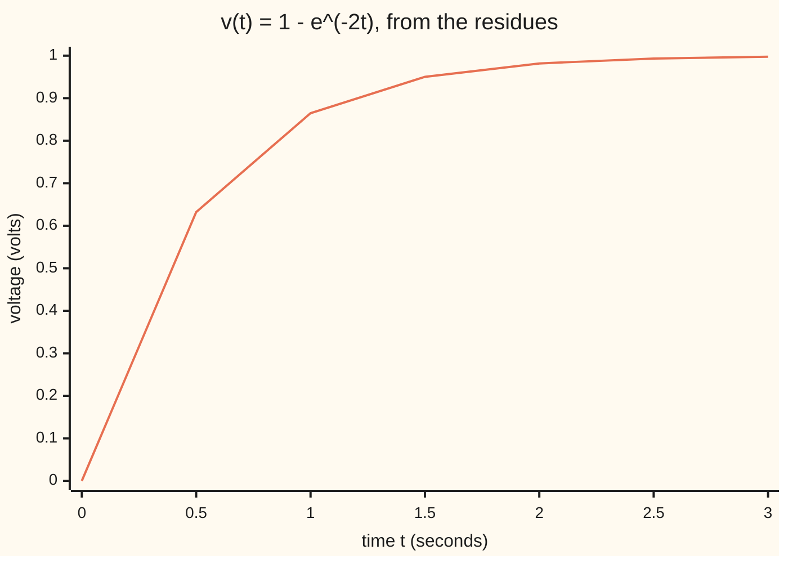

# Inverting a Laplace transform: integrate up a vertical line, close it to the left, and every pole hands back an exponential

[Syllabus](../../../SYLLABUS.md) → [Complex analysis](../../../SYLLABUS.md#w07) → [Transforms in Outline](../../../SYLLABUS.md#w07-s08) → Inverting a Laplace transform

---

## General Overview

A capacitor charges through a resistor from a 1-volt supply, starting empty at time 0; resistance times capacitance is half a second. Its voltage t seconds in is v(t) = 1 − e^(−2t): 0.6321 volts after half a second, 0.8647 after one, never quite 1.

The Laplace transform ([The Laplace transform](05-laplace-transform.md)) turns that curve into a function of a complex number s: V(s) = 2/(s(s + 2)). Circuit laws become algebra there, so engineers work with V(s), then need the curve back. This card is that return trip.

V(s) blows up at s = 0 and s = −2. Think of each as a tuning fork: its place sets how fast its tone dies, one number sets how loud. From here on the forks are **poles** and the loudness is the **residue** ([Residues](../05-Laurent%20Series%2C%20Singularities%20and%20Residues/04-residues.md)). The pole at 0 hands back 1, the pole at −2 hands back −e^(−2t), and their sum is the charging curve.

**To invert a Laplace transform, integrate V(s)e^(st) up a vertical line to the right of every pole, close the line with a large half circle to the left, and the residue theorem turns the integral into a sum: each pole a hands back its residue, a number times e^(at).**

**What kind of fact this is:** a method, resting on the inversion formula (proved from Fourier inversion in the folded Detailed proof) and the residue theorem; why closing to the left is allowed is proved in Why it works.

### The picture: the line, the half circle and the two poles

<p align="center"></p>

To scale: 25 units per 1, 0 at (220, 125), −2 at (170, 125), poles as crosses. The line Re s = 1 runs up x = 245 from y = 225 to 25; the half circle of radius 4 (100 units) swings left through x = 145. Triangles show the anticlockwise direction. The code uses radii 10, 100 and 1000.

---

## The formula

Reminders: Re s is the real part of s; Res is the residue, the coefficient of 1/(s − a) round a pole a. Limits c − i∞ to c + i∞ mean the path runs straight up the line where the real part is c.

$$v(t) = \frac{1}{2\pi i}\int_{c - i\infty}^{c + i\infty} V(s)\,e^{st}\,ds = \sum_{k} \operatorname{Res}\bigl(V(s)e^{st},\, a_k\bigr) \qquad (t > 0)$$

**Read it aloud:** the signal at time t is one over two pi i times the integral of V(s) e^(st) up a vertical line right of every pole, which equals the sum of the residues of V(s) e^(st).

The first equality is the **Bromwich integral**, after Thomas Bromwich, who used it to put Heaviside's circuit calculus on firm ground; the second is the residue theorem, once the line is closed. At a simple pole (V behaves like a constant over s − a) the residue is a limit, worked below:

$$\operatorname{Res}\bigl(V(s)e^{st}, a\bigr) = \lim_{s \to a}\,(s - a)\,V(s)\,e^{st}$$

| Symbol | Plain meaning | In our example | Push it up and the answer… |
| --- | --- | --- | --- |
| $v(t)$, $t$ | volts at time t seconds | 0.864665 at t = 1 | — |
| $V(s)$, $s$ | the transform, at a complex point s | 2/(s(s + 2)) | — |
| $c$ | real part of the line, right of every pole | 1 | no change, while c > 0 |
| $e^{st}$ | what each pole turns into a signal | e^(−2t) at s = −2 | — |
| $a_k$ | the k-th pole of V | 0 and −2 | further left, faster decay |
| $\operatorname{Res}$ | residue of V(s)e^(st) at a pole | 1 and −e^(−2t) | a louder exponential |
| $R$ | radius of the closing half circle | 4 drawn; 10, 100, 1000 in code | its share shrinks to 0 |
| $W$ | height where the code's sum up the line stops | 10, 100, 1000 | the sum nears v(t) |

### When it holds

- **The line sits right of every pole.** Here c > 0. Up Re s = −1, between the poles, the integral gives −0.135335 at t = 1: the signal whose transform lives on the strip between −2 and 0 ([Where a transform lives](06-strips-of-convergence-and-shifting-the-line.md)).
- **V fades on the big half circle.** Here it falls like 2 over R squared. The shelf's one-second pulse, (1 − e^(−s))/s, does not: e^(−s) grows to the left. It has no poles, so its residue sum is 0 at t = 0.5; the line integral gives 1.001, near the pulse's true value 1.
- **t > 0 to close left.** For t < 0, e^(st) explodes on the left, so close right: no poles, v = 0 before the switch. At t = −1 the line integral gives 0.000000.
- **Finitely many poles.** Infinitely many give an infinite sum, which needs its own convergence proof.

---

## Why it works

### Step 0: the Laplace transform is a Fourier transform in disguise

Multiply the signal by e^(−ct) and take its Fourier transform ([The Fourier transform](03-fourier-transform.md)). At frequency ω the result is V(c + iω): the Laplace transform read along the vertical line Re s = c, at height ω.

### Step 1: the Bromwich integral recovers the signal

Fourier inversion gives v(t)e^(−ct) as 1/(2π) times the integral of V(c + iω)e^(iωt) over all ω. Multiply by e^(ct) and write s = c + iω, so ds = i dω: that is the Bromwich integral. Summed up Re s = 1 to heights W = 10, 100 and 1000, it gives 0.876204, 0.864749 and 0.864663, closing on 0.864665.

### Step 2: close the line, and the residue theorem takes over

Cut the line at heights −R and R and join the ends with a half circle to the left: a closed loop, run anticlockwise, with both poles inside once R is big enough. By the residue theorem ([The residue theorem](../05-Laurent%20Series%2C%20Singularities%20and%20Residues/05-the-residue-theorem.md)), line piece plus arc share is exactly 1 − e^(−2t). At R = 10 they are 0.876204 and −0.011540, adding to 0.864664, the residue sum to within a millionth.

### Step 3: the half circle's share vanishes

On the half circle, s is at least R − 1 from 0 and at least R − 3 from −2, so |V(s)| is at most 2/((R − 1)(R − 3)). Its real part is at most c, so for t > 0, |e^(st)| is at most e^(ct). The arc is πR long. Its share is therefore at most R e^(ct)/((R − 1)(R − 3)), which falls to 0 like 1/R.

At t = 1 the code measures −0.011540, −0.000085 and 0.000001 for R = 10, 100 and 1000. So the full line integral equals the residue sum.

### Step 4: partial fractions are the same computation

Split V into partial fractions ([Rational functions](../05-Laurent%20Series%2C%20Singularities%20and%20Residues/03-rational-functions-and-partial-fractions.md)): 2/(s(s + 2)) = A/s + B/(s + 2). The term A/(s − a) is the transform of A e^(at), and its residue with e^(st) attached is also A e^(at). So each coefficient is a residue at t = 0, and inverting term by term is summing residues. The code finds A and B away from the poles, matching both sides at s = 1 and s = 3: A = 1.000000, B = −1.000000.

<details>
<summary>Detailed proof</summary>

**Inversion.** Let v be zero for t < 0, piecewise smooth, with |v(t)| ≤ M e^(bt), and take c > b. Then g(t) = v(t)e^(−ct) is absolutely integrable, with Fourier transform V(c + iω). Where v is continuous, Fourier inversion gives g(t) as the limit, as W → ∞, of (1/2π) times the integral from −W to W of V(c + iω)e^(iωt) dω; multiply by e^(ct) and put s = c + iω. At a jump the limit is the average of the two sides.

**Closing.** Let V be holomorphic (complex-differentiable) except at finitely many poles, all with real part below c, with |V(s)| ≤ K/|s|^2 for large |s|. The segment from c − iR to c + iR plus the half circle s = c + Re^(iθ), θ from π/2 to 3π/2, is a loop, and the residue theorem gives its integral over 2πi as the residue sum. On the half circle Re s ≤ c, so for t > 0 the arc integral is at most πR K e^(ct)/(R − |c|)^2, which tends to 0. If V only falls like 1/|s|, Jordan's lemma ([Jordan's lemma](../06-Real%20Integrals%20and%20Counting%20Zeros/03-oscillatory-integrals-and-jordans-lemma.md)) gives the same limit. For t < 0 close right: no poles, v = 0.

</details>

<details>
<summary>A double pole hands back t times an exponential</summary>

The residue of e^(st)/(s + 2)^2 at −2 is the derivative of e^(st) there: t e^(−2t). A repeated pole gives a signal that rises, then decays.

</details>

---

## Worked numbers, by hand

| Step | Arithmetic | Value |
| --- | --- | --- |
| Poles | s(s + 2) = 0 | 0 and −2 |
| Residue at 0 | 2e^(st)/(s + 2) at s = 0 | 1 |
| Residue at −2 | 2e^(st)/s at s = −2 | −e^(−2t) |
| Add them | 1 + (−e^(−2t)) | v(t) = 1 − e^(−2t) |
| At t = 1 | 1 − e^(−2) = 1 − 0.135335 | **0.864665 volts** |
| Forward check | transform of 1 − e^(−2t) at s = 1 | 0.666667 = V(1) |

One second in, the capacitor holds 0.864665 of the supply's 1 volt.

### The picture: the charging curve



The line is the residue sum; the line integral at W = 1000 matches it from t = 0.5 to 3, to four decimals.

### What breaks if you drop a piece

| Mistake | Comes out at | What went wrong |
| --- | --- | --- |
| Line run up Re s = −1, between the poles | −0.135335 at t = 1, not 0.864665 | only −2 is enclosed: a different signal |
| e^(st) dropped from the residues | 0.000000, at every t | residues of V alone are 1 and −1 |
| Pulse (1 − e^(−s))/s closed to the left | 0 at t = 0.5; the line gives 1.001 | e^(−s) grows on the left half circle |

The code prints all three.

---

## Code, from first principles, and it actually runs

Two roads to v(1). Road one adds the residues. Road two never mentions a pole: a trapezoid sum of the Bromwich integral up Re s = 1. The code also measures the arc's share, solves for the partial fractions and transforms the answer forwards, back to V(1).

### Python

```python
# Inverting a Laplace transform -- the check behind the card.  V(s) = 2/(s(s + 2))
# is the charging capacitor's voltage.  Road one: residues of V(s)e^(st), each by
# its own limit.  Road two: the Bromwich integral itself, summed up the line Re s = 1.
import math
POLES, C = [0, -2], 1.0

def cexp(z):                           # e^z from e^x, cos and sin
    return math.exp(z.real) * complex(math.cos(z.imag), math.sin(z.imag))

def V(s): return 2 / (s * (s + 2))

def res(a, t):                         # (s - a)V(s)e^(st) = 2e^(st)/(s - b), b the other pole; s -> a
    b = [p for p in POLES if p != a][0]
    return 2 / (a - b) * math.exp(a * t)

def by_residues(t):                    # t > 0: close left, both poles; t < 0: close right, none
    return sum(res(a, t) for a in POLES) if t >= 0 else 0.0

def line(F, t, W, c=C, h=0.01):        # (1/(2 pi i)) x integral up Re s = c, from c - iW to c + iW;
    n = round(W / h)                   # F(conj s) = conj F(s), so twice the real part of the top half
    tot = sum((F(complex(c, k * h)) * cexp(complex(c, k * h) * t)).real * (0.5 if k in (0, n) else 1)
              for k in range(n + 1))
    return tot * h / math.pi + 0.0

def arc(t, R, n):                      # (1/(2 pi i)) x integral round the left half circle, radius R
    ws = [cexp(1j * (math.pi / 2 + k * math.pi / n)) for k in range(n + 1)]
    tot = sum(V(C + R * w) * cexp((C + R * w) * t) * R * w * (0.5 if k in (0, n) else 1) for k, w in enumerate(ws))
    return tot / (2 * n)

def forward(f, s, T=40.0, n=80000):    # Laplace transform of f at s, trapezoid on [0, T]
    return T / n * sum(f(k * T / n) * math.exp(-s * k * T / n) * (0.5 if k in (0, n) else 1) for k in range(n + 1))

print(f"residues of V(s)e^(st) at t = 0: at 0 {res(0, 0):.6f}, at -2 {res(-2, 0):.6f}")
d = 1 / 5 - 1 / 9                       # match A/s + B/(s + 2) to V at s = 1 and 3, by Cramer's rule
A, B = (V(1) / 5 - V(3) / 3) / d, (V(3) - V(1) / 3) / d
print(f"partial fractions, matched at s = 1 and s = 3: A = {A:.6f}, B = {B:.6f}")
print(f"v(1) by residues: {res(0, 1):.6f} + ({res(-2, 1):.6f}) = {by_residues(1):.6f}")
lines = [line(V, 1, W) for W in (10, 100, 1000)]
print("v(1) by the line integral, W = 10, 100, 1000: " + ", ".join(f"{x:.6f}" for x in lines))
arcs = [arc(1, R, 100 * R) for R in (10, 100, 1000)]
print("left arc's share at t = 1, R = 10, 100, 1000: " + ", ".join(f"{x.real:.6f}" for x in arcs))
ts = [0, 0.5, 1, 1.5, 2, 2.5, 3]
print("chart, v(t) at t = 0 to 3 by residues: " + ", ".join(f"{by_residues(t):.4f}" for t in ts))
print("chart, t = 0.5 to 3 by the line integral, W = 1000: " + ", ".join(f"{line(V, t, 1000):.4f}" for t in ts[1:]))
neg = line(V, -1, 1000)
print(f"t = -1: residues, closing right, {by_residues(-1):.6f}; line integral {abs(neg):.6f}")
fw = forward(by_residues, 1.0)
print(f"forward check, Laplace transform of 1 - e^(-2t) at s = 1: {fw:.6f}; V(1) = {V(1):.6f}")
left = line(V, 1, 1000, c=-1.0)
print(f"mistake, line at Re s = -1, between the poles: {left:.6f}, not {by_residues(1):.6f}")
print(f"mistake, e^(st) dropped: residues of V alone sum to {res(0, 0) + res(-2, 0):.6f}")
pl = line(lambda s: (1 - cexp(-s)) / s, 0.5, 1000)
print(f"break, pulse (1 - e^(-s))/s at t = 0.5: residue sum 0.000; line integral {pl:.3f}")
print("figure, 25 units per 1, 0 at (220, 125); -2 at (170, 125); Re s = 1 at x = 245, "
      "y from 25 to 225; left arc radius 100 (R = 4), leftmost x = 145")
assert abs(lines[2] - by_residues(1)) < 1e-5 and abs(neg) < 1e-4           # two roads agree
assert all(abs(lines[i] + arcs[i].real - by_residues(1)) < 1e-5 for i in range(3))  # line + arc = residues
assert abs(A - res(0, 0)) < 1e-12 and abs(B - res(-2, 0)) < 1e-12           # partial fractions = residues
assert abs(fw - V(1)) < 1e-6 and abs(pl - 1) < 1e-2                          # back to V; the pulse needs the line
print("ALL CHECKS PASS")
```

**Ran 2026-09-28 on macOS, Python 3.14.6, standard library only. All checks passed. Output, pasted from the run:**

```
residues of V(s)e^(st) at t = 0: at 0 1.000000, at -2 -1.000000
partial fractions, matched at s = 1 and s = 3: A = 1.000000, B = -1.000000
v(1) by residues: 1.000000 + (-0.135335) = 0.864665
v(1) by the line integral, W = 10, 100, 1000: 0.876204, 0.864749, 0.864663
left arc's share at t = 1, R = 10, 100, 1000: -0.011540, -0.000085, 0.000001
chart, v(t) at t = 0 to 3 by residues: 0.0000, 0.6321, 0.8647, 0.9502, 0.9817, 0.9933, 0.9975
chart, t = 0.5 to 3 by the line integral, W = 1000: 0.6321, 0.8647, 0.9502, 0.9817, 0.9933, 0.9975
t = -1: residues, closing right, 0.000000; line integral 0.000000
forward check, Laplace transform of 1 - e^(-2t) at s = 1: 0.666667; V(1) = 0.666667
mistake, line at Re s = -1, between the poles: -0.135335, not 0.864665
mistake, e^(st) dropped: residues of V alone sum to 0.000000
break, pulse (1 - e^(-s))/s at t = 0.5: residue sum 0.000; line integral 1.001
figure, 25 units per 1, 0 at (220, 125); -2 at (170, 125); Re s = 1 at x = 245, y from 25 to 225; left arc radius 100 (R = 4), leftmost x = 145
ALL CHECKS PASS
```

### Rust

Same numbers, same labels, built with `rustc --edition 2021 -O`. Complex arithmetic is a small struct at the top.

```rust
// Inverting a Laplace transform -- the same check as the Python, in Rust.  No crates.
// V(s) = 2/(s(s + 2)) is the charging capacitor's voltage.  Road one: residues of
// V(s)e^(st), each by its own limit.  Road two: the Bromwich integral up Re s = 1.
use std::f64::consts::PI;
use std::ops::{Add, Div, Mul, Sub};
#[derive(Clone, Copy)]
struct Cx { re: f64, im: f64 }
impl Add for Cx { type Output = Cx; fn add(self, o: Cx) -> Cx { c(self.re + o.re, self.im + o.im) } }
impl Sub for Cx { type Output = Cx; fn sub(self, o: Cx) -> Cx { c(self.re - o.re, self.im - o.im) } }
impl Mul for Cx { type Output = Cx; fn mul(self, o: Cx) -> Cx {
    c(self.re * o.re - self.im * o.im, self.re * o.im + self.im * o.re) } }
impl Div for Cx { type Output = Cx; fn div(self, o: Cx) -> Cx {
    let d = o.re * o.re + o.im * o.im;
    c((self.re * o.re + self.im * o.im) / d, (self.im * o.re - self.re * o.im) / d) } }
fn c(re: f64, im: f64) -> Cx { Cx { re, im } }
fn r(x: f64) -> Cx { c(x, 0.0) }
fn cexp(z: Cx) -> Cx { r(z.re.exp()) * c(z.im.cos(), z.im.sin()) }    // e^z from e^x, cos and sin
const POLES: [f64; 2] = [0.0, -2.0];
const C: f64 = 1.0;
fn v_of(s: Cx) -> Cx { r(2.0) / (s * (s + r(2.0))) }
fn vr(s: f64) -> f64 { 2.0 / (s * (s + 2.0)) }
fn res(a: f64, t: f64) -> f64 {        // (s - a)V(s)e^(st) = 2e^(st)/(s - b), b the other pole; s -> a
    let b = if a == POLES[0] { POLES[1] } else { POLES[0] };
    2.0 / (a - b) * (a * t).exp()
}
fn by_residues(t: f64) -> f64 { if t >= 0.0 { POLES.iter().map(|&a| res(a, t)).sum() } else { 0.0 } }
fn line(f: &dyn Fn(Cx) -> Cx, t: f64, w: f64, cc: f64) -> f64 {    // (1/(2 pi i)) x integral up Re s = cc
    let (h, mut tot) = (0.01, 0.0);
    let n = (w / h).round() as usize;
    for k in 0..=n {
        let s = c(cc, k as f64 * h);
        tot += (f(s) * cexp(s * r(t))).re * if k == 0 || k == n { 0.5 } else { 1.0 };
    }
    tot * h / PI + 0.0
}
fn arc(t: f64, rr: f64, n: usize) -> f64 {     // (1/(2 pi i)) x integral round the left half circle
    let mut tot = 0.0;
    for k in 0..=n {
        let th = PI / 2.0 + k as f64 * PI / n as f64;
        let (w, wt) = (c(th.cos(), th.sin()), if k == 0 || k == n { 0.5 } else { 1.0 });
        let s = r(C) + r(rr) * w;
        tot += (v_of(s) * cexp(s * r(t)) * r(rr) * w).re * wt;
    }
    tot / (2 * n) as f64
}
fn forward(f: &dyn Fn(f64) -> f64, s: f64) -> f64 {   // Laplace transform of f at s, trapezoid on [0, 40]
    let (tt, n) = (40.0, 80000);
    let h = tt / n as f64;
    (0..=n).map(|k| f(k as f64 * h) * (-s * k as f64 * h).exp() * if k == 0 || k == n { 0.5 } else { 1.0 }).sum::<f64>() * h
}
fn join(xs: &[f64], p: usize) -> String { xs.iter().map(|x| format!("{:.*}", p, x)).collect::<Vec<_>>().join(", ") }
fn main() {
    println!("residues of V(s)e^(st) at t = 0: at 0 {:.6}, at -2 {:.6}", res(0.0, 0.0), res(-2.0, 0.0));
    let d = 1.0 / 5.0 - 1.0 / 9.0;     // match A/s + B/(s + 2) to V at s = 1 and 3, by Cramer's rule
    let (a, b) = ((vr(1.0) / 5.0 - vr(3.0) / 3.0) / d, (vr(3.0) - vr(1.0) / 3.0) / d);
    println!("partial fractions, matched at s = 1 and s = 3: A = {:.6}, B = {:.6}", a, b);
    println!("v(1) by residues: {:.6} + ({:.6}) = {:.6}", res(0.0, 1.0), res(-2.0, 1.0), by_residues(1.0));
    let lines: Vec<f64> = [10.0, 100.0, 1000.0].iter().map(|&w| line(&v_of, 1.0, w, C)).collect();
    println!("v(1) by the line integral, W = 10, 100, 1000: {}", join(&lines, 6));
    let arcs: Vec<f64> = [10.0, 100.0, 1000.0].iter().map(|&rr| arc(1.0, rr, 100 * rr as usize)).collect();
    println!("left arc's share at t = 1, R = 10, 100, 1000: {}", join(&arcs, 6));
    let ts = [0.0, 0.5, 1.0, 1.5, 2.0, 2.5, 3.0];
    println!("chart, v(t) at t = 0 to 3 by residues: {}", join(&ts.map(by_residues), 4));
    println!("chart, t = 0.5 to 3 by the line integral, W = 1000: {}", join(&ts[1..].iter().map(|&t| line(&v_of, t, 1000.0, C)).collect::<Vec<_>>(), 4));
    let neg = line(&v_of, -1.0, 1000.0, C);
    println!("t = -1: residues, closing right, {:.6}; line integral {:.6}", by_residues(-1.0), neg.abs());
    let fw = forward(&by_residues, 1.0);
    println!("forward check, Laplace transform of 1 - e^(-2t) at s = 1: {:.6}; V(1) = {:.6}", fw, vr(1.0));
    println!("mistake, line at Re s = -1, between the poles: {:.6}, not {:.6}", line(&v_of, 1.0, 1000.0, -1.0), by_residues(1.0));
    println!("mistake, e^(st) dropped: residues of V alone sum to {:.6}", res(0.0, 0.0) + res(-2.0, 0.0));
    let pl = line(&|s: Cx| (r(1.0) - cexp(r(0.0) - s)) / s, 0.5, 1000.0, C);
    println!("break, pulse (1 - e^(-s))/s at t = 0.5: residue sum 0.000; line integral {:.3}", pl);
    println!("figure, 25 units per 1, 0 at (220, 125); -2 at (170, 125); Re s = 1 at x = 245, \
              y from 25 to 225; left arc radius 100 (R = 4), leftmost x = 145");
    assert!((lines[2] - by_residues(1.0)).abs() < 1e-5 && neg.abs() < 1e-4);          // two roads agree
    assert!((0..3).all(|i| (lines[i] + arcs[i] - by_residues(1.0)).abs() < 1e-5));   // line + arc = residues
    assert!((a - res(0.0, 0.0)).abs() < 1e-12 && (b - res(-2.0, 0.0)).abs() < 1e-12); // partial fractions = residues
    assert!((fw - vr(1.0)).abs() < 1e-6 && (pl - 1.0).abs() < 1e-2);                  // back to V; the pulse needs the line
    println!("ALL CHECKS PASS");
}
```

**Ran 2026-09-28 on macOS, rustc 1.98.1, no crates. All checks passed. Output, pasted from the run:**

```
residues of V(s)e^(st) at t = 0: at 0 1.000000, at -2 -1.000000
partial fractions, matched at s = 1 and s = 3: A = 1.000000, B = -1.000000
v(1) by residues: 1.000000 + (-0.135335) = 0.864665
v(1) by the line integral, W = 10, 100, 1000: 0.876204, 0.864749, 0.864663
left arc's share at t = 1, R = 10, 100, 1000: -0.011540, -0.000085, 0.000001
chart, v(t) at t = 0 to 3 by residues: 0.0000, 0.6321, 0.8647, 0.9502, 0.9817, 0.9933, 0.9975
chart, t = 0.5 to 3 by the line integral, W = 1000: 0.6321, 0.8647, 0.9502, 0.9817, 0.9933, 0.9975
t = -1: residues, closing right, 0.000000; line integral 0.000000
forward check, Laplace transform of 1 - e^(-2t) at s = 1: 0.666667; V(1) = 0.666667
mistake, line at Re s = -1, between the poles: -0.135335, not 0.864665
mistake, e^(st) dropped: residues of V alone sum to 0.000000
break, pulse (1 - e^(-s))/s at t = 0.5: residue sum 0.000; line integral 1.001
figure, 25 units per 1, 0 at (220, 125); -2 at (170, 125); Re s = 1 at x = 245, y from 25 to 225; left arc radius 100 (R = 4), leftmost x = 145
ALL CHECKS PASS
```

The two outputs match line for line.

> [!TIP]
> **Try changing**
> Guess first, then run it.
> - **Slide the line.** Set `C = 0.5`. Still right of both poles: every assert passes.
> - **Slide it past a pole.** Set `C = -0.5`. Now 0 is on the line's right, it returns about −0.135335, and the first assert stops the run.
> - **Stop the line early.** Change `lines[2]` to `lines[1]` in the first assert. At W = 100 the line's 0.864749 misses the tolerance, and the assert stops the run.

---

## The usual mistake

> [!warning]
> **Placing the line anywhere.** It must sit right of every pole. At Re s = −1, closing encloses only −2, and the answer at t = 1 is −0.135335, not 0.864665: a different signal.
>
> - **Forgetting e^(st).** The residues of V alone sum to 0 at every time.
> - **Closing left always.** It fails for the pulse, whose e^(−s) grows to the left, and for t < 0, where e^(st) does.

---

## Where you meet it in real life

- **Circuit analysis.** A linear circuit driven by a step or a sine has a rational transform, and its response is a sum of exponentials, one per pole.
- **Control engineering.** A system is stable when every pole sits in the left half plane, since each then hands back a decaying exponential: [Transfer functions](../../13-Engineering%20mathematics/02-Linear%20Systems%20and%20Transforms/02-impulse-response-and-transfer-functions.md).
- **Delayed inputs.** A factor e^(−s) delays a signal by one second and blocks closing left. Split it off, invert the rest, then shift the answer.

> **Say it back**
> Integrate V(s)e^(st) up a vertical line right of every pole. For t > 0, close it to the left with a big half circle, whose share fades when V falls fast enough. The residue theorem turns the integral into a sum: each pole a gives a number times e^(at). For the capacitor, 0 and −2 give 1 and −e^(−2t), so v(1) = 0.864665. Partial fractions are the same sum.

---

## What this builds on

- [Where a transform lives](06-strips-of-convergence-and-shifting-the-line.md): why the line must sit right of every pole, and what a line between poles inverts instead.
- [The residue theorem](../05-Laurent%20Series%2C%20Singularities%20and%20Residues/05-the-residue-theorem.md): the closed loop's integral as 2πi times the residues inside.
- [Rational functions](../05-Laurent%20Series%2C%20Singularities%20and%20Residues/03-rational-functions-and-partial-fractions.md): splitting V into A/s + B/(s + 2).

## Where this goes next

- [Transfer functions](../../13-Engineering%20mathematics/02-Linear%20Systems%20and%20Transforms/02-impulse-response-and-transfer-functions.md): a system's poles as its fingerprint, and its response to any input.

The same poles predict a circuit's output for every input, and whether it stays bounded.

---

## Sources

Verified 2026-09-28: every link below resolves to the publisher's page.

- Schiff, Joel L. *The Laplace Transform: Theory and Applications*. Undergraduate Texts in Mathematics. Springer, 1999. [Publisher page](https://link.springer.com/book/10.1007/978-0-387-22757-3). The complex inversion formula, and inversion by residues.
- Orloff, Jeremy. "Topic 12: Laplace transform." 18.04 Complex Variables with Applications, MIT OpenCourseWare, Spring 2018. [Course notes](https://ocw.mit.edu/courses/18-04-complex-variables-with-applications-spring-2018/resources/mit18_04s18_topic12/). Free; cover-up partial fractions and the inverse as a residue sum.
- O'Connor, J. J., and E. F. Robertson. "Thomas Bromwich." MacTutor Archive, University of St Andrews. [Biography](https://mathshistory.st-andrews.ac.uk/Biographies/Bromwich/). Bromwich's contour-integral footing for Heaviside's calculus.
