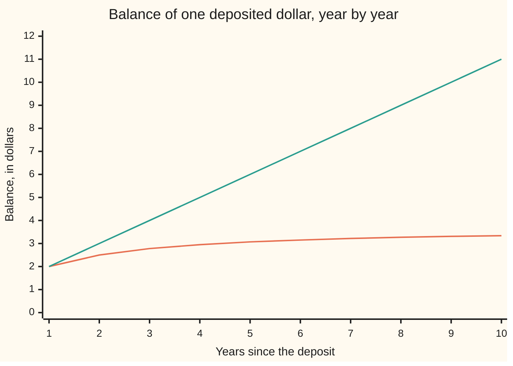
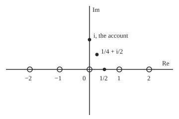

# Infinite products: a product converges exactly when the sum of its small parts does, and sine is a product over its zeros

Complex analysis → Special Functions and the Zeta Function → Multiplying without end → Infinite products

---

## General Overview

An account pays rate 1/n^2 in year n: 100%, then 25%, then about 11%. Payments stay in, so each year multiplies the balance by 1 plus that year's rate. A dollar grows to 2.00, 2.50, 2.78, then 3.342847 after ten years and 3.672406 after a thousand. It settles at 3.676078, which is sinh(π)/π; sinh is the hyperbolic sine, sinh x = (e^x − e^(−x))/2.

A second account pays 1/n in year n. Its rates also shrink to nothing, yet after N years the balance is exactly N + 1. It never settles. The difference is the rates' total: the 1/n^2 rates add to π^2/6 = 1.644934, the 1/n rates to no finite number.

A product of endlessly many factors is an **infinite product**. Logarithms turn it into a sum, so the test for sums becomes a test for products. In the plane the same test makes Euler's product for sine work: at z = i it is the first account, at z = 1/2 Wallis's product for π/2 = 1.570796327.

**A product of factors 1 + a_n settles on a nonzero limit when the sizes of the small parts a_n have a finite total, since its logarithm is then a convergent sum; and sin(πz) is πz times the product of 1 − z^2/n^2, one factor per pair of zeros.**

**What kind of fact this is:** a theorem. The product test is proved on this card in Why it works; Euler's sine product is proved in its folded Detailed proof.

### The picture: two accounts, ten years



Orange: rates 1/n^2, flattening towards 3.676078. Green: rates 1/n, climbing to N + 1.

### The picture: sine's zeros, and three places the product is read

<p align="center"></p>

To scale: 60 units per 1, 0 at (180, 140). Open circles: zeros of sin(πz), one at every whole number. Dots: 1/2 at (210, 140), i at (180, 80), 1/4 + i/2 at (195, 110).

---

## The formula

A capital pi, $\prod$, means multiply the terms, as sigma means add them. The product **converges** when its partial products approach a limit that is not zero; Step 2 says why zero counts as divergence.

$$P_N = \prod_{n=1}^{N} (1 + a_n), \qquad \log P_N = \sum_{n=1}^{N} \log(1 + a_n)$$

**Read it aloud:** the balance after N years is the product of the yearly factors, and its logarithm is the sum of their logarithms.

$$S = \sum_{n=1}^{\infty} |a_n| < \infty \;\Longrightarrow\; P_N \to P \ne 0 \text{ (no factor zero)}, \qquad 1 + S \le P \le e^{S} \text{ when every } a_n \ge 0$$

**Read it aloud:** if the sizes of the small parts have a finite total, the product settles on a nonzero limit; for positive parts it lies between one plus that total and e to it.

$$\sin(\pi z) = \pi z \prod_{n=1}^{\infty} \left(1 - \frac{z^2}{n^2}\right)$$

**Read it aloud:** sine of π z is π z times, over every whole number n, one minus z squared over n squared.

At z = i each factor is 1 + 1/n^2 and sin(πi) = i sinh(π) ([exponential-sine-and-cosine-in-the-plane](../02-Holomorphic%20Functions/03-exponential-sine-and-cosine-in-the-plane.md)): the account. At z = 1/2 each factor is 1 − 1/(4n^2); turned upside down, that is Wallis:

$$\frac{\pi}{2} = \prod_{n=1}^{\infty} \frac{4n^2}{4n^2 - 1}$$

| Symbol | Plain meaning | In our example | Push it up and the answer… |
| --- | --- | --- | --- |
| $a_n$ | factor n's small part: year n's rate | 1/n^2 | settles later, or never |
| $n$, $N$ | a year; how many years are kept | N = 10 | closer to the limit |
| $P_N$, $P$ | balance per dollar after N years; its limit | 3.342847; 3.676078 | — |
| $\prod$ | multiply the terms | — | — |
| $S$ | total size of the small parts, the sum of $\lvert a_n \rvert$ | 1.644934 | the limit may reach e^S |
| $\log$ | principal logarithm; on positive numbers, ln | ln 3.676078 = 1.301846 | — |
| $z$ | a point of the plane | i, 1/2, 1/4 + i/2 | a whole number gives a zero factor |
| $\sinh$ | hyperbolic sine | sinh(π)/π = 3.676078 | — |

### When it holds

- **The sizes must add up, not the signed parts.** Rates of ±1/√n have a finite signed total, 0.396682 by year 100,000, yet the balance drains to 0.005316.
- **No factor may be zero.** One zero factor makes the product zero; the sine product uses that to place its zeros.
- **In the plane, one bound must serve a whole disc.** Then the product is holomorphic there; for sine on the disc |z| ≤ R the bound is R^2/n^2.
- **Matching zeros is not enough.** e^z sin(πz) has sine's zeros too; Step 5 pins down the free factor.

---

## Why it works

### Step 0: logarithms turn multiplying into adding

The log of a product is the sum of the logs. So the balance settles exactly when the sum of yearly logs does: on the first account, e to the 1.301846 is 3.676078.

### Step 1: a small factor's log is close to its small part

For a complex number a of size at most 1/2, the series log(1 + a) = a − a^2/2 + a^3/3 − … ([complex-logarithm](../02-Holomorphic%20Functions/04-complex-logarithm.md)) has a tail after a of size at most (|a|^2/2)(1 + |a| + |a|^2 + …) ≤ |a|^2. So |log(1 + a)| lies between |a|/2 and 3|a|/2.

### Step 2: a finite total gives a convergent sum of logs

If $S$ is finite, the parts shrink to 0, so past some year every |a_n| is at most 1/2 and each |log(1 + a_n)| at most 3|a_n|/2. By comparison ([comparison-ratio-and-root-tests](../../06-Calculus%20and%20analysis/06-Series/02-comparison-ratio-and-root-tests.md)) the logs converge to some L, and P_N tends to e^L times the early factors. Since e^L is never zero, neither is P. A product sliding to zero is a log sum running to minus infinity: divergence.

### Step 3: for positive parts the test runs both ways

When every a_n is at least 0, multiplying out gives P_N ≥ 1 + a_1 + … + a_N, and 1 + a ≤ e^a gives P_N ≤ e^(a_1 + … + a_N). Product and sum are bounded together or not at all: 2.644934 ≤ 3.676078 ≤ 5.180668 on the first account. The 1/n account telescopes, 2 × 3/2 × 4/3 × … × (N + 1)/N = N + 1, unbounded like the harmonic sum.

### Step 4: in the plane the product is holomorphic

Now a_n(z) = −z^2/n^2. On the disc |z| ≤ R the sizes are at most R^2/n^2, a finite total. Past the first few factors, Step 1 makes the sum of logs converge uniformly on the disc, so it is holomorphic ([uniform-limits-of-holomorphic-functions](../04-Taylor%20Series%2C%20Zeros%20and%20Rigidity/02-uniform-limits-of-holomorphic-functions.md)), and so is e to it. The early factors are polynomials. The product is holomorphic everywhere and zero exactly where a factor is: at 0, ±1, ±2, …, the zeros of sin(πz).

### Step 5: Euler's product equals sine

Equal zeros do not make equal functions. The product's logarithmic derivative, its derivative divided by itself, is 1/z plus the sum of 2z/(z^2 − n^2). The residue theorem gives sine's, π cot(πz), the same expansion. So the two differ by a constant factor, which is 1 since both behave like πz near 0.

<details>
<summary>Detailed proof</summary>

**Setting.** Let $g(z) = \pi z \prod_{n \ge 1}(1 - z^2/n^2)$. By Step 4, differentiating its log sum term by term gives $g'(z)/g(z) = 1/z + \sum_{n \ge 1} 2z/(z^2 - n^2)$ at every z that is not a whole number.

**Partial fractions of the cotangent.** Fix such a z. Integrate $\pi\cot(\pi w)/(w^2 - z^2)$ anticlockwise round the square with corners $(M + \tfrac12)(\pm 1 \pm i)$. There cot stays bounded while $|w^2 - z^2|$ grows like $M^2$ along a path of length $8M + 4$, so the integral tends to 0.

**The residues.** Near $w = n$, $\pi\cot(\pi w) \approx 1/(w - n)$, giving residue $1/(n^2 - z^2)$; at $w = \pm z$ the two residues sum to $\pi\cot(\pi z)/z$. By the residue theorem ([the-residue-theorem](../05-Laurent%20Series%2C%20Singularities%20and%20Residues/05-the-residue-theorem.md)), letting $M \to \infty$:
$$\frac{\pi\cot(\pi z)}{z} + \sum_{n = -\infty}^{\infty} \frac{1}{n^2 - z^2} = 0, \quad\text{so}\quad \pi\cot(\pi z) = \frac1z + \sum_{n \ge 1}\frac{2z}{z^2 - n^2}.$$

**The constant.** Since $\pi\cot(\pi z)$ is also sine's logarithmic derivative, $g/\sin(\pi z)$ has derivative 0 off the whole numbers, a connected set, so it is a constant; near 0 both behave like $\pi z$, so it is 1.

</details>

<details>
<summary>Euler's sum of 1/n^2 falls out</summary>

The coefficient of z^2 in the product is minus the sum of 1/n^2; in sin(πz)/(πz) = 1 − π^2 z^2/6 + … it is −π^2/6. So the first account's total S is π^2/6, as Euler found.

</details>

Building any entire function from its zeros, the Weierstrass and Hadamard factorisations, is left to wing 21.

---

## Worked numbers, by hand

| Step | Arithmetic | Value |
| --- | --- | --- |
| Year 1 | 1 × (1 + 1/1) | 2.00 |
| Year 2 | 2 × (1 + 1/4) | 2.50 |
| Year 3 | 2.5 × (1 + 1/9) | 2.78 |
| Year 10 | seven more factors | 3.342847 |
| Total of the rates | 1 + 1/4 + 1/9 + … = π^2/6 | 1.644934 |
| The sandwich | 1 + S ≤ P ≤ e^S | 2.644934 ≤ P ≤ 5.180668 |
| The limit | Euler's product at z = i: sinh(π)/π | **3.676078** |
| Wallis, 10 factors | (2/1 · 2/3)(4/3 · 4/5)… | 1.533852 |
| Wallis, the limit | Euler's product at z = 1/2, turned over | **1.570796327** |

Wallis's gap times N runs 0.369444, 0.390258, 0.392454 towards π/8 = 0.392699, so each extra digit costs ten times the factors.

### What breaks if you drop a piece

| Mistake | Comes out at | What went wrong |
| --- | --- | --- |
| Rates 1/n, not 1/n^2 | 11, 101, 1001 after 10, 100, 1000 years | the rates' total is infinite |
| Rates added, not multiplied | 1 + S = 2.644934, not 3.676078 | no interest on interest |
| A loss of 1/(n + 1) a year | 0.009901 after 100 years, heading to 0 | the losses' total is infinite: divergence to zero |
| Alternating ±1/√n | rates total 0.396682 by year 10^5; balance 0.176453, 0.016868, 0.005316 | the signed parts converge, the sizes do not |

The code prints all four.

---

## Code, from first principles, and it actually runs

Two roads to the account's limit: 100,000 factors with the tail added through its log, and sinh(π)/π from exponentials. Wallis is checked against π/2, and Euler's product at 1/4 + i/2 against sin(πz) built from exponentials.

### Python

```python
# Infinite products -- the check behind the card.  Standard library only.
# The account: year n pays rate 1/n^2, so the balance multiplies by 1 + 1/n^2.  Road one multiplies
# the factors and adds the tail through its log; road two is sinh(pi)/pi from exponentials, which is
# Euler's sine product read at z = i.  Wallis is the same product at z = 1/2.
import math

def prod(a, n0, N):                            # (1 + a(n0)) (1 + a(n0 + 1)) ... (1 + a(N))
    p = 1
    for n in range(n0, N + 1):
        p *= 1 + a(n)
    return p
def cexp(w):                                   # e^w for complex w, from exp, cos and sin
    return math.exp(w.real) * complex(math.cos(w.imag), math.sin(w.imag))
def show(w):                                   # 'a + bi', six decimals, no -0.000000
    a, b = round(w.real, 6) + 0.0, round(w.imag, 6) + 0.0
    return f"{a:.6f} {'-' if b < 0 else '+'} {abs(b):.6f}i"
def sine_product(z, N):                        # pi z times N factors (1 - z^2/n^2), tail added by its log
    return math.pi * z * prod(lambda n: -z * z / n ** 2, 1, N) * cexp(-z * z * (1 / N - 1 / (2 * N * N)))
def sin_pi(z):                                 # sin(pi z) = (e^(i pi z) - e^(-i pi z)) / 2i
    return (cexp(1j * math.pi * z) - cexp(-1j * math.pi * z)) / 2j

N = 100000
S = sum(1 / n ** 2 for n in range(1, N + 1)) + 1 / N - 1 / (2 * N * N) + 1 / (6 * N ** 3)   # sum of the rates
road1 = prod(lambda n: 1 / n ** 2, 1, N) * math.exp(1 / N - 1 / (2 * N * N))
road2 = (math.exp(math.pi) - math.exp(-math.pi)) / (2 * math.pi)
logs = sum(math.log(1 + 1 / n ** 2) for n in range(1, N + 1)) + 1 / N
print(f"rate 1/n^2, balance per 1 after 10, 100, 1000 years: "
      + ", ".join(f"{prod(lambda n: 1 / n ** 2, 1, k):.6f}" for k in (10, 100, 1000)))
print(f"road one, factors multiplied plus tail: {road1:.6f}; road two, sinh(pi)/pi: {road2:.6f}")
print(f"sum of logs {logs:.6f}; sum of rates S = pi^2/6 {S:.6f}")
print(f"bounds: 1 + S = {1 + S:.6f} <= balance {road1:.6f} <= e^S = {math.exp(S):.6f}")
print(f"rate 1/n, balance after 10, 100, 1000 years: "
      + ", ".join(f"{prod(lambda n: 1 / n, 1, k):.6f}" for k in (10, 100, 1000)))
print("chart, rate 1/n^2, years 1-10: " + ", ".join(f"{prod(lambda n: 1 / n ** 2, 1, k):.2f}" for k in range(1, 11)))
print("chart, rate 1/n, years 1-10: " + ", ".join(f"{prod(lambda n: 1 / n, 1, k):.0f}" for k in range(1, 11)))
wallis = {k: prod(lambda n: 1 / (4 * n * n - 1), 1, k) for k in (10, 100, 1000)}
for k, w in wallis.items():
    print(f"Wallis, {k} factors: {w:.6f}, gap to pi/2 x N = {(math.pi / 2 - w) * k:.6f}")
wal_tail = wallis[1000] * math.exp(1 / (4 * 1000 + 2))
print(f"Wallis plus tail {wal_tail:.9f}; pi/2 {math.pi / 2:.9f}; pi/8 {math.pi / 8:.6f}")
z = complex(0.25, 0.5)
eu, sp = sine_product(z, 10000), sin_pi(z)
print(f"z = 1/4 + i/2: sine product {show(eu)}; sin(pi z) from exponentials {show(sp)}")
print(f"z = 3: sine product {show(sine_product(3, 10))}, the n = 3 factor is 1 - 9/9 = 0")
alt = lambda n: (-1) ** n / math.sqrt(n)       # gain 1/sqrt(n) in even years, lose it in odd ones
print(f"mistake, rates (-1)^n/sqrt(n) from year 2: sum of rates to 10^5 {sum(alt(n) for n in range(2, N + 1)):.6f}, "
      f"balance after 100, 10^4, 10^5: {prod(alt, 2, 100):.6f}, {prod(alt, 2, 10000):.6f}, {prod(alt, 2, N):.6f}")
print(f"mistake, adding the rates: {S:.6f}, not {road1:.6f}; rates -1/(n+1): {prod(lambda n: -1 / (n + 1), 1, 100):.6f} after 100 years")
print("figure, 60 per unit, 0 at (180, 140): zeros at x = " + ", ".join(f"{180 + 60 * k}" for k in range(-2, 3))
      + f"; 1/2 at ({180 + 60 * 0.5:.0f}, 140), i at (180, {140 - 60:.0f}), 1/4 + i/2 at ({180 + 60 * z.real:.0f}, {140 - 60 * z.imag:.0f})")
assert abs(road1 - road2) < 1e-9                                  # multiplying meets sinh(pi)/pi
assert abs(wal_tail - math.pi / 2) < 1e-9                          # Wallis meets pi/2
assert abs(eu - sp) < 1e-9                                         # Euler's product holds off the line
assert 1 + S < road1 < math.exp(S)                                 # the product sits between 1 + S and e^S
print("ALL CHECKS PASS")
```

**Ran 2026-09-28 on macOS, Python 3.14.6, standard library only. All checks passed. Output, pasted from the run:**

```
rate 1/n^2, balance per 1 after 10, 100, 1000 years: 3.342847, 3.639682, 3.672406
road one, factors multiplied plus tail: 3.676078; road two, sinh(pi)/pi: 3.676078
sum of logs 1.301846; sum of rates S = pi^2/6 1.644934
bounds: 1 + S = 2.644934 <= balance 3.676078 <= e^S = 5.180668
rate 1/n, balance after 10, 100, 1000 years: 11.000000, 101.000000, 1001.000000
chart, rate 1/n^2, years 1-10: 2.00, 2.50, 2.78, 2.95, 3.07, 3.15, 3.22, 3.27, 3.31, 3.34
chart, rate 1/n, years 1-10: 2, 3, 4, 5, 6, 7, 8, 9, 10, 11
Wallis, 10 factors: 1.533852, gap to pi/2 x N = 0.369444
Wallis, 100 factors: 1.566894, gap to pi/2 x N = 0.390258
Wallis, 1000 factors: 1.570404, gap to pi/2 x N = 0.392454
Wallis plus tail 1.570796327; pi/2 1.570796327; pi/8 0.392699
z = 1/4 + i/2: sine product 1.774257 + 1.627264i; sin(pi z) from exponentials 1.774257 + 1.627264i
z = 3: sine product 0.000000 + 0.000000i, the n = 3 factor is 1 - 9/9 = 0
mistake, rates (-1)^n/sqrt(n) from year 2: sum of rates to 10^5 0.396682, balance after 100, 10^4, 10^5: 0.176453, 0.016868, 0.005316
mistake, adding the rates: 1.644934, not 3.676078; rates -1/(n+1): 0.009901 after 100 years
figure, 60 per unit, 0 at (180, 140): zeros at x = 60, 120, 180, 240, 300; 1/2 at (210, 140), i at (180, 80), 1/4 + i/2 at (195, 110)
ALL CHECKS PASS
```

### Rust

Same numbers, same labels, built with `rustc --edition 2021 -O`.

```rust
// Infinite products -- the same check as the Python, in Rust.  No crates.
// The account: year n pays rate 1/n^2, so the balance multiplies by 1 + 1/n^2.  Road one multiplies
// the factors and adds the tail through its log; road two is sinh(pi)/pi from exponentials, which is
// Euler's sine product read at z = i.  Wallis is the same product at z = 1/2.
use std::f64::consts::PI;
#[derive(Clone, Copy)]
struct C { re: f64, im: f64 }
fn c(re: f64, im: f64) -> C { C { re, im } }
fn sub(a: C, b: C) -> C { c(a.re - b.re, a.im - b.im) }
fn mul(a: C, b: C) -> C { c(a.re * b.re - a.im * b.im, a.re * b.im + a.im * b.re) }
fn scale(a: C, k: f64) -> C { c(a.re * k, a.im * k) }
fn cexp(w: C) -> C { c(w.re.exp() * w.im.cos(), w.re.exp() * w.im.sin()) } // e^w from exp, cos and sin
fn show(w: C) -> String { // 'a + bi', six decimals, no -0.000000
    let a = format!("{:.6}", w.re);
    let a = if a == "-0.000000" { "0.000000".to_string() } else { a };
    let b = format!("{:.6}", w.im.abs());
    let sign = if w.im < 0.0 && b != "0.000000" { '-' } else { '+' };
    format!("{} {} {}i", a, sign, b)
}
fn prod(a: &dyn Fn(f64) -> f64, n0: usize, n: usize) -> f64 { // (1 + a(n0)) ... (1 + a(n))
    let mut p = 1.0;
    for k in n0..=n { p *= 1.0 + a(k as f64) }
    p
}
fn sine_product(z: C, n: usize) -> C { // pi z times n factors (1 - z^2/k^2), tail added by its log
    let (z2, nf) = (mul(z, z), n as f64);
    let mut p = scale(z, PI);
    for k in 1..=n { p = sub(p, scale(mul(p, z2), 1.0 / (k * k) as f64)) }
    mul(p, cexp(scale(z2, -(1.0 / nf - 1.0 / (2.0 * nf * nf)))))
}
fn sin_pi(z: C) -> C { // sin(pi z) = (e^(i pi z) - e^(-i pi z)) / 2i
    let d = sub(cexp(c(-PI * z.im, PI * z.re)), cexp(c(PI * z.im, -PI * z.re)));
    c(d.im / 2.0, -d.re / 2.0)
}
fn main() {
    let (n, nf) = (100000usize, 100000.0f64);
    let sq = |k: f64| 1.0 / (k * k);
    let s = (1..=n).map(|k| sq(k as f64)).sum::<f64>() + 1.0 / nf - 1.0 / (2.0 * nf * nf) + 1.0 / (6.0 * nf * nf * nf);
    let road1 = prod(&sq, 1, n) * (1.0 / nf - 1.0 / (2.0 * nf * nf)).exp();
    let road2 = (PI.exp() - (-PI).exp()) / (2.0 * PI);
    let logs = (1..=n).map(|k| (1.0 + sq(k as f64)).ln()).sum::<f64>() + 1.0 / nf;
    let row = |a: &dyn Fn(f64) -> f64, ks: &[usize], d: usize| ks.iter().map(|&k| format!("{:.*}", d, prod(a, 1, k))).collect::<Vec<_>>().join(", ");
    let inv = |k: f64| 1.0 / k;
    println!("rate 1/n^2, balance per 1 after 10, 100, 1000 years: {}", row(&sq, &[10, 100, 1000], 6));
    println!("road one, factors multiplied plus tail: {:.6}; road two, sinh(pi)/pi: {:.6}", road1, road2);
    println!("sum of logs {:.6}; sum of rates S = pi^2/6 {:.6}", logs, s);
    println!("bounds: 1 + S = {:.6} <= balance {:.6} <= e^S = {:.6}", 1.0 + s, road1, s.exp());
    println!("rate 1/n, balance after 10, 100, 1000 years: {}", row(&inv, &[10, 100, 1000], 6));
    let years: Vec<usize> = (1..=10).collect();
    println!("chart, rate 1/n^2, years 1-10: {}", row(&sq, &years, 2));
    println!("chart, rate 1/n, years 1-10: {}", row(&inv, &years, 0));
    let wq = |k: f64| 1.0 / (4.0 * k * k - 1.0);
    let mut w1000 = 0.0;
    for k in [10usize, 100, 1000] {
        w1000 = prod(&wq, 1, k);
        println!("Wallis, {} factors: {:.6}, gap to pi/2 x N = {:.6}", k, w1000, (PI / 2.0 - w1000) * k as f64);
    }
    let wal_tail = w1000 * (1.0f64 / (4.0 * 1000.0 + 2.0)).exp();
    println!("Wallis plus tail {:.9}; pi/2 {:.9}; pi/8 {:.6}", wal_tail, PI / 2.0, PI / 8.0);
    let z = c(0.25, 0.5);
    let (eu, sp) = (sine_product(z, 10000), sin_pi(z));
    println!("z = 1/4 + i/2: sine product {}; sin(pi z) from exponentials {}", show(eu), show(sp));
    println!("z = 3: sine product {}, the n = 3 factor is 1 - 9/9 = 0", show(sine_product(c(3.0, 0.0), 10)));
    let alt = |k: f64| (if k as i64 % 2 == 0 { 1.0 } else { -1.0 }) / k.sqrt(); // gain in even years, lose in odd
    let alt_sum: f64 = (2..=n).map(|k| alt(k as f64)).sum();
    println!("mistake, rates (-1)^n/sqrt(n) from year 2: sum of rates to 10^5 {:.6}, balance after 100, 10^4, 10^5: {:.6}, {:.6}, {:.6}",
        alt_sum, prod(&alt, 2, 100), prod(&alt, 2, 10000), prod(&alt, 2, n));
    println!("mistake, adding the rates: {:.6}, not {:.6}; rates -1/(n+1): {:.6} after 100 years", s, road1, prod(&|k: f64| -1.0 / (k + 1.0), 1, 100));
    let zx: Vec<String> = (-2..=2).map(|k: i32| format!("{}", 180 + 60 * k)).collect();
    println!("figure, 60 per unit, 0 at (180, 140): zeros at x = {}; 1/2 at ({:.0}, 140), i at (180, {:.0}), 1/4 + i/2 at ({:.0}, {:.0})",
        zx.join(", "), 180.0 + 60.0 * 0.5, 140.0 - 60.0, 180.0 + 60.0 * z.re, 140.0 - 60.0 * z.im);
    assert!((road1 - road2).abs() < 1e-9); // multiplying meets sinh(pi)/pi
    assert!((wal_tail - PI / 2.0).abs() < 1e-9); // Wallis meets pi/2
    assert!(sub(eu, sp).re.hypot(sub(eu, sp).im) < 1e-9); // Euler's product holds off the line
    assert!(1.0 + s < road1 && road1 < s.exp()); // the product sits between 1 + S and e^S
    println!("ALL CHECKS PASS");
}
```

**Ran 2026-09-28 on macOS, rustc 1.98.1, no crates. All checks passed. Output, pasted from the run:**

```
rate 1/n^2, balance per 1 after 10, 100, 1000 years: 3.342847, 3.639682, 3.672406
road one, factors multiplied plus tail: 3.676078; road two, sinh(pi)/pi: 3.676078
sum of logs 1.301846; sum of rates S = pi^2/6 1.644934
bounds: 1 + S = 2.644934 <= balance 3.676078 <= e^S = 5.180668
rate 1/n, balance after 10, 100, 1000 years: 11.000000, 101.000000, 1001.000000
chart, rate 1/n^2, years 1-10: 2.00, 2.50, 2.78, 2.95, 3.07, 3.15, 3.22, 3.27, 3.31, 3.34
chart, rate 1/n, years 1-10: 2, 3, 4, 5, 6, 7, 8, 9, 10, 11
Wallis, 10 factors: 1.533852, gap to pi/2 x N = 0.369444
Wallis, 100 factors: 1.566894, gap to pi/2 x N = 0.390258
Wallis, 1000 factors: 1.570404, gap to pi/2 x N = 0.392454
Wallis plus tail 1.570796327; pi/2 1.570796327; pi/8 0.392699
z = 1/4 + i/2: sine product 1.774257 + 1.627264i; sin(pi z) from exponentials 1.774257 + 1.627264i
z = 3: sine product 0.000000 + 0.000000i, the n = 3 factor is 1 - 9/9 = 0
mistake, rates (-1)^n/sqrt(n) from year 2: sum of rates to 10^5 0.396682, balance after 100, 10^4, 10^5: 0.176453, 0.016868, 0.005316
mistake, adding the rates: 1.644934, not 3.676078; rates -1/(n+1): 0.009901 after 100 years
figure, 60 per unit, 0 at (180, 140): zeros at x = 60, 120, 180, 240, 300; 1/2 at (210, 140), i at (180, 80), 1/4 + i/2 at (195, 110)
ALL CHECKS PASS
```

The two outputs match line for line.

> [!TIP]
> **Try changing**
> Guess first, then run it.
> - **Slower rates.** In `road1`, change `1 / n ** 2` to `1 / n ** 1.5`. The balance still settles, but the first assert stops it: sinh(π)/π belongs to the squares.
> - **Further out.** Set `z = complex(2.5, 1)`. Every assert passes: the product holds across the plane.
> - **A sign flipped.** In `sine_product`, change `-z * z` to `z * z`: the product for sinh, not sin. The third assert stops it.

---

## The usual mistake

> [!warning]
> **Factors tending to 1 is not enough.** The factors 1 + 1/n tend to 1, yet the product is 1001 after 1000 years. The total of the small parts decides.
>
> - **Taking a limit of zero as convergence.** Losses of 1/(n + 1) leave 0.009901 after 100 years, and zero in the limit.
> - **Testing the signed parts.** Rates of ±1/√n have a finite signed total, but the balance drains to zero.
> - **Reading a function off its zeros.** e^z sin(πz) shares sine's zeros; the product equals sine only after Step 5.

---

## Where you meet it in real life

- **Life tables.** The share of a group alive after N years is a product of yearly survival fractions; it stays above zero exactly when the yearly death fractions have a finite total.
- **The primes.** Zeta is a product with one factor per prime, convergent by this card's test: [zeta-function-and-euler-product](05-zeta-function-and-euler-product.md).
- **The gamma function.** Its reciprocal is a product over zeros at 0, −1, −2, …: [gamma-function](02-gamma-function.md).
- **An early formula for π.** Wallis published his product in 1656.

> **Say it back**
> An infinite product settles when its log sum does: when the sizes of the small parts have a finite total. Rates of 1/n^2 settle at 3.676078; rates of 1/n give N + 1. In the plane the same bound makes a product of functions holomorphic. Euler's product for sine has one factor per pair of zeros; at z = i it is the account, at z = 1/2 Wallis's π/2.

---

## What this builds on

- [uniform-limits-of-holomorphic-functions](../04-Taylor%20Series%2C%20Zeros%20and%20Rigidity/02-uniform-limits-of-holomorphic-functions.md): a uniform limit of holomorphic functions is holomorphic (Step 4).
- [complex-logarithm](../02-Holomorphic%20Functions/04-complex-logarithm.md): the principal log and its series (Step 1).
- [comparison-ratio-and-root-tests](../../06-Calculus%20and%20analysis/06-Series/02-comparison-ratio-and-root-tests.md): comparison moves the finite total from the parts to the logs.

## Where this goes next

- [zeta-function-and-euler-product](05-zeta-function-and-euler-product.md): the product over primes that equals the sum of 1/n^s.
- mertens-theorems: how fast the product of 1 − 1/p over primes p sinks to zero.

---

## Sources

Verified 2026-09-28: every link below resolves to the publisher's page.

- Stein, Elias M., and Rami Shakarchi. *Complex Analysis*. Princeton University Press, 2003. [Publisher page](https://press.princeton.edu/books/hardcover/9780691113852/complex-analysis). Chapter 5: infinite products and the sine product.
- NIST Digital Library of Mathematical Functions. "§4.22 Infinite Products and Partial Fractions." [DLMF 4.22](https://dlmf.nist.gov/4.22). The sine product and the cotangent's partial fractions.
- Euler, Leonhard. "De summis serierum reciprocarum." *Commentarii academiae scientiarum Petropolitanae* 7, 1740. [Euler Archive, E41](https://scholarlycommons.pacific.edu/euler-works/41/). The sine product and the sum π^2/6.
- O'Connor, J. J., and E. F. Robertson. "John Wallis." MacTutor Archive, University of St Andrews. [Biography](https://mathshistory.st-andrews.ac.uk/Biographies/Wallis/). Dates Wallis's product to *Arithmetica infinitorum*, 1656.
