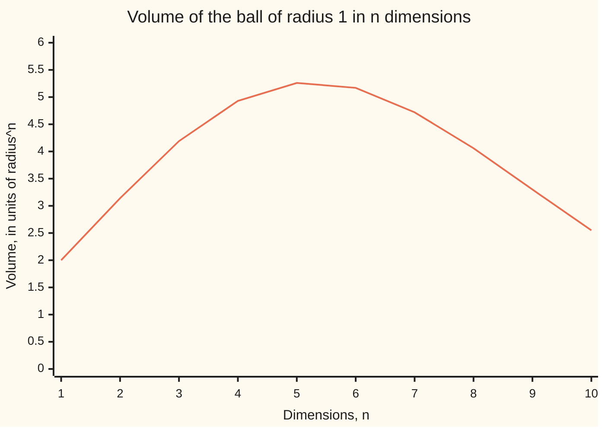
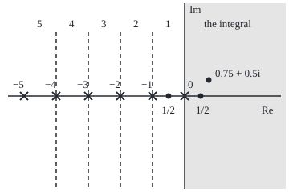

# The gamma function: the factorial for every number, defined by an integral and stretched to the whole plane by its own recurrence

[Syllabus](../../../SYLLABUS.md) → [Complex analysis](../../../SYLLABUS.md#w07) → [Special Functions and the Zeta Function](../../../SYLLABUS.md#w07-s09) → The gamma function

---

## General Overview

Treat a football as a perfect ball and take its radius as the unit of length. It then holds 4π/3 = 4.188790 cubed radii, the school formula for a ball.

One formula covers every dimension n: the volume is π^(n/2) divided by (n/2)!. The **factorial** n! is 1 × 2 × … × n, the number of orders n things can stand in; 4! = 24. The football, n = 3, needs (3/2)!, and no one lines up one and a half things.

The **gamma function** supplies that number, from an integral rather than a count. It obeys the factorial's rule, "multiply by the next number", so at whole numbers it gives the factorials back: Γ(5) = 4! = 24. At the half-integers it brings in √π: (3/2)! is 3√π/4 = 1.329340, and π^(3/2)/1.329340 = 4.188790, the football again. Run the same rule backwards and gamma reaches negative inputs, and complex ones across the left half of the plane: Γ(−1/2) = −2√π. At 0, −1, −2, … it would divide by zero, and there it has poles.

**Euler's integral defines gamma where the real part is positive; integration by parts gives it the factorial's recurrence, and that recurrence, run backwards, carries it over the whole plane except 0, −1, −2, …, where it has simple poles.**

**What kind of fact this is:** a definition, Euler's integral, whose consequences are theorems proved on this card in Why it works; the reflection formula is stated here, its real case proved by the keyhole and beta cards.

### The picture: the ball in n dimensions



The one line is π^(n/2)/Γ(n/2 + 1). The code gets the same ten values by slicing, with no gamma. The volume peaks at n = 5, then falls: gamma's growth overtakes the power of π.

---

## The formula

Γ is the Greek capital gamma; the input z is complex, with real part Re z. For t > 0 the power $t^{z-1}$ means $e^{(z-1)\ln t}$, with the real logarithm, so no branch cut is involved.

$$\Gamma(z) = \int_0^\infty t^{z-1} e^{-t}\, dt, \qquad \operatorname{Re} z > 0.$$

**Read it aloud:** gamma of z is the area under t to the z minus 1, times e to the minus t, from 0 to infinity.

Proved below:

$$\Gamma(z+1) = z\,\Gamma(z), \qquad \Gamma(n+1) = n!, \qquad \Gamma\!\left(\tfrac12\right) = \sqrt{\pi}.$$

The recurrence, turned round, continues gamma to the left. For any whole number m ≥ 1,

$$\Gamma(z) = \frac{\Gamma(z+m)}{z(z+1)\cdots(z+m-1)}, \qquad \operatorname{Re} z > -m,\; z \ne 0, -1, \ldots, -(m-1).$$

The reflection formula links gamma at z with gamma at 1 − z, and the example's ball volume uses gamma once:

$$\Gamma(z)\,\Gamma(1-z) = \frac{\pi}{\sin \pi z}, \qquad V_n = \frac{\pi^{n/2}}{\Gamma(n/2 + 1)}.$$

| Symbol | Plain meaning | In our example | Push it up and the answer… |
| --- | --- | --- | --- |
| $\Gamma(z)$ | the gamma function at z | Γ(5) = 24, Γ(1/2) = 1.772454 | along the real line it eventually outgrows any power |
| $z$ | the input, a complex number | 5, 1/2, −1/2, 0.75 + 0.5i | — |
| $t$ | the integration variable, over the positive reals | 0 to infinity | — |
| $n$, $n!$ | a whole number, its factorial | n = 3 for the football; 4! = 24 | — |
| $m$ | recurrence steps needed to reach Re z > 0 | 1 for −1/2 | reaches one strip further left |
| $V_n$ | volume of the ball of radius 1 in n dimensions | V_3 = 4.188790 | rises to n = 5, then falls toward 0 |
| $a$ | a real number strictly between 0 and 1 | 1/4 | — |
| $\operatorname{Res}$ | the residue: the coefficient of 1/(z − p) at a pole p | (−1)^n/n! at −n | — |

### When it holds

- **The integral needs Re z > 0.** Near t = 0 the integrand has size t^(Re z − 1), whose area is otherwise infinite: at −1/2, cut off at t = 10^−2, 10^−4, 10^−6, it reads 16.7, 196.5, 1996.5.
- **The continuation formula avoids 0, −1, −2, ….** There a denominator factor vanishes and gamma has a pole.
- **The recurrence alone does not fix gamma.** (1 + sin(2πz)/2) Γ(z) obeys the same recurrence and gives the same factorials, yet reads 5.438415 at 1/4 instead of 3.625610. The integral picks out gamma.
- **Reflection needs z off the whole numbers,** where sin πz = 0 and one of the two gammas has a pole.

---

## Why it works

### Step 0: integration by parts shifts a power into a factor

The factorial rule is n! = n × (n − 1)!. Differentiating $t^z$ brings down a factor z and lowers the power by one, and integration by parts ([Integration by parts](../../06-Calculus%20and%20analysis/04-Integrals/04-integration-by-parts.md)) turns that into the same rule.

### Step 1: the integral converges and is holomorphic for Re z > 0

Write σ for Re z. The integrand has size $t^{\sigma-1}e^{-t}$. On (0, 1] its area is at most 1/σ; on [1, ∞) the factor e^(−t) beats any power of t. So the improper integral ([Improper integrals](../../06-Calculus%20and%20analysis/04-Integrals/07-improper-integrals.md)) converges.

Cut the integral off to run from 1/k to k; each cut-off is holomorphic (has a complex derivative) in z. On any strip a ≤ Re z ≤ b with a > 0, the discarded tails have bounds free of z, so the cut-offs approach Γ uniformly. A uniform limit of holomorphic functions is holomorphic ([Limits of holomorphic functions](../04-Taylor%20Series%2C%20Zeros%20and%20Rigidity/02-uniform-limits-of-holomorphic-functions.md)).

<details>
<summary>Detailed proof: the tail bounds</summary>

Let 0 < a ≤ σ ≤ b. The left tail below ε ≤ 1 is at most the integral of t^(a−1) from 0 to ε, which is ε^a/a. Pick a whole number k ≥ b. For t ≥ 1, t^(σ−1) ≤ t^k ≤ 2^k k! e^(t/2), from the series for e^(t/2), so the tail beyond R is at most 2^(k+1) k! e^(−R/2). Neither bound mentions z. Each cut-off integral is holomorphic: its Riemann sums are finite sums of entire functions, converging uniformly for z in any closed disc because the integrand is uniformly continuous on that disc times [1/k, k].

</details>

### Step 2: the recurrence, and the factorials

For Re z > 0, integrate by parts with $t^z$ differentiated and $e^{-t}$ integrated:

$$\int_\varepsilon^R t^{z} e^{-t}\,dt = \Big[-t^{z}e^{-t}\Big]_\varepsilon^R + z\int_\varepsilon^R t^{z-1}e^{-t}\,dt.$$

The bracket tends to 0 at both ends, leaving Γ(z + 1) = z Γ(z).

The start is Γ(1) = area under e^(−t) = 1, so Γ(n + 1) = n!, and Γ(5) = 4 × 3 × 2 × 1 = 24: shifted by one, 4! not 5!.

### Step 3: Γ(1/2) is the Gaussian integral

At z = 1/2, substitute t = u^2, so dt = 2u du and t^(−1/2) = 1/u:

$$\Gamma\!\left(\tfrac12\right) = \int_0^\infty \frac{e^{-u^2}}{u}\,2u\,du = 2\int_0^\infty e^{-u^2}\,du = \sqrt{\pi}.$$

The last step is the Gaussian integral ([The Gaussian integral](../../06-Calculus%20and%20analysis/08-Multiple%20Integrals/04-gaussian-integral.md)): the full bell's area is √π, half of it √π/2. The recurrence then climbs: Γ(3/2) = √π/2 = 0.886227, Γ(5/2) = (3/2)(√π/2) = 1.329340, the football's (3/2)!.

### Step 4: continue leftward, one strip at a time

Divide the recurrence by z: Γ(z) = Γ(z + 1)/z. The right side is defined for Re z > −1 except at 0, one strip further left. Applying it m times gives the continuation formula, valid on Re z > −m.

Two such formulas agree where both apply, since the recurrence holds where they overlap. By uniqueness of analytic continuation ([Analytic continuation](../04-Taylor%20Series%2C%20Zeros%20and%20Rigidity/04-analytic-continuation.md)), there is one continued gamma, and any other holomorphic extension of the integral equals it.

One step reaches the example: Γ(−1/2) = Γ(1/2)/(−1/2) = −2√π = −3.544908.

### The picture: where each formula reaches

<p align="center"></p>

To scale: 40 units per 1, with 0 at (230, 120). Shaded: Re z > 0, where the integral converges. Each strip's number counts the recurrence steps into the shaded half-plane. Crosses are poles; 0.75 + 0.5i is the code's complex test point.

### Step 5: simple poles, with residues (−1)^n/n!

Near z = −n use m = n + 1:

$$\Gamma(z) = \frac{1}{z+n}\cdot\frac{\Gamma(z+n+1)}{z(z+1)\cdots(z+n-1)}.$$

The second factor is holomorphic near −n and at −n equals Γ(1)/((−n)(−n + 1)⋯(−1)) = (−1)^n/n!, not zero. So Γ has a simple pole at −n, with residue ([Residues](../05-Laurent%20Series%2C%20Singularities%20and%20Residues/04-residues.md)) (−1)^n/n!: 1, −1, 1/2, −1/6 at 0, −1, −2, −3. The code prints ε Γ(−n + ε) at ε = 10^−6: 0.999999, −1.000000, 0.500000, −0.166667.

### Step 6: the reflection formula

For real 0 < a < 1, [The beta function](03-beta-function.md) rewrites Γ(a)Γ(1 − a) as the area under x^(a−1)/(1 + x) from 0 to infinity, and [The keyhole contour](../06-Real%20Integrals%20and%20Counting%20Zeros/05-keyhole-contours.md) evaluates that area as π/sin(πa). Both sides are holomorphic off the whole numbers and agree on the segment from 0 to 1, so by [Zeros and the identity theorem](../04-Taylor%20Series%2C%20Zeros%20and%20Rigidity/03-zeros-and-the-identity-theorem.md) they agree everywhere off the whole numbers. The right side is never 0, so Γ has no zeros.

The code checks it at 1/4: 3.625610 × 1.225417 = 4.442883 = π/sin(π/4); and at −1/2: Γ(−1/2)Γ(3/2) = −3.141593 = π/sin(−π/2).

A second road to gamma itself needs no integral: Gauss's product, Γ(z) = the limit of n! n^z / (z(z + 1)⋯(z + n)) as n grows, defined everywhere but the poles ([Infinite products](01-infinite-products.md)). The code uses it.

---

## Worked numbers, by hand

| Step | Arithmetic | Value |
| --- | --- | --- |
| Γ(1) | area under e^(−t) | 1 |
| Γ(5) | 4 × 3 × 2 × 1 × Γ(1) | **24** |
| Γ(1/2) | 2 × (area under e^(−u^2) from 0) | √π = 1.772454 |
| Γ(5/2) | (3/2) × (1/2) × Γ(1/2) | 1.329340 |
| Football, V_3 | π^(3/2)/Γ(5/2) = π√π/(3√π/4) = 4π/3 | **4.188790** |
| Γ(−1/2) | Γ(1/2)/(−1/2) | **−3.544908** |

The football holds 4.188790 cubed radii, the school formula's number; in five dimensions the ball holds the most, 5.26.

### What breaks if you drop a piece

| Mistake | Comes out at | What went wrong |
| --- | --- | --- |
| Γ(5) read as 5! | 120, not 24 | Γ(n + 1) = n!: the input is shifted by one |
| Shift dropped in the ball formula | 6.283185, not 4.188790 | (n/2)! is Γ(n/2 + 1), not Γ(n/2) |
| Euler's integral used at −1/2 | 16.7, 196.5, 1996.5 as the cutoff falls | the integral needs Re z > 0 |
| Recurrence and factorials alone | 5.438415 at 1/4, not 3.625610 | a period-1 multiplier survives both |


---

## Code, from first principles, and it actually runs

Nothing imported holds a gamma function. Road one sums Euler's integral by trapezoids after t = e^u, applying the recurrence first when Re z < 1. Road two is Gauss's product at n = 20,000, 40,000 and 80,000, combined so the errors in 1/n and 1/n^2 cancel. The ball volumes are checked by slicing: each n-ball is a stack of (n − 1)-balls, so its volume is the previous one times the area under cos^n from −π/2 to π/2. Four asserts compare the roads with each other and with closed forms.

### Python

```python
# The gamma function -- the check behind the card.  Standard library only.
# Road one: Euler's integral, summed by trapezoids after t = e^u, moved left by the recurrence.
# Road two: Gauss's product n! n^z / (z(z+1)...(z+n)), which uses no integral.
# The ball volumes are checked against slicing the ball, which never mentions gamma.
import math

def e(z): return math.exp(z.real) * complex(math.cos(z.imag), math.sin(z.imag))   # e^z
def show(w):                                   # 'a + bi', six decimals, no -0.000000
    a, b = round(w.real, 6) + 0.0, round(w.imag, 6) + 0.0
    return f"{a:.6f} {'-' if b < 0 else '+'} {abs(b):.6f}i"
def integral(z, lo=-130.0, hi=5.0, n=27000):   # t^(z-1) e^(-t) dt becomes e^(zu - e^u) du
    h, z = (hi - lo) / n, complex(z)
    f = lambda u: e(z * u - math.exp(u))
    return h * (sum(f(lo + j * h) for j in range(1, n)) + (f(lo) + f(hi)) / 2)
def gamma(z):                                  # road one: recurrence into Re z >= 1, then the integral
    z, den = complex(z), 1
    while z.real < 1: den, z = den * z, z + 1
    return integral(z) / den
def gauss(z, n):                               # n^z / z, times k/(z + k) for k = 1 to n
    p = e(z * math.log(n)) / z
    for k in range(1, n + 1): p *= k / (z + k)
    return p
def product(z):                                # road two, errors in 1/n and 1/n^2 cancelled
    z = complex(z)
    return (8 * gauss(z, 80000) - 6 * gauss(z, 40000) + gauss(z, 20000)) / 3
def slices(n, m=20000):                        # V_n = V_(n-1) times the integral of cos^n from -pi/2 to pi/2
    v, h = 1.0, math.pi / m
    for d in range(1, n + 1): v *= h * sum(math.cos(-math.pi / 2 + j * h) ** d for j in range(1, m))
    return v

fact = [math.prod(range(1, k + 1)) for k in range(6)]
sp, zc = math.sqrt(math.pi), 0.75 + 0.5j
print("Gamma(1) to Gamma(5) by the integral: " + ", ".join(f"{integral(k).real:.6f}" for k in range(1, 6)) + f"; 0! to 4!: {fact[:5]}")
print(f"Gamma(5): product {product(5).real:.6f}; 4! = {fact[4]}; mistake, read as 5! = {fact[5]}")
print(f"Gamma(1/2): integral {integral(0.5).real:.6f}; product {product(0.5).real:.6f}; sqrt(pi) {sp:.6f}")
print(f"Gamma(3/2) = {integral(1.5).real:.6f}; Gamma(5/2) = {integral(2.5).real:.6f}; 3 sqrt(pi)/4 = {3 * sp / 4:.6f}")
print(f"Gamma(-1/2): recurrence {gamma(-0.5).real:.6f}; product {product(-0.5).real:.6f}; -2 sqrt(pi) {-2 * sp:.6f}")
print(f"z = 0.75 + 0.5i: integral {show(integral(zc))}; product {show(product(zc))}")
print(f"  Gamma(z + 1) {show(integral(zc + 1))}; z Gamma(z) {show(zc * integral(zc))}")
assert abs(integral(5) - fact[4]) < 1e-9 and abs(integral(0.5) - sp) < 1e-9 and abs(product(-0.5) + 2 * sp) < 1e-7
assert abs(product(5) - 24) < 1e-6 and abs(product(zc) - integral(zc)) < 1e-7 and abs(integral(zc + 1) - zc * integral(zc)) < 1e-9
res = [(1e-6 * gamma(-k + 1e-6)).real for k in range(4)]
print("near the poles, eps Gamma(-n + eps), eps = 1e-6, n = 0 to 3: " + ", ".join(f"{r:.6f}" for r in res))
print("  (-1)^n / n!: " + ", ".join(f"{(-1) ** k / fact[k]:.6f}" for k in range(4)))
q, r = integral(0.25).real, integral(0.75).real
print(f"reflection a = 1/4: Gamma(1/4) Gamma(3/4) = {q:.6f} x {r:.6f} = {q * r:.6f}; pi/sin(pi/4) = {math.pi / math.sin(math.pi / 4):.6f}")
print(f"reflection z = -1/2: Gamma(-1/2) Gamma(3/2) = {(gamma(-0.5) * integral(1.5)).real:.6f}; pi/sin(-pi/2) = {math.pi / math.sin(-math.pi / 2):.6f}")
assert all(abs(res[k] - (-1) ** k / fact[k]) < 1e-5 for k in range(4)) and abs(q * r - math.pi * math.sqrt(2)) < 1e-9
ball = [math.pi ** (n / 2) / gamma(n / 2 + 1).real for n in range(1, 11)]
cut = [slices(n) for n in range(1, 11)]
print(f"football, n = 3: pi^(3/2)/Gamma(5/2) = {ball[2]:.6f}; slicing {cut[2]:.6f}; 4 pi/3 = {4 * math.pi / 3:.6f}")
print("ball volumes n = 1 to 10, by gamma:   " + ", ".join(f"{v:.2f}" for v in ball))
print("ball volumes n = 1 to 10, by slicing: " + ", ".join(f"{v:.2f}" for v in cut))
assert all(abs(a - b) < 1e-7 for a, b in zip(ball, cut)) and abs(ball[2] - 4 * math.pi / 3) < 1e-9
print(f"mistake, shift dropped: pi^(3/2)/Gamma(3/2) = {math.pi ** 1.5 / integral(1.5).real:.6f}, not {ball[2]:.6f}")
print("mistake, the integral at -1/2 cut off at t = 1e-2, 1e-4, 1e-6: " + ", ".join(f"{integral(-0.5, math.log(10.0 ** -k)).real:.1f}" for k in (2, 4, 6)))
print(f"mistake, recurrence alone: (1 + sin(2 pi z)/2) Gamma(z) at z = 1/4 is {1.5 * q:.6f}, not {q:.6f}")
print("figure, 0 at (230, 120), 40 per 1: poles at x = " + ", ".join(f"{230 - 40 * k}" for k in range(6))
      + f"; 1/2 at ({230 + 20}, 120); -1/2 at ({230 - 20}, 120); 0.75 + 0.5i at ({230 + 40 * 0.75:.0f}, {120 - 40 * 0.5:.0f})")
print("ALL CHECKS PASS")
```

**Ran 2026-09-28 on macOS, Python 3.14.6, standard library only. All checks passed. Output, pasted from the run:**

```
Gamma(1) to Gamma(5) by the integral: 1.000000, 1.000000, 2.000000, 6.000000, 24.000000; 0! to 4!: [1, 1, 2, 6, 24]
Gamma(5): product 24.000000; 4! = 24; mistake, read as 5! = 120
Gamma(1/2): integral 1.772454; product 1.772454; sqrt(pi) 1.772454
Gamma(3/2) = 0.886227; Gamma(5/2) = 1.329340; 3 sqrt(pi)/4 = 1.329340
Gamma(-1/2): recurrence -3.544908; product -3.544908; -2 sqrt(pi) -3.544908
z = 0.75 + 0.5i: integral 0.834930 - 0.406382i; product 0.834930 - 0.406382i
  Gamma(z + 1) 0.829388 + 0.112679i; z Gamma(z) 0.829388 + 0.112679i
near the poles, eps Gamma(-n + eps), eps = 1e-6, n = 0 to 3: 0.999999, -1.000000, 0.500000, -0.166667
  (-1)^n / n!: 1.000000, -1.000000, 0.500000, -0.166667
reflection a = 1/4: Gamma(1/4) Gamma(3/4) = 3.625610 x 1.225417 = 4.442883; pi/sin(pi/4) = 4.442883
reflection z = -1/2: Gamma(-1/2) Gamma(3/2) = -3.141593; pi/sin(-pi/2) = -3.141593
football, n = 3: pi^(3/2)/Gamma(5/2) = 4.188790; slicing 4.188790; 4 pi/3 = 4.188790
ball volumes n = 1 to 10, by gamma:   2.00, 3.14, 4.19, 4.93, 5.26, 5.17, 4.72, 4.06, 3.30, 2.55
ball volumes n = 1 to 10, by slicing: 2.00, 3.14, 4.19, 4.93, 5.26, 5.17, 4.72, 4.06, 3.30, 2.55
mistake, shift dropped: pi^(3/2)/Gamma(3/2) = 6.283185, not 4.188790
mistake, the integral at -1/2 cut off at t = 1e-2, 1e-4, 1e-6: 16.7, 196.5, 1996.5
mistake, recurrence alone: (1 + sin(2 pi z)/2) Gamma(z) at z = 1/4 is 5.438415, not 3.625610
figure, 0 at (230, 120), 40 per 1: poles at x = 230, 190, 150, 110, 70, 30; 1/2 at (250, 120); -1/2 at (210, 120); 0.75 + 0.5i at (260, 100)
ALL CHECKS PASS
```

### Rust

Same labels, built with `rustc --edition 2021 -O`.

```rust
// The gamma function -- the same check as the Python, in Rust.  No crates.
// Road one: Euler's integral, summed by trapezoids after t = e^u, moved left by the recurrence.
// Road two: Gauss's product n! n^z / (z(z+1)...(z+n)), which uses no integral.
// The ball volumes are checked against slicing the ball, which never mentions gamma.
use std::f64::consts::PI;
#[derive(Clone, Copy)] struct C { re: f64, im: f64 }
fn c(re: f64, im: f64) -> C { C { re, im } }
fn r(x: f64) -> C { c(x, 0.0) }
fn add(a: C, b: C) -> C { c(a.re + b.re, a.im + b.im) }
fn sub(a: C, b: C) -> C { c(a.re - b.re, a.im - b.im) }
fn mul(a: C, b: C) -> C { c(a.re * b.re - a.im * b.im, a.re * b.im + a.im * b.re) }
fn div(a: C, b: C) -> C { let d = b.re * b.re + b.im * b.im; c((a.re * b.re + a.im * b.im) / d, (a.im * b.re - a.re * b.im) / d) }
fn sc(a: C, k: f64) -> C { c(a.re * k, a.im * k) }
fn abs(a: C) -> f64 { a.re.hypot(a.im) }
fn e(z: C) -> C { sc(c(z.im.cos(), z.im.sin()), z.re.exp()) } // e^z
fn show(w: C) -> String { // 'a + bi', six decimals, no -0.000000
    let (a, b) = (format!("{:.6}", w.re).replace("-0.000000", "0.000000"), format!("{:.6}", w.im.abs()));
    format!("{} {} {}i", a, if w.im < 0.0 && b != "0.000000" { '-' } else { '+' }, b)
}
fn integral(z: C, lo: f64) -> C { // t^(z-1) e^(-t) dt becomes e^(zu - e^u) du, u from lo to 5
    let (n, h) = (27000, (5.0 - lo) / 27000.0);
    let f = |u: f64| e(c(z.re * u - u.exp(), z.im * u));
    let mut s = r(0.0);
    for j in 1..n { s = add(s, f(lo + j as f64 * h)) }
    sc(add(s, sc(add(f(lo), f(5.0)), 0.5)), h)
}
fn ig(x: f64) -> f64 { integral(r(x), -130.0).re }
fn gamma(mut z: C) -> C { // road one: recurrence into Re z >= 1, then the integral
    let mut den = r(1.0); while z.re < 1.0 { den = mul(den, z); z = add(z, r(1.0)) }
    div(integral(z, -130.0), den)
}
fn gauss(z: C, n: usize) -> C { // n^z / z, times k/(z + k) for k = 1 to n
    let mut p = div(e(sc(z, (n as f64).ln())), z);
    for k in 1..=n { p = mul(p, div(r(k as f64), add(z, r(k as f64)))) }
    p
}
fn product(z: C) -> C { sc(add(sub(sc(gauss(z, 80000), 8.0), sc(gauss(z, 40000), 6.0)), gauss(z, 20000)), 1.0 / 3.0) }
fn slices(n: i32) -> f64 { // V_n = V_(n-1) times the integral of cos^n from -pi/2 to pi/2
    let (m, mut v, h) = (20000, 1.0, PI / 20000.0);
    for d in 1..=n { v *= h * (1..m).map(|j| (-PI / 2.0 + j as f64 * h).cos().powi(d)).sum::<f64>() }
    v
}
fn join(v: &[f64], p: usize) -> String { v.iter().map(|x| format!("{:.*}", p, x)).collect::<Vec<_>>().join(", ") }
fn main() {
    let fact: Vec<u64> = (0..6u64).map(|k| (1..=k).product()).collect();
    let (sp, zc) = (PI.sqrt(), c(0.75, 0.5));
    println!("Gamma(1) to Gamma(5) by the integral: {}; 0! to 4!: {:?}", join(&(1..6).map(|k| ig(k as f64)).collect::<Vec<_>>(), 6), &fact[..5]);
    println!("Gamma(5): product {:.6}; 4! = {}; mistake, read as 5! = {}", product(r(5.0)).re, fact[4], fact[5]);
    println!("Gamma(1/2): integral {:.6}; product {:.6}; sqrt(pi) {:.6}", ig(0.5), product(r(0.5)).re, sp);
    println!("Gamma(3/2) = {:.6}; Gamma(5/2) = {:.6}; 3 sqrt(pi)/4 = {:.6}", ig(1.5), ig(2.5), 3.0 * sp / 4.0);
    println!("Gamma(-1/2): recurrence {:.6}; product {:.6}; -2 sqrt(pi) {:.6}", gamma(r(-0.5)).re, product(r(-0.5)).re, -2.0 * sp);
    let (gz, gz1) = (integral(zc, -130.0), integral(add(zc, r(1.0)), -130.0));
    println!("z = 0.75 + 0.5i: integral {}; product {}", show(gz), show(product(zc)));
    println!("  Gamma(z + 1) {}; z Gamma(z) {}", show(gz1), show(mul(zc, gz)));
    assert!((ig(5.0) - fact[4] as f64).abs() < 1e-9 && (ig(0.5) - sp).abs() < 1e-9 && (product(r(-0.5)).re + 2.0 * sp).abs() < 1e-7);
    assert!((product(r(5.0)).re - 24.0).abs() < 1e-6 && abs(sub(product(zc), gz)) < 1e-7 && abs(sub(gz1, mul(zc, gz))) < 1e-9);
    let res: Vec<f64> = (0..4).map(|k| 1e-6 * gamma(r(-(k as f64) + 1e-6)).re).collect();
    let want: Vec<f64> = (0..4).map(|k| (-1f64).powi(k as i32) / fact[k] as f64).collect();
    println!("near the poles, eps Gamma(-n + eps), eps = 1e-6, n = 0 to 3: {}", join(&res, 6));
    println!("  (-1)^n / n!: {}", join(&want, 6));
    let (q, s) = (ig(0.25), ig(0.75));
    println!("reflection a = 1/4: Gamma(1/4) Gamma(3/4) = {:.6} x {:.6} = {:.6}; pi/sin(pi/4) = {:.6}", q, s, q * s, PI / (PI / 4.0).sin());
    println!("reflection z = -1/2: Gamma(-1/2) Gamma(3/2) = {:.6}; pi/sin(-pi/2) = {:.6}", gamma(r(-0.5)).re * ig(1.5), PI / (-PI / 2.0).sin());
    assert!((0..4).all(|k| (res[k] - want[k]).abs() < 1e-5) && (q * s - PI * 2f64.sqrt()).abs() < 1e-9);
    let ball: Vec<f64> = (1..11).map(|n| PI.powf(n as f64 / 2.0) / gamma(r(n as f64 / 2.0 + 1.0)).re).collect();
    let cut: Vec<f64> = (1..11).map(slices).collect();
    println!("football, n = 3: pi^(3/2)/Gamma(5/2) = {:.6}; slicing {:.6}; 4 pi/3 = {:.6}", ball[2], cut[2], 4.0 * PI / 3.0);
    println!("ball volumes n = 1 to 10, by gamma:   {}", join(&ball, 2));
    println!("ball volumes n = 1 to 10, by slicing: {}", join(&cut, 2));
    assert!(ball.iter().zip(&cut).all(|(a, b)| (a - b).abs() < 1e-7) && (ball[2] - 4.0 * PI / 3.0).abs() < 1e-9);
    println!("mistake, shift dropped: pi^(3/2)/Gamma(3/2) = {:.6}, not {:.6}", PI.powf(1.5) / ig(1.5), ball[2]);
    let cuts: Vec<f64> = [2, 4, 6].iter().map(|&k| integral(r(-0.5), 10f64.powi(-k).ln()).re).collect();
    println!("mistake, the integral at -1/2 cut off at t = 1e-2, 1e-4, 1e-6: {}", join(&cuts, 1));
    println!("mistake, recurrence alone: (1 + sin(2 pi z)/2) Gamma(z) at z = 1/4 is {:.6}, not {:.6}", 1.5 * q, q);
    let xs: Vec<String> = (0..6).map(|k| format!("{}", 230 - 40 * k)).collect();
    println!("figure, 0 at (230, 120), 40 per 1: poles at x = {}; 1/2 at ({}, 120); -1/2 at ({}, 120); 0.75 + 0.5i at ({:.0}, {:.0})", xs.join(", "), 230 + 20, 230 - 20, 230.0 + 40.0 * 0.75, 120.0 - 40.0 * 0.5);
    println!("ALL CHECKS PASS");
}
```

**Ran 2026-09-28 on macOS, rustc 1.98.1, no crates. All checks passed. Output, pasted from the run:**

```
Gamma(1) to Gamma(5) by the integral: 1.000000, 1.000000, 2.000000, 6.000000, 24.000000; 0! to 4!: [1, 1, 2, 6, 24]
Gamma(5): product 24.000000; 4! = 24; mistake, read as 5! = 120
Gamma(1/2): integral 1.772454; product 1.772454; sqrt(pi) 1.772454
Gamma(3/2) = 0.886227; Gamma(5/2) = 1.329340; 3 sqrt(pi)/4 = 1.329340
Gamma(-1/2): recurrence -3.544908; product -3.544908; -2 sqrt(pi) -3.544908
z = 0.75 + 0.5i: integral 0.834930 - 0.406382i; product 0.834930 - 0.406382i
  Gamma(z + 1) 0.829388 + 0.112679i; z Gamma(z) 0.829388 + 0.112679i
near the poles, eps Gamma(-n + eps), eps = 1e-6, n = 0 to 3: 0.999999, -1.000000, 0.500000, -0.166667
  (-1)^n / n!: 1.000000, -1.000000, 0.500000, -0.166667
reflection a = 1/4: Gamma(1/4) Gamma(3/4) = 3.625610 x 1.225417 = 4.442883; pi/sin(pi/4) = 4.442883
reflection z = -1/2: Gamma(-1/2) Gamma(3/2) = -3.141593; pi/sin(-pi/2) = -3.141593
football, n = 3: pi^(3/2)/Gamma(5/2) = 4.188790; slicing 4.188790; 4 pi/3 = 4.188790
ball volumes n = 1 to 10, by gamma:   2.00, 3.14, 4.19, 4.93, 5.26, 5.17, 4.72, 4.06, 3.30, 2.55
ball volumes n = 1 to 10, by slicing: 2.00, 3.14, 4.19, 4.93, 5.26, 5.17, 4.72, 4.06, 3.30, 2.55
mistake, shift dropped: pi^(3/2)/Gamma(3/2) = 6.283185, not 4.188790
mistake, the integral at -1/2 cut off at t = 1e-2, 1e-4, 1e-6: 16.7, 196.5, 1996.5
mistake, recurrence alone: (1 + sin(2 pi z)/2) Gamma(z) at z = 1/4 is 5.438415, not 3.625610
figure, 0 at (230, 120), 40 per 1: poles at x = 230, 190, 150, 110, 70, 30; 1/2 at (250, 120); -1/2 at (210, 120); 0.75 + 0.5i at (260, 100)
ALL CHECKS PASS
```

The outputs match line for line.

> [!TIP]
> **Try changing**
> Guess first, then run it.
> - **Cut the integral short.** Change `lo=-130.0` to `lo=-20.0`: Γ(1/2) reads 1.772363 and the first assert stops it.
> - **Drop the error cancellation.** Make `product` return `gauss(z, 80000)`: Γ(5) reads 23.995501 and the second assert stops it.
> - **More dimensions.** Change both `range(1, 11)` to `range(1, 21)`: the volume at n = 20 is 0.03, and both roads agree.

---

## The usual mistake

> [!warning]
> **Treating Γ(−1/2) as the value of Euler's integral at −1/2.** That integral diverges: cut off at t = 10^−6 it reads 1996.5 and grows. The value −3.544908 belongs to the continued function.
>
> - **Γ(n) taken to be n!.** It is (n − 1)!: Γ(5) = 24, not 120.
> - **(n/2)! written Γ(n/2).** The football comes out at 6.283185 instead of 4.188790.

---

## Where you meet it in real life

- **Volumes in many dimensions.** Statistics and machine learning measure balls in dozens of dimensions with π^(n/2)/Γ(n/2 + 1). The ball's share of the cube of side 2 around it, V_n/2^n, is 0.52 at n = 3 and 0.0025 at n = 10, which is why random points in a high-dimensional cube sit mostly in the corners.
- **Integrals of powers against decay.** They are gamma values or close relatives; [The Mellin transform](07-mellin-transform.md) makes that a transform.
- **The zeta function.** Gamma is the factor that makes zeta's functional equation symmetric, in [Continuing zeta](08-continuing-zeta-and-the-functional-equation.md).

> **Say it back**
> Gamma is Euler's integral of t^(z−1) e^(−t), for Re z > 0. Integration by parts gives Γ(z + 1) = z Γ(z), so Γ(n + 1) = n! and Γ(5) = 24. Substituting t = u^2 makes Γ(1/2) the Gaussian integral, √π, which puts 3√π/4 into the football's 4π/3. Dividing the recurrence by z carries gamma left: Γ(−1/2) = −2√π, with simple poles at 0, −1, −2, …. Reflection, Γ(z)Γ(1 − z) = π/sin πz, ties the two halves together.

---

## What this builds on

- [Limits of holomorphic functions](../04-Taylor%20Series%2C%20Zeros%20and%20Rigidity/02-uniform-limits-of-holomorphic-functions.md): why the integral is holomorphic.
- [Analytic continuation](../04-Taylor%20Series%2C%20Zeros%20and%20Rigidity/04-analytic-continuation.md): why the recurrence's extension is the only one.
- [The keyhole contour](../06-Real%20Integrals%20and%20Counting%20Zeros/05-keyhole-contours.md): the value π/sin(πa) behind reflection.
- [Improper integrals](../../06-Calculus%20and%20analysis/04-Integrals/07-improper-integrals.md): when an integral to infinity, or with a spike at 0, has finite area.
- [Integration by parts](../../06-Calculus%20and%20analysis/04-Integrals/04-integration-by-parts.md): the step that becomes the factorial rule.

## Where this goes next

- [The beta function](03-beta-function.md): products of gammas as one integral, and the missing link in the reflection proof.
- [Stirling's formula](04-stirlings-formula.md): how fast gamma grows, to a stated error, and so how fast the ball volumes fall.
- [The Mellin transform](07-mellin-transform.md): Euler's integral with e^(−t) replaced by any function.
- [Continuing zeta](08-continuing-zeta-and-the-functional-equation.md): gamma as the factor in zeta's symmetry.
- The functional equation: that symmetry proved in full.

---

## Sources

Verified 28 Sep 2026: every link below resolves to the publisher's page.

- Stein, Elias M., and Rami Shakarchi. *Complex Analysis*. Princeton University Press, 2003. [Publisher page](https://press.princeton.edu/books/hardcover/9780691113852/complex-analysis). Chapter 6: the integral, the continuation and reflection.
- Artin, Emil. *The Gamma Function*. Dover, 2015. [Publisher page](https://store.doverpublications.com/products/9780486803005). A short book on gamma and what characterises it.
- NIST Digital Library of Mathematical Functions, Chapter 5, "Gamma Function". [§5.2 Definitions](https://dlmf.nist.gov/5.2) and [§5.5 Functional relations](https://dlmf.nist.gov/5.5). The card's formulas as reference equations.
