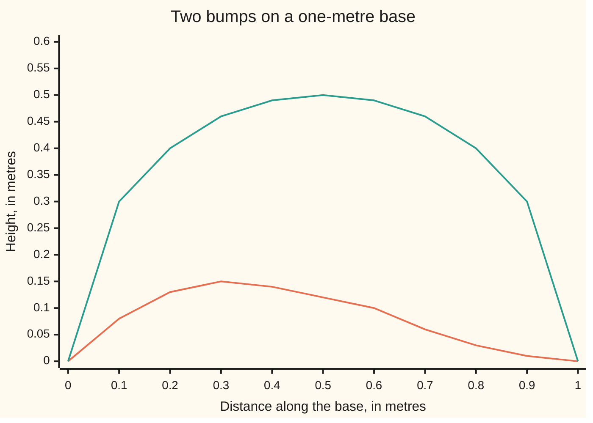

# The beta function: an integral over 0 to 1 built from two gammas, the shape behind every bump between 0 and 1

[Syllabus](../../../SYLLABUS.md) → [Complex analysis](../README.md) → [Special Functions and the Zeta Function](../README.md#s09) → The beta function

---

## General Overview

A skate ramp is one metre long. At x metres from its left end, its height is x(1 − x)^2 metres. It starts at 0, climbs to a peak of 0.148148 metres at x = 1/3, and slopes back to 0 at the far end. Its side panel, cut from plywood, has area 1/12 of a square metre: 0.083333.

A second profile, an arch over the same one-metre base, has height √(x(1 − x)). It peaks at 0.5 in the middle. It is the top half of a circle of radius 1/2, so its area is π/8 = 0.392699082.

Both heights are a power of x times a power of 1 − x: a bump on the stretch from 0 to 1. Its area is the **beta function**. Every such area is a ratio of three values of the gamma function, the continuous factorial ([The gamma function](02-gamma-function.md)). The ramp's is 1!·2!/4! = 2/24.

**The area under x^(a−1)(1 − x)^(b−1) from 0 to 1 is Γ(a)Γ(b)/Γ(a + b), because the product of two gamma integrals splits into a total, which gives Γ(a + b), and a share, which gives this area.**

**What kind of fact this is:** a definition (the area is named B) and a theorem (its value in gammas), proved on this card in Why it works; the limits are in the folded Detailed proof.

### The picture: the ramp and the arch



The low, lopsided line is the ramp x(1 − x)^2; the tall, even line is the arch √(x(1 − x)). The ramp's larger power sits on 1 − x, so its bulk leans left.

---

## The formula

Reminder from [The gamma function](02-gamma-function.md): the gamma function is $\Gamma(a) = \int_0^\infty t^{a-1} e^{-t}\,dt$, and at whole numbers it is a shifted factorial, Γ(n) = (n − 1)!. So Γ(5) = 4! = 24.

$$B(a,b) = \int_0^1 x^{a-1}(1-x)^{b-1}\,dx = \frac{\Gamma(a)\,\Gamma(b)}{\Gamma(a+b)}, \qquad a > 0,\; b > 0.$$

**Read it aloud:** the area under x to the a minus 1, times one minus x to the b minus 1, from 0 to 1, equals gamma of a times gamma of b, over gamma of a plus b.

The "minus 1" matches the gamma function's convention. The ramp x(1 − x)^2 has powers 1 and 2, so it is B(2, 3). The arch has powers 1/2 and 1/2, so it is B(3/2, 3/2).

| Symbol | Plain meaning | In our example | Push it up and the answer… |
| --- | --- | --- | --- |
| $a$ | one more than the power on x | 2 for the ramp, 3/2 for the arch | area falls; the bump's bulk moves right |
| $b$ | one more than the power on 1 − x | 3 for the ramp, 3/2 for the arch | area falls; the bulk moves left |
| $x$ | position along the base, 0 to 1 | the ramp peaks at x = 1/3 | — |
| $B$ | the beta function: the bump's area, $B(a,b)$ | 0.083333333 and 0.392699082 | — |
| $\Gamma$ | the gamma function, a continuous factorial | Γ(5) = 24, Γ(1/2) = 1.772453851 | grows faster than any power |

### When it holds

- **a > 0 and b > 0.** Near 0 the bump behaves like x^(a−1), finite in area only if a > 0; near 1, the same for b. At b = 0 the curve 1/(1 − x) has area 2.3026, 4.6052, 6.9078 up to 1 − 0.1, 1 − 0.01, 1 − 0.001: no end.
- **Complex a and b.** The integral converges when the real parts of a and b are positive, and there it is holomorphic in each (has a complex derivative). The gamma ratio makes sense unless a or b is 0, −1, −2, …, the poles of Γ: that ratio is the beta function continued, where the integral no longer converges.
- **Base 0 to 1, these powers exactly.** On a base of length L, x^(a−1)(L − x)^(b−1) has area L^(a+b−1) B(a, b), by x = Ly. A shape such as x(1 − x^2) is not a beta area as it stands.

---

## Why it works

### Step 0: multiply two gammas, then split total from share

The product Γ(a)Γ(b) is a volume over the quarter-plane of pairs (s, t), both positive. Its factor e^(−s−t) depends only on the total s + t. Describe each point by its total and the first variable's share, and the volume splits: the total part is a gamma, the share part is the beta area.

### Step 1: the product is a double integral

Two separate integrals multiply into one integral over pairs ([Double integrals](../../06-Calculus%20and%20analysis/08-Multiple%20Integrals/01-double-integrals.md)):

$$\Gamma(a)\,\Gamma(b) = \int_0^\infty\!\!\int_0^\infty s^{a-1}\, t^{b-1}\, e^{-(s+t)}\,ds\,dt.$$

### Step 2: new coordinates, total and share

Put u = s + t, the total, and v = s/(s + t), the share. Going back: s = uv and t = u(1 − v). As (s, t) covers the open quarter-plane, u covers 0 to infinity and v covers 0 to 1, each point once.

A small box du by dv lands on a parallelogram with sides (v, 1 − v) du and (u, −u) dv. Its area is the size of the determinant v·(−u) − u·(1 − v) = −u, times du dv ([Change of variables](../../06-Calculus%20and%20analysis/08-Multiple%20Integrals/03-change-of-variables-and-jacobians.md)). So ds dt becomes u du dv. That u is the **stretch factor**: far from the corner, a step in share covers more ground.

### Step 3: the integrand splits

Substitute:

$$s^{a-1} t^{b-1} e^{-(s+t)} \cdot u = u^{a+b-1} e^{-u} \cdot v^{a-1}(1-v)^{b-1}.$$

The powers of u collect: a − 1 from s, b − 1 from t, 1 from the stretch. One factor holds only u, the other only v, so the u-integral is Γ(a + b), the v-integral is B(a, b), and Γ(a)Γ(b) = Γ(a + b) B(a, b), which is the formula.

On the ramp: Γ(2)Γ(3)/Γ(5) = 1!·2!/4! = 2/24 = 1/12, matching the area from expanding x(1 − x)^2 and integrating.

<details>
<summary>Detailed proof</summary>

**The limits.** For real a, b > 0 the integrand in Step 1 is never negative. For such a function the integral over an unbounded region is the limit over growing boxes, and it has the same value in any order of integration and after any one-to-one change of coordinates with its stretch factor. Both gamma integrals are finite, so the (u, v) integral is finite and equal to their product.

**Complex a and b.** Fix a real b > 0. Both sides of B(a, b) = Γ(a)Γ(b)/Γ(a + b) are holomorphic in a on the half-plane of positive real part, and they agree for every real a > 0. A holomorphic function that vanishes on a segment vanishes on its whole connected region ([Zeros and the identity theorem](../04-Taylor%20Series%2C%20Zeros%20and%20Rigidity/03-zeros-and-the-identity-theorem.md)). Apply it to the difference in a; then fix that complex a and repeat in b.

</details>

### Step 4: the half values, and a square root of π

Swap x = sin^2 θ. Then 1 − x = cos^2 θ and dx = 2 sin θ cos θ dθ, so

$$B(a,b) = 2\int_0^{\pi/2} \sin^{2a-1}\theta\,\cos^{2b-1}\theta\,d\theta.$$

At a = b = 1/2 both powers are 0, the integrand is 1, and B(1/2, 1/2) = 2 · π/2 = π. The formula says the same area is Γ(1/2)^2/Γ(1), and Γ(1) = 1. So Γ(1/2)^2 = π and Γ(1/2) = √π = 1.772453851.

The arch follows. Γ(3/2) = (1/2)Γ(1/2) = √π/2, so B(3/2, 3/2) = (π/4)/Γ(3) = (π/4)/2 = π/8. A second road agrees: squaring y = √(x(1 − x)) gives (x − 1/2)^2 + y^2 = 1/4, a circle of radius 1/2 centred at x = 1/2. The arch is its top half, area π(1/2)^2/2 = π/8.

A route through the plane: for 0 < a < 1 the swap x = t/(1 + t) turns B(a, 1 − a) into the area under t^(a−1)/(1 + t) from 0 to infinity. A keyhole contour evaluates that area at π/sin(πa) ([The keyhole contour](../06-Real%20Integrals%20and%20Counting%20Zeros/05-keyhole-contours.md)). So Γ(a)Γ(1 − a) = π/sin(πa), and at a = 1/2 both sides are π.

---

## Worked numbers, by hand

| Step | Arithmetic | Value |
| --- | --- | --- |
| expand the ramp | x(1 − x)^2 = x − 2x^2 + x^3 | — |
| area term by term | 1/2 − 2/3 + 1/4 = 6/12 − 8/12 + 3/12 | 1/12 |
| the ramp as gammas | Γ(2)Γ(3)/Γ(5) = 1!·2!/4! = 2/24 | **1/12 = 0.083333333** |
| Γ(1/2) | from B(1/2, 1/2) = π, square root | 1.772453851 |
| the arch as gammas | Γ(3/2)^2/Γ(3) = (π/4)/2 | π/8 = 0.392699082 |
| the arch as a half disc | π(1/2)^2/2 | **0.392699082** |
| a second case, B(3, 3/2) | Γ(3)Γ(3/2)/Γ(9/2) = √π/((105/16)√π) | **16/105 = 0.152380952** |

In the last row Γ(9/2) = (7/2)(5/2)(3/2)(1/2)Γ(1/2), by four steps of Γ(a + 1) = aΓ(a).

### What breaks if you drop a piece

| Mistake | Comes out at | What went wrong |
| --- | --- | --- |
| "Minus 1" dropped: B(2, 3) taken as the area of x^2(1 − x)^3 | B(3, 4) = 0.016667, not 0.083333 | the powers are a − 1 and b − 1 |
| Factorials without the shift | 2!3!/5! = 0.100000 | Γ(n) is (n − 1)!, not n! |
| Stretch factor u dropped in Step 2 | Γ(2)Γ(3)/Γ(4) = 0.333333 | ds dt is u du dv, not du dv |
| b = 0: the curve 1/(1 − x) | 2.3026, 4.6052, 6.9078, still rising | b > 0 is needed for a finite area |

The code prints all four.

---

## Code, from first principles, and it actually runs

Two roads share no step. Road 1 is the defining integral, after x = sin^2 θ, summed by Simpson's rule (a weighted sum of heights that fits parabolas through the points). Road 2 is the gamma ratio, each gamma from its own integral after t = w^2; no factorial or library gamma is used. The closed forms 1/12, π/8, π and 16/105 check road 1 a third way.

### Python

```python
# The beta function -- the check behind the card.  Python standard library only.
# Road 1 is the defining integral itself, after x = sin^2 of an angle.  Road 2 is the Gamma
# ratio, with Gamma computed from its own integral.  Nothing imported knows either.
from math import sin, cos, exp, log, pi, sqrt

def simpson(f, lo, hi, n):                      # Simpson's rule, n panels (n even)
    h = (hi - lo) / n
    s = f(lo) + f(hi) + sum((4 if k % 2 else 2) * f(lo + k * h) for k in range(1, n))
    return s * h / 3

def beta_direct(a, b):                          # road 1: B = 2 * integral of sin^(2a-1) cos^(2b-1) of the angle
    return 2 * simpson(lambda th: sin(th) ** (2 * a - 1) * cos(th) ** (2 * b - 1), 0.0, pi / 2, 2000)

def gamma(x):                                   # Gamma(x) = 2 * integral of w^(2x-1) e^(-w^2), w from 0 to 10
    return 2 * simpson(lambda w: w ** (2 * x - 1) * exp(-w * w), 0.0, 10.0, 4000)

def beta_gamma(a, b):                           # road 2: Gamma(a) Gamma(b) / Gamma(a + b)
    return gamma(a) * gamma(b) / gamma(a + b)

cases = [("B(2, 3) ramp", 2, 3, "1!2!/4!", 1 / 12),
         ("B(3/2, 3/2) arch", 1.5, 1.5, "half disc pi(1/2)^2/2", pi * 0.25 / 2),
         ("B(1/2, 1/2)", 0.5, 0.5, "pi", pi),
         ("B(3, 3/2)", 3, 1.5, "16/105", 16 / 105)]
print("road 1: the integral, x = sin^2 of an angle, Simpson 2000 panels; road 2: Gamma ratio, Gamma by its own integral")
r1, r2 = [], []
for label, a, b, name, exact in cases:
    r1.append(beta_direct(a, b)); r2.append(beta_gamma(a, b))
    print(f"{label:16} road 1 {r1[-1]:.9f}  road 2 {r2[-1]:.9f}  {name} = {exact:.9f}")
print(f"swap the two: B(3, 2) = {beta_gamma(3, 2):.9f}, B(3/2, 3) = {beta_direct(1.5, 3):.9f}")
print(f"Gamma(1/2) = {gamma(0.5):.9f}, squared {gamma(0.5) ** 2:.9f}; Gamma(5) = {gamma(5):.9f}")
xs = [k / 10 for k in range(11)]
print("chart x = 0, 0.1, ..., 1")
print("  ramp x(1-x)^2:  " + " ".join(f"{x * (1 - x) ** 2:.2f}" for x in xs))
print("  arch sqrt(x(1-x)): " + " ".join(f"{sqrt(x * (1 - x)):.2f}" for x in xs))
print(f"ramp peak at x = 1/3: {(1 / 3) * (2 / 3) ** 2:.6f}; arch peak at x = 1/2: {0.5:.6f}")
wrong1 = beta_gamma(3, 4)
wrong2 = 2 * 6 / 120
wrong3 = gamma(2) * gamma(3) / gamma(4)
print(f"mistake 1, minus 1 dropped, x^2(1-x)^3: B(3, 4) = {wrong1:.6f}, not {1 / 12:.6f}")
print(f"mistake 2, factorials with no shift: 2!3!/5! = {wrong2:.6f}")
print(f"mistake 3, stretch factor u dropped: Gamma(2)Gamma(3)/Gamma(4) = {wrong3:.6f}")
tails = [simpson(lambda x: 1 / (1 - x), 0.0, 1 - e, 20000) for e in (0.1, 0.01, 0.001)]
print("b = 0: area under 1/(1-x) from 0 to 1-e, e = 0.1, 0.01, 0.001: " + " ".join(f"{v:.4f}" for v in tails))
assert all(abs(p - q) < 1e-9 for p, q in zip(r1, r2))                   # two roads agree
assert all(abs(p - c[4]) < 1e-9 for p, c in zip(r1, cases))            # road 1 hits each closed form
assert abs(gamma(0.5) - sqrt(pi)) < 1e-9 and abs(gamma(5) - 24) < 1e-9  # Gamma from its integral
assert all(abs(v - log(1 / e)) < 1e-4 for v, e in zip(tails, (0.1, 0.01, 0.001)))
print("ALL CHECKS PASS")
```

**Ran 2026-09-28 on macOS, Python 3.14.6, standard library only. All checks passed. Output, pasted from the run:**

```
road 1: the integral, x = sin^2 of an angle, Simpson 2000 panels; road 2: Gamma ratio, Gamma by its own integral
B(2, 3) ramp     road 1 0.083333333  road 2 0.083333333  1!2!/4! = 0.083333333
B(3/2, 3/2) arch road 1 0.392699082  road 2 0.392699082  half disc pi(1/2)^2/2 = 0.392699082
B(1/2, 1/2)      road 1 3.141592654  road 2 3.141592654  pi = 3.141592654
B(3, 3/2)        road 1 0.152380952  road 2 0.152380952  16/105 = 0.152380952
swap the two: B(3, 2) = 0.083333333, B(3/2, 3) = 0.152380952
Gamma(1/2) = 1.772453851, squared 3.141592654; Gamma(5) = 24.000000000
chart x = 0, 0.1, ..., 1
  ramp x(1-x)^2:  0.00 0.08 0.13 0.15 0.14 0.12 0.10 0.06 0.03 0.01 0.00
  arch sqrt(x(1-x)): 0.00 0.30 0.40 0.46 0.49 0.50 0.49 0.46 0.40 0.30 0.00
ramp peak at x = 1/3: 0.148148; arch peak at x = 1/2: 0.500000
mistake 1, minus 1 dropped, x^2(1-x)^3: B(3, 4) = 0.016667, not 0.083333
mistake 2, factorials with no shift: 2!3!/5! = 0.100000
mistake 3, stretch factor u dropped: Gamma(2)Gamma(3)/Gamma(4) = 0.333333
b = 0: area under 1/(1-x) from 0 to 1-e, e = 0.1, 0.01, 0.001: 2.3026 4.6052 6.9078
ALL CHECKS PASS
```

### Rust

Same numbers, same labels, built with `rustc --edition 2021 -O`.

```rust
// The beta function -- the same check as the Python, in Rust.  No crates.
// Road 1 is the defining integral itself, after x = sin^2 of an angle.  Road 2 is the Gamma
// ratio, with Gamma computed from its own integral.  Nothing imported knows either.
use std::f64::consts::PI;

fn simpson(f: &dyn Fn(f64) -> f64, lo: f64, hi: f64, n: usize) -> f64 {
    let h = (hi - lo) / n as f64;
    let mut s = f(lo) + f(hi);
    for k in 1..n {
        s += if k % 2 == 1 { 4.0 } else { 2.0 } * f(lo + k as f64 * h);
    }
    s * h / 3.0
}

fn beta_direct(a: f64, b: f64) -> f64 {        // road 1: B = 2 * integral of sin^(2a-1) cos^(2b-1) of the angle
    2.0 * simpson(&|th: f64| th.sin().powf(2.0 * a - 1.0) * th.cos().powf(2.0 * b - 1.0), 0.0, PI / 2.0, 2000)
}

fn gamma(x: f64) -> f64 {                      // Gamma(x) = 2 * integral of w^(2x-1) e^(-w^2), w from 0 to 10
    2.0 * simpson(&|w: f64| w.powf(2.0 * x - 1.0) * (-w * w).exp(), 0.0, 10.0, 4000)
}

fn beta_gamma(a: f64, b: f64) -> f64 {         // road 2: Gamma(a) Gamma(b) / Gamma(a + b)
    gamma(a) * gamma(b) / gamma(a + b)
}

fn join(v: &[f64], d: usize) -> String {
    v.iter().map(|x| format!("{:.*}", d, x)).collect::<Vec<_>>().join(" ")
}

fn main() {
    let cases = [("B(2, 3) ramp", 2.0, 3.0, "1!2!/4!", 1.0 / 12.0),
                 ("B(3/2, 3/2) arch", 1.5, 1.5, "half disc pi(1/2)^2/2", PI * 0.25 / 2.0),
                 ("B(1/2, 1/2)", 0.5, 0.5, "pi", PI),
                 ("B(3, 3/2)", 3.0, 1.5, "16/105", 16.0 / 105.0)];
    println!("road 1: the integral, x = sin^2 of an angle, Simpson 2000 panels; road 2: Gamma ratio, Gamma by its own integral");
    let (mut r1, mut r2) = (Vec::new(), Vec::new());
    for &(label, a, b, name, exact) in cases.iter() {
        r1.push(beta_direct(a, b));
        r2.push(beta_gamma(a, b));
        println!("{:16} road 1 {:.9}  road 2 {:.9}  {} = {:.9}", label, r1[r1.len() - 1], r2[r2.len() - 1], name, exact);
    }
    println!("swap the two: B(3, 2) = {:.9}, B(3/2, 3) = {:.9}", beta_gamma(3.0, 2.0), beta_direct(1.5, 3.0));
    let g = gamma(0.5);
    println!("Gamma(1/2) = {:.9}, squared {:.9}; Gamma(5) = {:.9}", g, g.powi(2), gamma(5.0));
    let xs: Vec<f64> = (0..11).map(|k| k as f64 / 10.0).collect();
    println!("chart x = 0, 0.1, ..., 1");
    println!("  ramp x(1-x)^2:  {}", join(&xs.iter().map(|x| x * (1.0 - x).powi(2)).collect::<Vec<_>>(), 2));
    println!("  arch sqrt(x(1-x)): {}", join(&xs.iter().map(|x| (x * (1.0 - x)).sqrt()).collect::<Vec<_>>(), 2));
    println!("ramp peak at x = 1/3: {:.6}; arch peak at x = 1/2: {:.6}", (1.0 / 3.0) * (2.0f64 / 3.0).powi(2), 0.5);
    let wrong1 = beta_gamma(3.0, 4.0);
    let wrong2 = 2.0 * 6.0 / 120.0;
    let wrong3 = gamma(2.0) * gamma(3.0) / gamma(4.0);
    println!("mistake 1, minus 1 dropped, x^2(1-x)^3: B(3, 4) = {:.6}, not {:.6}", wrong1, 1.0 / 12.0);
    println!("mistake 2, factorials with no shift: 2!3!/5! = {:.6}", wrong2);
    println!("mistake 3, stretch factor u dropped: Gamma(2)Gamma(3)/Gamma(4) = {:.6}", wrong3);
    let eps = [0.1, 0.01, 0.001];
    let tails: Vec<f64> = eps.iter().map(|e| simpson(&|x: f64| 1.0 / (1.0 - x), 0.0, 1.0 - e, 20000)).collect();
    println!("b = 0: area under 1/(1-x) from 0 to 1-e, e = 0.1, 0.01, 0.001: {}", join(&tails, 4));
    assert!(r1.iter().zip(&r2).all(|(p, q)| (p - q).abs() < 1e-9));                  // two roads agree
    assert!(r1.iter().zip(cases.iter()).all(|(p, c)| (p - c.4).abs() < 1e-9));       // road 1 hits each closed form
    assert!((g - PI.sqrt()).abs() < 1e-9 && (gamma(5.0) - 24.0).abs() < 1e-9);       // Gamma from its integral
    assert!(tails.iter().zip(eps.iter()).all(|(v, e)| (v - (1.0 / e).ln()).abs() < 1e-4));
    println!("ALL CHECKS PASS");
}
```

**Ran 2026-09-28 on macOS, rustc 1.98.1, no crates. All checks passed. Output, pasted from the run:**

```
road 1: the integral, x = sin^2 of an angle, Simpson 2000 panels; road 2: Gamma ratio, Gamma by its own integral
B(2, 3) ramp     road 1 0.083333333  road 2 0.083333333  1!2!/4! = 0.083333333
B(3/2, 3/2) arch road 1 0.392699082  road 2 0.392699082  half disc pi(1/2)^2/2 = 0.392699082
B(1/2, 1/2)      road 1 3.141592654  road 2 3.141592654  pi = 3.141592654
B(3, 3/2)        road 1 0.152380952  road 2 0.152380952  16/105 = 0.152380952
swap the two: B(3, 2) = 0.083333333, B(3/2, 3) = 0.152380952
Gamma(1/2) = 1.772453851, squared 3.141592654; Gamma(5) = 24.000000000
chart x = 0, 0.1, ..., 1
  ramp x(1-x)^2:  0.00 0.08 0.13 0.15 0.14 0.12 0.10 0.06 0.03 0.01 0.00
  arch sqrt(x(1-x)): 0.00 0.30 0.40 0.46 0.49 0.50 0.49 0.46 0.40 0.30 0.00
ramp peak at x = 1/3: 0.148148; arch peak at x = 1/2: 0.500000
mistake 1, minus 1 dropped, x^2(1-x)^3: B(3, 4) = 0.016667, not 0.083333
mistake 2, factorials with no shift: 2!3!/5! = 0.100000
mistake 3, stretch factor u dropped: Gamma(2)Gamma(3)/Gamma(4) = 0.333333
b = 0: area under 1/(1-x) from 0 to 1-e, e = 0.1, 0.01, 0.001: 2.3026 4.6052 6.9078
ALL CHECKS PASS
```

The two outputs match line for line.

> [!TIP]
> **Try changing**
> Guess first, then run it.
> - **Fewer panels.** Change road 1's 2000 panels to 20. Which case suffers? The arch and B(1/2, 1/2) hold all nine places: after the swap their integrands are smooth waves Simpson's rule sums almost exactly. The ramp drifts in its sixth place and the first assert stops the run.
> - **Forget the stretch factor.** In `beta_gamma`, divide by `gamma(a + b - 1)`. The ramp's road 2 becomes 0.333333, mistake 3. The run then halts at B(1/2, 1/2), which now needs Γ(0), an integral with no finite value.

---

## The usual mistake

> [!warning]
> **Dropping the "minus 1".** B(2, 3) is the area under x(1 − x)^2, powers 1 and 2. Integrating x^2(1 − x)^3 instead gives B(3, 4) = 0.016667, a fifth of the true 0.083333.
>
> - **Calling the bump a probability.** The ramp encloses 1/12, not 1. Dividing by B(a, b) scales it to area 1; what that curve models is wing 09.

---

## Where you meet it in real life

- **Binomial coefficients.** At whole numbers, 1/B(k + 1, n − k + 1) = (n + 1) times the number of ways to choose k of n. The ramp has k = 1, n = 3: 4 × 3 = 12, and 1/12 is its area.
- **The square root of π.** Γ(1/2) = √π comes from B(1/2, 1/2) = π, and so does every half-integer gamma; [Stirling's formula](04-stirlings-formula.md) needs them.
- **Transforms.** B(a, 1 − a) is the area under t^(a−1)/(1 + t), a single value of the transform on [The Mellin transform](07-mellin-transform.md).
- **Probability (wing 09).** The bump divided by its area is the beta distribution, the standard curve for an unknown fraction.
- **History.** Euler introduced both integrals in 1729; Binet named this one beta.

> **Say it back**
> The beta function B(a, b) is the area under x^(a−1)(1 − x)^(b−1) from 0 to 1. Splitting the product of two gamma integrals into a total and a share gives B(a, b) = Γ(a)Γ(b)/Γ(a + b). The ramp x(1 − x)^2 is B(2, 3) = 1/12, and the arch √(x(1 − x)), a half disc, is B(3/2, 3/2) = π/8. The swap x = sin^2 θ gives B(1/2, 1/2) = π, and with it Γ(1/2) = √π.

---

## What this builds on

- [The gamma function](02-gamma-function.md): the integral for Γ, the rule Γ(a + 1) = aΓ(a), and Γ(n) = (n − 1)!.
- [Double integrals](../../06-Calculus%20and%20analysis/08-Multiple%20Integrals/01-double-integrals.md): a product of two integrals as one integral over pairs; the area factor in a change of coordinates is on [Change of variables](../../06-Calculus%20and%20analysis/08-Multiple%20Integrals/03-change-of-variables-and-jacobians.md).

## Where this goes next

- [Stirling's formula](04-stirlings-formula.md): how large Γ is for a large argument, and so how small B(a, b) is when both a and b are large.
- [The Mellin transform](07-mellin-transform.md): the area under t^(a−1) times a function, of which B(a, 1 − a) is one case.
- The beta distribution, in wing 09, divides the bump by B(a, b) and gives it a model.

---

## Sources

Verified 2026-09-28: every link below resolves to the publisher's page.

- NIST Digital Library of Mathematical Functions, §5.12, "Beta Function". [DLMF 5.12](https://dlmf.nist.gov/5.12). The definition, the gamma ratio and the trigonometric form, with conditions on a and b.
- Andrews, George E., Richard Askey and Ranjan Roy. *Special Functions*. Cambridge University Press, 1999. [Publisher page](https://doi.org/10.1017/CBO9781107325937). Chapter 1, "The Gamma and Beta Functions", proves the ratio and the reflection formula.
- Stein, Elias M., and Rami Shakarchi. *Complex Analysis*. Princeton University Press, 2003. [Publisher page](https://press.princeton.edu/books/hardcover/9780691113852/complex-analysis). Chapter 6 builds Γ in the plane and its continuation.
- O'Connor, J. J., and E. F. Robertson. "Leonhard Euler." MacTutor Archive, University of St Andrews. [Biography](https://mathshistory.st-andrews.ac.uk/Biographies/Euler/). Dates the 1729 introduction of both integrals and the names given by Legendre, Binet and Gauss.
