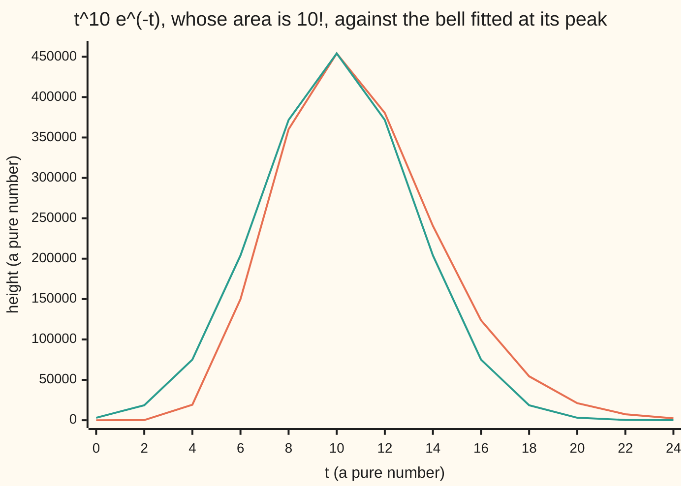
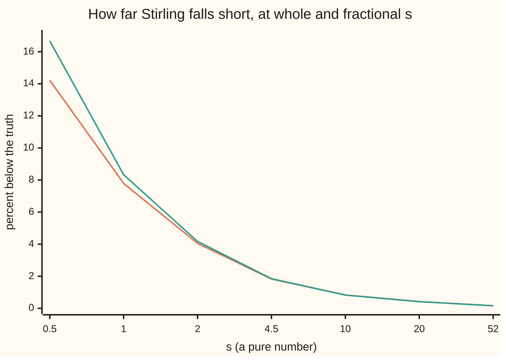

# Stirling's formula: n! is about sqrt(2 pi n) times (n/e) to the n, from the peak of the gamma integral

[Syllabus](../../../SYLLABUS.md) → [Complex analysis](../README.md) → [Special Functions and the Zeta Function](../README.md#s09) → Stirling's formula

---

## General Overview

A deck of 52 cards can be shuffled into 52! orders: 52 × 51 × … × 2 × 1, which is 8.065818 × 10^67. The formula on this card gives 8.052902 × 10^67 from three logarithms, 0.1601 percent low. For 10 cards the truth is 3,628,800 and the formula gives 3,598,696, 0.8296 percent low.

The calculus wing proves this for whole numbers ([Stirling's approximation](../../06-Calculus%20and%20analysis/06-Series/09-stirlings-approximation.md)). This card writes n! as an area, the gamma integral: one tall bump. Near its top the bump looks like a bell curve, whose area is known exactly. Fitting a bell at the peak of an integrand is **Laplace's method**, and it needs no whole numbers: it sizes 4.5!, 0.5! and the factorial of 10i.

**The factorial of s, Γ(s + 1), is about √(2πs) times (s/e) to the s: the gamma integral is one bump at t = s, and a bell of height (s/e) to the s and width √s has that area, short by a factor near 1 + 1/(12s).**

**What kind of fact this is:** an approximation, with its error stated; proved for real s in Why it works, checked but not proved for complex s.

### The picture: the bump at s = 10 and its bell



Orange: t^10 e^(−t), area exactly 3,628,800. Green: the bell with the same peak height and bend, area 3,598,696. The bump is lopsided, leaning right; Step 5 turns that shape into the missing 0.8296 percent.

---

## The formula

Reminder: the gamma function extends the factorial, Γ(s + 1) = s! ([The gamma function](02-gamma-function.md)):

$$\Gamma(s+1) = \int_0^\infty t^{s}\,e^{-t}\,dt, \qquad \text{Re}\, s > -1.$$

A wavy equals sign, ~, means the ratio of the two sides heads for 1 as s grows:

$$\Gamma(s+1) \sim \sqrt{2\pi s}\,\left(\frac{s}{e}\right)^{s}, \qquad \frac{\Gamma(s+1)}{\sqrt{2\pi s}\,(s/e)^{s}} \approx 1 + \frac{1}{12s}$$

**Read it aloud:** the factorial of s is, in ratio, root 2π s times s over e to the s; truth over formula is close to one plus one over 12 s.

Laplace's method, for a smooth g with one highest point u0, a negative second derivative g''(u0) there (the bend), and a large number M:

$$\int e^{M g(u)}\,du \;\sim\; e^{M g(u_0)}\sqrt{\frac{2\pi}{M\,|g''(u_0)|}}$$

**Read it aloud:** the integral is the peak value times root of 2π over M times the bend there.

| Symbol | Plain meaning | In our example | Push it up and the answer… |
| --- | --- | --- | --- |
| $s$, $n$ | the number whose factorial is wanted; n if whole | 52, 10, 4.5, 0.5, 10i | the ratio closes on 1 |
| $t$ | the variable integrated over | peak at t = s | — |
| $\Gamma$ | the gamma function | Γ(53) = 52! | — |
| $e$, $\pi$ | base of natural logs; circle constant | fixed | — |
| $u$ | t measured in units of s: t = s u | peak at u = 1 | — |
| $M$ | the large multiplier in the exponent | M = s | error falls like 1/M |
| $g$ | the fixed shape in the exponent | g(u) = ln u − u | — |
| $u_0$ | where g peaks; g'' there is the bend | u0 = 1, bend −1 | — |

### When it holds

- **s large in size.** Truth over formula is 1 + 1/(12s) to first order: 1.165822 at s = 0.5, 1.018660 at s = 4.5. Small s works, badly. Further correction terms exist, but their full series diverges: a few terms help, more hurt.
- **s away from the negative real axis.** That is, the principal argument of s lies strictly between −π and π. At s = −4.5 the integral diverges and the formula gives size 0.550256 against a true 0.270088.
- **Ratio, not difference.** At 52 the ratio is 0.1601 percent off; the difference is 1.2915 × 10^65 and grows without bound.
- **Complex s: the size of s sets the error.** At s = 10i the ratio is 0.999965 − 0.008336i, beside 1 + 1/(12s) = 1.000000 − 0.008333i: the error of s = 10, turned.

---

## Why it works

### Step 0: the integrand is one bump, and near its top a bump is a bell

The integrand t^s e^(−t) is a rising power times a falling exponential: zero at t = 0, one peak, then decay. Near the peak its logarithm is a downward parabola, since a smooth function looks like its Taylor polynomial close up ([Taylor series](../../06-Calculus%20and%20analysis/06-Series/05-taylor-series.md)). The exponential of a downward parabola is a bell, whose area is known exactly.

### Step 1: find the peak

The integrand's logarithm is s ln t − t. Its derivative, s/t − 1, is zero at t = s. The peak height is s^s e^(−s) = (s/e)^s: at s = 10, 453999.2976 at t = 10.

### Step 2: measure the bend

The second derivative of s ln t − t is −s/t^2, which is −1/s at the peak. The Taylor polynomial to second order is

$$s\ln t - t \;\approx\; (s\ln s - s) - \frac{(t-s)^2}{2s}.$$

So near the peak the integrand is (s/e)^s times e^(−(t−s)^2/(2s)): a bell of width √s, 3.162278 at s = 10.

### Step 3: take the bell's area

The area under e^(−x^2/(2w^2)) is √(2π) w for any width w: the bell-curve integral, which is Γ(1/2) = √π rescaled. With w = √s:

$$\int_{-\infty}^{\infty} \left(\frac{s}{e}\right)^{s} e^{-(t-s)^2/(2s)}\,dt = \sqrt{2\pi s}\,\left(\frac{s}{e}\right)^{s}.$$

At s = 10 that is 453999.2976 × 7.926655 = 3.598696 × 10^6. The bell's sliver below t = 0 is tiny and shrinks fast.

### Step 4: rescale, and the bell wins as s grows

Put t = s u, so u measures t in units of s:

$$\Gamma(s+1) = s^{s+1}\int_0^\infty e^{\,s\,(\ln u - u)}\,du.$$

The shape g(u) = ln u − u is now fixed, peaked at u = 1, and s multiplies it. A large multiplier makes everything off the peak exponentially small and squeezes the bell to width 1/√s, where the parabola fits ever better. Laplace's formula with M = s, g(1) = −1 and bend −1 gives s^(s+1) e^(−s) √(2π/s): Stirling's formula.

<details>
<summary>Detailed proof: the ratio tends to 1, with epsilon</summary>

Put t = s + √s x and y = x/√s. Then Γ(s + 1) = (s/e)^s √s × J(s), where J(s) integrates e^(s h(y)) over x > −√s and h(y) = ln(1 + y) − y. Claim: J(s) → √(2π).

Middle. Taylor with remainder gives |h(y) + y^2/2| ≤ 3|y|^3 for |y| ≤ 1/2. On |x| ≤ s^(1/10) this makes |s h(y) + x^2/2| ≤ 3s^(−1/5), so the integrand is e^(−x^2/2) times a factor within e^(±3s^(−1/5)) of 1, and this piece tends to √(2π).

Tails. h is concave with top 0 at y = 0, so it lies below its chords' extensions: for |y| ≥ y1 = s^(−2/5), h(y) ≤ (|y|/y1) h(±y1) ≤ −|y| y1/4 once y1 ≤ 1/12. Then s h(y) ≤ −s^(1/10) |x|/4, and each tail is at most (4/s^(1/10)) e^(−s^(1/5)/4), which tends to 0.

So for any ε > 0 there is an S with |J(s) − √(2π)| < ε for all s > S.

</details>

### Step 5: where 1/(12s) comes from

Write t = s(1 + y). The integrand's log, less its peak value, is s times h(y) = ln(1 + y) − y = −y^2/2 + y^3/3 − y^4/4 + …. Against the bell the cubic term averages to zero, but its square does not: −3/(4s) from the quartic and +15/(18s) from the squared cubic leave +1/(12s).

<details>
<summary>The averaging, term by term</summary>

With x = √s y, s y^3/3 = x^3/(3√s) and s y^4/4 = x^4/(4s). Expanding e^(small) to second order gives the factor 1 + x^3/(3√s) − x^4/(4s) + x^6/(18s). Under the normalised bell e^(−x^2/2), odd powers average 0, x^4 averages 3 and x^6 averages 15: 1 − 3/(4s) + 15/(18s) = 1 + 1/(12s).

</details>



Orange: percent by which Stirling falls short of the gamma integral. Green: 100/(12s). Half-integers sit on the same curve as whole numbers.

### Step 6: complex s

For complex s, t^s means e^(s ln t), and (s/e)^s means e^(s(ln s − 1)) on the principal log. The formula keeps its shape. Its proof tilts the path of integration through the peak along the direction where the integrand stops oscillating: the method of steepest descent, taught in a later wing. The check tests s = 10i against |Γ(1 + iy)|^2 = πy / sinh(πy), from the gamma-function card's reflection formula: both give 1.426975 × 10^-12.

---

## Worked numbers, by hand

The deck of 52, in logarithms.

| Step | Arithmetic | Value |
| --- | --- | --- |
| the power | 52 ln 52 | 205.4647 |
| the width factor | ½ ln(2π × 52) | 2.8946 |
| ln of the estimate | 205.4647 − 52 + 2.8946 | 156.3592 |
| in powers of ten | 156.3592 / ln 10 | 67.905952 |
| leading digits | 10^0.905952 | 8.0529 |
| estimate | 8.0529 × 10^67 | **8.052902 × 10^67** |
| truth, 52 × 51 × … × 1 | the product | **8.065818 × 10^67** |
| shortfall | 1 − estimate / truth | **0.1601 percent** |

The 1/(12 × 52) term predicts the same 0.16 percent. Three logarithms size a 68-digit count.

### What breaks when a piece is dropped

| Mistake | Comes out at | What went wrong |
| --- | --- | --- |
| Dropping √(2πn) | (10/e)^10 = 453999.30, against 3628800 | That is the bell's height alone; the area needs its width too |
| Reading the formula as Γ(n) | 9.9170 times 9! = 362880 | Γ(n) is (n − 1)!, whose bump peaks at n − 1 |
| s = −4.5, on the negative axis | size 0.550256, against Γ(−3.5) = 0.270088 | No bump: the integral diverges, and the principal log jumps there |

The code prints all three.

---

## Code, from first principles, and it actually runs

Two roads reach each true value. Road one is the gamma integral: t = e^v makes it a smooth sum over v from −40 to 7, done by trapezoids. Road two uses no integral: products for 10! and 52!, the ladder s(s − 1)…(1/2)√π for 4.5! and 0.5!, and πy / sinh(πy) at 10i. The asserts demand the roads agree to one part in a billion, that ln(truth / Stirling) lies between 0 and 1/(12s) at every real s tried, and that the complex ratio sits within 0.0001 of 1 + 1/(12s).

### Python

```python
# Stirling's formula -- the check behind the card.  Standard library only.
# Road one: the gamma integral, t^s e^(-t) from 0 to infinity, summed by
# trapezoids after t = e^v.  Road two: values known without that integral --
# whole-number products, the half-integer ladder down to sqrt(pi), and
# |Gamma(1 + iy)|^2 = pi y / sinh(pi y).  Stirling is then measured against both.
import math

def fact(s):                                   # s! = Gamma(s + 1), road one
    h, total = 0.005, 0j
    for k in range(-8000, 1401):               # v from -40 to 7
        v = k * h
        total += math.exp((s.real + 1) * v - math.exp(v)) * complex(math.cos(s.imag * v), math.sin(s.imag * v))
    return total * h

def clog(z): return complex(math.log(abs(z)), math.atan2(z.imag, z.real))
def cexp(z): return math.exp(z.real) * complex(math.cos(z.imag), math.sin(z.imag))
def stirling(s): return cexp(0.5 * clog(2 * math.pi * s) + s * (clog(s) - 1))
def ladder(s):                                 # road two for half-integers: s(s-1)...(1/2) sqrt(pi)
    out = math.sqrt(math.pi)
    while s > 0: out, s = out * s, s - 1
    return out
def product(n):                                # road two for whole numbers
    out = 1
    for k in range(2, n + 1): out *= k
    return out
def sci(x, d=4):
    e = math.floor(math.log10(abs(x))); return f"{x / 10 ** e:.{d}f} x 10^{e}"
def cf(z): return f"{z.real:.6f} {'+' if z.imag >= 0 else '-'} {abs(z.imag):.6f}i"

for n in (10, 52):
    ex, it, st = product(n), fact(complex(n)).real, stirling(complex(n)).real
    print(f"{n}!: product {sci(ex, 6)}, integral {sci(it, 6)}, Stirling {sci(st, 6)}, low by {100 * (1 - st / ex):.4f}%")
    assert abs(it / ex - 1) < 1e-9                                # road one meets road two
print(f"52! minus Stirling: {sci(ex - st)}, a ratio of {st / ex:.6f}")
for s in (0.5, 4.5):
    tr, it, st = ladder(s), fact(complex(s)).real, stirling(complex(s)).real
    print(f"{s}!: ladder {tr:.6f}, integral {it:.6f}, Stirling {st:.6f}, ratio {tr / st:.6f}, 1 + 1/(12s) {1 + 1 / (12 * s):.6f}")
    assert abs(it / tr - 1) < 1e-9
L = 52 * math.log(52); H = 0.5 * math.log(2 * math.pi * 52); T = (L - 52 + H) / math.log(10)
print(f"52 by hand: 52 ln 52 = {L:.4f}, half ln(2 pi 52) = {H:.4f}, total {L - 52 + H:.4f}, over ln 10 = {T:.6f}, 10^{T - 67:.6f} = {10 ** (T - 67):.4f}")
print(f"Laplace at s = 10: peak t = 10, height {10 ** 10 * math.exp(-10):.4f}, width sqrt(10) = {math.sqrt(10):.6f}, sqrt(2 pi 10) = {math.sqrt(20 * math.pi):.6f}")
ts = range(0, 25, 2)
print("chart, t:", " ".join(str(t) for t in ts))
print("chart, bump:", " ".join(f"{t ** 10 * math.exp(-t):.0f}" for t in ts))
print("chart, bell:", " ".join(f"{10 ** 10 * math.exp(-10 - (t - 10) ** 2 / 20):.0f}" for t in ts))
ss = (0.5, 1, 2, 4.5, 10, 20, 52)
low = [100 * (1 - stirling(complex(s)).real / fact(complex(s)).real) for s in ss]
print("chart, s:", " ".join(str(s) for s in ss))
print("chart, percent low:", " ".join(f"{x:.2f}" for x in low))
print("chart, 100/(12s):", " ".join(f"{100 / (12 * s):.2f}" for s in ss))
for s in ss: g = math.log(fact(complex(s)).real / stirling(complex(s)).real); assert 0 < g < 1 / (12 * s)
z = 10j; it, st = fact(z), stirling(z); cl = 10 * math.pi / math.sinh(10 * math.pi)
print(f"s = {z.imag:g}i: |integral|^2 {sci(abs(it) ** 2, 6)}, pi y/sinh(pi y) {sci(cl, 6)}, ratio {cf(it / st)}, 1 + 1/(12s) {cf(1 + 1 / (12 * z))}")
assert abs(abs(it) ** 2 / cl - 1) < 1e-8 and abs(it / st - 1 - 1 / (12 * z)) < 1e-4
print(f"mistake, no sqrt(2 pi n): (10/e)^10 = {(10 / math.e) ** 10:.2f} against 3628800")
print(f"mistake, Stirling at 10 read as Gamma(10) = 9! = {product(9)}: off by {stirling(10 + 0j).real / product(9):.4f} times")
print(f"mistake, s = -4.5: truth Gamma(-3.5) = {math.sqrt(math.pi) / (-0.5 * -1.5 * -2.5 * -3.5):.6f}, Stirling's size {abs(stirling(-4.5 + 0j)):.6f}")
print("ALL CHECKS PASS")
```

**Ran 2026-09-28 on macOS, Python 3.14.6, standard library only. All checks passed. Output, pasted from the run:**

```
10!: product 3.628800 x 10^6, integral 3.628800 x 10^6, Stirling 3.598696 x 10^6, low by 0.8296%
52!: product 8.065818 x 10^67, integral 8.065818 x 10^67, Stirling 8.052902 x 10^67, low by 0.1601%
52! minus Stirling: 1.2915 x 10^65, a ratio of 0.998399
0.5!: ladder 0.886227, integral 0.886227, Stirling 0.760173, ratio 1.165822, 1 + 1/(12s) 1.166667
4.5!: ladder 52.342778, integral 52.342778, Stirling 51.383932, ratio 1.018660, 1 + 1/(12s) 1.018519
52 by hand: 52 ln 52 = 205.4647, half ln(2 pi 52) = 2.8946, total 156.3592, over ln 10 = 67.905952, 10^0.905952 = 8.0529
Laplace at s = 10: peak t = 10, height 453999.2976, width sqrt(10) = 3.162278, sqrt(2 pi 10) = 7.926655
chart, t: 0 2 4 6 8 10 12 14 16 18 20 22 24
chart, bump: 0 139 19205 149881 360200 453999 380433 240524 123734 54378 21106 7409 2394
chart, bell: 3059 18506 75046 203995 371703 453999 371703 203995 75046 18506 3059 339 25
chart, s: 0.5 1 2 4.5 10 20 52
chart, percent low: 14.22 7.79 4.05 1.83 0.83 0.42 0.16
chart, 100/(12s): 16.67 8.33 4.17 1.85 0.83 0.42 0.16
s = 10i: |integral|^2 1.426975 x 10^-12, pi y/sinh(pi y) 1.426975 x 10^-12, ratio 0.999965 - 0.008336i, 1 + 1/(12s) 1.000000 - 0.008333i
mistake, no sqrt(2 pi n): (10/e)^10 = 453999.30 against 3628800
mistake, Stirling at 10 read as Gamma(10) = 9! = 362880: off by 9.9170 times
mistake, s = -4.5: truth Gamma(-3.5) = 0.270088, Stirling's size 0.550256
ALL CHECKS PASS
```

### Rust

Same numbers, same labels, built with `rustc --edition 2021 -O`, with its own small complex type.

```rust
// Stirling's formula -- the same check as the Python, in Rust.  No crates.
// Road one: the gamma integral summed by trapezoids after t = e^v.
// Road two: whole-number products, the half-integer ladder to sqrt(pi), and
// |Gamma(1 + iy)|^2 = pi y / sinh(pi y).  Stirling is measured against both.
use std::f64::consts::{E, LN_10, PI};
#[derive(Clone, Copy)]
struct C { re: f64, im: f64 }
fn c(re: f64, im: f64) -> C { C { re, im } }
fn add(a: C, b: C) -> C { c(a.re + b.re, a.im + b.im) }
fn mul(a: C, b: C) -> C { c(a.re * b.re - a.im * b.im, a.re * b.im + a.im * b.re) }
fn div(a: C, b: C) -> C { let d = b.re * b.re + b.im * b.im; c((a.re * b.re + a.im * b.im) / d, (a.im * b.re - a.re * b.im) / d) }
fn abs(a: C) -> f64 { a.re.hypot(a.im) }
fn clog(z: C) -> C { c(abs(z).ln(), z.im.atan2(z.re)) }
fn cexp(z: C) -> C { c(z.re.exp() * z.im.cos(), z.re.exp() * z.im.sin()) }
fn fact(s: C) -> C {                           // s! = Gamma(s + 1), road one
    let h = 0.005; let mut t = c(0.0, 0.0);
    for k in -8000..=1400 {                    // v from -40 to 7
        let v = k as f64 * h; let m = ((s.re + 1.0) * v - v.exp()).exp();
        t = add(t, c(m * (s.im * v).cos(), m * (s.im * v).sin()));
    }
    c(t.re * h, t.im * h)
}
fn stirling(s: C) -> C { cexp(add(mul(c(0.5, 0.0), clog(c(2.0 * PI * s.re, 2.0 * PI * s.im))), mul(s, add(clog(s), c(-1.0, 0.0))))) }
fn ladder(mut s: f64) -> f64 { let mut o = PI.sqrt(); while s > 0.0 { o *= s; s -= 1.0; } o }
fn product(n: u32) -> f64 { (2..=n).fold(1.0, |a, k| a * k as f64) }
fn sci(x: f64, d: usize) -> String { let e = x.abs().log10().floor(); format!("{:.*} x 10^{}", d, x / 10f64.powf(e), e as i32) }
fn cf(z: C) -> String { format!("{:.6} {} {:.6}i", z.re, if z.im >= 0.0 { "+" } else { "-" }, z.im.abs()) }
fn join(v: Vec<String>) -> String { v.join(" ") }
fn main() {
    for n in [10u32, 52] {
        let (ex, it, st) = (product(n), fact(c(n as f64, 0.0)).re, stirling(c(n as f64, 0.0)).re);
        println!("{}!: product {}, integral {}, Stirling {}, low by {:.4}%", n, sci(ex, 6), sci(it, 6), sci(st, 6), 100.0 * (1.0 - st / ex));
        assert!((it / ex - 1.0).abs() < 1e-9);                          // road one meets road two
    }
    let (ex, st) = (product(52), stirling(c(52.0, 0.0)).re);
    println!("52! minus Stirling: {}, a ratio of {:.6}", sci(ex - st, 4), st / ex);
    for s in [0.5f64, 4.5] {
        let (tr, it, st) = (ladder(s), fact(c(s, 0.0)).re, stirling(c(s, 0.0)).re);
        println!("{}!: ladder {:.6}, integral {:.6}, Stirling {:.6}, ratio {:.6}, 1 + 1/(12s) {:.6}", s, tr, it, st, tr / st, 1.0 + 1.0 / (12.0 * s));
        assert!((it / tr - 1.0).abs() < 1e-9);
    }
    let l = 52.0 * 52f64.ln(); let h = 0.5 * (2.0 * PI * 52.0).ln(); let t = (l - 52.0 + h) / LN_10;
    println!("52 by hand: 52 ln 52 = {:.4}, half ln(2 pi 52) = {:.4}, total {:.4}, over ln 10 = {:.6}, 10^{:.6} = {:.4}", l, h, l - 52.0 + h, t, t - 67.0, 10f64.powf(t - 67.0));
    println!("Laplace at s = 10: peak t = 10, height {:.4}, width sqrt(10) = {:.6}, sqrt(2 pi 10) = {:.6}", 1e10 * (-10f64).exp(), 10f64.sqrt(), (20.0 * PI).sqrt());
    let ts: Vec<f64> = (0..13).map(|k| 2.0 * k as f64).collect();
    println!("chart, t: {}", join(ts.iter().map(|t| format!("{}", t)).collect()));
    println!("chart, bump: {}", join(ts.iter().map(|t| format!("{:.0}", t.powi(10) * (-t).exp())).collect()));
    println!("chart, bell: {}", join(ts.iter().map(|t| format!("{:.0}", 1e10 * (-10.0 - (t - 10.0).powi(2) / 20.0).exp())).collect()));
    let ss = [0.5f64, 1.0, 2.0, 4.5, 10.0, 20.0, 52.0];
    let low: Vec<f64> = ss.iter().map(|&s| 100.0 * (1.0 - stirling(c(s, 0.0)).re / fact(c(s, 0.0)).re)).collect();
    println!("chart, s: {}", join(ss.iter().map(|s| format!("{}", s)).collect()));
    println!("chart, percent low: {}", join(low.iter().map(|x| format!("{:.2}", x)).collect()));
    println!("chart, 100/(12s): {}", join(ss.iter().map(|s| format!("{:.2}", 100.0 / (12.0 * s))).collect()));
    for &s in ss.iter() { let g = (fact(c(s, 0.0)).re / stirling(c(s, 0.0)).re).ln(); assert!(0.0 < g && g < 1.0 / (12.0 * s)); }
    let z = c(0.0, 10.0); let (it, st) = (fact(z), stirling(z)); let cl = 10.0 * PI / (10.0 * PI).sinh();
    let pred = add(c(1.0, 0.0), div(c(1.0, 0.0), c(12.0 * z.re, 12.0 * z.im))); let r = div(it, st);
    println!("s = {}i: |integral|^2 {}, pi y/sinh(pi y) {}, ratio {}, 1 + 1/(12s) {}", z.im, sci(abs(it).powi(2), 6), sci(cl, 6), cf(r), cf(pred));
    assert!((abs(it).powi(2) / cl - 1.0).abs() < 1e-8 && abs(c(r.re - pred.re, r.im - pred.im)) < 1e-4);
    println!("mistake, no sqrt(2 pi n): (10/e)^10 = {:.2} against 3628800", (10.0 / E).powi(10));
    println!("mistake, Stirling at 10 read as Gamma(10) = 9! = {}: off by {:.4} times", product(9), stirling(c(10.0, 0.0)).re / product(9));
    println!("mistake, s = -4.5: truth Gamma(-3.5) = {:.6}, Stirling's size {:.6}", PI.sqrt() / (-0.5 * -1.5 * -2.5 * -3.5), abs(stirling(c(-4.5, 0.0))));
    println!("ALL CHECKS PASS");
}
```

**Ran 2026-09-28 on macOS, rustc 1.98.1, no crates. All checks passed. Output, pasted from the run:**

```
10!: product 3.628800 x 10^6, integral 3.628800 x 10^6, Stirling 3.598696 x 10^6, low by 0.8296%
52!: product 8.065818 x 10^67, integral 8.065818 x 10^67, Stirling 8.052902 x 10^67, low by 0.1601%
52! minus Stirling: 1.2915 x 10^65, a ratio of 0.998399
0.5!: ladder 0.886227, integral 0.886227, Stirling 0.760173, ratio 1.165822, 1 + 1/(12s) 1.166667
4.5!: ladder 52.342778, integral 52.342778, Stirling 51.383932, ratio 1.018660, 1 + 1/(12s) 1.018519
52 by hand: 52 ln 52 = 205.4647, half ln(2 pi 52) = 2.8946, total 156.3592, over ln 10 = 67.905952, 10^0.905952 = 8.0529
Laplace at s = 10: peak t = 10, height 453999.2976, width sqrt(10) = 3.162278, sqrt(2 pi 10) = 7.926655
chart, t: 0 2 4 6 8 10 12 14 16 18 20 22 24
chart, bump: 0 139 19205 149881 360200 453999 380433 240524 123734 54378 21106 7409 2394
chart, bell: 3059 18506 75046 203995 371703 453999 371703 203995 75046 18506 3059 339 25
chart, s: 0.5 1 2 4.5 10 20 52
chart, percent low: 14.22 7.79 4.05 1.83 0.83 0.42 0.16
chart, 100/(12s): 16.67 8.33 4.17 1.85 0.83 0.42 0.16
s = 10i: |integral|^2 1.426975 x 10^-12, pi y/sinh(pi y) 1.426975 x 10^-12, ratio 0.999965 - 0.008336i, 1 + 1/(12s) 1.000000 - 0.008333i
mistake, no sqrt(2 pi n): (10/e)^10 = 453999.30 against 3628800
mistake, Stirling at 10 read as Gamma(10) = 9! = 362880: off by 9.9170 times
mistake, s = -4.5: truth Gamma(-3.5) = 0.270088, Stirling's size 0.550256
ALL CHECKS PASS
```

The two outputs match line for line.

> [!TIP]
> **Try changing**
> Guess first, then run it.
> - **A bigger deck.** Change `(10, 52)` to `(10, 100)`. Guess the shortfall from 1/(12s): it prints 0.0833 percent, and every assert passes.
> - **Lose the 2.** In `stirling`, replace `2 * math.pi * s` with `math.pi * s`. Every estimate falls by √2, and the log-ratio assert stops the run.
> - **Closer in on the imaginary axis.** Set `z = 5j` and both `10 * math.pi` to `5 * math.pi`. The ratio is 0.999861 − 0.016688i: the real part shows the next term, beyond the 0.0001 tolerance, and the last assert fails.

---

## The usual mistake

> [!warning]
> **Reading ~ as "nearly equal".** The formula controls the ratio, never the difference. At 52 the ratio is off by 0.1601 percent, but the numbers differ by 1.2915 × 10^65, a gap that grows without bound.
>
> - **Shifting by one.** The formula sizes Γ(s + 1), not Γ(s): read as 9! it is 9.9170 times too big.
> - **Expecting a shrinkage at complex s.** At 10i the ratio is 0.999965 − 0.008336i: the error is almost all a turn.

---

## Where you meet it in real life

- **Shuffling.** The orders of a deck, 8.065818 × 10^67, sized without multiplying 52 numbers.
- **Numerical libraries.** Log-gamma routines step the argument up by Γ(s + 1) = s Γ(s), then apply Stirling's series with a few correction terms after 1/(12s).
- **The beta function.** Γ(a)Γ(b)/Γ(a + b) is sized for large a and b by three Stirlings ([The beta function](03-beta-function.md)).
- **The zeta function.** Its functional equation carries a gamma factor, which Stirling shows shrinking exponentially up a vertical line ([Continuing zeta](08-continuing-zeta-and-the-functional-equation.md)).
- **Counting zeta's zeros.** The count up to a height uses Γ's angle on a vertical line, read off Stirling ([Zeta's zeros and the primes](09-zeros-of-zeta-and-the-primes.md)).

> **Say it back**
> The factorial of s is the area under t^s e^(−t), one bump peaked at t = s with height (s/e)^s. Near the peak its log is a downward parabola, so the bump is nearly a bell of width √s, with area √(2πs) times the height. Scaling shows the fit improving as s grows: Laplace's method. Truth over formula is 1 + 1/(12s) for whole, fractional and complex s, away from the negative axis.

---

## What this builds on

- [The gamma function](02-gamma-function.md): the integral for Γ, its recurrence, Γ(1/2) = √π, and |Γ(1 + iy)|^2.
- [Taylor series](../../06-Calculus%20and%20analysis/06-Series/05-taylor-series.md): the parabola at the peak, and the terms behind 1/(12s).
- [Stirling's approximation](../../06-Calculus%20and%20analysis/06-Series/09-stirlings-approximation.md): for whole n, n! ~ √(2πn)(n/e)^n, with the truth between 1 and e^(1/(12n)) times the estimate, proved by real integrals.

## Where this goes next

- [The beta function](03-beta-function.md): gamma ratios, sized by this card.
- [The zeta function](05-zeta-function-and-euler-product.md): the shelf's other special function.
- [Continuing zeta](08-continuing-zeta-and-the-functional-equation.md): the gamma factor sized here.
- [Zeta's zeros and the primes](09-zeros-of-zeta-and-the-primes.md): Stirling's angle term in the zero count.

The complex case is checked here, not proved; its proof, the method of steepest descent, comes in a later wing.

---

## Sources

Verified 2026-09-28: every link below resolves to the publisher's page.

- Graham, Ronald L., Donald E. Knuth and Oren Patashnik. *Concrete Mathematics: A Foundation for Computer Science*, 2nd ed. Addison-Wesley, 1994. [Publisher page](https://www.informit.com/store/concrete-mathematics-a-foundation-for-computer-science-9780201558029). Stirling's series from the counting side.
- NIST Digital Library of Mathematical Functions, §5.11, "Asymptotic Expansions" of the gamma function. [DLMF 5.11](https://dlmf.nist.gov/5.11). Stirling's series for complex s, |arg s| < π.
- NIST Digital Library of Mathematical Functions, §2.3, "Integrals of a Real Variable". [DLMF 2.3](https://dlmf.nist.gov/2.3). Laplace's method with its conditions.
