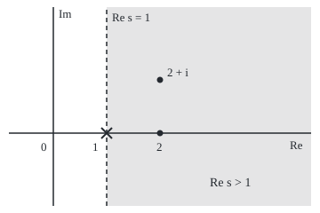
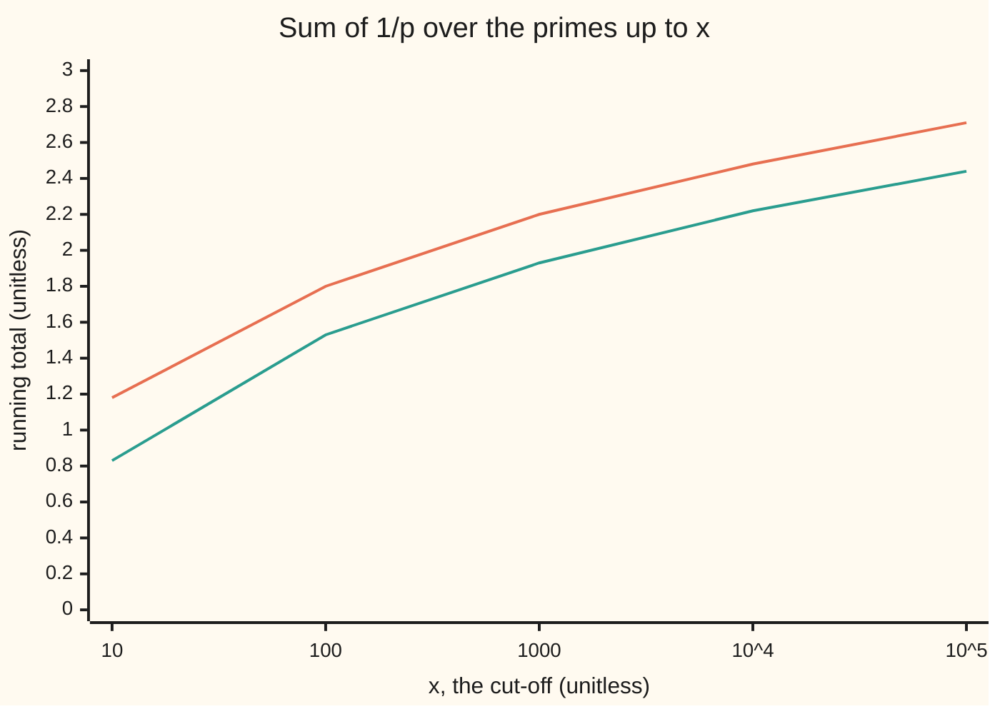

# The zeta function: the sum of 1 over n to the s for complex s, holomorphic past Re s = 1, and equal to a product over the primes

[Syllabus](../../../SYLLABUS.md) → [Complex analysis](../../../SYLLABUS.md#w07) → [Special Functions and the Zeta Function](../../../SYLLABUS.md#w07-s09) → The zeta function

---

## General Overview

A raffle sells tickets numbered 1 to 1,000. Draw two ticket numbers, repeats allowed, and ask whether they share a factor bigger than 1. Tickets 6 and 15 share 3. Tickets 8 and 15 share none: they are **coprime**. Of all 1,000,000 ordered pairs, 608,383 are coprime, a share of 0.608383. With more tickets the share settles at 0.607927, which is 6/π^2.

The π comes from adding one over each whole number squared: 1 + 1/4 + 1/9 + … = 1.6449 = π^2/6. The share is one over that total, which is also a product with one factor per prime.

Let the power 2 be any complex number $s$ and the sum becomes the **zeta function**, written ζ(s), "zeta of s".

**For complex s with real part above 1, the sum of 1/n^s converges to a holomorphic function, zeta, equal to the product over the primes of 1/(1 − 1/p^s); at s = 2 it is π^2/6, and one over it is the share of coprime pairs.**

**What kind of fact this is:** a theorem, proved on this card in Why it works; zeta itself is a definition, and the sine product used for π^2/6 is taken from [Infinite products](01-infinite-products.md).

### The picture: where the sum defines zeta

<p align="center"></p>

To scale: 60 units per 1, 0 at (60, 150). The dashed line Re s = 1 passes the cross at s = 1, (120, 150); s = 2 and s = 2 + i sit at (180, 150) and (180, 90). The sum defines zeta only in the shaded half-plane.

---

## The formula

Notation first, in words. For a whole number $n$ and complex $s$, the power $n^{-s}$ means $e^{-s\ln n}$, with $\ln n$ the ordinary real logarithm. The sign ∏ means "multiply over", as Σ means "add over".

$$\zeta(s) = \sum_{n=1}^{\infty} \frac{1}{n^{s}} = \prod_{p \text{ prime}} \frac{1}{1 - p^{-s}}, \qquad \operatorname{Re} s > 1$$

**Read it aloud:** zeta of s is one over n to the s, added over every whole number, and also one over one-minus-p-to-the-minus-s, multiplied over every prime.

$$\zeta(2) = \frac{\pi^2}{6} = 1.64493407, \qquad \frac{C(M)}{M^2} \to \frac{1}{\zeta(2)} = \frac{6}{\pi^2} = 0.607927$$

| Symbol | Plain meaning | In our example | Push it up and the answer… |
| --- | --- | --- | --- |
| $s$, $\sigma$, $t$ | complex input; its real part; its imaginary part | s = 2 + i: σ = 2, t = 1 | faster convergence |
| $n$, $N$ | a whole number; how many terms are kept | N = 1000 | narrower bracket |
| $p$, $P$ | a prime; the largest prime kept | P = 1000, 168 primes | closer to zeta |
| $\zeta$ | the full sum | ζ(2) = 1.6449 | — |
| $E_P$, $S_P$ | product over primes up to P; the numbers it lists | 1.64472519 at s = 2 | rises towards ζ(2) |
| $C(M)$, $M$ | coprime ordered pairs among tickets 1 to M | 608,383 at M = 1000 | share tends to 0.607927 |
| $a$, $b$, $g$ | two ticket numbers; their greatest common divisor | g = 3 for 6 and 15 | — |
| $x$ | the sine product's variable | x = 1/2 | — |

### When it holds

- **Real part above 1.** At s = 1 the sum is 1 + 1/2 + 1/3 + …, 7.485471 after 1,000 terms and unbounded.
- **Unique factorisation.** Multiply over all whole numbers from 2 instead of primes and the product heads to 2, not 1.6449.
- **Absolute convergence.** The sizes add up when σ > 1, which licenses regrouping the product's terms.

---

## Why it works

### Step 0: one prime factorisation per number

Every whole number is built from primes in exactly one way ([Why the factorisation is unique](../../02-Number%20theory/02-Greatest%20Common%20Divisor%20and%20Euclid%27s%20Algorithm/07-unique-factorisation.md)). A product offering each prime every power once therefore lists every whole number once.

### Step 1: complex powers of whole numbers

Write $s = \sigma + it$. Then $n^{-s} = n^{-\sigma}e^{-it\ln n}$: size $n^{-\sigma}$, turned by the angle $-t\ln n$. At s = 2 + i, $5^{-s}$ has size 0.040000 = 1/5^2. Since $\ln(mn) = \ln m + \ln n$, $(mn)^{-s} = m^{-s}n^{-s}$. Only the real $\ln n$ is used, so the branch trouble of [The complex logarithm](../02-Holomorphic%20Functions/04-complex-logarithm.md) never arises.

### Step 2: the sum converges, and zeta is holomorphic

For σ > 1 the tail past N is at most the area under $x^{-\sigma}$ from N on, $N^{1-\sigma}/(\sigma - 1)$: 1/N at σ = 2. Sharper at s = 2: $1/n^2$ lies between $1/(n(n+1))$ and $1/((n-1)n)$, which telescope, so the tail lies between 1/(N+1) and 1/N.

Fix a number $a > 1$. On the half-plane Re s ≥ a, term n never exceeds the fixed number $n^{-a}$, and those add up. By the Weierstrass M-test (terms bounded by a convergent sum of numbers converge uniformly) the sum converges uniformly there. Each term is holomorphic, so the limit is too ([Limits of holomorphic functions](../04-Taylor%20Series%2C%20Zeros%20and%20Rigidity/02-uniform-limits-of-holomorphic-functions.md)).

### Step 3: the product over primes equals the sum

Since $|p^{-s}| < 1$, the geometric series gives $1/(1 - p^{-s}) = 1 + p^{-s} + p^{-2s} + \cdots$. Multiply these for the primes up to P and call the result $E_P(s)$. Each term of the expansion picks one power of each prime, so by Step 0 the product lists $n^{-s}$ once for each n in $S_P$, the numbers with no prime factor above P: for P = 3, 1, 2, 3, 4, 6, 8, 9, 12, … but not 5.

Every missing n has a prime factor above P, so it exceeds P:

$$|\zeta(s) - E_P(s)| \le \sum_{n > P} n^{-\sigma} \le \frac{P^{1-\sigma}}{\sigma - 1}$$

At s = 2 and P = 1000 the bound is 1/1000; the gap is 0.00020888. Letting P grow gives the Euler product. No factor $1 - p^{-s}$ is 0 and the sizes $|p^{-s}|$ add up, so the factors multiply to a nonzero limit ([Infinite products](01-infinite-products.md)), so ζ(s) is never 0 on Re s > 1.

### Step 4: zeta of 2 from the sine product

The sine factors over its zeros: $\sin(\pi x)/(\pi x) = \prod_{n \ge 1}(1 - x^2/n^2)$. At x = 1/2 this is 2/π = 0.636620; 100,000 factors give 0.636621. The left side's Taylor series starts $1 - \pi^2x^2/6$. On the right, an $x^2$ comes only from $-x^2/n^2$ in one factor times 1 from the rest, so its coefficient is $-\sum 1/n^2$. Matching:

$$\zeta(2) = \sum_{n=1}^{\infty} \frac{1}{n^2} = \frac{\pi^2}{6}$$

The partial products converge uniformly near 0, so their second derivatives at 0 converge too (Step 2's theorem); that licenses the matching.

### Step 5: the coprime share is one over zeta of 2

Prime by prime first: both tickets are multiples of p in one pair in p^2, so a share $1 - 1/p^2$ escapes p, and the product over primes is $1/\zeta(2)$. That guess assumes the primes do not interfere with one another; a count proves it.

If $a$ and $b$ have greatest common divisor $g$, then $a/g$ and $b/g$ are coprime and at most $M/g$. So every pair is counted once in

$$M^2 = \sum_{g=1}^{M} C(\lfloor M/g \rfloor)$$

with the brackets meaning "round down". At M = 1000 both sides are 1,000,000. Divide by $M^2$: if the share settles at c, term g is near $c/g^2$ and the equation becomes $1 = c\,\zeta(2)$, so c = 6/π^2. The folded proof shows the share settles, using only ζ(2) < 2.

### Step 6: the primes' reciprocals add up to infinity

$E_P(1)$ is the sum of 1/n over $S_P$, which contains every n up to P. So $E_P(1) \ge 1 + 1/2 + \cdots + 1/P \ge \ln(P + 1)$; at P = 1000, 12.350976 against 7.485471. Taking logs, with $-\ln(1 - u) \le u + u^2/(1 - u)$ and u = 1/p, the extra pieces $1/(p(p-1))$ total below 1:

$$\sum_{p \le P} \frac{1}{p} \ge \ln\ln(P + 1) - 1$$

The right side is unbounded, so the sum of 1/p diverges: a stronger fact than [There are infinitely many primes](../../02-Number%20theory/02-Greatest%20Common%20Divisor%20and%20Euclid%27s%20Algorithm/08-infinitude-of-primes.md).



Orange: the sum of 1/p up to x. Green: ln ln x. The total never levels off, and stays above the proved floor ln ln(x + 1) − 1.

<details>
<summary>Detailed proof</summary>

**The share settles.** Let $r(M) = C(M)/M^2$, with largest limit point L and smallest l. Fix G. For g ≤ G, $\lfloor M/g\rfloor^2/M^2 \to 1/g^2$; terms with g > G total under 1/G. Along M with r(M) near L, the identity gives $1 \ge L + l(\zeta(2) - 1) - 2/G$; along M with r(M) near l, $1 \le l + L(\zeta(2) - 1) + 2/G$. Let G grow and subtract: $0 \le (l - L)(2 - \zeta(2))$. Since ζ(2) < 1 + (1 − 1/2) + (1/2 − 1/3) + ⋯ = 2, L = l = c, and $1 = c\,\zeta(2)$.

**Reciprocals of primes.** $\ln E_P(1) = \sum_{p \le P} -\ln(1 - 1/p) \le \sum_{p\le P} 1/p + \sum_{n \ge 2} 1/(n(n-1))$, and the last sum is 1.

</details>

---

## Worked numbers, by hand

| Step | Arithmetic | Value |
| --- | --- | --- |
| Four terms | 1 + 1/4 + 1/9 + 1/16 | 1.423611 |
| Tail bracket | add 1/5, or 1/4 | 1.623611 to 1.673611 |
| 1,000 terms | 1/n^2 up to n = 1000 | 1.64393457 |
| Tail bracket | add 1/1001, or 1/1000 | 1.64493357 to 1.64493457 |
| ζ(2) to four places | both ends agree | **1.6449** |
| Primes 2, 3, 5 | (4/3)(9/8)(25/24) | 1.562500 |
| 168 primes to 1000 | the Euler product | 1.64472519 |
| Tickets 1 to 6 | coprime pairs, counted | 23 of 36 |
| Tickets 1 to 1000 | coprime pairs, counted | 608,383 of 1,000,000 |
| The limit | 1/1.64493407 = 6/π^2 | **0.607927** |

### What breaks if you drop a piece

| Mistake | Comes out at | What went wrong |
| --- | --- | --- |
| Multiply over all whole numbers from 2 | 1.998002, heading to 2 | only primes factor uniquely |
| Take s = 1 | sum 7.485471, product 12.350976, both climbing | the sizes 1/n do not add up |

---

## Code, from first principles, and it actually runs

Road 1 adds 1,000 terms and brackets the tail. Road 2 multiplies over the primes up to 1,000, at s = 2 and at s = 2 + i. Road 3 is π^2/6, with the sine product checked at x = 1/2. Holomorphy is tested directly: the slope of the sum at 2 + i comes out the same whether s steps along 1 or along i. The coprime pairs are counted with Euclid's algorithm and checked against the split-by-divisor identity.

### Python

```python
# The zeta function and the Euler product -- the check behind the card.  Standard library only.
# zeta(s) = sum of n^-s with n^-s = e^(-s ln n).  zeta(2) three ways: 1000 terms plus a tail bracket,
# the product over primes, pi^2/6 from the sine product.  Then 6/pi^2 by counting coprime ticket pairs.
import math

def sieve(m):                                  # the primes up to m, Eratosthenes
    flag = [True] * (m + 1); flag[0] = flag[1] = False
    for p in range(2, math.isqrt(m) + 1):
        if flag[p]: flag[p * p::p] = [False] * len(flag[p * p::p])
    return [p for p in range(m + 1) if flag[p]]
def npow(n, s):                                # n^-s = e^(-s ln n): size n^-(Re s), turn -(Im s) ln n
    r, t = math.exp(-s.real * math.log(n)), -s.imag * math.log(n)
    return complex(r * math.cos(t), r * math.sin(t))
def euler(s, P):                               # product over primes p <= P of 1/(1 - p^-s)
    e = 1 + 0j
    for p in primes:
        if p > P: break
        e /= 1 - npow(p, s)
    return e
def show(w):                                   # 'a + bi', six decimals
    a, b = round(w.real, 6) + 0.0, round(w.imag, 6) + 0.0
    return f"{a:.6f} {'-' if b < 0 else '+'} {abs(b):.6f}i"
def gcd(a, b): return gcd(b, a % b) if b else a    # Euclid's algorithm

N = P = 1000
primes, z2 = sieve(100000), math.pi ** 2 / 6
S = sum(1 / n ** 2 for n in range(1, N + 1))   # road 1: 1000 terms, tail between 1/(N+1) and 1/N
lo, hi = S + 1 / (N + 1), S + 1 / N
print(f"zeta(2), 1000 terms: sum {S:.8f}, bracket [{lo:.8f}, {hi:.8f}], both ends {lo:.4f} {hi:.4f}")
E2 = euler(2, P).real                          # road 2: 168 primes up to 1000
print(f"Euler product, {sum(p <= P for p in primes)} primes <= 1000: {E2:.8f}, gap to pi^2/6 {abs(E2 - z2):.8f}, bound 1/P {1 / P:.8f}")
sp = math.prod(1 - 0.25 / n ** 2 for n in range(1, 100001))   # road 3: the sine product at x = 1/2
print(f"road 3: pi^2/6 = {z2:.8f}; sine product at x = 1/2, 100000 factors {sp:.6f}, 2/pi {2 / math.pi:.6f}")
s = complex(2, 1)
ser, eul = sum(npow(n, s) for n in range(1, N + 1)), euler(s, P)
print(f"s = 2 + i: 1000 terms {show(ser)}, product {show(eul)}, gap {abs(ser - eul):.6f}; |5^-s| = {abs(npow(5, s)):.6f}")
d1, d2 = [(sum(npow(n, s + h) for n in range(1, N + 1)) - ser) / h for h in (1e-6, 1e-6j)]   # holomorphy
print(f"slope of the 1000-term sum at 2 + i: step along 1 {show(d1)}, step along i {show(d2)}")
C = [0] * (N + 1)                              # C[M] = coprime pairs (a, b) with 1 <= a, b <= M
for M in range(1, N + 1):
    C[M] = C[M - 1] + 2 * sum(1 for a in range(1, M + 1) if gcd(a, M) == 1) - (M == 1)
print(f"tickets 1 to 1000: {C[N]} of {N * N} pairs coprime, share {C[N] / N ** 2:.6f}; 6/pi^2 {1 / z2:.6f}; 1/product {1 / E2:.6f}")
S4 = sum(1 / n ** 2 for n in range(1, 5))
print(f"by hand: 4 terms {S4:.6f}, bracket [{S4 + 1 / 5:.6f}, {S4 + 1 / 4:.6f}]; primes 2, 3, 5: {euler(2, 5).real:.6f}; tickets 1 to 6: {C[6]} of 36")
split = sum(C[N // g] for g in range(1, N + 1))
print(f"split every pair by its gcd g: sum of C(N//g) = {split}")
xs = [10, 100, 1000, 10000, 100000]
rp = [sum(1 / p for p in primes if p <= x) for x in xs]
print("chart, sum of 1/p for p <= x: " + ", ".join(f"{v:.2f}" for v in rp))
print("chart, ln ln x: " + ", ".join(f"{math.log(math.log(x)):.2f}" for x in xs))
print("floor ln ln(x+1) - 1: " + ", ".join(f"{math.log(math.log(x + 1)) - 1:.2f}" for x in xs))
H, E1 = sum(1 / n for n in range(1, P + 1)), math.prod(1 / (1 - 1 / p) for p in primes[:168])
print(f"at s = 1: harmonic sum to 1000 {H:.6f}, product over primes <= 1000 {E1:.6f}")
print(f"mistake, product over all n from 2 to 1000: {math.prod(1 / (1 - 1 / n ** 2) for n in range(2, N + 1)):.6f}")
print(f"figure, 60 per unit, 0 at (60, 150): s = 1 at ({60 + 60}, 150), s = 2 at ({60 + 120}, 150), s = 2 + i at ({60 + 120}, {150 - 60})")
assert lo <= z2 <= hi and abs(E2 - z2) < 1 / P                          # three roads to zeta(2) agree
assert abs(ser - eul) <= 1 / N + 1 / P and abs(d1 - d2) < 1e-4 and abs(sp - 2 / math.pi) <= 0.25 / 100000   # complex s; holomorphy; sine product
assert split == N * N and abs(C[N] / N ** 2 - 1 / z2) < math.log(N) / N  # the count meets 6/pi^2
assert all(v >= math.log(math.log(x + 1)) - 1 for v, x in zip(rp, xs)) and E1 >= H   # sum of 1/p grows
print("ALL CHECKS PASS")
```

**Ran 2026-09-28 on macOS, Python 3.14.6, standard library only. All checks passed. Output, pasted from the run:**

```
zeta(2), 1000 terms: sum 1.64393457, bracket [1.64493357, 1.64493457], both ends 1.6449 1.6449
Euler product, 168 primes <= 1000: 1.64472519, gap to pi^2/6 0.00020888, bound 1/P 0.00100000
road 3: pi^2/6 = 1.64493407; sine product at x = 1/2, 100000 factors 0.636621, 2/pi 0.636620
s = 2 + i: 1000 terms 1.150243 - 0.436833i, product 1.150372 - 0.437416i, gap 0.000597; |5^-s| = 0.040000
slope of the 1000-term sum at 2 + i: step along 1 0.062977 + 0.483808i, step along i 0.062977 + 0.483808i
tickets 1 to 1000: 608383 of 1000000 pairs coprime, share 0.608383; 6/pi^2 0.607927; 1/product 0.608004
by hand: 4 terms 1.423611, bracket [1.623611, 1.673611]; primes 2, 3, 5: 1.562500; tickets 1 to 6: 23 of 36
split every pair by its gcd g: sum of C(N//g) = 1000000
chart, sum of 1/p for p <= x: 1.18, 1.80, 2.20, 2.48, 2.71
chart, ln ln x: 0.83, 1.53, 1.93, 2.22, 2.44
floor ln ln(x+1) - 1: -0.13, 0.53, 0.93, 1.22, 1.44
at s = 1: harmonic sum to 1000 7.485471, product over primes <= 1000 12.350976
mistake, product over all n from 2 to 1000: 1.998002
figure, 60 per unit, 0 at (60, 150): s = 1 at (120, 150), s = 2 at (180, 150), s = 2 + i at (180, 90)
ALL CHECKS PASS
```

### Rust

Same numbers, same labels, built with `rustc --edition 2021 -O`.

```rust
// The zeta function and the Euler product -- the same check as the Python, in Rust.  No crates.
// zeta(s) = sum of n^-s with n^-s = e^(-s ln n).  zeta(2) three ways: 1000 terms plus a tail bracket,
// the product over primes, pi^2/6 from the sine product.  Then 6/pi^2 by counting coprime ticket pairs.
use std::f64::consts::PI;
#[derive(Clone, Copy)]
struct C { re: f64, im: f64 }
fn c(re: f64, im: f64) -> C { C { re, im } }
fn add(a: C, b: C) -> C { c(a.re + b.re, a.im + b.im) }
fn sub(a: C, b: C) -> C { c(a.re - b.re, a.im - b.im) }
fn div(a: C, b: C) -> C { let m = b.re * b.re + b.im * b.im; c((a.re * b.re + a.im * b.im) / m, (a.im * b.re - a.re * b.im) / m) }
fn md(a: C) -> f64 { a.re.hypot(a.im) }
fn sieve(m: usize) -> Vec<usize> { // the primes up to m, Eratosthenes
    let mut flag = vec![true; m + 1]; flag[0] = false; flag[1] = false;
    let mut p = 2;
    while p * p <= m { if flag[p] { let mut k = p * p; while k <= m { flag[k] = false; k += p; } } p += 1; }
    (0..=m).filter(|&k| flag[k]).collect()
}
fn npow(n: usize, s: C) -> C { // n^-s = e^(-s ln n): size n^-(Re s), turn -(Im s) ln n
    let l = (n as f64).ln(); let (r, t) = ((-s.re * l).exp(), -s.im * l);
    c(r * t.cos(), r * t.sin())
}
fn euler(pr: &[usize], s: C, p_max: usize) -> C { // product over primes p <= P of 1/(1 - p^-s)
    pr.iter().take_while(|&&p| p <= p_max).fold(c(1.0, 0.0), |e, &p| div(e, sub(c(1.0, 0.0), npow(p, s))))
}
fn show(w: C) -> String { // 'a + bi', six decimals
    let a = format!("{:.6}", w.re); let a = if a == "-0.000000" { "0.000000".to_string() } else { a };
    let b = format!("{:.6}", w.im.abs());
    format!("{} {} {}i", a, if w.im < 0.0 && b != "0.000000" { '-' } else { '+' }, b)
}
fn gcd(a: usize, b: usize) -> usize { if b == 0 { a } else { gcd(b, a % b) } } // Euclid's algorithm
fn main() {
    let (n, pm) = (1000usize, 1000usize);
    let (pr, z2) = (sieve(100000), PI * PI / 6.0);
    let s1: f64 = (1..=n).map(|k| 1.0 / (k * k) as f64).sum(); // road 1: 1000 terms, tail between 1/(N+1) and 1/N
    let (lo, hi) = (s1 + 1.0 / (n + 1) as f64, s1 + 1.0 / n as f64);
    println!("zeta(2), 1000 terms: sum {:.8}, bracket [{:.8}, {:.8}], both ends {:.4} {:.4}", s1, lo, hi, lo, hi);
    let e2 = euler(&pr, c(2.0, 0.0), pm).re; // road 2: 168 primes up to 1000
    println!("Euler product, {} primes <= 1000: {:.8}, gap to pi^2/6 {:.8}, bound 1/P {:.8}",
        pr.iter().filter(|&&p| p <= pm).count(), e2, (e2 - z2).abs(), 1.0 / pm as f64);
    let sp: f64 = (1..=100000).map(|k| 1.0 - 0.25 / (k as f64 * k as f64)).product(); // road 3: the sine product at x = 1/2
    println!("road 3: pi^2/6 = {:.8}; sine product at x = 1/2, 100000 factors {:.6}, 2/pi {:.6}", z2, sp, 2.0 / PI);
    let s = c(2.0, 1.0);
    let ser = (1..=n).fold(c(0.0, 0.0), |a, k| add(a, npow(k, s)));
    let eul = euler(&pr, s, pm);
    println!("s = 2 + i: 1000 terms {}, product {}, gap {:.6}; |5^-s| = {:.6}", show(ser), show(eul), md(sub(ser, eul)), md(npow(5, s)));
    let d: Vec<C> = [c(1e-6, 0.0), c(0.0, 1e-6)].iter().map(|&h| div(sub((1..=n).fold(c(0.0, 0.0), |a, k| add(a, npow(k, add(s, h)))), ser), h)).collect(); // holomorphy
    println!("slope of the 1000-term sum at 2 + i: step along 1 {}, step along i {}", show(d[0]), show(d[1]));
    let mut cp = vec![0usize; n + 1]; // cp[M] = coprime pairs (a, b) with 1 <= a, b <= M
    for m in 1..=n {
        cp[m] = cp[m - 1] + 2 * (1..=m).filter(|&a| gcd(a, m) == 1).count() - if m == 1 { 1 } else { 0 };
    }
    let share = cp[n] as f64 / (n * n) as f64;
    println!("tickets 1 to 1000: {} of {} pairs coprime, share {:.6}; 6/pi^2 {:.6}; 1/product {:.6}", cp[n], n * n, share, 1.0 / z2, 1.0 / e2);
    let s4: f64 = (1..5).map(|k| 1.0 / (k * k) as f64).sum();
    println!("by hand: 4 terms {:.6}, bracket [{:.6}, {:.6}]; primes 2, 3, 5: {:.6}; tickets 1 to 6: {} of 36",
        s4, s4 + 1.0 / 5.0, s4 + 1.0 / 4.0, euler(&pr, c(2.0, 0.0), 5).re, cp[6]);
    let split: usize = (1..=n).map(|g| cp[n / g]).sum();
    println!("split every pair by its gcd g: sum of C(N//g) = {}", split);
    let xs = [10usize, 100, 1000, 10000, 100000];
    let rp: Vec<f64> = xs.iter().map(|&x| pr.iter().filter(|&&p| p <= x).map(|&p| 1.0 / p as f64).sum()).collect();
    let row = |v: Vec<f64>| v.iter().map(|y| format!("{:.2}", y)).collect::<Vec<_>>().join(", ");
    println!("chart, sum of 1/p for p <= x: {}", row(rp.clone()));
    println!("chart, ln ln x: {}", row(xs.iter().map(|&x| (x as f64).ln().ln()).collect()));
    println!("floor ln ln(x+1) - 1: {}", row(xs.iter().map(|&x| ((x + 1) as f64).ln().ln() - 1.0).collect()));
    let h: f64 = (1..=pm).map(|k| 1.0 / k as f64).sum();
    let e1 = pr[..168].iter().fold(1.0, |e, &p| e / (1.0 - 1.0 / p as f64));
    println!("at s = 1: harmonic sum to 1000 {:.6}, product over primes <= 1000 {:.6}", h, e1);
    let all: f64 = (2..=n).map(|k| 1.0 / (1.0 - 1.0 / (k * k) as f64)).product();
    println!("mistake, product over all n from 2 to 1000: {:.6}", all);
    println!("figure, 60 per unit, 0 at (60, 150): s = 1 at ({}, 150), s = 2 at ({}, 150), s = 2 + i at ({}, {})",
        60 + 60 * 1, 60 + 60 * 2, 60 + 60 * 2, 150 - 60 * 1);
    assert!(lo <= z2 && z2 <= hi && (e2 - z2).abs() < 1.0 / pm as f64); // three roads to zeta(2) agree
    assert!(md(sub(ser, eul)) <= 1.0 / n as f64 + 1.0 / pm as f64 && md(sub(d[0], d[1])) < 1e-4 && (sp - 2.0 / PI).abs() <= 0.25 / 100000.0); // complex s; holomorphy; sine product
    assert!(split == n * n && (share - 1.0 / z2).abs() < (n as f64).ln() / n as f64); // the count meets 6/pi^2
    assert!(xs.iter().zip(&rp).all(|(&x, &v)| v >= ((x + 1) as f64).ln().ln() - 1.0) && e1 >= h); // sum of 1/p grows
    println!("ALL CHECKS PASS");
}
```

**Ran 2026-09-28 on macOS, rustc 1.98.1, no crates. All checks passed. Output, pasted from the run:**

```
zeta(2), 1000 terms: sum 1.64393457, bracket [1.64493357, 1.64493457], both ends 1.6449 1.6449
Euler product, 168 primes <= 1000: 1.64472519, gap to pi^2/6 0.00020888, bound 1/P 0.00100000
road 3: pi^2/6 = 1.64493407; sine product at x = 1/2, 100000 factors 0.636621, 2/pi 0.636620
s = 2 + i: 1000 terms 1.150243 - 0.436833i, product 1.150372 - 0.437416i, gap 0.000597; |5^-s| = 0.040000
slope of the 1000-term sum at 2 + i: step along 1 0.062977 + 0.483808i, step along i 0.062977 + 0.483808i
tickets 1 to 1000: 608383 of 1000000 pairs coprime, share 0.608383; 6/pi^2 0.607927; 1/product 0.608004
by hand: 4 terms 1.423611, bracket [1.623611, 1.673611]; primes 2, 3, 5: 1.562500; tickets 1 to 6: 23 of 36
split every pair by its gcd g: sum of C(N//g) = 1000000
chart, sum of 1/p for p <= x: 1.18, 1.80, 2.20, 2.48, 2.71
chart, ln ln x: 0.83, 1.53, 1.93, 2.22, 2.44
floor ln ln(x+1) - 1: -0.13, 0.53, 0.93, 1.22, 1.44
at s = 1: harmonic sum to 1000 7.485471, product over primes <= 1000 12.350976
mistake, product over all n from 2 to 1000: 1.998002
figure, 60 per unit, 0 at (60, 150): s = 1 at (120, 150), s = 2 at (180, 150), s = 2 + i at (180, 90)
ALL CHECKS PASS
```

The two outputs match line for line.

> [!TIP]
> **Try changing**
> Guess first, then run it.
> - **Let 1 be a prime.** Delete `flag[1] = False`. The product divides by 1 − 1 = 0 and the run stops.
> - **A slightly different power.** Change `1 / n ** 2` in road 1 to `1 / n ** 2.001`. The bracket misses π^2/6 and the first assert stops it.
> - **Count the pair (1, 1) twice.** Delete `- (M == 1)`. The split sum overshoots 1,000,000 and the third assert stops it.

---

## The usual mistake

> [!warning]
> **Reading the sum where it does not converge.** The sum defines zeta only on Re s > 1. Values at negative s belong to the continued function of [Continuing zeta](08-continuing-zeta-and-the-functional-equation.md); 1 + 2 + 3 + ⋯ still has no total.
>
> - **A finite product read as a finite sum.** $E_3(s)$ is not $1 + 2^{-s} + 3^{-s}$: it holds 4, 6, 8, 9, 12, … and never 5.
> - **The finite count as the limit.** 0.608383 is not 0.607927.

---

## Where you meet it in real life

- **Euclid's algorithm.** About six pairs in ten end at greatest common divisor 1.
- **Squarefree numbers.** Numbers with no repeated prime factor also have share 6/π^2 (Squarefree numbers).
- **Counting primes.** The product turns questions about primes into questions about one holomorphic function, whose zeros govern how primes thin out ([Zeta's zeros and the primes](09-zeros-of-zeta-and-the-primes.md)).

> **Say it back**
> Zeta of s adds one over n to the s. For real part above 1 the sizes add up, so zeta is holomorphic. Unique factorisation makes the sum a product with one factor per prime. At s = 2 the sine product gives π^2/6, and one over it, 0.607927, is the coprime share. At s = 1 the product makes the sum of one over the primes diverge.

---

## What this builds on

- [Limits of holomorphic functions](../04-Taylor%20Series%2C%20Zeros%20and%20Rigidity/02-uniform-limits-of-holomorphic-functions.md): why zeta is holomorphic.
- [Infinite products](01-infinite-products.md): nonzero limits of products, and the sine product.
- [The complex logarithm](../02-Holomorphic%20Functions/04-complex-logarithm.md): why n^(−s) needs no branch choice.
- [Why the factorisation is unique](../../02-Number%20theory/02-Greatest%20Common%20Divisor%20and%20Euclid%27s%20Algorithm/07-unique-factorisation.md): the engine of the product.
- [There are infinitely many primes](../../02-Number%20theory/02-Greatest%20Common%20Divisor%20and%20Euclid%27s%20Algorithm/08-infinitude-of-primes.md): the fact Step 6 strengthens.

## Where this goes next

- [Dirichlet series](06-dirichlet-series-and-mobius-inversion.md): general sums of a(n)/n^s.
- [The Mellin transform](07-mellin-transform.md): zeta times gamma as an integral.
- The von Mangoldt function: the product's logarithmic derivative.
- Squarefree numbers: 6/π^2 again.
- Zeta of a complex variable: the product pushed to the line Re s = 1.
- The L-function: Euler products built from a curve's point counts.

Left of the line Re s = 1 the sum fails; zeta reaches there by [Continuing zeta](08-continuing-zeta-and-the-functional-equation.md).

---

## Sources

Verified 28 Sep 2026: every link below opens a page naming the cited work.

- Stein, Elias M., and Rami Shakarchi. *Complex Analysis*. Princeton University Press, 2003. [Publisher page](https://press.princeton.edu/books/hardcover/9780691113852/complex-analysis). The sine product, zeta, the Euler product.
- NIST Digital Library of Mathematical Functions, §25.2. [DLMF 25.2](https://dlmf.nist.gov/25.2). Definition and product over primes.
- Euler, Leonhard. "De summis serierum reciprocarum." *Commentarii academiae scientiarum Petropolitanae* 7 (1740): 123–134. [Euler Archive, E41](https://scholarlycommons.pacific.edu/euler-works/41/). π^2/6 from the sine product.
- Euler, Leonhard. "Variae observationes circa series infinitas." *Commentarii academiae scientiarum Petropolitanae* 9 (1744): 160–188. [Euler Archive, E72](https://scholarlycommons.pacific.edu/euler-works/72/). The Euler product; the sum of 1/p diverges.
