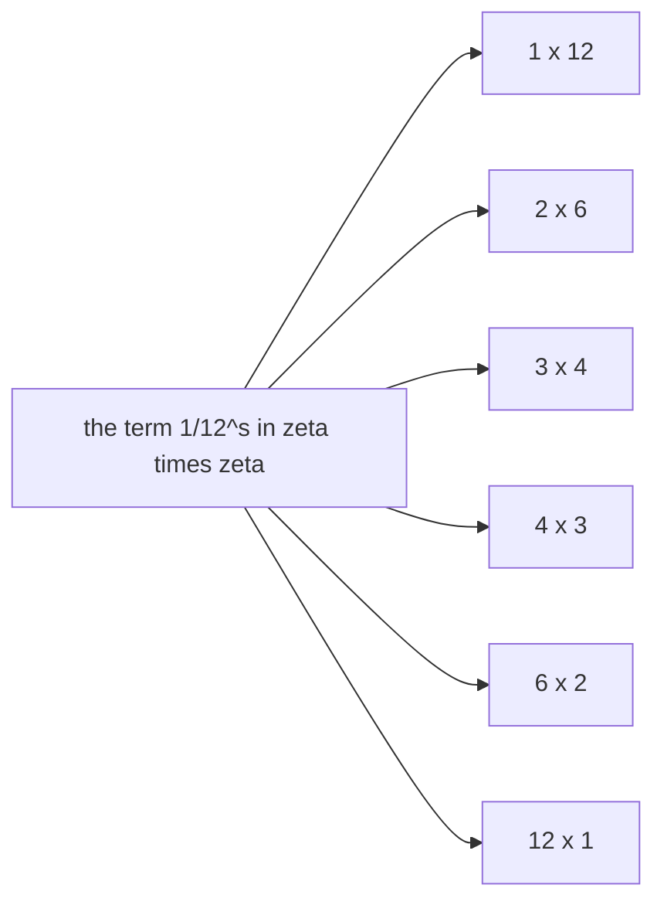
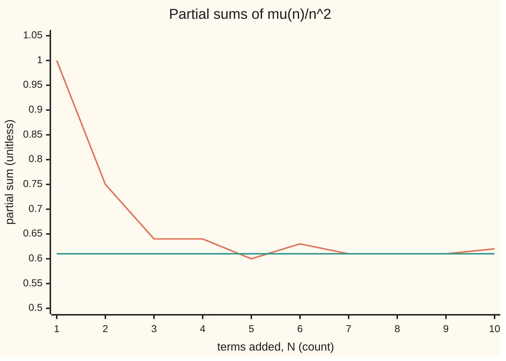

# Dirichlet series: multiply two of them and the coefficients convolve over divisors, so 1 over zeta is a series with the Mobius signs

[Syllabus](../../../SYLLABUS.md) → [Complex analysis](../README.md) → [Special Functions and the Zeta Function](../README.md#s09) → Dirichlet series

---

## General Overview

A 12-hour clock face can be cut into equal slices in six ways: 1, 2, 3, 4, 6 or 12 slices, the divisors of 12. Each way is a pair multiplying to 12: two slices of six hours, three of four.

Give every whole number n a weight, divide it by n to the power s, and add. Multiplying two such sums multiplies powers: 1/m^s times 1/k^s is 1/(mk)^s, so the term 1/12^s collects the pairs m × k = 12. Square the zeta series, every weight 1, and the weight on 1/12^s is 6, the divisor count.

The series whose product with zeta is 1 has weights 1, −1, −1, 0, −1, 1, −1, 0, 0, 1 for n = 1 to 10: the **Möbius** signs, after August Möbius, 1831. The divisors of 6 add to 1 + 2 + 3 + 6 = 12. Getting 6 back from 12 undoes a divisor sum, and that is dividing by zeta.

**Multiplying two such series convolves their weights over divisor pairs; the series with every weight 1 is zeta, and its reciprocal carries the Möbius signs, which undo any divisor sum.**

**What kind of fact this is:** a theorem, proved on this card in Why it works; the Möbius function and the convolution are definitions.

### The picture: the six ways to cut the clock



Each box is one pair of terms meeting at 1/12^s.

---

## The formula

Notation first, in words. An **arithmetic function** gives one number for each whole number n; the weights above are an example. The bar in $d \mid n$ reads "d divides n". For complex s, $n^{-s}$ means $e^{-s \ln n}$, of size n to the power −Re s. A **Dirichlet series** adds an arithmetic function's values against these powers:

$$F_a(s)=\sum_{n=1}^{\infty}\frac{a(n)}{n^s},\qquad(a*b)(n)=\sum_{d\mid n}a(d)\,b(n/d),\qquad F_a(s)\,F_b(s)=F_{a*b}(s)$$

**Read it aloud:** the product of two Dirichlet series has, at n, the sum over divisors d of a at d times b at n over d.

That divisor sum $a * b$ is the **Dirichlet convolution**. With weight one everywhere, written $\mathbf{1}$, the series is zeta, and $\mathbf{1} * \mathbf{1}$ counts divisors, $\tau$. The Möbius function $\mu$ is

$$\mu(n)=\begin{cases}1&n=1\\(-1)^r&n\text{ is }r\text{ different primes multiplied}\\0&\text{a prime squared divides }n\end{cases}\qquad\sum_{d\mid n}\mu(d)=\varepsilon(n)$$

**Read it aloud:** the Möbius signs over the divisors of n add to $\varepsilon(n)$: 1 when n is 1, 0 otherwise.

$$\frac{1}{\zeta(s)}=\sum_{n=1}^{\infty}\frac{\mu(n)}{n^s}\quad(\operatorname{Re}s>1),\qquad g=\mathbf{1}*f\iff f=\mu*g$$

**Read it aloud:** one over zeta has the Möbius weights; if g adds f over divisors, Möbius-weighting g gives f back.

| Symbol | Plain meaning | In our example | Push it up and the answer… |
| --- | --- | --- | --- |
| $s$ | the complex exponent | 2, and 2 + i | larger Re s: faster shrinking terms |
| $n$, $d$, $m$, $k$ | whole numbers; $d$ divides $n$ | n = 12; d = 1, 2, 3, 4, 6, 12 | longer divisor sums |
| $a$, $b$, $f$, $g$ | arithmetic functions: one number per $n$ | f(n) = n, g = σ | — |
| $F_a$ | the Dirichlet series with weights $a$ | $F_{\mathbf 1} = \zeta$ | — |
| $a * b$ | Dirichlet convolution | $\mathbf 1 * \mathbf 1 = \tau$ | — |
| $\mu$ | the Möbius function | μ(6) = 1, μ(12) = 0 | a repeated prime makes it 0 |
| $\zeta$, $\mathbf{1}$, $\varepsilon$ | zeta; weight 1 everywhere; 1 at 1, else 0 | $\zeta \cdot F_\mu = F_\varepsilon = 1$ | — |
| $\tau$, $\sigma$ | divisor count, divisor sum | τ(12) = 6, σ(6) = 12, σ(12) = 28 | — |

A function is **multiplicative** when its value at a product of two numbers sharing no prime is the product of its values: τ(12) = τ(4) × τ(3) = 3 × 2 = 6. A shared prime breaks it: τ(2) × τ(2) = 4, but τ(4) = 3.

### When it holds

- **Re s > 1, for the series.** The weights of zeta and of the Möbius series are at most 1 in size, so both converge absolutely there. At s = 1 zeta is the divergent harmonic series.
- **Absolute convergence, for multiplying.** Grouping a product by n = mk rearranges it, safe only for absolutely convergent series.
- **Nothing, for inversion.** $g = \mathbf{1} * f \iff f = \mu * g$ is finite divisor arithmetic, true for every arithmetic function.
- **Zero on repeated primes.** Signs that count repeats, giving 4 = 2 × 2 the sign +1, add to 1 over the divisors of 4, not 0.

---

## Why it works

### Step 0: powers of whole numbers multiply the way the numbers do

For complex s, $m^{-s} k^{-s} = (mk)^{-s}$, because $\ln(mk) = \ln m + \ln k$ and the exponential turns sums into products. Multiplied term by term, the terms from m and from k land on the power of n = mk, and every divisor pair of n meets there.

### Step 1: collect the terms, and the weights convolve

The pair (m, k) with m × k = 12 contributes $a(m)\,b(k)\,12^{-s}$. The six pairs add to $(a * b)(12)$. The same holds at every n, so $F_a F_b = F_{a*b}$; with every weight 1, $\zeta^2$ has weight τ(n) at n. Grouping by mk rearranges infinitely many terms, allowed under absolute convergence.

<details>
<summary>Detailed proof: multiplying two absolutely convergent Dirichlet series</summary>

Fix s with real part x, and let $A = \sum |a(m)| m^{-x}$ and $B = \sum |b(k)| k^{-x}$ be finite. The sizes of the product's first N terms add to at most the sum over pairs with mk up to N, at most AB, so the product converges absolutely.

Pairs with m and k both up to M give the product of two length-M partial sums, tending to $F_a F_b$. For N at least M × M, the pairs with mk up to N contain that square; the rest are at most B times the tail of A past M plus A times the tail of B past M, which tends to 0. Those pairs regroup finitely into the product's first N terms. Letting N, then M, grow gives $F_{a*b} = F_a F_b$.

</details>

### Step 2: convolution keeps multiplicativity

Split 12 as 4 × 3, no shared prime. Each divisor of 12 is uniquely a divisor of 4 times one of 3, so for multiplicative a and b a divisor sum at 12 splits into sums at 4 and at 3: $a * b$ is multiplicative. At a prime power τ is the exponent plus one, so τ(12) = (2 + 1)(1 + 1) = 6. The divisor sum σ is "n itself" convolved with $\mathbf 1$, and splits the same way.

### Step 3: the Möbius signs over the divisors of n cancel unless n is 1

At 12 the signs over the divisors 1, 2, 3, 4, 6, 12 are 1, −1, −1, 0, 1, 0, and they add to 0.

Divisors with a repeated prime give 0. The rest are one per choice among the r different primes of n, with sign −1 per prime chosen. Pair each choice without the first prime with the same choice plus it: opposite signs. Every choice is in one pair, so for r at least 1 the sum is 0. At n = 1 the sum is μ(1) = 1. That is $\mathbf 1 * \mu = \varepsilon$.

### Step 4: one over zeta has the Möbius weights

For Re s > 1 both $\zeta$ and $F_\mu$ converge absolutely, so Step 1 applies:

$$\zeta(s)\,F_\mu(s)=F_{\mathbf 1*\mu}(s)=F_\varepsilon(s)=1.$$

The series with weights ε is its first term, 1. So $F_\mu = 1/\zeta$, and zeta has no zero where Re s > 1.

A second road: the Euler product ([The zeta function](05-zeta-function-and-euler-product.md)) writes 1/ζ(s) as the product of $1 - p^{-s}$ over primes p. Expanding takes 1 or $-p^{-s}$ from each bracket: each prime at most once, sign −1 per prime, exactly μ. The brackets for 2, 3, 5 and 7 give the first ten weights.

### Step 5: Möbius inversion is dividing by zeta

If $g = \mathbf 1 * f$ then $F_g = \zeta F_f$, and dividing by zeta gives $F_f = F_\mu F_g$, so $f = \mu * g$. Without series: both groupings of $\mu * \mathbf 1 * f$ add $\mu(a) f(c)$ over triples with a × b × c = n, so convolution is associative and $\mu * (\mathbf 1 * f) = (\mu * \mathbf 1) * f = \varepsilon * f = f$.

At n = 6 with $f(n) = n$, g is σ. The signs 1, −1, −1, 1 on the divisors 1, 2, 3, 6 meet σ(6), σ(3), σ(2), σ(1): 12 − 4 − 3 + 1 = 6.

A signless road: f(n) is g(n) minus f at the smaller divisors, from f(1) = σ(1) = 1 upward. The general form is The Mobius function.

---

## Worked numbers, by hand

| Step | Arithmetic | Value |
| --- | --- | --- |
| τ(12) | one per pair m × k = 12; also (2 + 1)(1 + 1) | **6** |
| μ on 1, 2, 3, 4, 6, 12 | 4 and 12 repeat the prime 2 | 1, −1, −1, 0, 1, 0 |
| their sum | Step 3 | **0** |
| σ(6) back to 6 | 12 − 4 − 3 + 1 | **6** |
| σ(12) back to 12 | 28 − 12 − 7 + 0 + 3 + 0 | **12** |
| weights of 1/ζ | μ(1) to μ(10) | **1, −1, −1, 0, −1, 1, −1, 0, 0, 1** |

At s = 2, ten terms of each series multiply to 1.549768 × 0.616259 = 0.955058; 100 terms give 0.994475, 1000 give 0.999400. A thousand terms of the Möbius series reach 0.607932, against 6/pi^2 = 0.607927 from Euler's ζ(2). At s = 2 + i the 1000-term product is 0.999716 + 0.000493i.

### The picture: the Möbius series at s = 2, term by term



Orange: the sum of μ(n)/n^2 up to N. Green: 6/pi^2, drawn at 0.61. Flat steps: the zeros at 4, 8, 9.

### What breaks if you drop a piece

| Mistake | Comes out at | What went wrong |
| --- | --- | --- |
| Signs counting repeated primes | 1 over the divisors of 4, not 0 | Step 3 needs each prime once |
| Weights multiplied, not convolved | 1 × 1 = 1 on 1/12^s, not 6 | Six pairs land on 12 |
| Ten terms of each series multiplied | −1 on 1/12^s, not 0 | The pair 1 × 12 is missing |


---

## Code, from first principles, and it actually runs

Only `math` is imported, for pi as an outside value and for `prod`. The Möbius signs come three ways: off the primes, forced so each divisor sum vanishes past 1, and expanded from Euler-product brackets. σ is inverted two ways. Partial sums of both series are multiplied at s = 2 and 2 + i.

### Python

```python
# Dirichlet series and Mobius inversion -- the check behind the card.  Only
# math is imported, for pi as an outside value and for prod.  The example is the 12-hour
# clock: 12 = 2 x 2 x 3, with divisors 1, 2, 3, 4, 6, 12.
import math

def divisors(n):
    return [d for d in range(1, n + 1) if n % d == 0]

def factor(n):                         # trial division: {prime: exponent}
    out, p = {}, 2
    while n > 1:
        while n % p == 0:
            out[p], n = out.get(p, 0) + 1, n // p
        p += 1
    return out

def mu(n):                             # road 1: read the definition off the primes
    e = list(factor(n).values())
    return 0 if any(k > 1 for k in e) else (-1) ** len(e)

peel = {1: 1}                          # road 2: make each divisor sum of mu vanish past 1
for n in range(2, 13):
    peel[n] = -sum(peel[d] for d in divisors(n)[:-1])
euler = {1: 1}                         # road 3: expand (1 - 2^-s)(1 - 3^-s)(1 - 5^-s)(1 - 7^-s)
for p in (2, 3, 5, 7):
    euler.update({m * p: -c for m, c in list(euler.items())})
tau = lambda n: len(divisors(n))
sigma = lambda n: sum(divisors(n))
peeled = lambda g, n: g(n) - sum(peeled(g, d) for d in divisors(n)[:-1])   # undo by subtracting
moebius = lambda g, n: sum(mu(d) * g(n // d) for d in divisors(n))       # undo with mu weights
part = lambda c, s, N: sum(c(n) * n ** (-s) for n in range(1, N + 1))    # first N terms at s
one, ten = (lambda n: 1), range(1, 11)
pairs = len([(m, 12 // m) for m in divisors(12)])
formula = math.prod(e + 1 for e in factor(12).values())
print(f"divisors of 12: {divisors(12)}; pairs m x k = 12: {pairs}; (2+1)(1+1) = {formula}")
print(f"tau(4) x tau(3) = {tau(4)} x {tau(3)} = {tau(4) * tau(3)}; tau(2) x tau(2) = {tau(2) ** 2}, but tau(4) = {tau(4)}")
print(f"mu(1..10) from the primes:         {[mu(n) for n in ten]}")
print(f"mu(1..10) by peeling divisor sums: {[peel[n] for n in ten]}")
print(f"mu(1..10) from the Euler product:  {[euler.get(n, 0) for n in ten]}")
print(f"mu(6) = {mu(6)}, mu(12) = {mu(12)}; mu over the divisors of 12: {[mu(d) for d in divisors(12)]}, sum {sum(mu(d) for d in divisors(12))}")
for n in (6, 12):
    terms = [mu(d) * sigma(n // d) for d in divisors(n)]
    print(f"sigma({n}) = {sigma(n)}; mu-weighted sigmas {terms} sum to {sum(terms)}; peeling gives {peeled(sigma, n)}")
print("figure, partial sums of mu(n)/n^2, N = 1..10:", " ".join(f"{part(mu, 2, N):.2f}" for N in ten))
for N in (10, 100, 1000):
    z, m = part(one, 2, N), part(mu, 2, N)
    print(f"s = 2, N = {N:4}: zeta part {z:.6f} x mu part {m:.6f} = {z * m:.6f}")
print(f"6/pi^2 = {6 / math.pi ** 2:.6f}, the value 1/zeta(2) from Euler's pi^2/6")
w = part(one, 2 + 1j, 1000) * part(mu, 2 + 1j, 1000)
print(f"s = 2 + i, N = 1000: product {w.real:.6f} + {w.imag:.6f}i")
lam = lambda n: (-1) ** sum(factor(n).values())
print(f"mistake 1, signs counting repeated primes: sum over d | 4 = {sum(lam(d) for d in divisors(4))}, not 0")
print(f"mistake 2, coefficients multiplied, not convolved: 12^-s gets 1 x 1 = 1, not {pairs}")
cut = sum(mu(d) for d in divisors(12) if d <= 10 and 12 // d <= 10)
print(f"mistake 3, ten terms of each series multiplied: 12^-s gets {cut}, not 0")
assert [mu(n) for n in range(1, 13)] == [peel[n] for n in range(1, 13)]           # definition = inverse of 1
assert [mu(n) for n in ten] == [euler.get(n, 0) for n in ten]                     # = Euler product expanded
assert [moebius(sigma, n) for n in range(1, 13)] == list(range(1, 13))            # sigma inverts to n
assert abs(part(mu, 2, 1000) - 6 / math.pi ** 2) < 1 / 1000 and abs(w - 1) < 4 / 1000   # tails under 1/N
print("ALL CHECKS PASS")
```

**Ran 2026-09-28 on macOS, Python 3.14.6, standard library only. All checks passed. Output, pasted from the run:**

```
divisors of 12: [1, 2, 3, 4, 6, 12]; pairs m x k = 12: 6; (2+1)(1+1) = 6
tau(4) x tau(3) = 3 x 2 = 6; tau(2) x tau(2) = 4, but tau(4) = 3
mu(1..10) from the primes:         [1, -1, -1, 0, -1, 1, -1, 0, 0, 1]
mu(1..10) by peeling divisor sums: [1, -1, -1, 0, -1, 1, -1, 0, 0, 1]
mu(1..10) from the Euler product:  [1, -1, -1, 0, -1, 1, -1, 0, 0, 1]
mu(6) = 1, mu(12) = 0; mu over the divisors of 12: [1, -1, -1, 0, 1, 0], sum 0
sigma(6) = 12; mu-weighted sigmas [12, -4, -3, 1] sum to 6; peeling gives 6
sigma(12) = 28; mu-weighted sigmas [28, -12, -7, 0, 3, 0] sum to 12; peeling gives 12
figure, partial sums of mu(n)/n^2, N = 1..10: 1.00 0.75 0.64 0.64 0.60 0.63 0.61 0.61 0.61 0.62
s = 2, N =   10: zeta part 1.549768 x mu part 0.616259 = 0.955058
s = 2, N =  100: zeta part 1.634984 x mu part 0.608248 = 0.994475
s = 2, N = 1000: zeta part 1.643935 x mu part 0.607932 = 0.999400
6/pi^2 = 0.607927, the value 1/zeta(2) from Euler's pi^2/6
s = 2 + i, N = 1000: product 0.999716 + 0.000493i
mistake 1, signs counting repeated primes: sum over d | 4 = 1, not 0
mistake 2, coefficients multiplied, not convolved: 12^-s gets 1 x 1 = 1, not 6
mistake 3, ten terms of each series multiplied: 12^-s gets -1, not 0
ALL CHECKS PASS
```

### Rust

Same labels, built with `rustc --edition 2021 -O`; complex powers from ln, exp, cos and sin.

```rust
// Dirichlet series and Mobius inversion -- the same check as the Python, in
// Rust.  No crates.  The example is the 12-hour clock: 12 = 2 x 2 x 3, with
// divisors 1, 2, 3, 4, 6, 12.  Complex numbers are a small (re, im) pair here.
#[derive(Clone, Copy)]
struct C { re: f64, im: f64 }
fn mul(a: C, b: C) -> C { C { re: a.re * b.re - a.im * b.im, im: a.re * b.im + a.im * b.re } }
fn pw(n: i64, s: C) -> C { // n^-s = e^(-a ln n) (cos(b ln n) - i sin(b ln n)) for s = a + bi
    let l = (n as f64).ln(); let r = (-s.re * l).exp();
    C { re: r * (s.im * l).cos(), im: -r * (s.im * l).sin() }
}
fn divisors(n: i64) -> Vec<i64> { (1..=n).filter(|d| n % d == 0).collect() }
fn factor(mut n: i64) -> Vec<i64> { // exponents of the primes, in order
    let (mut out, mut p) = (vec![], 2);
    while n > 1 { let mut e = 0; while n % p == 0 { n /= p; e += 1; } if e > 0 { out.push(e); } p += 1; }
    out
}
fn mu(n: i64) -> i64 { let e = factor(n); if e.iter().any(|&k| k > 1) { 0 } else if e.len() % 2 == 0 { 1 } else { -1 } }
fn sigma(n: i64) -> i64 { divisors(n).iter().sum() }
fn peeled(n: i64) -> i64 { let d = divisors(n); sigma(n) - d[..d.len() - 1].iter().map(|&k| peeled(k)).sum::<i64>() }
fn moebius(n: i64) -> i64 { divisors(n).iter().map(|&d| mu(d) * sigma(n / d)).sum() }
fn part(c: &dyn Fn(i64) -> i64, s: C, n: i64) -> C {
    let mut t = C { re: 0.0, im: 0.0 };
    for k in 1..=n { let p = pw(k, s); t.re += c(k) as f64 * p.re; t.im += c(k) as f64 * p.im; }
    t
}
fn main() {
    let tau = |n: i64| divisors(n).len() as i64;
    let one = |_: i64| 1i64;
    let s2 = C { re: 2.0, im: 0.0 };
    let mut peel = vec![0i64; 13]; peel[1] = 1; // road 2: each divisor sum of mu vanishes past 1
    for n in 2..13usize { let d = divisors(n as i64); peel[n] = -d[..d.len() - 1].iter().map(|&k| peel[k as usize]).sum::<i64>(); }
    let mut euler = vec![(1i64, 1i64)]; // road 3: expand (1 - 2^-s)(1 - 3^-s)(1 - 5^-s)(1 - 7^-s)
    for p in [2i64, 3, 5, 7] { let add: Vec<(i64, i64)> = euler.iter().map(|&(m, c)| (m * p, -c)).collect(); euler.extend(add); }
    let eu = |n: i64| euler.iter().find(|&&(m, _)| m == n).map_or(0, |&(_, c)| c);
    let pairs = divisors(12).iter().map(|&m| (m, 12 / m)).count() as i64;
    let formula: i64 = factor(12).iter().map(|e| e + 1).product();
    let ten: Vec<i64> = (1..=10).collect();
    let d12 = divisors(12);
    println!("divisors of 12: {:?}; pairs m x k = 12: {}; (2+1)(1+1) = {}", d12, pairs, formula);
    println!("tau(4) x tau(3) = {} x {} = {}; tau(2) x tau(2) = {}, but tau(4) = {}", tau(4), tau(3), tau(4) * tau(3), tau(2) * tau(2), tau(4));
    println!("mu(1..10) from the primes:         {:?}", ten.iter().map(|&n| mu(n)).collect::<Vec<_>>());
    println!("mu(1..10) by peeling divisor sums: {:?}", ten.iter().map(|&n| peel[n as usize]).collect::<Vec<_>>());
    println!("mu(1..10) from the Euler product:  {:?}", ten.iter().map(|&n| eu(n)).collect::<Vec<_>>());
    let m12: Vec<i64> = d12.iter().map(|&d| mu(d)).collect();
    println!("mu(6) = {}, mu(12) = {}; mu over the divisors of 12: {:?}, sum {}", mu(6), mu(12), m12, m12.iter().sum::<i64>());
    for n in [6i64, 12] {
        let terms: Vec<i64> = divisors(n).iter().map(|&d| mu(d) * sigma(n / d)).collect();
        println!("sigma({}) = {}; mu-weighted sigmas {:?} sum to {}; peeling gives {}", n, sigma(n), terms, terms.iter().sum::<i64>(), peeled(n));
    }
    let fig: Vec<String> = ten.iter().map(|&n| format!("{:.2}", part(&mu, s2, n).re)).collect();
    println!("figure, partial sums of mu(n)/n^2, N = 1..10: {}", fig.join(" "));
    for n in [10i64, 100, 1000] {
        let (z, m) = (part(&one, s2, n).re, part(&mu, s2, n).re);
        println!("s = 2, N = {:4}: zeta part {:.6} x mu part {:.6} = {:.6}", n, z, m, z * m);
    }
    let pi = std::f64::consts::PI;
    println!("6/pi^2 = {:.6}, the value 1/zeta(2) from Euler's pi^2/6", 6.0 / (pi * pi));
    let s = C { re: 2.0, im: 1.0 };
    let w = mul(part(&one, s, 1000), part(&mu, s, 1000));
    println!("s = 2 + i, N = 1000: product {:.6} + {:.6}i", w.re, w.im);
    let lam = |n: i64| if factor(n).iter().sum::<i64>() % 2 == 0 { 1 } else { -1 };
    println!("mistake 1, signs counting repeated primes: sum over d | 4 = {}, not 0", divisors(4).iter().map(|&d| lam(d)).sum::<i64>());
    println!("mistake 2, coefficients multiplied, not convolved: 12^-s gets 1 x 1 = 1, not {}", pairs);
    let cut: i64 = d12.iter().filter(|&&d| d <= 10 && 12 / d <= 10).map(|&d| mu(d)).sum();
    println!("mistake 3, ten terms of each series multiplied: 12^-s gets {}, not 0", cut);
    assert!((1..13).all(|n| mu(n) == peel[n as usize])); // definition = inverse of 1
    assert!(ten.iter().all(|&n| mu(n) == eu(n))); // = Euler product expanded
    assert!((1..13).all(|n| moebius(n) == n)); // sigma inverts to n
    let m1000 = part(&mu, s2, 1000).re;
    assert!((m1000 - 6.0 / (pi * pi)).abs() < 1e-3 && ((w.re - 1.0).powi(2) + w.im * w.im).sqrt() < 4e-3); // tails under 1/N
    println!("ALL CHECKS PASS");
}
```

**Ran 2026-09-28 on macOS, rustc 1.98.1, no crates. All checks passed. Output, pasted from the run:**

```
divisors of 12: [1, 2, 3, 4, 6, 12]; pairs m x k = 12: 6; (2+1)(1+1) = 6
tau(4) x tau(3) = 3 x 2 = 6; tau(2) x tau(2) = 4, but tau(4) = 3
mu(1..10) from the primes:         [1, -1, -1, 0, -1, 1, -1, 0, 0, 1]
mu(1..10) by peeling divisor sums: [1, -1, -1, 0, -1, 1, -1, 0, 0, 1]
mu(1..10) from the Euler product:  [1, -1, -1, 0, -1, 1, -1, 0, 0, 1]
mu(6) = 1, mu(12) = 0; mu over the divisors of 12: [1, -1, -1, 0, 1, 0], sum 0
sigma(6) = 12; mu-weighted sigmas [12, -4, -3, 1] sum to 6; peeling gives 6
sigma(12) = 28; mu-weighted sigmas [28, -12, -7, 0, 3, 0] sum to 12; peeling gives 12
figure, partial sums of mu(n)/n^2, N = 1..10: 1.00 0.75 0.64 0.64 0.60 0.63 0.61 0.61 0.61 0.62
s = 2, N =   10: zeta part 1.549768 x mu part 0.616259 = 0.955058
s = 2, N =  100: zeta part 1.634984 x mu part 0.608248 = 0.994475
s = 2, N = 1000: zeta part 1.643935 x mu part 0.607932 = 0.999400
6/pi^2 = 0.607927, the value 1/zeta(2) from Euler's pi^2/6
s = 2 + i, N = 1000: product 0.999716 + 0.000493i
mistake 1, signs counting repeated primes: sum over d | 4 = 1, not 0
mistake 2, coefficients multiplied, not convolved: 12^-s gets 1 x 1 = 1, not 6
mistake 3, ten terms of each series multiplied: 12^-s gets -1, not 0
ALL CHECKS PASS
```

> [!TIP]
> **Try changing**
> - **Guess first:** drop 7 from the Euler-product brackets. The second assert fails at n = 7: no term reaches 1/7^s.
> - **Guess first:** run the second assert to 11. It fails: no bracket for 11.
> - **Guess first:** make `mu` return 1 on repeated primes. The first assert fails at 4, where the divisor sum is no longer 0.

---

## The usual mistake

> [!warning]
> **Taking 1/ζ as the series of reciprocal weights.** 1 over each weight of zeta is still 1, which gives zeta back. Division undoes convolution, and the weights that undo $\mathbf 1$ are the Möbius signs, zeros included.
>
> - **Forgetting the zeros.** μ(12) = 0; a +1 on 4 makes the divisor sum at 4 come out 1, not 0.

---

## Where you meet it in real life

- **Coprime pairs.** The share of pairs of whole numbers up to a large bound with no common factor tends to 6/pi^2 = 0.607927; Möbius signs strip out shared primes.
- **Euler's totient.** Hours on a clock sharing no factor with its size are counted by inverting "n itself" ([Euler's totient](../../02-Number%20theory/04-Powers%20on%20the%20Clock/03-eulers-totient.md)).
- **Strings with no repeat.** Necklaces that are not one block repeated, and irreducible polynomials in coding theory, are counted by inverting a divisor sum.

> **Say it back**
> A Dirichlet series weights each power 1/n^s. Multiplying two sends each pair m, k to mk, so weights convolve over divisors, and zeta squared counts divisors: six at 12. The Möbius signs over a divisor list cancel except at 1, so their series times zeta is 1. Dividing by zeta undoes a divisor sum: 12 − 4 − 3 + 1 brings σ(6) back to 6.

---

## What this builds on

- [The zeta function](05-zeta-function-and-euler-product.md): zeta's series and prime product.
- [Prime factorisation](../../02-Number%20theory/01-Divisibility%20and%20Primes/07-prime-factorisation.md): one factorisation per number, so μ is well defined.
- [Counting divisors](../../02-Number%20theory/01-Divisibility%20and%20Primes/08-counting-divisors.md): τ(12) = (2 + 1)(1 + 1).
- [Euler's totient](../../02-Number%20theory/04-Powers%20on%20the%20Clock/03-eulers-totient.md): its divisor sum is n, so μ recovers it.

## Where this goes next

- [Zeta's zeros and the primes](09-zeros-of-zeta-and-the-primes.md): where 1/ζ blows up.
- The Mobius function: the totient recovered from its divisor sum.
- Dirichlet L-functions: weights repeating around a clock.
- The class number formula: a zeta built on ideals.

Everything here stops at Re s > 1, where zeta cannot vanish; whether 1/ζ stays finite further left, once [Continuing zeta](08-continuing-zeta-and-the-functional-equation.md) carries zeta there, and what that says about the primes, is [Zeta's zeros and the primes](09-zeros-of-zeta-and-the-primes.md).

---

## Sources

Verified 2026-09-28: every link below resolves to the publisher's page.

- NIST DLMF §27.4, "Euler Products and Dirichlet Series." [DLMF 27.4](https://dlmf.nist.gov/27.4). Dirichlet series products and 1/ζ.
- NIST DLMF §27.5, "Inversion Formulas." [DLMF 27.5](https://dlmf.nist.gov/27.5). Convolution and Möbius inversion.
- Graham, Ronald L., Donald E. Knuth and Oren Patashnik. *Concrete Mathematics: A Foundation for Computer Science*, 2nd ed. Addison-Wesley, 1994. [Publisher page](https://www.informit.com/store/concrete-mathematics-a-foundation-for-computer-science-9780201558029). Chapter 4: μ from 1/ζ, with worked inversions.
- O'Connor, J. J., and E. F. Robertson. "August Ferdinand Möbius." MacTutor Archive, University of St Andrews. [Biography](https://mathshistory.st-andrews.ac.uk/Biographies/Mobius/). The 1831 paper.
