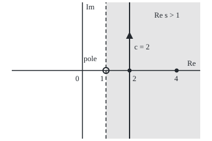

# The Mellin transform: a Laplace transform on a log scale, whose first two examples are gamma and zeta

[Syllabus](../../../SYLLABUS.md) → [Complex analysis](../../../SYLLABUS.md#w07) → [Special Functions and the Zeta Function](../../../SYLLABUS.md#w07-s09) → The Mellin transform

---

## General Overview

Zipf's law of city sizes says the k-th largest city in a country holds about 1/k of the largest's people. With a largest city of 8,000,000: rank 2 has 4,000,000, rank 3 has 2,666,667, rank 4 has 2,000,000. Double the rank, halve the size. A rule where stretching the input only rescales the output is a **power law**.

Add up a Zipf list with exponent s, sizes 1/k^s times the largest, and the total is zeta, ζ(s) = 1 + 1/2^s + 1/3^s + … ([The zeta function](05-zeta-function-and-euler-product.md)). At exponent 1 the total never settles: 1,000 cities hold 7.485471 times the largest, a million cities 14.392727 times. At exponent 2 it settles at 1.644934.

The **Mellin transform** turns "stretch the input by k" into "multiply by 1/k^s", the Zipf weight of rank k. So a sum of stretched copies of one shape comes out as ζ(s) times the transform of that shape. Copies of e^(−t) add up to 1/(e^t − 1), and out comes Γ(s)ζ(s): gamma times zeta.

**The Mellin transform weighs a function by t^(s−1) over the positive axis; it is the two-sided Laplace transform after t = e^(−x), it turns stretching into multiplying by a power, and its first two examples are Γ(s), from e^(−t), and Γ(s)ζ(s), from 1/(e^t − 1).**

**What kind of fact this is:** a definition; the gamma-zeta integral is a theorem, proved on this card in Why it works; the inversion formula is stated, not proved.

### The picture: where the transform of 1/(e^t − 1) lives

<p align="center"></p>

To scale: 40 units per 1, s = 0 at (140, 120). Shaded: Re s > 1, where the integral for Γ(s)ζ(s) converges; its dashed edge meets the pole at s = 1. The inversion integral runs up the solid line Re s = 2. Dots: the cases s = 2 and s = 4.

---

## The formula

Notation first, in words. A script M in front of a function names its Mellin transform: $\mathcal{M}f(s)$ is read "the Mellin transform of f, at s". Re s is the real part of s.

$$\mathcal{M}f(s) = \int_0^\infty t^{s-1} f(t)\,dt$$

**Read it aloud:** the Mellin transform of f at s is the area under f weighted by t to the s minus 1, over the positive axis.

It converges in a vertical **strip**, a < Re s < b, set by how f behaves near 0 and near infinity. Three facts carry the card:

$$\mathcal{M}\big[f(kt)\big](s) = k^{-s}\,\mathcal{M}f(s), \qquad \mathcal{M}f(s) = \int_{-\infty}^{\infty} e^{-sx} f(e^{-x})\,dx, \qquad \Gamma(s)\,\zeta(s) = \int_0^\infty \frac{t^{s-1}}{e^t - 1}\,dt \quad (\text{Re } s > 1).$$

**Read it aloud:** stretching by k multiplies the transform by k to the minus s; the transform is the two-sided Laplace transform of f(e^(−x)); gamma times zeta is the transform of one over e to the t minus 1.

Inversion, for any c inside the strip:

$$f(t) = \frac{1}{2\pi i}\int_{c-i\infty}^{c+i\infty} t^{-s}\,\mathcal{M}f(s)\,ds$$

**Read it aloud:** integrate t to the minus s times the transform up the line Re s = c, divide by 2πi, and f comes back.

| Symbol | Plain meaning | In our example | Push it up and the answer… |
| --- | --- | --- | --- |
| $f$ | the function transformed, for t > 0 | e^(−t), then 1/(e^t − 1) | — |
| $t$, $x$ | the input; its log-scale twin, t = e^(−x) | t over (0, ∞), x over the whole line | — |
| $s$ | the complex exponent in the weight t^(s−1) | 2, then 4 | Γ(s)ζ(s) grows, 1.644934 to 6.493939 |
| $\mathcal{M}f(s)$ | the Mellin transform of f at s | 1.644934 at s = 2 | — |
| $k$ | a stretch factor; a city's rank | 1, 2, 3, … | weight 1/k^s shrinks |
| $\Gamma(s)$ | gamma: the transform of e^(−t) | Γ(2) = 1, Γ(4) = 6 | grows like a factorial |
| $\zeta(s)$ | zeta: the Zipf total of 1/k^s | ζ(2) = 1.644934, ζ(4) = 1.082323 | falls towards 1 |
| $c$ | the inversion line's real part | 2 | any c in the strip gives the same f |

### When it holds

- **Re s inside the strip.** Near t = 0, 1/(e^t − 1) is about 1/t, so the integrand is about t^(s−2): finite in area only when Re s > 1.
- **The weight t^(s−1), not t^s.** With t^s every formula shifts by one.
- **The series from k = 1.** A k = 0 term is the constant 1, which has no transform.
- **The inversion line inside the strip, f continuous.** Outside it there is no transform; f must be continuous, the transform integrable along the line.

---

## Why it works

### Step 0: split the weight as t^s times dt/t

Put u = kt. The piece dt/t equals du/u, since top and bottom both grow by k. Only t^s = u^s/k^s changes, so a stretch leaves one factor k^(−s) behind.

### Step 1: stretching becomes multiplying

Take the transform of f(kt) and substitute u = kt, so t = u/k and dt = du/k:

$$\int_0^\infty t^{s-1} f(kt)\,dt = \int_0^\infty \Big(\frac{u}{k}\Big)^{s-1} f(u)\,\frac{du}{k} = k^{-s}\,\mathcal{M}f(s).$$

The code checks it on e^(−2t) at s = 2: the transform is 0.250000, and Γ(2)/2^2 = 0.250000.

### Step 2: on a log scale it is a Laplace transform

Reminder: the two-sided Laplace transform of g is the area under e^(−sx) g(x) over the whole line, converging in a vertical strip ([Where a transform lives](../08-Transforms%20in%20Outline/06-strips-of-convergence-and-shifting-the-line.md)).

Put t = e^(−x). Then t^(s−1) dt = −e^(−sx) dx. As t runs up from 0, x runs down from infinity; turning the limits round cancels the minus sign. That is the second formula. Stretching t by k shifts x by ln k, which is why Step 1's stretch comes out as a power. Strips and the vertical inversion line are the Laplace facts, moved by t = e^(−x).

### Step 3: the first example is gamma

With f(t) = e^(−t) the transform is the gamma integral itself ([The gamma function](02-gamma-function.md)):

$$\mathcal{M}\big[e^{-t}\big](s) = \int_0^\infty t^{s-1} e^{-t}\,dt = \Gamma(s), \qquad \text{Re } s > 0.$$

It converges for Re s > 0. The code finds Γ(2) = 1.000000 = 1!, Γ(4) = 6.000000 = 3!, and Γ(2.5) = 1.329340 = (3/4)√π, each by both roads.

### Step 4: the second example is gamma times zeta

For t > 0, e^(−t) is below 1, so the geometric series applies:

$$\frac{1}{e^t - 1} = \frac{e^{-t}}{1 - e^{-t}} = e^{-t} + e^{-2t} + e^{-3t} + \cdots$$

Each term is e^(−t) stretched by k. By Steps 1 and 3 its transform is Γ(s)/k^s. Transform term by term and add:

$$\int_0^\infty \frac{t^{s-1}}{e^t - 1}\,dt = \sum_{k=1}^\infty \frac{\Gamma(s)}{k^s} = \Gamma(s)\,\zeta(s), \qquad \text{Re } s > 1.$$

The sigma sign adds the terms for k = 1, 2, 3, and on: rank k contributes Γ(s) times its Zipf weight. The real work: the sum of infinitely many transforms is the transform of the sum.

<details>
<summary>Detailed proof</summary>

Write σ for Re s > 1; then |t^(s−1)| = t^(σ−1).

**The integral exists.** Since e^t − 1 ≥ t, the integrand is at most t^(σ−2) in size near 0, finite in area as σ > 1. For t ≥ 1, e^t − 1 ≥ e^t/2 bounds it by 2t^(σ−1)e^(−t).

**The first N terms.** A finite sum transforms term by term: Γ(s)(1 + 1/2^s + … + 1/N^s).

**The rest.** The series after N terms sums to e^(−Nt)/(e^t − 1). Using e^t − 1 ≥ t, its transform is at most ∫ t^(σ−2) e^(−Nt) dt = Γ(σ − 1)/N^(σ−1) in size, by Step 1 with stretch N. As σ > 1, this tends to 0.

So the integral is the limit of Γ(s) times the zeta partial sums: Γ(s)ζ(s).

</details>

### Step 5: inversion, and why it matters

The inversion formula is the Laplace inversion with t = e^(−x) put back, stated here, not proved: the transform on one vertical line of the strip fixes f.

Its power shows when the line moves. For e^(−t), push it left past the poles of Γ at 0, −1, −2, … Since Γ(s) = Γ(s + n + 1)/(s(s + 1)⋯(s + n)), the residue at −n is (−1)^n/n!. Each crossing collects it times t^n, building 1 − t + t^2/2! − …, the power series of e^(−t). Poles of the transform become the small-t terms of f. The same move on Γ(s)ζ(s), across zeta's pole at 1, starts the next cards.

The code's third road uses no integral: for whole-number s, integrating by parts gives Γ(s) = (s − 1)!, which it multiplies by the Zipf sum.

---

## Worked numbers, by hand

At s = 2, the area under t/(e^t − 1):

| Step | Arithmetic | Value |
| --- | --- | --- |
| Γ(2) | area under t e^(−t) = 1! | 1.000000 |
| Zipf, first four ranks | 1 + 1/4 + 1/9 + 1/16 | 1.423611 |
| Zipf, the tail | area under 1/x^2 beyond 4.5 = 1/4.5 | 0.222222 |
| ζ(2), by hand | 1.423611 + 0.222222 | 1.645833 |
| ζ(2), 1,000 ranks and tail | the code | 1.644934 |
| Γ(2)ζ(2) | 1.000000 × 1.644934 | **1.644934** |
| area under t/(e^t − 1) | both integration roads | 1.644934 = π^2/6 |
| second case, s = 4 | Γ(4)ζ(4) = 6.000000 × 1.082323 | 6.493939 = π^4/15 |

A Zipf list with exponent 2 totals 1.644934 times its largest member; one smooth area gives the same number.

### What breaks if you drop a piece

| Mistake | Comes out at | What went wrong |
| --- | --- | --- |
| s = 1, Zipf's own exponent | area 6.908255 from 0.001, 13.815511 from 0.000001 | outside the strip: the pole |
| t^s for t^(s−1), s = 2 | 2.404114 = Γ(3)ζ(3) | read at s + 1 |
| k = 0 kept in the series | 1801.644934 to t = 60, 7201.644934 to 120 | 1 has no transform |
| Γ dropped at s = 4 | 6.493939 read as ζ(4) = 1.082323 | a factor of 6 |

---

## Code, from first principles, and it actually runs

Three roads. Road one: midpoint sums in t, from 0 to 60. Road two: trapezoid sums of the Laplace form, x from −5 to 45. Road three, no integral: (s − 1)! times the Zipf sum to rank 1,000, plus the area under 1/x^s beyond 1,000.5. The asserts pit each road against the others and the closed forms, and the s = 1 area against −ln(1 − e^(−ε)), ε being the lower cutoff.

### Python

```python
# The Mellin transform -- the check behind the card.  Standard library only.
# Road one: the integral of t^(s-1) f(t) over t, by midpoints.
# Road two: the same number as a two-sided Laplace transform, after t = e^(-x).
# Road three: (s-1)! times the Zipf sum of 1/k^s, with no integral at all.
import math

def mid(g, lo, hi, n):                       # midpoint sum of g from lo to hi, n steps
    h = (hi - lo) / n
    return h * sum(g(lo + (j + 0.5) * h) for j in range(n))
def trap(g, lo, hi, n):                      # trapezoid sum of g from lo to hi, n steps
    h = (hi - lo) / n
    return h * (sum(g(lo + j * h) for j in range(1, n)) + (g(lo) + g(hi)) / 2)
def mellin_t(f, s, top=60.0):                # road one: t from 0 to 60
    return mid(lambda t: t ** (s - 1) * f(t), 0.0, top, 200000)
def mellin_x(f, s, hi=45.0):                 # road two: e^(-sx) f(e^(-x)), x from -5 to 45
    return trap(lambda x: math.exp(-s * x) * f(math.exp(-x)), -5.0, hi, 2000)
def zipf(s, n):                              # 1/k^s for k = 1..n, plus the area beyond n + 1/2
    return sum(k ** -s for k in range(1, n + 1)) + (n + 0.5) ** (1 - s) / (s - 1)
decay = lambda t: math.exp(-t)
bose = lambda t: 1 / math.expm1(t)           # 1/(e^t - 1) = e^(-t) + e^(-2t) + e^(-3t) + ...

for s, ref, name in ((2, 1.0, "1!"), (4, 6.0, "3!"), (2.5, 0.75 * math.sqrt(math.pi), "(3/4) sqrt(pi)")):
    a, b = mellin_t(decay, s), mellin_x(decay, s)
    print(f"gamma as the transform of e^(-t), s = {s}: t-side {a:.6f}, x-side {b:.6f}, {name} = {ref:.6f}")
    assert abs(a - ref) < 1e-7 and abs(b - ref) < 1e-9
st = mellin_t(lambda t: math.exp(-2 * t), 2)
print(f"stretch by k = 2: transform of e^(-2t) at s = 2 is {st:.6f}; Gamma(2)/2^2 = {1 / 4:.6f}")
print("zipf, largest 8000000: " + ", ".join(f"rank {k} {round(8e6 / k)}" for k in (2, 3, 4)))
h1, h2 = sum(1 / k for k in range(1, 1001)), sum(1 / k for k in range(1, 1000001))
print(f"zipf total, exponent 1: {h1:.6f} at 1000 cities, {h2:.6f} at 1000000 cities")
four = sum(1 / k ** 2 for k in range(1, 5))
print(f"zipf total, exponent 2, by hand: 1 + 1/4 + 1/9 + 1/16 = {four:.6f}, tail 1/4.5 = {1 / 4.5:.6f}, sum {zipf(2, 4):.6f}")
for s, closed, cname in ((2, math.pi ** 2 / 6, "pi^2/6"), (4, math.pi ** 4 / 15, "pi^4/15")):
    a, b = mellin_t(bose, s), mellin_x(bose, s)
    g, z = math.factorial(s - 1), zipf(s, 1000)
    print(f"s = {s}: integral of t^(s-1)/(e^t - 1): t-side {a:.6f}, x-side {b:.6f}")
    print(f"s = {s}: Gamma({s}) = {g:.6f} times zeta({s}) = {z:.6f} gives {g * z:.6f}; {cname} = {closed:.6f}")
    assert abs(a - b) < 1e-7                               # the substitution t = e^(-x)
    assert abs(b - g * z) < 1e-9 and abs(b - closed) < 1e-9  # the geometric series, term by term
cut = [(n, mellin_x(bose, 1, math.log(1 / e)), -math.log(-math.expm1(-e))) for n, e in (("0.001", 1e-3), ("0.000001", 1e-6))]
print("s = 1: integral from eps up, " + "; ".join(f"eps = {e}: {v:.6f} (closed {c:.6f})" for e, v, c in cut))
assert abs(st - 0.25) < 1e-7 and all(abs(v - c) < 1e-6 for _, v, c in cut) and cut[1][1] > cut[0][1] + 6
print(f"mistake, t^s for t^(s-1) at s = 2: {mellin_t(bose, 3):.6f}, which is Gamma(3) zeta(3) = {2 * zipf(3, 1000):.6f}")
print(f"mistake, k = 0 kept in the series: integral to 60 = {mellin_t(lambda t: 1 + bose(t), 2):.6f}, "
      f"to 120 = {mellin_t(lambda t: 1 + bose(t), 2, 120.0):.6f}")
px = lambda s: 140 + 40 * s                  # figure: s = 0 at (140, 120), 40 units per 1
print(f"figure, s = 0 at ({px(0):.2f}, 120.00), 40 units per 1, pole s = 1 at ({px(1):.2f}, 120.00), line c = 2 at x = {px(2):.2f}, s = 4 at ({px(4):.2f}, 120.00)")
print("ALL CHECKS PASS")
```

**Ran 2026-09-28 on macOS, Python 3.14.6, standard library only. All checks passed. Output, pasted from the run:**

```
gamma as the transform of e^(-t), s = 2: t-side 1.000000, x-side 1.000000, 1! = 1.000000
gamma as the transform of e^(-t), s = 4: t-side 6.000000, x-side 6.000000, 3! = 6.000000
gamma as the transform of e^(-t), s = 2.5: t-side 1.329340, x-side 1.329340, (3/4) sqrt(pi) = 1.329340
stretch by k = 2: transform of e^(-2t) at s = 2 is 0.250000; Gamma(2)/2^2 = 0.250000
zipf, largest 8000000: rank 2 4000000, rank 3 2666667, rank 4 2000000
zipf total, exponent 1: 7.485471 at 1000 cities, 14.392727 at 1000000 cities
zipf total, exponent 2, by hand: 1 + 1/4 + 1/9 + 1/16 = 1.423611, tail 1/4.5 = 0.222222, sum 1.645833
s = 2: integral of t^(s-1)/(e^t - 1): t-side 1.644934, x-side 1.644934
s = 2: Gamma(2) = 1.000000 times zeta(2) = 1.644934 gives 1.644934; pi^2/6 = 1.644934
s = 4: integral of t^(s-1)/(e^t - 1): t-side 6.493939, x-side 6.493939
s = 4: Gamma(4) = 6.000000 times zeta(4) = 1.082323 gives 6.493939; pi^4/15 = 6.493939
s = 1: integral from eps up, eps = 0.001: 6.908255 (closed 6.908255); eps = 0.000001: 13.815511 (closed 13.815511)
mistake, t^s for t^(s-1) at s = 2: 2.404114, which is Gamma(3) zeta(3) = 2.404114
mistake, k = 0 kept in the series: integral to 60 = 1801.644934, to 120 = 7201.644934
figure, s = 0 at (140.00, 120.00), 40 units per 1, pole s = 1 at (180.00, 120.00), line c = 2 at x = 220.00, s = 4 at (300.00, 120.00)
ALL CHECKS PASS
```

### Rust

Same labels, built with `rustc --edition 2021 -O`.

```rust
// The Mellin transform -- the same check as the Python, in Rust.  No crates.
// Road one: the integral of t^(s-1) f(t) over t, by midpoints.
// Road two: the same number as a two-sided Laplace transform, after t = e^(-x).
// Road three: (s-1)! times the Zipf sum of 1/k^s, with no integral at all.
use std::f64::consts::PI;

fn mid(g: &dyn Fn(f64) -> f64, lo: f64, hi: f64, n: usize) -> f64 { // midpoint sum, n steps
    let h = (hi - lo) / n as f64;
    h * (0..n).map(|j| g(lo + (j as f64 + 0.5) * h)).sum::<f64>()
}
fn trap(g: &dyn Fn(f64) -> f64, lo: f64, hi: f64, n: usize) -> f64 { // trapezoid sum, n steps
    let h = (hi - lo) / n as f64;
    h * ((1..n).map(|j| g(lo + j as f64 * h)).sum::<f64>() + (g(lo) + g(hi)) / 2.0)
}
fn mellin_t(f: &dyn Fn(f64) -> f64, s: f64, top: f64) -> f64 { // road one: t from 0 to top
    mid(&|t: f64| t.powf(s - 1.0) * f(t), 0.0, top, 200000)
}
fn mellin_x(f: &dyn Fn(f64) -> f64, s: f64, hi: f64) -> f64 { // road two: x from -5 to hi
    trap(&|x: f64| (-s * x).exp() * f((-x).exp()), -5.0, hi, 2000)
}
fn zipf(s: f64, n: usize) -> f64 { // 1/k^s for k = 1..n, plus the area beyond n + 1/2
    (1..=n).map(|k| (k as f64).powf(-s)).sum::<f64>() + (n as f64 + 0.5).powf(1.0 - s) / (s - 1.0)
}
fn decay(t: f64) -> f64 { (-t).exp() }
fn bose(t: f64) -> f64 { 1.0 / t.exp_m1() } // 1/(e^t - 1) = e^(-t) + e^(-2t) + e^(-3t) + ...

fn main() {
    for (s, rf, name) in [(2.0, 1.0, "1!"), (4.0, 6.0, "3!"), (2.5, 0.75 * PI.sqrt(), "(3/4) sqrt(pi)")] {
        let (a, b) = (mellin_t(&decay, s, 60.0), mellin_x(&decay, s, 45.0));
        println!("gamma as the transform of e^(-t), s = {}: t-side {:.6}, x-side {:.6}, {} = {:.6}", s, a, b, name, rf);
        assert!((a - rf).abs() < 1e-7 && (b - rf).abs() < 1e-9);
    }
    let st = mellin_t(&|t: f64| (-2.0 * t).exp(), 2.0, 60.0);
    println!("stretch by k = 2: transform of e^(-2t) at s = 2 is {:.6}; Gamma(2)/2^2 = {:.6}", st, 0.25);
    let ranks: Vec<String> = [2.0f64, 3.0, 4.0].iter().map(|&k| format!("rank {} {}", k, (8e6 / k).round())).collect();
    println!("zipf, largest 8000000: {}", ranks.join(", "));
    let harm = |n: usize| (1..=n).map(|k| 1.0 / k as f64).sum::<f64>();
    println!("zipf total, exponent 1: {:.6} at 1000 cities, {:.6} at 1000000 cities", harm(1000), harm(1000000));
    let four: f64 = (1..5).map(|k| 1.0 / (k * k) as f64).sum();
    println!("zipf total, exponent 2, by hand: 1 + 1/4 + 1/9 + 1/16 = {:.6}, tail 1/4.5 = {:.6}, sum {:.6}", four, 1.0 / 4.5, zipf(2.0, 4));
    for (s, closed, cname) in [(2u32, PI.powi(2) / 6.0, "pi^2/6"), (4, PI.powi(4) / 15.0, "pi^4/15")] {
        let (a, b) = (mellin_t(&bose, s as f64, 60.0), mellin_x(&bose, s as f64, 45.0));
        let (g, z) = ((1..s).map(|k| k as f64).product::<f64>(), zipf(s as f64, 1000));
        println!("s = {}: integral of t^(s-1)/(e^t - 1): t-side {:.6}, x-side {:.6}", s, a, b);
        println!("s = {}: Gamma({}) = {:.6} times zeta({}) = {:.6} gives {:.6}; {} = {:.6}", s, s, g, s, z, g * z, cname, closed);
        assert!((a - b).abs() < 1e-7); // the substitution t = e^(-x)
        assert!((b - g * z).abs() < 1e-9 && (b - closed).abs() < 1e-9); // the geometric series, term by term
    }
    let cut: Vec<(&str, f64, f64)> = [("0.001", 1e-3f64), ("0.000001", 1e-6)].iter()
        .map(|&(n, e)| (n, mellin_x(&bose, 1.0, (1.0 / e).ln()), -(-(-e).exp_m1()).ln())).collect();
    let parts: Vec<String> = cut.iter().map(|(n, v, c)| format!("eps = {}: {:.6} (closed {:.6})", n, v, c)).collect();
    println!("s = 1: integral from eps up, {}", parts.join("; "));
    assert!((st - 0.25).abs() < 1e-7 && cut.iter().all(|(_, v, c)| (v - c).abs() < 1e-6) && cut[1].1 > cut[0].1 + 6.0);
    println!("mistake, t^s for t^(s-1) at s = 2: {:.6}, which is Gamma(3) zeta(3) = {:.6}", mellin_t(&bose, 3.0, 60.0), 2.0 * zipf(3.0, 1000));
    let k0 = |t: f64| 1.0 + bose(t);
    println!("mistake, k = 0 kept in the series: integral to 60 = {:.6}, to 120 = {:.6}", mellin_t(&k0, 2.0, 60.0), mellin_t(&k0, 2.0, 120.0));
    let px = |s: f64| 140.0 + 40.0 * s; // figure: s = 0 at (140, 120), 40 units per 1
    println!("figure, s = 0 at ({:.2}, 120.00), 40 units per 1, pole s = 1 at ({:.2}, 120.00), line c = 2 at x = {:.2}, s = 4 at ({:.2}, 120.00)", px(0.0), px(1.0), px(2.0), px(4.0));
    println!("ALL CHECKS PASS");
}
```

**Ran 2026-09-28 on macOS, rustc 1.98.1, no crates. All checks passed. Output, pasted from the run:**

```
gamma as the transform of e^(-t), s = 2: t-side 1.000000, x-side 1.000000, 1! = 1.000000
gamma as the transform of e^(-t), s = 4: t-side 6.000000, x-side 6.000000, 3! = 6.000000
gamma as the transform of e^(-t), s = 2.5: t-side 1.329340, x-side 1.329340, (3/4) sqrt(pi) = 1.329340
stretch by k = 2: transform of e^(-2t) at s = 2 is 0.250000; Gamma(2)/2^2 = 0.250000
zipf, largest 8000000: rank 2 4000000, rank 3 2666667, rank 4 2000000
zipf total, exponent 1: 7.485471 at 1000 cities, 14.392727 at 1000000 cities
zipf total, exponent 2, by hand: 1 + 1/4 + 1/9 + 1/16 = 1.423611, tail 1/4.5 = 0.222222, sum 1.645833
s = 2: integral of t^(s-1)/(e^t - 1): t-side 1.644934, x-side 1.644934
s = 2: Gamma(2) = 1.000000 times zeta(2) = 1.644934 gives 1.644934; pi^2/6 = 1.644934
s = 4: integral of t^(s-1)/(e^t - 1): t-side 6.493939, x-side 6.493939
s = 4: Gamma(4) = 6.000000 times zeta(4) = 1.082323 gives 6.493939; pi^4/15 = 6.493939
s = 1: integral from eps up, eps = 0.001: 6.908255 (closed 6.908255); eps = 0.000001: 13.815511 (closed 13.815511)
mistake, t^s for t^(s-1) at s = 2: 2.404114, which is Gamma(3) zeta(3) = 2.404114
mistake, k = 0 kept in the series: integral to 60 = 1801.644934, to 120 = 7201.644934
figure, s = 0 at (140.00, 120.00), 40 units per 1, pole s = 1 at (180.00, 120.00), line c = 2 at x = 220.00, s = 4 at (300.00, 120.00)
ALL CHECKS PASS
```

The outputs match line for line.

> [!TIP]
> **Try changing**
> Guess first, then run it.
> - **Stretch by 3.** Change `math.exp(-2 * t)` to `math.exp(-3 * t)`. Step 1 predicts one ninth; the last assert stops it.
> - **Drop the Zipf tail.** Change `+ (n + 0.5) ** (1 - s) / (s - 1)` to `+ 0`. The sum falls short by about one thousandth; an assert stops it.
> - **Weigh by t^s.** Change `t ** (s - 1)` to `t ** s` in `mellin_t`. Road one reads the transform at s + 1; the gamma assert fails.

---

## The usual mistake

> [!warning]
> **Treating the transform as defined for every s.** For 1/(e^t − 1) it exists only for Re s > 1. At s = 1 the area from 0.001 up is 6.908255, from 0.000001 up 13.815511: no transform. The strip's edge is zeta's pole.
>
> - **t^s for t^(s−1).** At s = 2 this gives 2.404114, the right answer at the wrong s.
> - **The series from k = 0.** The constant term adds the area under t, which never settles.
> - **Forgetting gamma.** The area under t^3/(e^t − 1) is 6.493939, not ζ(4) = 1.082323.

---

## Where you meet it in real life

- **Heat radiation.** The energy a hot body radiates is the area under x^3/(e^x − 1): the s = 4 case, π^4/15 = 6.493939, a factor in the constant of the fourth-power law of radiated heat.
- **City sizes and word counts.** Zipf's exponent is near 1, exactly the pole, so a Zipf total depends on where the list stops.
- **The cost of algorithms.** Sums of stretched copies of one shape, **harmonic sums**, transform to a Dirichlet series times one transform; the poles give the sum's behaviour at small and large t.
- **Dirichlet series.** Other weights in place of Zipf's give Γ(s) times a Dirichlet series, [Dirichlet series](06-dirichlet-series-and-mobius-inversion.md).

> **Say it back**
> The Mellin transform weighs a function by t^(s−1) over the positive axis. With t = e^(−x) it is a two-sided Laplace transform: it lives in a vertical strip and inverts up a vertical line. Stretching by k multiplies it by k^(−s). The transform of e^(−t) is Γ(s); 1/(e^t − 1) is a sum of stretched copies of e^(−t), so its transform is Γ(s)ζ(s) for Re s > 1, 1.644934 at s = 2.

---

## What this builds on

- [The gamma function](02-gamma-function.md): the gamma integral, here the first transform.
- [The zeta function](05-zeta-function-and-euler-product.md): zeta as a series for Re s > 1, and ζ(2) = π^2/6.
- [Where a transform lives](../08-Transforms%20in%20Outline/06-strips-of-convergence-and-shifting-the-line.md): the two-sided Laplace transform, its strip, and moving its line.

## Where this goes next

- [Continuing zeta](08-continuing-zeta-and-the-functional-equation.md): this integral pushed past its strip, so zeta gains values left of 1.
- The functional equation: the functional equation proved from a Mellin integral of this kind.

The integral gives Γ(s)ζ(s) only right of Re s = 1; what zeta is to the left is the continuation card's question.

---

## Sources

Verified 28 Sep 2026: every link below resolves to the publisher's page.

- NIST Digital Library of Mathematical Functions, §1.14(iv), "Mellin Transform". [DLMF 1.14](https://dlmf.nist.gov/1.14). Definition, strip and inversion.
- NIST Digital Library of Mathematical Functions, §25.5, "Integral Representations" of the Riemann zeta function. [DLMF 25.5](https://dlmf.nist.gov/25.5). Formula 25.5.1 is this card's integral.
- Flajolet, Philippe, Xavier Gourdon, and Philippe Dumas. "Mellin transforms and asymptotics: Harmonic sums." *Theoretical Computer Science* 144 (1995): 3–58. [DOI](https://doi.org/10.1016/0304-3975(95)00002-E). Harmonic sums, and poles read as asymptotics.
- Gabaix, Xavier. "Zipf's Law for Cities: An Explanation." *The Quarterly Journal of Economics* 114, no. 3 (1999): 739–767. [DOI](https://doi.org/10.1162/003355399556133). City-size exponents near 1.
