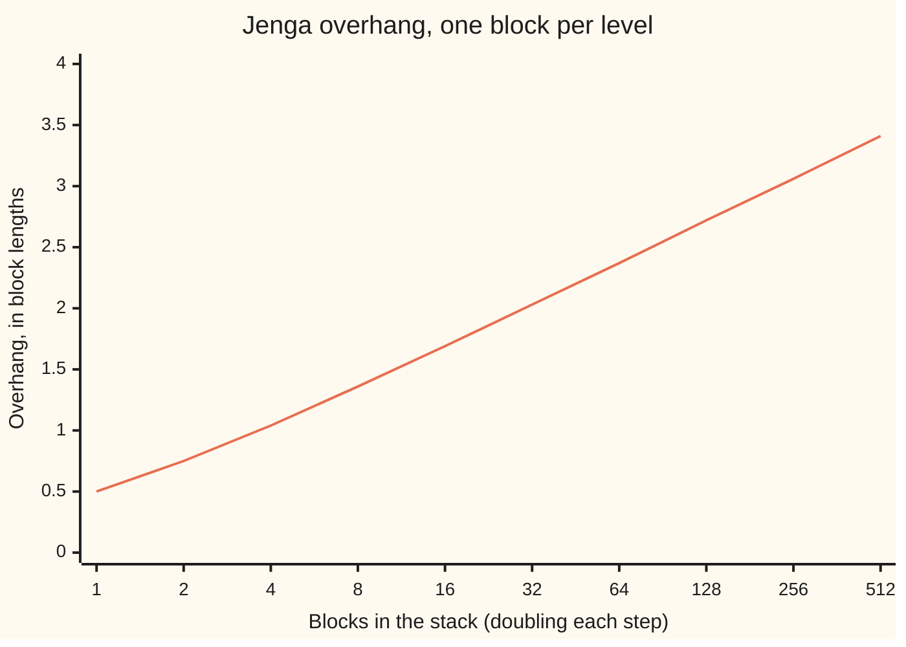
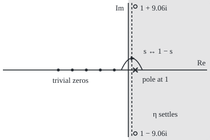

# Continuing zeta: past s = 1 with an alternating series, a pole at 1, and a mirror that reflects s to 1 - s

[Syllabus](../../../SYLLABUS.md) → [Complex analysis](../README.md) → [Special Functions and the Zeta Function](../README.md#s09) → Continuing zeta

---

## General Overview

A Jenga block is 7.5 cm long. Stack blocks one per level at a table's edge, each pushed out as far as it goes without tipping. The k-th block from the top sticks out 1/(2k) of a block past the one below: a half, a quarter, a sixth. A full set of 54 blocks reaches 2.2877 block lengths, 17.16 cm, past the table.

Three block lengths take 227 blocks, and any distance can be reached. The sum 1/2 + 1/4 + 1/6 + … has no total. It is half of 1 + 1/2 + 1/3 + …, the zeta sum at s = 1 ([The zeta function](05-zeta-function-and-euler-product.md)).

The zeta sum 1 + 1/2^s + 1/3^s + … settles only when the real part of s exceeds 1. Flipping every other sign reaches every s with positive real part, except a pole at 1: the Jenga overhang stays infinite. A mirror formula, from here on the **functional equation**, reaches the left half. Out come ζ(0.5) = −1.460355, ζ(0) = −1/2, ζ(−1) = −1/12, and zeros at −2, −4, −6, ….

**The alternating series over 1 − 2^(1−s) continues zeta to Re s > 0, with one pole, at 1, of residue 1; the functional equation, sending s to 1 − s, carries those values to the rest of the plane.**

**What kind of fact this is:** a theorem. The continuation to Re s > 0 and the pole are proved below; the functional equation is stated with its source and proved in The functional equation.

### The picture: the overhang against the number of blocks



Each doubling adds close to half of ln 2 = 0.693147 block lengths, for ever.

---

## The formula

Σ adds the terms its limits name. Re s is the real part of s. Res marks a residue, the coefficient of 1/(s − 1) near a pole ([Residues](../05-Laurent%20Series%2C%20Singularities%20and%20Residues/04-residues.md)).

$$\zeta(s) = \sum_{n=1}^{\infty} \frac{1}{n^s}\ \ (\operatorname{Re} s > 1), \qquad \eta(s) = \sum_{n=1}^{\infty} \frac{(-1)^{n-1}}{n^s}\ \ (\operatorname{Re} s > 0)$$

**Read it aloud:** zeta adds one over n to the s; eta adds the same terms with alternating signs, and settles on a bigger region.

$$\zeta(s) = \frac{\eta(s)}{1 - 2^{1-s}}, \qquad \operatorname{Res}_{s=1} \zeta = 1$$

**Read it aloud:** zeta is eta divided by one minus two to the one minus s, with a single pole, at 1, of residue 1.

$$\zeta(s) = 2^{s}\, \pi^{s-1} \sin\!\left(\frac{\pi s}{2}\right) \Gamma(1-s)\, \zeta(1-s)$$

**Read it aloud:** zeta at s is zeta at the mirror point 1 − s, times a known factor.

| Symbol | Plain meaning | In our example | Push it up and the answer… |
| --- | --- | --- | --- |
| $s$ | the input, a complex number | 0.5; −1 | past Re s = 1 the sum settles |
| $n$, $N$ | a term's position; road two's cut-off | N = 30 | smaller error |
| $\zeta$ | zeta, the sum, continued | ζ(0.5) = −1.460355 | — |
| $\eta$ | eta: the alternating sum | η(0.5) = 0.604899 | — |
| $H_n$ | 1 + 1/2 + … + 1/n | H_54/2 = 2.2877 | grows like ln n |
| $\gamma$ | Euler's constant, limit of H_n − ln n | 0.57722 | — |
| $\Gamma$ | the gamma function, Γ(n) = (n − 1)! | Γ(2) = 1 | — |
| $k$ | whole number marking where 2^(1−s) = 1 | k = 1: s = 1 + 9.064720i | — |

### When it holds

- **Re s > 0 for eta.** At s = 0 its partial sums swing between 1 and 0. Averaged, they give 1/2, eta's continued value; road two confirms it. Further left, only the mirror or road two reaches.
- **Not at s = 1.** The divisor is 0 but eta is ln 2: a genuine pole. Zeta continues to the plane minus that point.
- **The divisor's other zeros are harmless.** At 1 ± 9.064720i eta vanishes too, and zeta is finite.
- **The mirror needs every factor.** At s = 2, 4, … the sine is 0 but Γ(1 − s) has a pole; they cancel to a non-zero value. At s = 3, 5, … that pole meets a trivial zero of ζ(1 − s).

---

## Why it works

### Step 0: change the series, not the function

A holomorphic function (one with a complex derivative throughout a region) extends in at most one way ([Analytic continuation](../04-Taylor%20Series%2C%20Zeros%20and%20Rigidity/04-analytic-continuation.md)). So any holomorphic formula that equals the sum where it settles is zeta further out.

### Step 1: flipped signs make neighbours cancel

Pair eta's terms: 1/n^s − 1/(n+1)^s is the drop of x^(−s) across one step, at most |s|/n^(Re s + 1) in size. Those sizes add to a finite total when Re s > 0, though 1/n^s alone does not. The convergence is uniform on any closed bounded piece of the half-plane, so eta is holomorphic there ([Limits of holomorphic functions](../04-Taylor%20Series%2C%20Zeros%20and%20Rigidity/02-uniform-limits-of-holomorphic-functions.md)). The partial sums swing about the limit; averaging neighbours twelve times cancels the swing, giving η(0.5) = 0.604899 from 4,000 terms.

### Step 2: eta is zeta with the even terms taken off twice

Where Re s > 1, subtract: odd terms cancel, even terms double.

$$\zeta(s) - \eta(s) = 2\left(\frac{1}{2^s} + \frac{1}{4^s} + \cdots\right) = 2^{1-s}\zeta(s)$$

So η = (1 − 2^(1−s)) ζ, and by Step 0 the quotient continues zeta wherever the divisor is not 0. ζ(0.5) = 0.604899 / (1 − √2) = −1.460355.

### Step 3: where the divisor is zero

2^(1−s) = e^((1−s) ln 2) is 1 exactly when s = 1 + 2πik / ln 2 for a whole number $k$: s = 1, then 1 + 9.064720i for k = 1. There eta is 0 too, so the gap fills: road one approaching it and road two at it both give 1.346580 + 0.109883i.

<details>
<summary>Detailed proof: eta vanishes at every such point except 1</summary>

Take ψ(s) = 1 + 1/2^s − 2/3^s + 1/4^s + 1/5^s − 2/6^s + …, which is (1 − 3^(1−s)) ζ for Re s > 1. Its coefficients' running totals stay between 0 and 2, so Step 1's pairing, in blocks of three, makes ψ holomorphic on Re s > 0. Its divisor vanishes only at s = 1 + 2πim / ln 3.

Both lists share a point only if 3^k = 2^m, forcing k = m = 0 (odd against even). So for k ≠ 0, ψ / (1 − 3^(1−s)) is holomorphic at s = 1 + 2πik / ln 2 and equals zeta; then η = (1 − 2^(1−s)) ζ is 0 there.

</details>

### Step 4: the pole at 1 has residue 1

At s = 1, eta is 1 − 1/2 + 1/3 − … = ln 2 = 0.693147. Near 1 the divisor is close to (s − 1) ln 2. So ζ(s) is close to 1/(s − 1): a simple pole, residue 1. The check prints (s − 1)ζ(s) as 1.005779 at 1.01 and 1.000577 at 1.001.

With 1/(s − 1) removed, zeta tends to $\gamma$: the average of ζ(1.001) and ζ(0.999) is 0.57722, and a million blocks give H_n − ln n = 0.57722. The overhang is close to (ln n + γ)/2: the pole is the stack's growth, seen from the s side.

### Step 5: road two reaches every s but 1

Add the first N − 1 terms; replace the rest by the area under x^(−s) from N on, plus half the N-th term; correct the swap with end terms (the Euler–Maclaurin formula):

$$\zeta(s) = \sum_{n=1}^{N-1} \frac{1}{n^s} + \frac{N^{1-s}}{s-1} + \frac{1}{2N^s} + \frac{s}{12\,N^{s+1}} - \cdots$$

The area term carries the pole, residue 1 on sight. With three corrections the leftover is holomorphic for Re s > −5; each further one reaches two units further left. So road two continues zeta without eta, matching road one: −1.460355 at 0.5, −1/2 at 0. At s = −1, N = 30 it reads 435 − 450 + 15, then the correction −0.083333; later corrections carry the factor s + 1 and vanish. So ζ(−1) = −1/12 exactly.

### Step 6: the mirror

Riemann's 1859 functional equation pairs s with 1 − s, a half-turn about s = 1/2; real points swap across the dashed line. Its proof writes π^(−s/2) Γ(s/2) ζ(s) as a Mellin transform of θ(x) = Σ e^(−πn^2 x) over whole n ([The Mellin transform](07-mellin-transform.md)), whose symmetry under x → 1/x swaps s and 1 − s.

### The picture: the s-plane

<p align="center"></p>

To scale: 12 units per 1, origin (220, 120). Shaded: Re s > 0. Dashed: Re s = 1/2. Cross: the pole, (232, 120). Circles: 1 ± 9.064720i, y 11.2 and 228.8. Dots: −2 to −10. Arc: −1 (x 208) to 2 (x 244).

### Step 7: what the mirror gives

At s = −1 the mirror point is 2, where ζ(2) = π^2/6 = 1.644934. The factor is 2^(−1) π^(−2) sin(−π/2) Γ(2) = −1/(2π^2), so ζ(−1) = −1/12. At −3 the mirror gives 1/120 = 0.008333; at −0.5, with Γ(3/2) = √π/2, −0.207886. Road two agrees on all three.

At −2, −4, … the sine is 0 and nothing else is infinite: the **trivial zeros**, made by the sine alone. At s = 0 the sine's zero meets the pole of ζ(1 − s), close to −1/s, and the product tends to (1/π)(π/2)(1)(−1) = −1/2.

### Step 8: what 1 + 2 + 3 + … = −1/12 says

It says ζ(−1) = −1/12, a value of the continued function; the partial sums n(n+1)/2 have no limit. In road two the −1/12 is a correction term; a smoothed sum shows it beside a growing term ([Analytic continuation](../04-Taylor%20Series%2C%20Zeros%20and%20Rigidity/04-analytic-continuation.md)). The Jenga sum gets no value: it sits on the pole.

---

## Worked numbers, by hand

| Step | Arithmetic | Value |
| --- | --- | --- |
| Jenga, 54 blocks | (1 + 1/2 + … + 1/54) ÷ 2 | 2.2877 lengths, 17.16 cm |
| eta at 0.5 | 1 − 1/√2 + 1/√3 − …, tail averaged | 0.604899 |
| zeta at 0.5 | 0.604899 ÷ (1 − √2) | **−1.460355** |
| eta at 1 | 1 − 1/2 + 1/3 − … | ln 2 = 0.693147 |
| residue at 1 | ln 2 ÷ ln 2 | **1** |
| zeta at 0 | (1/2) ÷ (1 − 2) | **−0.500000** |
| zeta at −1 | −1/(2π^2) × π^2/6 | **−1/12 = −0.083333** |

### What breaks if you drop a piece

| Mistake | Comes out at | What went wrong |
| --- | --- | --- |
| Summing 1/√n for ζ(0.5) | 198.54 by 10,000 terms, climbing | the plain sum needs Re s > 1 |
| Reading η(0.5) as ζ(0.5) | 0.604899, not −1.460355 | the divisor was dropped |
| Mirroring without the factor | ζ(2) = 1.644934, not −0.083333 | the reflection carries a weight |
| 1 + 2 + … + 100 read as −1/12 | 5050 | a continued value is not a total |

The code prints all four.

---

## Code, from first principles, and it actually runs

Road one: eta, averaged, over 1 − 2^(1−s). Road two: Euler–Maclaurin at N = 30, without eta. Road three: the mirror, fed by road one. Four asserts set road against road, and the constant against Jenga.

### Python

```python
# Continuing zeta -- the check behind the card.  Standard library only.
# Road one: the alternating series eta, divided by 1 - 2^(1-s).  Road two: sum
# the first N - 1 terms, swap the tail for its integral, correct the swap at
# the join (Euler-Maclaurin).  Road three: the mirror, fed by road one at s > 1.
import math

def eta(s, N=4000, K=12):          # 1 - 1/2^s + 1/3^s - ..., last partial sums averaged
    sums, total = [], 0j
    for n in range(1, N + K + 1):
        total += (-1) ** (n - 1) * n ** (-s)
        if n >= N:
            sums.append(total)
    for _ in range(K):
        sums = [(a + b) / 2 for a, b in zip(sums, sums[1:])]
    return sums[0]
def road1(s):
    return eta(s) / (1 - 2 ** (1 - s))

def road2(s, N=30):                # head sum + tail integral + end corrections
    head = sum(n ** -s for n in range(1, N))
    return (head + N ** (1 - s) / (s - 1) + N ** -s / 2 + s * N ** (-s - 1) / 12
            - s * (s + 1) * (s + 2) * N ** (-s - 3) / 720
            + s * (s + 1) * (s + 2) * (s + 3) * (s + 4) * N ** (-s - 5) / 30240)
GAMMA = {2: 1, 3: 2, 4: 6, 5: 24, 1.5: math.sqrt(math.pi) / 2}   # (n-1)!, and sqrt(pi)/2
def mirror(s):                     # Riemann 1859: zeta(s) from zeta(1 - s)
    return (2 ** s * math.pi ** (s - 1) * math.sin(math.pi * s / 2)
            * GAMMA[1 - s] * road1(1 - s).real)

f = lambda x: f"{round(x, 6) + 0.0:.6f}"   # six decimals, no -0.000000

H = lambda n: sum(1 / k for k in range(1, n + 1))
print(f"Jenga: 54 blocks overhang {H(54) / 2:.4f} block lengths = {7.5 * H(54) / 2:.2f} cm; "
      f"3 lengths needs {next(n for n in range(1, 10**5) if H(n) > 6)} blocks")
print("chart, overhang for n = 1, 2, 4, ..., 512: " + ", ".join(f"{H(2**j) / 2:.2f}" for j in range(10)))
print(f"plain sums: 1 + 2 + ... + 100 = {sum(range(101))}; 1 + 1/sqrt(2) + ... to 10^4 terms = "
      f"{sum(n ** -0.5 for n in range(1, 10001)):.2f}")
print(f"s = 0.5: eta = {f(eta(0.5).real)}; road one zeta = {f(road1(0.5).real)}; road two = {f(road2(0.5).real)}")
print(f"s = 0: eta = {f(eta(0).real)}; road one zeta = {f(road1(0).real)}; road two = {f(road2(0).real)}")
print(f"pole: eta(1) = {f(eta(1).real)}, ln 2 = {f(math.log(2))}; (s - 1) zeta(s) at s = 1.01: "
      f"{f(0.01 * road1(1.01).real)}, at s = 1.001: {f(0.001 * road1(1.001).real)}")
gz, gj = (road1(1.001) + road1(0.999)).real / 2, H(10**6) - math.log(10**6)
print(f"constant: (zeta(1.001) + zeta(0.999))/2 = {gz:.5f}; Jenga H(10^6) - ln 10^6 = {gj:.5f}")
s_star = 1 + 2j * math.pi / math.log(2)
z1, z2 = road1(s_star + 1e-7), road2(s_star)
print(f"removable point s* = 1 + {s_star.imag:.6f}i: |1 - 2^(1-s*)| = {abs(1 - 2 ** (1 - s_star)):.6f}, "
      f"|eta(s*)| = {abs(eta(s_star)):.6f}")
print(f"  zeta near s*, road one: {f(z1.real)} + {f(z1.imag)}i; at s*, road two: {f(z2.real)} + {f(z2.imag)}i")
hd = sum(range(1, 30))
print(f"road two at s = -1, N = 30: head {hd}, tail integral {-30**2 // 2}, half term {30 // 2}, end term {f(-1 / 12)}")
print(f"zeta(2) by road one = {f(road1(2).real)}; pi^2/6 = {f(math.pi ** 2 / 6)}")
for s in (-1, -3, -0.5, -2, -4):
    print(f"zeta({s}): mirror from zeta({1 - s}), {f(mirror(s))}; road two, {f(road2(s).real)}")
print("figure, origin (220,120), 12 per unit: pole (232,120); mirror x 226; -1 and 2 at x 208, 244; zeros x " +
      " ".join(f"{220 + 12 * s}" for s in (-2, -4, -6, -8, -10)) + f"; s* y {120 - 12 * s_star.imag:.1f}, {120 + 12 * s_star.imag:.1f}")
assert abs(road1(0.5) - road2(0.5)) < 1e-9                    # two roads through the strip
assert abs(mirror(-1) - road2(-1)) < 1e-9 and abs(mirror(-0.5) - road2(-0.5)) < 1e-8
assert abs(0.001 * road1(1.001).real - 1) < 1e-3 and abs(gz - gj) < 1e-5   # residue 1; constant
assert abs(z1 - z2) < 1e-5                                    # the removable point is finite
print("ALL CHECKS PASS")
```

**Ran 2026-09-28 on macOS, Python 3.14.6, standard library only. All checks passed. Output, pasted from the run:**

```
Jenga: 54 blocks overhang 2.2877 block lengths = 17.16 cm; 3 lengths needs 227 blocks
chart, overhang for n = 1, 2, 4, ..., 512: 0.50, 0.75, 1.04, 1.36, 1.69, 2.03, 2.37, 2.72, 3.06, 3.41
plain sums: 1 + 2 + ... + 100 = 5050; 1 + 1/sqrt(2) + ... to 10^4 terms = 198.54
s = 0.5: eta = 0.604899; road one zeta = -1.460355; road two = -1.460355
s = 0: eta = 0.500000; road one zeta = -0.500000; road two = -0.500000
pole: eta(1) = 0.693147, ln 2 = 0.693147; (s - 1) zeta(s) at s = 1.01: 1.005779, at s = 1.001: 1.000577
constant: (zeta(1.001) + zeta(0.999))/2 = 0.57722; Jenga H(10^6) - ln 10^6 = 0.57722
removable point s* = 1 + 9.064720i: |1 - 2^(1-s*)| = 0.000000, |eta(s*)| = 0.000000
  zeta near s*, road one: 1.346580 + 0.109883i; at s*, road two: 1.346580 + 0.109883i
road two at s = -1, N = 30: head 435, tail integral -450, half term 15, end term -0.083333
zeta(2) by road one = 1.644934; pi^2/6 = 1.644934
zeta(-1): mirror from zeta(2), -0.083333; road two, -0.083333
zeta(-3): mirror from zeta(4), 0.008333; road two, 0.008333
zeta(-0.5): mirror from zeta(1.5), -0.207886; road two, -0.207886
zeta(-2): mirror from zeta(3), 0.000000; road two, 0.000000
zeta(-4): mirror from zeta(5), 0.000000; road two, 0.000000
figure, origin (220,120), 12 per unit: pole (232,120); mirror x 226; -1 and 2 at x 208, 244; zeros x 196 172 148 124 100; s* y 11.2, 228.8
ALL CHECKS PASS
```

### Rust

Same numbers, same labels, built with `rustc --edition 2021 -O`.

```rust
// Continuing zeta -- the same check as the Python, in Rust.  No crates.
// Road one: the alternating series eta, divided by 1 - 2^(1-s).  Road two: sum
// the first N - 1 terms, swap the tail for its integral, correct the swap at
// the join (Euler-Maclaurin).  Road three: the mirror, fed by road one at s > 1.
use std::f64::consts::PI;
#[derive(Clone, Copy)]
struct C { re: f64, im: f64 }
fn c(re: f64, im: f64) -> C { C { re, im } }
fn add(a: C, b: C) -> C { c(a.re + b.re, a.im + b.im) }
fn sub(a: C, b: C) -> C { c(a.re - b.re, a.im - b.im) }
fn mul(a: C, b: C) -> C { c(a.re * b.re - a.im * b.im, a.re * b.im + a.im * b.re) }
fn div(a: C, b: C) -> C { let d = b.re * b.re + b.im * b.im; c((a.re * b.re + a.im * b.im) / d, (a.im * b.re - a.re * b.im) / d) }
fn sc(k: f64, a: C) -> C { c(k * a.re, k * a.im) }
fn modulus(a: C) -> f64 { a.re.hypot(a.im) }
fn pw(base: f64, s: C) -> C { let (m, t) = ((s.re * base.ln()).exp(), s.im * base.ln()); c(m * t.cos(), m * t.sin()) } // e^(s ln base)
fn eta(s: C) -> C { // 1 - 1/2^s + 1/3^s - ..., last partial sums averaged
    let (n_top, k) = (4000, 12);
    let (mut sums, mut total) = (Vec::new(), c(0.0, 0.0));
    for n in 1..=n_top + k {
        let term = pw(n as f64, sc(-1.0, s));
        total = if n % 2 == 1 { add(total, term) } else { sub(total, term) };
        if n >= n_top { sums.push(total); }
    }
    for _ in 0..k { sums = sums.windows(2).map(|w| sc(0.5, add(w[0], w[1]))).collect(); }
    sums[0]
}
fn road1(s: C) -> C { div(eta(s), sub(c(1.0, 0.0), pw(2.0, sub(c(1.0, 0.0), s)))) }
fn road2(s: C) -> C { // head sum + tail integral + end corrections
    let (nn, mut z) = (30.0, c(0.0, 0.0));
    for n in 1..30 { z = add(z, pw(n as f64, sc(-1.0, s))); }
    let sp = |k: f64| add(s, c(k, 0.0));
    let rise = |m: usize| (0..m).fold(c(1.0, 0.0), |p, j| mul(p, sp(j as f64)));
    z = add(z, div(pw(nn, sub(c(1.0, 0.0), s)), sp(-1.0)));
    z = add(z, sc(0.5, pw(nn, sc(-1.0, s))));
    z = add(z, sc(1.0 / 12.0, mul(rise(1), pw(nn, sc(-1.0, sp(1.0))))));
    z = sub(z, sc(1.0 / 720.0, mul(rise(3), pw(nn, sc(-1.0, sp(3.0))))));
    add(z, sc(1.0 / 30240.0, mul(rise(5), pw(nn, sc(-1.0, sp(5.0))))))
}
fn gamma(x: f64) -> f64 { // (n-1)!, and sqrt(pi)/2
    if x == 1.5 { PI.sqrt() / 2.0 } else { (1..x as i64).map(|k| k as f64).product() }
}
fn mirror(s: f64) -> f64 { // Riemann 1859: zeta(s) from zeta(1 - s)
    2f64.powf(s) * PI.powf(s - 1.0) * (PI * s / 2.0).sin() * gamma(1.0 - s) * road1(c(1.0 - s, 0.0)).re
}
fn f(x: f64) -> String { let t = format!("{:.6}", x); if t == "-0.000000" { "0.000000".into() } else { t } }
fn h(n: usize) -> f64 { (1..=n).map(|k| 1.0 / k as f64).sum() }
fn r(x: f64) -> C { c(x, 0.0) }
fn main() {
    let three = (1..100000).find(|&n| h(n) > 6.0).unwrap();
    println!("Jenga: 54 blocks overhang {:.4} block lengths = {:.2} cm; 3 lengths needs {} blocks", h(54) / 2.0, 7.5 * h(54) / 2.0, three);
    let pts: Vec<String> = (0..10).map(|j| format!("{:.2}", h(1 << j) / 2.0)).collect();
    println!("chart, overhang for n = 1, 2, 4, ..., 512: {}", pts.join(", "));
    let root: f64 = (1..=10000).map(|n| (n as f64).powf(-0.5)).sum();
    println!("plain sums: 1 + 2 + ... + 100 = {}; 1 + 1/sqrt(2) + ... to 10^4 terms = {:.2}", (0..=100).sum::<i32>(), root);
    println!("s = 0.5: eta = {}; road one zeta = {}; road two = {}", f(eta(r(0.5)).re), f(road1(r(0.5)).re), f(road2(r(0.5)).re));
    println!("s = 0: eta = {}; road one zeta = {}; road two = {}", f(eta(r(0.0)).re), f(road1(r(0.0)).re), f(road2(r(0.0)).re));
    println!("pole: eta(1) = {}, ln 2 = {}; (s - 1) zeta(s) at s = 1.01: {}, at s = 1.001: {}",
        f(eta(r(1.0)).re), f(2f64.ln()), f(0.01 * road1(r(1.01)).re), f(0.001 * road1(r(1.001)).re));
    let (gz, gj) = ((road1(r(1.001)).re + road1(r(0.999)).re) / 2.0, h(1000000) - 1e6f64.ln());
    println!("constant: (zeta(1.001) + zeta(0.999))/2 = {:.5}; Jenga H(10^6) - ln 10^6 = {:.5}", gz, gj);
    let s_star = c(1.0, 2.0 * PI / 2f64.ln());
    let (z1, z2) = (road1(add(s_star, r(1e-7))), road2(s_star));
    println!("removable point s* = 1 + {:.6}i: |1 - 2^(1-s*)| = {:.6}, |eta(s*)| = {:.6}", s_star.im,
        modulus(sub(r(1.0), pw(2.0, sub(r(1.0), s_star)))), modulus(eta(s_star)));
    println!("  zeta near s*, road one: {} + {}i; at s*, road two: {} + {}i", f(z1.re), f(z1.im), f(z2.re), f(z2.im));
    println!("road two at s = -1, N = 30: head {}, tail integral {}, half term {}, end term {}", (1..30).sum::<i32>(), -30 * 30 / 2, 30 / 2, f(-1.0 / 12.0));
    println!("zeta(2) by road one = {}; pi^2/6 = {}", f(road1(r(2.0)).re), f(PI * PI / 6.0));
    for (s, a, b) in [(-1.0, "-1", "2"), (-3.0, "-3", "4"), (-0.5, "-0.5", "1.5"), (-2.0, "-2", "3"), (-4.0, "-4", "5")] {
        println!("zeta({}): mirror from zeta({}), {}; road two, {}", a, b, f(mirror(s)), f(road2(r(s)).re));
    }
    let zs: Vec<String> = [-2, -4, -6, -8, -10].iter().map(|s| format!("{}", 220 + 12 * s)).collect();
    println!("figure, origin (220,120), 12 per unit: pole (232,120); mirror x 226; -1 and 2 at x 208, 244; zeros x {}; s* y {:.1}, {:.1}",
        zs.join(" "), 120.0 - 12.0 * s_star.im, 120.0 + 12.0 * s_star.im);
    assert!(modulus(sub(road1(r(0.5)), road2(r(0.5)))) < 1e-9); // two roads through the strip
    assert!((mirror(-1.0) - road2(r(-1.0)).re).abs() < 1e-9 && (mirror(-0.5) - road2(r(-0.5)).re).abs() < 1e-8);
    assert!((0.001 * road1(r(1.001)).re - 1.0).abs() < 1e-3 && (gz - gj).abs() < 1e-5); // residue 1; constant
    assert!(modulus(sub(z1, z2)) < 1e-5); // the removable point is finite
    println!("ALL CHECKS PASS");
}
```

**Ran 2026-09-28 on macOS, rustc 1.98.1, no crates. All checks passed. Output, pasted from the run:**

```
Jenga: 54 blocks overhang 2.2877 block lengths = 17.16 cm; 3 lengths needs 227 blocks
chart, overhang for n = 1, 2, 4, ..., 512: 0.50, 0.75, 1.04, 1.36, 1.69, 2.03, 2.37, 2.72, 3.06, 3.41
plain sums: 1 + 2 + ... + 100 = 5050; 1 + 1/sqrt(2) + ... to 10^4 terms = 198.54
s = 0.5: eta = 0.604899; road one zeta = -1.460355; road two = -1.460355
s = 0: eta = 0.500000; road one zeta = -0.500000; road two = -0.500000
pole: eta(1) = 0.693147, ln 2 = 0.693147; (s - 1) zeta(s) at s = 1.01: 1.005779, at s = 1.001: 1.000577
constant: (zeta(1.001) + zeta(0.999))/2 = 0.57722; Jenga H(10^6) - ln 10^6 = 0.57722
removable point s* = 1 + 9.064720i: |1 - 2^(1-s*)| = 0.000000, |eta(s*)| = 0.000000
  zeta near s*, road one: 1.346580 + 0.109883i; at s*, road two: 1.346580 + 0.109883i
road two at s = -1, N = 30: head 435, tail integral -450, half term 15, end term -0.083333
zeta(2) by road one = 1.644934; pi^2/6 = 1.644934
zeta(-1): mirror from zeta(2), -0.083333; road two, -0.083333
zeta(-3): mirror from zeta(4), 0.008333; road two, 0.008333
zeta(-0.5): mirror from zeta(1.5), -0.207886; road two, -0.207886
zeta(-2): mirror from zeta(3), 0.000000; road two, 0.000000
zeta(-4): mirror from zeta(5), 0.000000; road two, 0.000000
figure, origin (220,120), 12 per unit: pole (232,120); mirror x 226; -1 and 2 at x 208, 244; zeros x 196 172 148 124 100; s* y 11.2, 228.8
ALL CHECKS PASS
```

> [!TIP]
> **Try changing**
> Guess first, then run it.
> - **No averaging.** Set `K=12` to `K=0` in `eta`: road one reads ζ(0.5) = −1.441270, and the first assert stops it.
> - **Too far from the removable point.** Change `1e-7` to `0.01`: road one reads 1.344607 + 0.108843i, and the last assert stops it.
> - **A wrong gamma.** Set Γ(2) to 2: the mirror gives ζ(−1) = −0.166667, and the second assert stops it.

---

## The usual mistake

> [!warning]
> **Reading ζ(−1) = −1/12 as the total of 1 + 2 + 3 + ….** The sum has none: 5050 by 100 terms, climbing. −1/12 is the value at −1 of the one holomorphic function equal to the sum where it settles.
>
> - **Zeta on the whole plane.** It misses s = 1, where (s − 1)ζ(s) is 1.000577 at 1.001.
> - **Calling 1 ± 9.064720i poles.** Eta vanishes there too.
> - **Taking trivial zeros for the famous ones.** Those lie in the strip 0 < Re s < 1.

---

## Where you meet it in real life

- **Prime numbers.** The pole and the zeros control how primes thin out: [Zeta's zeros and the primes](09-zeros-of-zeta-and-the-primes.md).
- **Stacking.** With several blocks per level, overhang can grow like the cube root of n (Paterson and Zwick).
- **Physics.** Zeta regularisation gives divergent sums their continued values; ζ(−3) = 1/120 sits inside the Casimir force between metal plates.

> **Say it back**
> The Jenga overhang is half of zeta's sum at 1, and has no total. Eta flips every other sign, settles for Re s > 0, and equals (1 − 2^(1−s)) times zeta. Dividing continues zeta there, with one pole, at 1, of residue 1. The mirror sends s to 1 − s: ζ(0) = −1/2, ζ(−1) = −1/12, zeros at −2, −4, …. Those are values of a function, not totals.

---

## What this builds on

- [Analytic continuation](../04-Taylor%20Series%2C%20Zeros%20and%20Rigidity/04-analytic-continuation.md): why a formula that agrees with the sum is zeta.
- [The gamma function](02-gamma-function.md): the gamma values in the mirror.
- [The Mellin transform](07-mellin-transform.md): the transform the mirror's proof runs through.

## Where this goes next

- [Zeta's zeros and the primes](09-zeros-of-zeta-and-the-primes.md): the zeros in the strip, and the primes.
- The functional equation: the mirror proved by theta and Poisson summation.

---

## Sources

Verified 2026-09-28: every link below opens a page naming the cited work.

- Riemann, Bernhard. "Über die Anzahl der Primzahlen unter einer gegebenen Grösse", 1859. [Manuscript and translation, Clay Mathematics Institute](https://www.claymath.org/collections/riemanns-1859-manuscript/). The functional equation, first stated.
- NIST Digital Library of Mathematical Functions, §25.4 Reflection Formulas. [DLMF 25.4](https://dlmf.nist.gov/25.4). Equation 25.4.2 is the functional equation in this card's form.
- Edwards, H. M. *Riemann's Zeta Function*. Dover, 2001. [Publisher page](https://store.doverpublications.com/products/9780486417400). Continuation and Euler–Maclaurin.
- Stein, Elias M., and Rami Shakarchi. *Complex Analysis*. Princeton University Press, 2003. [Publisher page](https://press.princeton.edu/books/hardcover/9780691113852/complex-analysis). Chapter 6: zeta continued, pole at 1.
- Paterson, Mike, and Uri Zwick. "Overhang", 2007. [arXiv:0710.2357](https://arxiv.org/abs/0710.2357). The harmonic stack, and better ones.
