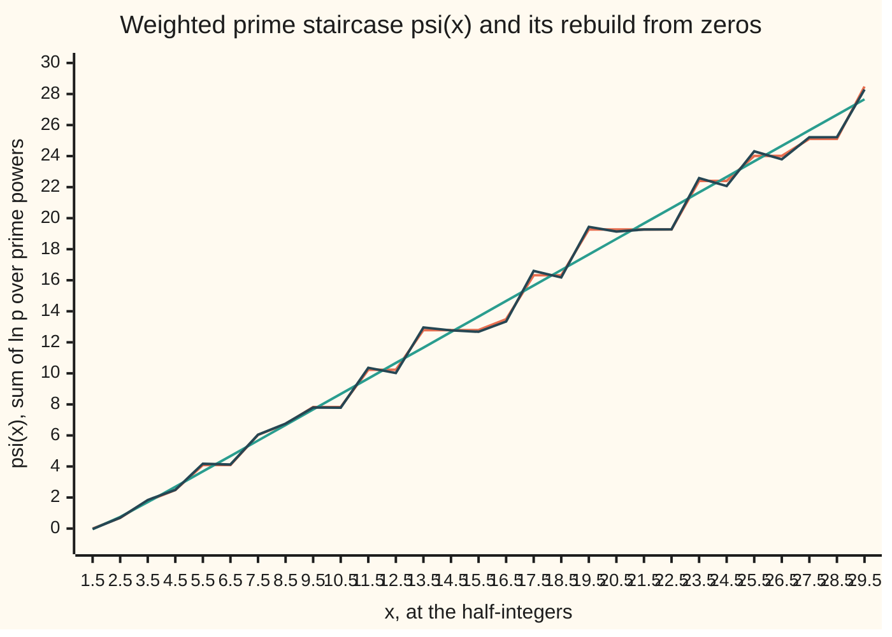
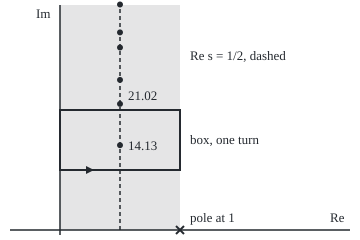

# Zeta's zeros and the primes: the zeros are the frequencies hidden in the prime staircase, and the Riemann hypothesis says where they lie

[Syllabus](../../../SYLLABUS.md) → [Complex analysis](../../../SYLLABUS.md#w07) → [Special Functions and the Zeta Function](../../../SYLLABUS.md#w07-s09) → Zeta's zeros and the primes

---


## General Overview

Climb one step at every prime: 25 steps by 100, 78,498 by a million. This is the **prime staircase**. Its height at x is π(x), "pi of x", the number of primes up to x; here π names a count, not the circle constant.

[How primes thin out](../../02-Number%20theory/07-For%20the%20Curious/03-how-primes-thin-out.md) estimated it by x ÷ ln x: 21.71 at 100, 72,382.41 at a million, both low. It promised better: the **logarithmic integral** li(x), the area under 1/ln t from 0 to x, gives 30.13 and 78,627.55, only 129.55 off.

Why li works, and why its error is small, are questions about zeta on the whole plane ([Continuing zeta](08-continuing-zeta-and-the-functional-equation.md)). Its pole at 1 makes li. Its zeros make the error: each adds one wave to the staircase, like one note in a chord. The first zero sits at 0.500000 + 14.134725i.

**Zeta's logarithmic derivative counts prime powers; a contour integral turns that count into the prime staircase, written as a smooth main term plus one wave for each zero of zeta; the Riemann hypothesis puts every zero on the line of real part 1/2, which would hold the error to about √x.**

**What kind of fact this is:** a theorem (the explicit formula, and the prime number theorem after it), stated here with the shape of its proof and proved in wing 21; the Riemann hypothesis is a conjecture, unproved as of 2026-09-28.

### The picture: the staircase rebuilt from zeros



Orange: the staircase ψ(x), defined below. Green: the smooth part. Dark: plus the waves of the 29 zeros below height 100; largest miss 0.33, against 1.60.

---

## The formula

Notation first, in words. Λ(n), "big lambda of n", is ln p when n is a power of a prime p, else 0: Λ(8) = ln 2, Λ(6) = 0. Adding Λ(n) up to x gives ψ(x), "psi of x": the staircase with each step ln p tall, plus steps at prime powers. A zero of zeta off the real axis is ρ, "rho"; the sum over ρ takes zeros in mirror pairs, lowest first.

$$-\frac{\zeta'(s)}{\zeta(s)} = \sum_{n=1}^{\infty} \frac{\Lambda(n)}{n^{s}} \qquad (\operatorname{Re} s > 1)$$

**Read it aloud:** minus zeta's slope over zeta is a series with weight ln p on every prime power.

$$\psi(x) = x - \sum_{\rho} \frac{x^{\rho}}{\rho} - \ln 2\pi - \tfrac12 \ln\!\left(1 - x^{-2}\right)$$

**Read it aloud:** the weighted staircase is x, minus one term per zero of zeta, minus two small corrections.

This is the **explicit formula**, for x above 1 and not a prime power. Then:

$$\pi(x) \sim \operatorname{li}(x) = \int_0^x \frac{dt}{\ln t}, \qquad \text{RH: every } \rho \text{ has } \operatorname{Re}\rho = \tfrac12$$

**Read it aloud:** π(x) divided by li(x) tends to 1 (1/ln t blows up at t = 1; li takes the area the same distance either side and lets the two cancel); the Riemann hypothesis says every zero in the strip lies on the line Re s = 1/2.

| Symbol | Plain meaning | In our example | Push it up and the answer… |
| --- | --- | --- | --- |
| $s$ | zeta's complex input | 2 | terms shrink faster |
| $\zeta$, $\zeta'$ | zeta, and its derivative | −ζ′/ζ(2) = 0.56996 | — |
| $\Lambda(n)$ | ln p at powers of a prime p, else 0 | Λ(8) = ln 2 | — |
| $x$, $n$, $p$ | count limit; whole number; prime | 10^6 | bigger waves |
| $\psi(x)$ | sum of Λ(n) up to x | ψ(29.5) = 28.48 | close to x |
| $\pi(x)$ | primes up to x (bare π: the circle constant) | 78,498 | — |
| $\operatorname{li}(x)$ | area under 1/ln t, 0 to x | 78,627.55 | outgrows x ÷ ln x |
| $\rho$, $t$ | a zero in the strip; its height | t = 14.134725 | faster, smaller wave |

### When it holds

- **The series needs Re s > 1.** Left of that line −ζ′/ζ is the continued function, not the sum.
- **Zeros summed in pairs, lowest first.** Otherwise the sum need not settle; cut short, it rings near steps.
- **x not a prime power.** There ψ jumps and the formula gives the midpoint; the chart uses half-integers.
- **No zero on Re s = 1, for the prime number theorem.** A zero at 1 + it would add a wave as large as x.
- **The Riemann hypothesis is unproved.** What it would buy, below, is conditional.

---

## Why it works

### Step 0: primes are built into zeta, so zeta's zeros are built into the primes

Euler's product writes ζ(s) as a product over primes ([The zeta function](05-zeta-function-and-euler-product.md)). A logarithm makes it a sum; a contour integral makes the sum a count; moving the contour collects the pole and every zero.

### Step 1: the logarithmic derivative is a prime-power series

ζ(s) is the product of 1/(1 − p^(−s)) over primes p, so ln ζ(s) is the sum over p and k of p^(−ks)/k. Differentiating turns each term into −ln p times p^(−ks): weight ln p at n = p^k.

At s = 2 the prime-power sum gives 0.56996, and zeta's measured slope gives 0.56996. Primes alone give 0.49309.

### Step 2: a contour integral turns a series into a running total

Up a vertical line right of 0, the integral of y^s/s over 2πi is 1 when y > 1 and 0 when y < 1: a switch. With y = x/n it keeps the terms with n below x:

$$\psi(x) = \frac{1}{2\pi i}\int_{c - i\infty}^{c + i\infty} \left(-\frac{\zeta'(s)}{\zeta(s)}\right) \frac{x^{s}}{s}\, ds, \qquad c > 1.$$

This is the inversion of [The Mellin transform](07-mellin-transform.md) applied to a Dirichlet series ([Dirichlet series](06-dirichlet-series-and-mobius-inversion.md)).

### Step 3: slide the line left and collect residues

By [The argument principle](../06-Real%20Integrals%20and%20Counting%20Zeros/06-the-argument-principle.md), −ζ′/ζ has residue (coefficient of 1/(s − a)) +1 at zeta's pole and −1 at each simple zero. Slide the line far left, collecting: x at s = 1; −x^ρ/ρ at each zero ρ; −ln 2π at s = 0; and −½ ln(1 − x^(−2)) from the trivial zeros. That is the explicit formula.

<details>
<summary>Detailed proof: why the line may be moved</summary>

Cut the line at heights ±T away from zeros; close it into a rectangle with left side Re s = −U, and apply the residue theorem. On the top and bottom |ζ′/ζ| is at most a multiple of (ln T)^2, so they contribute at most a multiple of x (ln T)^2/T. On the left, ζ′/ζ grows like ln |s| while x^s shrinks like x^(−U). The cut line differs from ψ(x) by at most a multiple of x (ln x)^2/T. Let T and U grow. Full estimates: The explicit formula.

</details>

### Step 4: each pair of zeros is one wave

Zeros on the line pair as 1/2 + it and 1/2 − it. Their terms add to 2√x/|ρ| times cos(t ln x − arg ρ): a wave in ln x of frequency t and amplitude like √x. The first frequencies are 14.135, 21.022, 25.011, 30.425, 32.935, 37.586.

At 13.5 and 14.5 the staircase reads 12.79 twice; 29 pairs rebuild it as 12.96 and 12.77, the smooth part alone as 13.66 and 14.66. The zeros are the staircase's spectrum.

### Step 5: from ψ(x) to π(x) and li(x)

ψ(x) is close to x, so primes near t, each weighing ln t, come one in every ln t numbers. Adding that density up to x gives li(x), by summation by parts (the discrete form of integration by parts). π(x)/li(x) tends to 1 when ψ(x)/x does, which needs no zero on Re s = 1, proved in 1896 by Hadamard and de la Vallée Poussin: The zero-free region, then The prime number theorem.

li beats x ÷ ln x because it charges each stretch its own density, not the thinnest. Series and direct integration both give 30.13 and 78,627.55.

### Step 6: where the zeros are

The Euler product has no zero for Re s > 1; the mirror carries that to Re s < 0, bar the trivial zeros. The rest lie in the **critical strip**, 0 ≤ Re s ≤ 1, symmetric about the **critical line** Re s = 1/2.

The first zero, two ways. Round the box 0 ≤ Re s ≤ 1, 10 ≤ Im s ≤ 20, walked anticlockwise, zeta's value turns 1.000000 times round 0: one zero inside. The same walk, each step weighted by its point s, puts it at 0.500000 + 14.134725i. A secant chase (a root finder following the line through its last two guesses) from 0.6 + 14i lands on the same point, the published 14.134725142 to eight places.

<p align="center"></p>

Scale: 120 units per 1 across, 6 per 1 up, origin (60, 230). Dots: the first six zeros, y 145.2, 103.9, 79.9, 47.5, 32.4, 4.5 on x 120.

### Step 7: the Riemann hypothesis, and what it would buy

Riemann wrote in 1859 that all zeros in the strip very probably lie on the critical line. The check finds 29 up to height 100, all at real part 0.50000; machine searches reach height 3 × 10^12.

A zero at β + it with β above 1/2 would add a wave of size x^β. With every zero on the line, Schoenfeld proved in 1976 that for x at least 2657

$$|\pi(x) - \operatorname{li}(x)| < \frac{\sqrt{x}\,\ln x}{8\pi}.$$

At a million the bound is 549.70; the true gap is 129.55. Von Koch showed in 1901 that such a bound implies the hypothesis back (The Riemann hypothesis).

---

## Worked numbers, by hand

| Step | Arithmetic | Value |
| --- | --- | --- |
| staircase at 100 | count 2, 3, 5, …, 97 | 25 |
| logarithmic integral | area under 1/ln t up to 100 | 30.13 |
| staircase at a million | sieve by primes up to √x | 78,498 |
| first guess | 10^6 ÷ ln 10^6 | 72,382.41 |
| logarithmic integral | area under 1/ln t up to 10^6 | 78,627.55 |
| the gap | 78,498 − 78,627.55 | **−129.55** |
| RH bound | 1000 × ln 10^6 ÷ 8π | **549.70** |

The gap sits well inside the bound.

### What breaks if you drop a piece

| Mistake | Comes out at | What went wrong |
| --- | --- | --- |
| Primes only in −ζ′/ζ(2) | 0.49309, not 0.56996 | Λ weighs p^2, p^3, … too |
| No zeros in the explicit formula | misses by 1.60 | the zeros make the steps |
| x ÷ ln x at 10^6 | 72,382.41, not 78,498 | the thinnest density everywhere |
| log base 10 at 10^6 | 166,667 | the density is 1 in ln x |

The code prints all four.

---

## Code, from first principles, and it actually runs

Four pairs of roads: primes by a sieve and by Legendre's inclusion–exclusion count; li by series and by integral; −ζ′/ζ(2) by prime powers and by zeta's slope; the first zero by a chase and by a box. Zeta is the Euler–Maclaurin sum of the previous card. Every dip of |ζ| on the line below height 100 is chased to a zero, and those zeros rebuild the staircase.

### Python

```python
# Zeta's zeros and the primes -- the check behind the card.  Standard library only.  Primes by a
# sieve and by Legendre; li by series and by integral; the first zero by a chase and by a box.
import math, functools
X = 10**6
flag = bytearray([1]) * (X + 1); flag[0] = flag[1] = 0
for p in range(2, 1001):
    if flag[p]: flag[p * p::p] = bytearray(len(range(p * p, X + 1, p)))
primes = [p for p in range(X + 1) if flag[p]]
@functools.lru_cache(None)
def phi(x, a):                       # numbers up to x with none of the first a primes as a factor
    return x if a == 0 or x == 0 else phi(x, a - 1) - phi(x // primes[a - 1], a - 1)
powers = [(p, p ** k) for p in primes for k in range(1, 20) if p ** k <= X]   # (p, p^k)
psi = lambda x: sum(math.log(p) for p, q in powers if q <= x)                 # ln p per power
lam = sum(math.log(p) / q ** 2 for p, q in powers)                            # -zeta'/zeta(2), cut at 10^6
gam = sum(1 / k for k in range(1, 1001)) - math.log(1000) - 1 / 2000 + 1 / 12e6  # Euler's constant
li_series = lambda y: gam + math.log(y) + sum(y ** k / (k * math.factorial(k)) for k in range(1, 150))
mid = lambda f, a, b, n=40000: (b - a) / n * sum(f(a + (k + 0.5) * (b - a) / n) for k in range(n))
li_integral = lambda y: mid(lambda u: 2 * math.sinh(u) / u, 0, y) - mid(lambda u: math.exp(-u) / u, y, y + 60)
def zeta(s, N=50):                   # head sum + tail integral + end corrections (Euler-Maclaurin)
    r = lambda m: math.prod(s + j for j in range(m)) * N ** (-s - m)
    return (sum(n ** -s for n in range(1, N)) + N ** (1 - s) / (s - 1) + N ** -s / 2
            + r(1) / 12 - r(3) / 720 + r(5) / 30240)
def secant(a, b):                    # chase a zero of zeta through the complex plane
    for _ in range(60):
        if abs(zeta(b)) > 1e-12: a, b = b, b - zeta(b) * (b - a) / (zeta(b) - zeta(a))
    return b
M, c = 2000, [10j, 1 + 10j, 1 + 20j, 20j, 10j]         # the box 0 < Re s < 1, 10 < Im s < 20
box = [a + (b - a) * k / M for a, b in zip(c, c[1:]) for k in range(M)] + [10j]
q = [zeta(w) / zeta(v) for v, w in zip(box, box[1:])]  # step-by-step ratios of zeta round the box
dlog = [complex(math.log(abs(u)), math.atan2(u.imag, u.real)) for u in q]
count, where = sum(dlog) / (2j * math.pi), sum((a + b) / 2 * d for a, b, d in zip(box, box[1:], dlog)) / (2j * math.pi)
z1, slope = secant(0.6 + 14j, 0.6 + 14.3j), -(zeta(2.00001) - zeta(1.99999)) / 2e-5 / zeta(2)
ts, zeros = [k / 10 for k in range(1, 1001)], []; mod = [abs(zeta(0.5 + 1j * t)) for t in ts]
for k in range(1, 999):              # every dip of |zeta| on the line, chased to a zero
    z = secant(0.5 + 1j * ts[k], 0.5 + 1j * ts[k] + 0.05j) if mod[k] <= min(mod[k - 1], mod[k + 1]) else None
    if z and z.imag > 1 and all(abs(z - w) > 1e-6 for w in zeros): zeros.append(z)
rebuild = lambda x, K: x - math.log(2 * math.pi) - math.log(1 - x ** -2) / 2 - 2 * sum((x ** r / r).real for r in zeros[:K])
xs, row = [k + 0.5 for k in range(1, 30)], lambda v: ", ".join(f"{u:.2f}" for u in v)
for x, a in ((100, 4), (1000, 11), (10**6, 168)):   # a = number of primes up to sqrt(x)
    pi, y = sum(1 for p in primes if p <= x), math.log(x)
    print(f"x = {x}: pi sieve {pi}, Legendre {phi(x, a) + a - 1}; x/ln x {x / y:.2f}; "
          f"li series {li_series(y):.2f}, integral {li_integral(y):.2f}; pi - li {pi - li_series(y):.2f}")
print(f"RH bound at 10^6, valid from x = 2657: sqrt(x) ln x / (8 pi) = {1000 * math.log(X) / (8 * math.pi):.2f}")
print(f"-zeta'/zeta(2): prime powers to 10^6 {lam:.5f}; slope of zeta {slope:.5f}; "
      f"primes only {sum(math.log(p) / p ** 2 for p in primes):.5f}")
print(f"first zero, chased from 0.6 + 14i: {z1.real:.6f} + {z1.imag:.6f}i")
print(f"box 0..1 x 10..20: turns {count.real:.6f}; zero located {where.real:.6f} + {where.imag:.6f}i")
print(f"zeros up to height 100: {len(zeros)}, real parts {min(z.real for z in zeros):.5f} to {max(z.real for z in zeros):.5f}; "
      "heights " + " ".join(f"{z.imag:.3f}" for z in zeros[:6]) + " ...")
print("chart at x = 1.5, 2.5, ..., 29.5, psi: " + row(map(psi, xs)))
print("chart no zeros: " + row(rebuild(x, 0) for x in xs))
print(f"chart {len(zeros)} zero pairs: " + row(rebuild(x, 29) for x in xs))
print(f"largest miss at the half-integers: no zeros {max(abs(psi(x) - rebuild(x, 0)) for x in xs):.2f}, "
      f"29 pairs {(err := max(abs(psi(x) - rebuild(x, 29)) for x in xs)):.2f}; log base 10 at 10^6: {X / 6:.0f}")
print("figure, x = 60 + 120 Re s, y = 230 - 6 Im s: line x 120; heights y " + " ".join(f"{230 - 6 * z.imag:.1f}" for z in zeros[:6]))
assert sum(1 for p in primes if p <= X) == phi(X, 168) + 167 == 78498   # two counts, one number
assert abs(li_series(math.log(X)) - li_integral(math.log(X))) < 1e-3   # two roads to li
assert abs(z1 - where) < 1e-6 and abs(z1 - (0.5 + 14.134725142j)) < 1e-8 and abs(count - 1) < 1e-9  # chase, box, table
assert abs(lam - slope) < 1e-5 and err < 0.5                           # series vs slope; rebuild
print("ALL CHECKS PASS")
```

**Ran 2026-09-28 on macOS, Python 3.14.6, standard library only. All checks passed. Output, pasted from the run:**

```
x = 100: pi sieve 25, Legendre 25; x/ln x 21.71; li series 30.13, integral 30.13; pi - li -5.13
x = 1000: pi sieve 168, Legendre 168; x/ln x 144.76; li series 177.61, integral 177.61; pi - li -9.61
x = 1000000: pi sieve 78498, Legendre 78498; x/ln x 72382.41; li series 78627.55, integral 78627.55; pi - li -129.55
RH bound at 10^6, valid from x = 2657: sqrt(x) ln x / (8 pi) = 549.70
-zeta'/zeta(2): prime powers to 10^6 0.56996; slope of zeta 0.56996; primes only 0.49309
first zero, chased from 0.6 + 14i: 0.500000 + 14.134725i
box 0..1 x 10..20: turns 1.000000; zero located 0.500000 + 14.134725i
zeros up to height 100: 29, real parts 0.50000 to 0.50000; heights 14.135 21.022 25.011 30.425 32.935 37.586 ...
chart at x = 1.5, 2.5, ..., 29.5, psi: 0.00, 0.69, 1.79, 2.48, 4.09, 4.09, 6.04, 6.73, 7.83, 7.83, 10.23, 10.23, 12.79, 12.79, 12.79, 13.49, 16.32, 16.32, 19.27, 19.27, 19.27, 19.27, 22.40, 22.40, 24.01, 24.01, 25.11, 25.11, 28.48
chart no zeros: -0.04, 0.75, 1.70, 2.69, 3.68, 4.67, 5.67, 6.67, 7.67, 8.67, 9.67, 10.67, 11.66, 12.66, 13.66, 14.66, 15.66, 16.66, 17.66, 18.66, 19.66, 20.66, 21.66, 22.66, 23.66, 24.66, 25.66, 26.66, 27.66
chart 29 zero pairs: -0.03, 0.70, 1.84, 2.49, 4.18, 4.13, 6.05, 6.76, 7.80, 7.79, 10.36, 10.02, 12.96, 12.77, 12.68, 13.34, 16.60, 16.18, 19.44, 19.14, 19.27, 19.28, 22.58, 22.07, 24.31, 23.79, 25.21, 25.22, 28.29
largest miss at the half-integers: no zeros 1.60, 29 pairs 0.33; log base 10 at 10^6: 166667
figure, x = 60 + 120 Re s, y = 230 - 6 Im s: line x 120; heights y 145.2 103.9 79.9 47.5 32.4 4.5
ALL CHECKS PASS
```

### Rust

Same numbers, same labels, built with `rustc --edition 2021 -O`.

```rust
// Zeta's zeros and the primes -- the same check as the Python, in Rust.  No crates.  Primes by a
// sieve and by Legendre; li by series and by integral; the first zero by a chase and by a box.
use std::collections::HashMap;
use std::f64::consts::PI;
#[derive(Clone, Copy)]
struct C { re: f64, im: f64 }
fn c(re: f64, im: f64) -> C { C { re, im } }
fn add(a: C, b: C) -> C { c(a.re + b.re, a.im + b.im) }  fn sub(a: C, b: C) -> C { c(a.re - b.re, a.im - b.im) }
fn mul(a: C, b: C) -> C { c(a.re * b.re - a.im * b.im, a.re * b.im + a.im * b.re) }
fn div(a: C, b: C) -> C { let d = b.re * b.re + b.im * b.im; c((a.re * b.re + a.im * b.im) / d, (a.im * b.re - a.re * b.im) / d) }
fn sc(k: f64, a: C) -> C { c(k * a.re, k * a.im) }  fn md(a: C) -> f64 { a.re.hypot(a.im) }
fn pw(x: f64, s: C) -> C { let (m, t) = ((s.re * x.ln()).exp(), s.im * x.ln()); c(m * t.cos(), m * t.sin()) } // x^s
fn phi(x: u64, a: usize, pr: &[u64], memo: &mut HashMap<(u64, usize), i64>) -> i64 { // none of the first a primes
    if a == 0 || x == 0 { return x as i64 } if let Some(&v) = memo.get(&(x, a)) { return v }
    let v = phi(x, a - 1, pr, memo) - phi(x / pr[a - 1], a - 1, pr, memo); memo.insert((x, a), v); v
}
fn zeta(s: C) -> C { // head sum + tail integral + end corrections (Euler-Maclaurin)
    let r = |m: usize| mul((0..m).fold(c(1.0, 0.0), |p, j| mul(p, add(s, c(j as f64, 0.0)))), pw(50.0, sub(c(-(m as f64), 0.0), s)));
    let z = (1..50).fold(c(0.0, 0.0), |z, k| add(z, pw(k as f64, sc(-1.0, s))));
    let z = add(add(z, div(pw(50.0, sub(c(1.0, 0.0), s)), sub(s, c(1.0, 0.0)))), sc(0.5, pw(50.0, sc(-1.0, s))));
    add(sub(add(z, sc(1.0 / 12.0, r(1))), sc(1.0 / 720.0, r(3))), sc(1.0 / 30240.0, r(5)))
}
fn secant(mut a: C, mut b: C) -> C { // chase a zero of zeta through the complex plane
    for _ in 0..60 { if md(zeta(b)) > 1e-12 { let nb = sub(b, div(mul(zeta(b), sub(b, a)), sub(zeta(b), zeta(a)))); a = b; b = nb; } } b
}
fn mid(f: &dyn Fn(f64) -> f64, a: f64, b: f64) -> f64 { let h = (b - a) / 40000.0; h * (0..40000).map(|k| f(a + (k as f64 + 0.5) * h)).sum::<f64>() }
fn row(v: &[f64]) -> String { v.iter().map(|u| format!("{:.2}", u)).collect::<Vec<_>>().join(", ") }
fn main() {
    let (big, mut memo) = (1_000_000usize, HashMap::new()); let mut flag = vec![true; big + 1]; flag[0] = false; flag[1] = false;
    for p in 2..1001 { if flag[p] { let mut m = p * p; while m <= big { flag[m] = false; m += p } } }
    let primes: Vec<u64> = (0..=big as u64).filter(|&p| flag[p as usize]).collect();
    let mut powers: Vec<(f64, f64)> = Vec::new(); // (p, p^k)
    for &p in &primes { let mut q = p; while q <= big as u64 { powers.push((p as f64, q as f64)); q *= p } }
    let psi = |x: f64| powers.iter().filter(|w| w.1 <= x).map(|w| w.0.ln()).sum::<f64>() + 0.0; // ln p per power
    let lam: f64 = powers.iter().map(|w| w.0.ln() / (w.1 * w.1)).sum(); // -zeta'/zeta(2), cut at 10^6
    let gam = (1..1001).map(|k| 1.0 / k as f64).sum::<f64>() - 1000f64.ln() - 1.0 / 2000.0 + 1.0 / 12e6;
    let li_series = |y: f64| { let (mut t, mut s) = (1.0, 0.0); for k in 1..150 { t *= y / k as f64; s += t / k as f64 } gam + y.ln() + s };
    let li_integral = |y: f64| mid(&|u: f64| 2.0 * u.sinh() / u, 0.0, y) - mid(&|u: f64| (-u).exp() / u, y, y + 60.0);
    let cs = [c(0.0, 10.0), c(1.0, 10.0), c(1.0, 20.0), c(0.0, 20.0), c(0.0, 10.0)]; // the box
    let bx: Vec<C> = cs.windows(2).flat_map(|w| (0..2000).map(move |k| add(w[0], sc(k as f64 / 2000.0, sub(w[1], w[0]))))).chain([cs[0]]).collect();
    let (mut count, mut wh) = (c(0.0, 0.0), c(0.0, 0.0));
    for w in bx.windows(2) { // step-by-step ratios of zeta round the box
        let u = div(zeta(w[1]), zeta(w[0])); let d = c(md(u).ln(), u.im.atan2(u.re)); count = add(count, d); wh = add(wh, mul(sc(0.5, add(w[0], w[1])), d));
    }
    let (count, wh) = (div(count, c(0.0, 2.0 * PI)), div(wh, c(0.0, 2.0 * PI)));
    let z1 = secant(c(0.6, 14.0), c(0.6, 14.3));
    let slope = -(zeta(c(2.00001, 0.0)).re - zeta(c(1.99999, 0.0)).re) / 2e-5 / zeta(c(2.0, 0.0)).re;
    let mo: Vec<f64> = (0..1001).map(|k| md(zeta(c(0.5, k as f64 / 10.0)))).collect(); // mo[k] at t = k/10
    let mut zeros: Vec<C> = Vec::new();
    for k in 2..1000 { // every dip of |zeta| on the line, chased to a zero
        if mo[k] > mo[k - 1].min(mo[k + 1]) { continue }
        let z = secant(c(0.5, k as f64 / 10.0), c(0.5, k as f64 / 10.0 + 0.05));
        if z.im > 1.0 && zeros.iter().all(|&w| md(sub(z, w)) > 1e-6) { zeros.push(z) }
    }
    let rebuild = |x: f64, kk: usize| x - (2.0 * PI).ln() - (1.0 - x.powi(-2)).ln() / 2.0 - 2.0 * zeros[..kk].iter().map(|&r| div(pw(x, r), r).re).sum::<f64>();
    let xs: Vec<f64> = (1..30).map(|k| k as f64 + 0.5).collect();
    for (x, a) in [(100u64, 4usize), (1000, 11), (1_000_000, 168)] { // a = number of primes up to sqrt(x)
        let (pi, y) = (primes.iter().filter(|&&p| p <= x).count(), (x as f64).ln());
        println!("x = {}: pi sieve {}, Legendre {}; x/ln x {:.2}; li series {:.2}, integral {:.2}; pi - li {:.2}", x, pi,
            phi(x, a, &primes, &mut memo) + a as i64 - 1, x as f64 / y, li_series(y), li_integral(y), pi as f64 - li_series(y));
    }
    println!("RH bound at 10^6, valid from x = 2657: sqrt(x) ln x / (8 pi) = {:.2}", 1000.0 * 1e6f64.ln() / (8.0 * PI));
    let only: f64 = primes.iter().map(|&p| (p as f64).ln() / (p * p) as f64).sum();
    println!("-zeta'/zeta(2): prime powers to 10^6 {:.5}; slope of zeta {:.5}; primes only {:.5}", lam, slope, only);
    println!("first zero, chased from 0.6 + 14i: {:.6} + {:.6}i\nbox 0..1 x 10..20: turns {:.6}; zero located {:.6} + {:.6}i", z1.re, z1.im, count.re, wh.re, wh.im);
    let ((lo, hi), hs): ((f64, f64), Vec<String>) = (zeros.iter().fold((9.0, 0.0), |(l, h), z| (l.min(z.re), h.max(z.re))), zeros[..6].iter().map(|z| format!("{:.3}", z.im)).collect());
    println!("zeros up to height 100: {}, real parts {:.5} to {:.5}; heights {} ...", zeros.len(), lo, hi, hs.join(" "));
    let (p0, r0, r29): (Vec<f64>, Vec<f64>, Vec<f64>) = (xs.iter().map(|&x| psi(x)).collect(), xs.iter().map(|&x| rebuild(x, 0)).collect(), xs.iter().map(|&x| rebuild(x, 29)).collect());
    println!("chart at x = 1.5, 2.5, ..., 29.5, psi: {}\nchart no zeros: {}\nchart {} zero pairs: {}", row(&p0), row(&r0), zeros.len(), row(&r29));
    let miss = |r: &[f64]| p0.iter().zip(r).map(|(a, b)| (a - b).abs()).fold(0.0, f64::max);
    let err = miss(&r29);
    println!("largest miss at the half-integers: no zeros {:.2}, 29 pairs {:.2}; log base 10 at 10^6: {:.0}", miss(&r0), err, 1e6 / 6.0);
    println!("figure, x = 60 + 120 Re s, y = 230 - 6 Im s: line x 120; heights y {}", zeros[..6].iter().map(|z| format!("{:.1}", 230.0 - 6.0 * z.im)).collect::<Vec<_>>().join(" "));
    assert!(primes.len() == 78498 && phi(1_000_000, 168, &primes, &mut memo) + 167 == 78498); // two counts, one number
    assert!((li_series(1e6f64.ln()) - li_integral(1e6f64.ln())).abs() < 1e-3); // two roads to li
    assert!(md(sub(z1, wh)) < 1e-6 && md(sub(z1, c(0.5, 14.134725142))) < 1e-8 && md(sub(count, c(1.0, 0.0))) < 1e-9); // chase, box, table
    assert!((lam - slope).abs() < 1e-5 && err < 0.5); // series vs slope; rebuild
    println!("ALL CHECKS PASS");
}
```

**Ran 2026-09-28 on macOS, rustc 1.98.1, no crates. All checks passed. Output, pasted from the run:**

```
x = 100: pi sieve 25, Legendre 25; x/ln x 21.71; li series 30.13, integral 30.13; pi - li -5.13
x = 1000: pi sieve 168, Legendre 168; x/ln x 144.76; li series 177.61, integral 177.61; pi - li -9.61
x = 1000000: pi sieve 78498, Legendre 78498; x/ln x 72382.41; li series 78627.55, integral 78627.55; pi - li -129.55
RH bound at 10^6, valid from x = 2657: sqrt(x) ln x / (8 pi) = 549.70
-zeta'/zeta(2): prime powers to 10^6 0.56996; slope of zeta 0.56996; primes only 0.49309
first zero, chased from 0.6 + 14i: 0.500000 + 14.134725i
box 0..1 x 10..20: turns 1.000000; zero located 0.500000 + 14.134725i
zeros up to height 100: 29, real parts 0.50000 to 0.50000; heights 14.135 21.022 25.011 30.425 32.935 37.586 ...
chart at x = 1.5, 2.5, ..., 29.5, psi: 0.00, 0.69, 1.79, 2.48, 4.09, 4.09, 6.04, 6.73, 7.83, 7.83, 10.23, 10.23, 12.79, 12.79, 12.79, 13.49, 16.32, 16.32, 19.27, 19.27, 19.27, 19.27, 22.40, 22.40, 24.01, 24.01, 25.11, 25.11, 28.48
chart no zeros: -0.04, 0.75, 1.70, 2.69, 3.68, 4.67, 5.67, 6.67, 7.67, 8.67, 9.67, 10.67, 11.66, 12.66, 13.66, 14.66, 15.66, 16.66, 17.66, 18.66, 19.66, 20.66, 21.66, 22.66, 23.66, 24.66, 25.66, 26.66, 27.66
chart 29 zero pairs: -0.03, 0.70, 1.84, 2.49, 4.18, 4.13, 6.05, 6.76, 7.80, 7.79, 10.36, 10.02, 12.96, 12.77, 12.68, 13.34, 16.60, 16.18, 19.44, 19.14, 19.27, 19.28, 22.58, 22.07, 24.31, 23.79, 25.21, 25.22, 28.29
largest miss at the half-integers: no zeros 1.60, 29 pairs 0.33; log base 10 at 10^6: 166667
figure, x = 60 + 120 Re s, y = 230 - 6 Im s: line x 120; heights y 145.2 103.9 79.9 47.5 32.4 4.5
ALL CHECKS PASS
```

The two outputs match line for line.

> [!TIP]
> **Try changing**
> Guess first, then run it.
> - **Start the chase at `0.9 + 14j` and `0.9 + 14.3j`.** It still lands at 0.500000 + 14.134725i.
> - **Box top `30j` for `20j`, both places.** Three turns; the location reads the sum of three zeros. The third assert stops it.
> - **`rebuild(x, 3)` on the "largest miss" line.** The miss passes 0.5; the fourth assert stops it.
> - **`range(1, 2)` in `powers`.** The series gives 0.49309; the fourth assert stops it.

---

## The usual mistake

> [!warning]
> **Confusing the Riemann hypothesis with the prime number theorem.** The theorem, π(x)/li(x) tending to 1, needs only no zero on Re s = 1, and was proved in 1896. The hypothesis puts every zero on Re s = 1/2, buys an error of size √x ln x, and is open.
>
> - **Trivial zeros as evidence for the hypothesis.** The zeros at −2, −4, … come from the sine in the mirror formula and say nothing about the strip.
> - **A picture as proof.** 29 zeros on the line are evidence, not proof.

---

## Where you meet it in real life

- **Cryptography.** RSA key generators test random candidates for primality; one prime in ln x says how many tries a key takes.
- **Random matrices.** Gaps between zeta's zeros match gaps between eigenvalues of large random Hermitian matrices (equal to their own conjugate transpose): Montgomery and Dyson, 1972.

> **Say it back**
> The prime staircase π(x) is close to li(x): 78,498 against 78,627.55 at a million. Minus zeta's slope over zeta puts weight ln p on every prime power. A contour integral turns that into the weighted staircase ψ(x); sliding the contour collects x from the pole and a wave from each zero, its frequency the zero's height. The Riemann hypothesis puts every zero on Re s = 1/2, holding the error to about √x.

---

## What this builds on

- [Continuing zeta](08-continuing-zeta-and-the-functional-equation.md): zeta on the plane; the mirror confining zeros to the strip.
- [Dirichlet series](06-dirichlet-series-and-mobius-inversion.md): series of a(n)/n^s.
- [The argument principle](../06-Real%20Integrals%20and%20Counting%20Zeros/06-the-argument-principle.md): residues of f′/f; the box.
- [How primes thin out](../../02-Number%20theory/07-For%20the%20Curious/03-how-primes-thin-out.md): the staircase and li's promise.

## Where this goes next

- The zero-free region: no zero on Re s = 1.
- The prime number theorem: the theorem in full.
- The explicit formula: Step 3's estimates.
- The Riemann hypothesis: equivalent forms.

---

## Sources

Verified 2026-09-28: every link below resolves to the publisher's page.

- Riemann, Bernhard. "Über die Anzahl der Primzahlen unter einer gegebenen Grösse", 1859. [Manuscript and translation, Clay Mathematics Institute](https://www.claymath.org/collections/riemanns-1859-manuscript/). The formula and the hypothesis, first stated.
- Edwards, H. M. *Riemann's Zeta Function*. Dover. [Publisher page](https://store.doverpublications.com/products/9780486417400). The ψ(x) formula and von Koch's theorem.
- Schoenfeld, Lowell. "Sharper bounds for the Chebyshev functions θ(x) and ψ(x). II." *Mathematics of Computation* 30 (1976), 337–360. [DOI](https://doi.org/10.1090/S0025-5718-1976-0457374-X). The conditional bound √x ln x/(8π).
- Platt, David, and Tim Trudgian. "The Riemann hypothesis is true up to 3·10^12", 2021. [arXiv:2004.09765](https://arxiv.org/abs/2004.09765). Zeros checked on the line.
