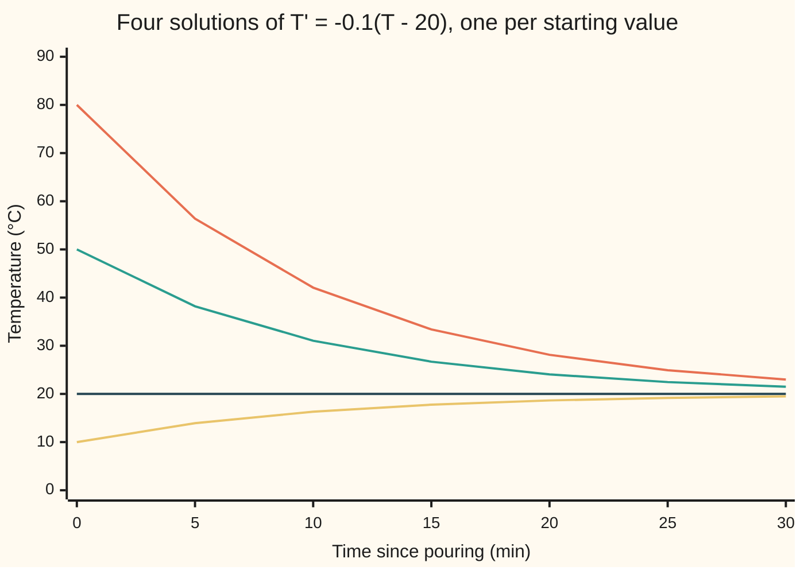

# A differential equation: a rule for the rate, and the starting value that picks one curve

[Syllabus](../../../SYLLABUS.md) → [Differential equations and dynamics](../../../SYLLABUS.md#w08) → [Rate Equations](../../../SYLLABUS.md#w08-s01) → A differential equation

---

## General Overview

A cup of coffee is poured at 80 °C into a room held at 20 °C. What it will read in ten minutes is not obvious. How fast it is cooling right now is: a hot cup loses heat faster than a warm one, and the loss stops at room temperature.

Newton's law of cooling makes that exact: the cup loses a tenth of its excess over the room every minute. At 80 °C the excess is 60 degrees, so it cools at 6 °C per minute; at 50 °C, at 3. The law hands over a rate for every temperature, never the temperature itself.

A rule of that shape is a **differential equation**: it ties an unknown quantity, here the temperature at each moment, to its own rate of change. The rule alone allows many histories, one per starting temperature. The pour at 80 °C picks one, which reaches 50 °C after 6.93 minutes.

**A differential equation says what the slope must be at every moment; a solution is a curve that obeys it everywhere; the starting value picks one curve out of the family.**

**What kind of fact this is:** a definition. That the family below holds every solution, and that one starting value picks one member, are theorems proved in Why it works. The cooling law is a model.

### The picture: one rule, four cups



From the top: the coffee poured at 80 °C (orange), a cup poured at 50 °C (green), a cup already at room temperature (dark blue, flat), and an iced drink at 10 °C warming up (yellow). All four obey the same rule. Only the starting value differs, and no two lines ever cross.

---

## The formula

Notation first, in words. A dash after a letter means its rate of change: $T'$, read "T prime", is the temperature's change in degrees per minute at time $t$. In general the unknown is called $y$ and the rule $f$. The shape $y' = f(t, y)$ is read "the rate of y at time t is f of t and y"; the starting value $y(t_0) = y_0$ says y has the given value at the starting time.

$$y' = f(t, y), \qquad y(t_0) = y_0$$

**Read it aloud:** at every moment the unknown changes at the rate the rule assigns, and it starts at the given value.

For the coffee, a tenth of the excess per minute, from 80 °C:

$$T' = -0.1\,(T - 20), \qquad T(0) = 80.$$

The proposed **general solution**, the family of every curve obeying the rule, is

$$T = 20 + C e^{-0.1 t}.$$

The starting value then forces $C = 60$, giving the **particular solution** $T = 20 + 60e^{-0.1t}$: the one curve for this cup.

| Symbol | Plain meaning | In our example | Push it up and the answer… |
| --- | --- | --- | --- |
| $t$ | time since pouring, min | 0 to 30 | nearer 20 °C |
| $T$, $T'$ | temperature (°C) and its rate (°C per min) | 80 and −6 at the pour | faster cooling |
| $0.1$ | cooling constant, per minute | a tenth of the excess | 50 °C comes sooner |
| $y$, $y'$, $f(t, y)$ | any unknown, its rate, the rule | $T$, $T'$, −0.1(T − 20) | — |
| $t_0$, $y_0$ | starting time and value | 0 min, 80 °C | another family member |
| $C$ | the family's free constant: starting excess over the room | 60 | the curve rises everywhere |
| $e$ | base of the natural exponential | $e^{-1}$ at 10 min | — |
| $h$ | water height in a leaking bucket, cm | 1 or 4 at the start | — |

The **order** is the highest rate that appears: the coffee's rule uses only the first rate, so it is first order; a car's shock absorber sets the acceleration, the rate of the rate, so it is second order. **Ordinary** means the unknown depends on time alone; heat spreading along a rod, with rates in time and in place, is a partial differential equation, met later in this wing.

### When it holds

The definition always applies. The two facts proved below for the coffee, a family holding every solution and one curve per starting value, hold for other rules only under conditions.

- **The rule is solved for the rate.** A rule that only fixes the square of the rate allows two slopes, so two curves leave each point.
- **The rule changes steadily with the unknown.** The cooling rule does. A leaking bucket with rate $h' = -\sqrt{h}$ does not near empty, and there an empty bucket at 4 s fits two histories. The condition that restores uniqueness is proved on [Picard iteration](../02-Existence%2C%20Uniqueness%20and%20Sensitivity/01-picard-iteration.md).
- **The solution lives long enough.** A rule growing faster than the unknown can send it to infinity in finite time. $y' = y^2$ from $y(0) = 1$ gives $y = 1/(1 - t)$, which ends at $t = 1$.
- **For the coffee, the model fits.** Newton's law assumes a steady room and a cup at one temperature throughout; a draught or a lid changes the constant.

---

## Why it works

### Step 0: the unknown is a whole curve, so it is checked by its slope

A differential equation is checked by putting a curve in, not a number. Compute the curve's slope at every moment and subtract what the rule demands. The difference is the **residual**. A solution has residual zero at every moment, not only at a few.

### Step 1: every member of the family passes

Take $T = 20 + Ce^{-0.1t}$ for some constant $C$. Its slope, by the rule for the exponential, is $-0.1\,Ce^{-0.1t}$. The rule demands $-0.1(T - 20) = -0.1\,Ce^{-0.1t}$. The two agree at every time and for every $C$. So the rule alone accepts a whole family, one curve per value of $C$: the four lines of the chart are four of them.

### Step 2: no curve outside the family passes

Suppose some curve $T$ obeys the rule. Multiply its excess, $T - 20$, by $e^{0.1t}$ to undo the shrinking. By the product rule the slope of that product is $e^{0.1t}\bigl(T' + 0.1(T - 20)\bigr)$, and the bracket is zero because $T$ obeys the rule. A quantity with zero slope everywhere does not change, so the product is a constant $C$, and $T = 20 + Ce^{-0.1t}$. That is why the family is called the general solution.

<details>
<summary>Detailed proof: every solution is in the family</summary>

Let $T$ be differentiable on an interval containing 0 and satisfy $T' = -0.1(T - 20)$ there. Write $P(t) = (T(t) - 20)e^{0.1t}$ for the product. By the product rule, $P'(t) = e^{0.1t}\bigl(T'(t) + 0.1(T(t) - 20)\bigr) = 0$ on the whole interval.

By the mean value theorem, for any two times a < b in the interval, $P(b) - P(a) = P'(c)(b - a)$ for some time c between them, and $P'(c) = 0$. So the product takes one value $C$ throughout, and $T = 20 + Ce^{-0.1t}$. No division by $T - 20$ was used, so the flat solution $C = 0$ is covered too.

</details>

### Step 3: the starting value picks one member

At the pour, $e^{0} = 1$, so the family gives $T(0) = 20 + C$. The cup reads 80, so $C = 60$. Step 2 says there is no other candidate, so the coffee's history is $T = 20 + 60e^{-0.1t}$. It reaches 50 °C when $60e^{-0.1t} = 30$, that is $e^{-0.1t} = 1/2$, at $t = 10\ln 2 = 6.93$ minutes.

### Step 4: the order counts the starting values

A first-order rule fixes the slope once the value is known, so one starting number fixes the curve. The shock absorber's second-order rule fixes the acceleration once position and speed are known; its family carries two free constants, so it needs two starting values.

A second road needs no formula: from 80 °C, take a small time step along the slope the rule gives, and repeat. This is Euler's rule, given its own card at [Euler's method](../05-Numerical%20Evolution/01-eulers-method.md). The code shows it closing in on the formula as the step shrinks.

---

## Worked numbers, by hand

| Step | Arithmetic | Value |
| --- | --- | --- |
| rate at the pour | −0.1 × (80 − 20) | −6.0 °C per minute |
| rate at 50 °C | −0.1 × (50 − 20) | −3.0 °C per minute |
| the family's constant | T(0) = 20 + C = 80 | C = 60 |
| after 10 minutes | 20 + 60 × e^(−1) | 42.07 °C |
| time to 50 °C | 60 × e^(−0.1t) = 30, so t = 10 × ln 2 | **6.93 minutes** |

The coffee is at a drinkable 50 °C just under seven minutes after the pour, and at 42.07 °C after ten.

### What breaks if you drop a piece

| Mistake | Comes out at | What went wrong |
| --- | --- | --- |
| Forget the room: T = 80e^(−0.1t) | 50 °C at 4.70 min; residual −2.000 °C/min at every time | The rule pulls towards 20 °C, not 0 °C |
| Lose the minus sign: T = 20 + 60e^(+0.1t) | 140.00 °C at 6.93 min; residual 12.000 at the pour | Fits the start, heats the coffee |
| Check the start only: the tangent line 80 − 6t | 50 °C at 5.00 min; residual −3.000 there | Right value and slope at the pour only |
| A rule that is not steady: the bucket h′ = −√h | Starts of 1 and 4 cm both read 0.00 cm at 4 s, but 0.25 and 2.25 cm at 1 s | Near empty the rate changes too fast; an empty reading fits two curves |

---

## Code, from first principles, and it actually runs

Two independent roads. Road one substitutes the family into the rule, measuring each curve's slope by a small centred difference. Road two is Euler's rule, which steps from 80 °C knowing only the rate law. They must agree on the temperature at ten minutes, the crossing of 50 °C and the constant 60, and the Euler error must shrink tenfold with the step. Every chart point and what-breaks row is printed.

### Python

```python
# A differential equation -- the check behind the card.  Standard library only.
# The coffee obeys T' = -0.1 (T - 20), T(0) = 80.  Road one: the family
# 20 + C e^(-0.1 t), tested by substitution.  Road two: Euler's rule.
import math

def rate(T):                                   # the rule, in degrees C per minute
    return -0.1 * (T - 20)

def family(C):                                 # one member of the proposed family
    return lambda t: 20 + C * math.exp(-0.1 * t)

def residual(curve, t, d=1e-4, rule=rate):     # the curve's own slope minus the rule
    return (curve(t + d) - curve(t - d)) / (2 * d) - rule(curve(t))

def euler(h, t_end):                           # step along the slope, nothing else
    T = 80.0
    for _ in range(round(t_end / h)):
        T += h * rate(T)
    return T

def euler_hit(h, target):                      # first time the steps reach target
    T, t = 80.0, 0.0
    while T + h * rate(T) > target:
        T, t = T + h * rate(T), t + h
    return t + h * (T - target) / (T - (T + h * rate(T)))

ts, Cs, hs = [0, 5, 10, 15, 20, 25, 30], [60, 30, 0, -10], (0.1, 0.01, 0.001)
C = 80 - 20                                    # T(0) = 20 + C forces C
exact10, exact_hit = family(C)(10), 10 * math.log(2)
worst = max(abs(residual(family(c), t)) for c in Cs for t in ts)
errs = [abs(euler(h, 10) - exact10) for h in hs]
hit = euler_hit(0.001, 50)
C_back = (euler(0.001, 10) - 20) * math.exp(1)
print(f"C = {C} from T(0) = 80; rate {rate(80):.1f} at 80 C and {rate(50):.1f} at 50 C; "
      f"T(10) = {exact10:.4f}; 50 C at t = {exact_hit:.4f}")
for c in Cs:
    print(f"chart, C = {c}: " + ", ".join(f"{family(c)(t):.2f}" for t in ts))
print(f"substitution, largest residual over 4 values of C, t = 0..30: {worst:.6f}")
for h, e in zip(hs, errs):
    print(f"euler, step {h} min: T(10) = {euler(h, 10):.4f}, error {e:.4f}")
print(f"euler, error ratio 0.01 vs 0.001: {errs[1] / errs[2]:.2f}")
print(f"euler, reaches 50 C at t = {hit:.3f}; C read back from T(10): {C_back:.2f}")
wrong1 = lambda t: 80 * math.exp(-0.1 * t)
wrong2 = lambda t: 20 + 60 * math.exp(0.1 * t)
line = lambda t: 80 - 6 * t
print(f"mistake, 80e^(-0.1t): residual {residual(wrong1, 0):.3f} at t = 0 and "
      f"{residual(wrong1, 10):.3f} at t = 10; 50 C at t = {10 * math.log(1.6):.2f}")
print(f"mistake, 20 + 60e^(+0.1t): residual {residual(wrong2, 0):.3f}; T(6.93) = {wrong2(exact_hit):.2f}")
print(f"mistake, tangent line 80 - 6t: 50 C at t = {30 / 6:.2f}; residual there {residual(line, 5):.3f}")
root = lambda h: -math.sqrt(max(h, 0.0))       # the leaking bucket, h' = -sqrt(h)
b1 = lambda t: (1 - t / 2) ** 2 if t < 2 else 0.0
b2 = lambda t: (2 - t / 2) ** 2 if t < 4 else 0.0
bw = max(abs(residual(b, t, rule=root)) for b in (b1, b2) for t in (0.5, 1.5, 2.5, 3.5, 4.5))
print(f"bucket, at t = 4 both read {b1(4):.2f} and {b2(4):.2f}; at t = 1 they read "
      f"{b1(1):.2f} and {b2(1):.2f}; largest residual {bw:.6f}")
assert worst < 1e-6 and abs(residual(wrong1, 10) + 2) < 1e-6   # family passes; mistake misses by 2
assert abs(euler(0.001, 10) - exact10) < 2e-3                  # the roads agree
assert 9 < errs[1] / errs[2] < 11                              # error shrinks with the step
assert abs(hit - exact_hit) < 0.01 and abs(C_back - 60) < 0.01  # same time, same C
print("ALL CHECKS PASS")
```

**Ran 2026-09-28 on macOS, Python 3.14.6, standard library only. All checks passed. Output, pasted from the run:**

```
C = 60 from T(0) = 80; rate -6.0 at 80 C and -3.0 at 50 C; T(10) = 42.0728; 50 C at t = 6.9315
chart, C = 60: 80.00, 56.39, 42.07, 33.39, 28.12, 24.93, 22.99
chart, C = 30: 50.00, 38.20, 31.04, 26.69, 24.06, 22.46, 21.49
chart, C = 0: 20.00, 20.00, 20.00, 20.00, 20.00, 20.00, 20.00
chart, C = -10: 10.00, 13.93, 16.32, 17.77, 18.65, 19.18, 19.50
substitution, largest residual over 4 values of C, t = 0..30: 0.000000
euler, step 0.1 min: T(10) = 41.9619, error 0.1108
euler, step 0.01 min: T(10) = 42.0617, error 0.0110
euler, step 0.001 min: T(10) = 42.0717, error 0.0011
euler, error ratio 0.01 vs 0.001: 10.00
euler, reaches 50 C at t = 6.931; C read back from T(10): 60.00
mistake, 80e^(-0.1t): residual -2.000 at t = 0 and -2.000 at t = 10; 50 C at t = 4.70
mistake, 20 + 60e^(+0.1t): residual 12.000; T(6.93) = 140.00
mistake, tangent line 80 - 6t: 50 C at t = 5.00; residual there -3.000
bucket, at t = 4 both read 0.00 and 0.00; at t = 1 they read 0.25 and 2.25; largest residual 0.000000
ALL CHECKS PASS
```

### Rust

Same numbers, same labels, built with `rustc --edition 2021 -O`.

```rust
// A differential equation -- the same check as the Python, in Rust, std only.
// The coffee obeys T' = -0.1 (T - 20) with T(0) = 80.  Road one: the family
// 20 + C e^(-0.1 t), tested by substitution.  Road two: Euler's rule.

fn rate(temp: f64) -> f64 { -0.1 * (temp - 20.0) }
fn root(h: f64) -> f64 { -(h.max(0.0)).sqrt() } // the leaking bucket, h' = -sqrt(h)
fn family(c: f64, t: f64) -> f64 { 20.0 + c * (-0.1 * t).exp() }

// the curve's own slope, by a centred difference, minus what the rule demands
fn residual(curve: &dyn Fn(f64) -> f64, t: f64, rule: fn(f64) -> f64) -> f64 {
    let d = 1e-4;
    (curve(t + d) - curve(t - d)) / (2.0 * d) - rule(curve(t))
}

fn euler(h: f64, t_end: f64) -> f64 {
    let mut temp = 80.0;
    for _ in 0..(t_end / h).round() as usize { temp += h * rate(temp); }
    temp
}

fn euler_hit(h: f64, target: f64) -> f64 {
    let (mut temp, mut t) = (80.0, 0.0);
    while temp + h * rate(temp) > target { temp += h * rate(temp); t += h; }
    t + h * (temp - target) / (temp - (temp + h * rate(temp)))
}

fn main() {
    let ts = [0.0, 5.0, 10.0, 15.0, 20.0, 25.0, 30.0];
    let cs = [60.0, 30.0, 0.0, -10.0];
    let c: f64 = 80.0 - 20.0; // T(0) = 20 + C forces C
    let (exact10, exact_hit) = (family(c, 10.0), 10.0 * 2f64.ln());
    let mut worst: f64 = 0.0;
    for &k in &cs { for &t in &ts { worst = worst.max(residual(&|s| family(k, s), t, rate).abs()); } }
    let hs = [0.1, 0.01, 0.001];
    let errs: Vec<f64> = hs.iter().map(|&h| (euler(h, 10.0) - exact10).abs()).collect();
    let hit = euler_hit(0.001, 50.0);
    let c_back = (euler(0.001, 10.0) - 20.0) * 1f64.exp();
    println!("C = {} from T(0) = 80; rate {:.1} at 80 C and {:.1} at 50 C; T(10) = {:.4}; 50 C at t = {:.4}",
        c, rate(80.0), rate(50.0), exact10, exact_hit);
    for &k in &cs {
        let pts: Vec<String> = ts.iter().map(|&t| format!("{:.2}", family(k, t))).collect();
        println!("chart, C = {}: {}", k, pts.join(", "));
    }
    println!("substitution, largest residual over 4 values of C, t = 0..30: {:.6}", worst);
    for (h, e) in hs.iter().zip(&errs) {
        println!("euler, step {} min: T(10) = {:.4}, error {:.4}", h, euler(*h, 10.0), e);
    }
    println!("euler, error ratio 0.01 vs 0.001: {:.2}", errs[1] / errs[2]);
    println!("euler, reaches 50 C at t = {:.3}; C read back from T(10): {:.2}", hit, c_back);
    let wrong1 = |t: f64| 80.0 * (-0.1 * t).exp();
    let wrong2 = |t: f64| 20.0 + 60.0 * (0.1 * t).exp();
    let line = |t: f64| 80.0 - 6.0 * t;
    println!("mistake, 80e^(-0.1t): residual {:.3} at t = 0 and {:.3} at t = 10; 50 C at t = {:.2}",
        residual(&wrong1, 0.0, rate), residual(&wrong1, 10.0, rate), 10.0 * 1.6f64.ln());
    println!("mistake, 20 + 60e^(+0.1t): residual {:.3}; T(6.93) = {:.2}",
        residual(&wrong2, 0.0, rate), wrong2(exact_hit));
    println!("mistake, tangent line 80 - 6t: 50 C at t = {:.2}; residual there {:.3}",
        30.0 / 6.0, residual(&line, 5.0, rate));
    let b1 = |t: f64| if t < 2.0 { (1.0 - t / 2.0).powi(2) } else { 0.0 };
    let b2 = |t: f64| if t < 4.0 { (2.0 - t / 2.0).powi(2) } else { 0.0 };
    let mut bw: f64 = 0.0;
    for b in [&b1 as &dyn Fn(f64) -> f64, &b2] {
        for t in [0.5, 1.5, 2.5, 3.5, 4.5] { bw = bw.max(residual(b, t, root).abs()); }
    }
    println!("bucket, at t = 4 both read {:.2} and {:.2}; at t = 1 they read {:.2} and {:.2}; largest residual {:.6}",
        b1(4.0), b2(4.0), b1(1.0), b2(1.0), bw);
    assert!(worst < 1e-6 && (residual(&wrong1, 10.0, rate) + 2.0).abs() < 1e-6); // family passes; mistake misses by 2
    assert!((euler(0.001, 10.0) - exact10).abs() < 2e-3); // the two roads agree
    assert!(errs[1] / errs[2] > 9.0 && errs[1] / errs[2] < 11.0); // error shrinks with the step
    assert!((hit - exact_hit).abs() < 0.01 && (c_back - 60.0).abs() < 0.01); // same time, same C
    println!("ALL CHECKS PASS");
}
```

**Ran 2026-09-28 on macOS, rustc 1.98.1, no crates. All checks passed. Output, pasted from the run:**

```
C = 60 from T(0) = 80; rate -6.0 at 80 C and -3.0 at 50 C; T(10) = 42.0728; 50 C at t = 6.9315
chart, C = 60: 80.00, 56.39, 42.07, 33.39, 28.12, 24.93, 22.99
chart, C = 30: 50.00, 38.20, 31.04, 26.69, 24.06, 22.46, 21.49
chart, C = 0: 20.00, 20.00, 20.00, 20.00, 20.00, 20.00, 20.00
chart, C = -10: 10.00, 13.93, 16.32, 17.77, 18.65, 19.18, 19.50
substitution, largest residual over 4 values of C, t = 0..30: 0.000000
euler, step 0.1 min: T(10) = 41.9619, error 0.1108
euler, step 0.01 min: T(10) = 42.0617, error 0.0110
euler, step 0.001 min: T(10) = 42.0717, error 0.0011
euler, error ratio 0.01 vs 0.001: 10.00
euler, reaches 50 C at t = 6.931; C read back from T(10): 60.00
mistake, 80e^(-0.1t): residual -2.000 at t = 0 and -2.000 at t = 10; 50 C at t = 4.70
mistake, 20 + 60e^(+0.1t): residual 12.000; T(6.93) = 140.00
mistake, tangent line 80 - 6t: 50 C at t = 5.00; residual there -3.000
bucket, at t = 4 both read 0.00 and 0.00; at t = 1 they read 0.25 and 2.25; largest residual 0.000000
ALL CHECKS PASS
```

> [!TIP]
> **Try changing**
> - **Start the coffee at 50 °C.** Guess $C$ first. It is 30, the second line on the chart; the rule did not change, only the member of the family.
> - **Set the cooling rule to −0.1(T − 25), a warmer room.** Guess whether the family still passes. It does not: the largest residual leaves zero, because the family was built for a 20 °C room.
> - **Add a step of 0.0001 to Euler's list.** Guess its error before running. About a tenth of the 0.001-step error: Euler's rule is first order, so the error falls in step with the step.

---

## The usual mistake

> [!warning]
> **Asking for "the" solution of the rule alone.** $T' = -0.1(T - 20)$ has a whole family of solutions; the chart shows four. Without the starting value the answer is a family, not a prediction.
>
> - **Checking one moment.** The tangent line 80 − 6t matches the value and the slope at the pour and still says 50 °C at 5.00 minutes, not 6.93. A solution must pass at every moment.
> - **Reading the order from the power.** The order is the highest rate present, not the highest power: a rule with the rate squared is still first order.
> - **Mixing clocks.** The 0.1 is per minute. With time in seconds the same cup has a constant sixty times smaller.

---

## Where you meet it in real life

- **Mechanics.** Newton's second law is a second-order differential equation: force sets the acceleration, and position and speed at the start pick the path (Newton's laws).
- **Medicine and chemistry.** A drug cleared from the blood at a rate proportional to the amount present obeys the same first-order rule; linked compartments are [Mixing tanks](06-mixing-tanks-and-compartments.md).
- **Weather and engineering software.** Most rules have no formula for their family, so programs step them forward as road two does ([Euler's method](../05-Numerical%20Evolution/01-eulers-method.md)).

> **Say it back**
> A differential equation gives an unknown's rate at every moment. A solution is a curve whose slope matches the rule everywhere, checked by substitution. The rule alone allows a family, such as 20 + Ce^(−0.1t) for the coffee. A starting value picks one member: 80 °C forces C = 60, and the cup reaches 50 °C after 6.93 minutes. The order, the highest rate present, says how many starting values that takes.

---

## What this builds on

- [The derivative](../../06-Calculus%20and%20analysis/02-Derivatives/01-the-derivative.md): the slope of a curve as an instantaneous rate, which the rule prescribes.
- [Derivatives of exp and log](../../06-Calculus%20and%20analysis/02-Derivatives/05-derivatives-of-exp-and-log.md): the slope of $e^{-0.1t}$, used in the substitution, and ln 2 for the crossing time.

## Where this goes next

- [Slope fields and the phase line](02-slope-fields-and-the-phase-line.md): the rule drawn as a slope at every point, before any solving.
- [Separable equations](03-separable-equations.md): finding the family instead of guessing it.
- [Picard iteration](../02-Existence%2C%20Uniqueness%20and%20Sensitivity/01-picard-iteration.md): when one starting value picks exactly one curve, and why the bucket fails.
- [Superposition](../03-Oscillators%20-%20Second-Order%20Linear%20Equations/01-superposition-and-the-shape-of-linear-solutions.md): second-order families with two free constants.
- [Euler's method](../05-Numerical%20Evolution/01-eulers-method.md): road two made precise, with its error.
- [Stochastic differential equations](../../11-Stochastic%20processes%20and%20calculus/06-Ito%20Calculus/04-stochastic-differential-equations.md): the same rules with random noise added.
- [Nondimensionalisation](../../13-Engineering%20mathematics/01-Units%20and%20Modelling/03-scaling-and-nondimensionalisation.md): rescaling time and temperature so the constant disappears.
- Newton's laws: the second-order equation of motion.

---

## Sources

Verified 28 Sep 2026: every link below resolves to the publisher's or the author's own page.

- Lebl, Jiří. *Notes on Diffy Qs: Differential Equations for Engineers*, §0.2 "Introduction to differential equations". [Author's free edition](https://www.jirka.org/diffyqs/html/introde_section.html). Substituting a proposed solution; general and particular solutions.
- Boyce, William E., Richard C. DiPrima and Douglas B. Meade. *Elementary Differential Equations and Boundary Value Problems*, 12th ed. Wiley. [Publisher page](https://www.wiley.com/en-us/Elementary+Differential+Equations+and+Boundary+Value+Problems%2C+12th+Edition-p-9781119777694). Chapter 1: rate models and the initial value problem.
- Teschl, Gerald. *Ordinary Differential Equations and Dynamical Systems*. American Mathematical Society. [Author's page for the book](https://www.mat.univie.ac.at/~gerald/ftp/book-ode/). The initial value problem with its hypotheses: existence, uniqueness, extensibility.
