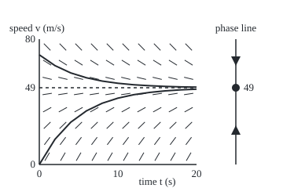

# Slope fields and the phase line: sketch every solution without solving anything

[Syllabus](../../../SYLLABUS.md) → [Differential equations and dynamics](../../../SYLLABUS.md#w08) → [Rate Equations](../../../SYLLABUS.md#w08-s01) → Slope fields and the phase line

---

## General Overview

A skydiver leaves the plane. Gravity adds 9.8 m/s of speed every second. Air pushes back, and in this model each 1 m/s of speed costs 0.2 m/s per second. At the door the diver gains 9.8 m/s each second. At 70 m/s drag takes 14 and gravity adds 9.8: a loss of 4.2 m/s each second.

At 49 m/s the two cancel: 0.2 × 49 = 9.8. Below 49 the diver speeds up; above, slows down. Every diver is pushed toward 49 m/s, whatever the start. That is terminal velocity, found without solving anything.

Two drawings make this routine. A **slope field** puts, at many points of the time-and-speed plane, a short tick with the slope the equation demands; every solution's graph runs along the ticks. A **phase line** drops time and keeps the speed axis, marked with the resting speeds and arrows showing which way speed moves between them.

**The rate law gives the slope at every point, so the shape of every solution can be drawn from the law alone; when the law ignores the clock, one line of arrows says where every start ends up.**

**What kind of fact this is:** a method for drawing, backed by a theorem (a solution between resting values moves one way and settles on a rest), proved on this card in Why it works.

### The picture: the skydiver's slope field and phase line

<p align="center"></p>

Scale: 10 units per second across, 2 units per m/s up; the dashed line is 49 m/s. The curves start at 0 and 70 m/s, plotted every 2 s. Ticks in a row share one slope, because the rate ignores the clock.

---

## The formula

Notation from [A differential equation](01-what-a-differential-equation-says.md): $v'$ is the rate of $v$, read "the rate of v at time t is …". An equation whose right side mentions only the unknown, not the time, is called **autonomous**. The skydiver's is:

$$v' = f(v) = 9.8 - 0.2\,v$$

**Read it aloud:** the rate of speed is 9.8 minus a fifth of the speed.

The **slope field** puts, at each point $(t, v)$, a tick of slope $f(v)$. The **phase line** is the $v$ axis alone, with three marks:

$$f(v^*) = 0 \quad\text{marks a rest,}\qquad f(v) > 0 \text{ an arrow up,}\qquad f(v) < 0 \text{ an arrow down.}$$

Arrows pointing in from both sides make a rest **stable**; arrows pointing away, **unstable**. The quick test is the slope of $f$ at the rest:

$$f'(v^*) < 0 \;\Rightarrow\; \text{stable},\qquad f'(v^*) > 0 \;\Rightarrow\; \text{unstable}.$$

Here $f'(v) = -0.2$ everywhere, so 49 m/s attracts.

| Symbol | Plain meaning | In our example | Push it up and the answer… |
| --- | --- | --- | --- |
| $t$ | time since leaving the plane, in s | 0 to 20 s | closer to 49 |
| $v$ | downward speed, in m/s | 0 to 80 | the rate falls |
| $v'$ | rate of speed: m/s gained per s | 9.8 at the door | the curve climbs faster |
| $f$ | the rate law, as a rule on $v$ | 9.8 − 0.2v | — |
| $v^*$ | a rest: a speed where $f$ is zero | 49 m/s | — |
| $f'$ | slope of the rate law; at a rest, the pull back | −0.2 per s | past zero: unstable |
| $v_0$ | starting speed, at time 0 | 0, or 70 | same destination |

The 0.2 is the drag constant, in units of one over seconds.

### When it holds

- **The rate ignores the clock.** If a parachute opens at 10 s, the drag constant jumps from 0.2 to 1.96 per s. The law now depends on the time, and the diver settles at 9.8 ÷ 1.96 = 5 m/s, not 49: at 12 s the speed is 5.74 m/s.
- **The rate law is continuous.** Otherwise arrows could reverse without a rest between them.
- **Solutions are unique.** Two solutions must never share a point, which holds when $f$ has a bounded slope (the Lipschitz condition, from this wing's second shelf). Without it, the tank law $h' = -\sqrt{h}$ drains a tank to empty in finite time, so the empty tank has two different histories: one that was always empty and one that just finished draining.
- **The slope test needs a nonzero slope.** If $f'(v^*) = 0$ the test is silent and the arrows must be read directly.

---

## Why it works

### Step 0: the equation hands out slopes before anyone solves it

A solution's rate at each moment equals $f$ at its current value. So its graph, wherever it passes, has the slope printed there. Draw ticks everywhere and the solutions are the curves that run along them, like iron filings along a magnet's field.

### Step 1: autonomous means every row is the same

At 5 m/s the slope is 8.80 at every time; at 75 m/s, −5.20. Curves of equal slope are **isoclines**. For a law that reads the clock, such as $y' = t - y$, they tilt: slope 1 holds along the line $y = t - 1$. For an autonomous law they are horizontal, so one column of ticks tells the whole field. Shrink that column to arrows: the phase line.

### Step 2: a rest is a constant solution

If $f(v^*) = 0$, the constant $v(t) = v^*$ has rate 0, as the law asks. So 49 m/s held forever is a solution: the dashed line.

### Step 3: between rests, the motion is one way

A continuous $f$ that is never zero on an interval keeps one sign there, by the intermediate value theorem. Below 49, $f > 0$, so every solution there rises; above 49, $f < 0$, so it falls. The signs are read off one test point each: 9.80 at 0, and −4.20 at 70.

### Step 4: no solution crosses a rest

If a rising curve touched 49 at some moment, it and the constant 49 would share a point. Uniqueness forbids that. So a diver starting at 0 stays below 49 forever, and one starting at 70 stays above.

### Step 5: a one-way, fenced-in solution settles on a rest

From 0 the speed rises and never passes 49, so it climbs toward some limit no larger than 49. Were the limit below 49, the rate there would be positive, speed would keep rising by a fixed amount each second, and it would pass any bound. So the limit is 49.

<details>
<summary>Detailed proof</summary>

Let $v$ increase on `[0, ∞)` with $v(t) < v^*$, where $v^*$ is the nearest rest above $v_0$. A bounded increasing function has a limit, call it L, with L ≤ $v^*$. Suppose L < $v^*$. Then f(L) > 0, and by continuity some δ > 0 gives f(w) > f(L)/2 for every w within δ below L. Some time T0 has $v(t)$ ≥ L − δ for all later t. For t > T0, $v(t)$ − v(T0) is the integral of f(v(s)) from T0 to t, which exceeds (t − T0) f(L)/2 and grows without bound, contradicting $v(t) < v^*$. So L = $v^*$. The case above a rest is the mirror image.

</details>

### Step 6: the slope test measures the pull

Near a rest, $f(v) \approx f'(v^*)(v - v^*)$: when $f'(v^*) < 0$ the gap from the rest shrinks at a rate proportional to itself. For the skydiver this is exact: the gap is multiplied by $e^{-0.2t}$, so the curves close in on 49 without touching it. From 0 the speed is 30.97 m/s at 5 s and 42.37 at 10 s; from 70, 56.73 and 51.84.

<details>
<summary>When the slope test is silent</summary>

The law $v' = (v - 49)^2$ has slope zero at its rest. Arrows point up on both sides: a start below creeps up to 49, a start above runs away. Such a rest is **semi-stable**.

</details>

Solving gives the same answer, $v = 49 + (v_0 - 49)\,e^{-0.2t}$, by the method of [Separable equations](03-separable-equations.md).

---

## Worked numbers, by hand

| Step | Arithmetic | Value |
| --- | --- | --- |
| the rest | 9.8 − 0.2v = 0, so v = 9.8 ÷ 0.2 | **49 m/s** |
| sign below | rate at 0 = 9.8 − 0 | 9.80, arrow up |
| sign above | rate at 70 = 9.8 − 14 | −4.20, arrow down |
| stability | slope of 9.8 − 0.2v | −0.2 per s: stable |
| a row of ticks | rate at 45 = 9.8 − 9 | 0.80 at every time |
| from 0, at 5 s | 49 − 49 × e^(−1) | 30.97 m/s |
| from 0, at 10 s | 49 − 49 × e^(−2) | 42.37 m/s |
| 90% of 49 | 44.10 when e^(−0.2t) = 0.1, so t = ln 10 ÷ 0.2 | **11.51 s** |

From rest, a diver is within a tenth of terminal speed after 11.51 s.

The shelf's coffee, T' = −0.1(T − 20) with temperature T in C and time in min, reads the same way: one rest at 20 C, slope −0.1 per min. Room temperature attracts every cup, hot or iced.

### What breaks if you drop a piece

| Mistake | Comes out at | What went wrong |
| --- | --- | --- |
| Using the free-fall phase line after the chute opens at 10 s | 5.74 m/s at 12 s, not near 49 | The law changed with time: not autonomous |
| Stepping along the slope with 10 s steps from 70 | 70.00, 28.00, 70.00, 28.00 … | Each step overshoots the rest; the true curve never crosses it |
| Drag sign flipped, v' = 9.8 + 0.2v | 84.20 m/s at 5 s, rest at −49 unstable | Positive slope at the rest: arrows point away |

---

## Code, from first principles, and it actually runs

Road one finds the rest by bisection (halve an interval until the sign change is pinned) and measures the slope there by a difference quotient. Road two walks the slope field by Euler's rule: from the current speed, move for a short time h along the tick at that speed; it never calls the exponential. The closed form referees both. The Euler error at 10 s halves each time the step halves: the rule is first order, with its own card on the Numerical Evolution shelf.

### Python

```python
# Slope fields and the phase line -- the check behind the card.  Nothing is
# imported but math.exp and math.log.  The skydiver: v' = 9.8 - 0.2 v, speed
# v in m/s, time t in s.  Road one reads the equilibrium and its stability off
# the rate alone; road two steps along the slope field; the closed form referees.
from math import exp, log
G, K = 9.8, 0.2

def rate(v, g=G, k=K): return g - k * v                    # the right-hand side

def bisect(f, lo, hi):                                     # root finder, written out
    for _ in range(200):
        mid = (lo + hi) / 2
        lo, hi = (mid, hi) if f(lo) * f(mid) > 0 else (lo, mid)
    return (lo + hi) / 2

def closed(v0, t): return G / K + (v0 - G / K) * exp(-K * t)

def euler(v0, t, h, f=rate):                               # small steps along the slope
    v = v0
    for _ in range(round(t / h)): v += h * f(v)
    return v

def f2(xs): return " ".join(f"{x:.2f}" for x in xs)
star = bisect(rate, 0.0, 100.0)
slope = (rate(star + 1e-3) - rate(star - 1e-3)) / 2e-3     # f' at the rest, by differences
ts = [5, 10, 20]
e90, v, n = G / K * 0.9, 0.0, 0                             # step until 90% of terminal
while v < e90: v, n = v + 0.001 * rate(v), n + 1
err = [euler(0, 10, h) - closed(0, 10) for h in (0.1, 0.05, 0.025)]
cof = lambda T: -0.1 * (T - 20)                             # the shelf's coffee, same test
cstar = bisect(cof, 0.0, 100.0)
chute = 5 + (closed(0, 10) - 5) * exp(-1.96 * 2)            # parachute opens at t = 10 s
wrong = -49 + 49 * exp(0.2 * 5)                             # drag sign flipped, v' = 9.8 + 0.2v
print("rate law v' = 9.8 - 0.2 v; units m/s per s")
print(f"equilibrium by bisection {star:.6f} m/s; g/k = {G / K:.6f} m/s")
print(f"slope of the rate at the rest {slope:.6f} per s -> {'stable' if slope < 0 else 'unstable'}")
arrow = lambda x: "up" if rate(x) > 0 else "down"
print(f"phase line signs: rate at 0 = {rate(0):.2f} ({arrow(0)}), rate at 70 = {rate(70):.2f} ({arrow(70)})")
print("slope field rows v = 5, 15, ..., 75:", f2(rate(v) for v in range(5, 80, 10)))
for v0 in (0, 70):
    print(f"from {v0}, closed form at t = 5, 10, 20 s: {f2(closed(v0, t) for t in ts)}")
    print(f"from {v0}, Euler h = 0.001 at t = 5, 10, 20 s: {f2(euler(v0, t, 0.001) for t in ts)}")
print(f"90% of terminal ({e90:.2f} m/s) at t = {log(10) / K:.2f} s closed, {n * 0.001:.2f} s Euler")
print("Euler error at t = 10 s, h = 0.1, 0.05, 0.025:", " ".join(f"{e:.4f}" for e in err))
print(f"coffee T' = -0.1(T - 20): rest {cstar:.6f} C, slope {(cof(cstar + 1e-3) - cof(cstar - 1e-3)) / 2e-3:.6f} per min")
print(f"mistake 1, chute opens at 10 s: v(12) = {chute:.2f} m/s, not near 49")
print("mistake 2, Euler with h = 10 s from 70:", " ".join(f"{euler(70, 10 * i, 10):.2f}" for i in range(5)))
print(f"mistake 3, drag sign flipped: v(5) = {wrong:.2f} m/s, rest -49 with slope +0.2, unstable")
X = lambda t: 50 + 10 * t; Y = lambda v: 210 - 2 * v        # 10 units per s, 2 per m/s
print(f"figure, rest line y = {Y(star):.1f}; phase dot at (300, {Y(star):.1f})")
for v0 in (0, 70):
    print(f"figure, from {v0}:", " ".join(f"{X(t):.0f},{Y(closed(v0, t)):.1f}" for t in range(0, 21, 2)))
assert abs(star - G / K) < 1e-9                              # the rest, two roads
assert max(abs(euler(v0, t, 0.001) - closed(v0, t)) for v0 in (0, 70) for t in ts) < 0.01
assert 1.9 < err[0] / err[1] < 2.1                          # error halves with h: order one
assert abs(slope + K) < 1e-6 and abs(n * 0.001 - log(10) / K) < 0.01
print("ALL CHECKS PASS")
```

**Ran 2026-09-28 on macOS, Python 3.14.6, standard library only. All checks passed. Output, pasted from the run:**

```
rate law v' = 9.8 - 0.2 v; units m/s per s
equilibrium by bisection 49.000000 m/s; g/k = 49.000000 m/s
slope of the rate at the rest -0.200000 per s -> stable
phase line signs: rate at 0 = 9.80 (up), rate at 70 = -4.20 (down)
slope field rows v = 5, 15, ..., 75: 8.80 6.80 4.80 2.80 0.80 -1.20 -3.20 -5.20
from 0, closed form at t = 5, 10, 20 s: 30.97 42.37 48.10
from 0, Euler h = 0.001 at t = 5, 10, 20 s: 30.98 42.37 48.10
from 70, closed form at t = 5, 10, 20 s: 56.73 51.84 49.38
from 70, Euler h = 0.001 at t = 5, 10, 20 s: 56.72 51.84 49.38
90% of terminal (44.10 m/s) at t = 11.51 s closed, 11.51 s Euler
Euler error at t = 10 s, h = 0.1, 0.05, 0.025: 0.1331 0.0664 0.0332
coffee T' = -0.1(T - 20): rest 20.000000 C, slope -0.100000 per min
mistake 1, chute opens at 10 s: v(12) = 5.74 m/s, not near 49
mistake 2, Euler with h = 10 s from 70: 70.00 28.00 70.00 28.00 70.00
mistake 3, drag sign flipped: v(5) = 84.20 m/s, rest -49 with slope +0.2, unstable
figure, rest line y = 112.0; phase dot at (300, 112.0)
figure, from 0: 50,210.0 70,177.7 90,156.0 110,141.5 130,131.8 150,125.3 170,120.9 190,118.0 210,116.0 230,114.7 250,113.8
figure, from 70: 50,70.0 70,83.8 90,93.1 110,99.3 130,103.5 150,106.3 170,108.2 190,109.4 210,110.3 230,110.9 250,111.2
ALL CHECKS PASS
```

### Rust

Same numbers, same labels, built with `rustc --edition 2021 -O`.

```rust
// Slope fields and the phase line -- the same check as the Python, in Rust.
// No crates.  The skydiver: v' = 9.8 - 0.2 v, speed v in m/s, time t in s.
// Road one reads the equilibrium and its stability off the rate alone; road
// two steps along the slope field; the closed form referees.
const G: f64 = 9.8;
const K: f64 = 0.2;

fn rate(v: f64) -> f64 { G - K * v }                      // the right-hand side

fn bisect(f: &dyn Fn(f64) -> f64, mut lo: f64, mut hi: f64) -> f64 {   // root finder
    for _ in 0..200 {
        let mid = (lo + hi) / 2.0;
        if f(lo) * f(mid) > 0.0 { lo = mid } else { hi = mid }
    }
    (lo + hi) / 2.0
}

fn closed(v0: f64, t: f64) -> f64 { G / K + (v0 - G / K) * (-K * t).exp() }

fn euler(v0: f64, t: f64, h: f64) -> f64 {                // small steps along the slope
    let mut v = v0;
    for _ in 0..(t / h).round() as i64 { v += h * rate(v) }
    v
}

fn f2(xs: &[f64]) -> String { xs.iter().map(|x| format!("{:.2}", x)).collect::<Vec<_>>().join(" ") }

fn main() {
    let star = bisect(&rate, 0.0, 100.0);
    let slope = (rate(star + 1e-3) - rate(star - 1e-3)) / 2e-3;   // f' at the rest
    let ts = [5.0, 10.0, 20.0];
    let (e90, mut v, mut n) = (G / K * 0.9, 0.0_f64, 0);          // step until 90% of terminal
    while v < e90 { v += 0.001 * rate(v); n += 1 }
    let err: Vec<f64> = [0.1, 0.05, 0.025].iter().map(|&h| euler(0.0, 10.0, h) - closed(0.0, 10.0)).collect();
    let cof = |t: f64| -0.1 * (t - 20.0);                         // the shelf's coffee
    let cstar = bisect(&cof, 0.0, 100.0);
    let chute = 5.0 + (closed(0.0, 10.0) - 5.0) * (-1.96_f64 * 2.0).exp();
    let wrong = -49.0 + 49.0 * (0.2_f64 * 5.0).exp();
    println!("rate law v' = 9.8 - 0.2 v; units m/s per s");
    println!("equilibrium by bisection {:.6} m/s; g/k = {:.6} m/s", star, G / K);
    println!("slope of the rate at the rest {:.6} per s -> {}", slope, if slope < 0.0 { "stable" } else { "unstable" });
    let arrow = |x: f64| if rate(x) > 0.0 { "up" } else { "down" };
    println!("phase line signs: rate at 0 = {:.2} ({}), rate at 70 = {:.2} ({})", rate(0.0), arrow(0.0), rate(70.0), arrow(70.0));
    let rows: Vec<f64> = (0..8).map(|i| rate(5.0 + 10.0 * i as f64)).collect();
    println!("slope field rows v = 5, 15, ..., 75: {}", f2(&rows));
    for v0 in [0.0, 70.0] {
        let c: Vec<f64> = ts.iter().map(|&t| closed(v0, t)).collect();
        let e: Vec<f64> = ts.iter().map(|&t| euler(v0, t, 0.001)).collect();
        println!("from {}, closed form at t = 5, 10, 20 s: {}", v0, f2(&c));
        println!("from {}, Euler h = 0.001 at t = 5, 10, 20 s: {}", v0, f2(&e));
    }
    println!("90% of terminal ({:.2} m/s) at t = {:.2} s closed, {:.2} s Euler", e90, 10f64.ln() / K, n as f64 * 0.001);
    println!("Euler error at t = 10 s, h = 0.1, 0.05, 0.025: {:.4} {:.4} {:.4}", err[0], err[1], err[2]);
    println!("coffee T' = -0.1(T - 20): rest {:.6} C, slope {:.6} per min", cstar, (cof(cstar + 1e-3) - cof(cstar - 1e-3)) / 2e-3);
    println!("mistake 1, chute opens at 10 s: v(12) = {:.2} m/s, not near 49", chute);
    let e10: Vec<f64> = (0..5).map(|i| euler(70.0, 10.0 * i as f64, 10.0)).collect();
    println!("mistake 2, Euler with h = 10 s from 70: {}", f2(&e10));
    println!("mistake 3, drag sign flipped: v(5) = {:.2} m/s, rest -49 with slope +0.2, unstable", wrong);
    let (x, y) = (|t: f64| 50.0 + 10.0 * t, |v: f64| 210.0 - 2.0 * v);   // 10 units per s, 2 per m/s
    println!("figure, rest line y = {:.1}; phase dot at (300, {:.1})", y(star), y(star));
    for v0 in [0.0, 70.0] {
        let pts: Vec<String> = (0..11).map(|i| { let t = 2.0 * i as f64; format!("{:.0},{:.1}", x(t), y(closed(v0, t))) }).collect();
        println!("figure, from {}: {}", v0, pts.join(" "));
    }
    assert!((star - G / K).abs() < 1e-9);                          // the rest, two roads
    let worst = [0.0, 70.0].iter().flat_map(|&v0| ts.iter().map(move |&t| (euler(v0, t, 0.001) - closed(v0, t)).abs())).fold(0.0, f64::max);
    assert!(worst < 0.01);
    assert!(1.9 < err[0] / err[1] && err[0] / err[1] < 2.1);       // error halves with h: order one
    assert!((slope + K).abs() < 1e-6 && (n as f64 * 0.001 - 10f64.ln() / K).abs() < 0.01);
    println!("ALL CHECKS PASS");
}
```

**Ran 2026-09-28 on macOS, rustc 1.98.1, no crates. All checks passed. Output, pasted from the run:**

```
rate law v' = 9.8 - 0.2 v; units m/s per s
equilibrium by bisection 49.000000 m/s; g/k = 49.000000 m/s
slope of the rate at the rest -0.200000 per s -> stable
phase line signs: rate at 0 = 9.80 (up), rate at 70 = -4.20 (down)
slope field rows v = 5, 15, ..., 75: 8.80 6.80 4.80 2.80 0.80 -1.20 -3.20 -5.20
from 0, closed form at t = 5, 10, 20 s: 30.97 42.37 48.10
from 0, Euler h = 0.001 at t = 5, 10, 20 s: 30.98 42.37 48.10
from 70, closed form at t = 5, 10, 20 s: 56.73 51.84 49.38
from 70, Euler h = 0.001 at t = 5, 10, 20 s: 56.72 51.84 49.38
90% of terminal (44.10 m/s) at t = 11.51 s closed, 11.51 s Euler
Euler error at t = 10 s, h = 0.1, 0.05, 0.025: 0.1331 0.0664 0.0332
coffee T' = -0.1(T - 20): rest 20.000000 C, slope -0.100000 per min
mistake 1, chute opens at 10 s: v(12) = 5.74 m/s, not near 49
mistake 2, Euler with h = 10 s from 70: 70.00 28.00 70.00 28.00 70.00
mistake 3, drag sign flipped: v(5) = 84.20 m/s, rest -49 with slope +0.2, unstable
figure, rest line y = 112.0; phase dot at (300, 112.0)
figure, from 0: 50,210.0 70,177.7 90,156.0 110,141.5 130,131.8 150,125.3 170,120.9 190,118.0 210,116.0 230,114.7 250,113.8
figure, from 70: 50,70.0 70,83.8 90,93.1 110,99.3 130,103.5 150,106.3 170,108.2 190,109.4 210,110.3 230,110.9 250,111.2
ALL CHECKS PASS
```

The two outputs match line for line.

> [!TIP]
> **Try changing**
> Guess first, then run it. Both roads move with the law, so every run passes its asserts.
> - **Halve the drag.** Set `K` to `0.1`. Guess the new rest: 98 m/s, reached more slowly; from 0 the diver is at 84.74 m/s after 20 s.
> - **Start at the rest.** In the first `for v0 in (0, 70)` loop, change `70` to `49`. Guess: both roads print 49.00 at every time, since the tick there is flat.
> - **The right coarse step.** In the mistake-2 line, change `10 * i, 10` to `5 * i, 5`. Guess: one step of 5 s multiplies the gap by 1 − 0.2 × 5 = 0, so the walk lands on 49.00 at once and stays.
> - **Too coarse.** Use `12 * i, 12`. Each step multiplies the gap by −1.4: 19.60, 90.16, −8.62, swinging ever wider.

---

## The usual mistake

> [!warning]
> **Reading the phase line as a picture of time.** It shows where speed goes, not when. From 0 the diver is still short of 49 at 20 s (48.10): the rest is approached, never reached.
>
> - **Drawing a curve across the rest.** No solution crosses 49; a walk with 10 s steps does, printing 70.00, 28.00, 70.00 for ever.
> - **Judging a rest by how slowly things move near it.** Every rest has rate zero. Stability comes from the sign of $f$ on each side: with the drag sign flipped the rest at −49 repels.
> - **One phase line for a law that changes in time.** After the chute opens the rest is 5 m/s; the diver is at 5.74 m/s by 12 s.

---

## Where you meet it in real life

- **Falling objects.** Real drag grows faster than speed; the phase line still finds terminal velocity without solving.
- **A cooling cup.** Room temperature is the stable rest: [Growth, decay and cooling](04-exponential-growth-decay-and-cooling.md).
- **A drip into a tank or a vein.** The level settles where inflow balances outflow: [Mixing tanks](06-mixing-tanks-and-compartments.md).
- **Populations.** Extinction and capacity are rests of opposite kinds: [Logistic growth](07-logistic-growth.md).

> **Say it back**
> A rate law gives every solution's slope at every point, so a field of ticks shows every solution's shape. When the law ignores the clock, one line of arrows says it all. Between rests the motion is one way and never crosses a rest. The skydiver's line has one rest, 49 m/s, with arrows pointing in, so every diver settles there. The law's slope there, −0.2 per s, confirms it attracts.

---

## What this builds on

- [A differential equation](01-what-a-differential-equation-says.md): the rate law, the initial value, and what counts as a solution.
- [The number line and inequalities](../../01-Foundations/02-The%20Number%20Line/02-number-line-and-inequalities.md): the line, its order, and reading which side of a value a number sits.

## Where this goes next

- [Logistic growth](07-logistic-growth.md): a phase line with a stable and an unstable rest.
- [Phase portraits and nullclines](../06-Nonlinear%20Dynamics%20in%20the%20Plane/01-phase-portraits-and-nullclines.md): the phase line grown into a plane, for two quantities at once.
- [Bifurcations](../06-Nonlinear%20Dynamics%20in%20the%20Plane/10-bifurcations-of-equilibria.md): rests appearing and vanishing as a constant in the law is turned.
- [Iteration](../11-Discrete%20Dynamics%20and%20Chaos/01-iteration-and-cobweb-plots.md): rules applied in steps, where overshooting like the 10 s walk here is the main event.

---

## Sources

Verified 2026-09-28: every link below resolves to the publisher's page.

- Strogatz, Steven H. *Nonlinear Dynamics and Chaos*, 3rd ed. CRC Press, 2024. [Publisher page](https://www.routledge.com/Nonlinear-Dynamics-and-Chaos-With-Applications-to-Physics-Biology-Chemistry-and-Engineering/Strogatz/p/book/9780367026509). Chapter 2: flows on the line and the slope test.
- Dawkins, Paul. "Direction Fields." Paul's Online Notes, Lamar University. [Page](https://tutorial.math.lamar.edu/Classes/DE/DirectionFields.aspx). Slope fields by hand, with a falling-object law.
- Dawkins, Paul. "Equilibrium Solutions." Paul's Online Notes, Lamar University. [Page](https://tutorial.math.lamar.edu/Classes/DE/EquilibriumSolutions.aspx). Rests classified from the arrows.
- MIT OpenCourseWare. *18.03 Differential Equations*, Spring 2010. [Course page](https://ocw.mit.edu/courses/18-03-differential-equations-spring-2010/). Opening lectures on direction fields and isoclines.
