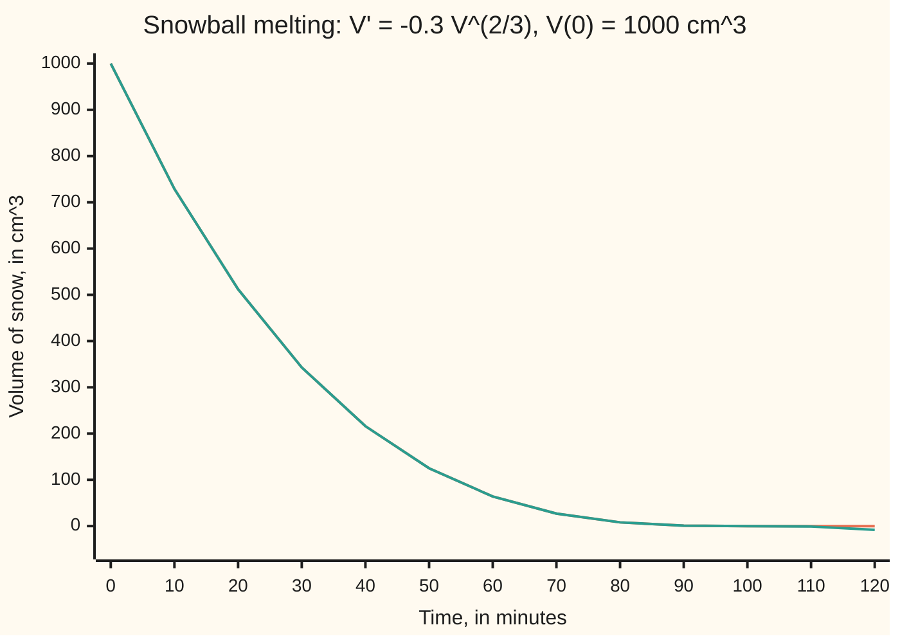

# Separable equations: put each variable on its own side and integrate both

Differential equations and dynamics → Rate Equations → Splitting the variables → Separable equations

---

## General Overview

A snowball of 1000 cm^3 sits on a warm step. Snow melts only where air touches it, so volume is lost at a rate proportional to the surface. A ball's surface goes like its volume to the power 2/3, so the law is: cm^3 lost per minute = 0.3 × volume^(2/3). At the start that is 30 cm^3 a minute.

The rate is two factors multiplied: one depends only on time (here the constant −0.3), the other only on the volume. Such a law is a **separable equation**: the volume can go to one side, time to the other, and each side is integrated on its own.

Done on the snowball, this gives V = (10 − 0.1t)^3 cm^3 at minute t. Half the snow is gone after 20.63 minutes, all of it at 100 minutes. After that the answer is a puddle, V = 0: a solution the method throws away unless it is kept on purpose.

**When a rate is a function of time times a function of the unknown, divide by the unknown's part, integrate both sides, and solve; then add back every constant solution where the unknown's part is zero, because the division lost them.**

**What kind of fact this is:** a method, proved on this card in Why it works.

### The picture: the snowball's volume, minute by minute



Orange: the true volume, on the separated formula until 100 minutes, then on the constant solution V = 0. Teal: the formula pushed past 100 minutes, reaching −8 cm^3 of snow at 120.

---

## The formula

Reminder: y' = f(t, y) says "the rate of y at time t is f(t, y)"; y(0) = y0 is the starting value ([what-a-differential-equation-says](01-what-a-differential-equation-says.md)). An equation is **separable** when the rate splits into a time part times an unknown part:

$$y' = g(t)\,h(y)$$

Wherever $h(y)$ is not zero, divide by it and integrate each side against its own variable:

$$\int \frac{dy}{h(y)} \;=\; \int g(t)\,dt \qquad\text{that is}\qquad H(y) = G(t) + C$$

**Read it aloud:** an antiderivative of one over the unknown's part equals an antiderivative of the time part, plus a constant; and each value where h is zero gives one more solution, y held constant there.

The dy and dt are bookkeeping, as in [substitution](../../06-Calculus%20and%20analysis/04-Integrals/03-substitution.md), not a fraction being split.

On the snowball, $V$ is the volume, g(t) = −k with k = 0.3, and h(V) = V^(2/3):

$$\int V^{-2/3}\,dV = \int -0.3\,dt \quad\Longrightarrow\quad 3V^{1/3} = 30 - 0.3t \quad\Longrightarrow\quad V = (10 - 0.1t)^3$$

| Symbol | Plain meaning | In our example | Push it up and the answer… |
| --- | --- | --- | --- |
| $t$ | time, in minutes | 0 to 120 min | — |
| $y$, $V$ | the unknown; for the snowball, its volume in cm^3 | 1000 at the start | more snow lasts longer |
| $y'$, $V'$ | the unknown's rate, per minute | −30 cm^3/min at the start | — |
| $g$ | the part of the rate that depends only on time | −k, a constant | — |
| $h$ | the part that depends only on the unknown | V^(2/3), in cm^2 | — |
| $G$, $H$ | antiderivatives of g and of 1/h | −0.3t and 3V^(1/3) | — |
| $k$ | melting constant, in cm per minute | 0.3 | faster melt, shorter life |
| $C$ | the constant of integration, fixed by the start | 30 | — |

k is in cm/min, not one over minutes: V^(2/3) is an area, and k times an area must give cm^3 per minute.

### When it holds

- **The rate is a product g(t) × h(y).** A sum such as y' = t + y does not split; it needs [integrating-factor](05-integrating-factor.md).
- **Divide only where h(y) is not zero.** Each zero of h is a constant solution of its own. Forget it and the snowball formula runs on to −8 cm^3.
- **H may have no formula for its inverse.** Then the answer stays implicit, H(y) = G(t) + C, and is still correct.
- **The answer holds on an interval.** It lasts until y reaches a zero of h or runs off to infinity; the snowball's ends at 100 min.
- **One start, one solution, needs a well-behaved h.** V^(2/3) is steep at 0, so a puddle at 120 minutes fits a snowball that melted at 100 minutes and no snowball at all ([lipschitz-and-the-picard-lindelof-theorem](../02-Existence%2C%20Uniqueness%20and%20Sensitivity/02-lipschitz-and-the-picard-lindelof-theorem.md)).

---

## Why it works

### Step 0: dividing by h turns the left side into the rate of something

The chain rule says the rate of H(y(t)) is H'(y) times y' ([chain-rule](../../06-Calculus%20and%20analysis/02-Derivatives/03-chain-rule.md)). Choose H with H' = 1/h. Then y'/h(y), the left side after dividing, is the rate of H(y(t)), and the equation says it equals g(t), the rate of G(t). Two functions with equal rates differ by a constant. The method is the chain rule run backwards.

### Step 1: separate and integrate

Where h(y) is not zero, y'/h(y) = g(t). By Step 0, H(y(t)) − G(t) has rate zero, so by the [fundamental-theorem-of-calculus](../../06-Calculus%20and%20analysis/04-Integrals/02-fundamental-theorem-of-calculus.md) it is a constant, C.

For the snowball, 1/h(V) = V^(−2/3), whose antiderivative is V^(1/3)/(1/3) = 3V^(1/3). The time part integrates to −0.3t. So 3V^(1/3) = −0.3t + C.

### Step 2: fix the constant from the start

Put t = 0 and V = 1000: 3 × 10 = C, so C = 30.

### Step 3: solve for the unknown

Divide by 3: V^(1/3) = 10 − 0.1t. Cube: V = (10 − 0.1t)^3. The cube root of the volume falls in a straight line, and a ball's radius is a fixed multiple of it: the radius shrinks a steady 0.0620 cm per minute from 6.2035 cm. Steady melting per unit of surface is a steady retreat of the surface.

### Step 4: put back the solutions the division lost

The division needed V^(2/3) non-zero, so V = 0 was never looked at. Test it: if V is 0 for all time, its rate is 0, and −0.3 × 0^(2/3) is 0. The law holds, so V = 0 is a **constant solution**.

The real snowball follows (10 − 0.1t)^3 to 100 minutes and V = 0 after. Both pieces obey the law and meet with rate zero at the seam.

<details>
<summary>Detailed proof: every solution is built from these pieces</summary>

Let y solve y' = g(t) h(y), with g and h continuous.

Case 1: h(y(t0)) is not zero at some time t0. On the largest interval around t0 where h(y(t)) stays non-zero, y stays in one interval free of zeros of h, where 1/h keeps one sign. Let H be an antiderivative of 1/h there and G one of g. The rate of H(y(t)) − G(t) is y'/h(y) − g(t) = 0, so H(y(t)) = G(t) + C with C = H(y(t0)) − G(t0). H is strictly monotone there, so it has an inverse: y(t) = H^(−1)(G(t) + C).

Case 2: h(y(t)) is zero at every t of some interval. There y' = 0, so y is constant at a zero of h.

A solution may switch from one kind of piece to the other where they meet, as the snowball does at 100 minutes.

Conversely, differentiating H(y(t)) = G(t) + C and multiplying by h(y) returns the equation, and a constant at a zero of h makes both sides 0.

A solution reaches a zero of h only if the integral of 1/h up to it is finite. The snowball's is 3 × 10 / 0.3 = 100 minutes: it arrives. The coffee's, 1/(0.1(T − 20)) down to 20, is infinite: it never quite arrives. When h has bounded slope near its zeros the integral is always infinite, which keeps solutions apart ([lipschitz-and-the-picard-lindelof-theorem](../02-Existence%2C%20Uniqueness%20and%20Sensitivity/02-lipschitz-and-the-picard-lindelof-theorem.md)).

</details>

A second road follows the slope in small steps without any formula; the code does it, and its card is [eulers-method](../05-Numerical%20Evolution/01-eulers-method.md).

---

## Worked numbers, by hand

| Step | Arithmetic | Value |
| --- | --- | --- |
| integrate 1/h | V^(1/3) / (1/3) | 3V^(1/3) |
| fix the constant | 3 × 1000^(1/3) = 3 × 10 | C = 30 |
| solve | V^(1/3) = (30 − 0.3t)/3, then cube | V = (10 − 0.1t)^3 |
| at 50 min | (10 − 5)^3 = 5^3 | **125 cm^3** |
| half gone, V = 500 | 10 × (10 − 500^(1/3)) | **20.63 min** |
| all gone | 10 − 0.1t = 0 | **100 min** |
| after that | the lost constant solution | **V = 0** |

Half the snow goes in 20.63 minutes; the other half takes the rest of the 100, because a smaller ball has less surface.

The house example separates too: T' = −0.1(T − 20) has h(T) = T − 20, gives T = 20 + 60e^(−0.1t), and the coffee reaches 50 C at 10 ln 2 = 6.9315 min. Its lost constant solution is T = 20.

### What breaks if you drop a piece

| Mistake | Comes out at | What went wrong |
| --- | --- | --- |
| Keep the formula past 100 min | V(120) = −8 cm^3 | The division lost V = 0; the snowball ends on it |
| Drop the 3 from the antiderivative of V^(−2/3) | gone at 33.33 min | V^(1/3) = 10 − 0.3t melts three times too fast |
| Add the constant after cubing | V(50) = 875 cm^3 | C belongs to the integrated equation, not the answer |
| Read the past off a puddle | V(50) = 125 or 0 | At V = 0 the law does not fix the past |

The code prints all four.

---

## Code, from first principles, and it actually runs

Three roads. One: the separated formula. Two: Euler's rule, new value = old value + step length × rate, compared at 50 min for steps of 1, 0.5 and 0.25 min; the error halves as the step halves. Three: the law turned round, minutes per cm^3 = 1/(0.3 V^(2/3)), added up from 500 to 1000 cm^3 by Simpson's rule, which times half the snow, and the coffee, without solving anything. In the code, h is the step length, not h(V).

### Python

```python
# Separable equations -- the check behind the card.  Standard library only.
# A snowball melts at a rate proportional to its surface: V' = -k V^(2/3),
# V(0) = 1000 cm^3, k = 0.3 cm/min.  Road one: the separated answer.  Road
# two: Euler steps on the law.  Road three: the law turned round, minutes per
# cm^3 of snow added up by Simpson's rule.
import math

K, V0 = 0.3, 1000.0

def rate(v):                              # the law; no snow, no melting
    return -K * v ** (2 / 3) if v > 0 else 0.0

def separated(t):                         # 3 V^(1/3) = 30 - k t, cubed; then V = 0
    return max(10 - 0.1 * t, 0.0) ** 3

def euler(t_end, h):                      # plain small steps along the slope
    v = V0
    for _ in range(round(t_end / h)):
        v = v + h * rate(v)
    return v

def euler_melt(h):                        # step until the snow runs out
    v, n = V0, 0
    while v > 0:
        v, n = v + h * rate(v), n + 1
    return n * h

def simpson(f, a, b, n=2000):             # area under f from a to b, n even
    s = f(a) + f(b) + sum((4 if i % 2 else 2) * f(a + i * (b - a) / n) for i in range(1, n))
    return s * (b - a) / (3 * n)

minutes_per_cm3 = lambda v: -1 / rate(v)
t_half = 10 * (10 - 500 ** (1 / 3))       # separated: V = 500 when 10 - 0.1t = 500^(1/3)
t_half_simpson = simpson(minutes_per_cm3, 500, V0)
t_melt = 3 * V0 ** (1 / 3) / K            # separated: 3 V^(1/3) = 30 - k t reaches 0
errs = [abs(euler(50, h) - separated(50)) for h in (1, 0.5, 0.25)]
slope = (separated(37.001) - separated(36.999)) / 0.002  # the answer's own rate at t = 37
coffee = simpson(lambda T: 1 / (0.1 * (T - 20)), 50, 80)  # house example, same law turned round
print("t (min)    ", [t for t in range(0, 130, 10)])
print("V (cm^3)   ", [round(separated(t)) for t in range(0, 130, 10)])
print("formula    ", [round((10 - 0.1 * t) ** 3) for t in range(0, 130, 10)])
print(f"V(50) separated {separated(50):.4f}; Euler h = 0.01 gives {euler(50, 0.01):.4f}")
print("Euler error at t = 50, h = 1, 0.5, 0.25:", " ".join(f"{e:.4f}" for e in errs))
print(f"error ratios on halving h: {errs[0] / errs[1]:.3f} {errs[1] / errs[2]:.3f}")
print(f"melted at: separated {t_melt:.2f} min; Euler h = 0.01 steps out at {euler_melt(0.01):.2f} min")
print(f"half gone (500 cm^3): separated {t_half:.4f} min; Simpson {t_half_simpson:.4f} min")
print(f"rate at t = 37: finite difference {slope:.4f}; law -k V^(2/3) {rate(separated(37)):.4f}; at t = 0 {rate(V0):.1f}")
print(f"lost constant solution: k V^(2/3) at V = 0 is {K * 0.0 ** (2 / 3):.1f}, so V = 0 for all time obeys the law")
print(f"a puddle at t = 120 fits both histories: V(50) = {separated(50):.0f} or V(50) = 0")
print(f"radius {(3 * V0 / (4 * math.pi)) ** (1 / 3):.4f} cm, shrinking {K / (36 * math.pi) ** (1 / 3):.4f} cm/min")
print(f"coffee reaches 50 C: Simpson {coffee:.4f} min; separated 10 ln 2 = {10 * math.log(2):.4f} min")
print(f"mistake, formula past 100 min: V(120) = {(10 - 0.1 * 120) ** 3:.0f} cm^3")
print(f"mistake, dropped the 3: V^(1/3) = 10 - 0.3t, gone at {10 / 0.3:.2f} min")
print(f"mistake, constant added after cubing: V = 1000 - (0.1t)^3, V(50) = {1000 - 5 ** 3:.0f}")
assert abs(euler(50, 0.01) - separated(50)) < 0.1              # road two meets road one
assert abs(t_half_simpson - t_half) < 1e-6 and abs(coffee - 10 * math.log(2)) < 1e-6
assert 1.8 < errs[0] / errs[1] < 2.2 and 1.8 < errs[1] / errs[2] < 2.2  # order one
assert abs(slope - rate(separated(37))) < 1e-4                 # the answer obeys the law
print("ALL CHECKS PASS")
```

**Ran 2026-09-28 on macOS, Python 3.14.6, standard library only. All checks passed. Output, pasted from the run:**

```
t (min)     [0, 10, 20, 30, 40, 50, 60, 70, 80, 90, 100, 110, 120]
V (cm^3)    [1000, 729, 512, 343, 216, 125, 64, 27, 8, 1, 0, 0, 0]
formula     [1000, 729, 512, 343, 216, 125, 64, 27, 8, 1, 0, -1, -8]
V(50) separated 125.0000; Euler h = 0.01 gives 124.9480
Euler error at t = 50, h = 1, 0.5, 0.25: 5.2435 2.6105 1.3024
error ratios on halving h: 2.009 2.004
melted at: separated 100.00 min; Euler h = 0.01 steps out at 99.90 min
half gone (500 cm^3): separated 20.6299 min; Simpson 20.6299 min
rate at t = 37: finite difference -11.9070; law -k V^(2/3) -11.9070; at t = 0 -30.0
lost constant solution: k V^(2/3) at V = 0 is 0.0, so V = 0 for all time obeys the law
a puddle at t = 120 fits both histories: V(50) = 125 or V(50) = 0
radius 6.2035 cm, shrinking 0.0620 cm/min
coffee reaches 50 C: Simpson 6.9315 min; separated 10 ln 2 = 6.9315 min
mistake, formula past 100 min: V(120) = -8 cm^3
mistake, dropped the 3: V^(1/3) = 10 - 0.3t, gone at 33.33 min
mistake, constant added after cubing: V = 1000 - (0.1t)^3, V(50) = 875
ALL CHECKS PASS
```

### Rust

Same numbers, same labels, built with `rustc --edition 2021 -O`.

```rust
// Separable equations -- the same check as the Python, in Rust.  No crates.
// A snowball melts at a rate proportional to its surface: V' = -k V^(2/3),
// V(0) = 1000 cm^3, k = 0.3 cm/min.  Road one: the separated answer.  Road
// two: Euler steps on the law.  Road three: the law turned round, minutes per
// cm^3 of snow added up by Simpson's rule.
const K: f64 = 0.3;
const V0: f64 = 1000.0;

fn rate(v: f64) -> f64 {                  // the law; no snow, no melting
    if v > 0.0 { -K * v.powf(2.0 / 3.0) } else { 0.0 }
}

fn separated(t: f64) -> f64 {             // 3 V^(1/3) = 30 - k t, cubed; then V = 0
    (10.0 - 0.1 * t).max(0.0).powi(3)
}

fn euler(t_end: f64, h: f64) -> f64 {     // plain small steps along the slope
    let mut v = V0;
    for _ in 0..(t_end / h).round() as usize { v += h * rate(v) }
    v
}

fn euler_melt(h: f64) -> f64 {            // step until the snow runs out
    let (mut v, mut n) = (V0, 0u32);
    while v > 0.0 { v += h * rate(v); n += 1 }
    n as f64 * h
}

fn simpson(f: &dyn Fn(f64) -> f64, a: f64, b: f64, n: usize) -> f64 {
    let mut s = 0.0;                      // area under f from a to b, n even
    for i in 1..n { s += (if i % 2 == 1 { 4.0 } else { 2.0 }) * f(a + i as f64 * (b - a) / n as f64) }
    (f(a) + f(b) + s) * (b - a) / (3.0 * n as f64)
}

fn main() {
    let minutes_per_cm3 = |v: f64| -1.0 / rate(v);
    let t_half = 10.0 * (10.0 - 500f64.powf(1.0 / 3.0)); // separated: V = 500
    let t_half_simpson = simpson(&minutes_per_cm3, 500.0, V0, 2000);
    let t_melt = 3.0 * V0.powf(1.0 / 3.0) / K;           // 3 V^(1/3) = 30 - k t reaches 0
    let errs: Vec<f64> = [1.0, 0.5, 0.25].iter().map(|&h| (euler(50.0, h) - separated(50.0)).abs()).collect();
    let slope = (separated(37.001) - separated(36.999)) / 0.002; // the answer's own rate
    let coffee = simpson(&|t: f64| 1.0 / (0.1 * (t - 20.0)), 50.0, 80.0, 2000);
    let ts: Vec<i64> = (0..13).map(|i| 10 * i).collect();
    let vs: Vec<i64> = ts.iter().map(|&t| separated(t as f64).round() as i64).collect();
    let raw: Vec<i64> = ts.iter().map(|&t| (10.0 - 0.1 * t as f64).powi(3).round() as i64).collect();
    let e: Vec<String> = errs.iter().map(|x| format!("{:.4}", x)).collect();
    let ln2 = 10.0 * 2f64.ln();
    println!("t (min)     {:?}", ts);
    println!("V (cm^3)    {:?}", vs);
    println!("formula     {:?}", raw);
    println!("V(50) separated {:.4}; Euler h = 0.01 gives {:.4}", separated(50.0), euler(50.0, 0.01));
    println!("Euler error at t = 50, h = 1, 0.5, 0.25: {}", e.join(" "));
    println!("error ratios on halving h: {:.3} {:.3}", errs[0] / errs[1], errs[1] / errs[2]);
    println!("melted at: separated {:.2} min; Euler h = 0.01 steps out at {:.2} min", t_melt, euler_melt(0.01));
    println!("half gone (500 cm^3): separated {:.4} min; Simpson {:.4} min", t_half, t_half_simpson);
    println!("rate at t = 37: finite difference {:.4}; law -k V^(2/3) {:.4}; at t = 0 {:.1}", slope, rate(separated(37.0)), rate(V0));
    println!("lost constant solution: k V^(2/3) at V = 0 is {:.1}, so V = 0 for all time obeys the law", K * 0f64.powf(2.0 / 3.0));
    println!("a puddle at t = 120 fits both histories: V(50) = {:.0} or V(50) = 0", separated(50.0));
    println!("radius {:.4} cm, shrinking {:.4} cm/min", (3.0 * V0 / (4.0 * std::f64::consts::PI)).powf(1.0 / 3.0),
             K / (36.0 * std::f64::consts::PI).powf(1.0 / 3.0));
    println!("coffee reaches 50 C: Simpson {:.4} min; separated 10 ln 2 = {:.4} min", coffee, ln2);
    println!("mistake, formula past 100 min: V(120) = {:.0} cm^3", (10.0 - 0.1 * 120.0f64).powi(3));
    println!("mistake, dropped the 3: V^(1/3) = 10 - 0.3t, gone at {:.2} min", 10.0 / 0.3);
    println!("mistake, constant added after cubing: V = 1000 - (0.1t)^3, V(50) = {:.0}", 1000.0 - 5f64.powi(3));
    assert!((euler(50.0, 0.01) - separated(50.0)).abs() < 0.1);        // road two meets road one
    assert!((t_half_simpson - t_half).abs() < 1e-6 && (coffee - ln2).abs() < 1e-6);
    assert!(errs[0] / errs[1] > 1.8 && errs[0] / errs[1] < 2.2 && errs[1] / errs[2] > 1.8 && errs[1] / errs[2] < 2.2);
    assert!((slope - rate(separated(37.0))).abs() < 1e-4);              // the answer obeys the law
    println!("ALL CHECKS PASS");
}
```

**Ran 2026-09-28 on macOS, rustc 1.98.1, no crates. All checks passed. Output, pasted from the run:**

```
t (min)     [0, 10, 20, 30, 40, 50, 60, 70, 80, 90, 100, 110, 120]
V (cm^3)    [1000, 729, 512, 343, 216, 125, 64, 27, 8, 1, 0, 0, 0]
formula     [1000, 729, 512, 343, 216, 125, 64, 27, 8, 1, 0, -1, -8]
V(50) separated 125.0000; Euler h = 0.01 gives 124.9480
Euler error at t = 50, h = 1, 0.5, 0.25: 5.2435 2.6105 1.3024
error ratios on halving h: 2.009 2.004
melted at: separated 100.00 min; Euler h = 0.01 steps out at 99.90 min
half gone (500 cm^3): separated 20.6299 min; Simpson 20.6299 min
rate at t = 37: finite difference -11.9070; law -k V^(2/3) -11.9070; at t = 0 -30.0
lost constant solution: k V^(2/3) at V = 0 is 0.0, so V = 0 for all time obeys the law
a puddle at t = 120 fits both histories: V(50) = 125 or V(50) = 0
radius 6.2035 cm, shrinking 0.0620 cm/min
coffee reaches 50 C: Simpson 6.9315 min; separated 10 ln 2 = 6.9315 min
mistake, formula past 100 min: V(120) = -8 cm^3
mistake, dropped the 3: V^(1/3) = 10 - 0.3t, gone at 33.33 min
mistake, constant added after cubing: V = 1000 - (0.1t)^3, V(50) = 875
ALL CHECKS PASS
```

> [!TIP]
> **Try changing**
> Guess first, then run it.
> - **Melt twice as fast.** Set `K = 0.6`. Euler steps out at 49.91 min: doubling k halves every time. The separated lines are written for k = 0.3, so the first assert stops the run.
> - **An eight-times bigger snowball.** Set `V0 = 8000.0`, twice the radius. It lasts 200.00 min; the radius still shrinks 0.0620 cm/min. The first assert fails until `10 - 0.1 * t` becomes `20 - 0.1 * t`.
> - **Smaller steps.** Replace `(1, 0.5, 0.25)` with `(0.5, 0.25, 0.125)`. The errors become 2.6105, 1.3024 and 0.6505: still halving.

---

## The usual mistake

> [!warning]
> **Dividing by h(y) and forgetting what the division excluded.** Each zero of h is a constant solution the integrals never see: V = 0 for the snowball, T = 20 for the coffee. Without it the formula reports −8 cm^3 of snow at 120 minutes. List the zeros of h before dividing and test each one.
>
> - **Dropping a factor in the antiderivative.** V^(−2/3) integrates to 3V^(1/3); lose the 3 and the snowball is gone at 33.33 minutes.
> - **Adding the constant at the end.** Tacked on after solving, it gives 875 cm^3 at 50 minutes instead of 125.
> - **Dropping the absolute value.** ∫ dT/(T − 20) is ln|T − 20|, so the constant e^C gains a sign, fixed by the start.
> - **Separating a sum.** y' = t + y is not a product and cannot be split.

---

## Where you meet it in real life

- **Cooling and decay.** Newton's cooling, radioactive decay and drug clearance have h(y) linear in y ([exponential-growth-decay-and-cooling](04-exponential-growth-decay-and-cooling.md)).
- **Draining tanks.** Water leaves a hole at a rate set by the square root of the depth; like the snowball, the tank empties in finite time.
- **Populations with a ceiling.** The logistic law separates with partial fractions; its constant solutions are extinction and the ceiling ([logistic-growth](07-logistic-growth.md)).

> **Say it back**
> A separable equation's rate is a time part times an unknown part. Divide by the unknown part and integrate each side against its own variable; the chain rule makes the two antiderivatives differ by a constant, fixed from the start. Solve for the unknown if possible, or leave the answer implicit. Then put back the constant solutions at the zeros of the unknown part, which the division removed. The snowball follows (10 − 0.1t)^3 to 100 minutes, then sits on V = 0.

---

## What this builds on

- [what-a-differential-equation-says](01-what-a-differential-equation-says.md): the notation y' = f(t, y) and the starting value.
- [chain-rule](../../06-Calculus%20and%20analysis/02-Derivatives/03-chain-rule.md): the rate of H(y(t)), which Step 0 runs backwards.
- [fundamental-theorem-of-calculus](../../06-Calculus%20and%20analysis/04-Integrals/02-fundamental-theorem-of-calculus.md): a function with rate zero is a constant.
- [substitution](../../06-Calculus%20and%20analysis/04-Integrals/03-substitution.md): the same bookkeeping, dy = y' dt, used there for integrals.

## Where this goes next

- [exponential-growth-decay-and-cooling](04-exponential-growth-decay-and-cooling.md): h(y) = y, solved once and used everywhere.
- [logistic-growth](07-logistic-growth.md): an integral that needs partial fractions.
- [exact-equations](08-exact-equations.md): implicit answers for laws that do not split.
- [lipschitz-and-the-picard-lindelof-theorem](../02-Existence%2C%20Uniqueness%20and%20Sensitivity/02-lipschitz-and-the-picard-lindelof-theorem.md): when a start fixes one solution, and why a puddle does not.

---

## Sources

Verified 2026-09-28: every link below opens a page naming the cited work.

- OpenStax. *Calculus Volume 2*, section 4.3, "Separable Equations". [Free text](https://openstax.org/books/calculus-volume-2/pages/4-3-separable-equations). The recipe with worked examples.
- Boyce, William E., Richard C. DiPrima and Douglas B. Meade. *Elementary Differential Equations*, 12th ed. Wiley, 2021. [Publisher page](https://www.wiley.com/en-us/Elementary+Differential+Equations%2C+12th+Edition-p-9781119777755). Section 2.2: implicit answers and the interval of validity.
- Teschl, Gerald. *Ordinary Differential Equations and Dynamical Systems*. AMS Graduate Studies in Mathematics 140, 2012. [Author's text, posted with AMS permission](https://mat.univie.ac.at/~gerald/ftp/book-ode/). Section 1.3: the careful proof.
- Coddington, Earl A. *An Introduction to Ordinary Differential Equations*. Dover, 1989. [Publisher page](https://store.doverpublications.com/products/9780486659428). Chapter 1: first-order equations.
