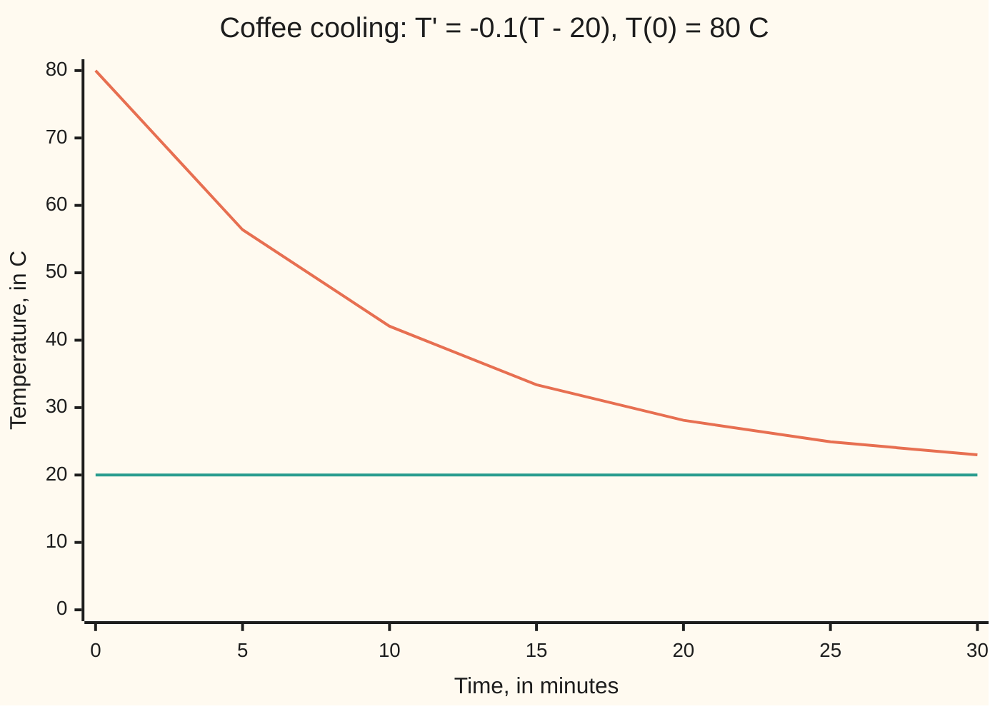

# Growth, decay and cooling: when the rate is proportional to the amount, the answer is an exponential

Differential equations and dynamics → Rate Equations → Proportional rates → Growth, decay and cooling

---

## General Overview

A savings account holds 5,000 dollars and earns 4% a year, credited continuously: at every instant the balance grows at 4% of whatever it holds at that instant. At the start that is 200 dollars a year. A year later the balance is bigger, so the growth is faster. After 10 years the account holds 7,459.12 dollars.

The same rule runs backwards in a bone. Carbon-14, a radioactive form of carbon, breaks down at a rate proportional to how much is left: half is gone after 5,730 years, whatever the start. A bone holding 30% of the carbon-14 it had in life died about 9,953 years ago.

A cup of coffee at 80 C in a 20 C room is the same rule, shifted: it loses heat in proportion to how much warmer it is than the room (Newton's law of cooling). The gap, not the temperature, shrinks by the rule. The coffee reaches 50 C after 6.93 minutes, and it never quite reaches 20 C.

**When a quantity changes at a rate that is a fixed multiple of itself, it is that starting amount times an exponential, and nothing else; cooling obeys the same rule once temperature is measured from the room.**

**What kind of fact this is:** a theorem, proved on this card in Why it works; Newton's law of cooling itself is a model, an assumption about heat flow that fits a cup well, not a law of nature.

### The picture: the coffee, every five minutes



Orange: the coffee, T = 20 + 60e^(−0.1t). Teal: the room, 20 C. The gap between them shrinks by the same factor in every five minutes.

---

## The formula

Reminder: y' = f(t, y) says "the rate of y at time t is f(t, y)", and y(0) = y0 is the starting value ([what-a-differential-equation-says](01-what-a-differential-equation-says.md)). Here the rate is k times the amount:

$$y' = k\,y,\qquad y(0) = y_0 \qquad\Longleftrightarrow\qquad y(t) = y_0\,e^{kt}$$

**Read it aloud:** if the rate is always k times the amount, the amount at time t is the starting amount times e to the power k t, and that is the only possibility.

On the account, $y$ is the balance, $y_0$ = 5,000 and $k$ = 0.04 per year, so y(10) = 5000e^(0.4) = 7,459.12 dollars.

Cooling measures from the room. With $T$ the coffee's temperature and $A$ the room's:

$$T' = k\,(T - A)\qquad\Longrightarrow\qquad T(t) = A + (T_0 - A)\,e^{kt}$$

**Read it aloud:** the temperature is the room plus the starting gap, shrunk by the exponential.

Two waiting times follow by setting the factor e^(kt) to one half or to two:

$$t_{1/2} = \frac{\ln 2}{-k}\ \ (k<0),\qquad t_2 = \frac{\ln 2}{k}\ \ (k>0)$$

**Read it aloud:** half-life and doubling time are ln 2 divided by the size of k.

| Symbol | Plain meaning | In our example | Push it up and the answer… |
| --- | --- | --- | --- |
| $t$ | time since the start | years for the account and carbon, minutes for the coffee | — |
| $y$, $y_0$ | the amount, and the amount at the start | balance, 5,000 dollars at the start | every later amount scales with it |
| $y'$ | the amount's rate of change | 200 dollars a year at the start | — |
| $k$ | rate constant, in one over time; positive grows, negative decays | 0.04 per year; −0.000121 per year; −0.1 per minute | faster growth, or slower decay |
| $e$ | the number 2.71828…, whose power e^x has rate e^x | e^0.4 = 1.491825 | — |
| $C$ | a constant fixed by the start | equals y0 | — |
| $T$, $T_0$, $A$ | coffee temperature, its start, the room | T0 = 80 C, A = 20 C | a warmer room holds the coffee warmer |
| $t_{1/2}$, $t_2$ | half-life and doubling time | 5,730 years; 17.33 years | — |

### When it holds

- **k is a constant.** If the account pays 4% for five years, then 2%, the answer is 6,749.29 dollars, not 7,459.12: the exponent becomes the sum of rate times time, piece by piece.
- **The rate depends on the amount alone, in proportion.** A deposit of 100 dollars a year adds a term that does not scale with the balance; that law needs [integrating-factor](05-integrating-factor.md).
- **The room stays at one temperature.** If A drifts, the gap's rate picks up A's own rate and the shift fails.
- **Nothing limits growth.** Crowding slows a population below the exponential; see [logistic-growth](07-logistic-growth.md).

---

## Why it works

### Step 0: divide out the expected growth, and nothing is left to change

If y grows like e^(kt), then e^(−kt)y should not change at all. Showing its rate is zero proves every solution is the exponential. No division by y is needed, so the solution y = 0 is not lost, as it can be when separating ([separable-equations](03-separable-equations.md)).

### Step 1: the exponential solves the equation

The rate of e^(kt) is k e^(kt), by the chain rule, since e^x is its own rate. So y0e^(kt) has rate k times itself, and at t = 0 it equals y0.

### Step 2: nothing else solves it

Take any solution y, and set u(t) = e^(−kt)y(t). The product rule gives the rate of u:

$$u' = -k\,e^{-kt}\,y + e^{-kt}\,y' = e^{-kt}\,(y' - k\,y) = 0.$$

The bracket is zero because y solves the equation. A function whose rate is zero on an interval is a constant C. At t = 0, u = y0, so C = y0 and y(t) = y0e^(kt). The start fixes the answer completely.

<details>
<summary>Detailed proof: zero rate means constant, and the solution lives for all time</summary>

Let y be differentiable on an interval I containing 0 with y'(t) = k y(t) for every t in I. Set u(t) = e^(−kt) y(t). Since e^(−kt) is differentiable with rate −k e^(−kt), the product rule gives u'(t) = e^(−kt)(y'(t) − k y(t)) = 0 on I.

For any s in I, the mean value theorem gives a point c between 0 and s with u(s) − u(0) = u'(c) s = 0. So u(s) = u(0) = y(0) = y0, and y(s) = y0 e^(ks).

Conversely y0 e^(kt) is defined and differentiable for every real t, with rate k y0 e^(kt). So the solution exists on the whole line, is unique on any interval, never blows up, and, since e^(kt) is never zero, never changes sign: a positive balance stays positive and a nonzero gap never closes in finite time.

</details>

### Step 3: read k from a half-life or a doubling time

After a half-life, e^(k t½) = 1/2. Take natural logarithms ([natural-log-and-doubling-time](../../01-Foundations/04-Compound%20Growth%20and%20Discounting/05-natural-log-and-doubling-time.md)): k t½ = −ln 2. For carbon-14, k = −0.6931/5730 = −0.000120968 per year. The same halving holds over any 5,730 years, whenever they start.

Doubling works the same way: the account doubles after ln 2/0.04 = 17.33 years.

The bone with 30% left satisfies e^(kt) = 0.3, so t = ln 0.3/k = 9,953 years.

### Step 4: shift the zero to the room

Set y = T − A, the gap. A is a constant, so y' = T', and the cooling law reads y' = k y. Step 2 gives y = (T0 − A)e^(kt); add A back. For the coffee, k = −0.1 per minute, the gap starts at 60 and halves every 10 ln 2 = 6.93 minutes, so the coffee is at 20 + 30 = 50 C then.

A second road steps along the slope. Euler's rule, new value = old value + step length h × rate, multiplies the balance by (1 + kh) each step. With h = 1 year that is annual compounding: 7,401.22 dollars. Halving the step halves the error, and the steps converge to e^(kt), the limit in [compounding-frequency-and-e](../../01-Foundations/04-Compound%20Growth%20and%20Discounting/04-compounding-frequency-and-e.md). The method has its own card, [eulers-method](../05-Numerical%20Evolution/01-eulers-method.md).

---

## Worked numbers, by hand

| Step | Arithmetic | Value |
| --- | --- | --- |
| account exponent | 0.04 × 10 | 0.4 |
| growth factor | e^0.4 | 1.491825 |
| balance at 10 years | 5,000 × 1.491825 | **7,459.12 dollars** |
| doubling time | 0.6931 / 0.04 | 17.33 years |
| carbon-14 rate | −0.6931 / 5,730 | **−0.000120968 per year** |
| bone at 30% | ln 0.3 / k = −1.2040 / −0.000120968 | 9,953 years |
| coffee gap at start | 80 − 20 | 60 C |
| coffee at 10 min | 20 + 60e^(−1) | 42.07 C |
| coffee at 50 C | gap 60 → 30, one half-life: 10 × 0.6931 | **6.93 min** |

The coffee is at 50 C just under seven minutes after it is poured; the balance is nearly half as big again after ten years.

### What breaks if you drop a piece

| Mistake | Comes out at | What went wrong |
| --- | --- | --- |
| Coffee cools toward 0 C | reaches 50 C at 4.70 min | The law acts on the gap T − 20, not on T |
| k read from raw temperatures, 56.39/80 over 5 min | −0.0699 per min, not −0.1000 | The ratio must be of gaps: 36.39/60 |
| Half-life taken as 1/|k|, ln 2 dropped | bone age 6,899 years, not 9,953 | e^(k t½) = 1/2 needs the logarithm |
| k not constant: 4%, then 2% after year 5 | 6,749.29 dollars, not 7,459.12 | The theorem needs one k; the exponent becomes 0.2 + 0.1 |

The code prints all four.

---

## Code, from first principles, and it actually runs

Two roads to each answer. The balance comes from y0e^(kt) and from Euler's steps, which never call exp; the error halves as the step halves. The coffee's 50 C time and carbon-14's rate come from a logarithm and from bisection, which traps the answer in a bracket and halves it 100 times, never taking a logarithm. A finite difference, the change over a small interval divided by its length, confirms the coffee formula obeys its law.

### Python

```python
# Growth, decay and cooling -- the check behind the card.  Standard library
# only.  y' = k y is answered by two roads: the closed form y0 e^(kt), and
# Euler's small steps along the slope, which never call exp.  Times and rates
# are found twice: by a logarithm, and by bisection, which halves a bracket
# around the answer and never calls log.
import math

def closed(y0, k, t):                     # the theorem: y = y0 e^(kt)
    return y0 * math.exp(k * t)

def euler(y0, k, t_end, h):               # new value = old value + step x rate
    y = y0
    for _ in range(round(t_end / h)):
        y = y + h * k * y
    return y

def bisect(f, lo, hi):                    # f changes sign between lo and hi
    for _ in range(100):
        mid = (lo + hi) / 2
        lo, hi = (mid, hi) if f(lo) * f(mid) > 0 else (lo, mid)
    return (lo + hi) / 2

def coffee(t):                            # the shifted law: the gap T - 20 decays
    return 20 + closed(60, -0.1, t)

bal = closed(5000, 0.04, 10)
errs = [abs(euler(5000, 0.04, 10, h) - bal) for h in (1, 0.5, 0.25)]
k14 = -math.log(2) / 5730
k14_b = bisect(lambda k: closed(1, k, 5730) - 0.5, -0.01, 0)
t50, t50_b = 10 * math.log(2), bisect(lambda t: coffee(t) - 50, 0, 30)
slope = (coffee(5.001) - coffee(4.999)) / 0.002
fmt = lambda xs, d: " ".join(f"{x:.{d}f}" for x in xs)
print(f"balance: 5000 at 4% continuous for 10 years = {bal:.2f} dollars")
print(f"Euler, h = 1, 0.5, 0.25 years: {fmt([euler(5000, 0.04, 10, h) for h in (1, 0.5, 0.25)], 2)}")
print(f"Euler, h = 0.001 years: {euler(5000, 0.04, 10, 0.001):.2f}; errors at h = 1, 0.5, 0.25: {fmt(errs, 2)}")
print(f"error ratios on halving h: {errs[0] / errs[1]:.3f} {errs[1] / errs[2]:.3f}")
print(f"ln 2 = {math.log(2):.4f}; doubling time ln 2 / 0.04 = {math.log(2) / 0.04:.2f} years; e^0.4 = {math.exp(0.4):.6f}")
print(f"carbon-14 k: -ln 2 / 5730 = {k14:.9f}; bisection on e^(5730k) = 1/2 gives {k14_b:.9f} per year")
print(f"bone with 30% of its carbon-14 left: ln 0.3 = {math.log(0.3):.4f}, / k = {math.log(0.3) / k14:.0f} years")
print(f"coffee t (min): {fmt(range(0, 35, 5), 0)}")
print(f"coffee T (C):   {fmt([coffee(t) for t in range(0, 35, 5)], 2)}")
print(f"coffee reaches 50 C: 10 ln 2 = {t50:.4f} min; bisection = {t50_b:.4f} min")
print(f"k read back from the gap T(5) - 20 = {coffee(5) - 20:.2f}: ln(gap / 60) / 5 = {math.log((coffee(5) - 20) / 60) / 5:.4f} per min")
print(f"rate at t = 5: finite difference {slope:.4f}; law -0.1(T - 20) = {-0.1 * (coffee(5) - 20):.4f} C/min")
print(f"mistake, cool toward 0 C: 80 e^(-0.1t) hits 50 at {math.log(80 / 50) / 0.1:.2f} min")
print(f"mistake, k from raw temperatures: ln(T(5) / 80) / 5 = {math.log(coffee(5) / 80) / 5:.4f} per min")
print(f"mistake, k = -1/5730 (ln 2 dropped): bone age {math.log(0.3) * -5730:.0f} years")
print(f"hypothesis dropped, 4% then 2% after year 5: {closed(closed(5000, 0.04, 5), 0.02, 5):.2f}, not {bal:.2f}")
assert abs(euler(5000, 0.04, 10, 0.001) - bal) < 0.1                # road two meets road one
assert 1.9 < errs[0] / errs[1] < 2.1 and 1.9 < errs[1] / errs[2] < 2.1  # Euler is order one
assert abs(t50_b - t50) < 1e-9 and abs(k14_b - k14) < 1e-8          # logs against bisection
assert abs(slope + 0.1 * (coffee(5) - 20)) < 1e-6                   # the answer obeys the law
print("ALL CHECKS PASS")
```

**Ran 2026-09-28 on macOS, Python 3.14.6, standard library only. All checks passed. Output, pasted from the run:**

```
balance: 5000 at 4% continuous for 10 years = 7459.12 dollars
Euler, h = 1, 0.5, 0.25 years: 7401.22 7429.74 7444.32
Euler, h = 0.001 years: 7459.06; errors at h = 1, 0.5, 0.25: 57.90 29.39 14.80
error ratios on halving h: 1.970 1.985
ln 2 = 0.6931; doubling time ln 2 / 0.04 = 17.33 years; e^0.4 = 1.491825
carbon-14 k: -ln 2 / 5730 = -0.000120968; bisection on e^(5730k) = 1/2 gives -0.000120968 per year
bone with 30% of its carbon-14 left: ln 0.3 = -1.2040, / k = 9953 years
coffee t (min): 0 5 10 15 20 25 30
coffee T (C):   80.00 56.39 42.07 33.39 28.12 24.93 22.99
coffee reaches 50 C: 10 ln 2 = 6.9315 min; bisection = 6.9315 min
k read back from the gap T(5) - 20 = 36.39: ln(gap / 60) / 5 = -0.1000 per min
rate at t = 5: finite difference -3.6392; law -0.1(T - 20) = -3.6392 C/min
mistake, cool toward 0 C: 80 e^(-0.1t) hits 50 at 4.70 min
mistake, k from raw temperatures: ln(T(5) / 80) / 5 = -0.0699 per min
mistake, k = -1/5730 (ln 2 dropped): bone age 6899 years
hypothesis dropped, 4% then 2% after year 5: 6749.29, not 7459.12
ALL CHECKS PASS
```

### Rust

Same numbers, same labels, built with `rustc --edition 2021 -O`.

```rust
// Growth, decay and cooling -- the same check as the Python, in Rust.  No
// crates.  y' = k y is answered by two roads: the closed form y0 e^(kt), and
// Euler's small steps along the slope, which never call exp.  Times and rates
// are found twice: by a logarithm, and by bisection, which halves a bracket
// around the answer and never calls log.
fn closed(y0: f64, k: f64, t: f64) -> f64 { y0 * (k * t).exp() } // the theorem

fn euler(y0: f64, k: f64, t_end: f64, h: f64) -> f64 {  // new = old + step x rate
    let mut y = y0;
    for _ in 0..(t_end / h).round() as usize { y += h * k * y }
    y
}

fn bisect(f: &dyn Fn(f64) -> f64, mut lo: f64, mut hi: f64) -> f64 {
    for _ in 0..100 {                                     // f changes sign in the bracket
        let mid = (lo + hi) / 2.0;
        if f(lo) * f(mid) > 0.0 { lo = mid } else { hi = mid }
    }
    (lo + hi) / 2.0
}

fn coffee(t: f64) -> f64 { 20.0 + closed(60.0, -0.1, t) } // the gap T - 20 decays

fn fmt(xs: &[f64], d: usize) -> String {
    xs.iter().map(|x| format!("{:.*}", d, x)).collect::<Vec<_>>().join(" ")
}

fn main() {
    let ln2 = 2f64.ln();
    let bal = closed(5000.0, 0.04, 10.0);
    let hs = [1.0, 0.5, 0.25];
    let steps: Vec<f64> = hs.iter().map(|&h| euler(5000.0, 0.04, 10.0, h)).collect();
    let errs: Vec<f64> = steps.iter().map(|y| (y - bal).abs()).collect();
    let k14 = -ln2 / 5730.0;
    let k14_b = bisect(&|k| closed(1.0, k, 5730.0) - 0.5, -0.01, 0.0);
    let (t50, t50_b) = (10.0 * ln2, bisect(&|t| coffee(t) - 50.0, 0.0, 30.0));
    let slope = (coffee(5.001) - coffee(4.999)) / 0.002;
    let ts: Vec<f64> = (0..7).map(|i| 5.0 * i as f64).collect();
    let temps: Vec<f64> = ts.iter().map(|&t| coffee(t)).collect();
    let fine = euler(5000.0, 0.04, 10.0, 0.001);
    println!("balance: 5000 at 4% continuous for 10 years = {:.2} dollars", bal);
    println!("Euler, h = 1, 0.5, 0.25 years: {}", fmt(&steps, 2));
    println!("Euler, h = 0.001 years: {:.2}; errors at h = 1, 0.5, 0.25: {}", fine, fmt(&errs, 2));
    println!("error ratios on halving h: {:.3} {:.3}", errs[0] / errs[1], errs[1] / errs[2]);
    println!("ln 2 = {:.4}; doubling time ln 2 / 0.04 = {:.2} years; e^0.4 = {:.6}", ln2, ln2 / 0.04, 0.4f64.exp());
    println!("carbon-14 k: -ln 2 / 5730 = {:.9}; bisection on e^(5730k) = 1/2 gives {:.9} per year", k14, k14_b);
    println!("bone with 30% of its carbon-14 left: ln 0.3 = {:.4}, / k = {:.0} years", 0.3f64.ln(), 0.3f64.ln() / k14);
    println!("coffee t (min): {}", fmt(&ts, 0));
    println!("coffee T (C):   {}", fmt(&temps, 2));
    println!("coffee reaches 50 C: 10 ln 2 = {:.4} min; bisection = {:.4} min", t50, t50_b);
    let gap = coffee(5.0) - 20.0;
    println!("k read back from the gap T(5) - 20 = {:.2}: ln(gap / 60) / 5 = {:.4} per min", gap, (gap / 60.0).ln() / 5.0);
    println!("rate at t = 5: finite difference {:.4}; law -0.1(T - 20) = {:.4} C/min", slope, -0.1 * (coffee(5.0) - 20.0));
    println!("mistake, cool toward 0 C: 80 e^(-0.1t) hits 50 at {:.2} min", (80.0f64 / 50.0).ln() / 0.1);
    println!("mistake, k from raw temperatures: ln(T(5) / 80) / 5 = {:.4} per min", (coffee(5.0) / 80.0).ln() / 5.0);
    println!("mistake, k = -1/5730 (ln 2 dropped): bone age {:.0} years", 0.3f64.ln() * -5730.0);
    println!("hypothesis dropped, 4% then 2% after year 5: {:.2}, not {:.2}", closed(closed(5000.0, 0.04, 5.0), 0.02, 5.0), bal);
    assert!((fine - bal).abs() < 0.1);                                    // road two meets road one
    assert!(errs[0] / errs[1] > 1.9 && errs[0] / errs[1] < 2.1 && errs[1] / errs[2] > 1.9 && errs[1] / errs[2] < 2.1);
    assert!((t50_b - t50).abs() < 1e-9 && (k14_b - k14).abs() < 1e-8);     // logs against bisection
    assert!((slope + 0.1 * (coffee(5.0) - 20.0)).abs() < 1e-6);           // the answer obeys the law
    println!("ALL CHECKS PASS");
}
```

**Ran 2026-09-28 on macOS, rustc 1.98.1, no crates. All checks passed. Output, pasted from the run:**

```
balance: 5000 at 4% continuous for 10 years = 7459.12 dollars
Euler, h = 1, 0.5, 0.25 years: 7401.22 7429.74 7444.32
Euler, h = 0.001 years: 7459.06; errors at h = 1, 0.5, 0.25: 57.90 29.39 14.80
error ratios on halving h: 1.970 1.985
ln 2 = 0.6931; doubling time ln 2 / 0.04 = 17.33 years; e^0.4 = 1.491825
carbon-14 k: -ln 2 / 5730 = -0.000120968; bisection on e^(5730k) = 1/2 gives -0.000120968 per year
bone with 30% of its carbon-14 left: ln 0.3 = -1.2040, / k = 9953 years
coffee t (min): 0 5 10 15 20 25 30
coffee T (C):   80.00 56.39 42.07 33.39 28.12 24.93 22.99
coffee reaches 50 C: 10 ln 2 = 6.9315 min; bisection = 6.9315 min
k read back from the gap T(5) - 20 = 36.39: ln(gap / 60) / 5 = -0.1000 per min
rate at t = 5: finite difference -3.6392; law -0.1(T - 20) = -3.6392 C/min
mistake, cool toward 0 C: 80 e^(-0.1t) hits 50 at 4.70 min
mistake, k from raw temperatures: ln(T(5) / 80) / 5 = -0.0699 per min
mistake, k = -1/5730 (ln 2 dropped): bone age 6899 years
hypothesis dropped, 4% then 2% after year 5: 6749.29, not 7459.12
ALL CHECKS PASS
```

The two outputs match line for line.

> [!TIP]
> **Try changing**
> Guess first, then run it.
> - **Smaller steps.** Replace `(1, 0.5, 0.25)` with `(0.5, 0.25, 0.125)` in the `errs` line. The errors become 29.39, 14.80 and 7.43 dollars: still halving, as a first-order method should.
> - **A faster-cooling cup.** Change `-0.1` to `-0.2` in `coffee`. Bisection finds 50 C at 3.4657 min, half the time; the third assert stops the run, because 10 ln 2 was written for k = −0.1.
> - **Libby's half-life.** Change `5730` to `5568`, the value radiocarbon labs still quote by convention, in the `k14` line only. The bone's age becomes 9,671 years, and the third assert stops the run, since the bisection still uses 5,730.

---

## The usual mistake

> [!warning]
> **Applying the exponential to the temperature instead of the gap.** Newton's law says the rate is proportional to T − 20, so it is T − 20 that decays. Letting 80 C decay toward zero puts the coffee at 50 C after 4.70 minutes instead of 6.93.
>
> - **Fitting k from a ratio of temperatures.** 56.39/80 gives −0.0699 per minute; the gaps 36.39/60 give the true −0.1000.
> - **Dropping ln 2.** A half-life of 5,730 years is not a rate of 1/5,730 per year; that slip ages the bone at 6,899 years.
> - **Annual rate as continuous rate.** 4% credited once a year gives 7,401.22 dollars after ten years, not 7,459.12; the two are different conventions, and k is the continuous one.

---

## Where you meet it in real life

- **Banking and bonds.** Continuous compounding and discounting are y' = ky with k the interest rate.
- **Radiocarbon dating.** The fraction of carbon-14 left gives the age, t = ln(fraction)/k.
- **Medicine.** Many drugs leave the blood in proportion to the amount left; the half-life sets the dose interval.
- **Forensics.** A body cools roughly by Newton's law; two readings give k, once the room is subtracted.
- **Tanks and compartments.** Salt washed out of a tank of clean water decays the same way ([mixing-tanks-and-compartments](06-mixing-tanks-and-compartments.md)).

> **Say it back**
> When a rate is a fixed multiple k of the amount, the amount is its starting value times e^(kt). Multiplying any solution by e^(−kt) gives something with zero rate, so no other answer exists. The half-life or doubling time is ln 2 divided by the size of k, which is how k is read from data. Cooling is the same law on the gap between the object and the room. The coffee's gap halves every 6.93 minutes, so it is at 50 C then.

---

## What this builds on

- [separable-equations](03-separable-equations.md): y' = ky is separable; this card proves the answer without dividing by y.
- [compounding-frequency-and-e](../../01-Foundations/04-Compound%20Growth%20and%20Discounting/04-compounding-frequency-and-e.md): e as the limit of ever more frequent compounding, which Euler's steps reproduce.
- [natural-log-and-doubling-time](../../01-Foundations/04-Compound%20Growth%20and%20Discounting/05-natural-log-and-doubling-time.md): the logarithm that turns a factor into a time.

## Where this goes next

- [integrating-factor](05-integrating-factor.md): Step 2's multiplier, e^(−kt), generalised to rates that vary and to added deposits or heaters.
- [the-laplace-transform](../08-Laplace%20Transforms%20for%20Initial-Value%20Problems/01-the-laplace-transform.md): solves the same equation by turning the rate into multiplication.

---

## Sources

Verified 2026-09-28: every link below resolves to the publisher's page.

- OpenStax. *Calculus Volume 1*, section 6.8, "Exponential Growth and Decay". [Free text](https://openstax.org/books/calculus-volume-1/pages/6-8-exponential-growth-and-decay). Doubling time, half-life and carbon dating, worked.
- OpenStax. *Calculus Volume 2*, section 4.3, "Separable Equations". [Free text](https://openstax.org/books/calculus-volume-2/pages/4-3-separable-equations). Newton's law of cooling set up and solved.
- Boyce, William E., Richard C. DiPrima and Douglas B. Meade. *Elementary Differential Equations*, 12th ed. Wiley, 2021. [Publisher page](https://www.wiley.com/en-us/Elementary+Differential+Equations%2C+12th+Edition-p-9781119777755). Chapter 2: growth, decay and cooling models, with the integrating-factor route.
- Teschl, Gerald. *Ordinary Differential Equations and Dynamical Systems*. AMS Graduate Studies in Mathematics 140, 2012. [Author's text, posted with AMS permission](https://mat.univie.ac.at/~gerald/ftp/book-ode/). Chapter 1: the uniqueness argument in full.
