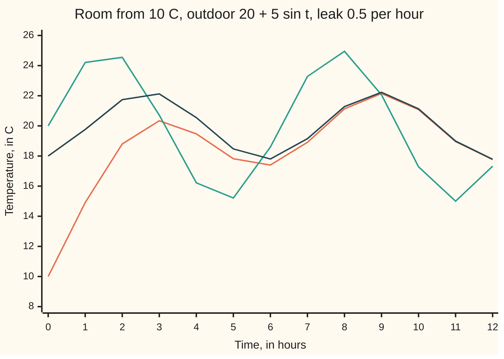

# The integrating factor: multiply by the right function and the left side becomes one derivative

[Syllabus](../../../SYLLABUS.md) → [Differential equations and dynamics](../../../SYLLABUS.md#w08) → [Rate Equations](../../../SYLLABUS.md#w08-s01) → The integrating factor

---

## General Overview

A room sits at 10 C when its heating fails. Heat leaks through the walls toward the air outside, which swings between 15 C and 25 C, one full swing every 6.28 hours (faster than a real day, to keep the numbers small).

By Newton's law of cooling the room gains 0.5 C per hour per degree the outside is warmer. With T the room's temperature in C, t the time in hours and T' the rate of T in C per hour, the law is T' = −0.5(T − (20 + 5 sin t)), with T(0) = 10 ([A differential equation](01-what-a-differential-equation-says.md)).

The rate is a sum, not a product, so [Separable equations](03-separable-equations.md) cannot split it. Instead, multiply both sides by e^(0.5t): the left side becomes the rate of one product, e^(0.5t) times T, and one integration finishes the job. The multiplier is the **integrating factor**.

The answer has two parts. A **transient**, −8e^(−0.5t), is the start's disagreement with the long run, and it dies. A **forced part**, 20 + sin t − 2 cos t, stays: a sine wave of height 2.24 C around 20 C, peaking 1.11 hours after the outdoor peak.

**For a rate law y' + p(t)y = q(t), multiplying by e^(integral of p) turns the left side into the derivative of one product, so one integration solves it, and every answer is a fading transient plus a forced part.**

**What kind of fact this is:** a method, proved on this card in Why it works.

### The picture: the room settles onto the forced swing



Orange: the room. Teal: outdoors. Dark blue: the forced part alone, which the room starts 8 C below and meets to within 0.1 C by 8.76 hours.

---

## The formula

Reminder: y' = f(t, y) reads "the rate of y at time t is f(t, y)", with a start y(0) = y0. An equation is **linear first-order** when y and y' appear only to the first power and never multiply each other. The standard form puts every y on the left:

$$y' + p(t)\,y = q(t), \qquad y(0) = y_0$$

Here p(t), the **coefficient**, is how hard y is pulled back; q(t), the **forcing**, is what is pushed in. The integrating factor is

$$\mu(t) = e^{\int_0^t p(s)\,ds}$$

and the solution is

$$y(t) = \frac{y_0 + \int_0^t \mu(s)\,q(s)\,ds}{\mu(t)}$$

**Read it aloud:** weight each moment's input by the integrating factor then, add it all to the starting value, and divide by the factor now. For a start at time t0, run both integrals from t0.

The room's law, with the T terms moved left, is T' + 0.5T = 10 + 2.5 sin t. So p = 0.5 per hour, q = 10 + 2.5 sin t in C per hour, and μ = e^(0.5t). The formula gives

$$T(t) = 20 + \sin t - 2\cos t - 8e^{-0.5t}$$

| Symbol | Plain meaning | In our example | Push it up and the answer… |
| --- | --- | --- | --- |
| $t$, $s$ | time in hours; s runs over earlier moments inside the integral | 0 to 12 h | — |
| $y$, $T$ | the unknown; here the room's temperature, in C | starts at 10 C | — |
| $y'$, $T'$ | the unknown's rate, in C per hour | T' + 0.5T = 10 + 2.5 sin t | — |
| $p$ | the coefficient: the leak rate, per hour | 0.5 | faster fade, bigger swing, shorter lag |
| $q$ | the forcing, in C per hour | 10 + 2.5 sin t | a warmer forced part |
| $\mu$ | the integrating factor, e^(integral of p) | e^(0.5t) | — |
| $y_0$ | the starting value | 10 C | moves only the transient |
| $C$ | the transient's size, fixed by the start | −8 C | — |

### When it holds

- **Linear in the unknown.** A law with y^2 or sin y fails; some become linear after a substitution ([Bernoulli and Riccati equations](09-bernoulli-and-riccati-substitutions.md)).
- **The rate carries coefficient 1.** Divide a(t)y' + b(t)y = c(t) by a(t) first. Where a(t) is zero the method stops: t y' + y = 0 gives y = 1/t, which cannot cross t = 0.
- **p and q continuous on an interval.** Then exactly one solution exists on the whole interval, and it never blows up partway, as y' = y^2 does.
- **The transient fades when μ grows without bound,** as it does for a constant p > 0. With a constant p < 0 the start's disagreement grows instead.

---

## Why it works

### Step 0: the left side is almost a product rule

The product rule says (μy)' = μy' + μ'y ([Product and quotient rules](../../06-Calculus%20and%20analysis/02-Derivatives/02-product-and-quotient-rules.md)). Multiply the equation's left side by some μ and it reads μy' + μpy. The two match when μ' = pμ: a function whose rate is p times itself, which is an exponential ([Growth, decay and cooling](04-exponential-growth-decay-and-cooling.md)). The product rule, run backwards.

### Step 1: build the weight

Take μ(t) = e^(integral of p from 0 to t). The chain rule and the fundamental theorem of calculus give μ' = p(t)μ, and μ(0) = 1. An exponential is never zero, so dividing by μ later is allowed. For the room, μ = e^(0.5t).

### Step 2: multiply, and the left side collapses

Multiply y' + py = q by μ. The left side is μy' + μ'y, which is (μy)', so (μy)' = μq. For the room: (e^(0.5t)T)' = e^(0.5t)(10 + 2.5 sin t).

### Step 3: integrate once from the start

Integrate both sides from 0 to t. The left gives μ(t)y(t) − y0, since μ(0) = 1. Divide by μ(t): the formula. Any solution must satisfy it, so there is only one.

For the room, two integrals. The steady input's, of 10e^(0.5s) from 0 to t, is 20e^(0.5t) − 20. The swinging input needs integration by parts twice ([Integration by parts](../../06-Calculus%20and%20analysis/04-Integrals/04-integration-by-parts.md)) and gives e^(0.5t)(sin t − 2 cos t) + 2. Add the start, 10, and divide by e^(0.5t): T = 20 + sin t − 2 cos t + (10 − 20 + 2)e^(−0.5t).

<details>
<summary>The algebra behind this</summary>

Call J the integral of e^(0.5s) sin s. By parts, integrating e^(0.5s) to 2e^(0.5s): J = 2e^(0.5s) sin s − 2 × (integral of e^(0.5s) cos s), and that integral is 2e^(0.5s) cos s + 2J.
Substitute: J = 2e^(0.5s) sin s − 4e^(0.5s) cos s − 4J, so 5J = e^(0.5s)(2 sin s − 4 cos s) and J = e^(0.5s)(0.4 sin s − 0.8 cos s).
Times 2.5: e^(0.5s)(sin s − 2 cos s). Between 0 and t this is e^(0.5t)(sin t − 2 cos t) − (0 − 2), which is the "+ 2" above.

</details>

### Step 4: every answer is transient plus forced

Two solutions with the same p and q differ by some d with d' + pd = 0, since the q's cancel, so by Step 3 d = d(0)/μ(t). Every solution is one particular solution plus a multiple of 1/μ. For the room the particular solution worth choosing repeats with the weather: 20 + sin t − 2 cos t.

By the angle-addition rule, a sin t + b cos t is a sine of height √(a^2 + b^2), shifted in time. Here a = 1 and b = −2: height √5 = 2.24 C, shift the angle whose tangent is 2, which is 1.11. The outdoor swing turns 1 radian per hour, so that is 1.11 hours. With leak k per hour, the height is 5k/√(k^2 + 1) and the delay the angle whose tangent is 1/k: a leaky room follows outside closely.

<details>
<summary>Detailed proof: one solution, on the whole interval</summary>

Let p and q be continuous on an interval I containing 0. By the fundamental theorem and the chain rule, μ is differentiable, positive, and μ' = pμ.

Uniqueness. If y solves the problem, (μy)' = μy' + pμy = μq, so μ(t)y(t) − y0 is the integral of μq from 0 to t: y is the formula.

Existence. The formula's numerator has rate μq, so (μy)' = μq, that is μy' + pμy = μq. Divide by μ > 0. At t = 0 the formula gives y0.

Nothing limits the length of I: the solution lasts while p and q stay continuous.

</details>

A second road steps along the slope in small pieces; the code does it, and [Euler's method](../05-Numerical%20Evolution/01-eulers-method.md) is its card.

---

## Worked numbers, by hand

| Step | Arithmetic | Value |
| --- | --- | --- |
| standard form | move −0.5T left; 0.5 × (20 + 5 sin t) | T' + 0.5T = 10 + 2.5 sin t |
| weight | e^(integral of 0.5) | μ = e^(0.5t) |
| steady input | integral of 10e^(0.5s), 0 to t | 20e^(0.5t) − 20 |
| swinging input | by parts twice | e^(0.5t)(sin t − 2 cos t) + 2 |
| add the start, divide by μ | (10 − 20 + 2)e^(−0.5t) | C = −8 |
| at 10 hours | 20 + sin 10 − 2 cos 10 − 8e^(−5) | **21.08 C** |
| transient at 10 hours | −8e^(−5) | −0.0539 C |
| transient under 0.1 C | 8e^(−0.5t) = 0.1, so t = 2 ln 80 | **8.76 h** |
| forced height and delay | √(1 + 4); angle with tangent 2 | **2.24 C, 1.11 h** |

At 10 hours the room reads 21.08 C, and only 0.05 C of that is the start's doing.

The shelf's coffee is the steady-input case: T' + 0.1T = 2, μ = e^(0.1t), and integrating from 80 C gives T = 20 + 60e^(−0.1t). It reaches 50 C at 10 ln 2 = 6.9315 minutes, as in [Growth, decay and cooling](04-exponential-growth-decay-and-cooling.md).

### What breaks if you drop a piece

| Mistake | Comes out at | What went wrong |
| --- | --- | --- |
| Weight e^(−0.5t) instead of e^(+0.5t) | T(10) = 4731.4 C | Dividing by e^(−0.5t) multiplies the start by e^(+0.5t) |
| Constant dropped | T(0) = 18.00 C, not 10 | The start never entered |
| Input integrated without the weight | T(10) = 0.77 C | Only the weighted input integrates to μy |
| Room copies the outdoor swing | height 5.00, delay 0 | The walls give 2.24 C and 1.11 h |

---

## Code, from first principles, and it actually runs

Three roads. One: the closed answer. Two: (y0 + integral of μq)/μ, the integral added up by Simpson's rule (a weighted sum of samples of the integrand), no integration by parts. Three: Euler's rule on the raw law, new value = old value + step length × rate; its error halves with the step, and a long run measures the late swing directly.

### Python

```python
# The integrating factor -- the check behind the card.  Standard library only.
# A room at 10 C drifts toward an outdoor temperature that swings round 20 C:
# T' = -0.5 (T - (20 + 5 sin t)), T(0) = 10, t in hours.  Road one: the answer
# found with the weight e^(0.5t).  Road two: the weighted-input formula, its
# integral added up by Simpson's rule.  Road three: Euler steps on the law.
import math

K, T0 = 0.5, 10.0
def outdoor(t): return 20 + 5 * math.sin(t)
def law(t, T): return -K * (T - outdoor(t))                # the room's rate, C per hour
def forced(t): return 20 + math.sin(t) - 2 * math.cos(t)   # the part that stays
def closed(t): return forced(t) - 8 * math.exp(-K * t)     # plus the transient

def simpson(f, a, b, n=2000):             # area under f from a to b, n even
    s = f(a) + f(b) + sum((4 if i % 2 else 2) * f(a + i * (b - a) / n) for i in range(1, n))
    return s * (b - a) / (3 * n)

def via_weight(t, p, q, y0):              # y = (y0 + integral of mu q) / mu, mu = e^(pt)
    return (y0 + simpson(lambda s: math.exp(p * s) * q(s), 0, t)) / math.exp(p * t)

def euler(t_end, h, t=0.0, T=T0):         # plain small steps along the slope
    for _ in range(round((t_end - t) / h)):
        T, t = T + h * law(t, T), t + h
    return T

errs = [abs(euler(10, h) - closed(10)) for h in (0.1, 0.05, 0.025)]
T30, h = euler(30, 0.001), 0.001          # late in the day: the transient is gone
late = []
for i in range(round(2 * math.pi / h)):   # one full outdoor swing, stepped
    late.append((T30, 30 + i * h))
    T30 = T30 + h * law(30 + i * h, T30)
top, t_top = max(late)
swing = (top - min(late)[0]) / 2
lag = t_top - (math.pi / 2 + 10 * math.pi)  # outdoor peaks at t = pi/2 + 2 pi n
lo, hi = 0.0, 20.0                        # house coffee: T' = -0.1 (T - 20), by bisection
for _ in range(50):
    mid = (lo + hi) / 2
    lo, hi = (mid, hi) if via_weight(mid, 0.1, lambda s: 2.0, 80.0) > 50 else (lo, mid)
fd = (closed(3.001) - closed(2.999)) / 0.002
print("t (h)       ", list(range(13)))
print("outdoor (C) ", ", ".join(f"{outdoor(t):.2f}" for t in range(13)))
print("room T (C)  ", ", ".join(f"{closed(t):.2f}" for t in range(13)))
print("forced (C)  ", ", ".join(f"{forced(t):.2f}" for t in range(13)))
print(f"T(10): weight answer {closed(10):.4f}; Simpson on the weighted input {via_weight(10, K, lambda s: K * outdoor(s), T0):.4f}")
print("Euler error at t = 10, h = 0.1, 0.05, 0.025:", " ".join(f"{e:.5f}" for e in errs))
print(f"error ratios on halving h: {errs[0] / errs[1]:.3f} {errs[1] / errs[2]:.3f}")
print(f"rate at t = 3: finite difference {fd:.4f}; law {law(3, closed(3)):.4f}")
print(f"swing: formula 5 x {K / math.sqrt(K * K + 1):.4f} = {5 * K / math.sqrt(K * K + 1):.4f}; Euler, one late cycle {swing:.4f}")
print(f"lag: formula atan(1/k) = {math.atan(1 / K):.4f} h of a {2 * math.pi:.2f} h swing; Euler peak after outdoor peak {lag:.3f} h")
print(f"transient -8e^(-0.5t): at t = 10 {-8 * math.exp(-5):.4f}; under 0.1 C after {2 * math.log(80):.2f} h")
print(f"coffee reaches 50 C: weight formula + bisection {lo:.4f} min; 10 ln 2 = {10 * math.log(2):.4f} min")
print(f"mistake, weight e^(-0.5t) carried through: T(10) = {via_weight(10, -K, lambda s: K * outdoor(s), T0):.1f}")
print(f"mistake, constant dropped: T(0) = {forced(0):.2f}, not 10")
print(f"mistake, input not weighted: T(10) = {math.exp(-5) * (T0 + simpson(lambda s: K * outdoor(s), 0, 10)):.2f}")
print(f"mistake, room copies outdoor: swing 5.00, lag 0; truth {math.sqrt(5):.2f} and {math.atan(2):.2f} h")
assert abs(via_weight(10, K, lambda s: K * outdoor(s), T0) - closed(10)) < 1e-9   # road two
assert 1.8 < errs[0] / errs[1] < 2.2 and 1.8 < errs[1] / errs[2] < 2.2            # order one
assert abs(swing - math.sqrt(5)) < 0.005 and abs(lag - math.atan(2)) < 0.005     # road three
assert abs(fd - law(3, closed(3))) < 1e-6 and abs(lo - 10 * math.log(2)) < 1e-6
print("ALL CHECKS PASS")
```

**Ran 2026-09-28 on macOS, Python 3.14.6, standard library only. All checks passed. Output, pasted from the run:**

```
t (h)        [0, 1, 2, 3, 4, 5, 6, 7, 8, 9, 10, 11, 12]
outdoor (C)  20.00, 24.21, 24.55, 20.71, 16.22, 15.21, 18.60, 23.28, 24.95, 22.06, 17.28, 15.00, 17.32
room T (C)   10.00, 14.91, 18.80, 20.34, 19.47, 17.82, 17.40, 18.91, 21.13, 22.15, 21.08, 18.96, 17.76
forced (C)   18.00, 19.76, 21.74, 22.12, 20.55, 18.47, 17.80, 19.15, 21.28, 22.23, 21.13, 18.99, 17.78
T(10): weight answer 21.0802; Simpson on the weighted input 21.0802
Euler error at t = 10, h = 0.1, 0.05, 0.025: 0.10880 0.05395 0.02687
error ratios on halving h: 2.017 2.008
rate at t = 3: finite difference 0.1848; law 0.1848
swing: formula 5 x 0.4472 = 2.2361; Euler, one late cycle 2.2365
lag: formula atan(1/k) = 1.1071 h of a 6.28 h swing; Euler peak after outdoor peak 1.107 h
transient -8e^(-0.5t): at t = 10 -0.0539; under 0.1 C after 8.76 h
coffee reaches 50 C: weight formula + bisection 6.9315 min; 10 ln 2 = 6.9315 min
mistake, weight e^(-0.5t) carried through: T(10) = 4731.4
mistake, constant dropped: T(0) = 18.00, not 10
mistake, input not weighted: T(10) = 0.77
mistake, room copies outdoor: swing 5.00, lag 0; truth 2.24 and 1.11 h
ALL CHECKS PASS
```

### Rust

Same numbers, same labels, built with `rustc --edition 2021 -O`.

```rust
// The integrating factor -- the same check as the Python, in Rust.  No crates.
// A room at 10 C drifts toward an outdoor temperature that swings round 20 C:
// T' = -0.5 (T - (20 + 5 sin t)), T(0) = 10, t in hours.  Road one: the answer
// found with the weight e^(0.5t).  Road two: the weighted-input formula, its
// integral added up by Simpson's rule.  Road three: Euler steps on the law.
const K: f64 = 0.5;
const T0: f64 = 10.0;
const PI: f64 = std::f64::consts::PI;

fn outdoor(t: f64) -> f64 { 20.0 + 5.0 * t.sin() }
fn law(t: f64, temp: f64) -> f64 { -K * (temp - outdoor(t)) }       // the room's rate, C per hour
fn forced(t: f64) -> f64 { 20.0 + t.sin() - 2.0 * t.cos() }         // the part that stays
fn closed(t: f64) -> f64 { forced(t) - 8.0 * (-K * t).exp() }       // plus the transient

fn simpson(f: &dyn Fn(f64) -> f64, a: f64, b: f64, n: usize) -> f64 {
    let mut s = 0.0;                      // area under f from a to b, n even
    for i in 1..n { s += (if i % 2 == 1 { 4.0 } else { 2.0 }) * f(a + i as f64 * (b - a) / n as f64) }
    (f(a) + f(b) + s) * (b - a) / (3.0 * n as f64)
}

fn via_weight(t: f64, p: f64, q: &dyn Fn(f64) -> f64, y0: f64) -> f64 { // (y0 + integral of mu q) / mu
    (y0 + simpson(&|s: f64| (p * s).exp() * q(s), 0.0, t, 2000)) / (p * t).exp()
}

fn euler(t_end: f64, h: f64) -> f64 {     // plain small steps along the slope
    let (mut t, mut temp) = (0.0, T0);
    for _ in 0..(t_end / h).round() as usize { temp += h * law(t, temp); t += h }
    temp
}

fn main() {
    let errs: Vec<f64> = [0.1, 0.05, 0.025].iter().map(|&h| (euler(10.0, h) - closed(10.0)).abs()).collect();
    let (mut t30, h) = (euler(30.0, 0.001), 0.001); // late in the day: the transient is gone
    let (mut top, mut t_top, mut bottom) = (f64::MIN, 0.0, f64::MAX);
    for i in 0..(2.0 * PI / h).round() as usize {    // one full outdoor swing, stepped
        let t = 30.0 + i as f64 * h;
        if t30 > top || (t30 == top && t > t_top) { top = t30; t_top = t }
        if t30 < bottom { bottom = t30 }
        t30 += h * law(t, t30);
    }
    let swing = (top - bottom) / 2.0;
    let lag = t_top - (PI / 2.0 + 10.0 * PI);        // outdoor peaks at t = pi/2 + 2 pi n
    let (mut lo, mut hi) = (0.0f64, 20.0f64);        // house coffee, by bisection
    for _ in 0..50 {
        let mid = (lo + hi) / 2.0;
        if via_weight(mid, 0.1, &|_s: f64| 2.0, 80.0) > 50.0 { lo = mid } else { hi = mid }
    }
    let fd = (closed(3.001) - closed(2.999)) / 0.002;
    let road2 = via_weight(10.0, K, &|s: f64| K * outdoor(s), T0);
    let unweighted = (-5.0f64).exp() * (T0 + simpson(&|s: f64| K * outdoor(s), 0.0, 10.0, 2000));
    let row = |f: &dyn Fn(f64) -> f64| (0..13).map(|t| format!("{:.2}", f(t as f64))).collect::<Vec<_>>().join(", ");
    let e: Vec<String> = errs.iter().map(|x| format!("{:.5}", x)).collect();
    println!("t (h)        {:?}", (0..13).collect::<Vec<i32>>());
    println!("outdoor (C)  {}", row(&outdoor));
    println!("room T (C)   {}", row(&closed));
    println!("forced (C)   {}", row(&forced));
    println!("T(10): weight answer {:.4}; Simpson on the weighted input {:.4}", closed(10.0), road2);
    println!("Euler error at t = 10, h = 0.1, 0.05, 0.025: {}", e.join(" "));
    println!("error ratios on halving h: {:.3} {:.3}", errs[0] / errs[1], errs[1] / errs[2]);
    println!("rate at t = 3: finite difference {:.4}; law {:.4}", fd, law(3.0, closed(3.0)));
    println!("swing: formula 5 x {:.4} = {:.4}; Euler, one late cycle {:.4}", K / (K * K + 1.0).sqrt(), 5.0 * K / (K * K + 1.0).sqrt(), swing);
    println!("lag: formula atan(1/k) = {:.4} h of a {:.2} h swing; Euler peak after outdoor peak {:.3} h", (1.0 / K).atan(), 2.0 * PI, lag);
    println!("transient -8e^(-0.5t): at t = 10 {:.4}; under 0.1 C after {:.2} h", -8.0 * (-5f64).exp(), 2.0 * 80f64.ln());
    println!("coffee reaches 50 C: weight formula + bisection {:.4} min; 10 ln 2 = {:.4} min", lo, 10.0 * 2f64.ln());
    println!("mistake, weight e^(-0.5t) carried through: T(10) = {:.1}", via_weight(10.0, -K, &|s: f64| K * outdoor(s), T0));
    println!("mistake, constant dropped: T(0) = {:.2}, not 10", forced(0.0));
    println!("mistake, input not weighted: T(10) = {:.2}", unweighted);
    println!("mistake, room copies outdoor: swing 5.00, lag 0; truth {:.2} and {:.2} h", 5f64.sqrt(), 2f64.atan());
    assert!((road2 - closed(10.0)).abs() < 1e-9);                                  // road two
    assert!(errs[0] / errs[1] > 1.8 && errs[0] / errs[1] < 2.2 && errs[1] / errs[2] > 1.8 && errs[1] / errs[2] < 2.2);
    assert!((swing - 5f64.sqrt()).abs() < 0.005 && (lag - 2f64.atan()).abs() < 0.005); // road three
    assert!((fd - law(3.0, closed(3.0))).abs() < 1e-6 && (lo - 10.0 * 2f64.ln()).abs() < 1e-6);
    println!("ALL CHECKS PASS");
}
```

**Ran 2026-09-28 on macOS, rustc 1.98.1, no crates. All checks passed. Output, pasted from the run:**

```
t (h)        [0, 1, 2, 3, 4, 5, 6, 7, 8, 9, 10, 11, 12]
outdoor (C)  20.00, 24.21, 24.55, 20.71, 16.22, 15.21, 18.60, 23.28, 24.95, 22.06, 17.28, 15.00, 17.32
room T (C)   10.00, 14.91, 18.80, 20.34, 19.47, 17.82, 17.40, 18.91, 21.13, 22.15, 21.08, 18.96, 17.76
forced (C)   18.00, 19.76, 21.74, 22.12, 20.55, 18.47, 17.80, 19.15, 21.28, 22.23, 21.13, 18.99, 17.78
T(10): weight answer 21.0802; Simpson on the weighted input 21.0802
Euler error at t = 10, h = 0.1, 0.05, 0.025: 0.10880 0.05395 0.02687
error ratios on halving h: 2.017 2.008
rate at t = 3: finite difference 0.1848; law 0.1848
swing: formula 5 x 0.4472 = 2.2361; Euler, one late cycle 2.2365
lag: formula atan(1/k) = 1.1071 h of a 6.28 h swing; Euler peak after outdoor peak 1.107 h
transient -8e^(-0.5t): at t = 10 -0.0539; under 0.1 C after 8.76 h
coffee reaches 50 C: weight formula + bisection 6.9315 min; 10 ln 2 = 6.9315 min
mistake, weight e^(-0.5t) carried through: T(10) = 4731.4
mistake, constant dropped: T(0) = 18.00, not 10
mistake, input not weighted: T(10) = 0.77
mistake, room copies outdoor: swing 5.00, lag 0; truth 2.24 and 1.11 h
ALL CHECKS PASS
```

The two outputs match line for line.

> [!TIP]
> **Try changing**
> Guess first, then run it.
> - **A leakier room.** Set `K, T0 = 1.0, 10.0`. Euler measures swing 3.5364 and delay 0.785 h; the formula says 3.5355 and 0.7854. The first assert stops the run: the closed answer assumes k = 0.5.
> - **A warmer start.** Set `T0` to `20.0`. Swing and delay stay put; road two gives T(10) = 21.1476, and the first assert fails, since −8 belongs to a 10 C start.
> - **Smaller steps.** Replace `(0.1, 0.05, 0.025)` with `(0.05, 0.025, 0.0125)`. The errors become 0.05395, 0.02687 and 0.01341: still halving.

---

## The usual mistake

> [!warning]
> **Getting the weight's sign backwards.** The transient is e^(−0.5t); the weight is its reciprocal, e^(+0.5t). With e^(−0.5t) the left side is no longer one derivative; carried through anyway, the room reaches 4731.4 C at 10 hours. Expand (μy)' once before integrating: it must give μy' + μpy.
>
> - **Dropping the constant.** Without it the answer starts at 18.00 C, not 10.
> - **Integrating the input without the weight.** 0.77 C at 10 hours, not 21.08.
> - **Assuming the room copies the weather.** The forced swing is 2.24 C high and 1.11 hours late, not 5 C and on time.

---

## Where you meet it in real life

- **Circuits.** A capacitor charged through a resistor from an alternating supply obeys this law, its voltage shrunk and delayed.
- **Drug infusion.** A drip adds a dose while the body clears a fixed fraction per hour ([Mixing tanks](06-mixing-tanks-and-compartments.md)).
- **Mean-reverting rates.** An interest rate pulled toward a long-run level is this law with random kicks; wing 11 adds the noise ([Mean reversion](../../11-Stochastic%20processes%20and%20calculus/06-Ito%20Calculus/05-ornstein-uhlenbeck-and-cir-processes.md)).

> **Say it back**
> A linear first-order law is y' + p(t)y = q(t). Multiplying by μ = e^(integral of p) makes the left side the derivative of μy. One integration and a division by μ give the only solution. Any two solutions differ by a multiple of 1/μ, so every answer is a fading transient plus a forced part. The room settles into a 2.24 C swing, 1.11 hours behind the weather.

---

## What this builds on

- [Growth, decay and cooling](04-exponential-growth-decay-and-cooling.md): the exponential whose rate is a multiple of itself, which the weight is.
- [Product and quotient rules](../../06-Calculus%20and%20analysis/02-Derivatives/02-product-and-quotient-rules.md): the rule that Step 0 runs backwards.
- [Integration by parts](../../06-Calculus%20and%20analysis/04-Integrals/04-integration-by-parts.md): the weighted sine's integral.

## Where this goes next

- [Mixing tanks](06-mixing-tanks-and-compartments.md): the method on tanks with inflow and outflow.
- [Bernoulli and Riccati equations](09-bernoulli-and-riccati-substitutions.md): nonlinear laws that a substitution makes linear.
- [Forced systems](../04-Systems%20and%20the%20Matrix%20Exponential/06-forced-systems-and-variation-of-constants.md): the same weighted integral with a matrix in place of p.
- [Stiff equations](../05-Numerical%20Evolution/06-stiff-equations-and-backward-euler.md): what goes wrong for plain steps when p is large.
- [Mean reversion](../../11-Stochastic%20processes%20and%20calculus/06-Ito%20Calculus/05-ornstein-uhlenbeck-and-cir-processes.md): this equation with noise, solved by the same weight.

---

## Sources

Verified 2026-09-28: every link below resolves to the publisher's page.

- Lebl, Jiří. *Notes on Diffy Qs*, section 1.4, "Linear equations and the integrating factor". [Free text](https://www.jirka.org/diffyqs/html/intfactor_section.html). The construction and the definite-integral answer.
- OpenStax. *Calculus Volume 2*, section 4.5, "First-Order Linear Equations". [Free text](https://openstax.org/books/calculus-volume-2/pages/4-5-first-order-linear-equations). The recipe with circuit examples.
- Boyce, William E., Richard C. DiPrima and Douglas B. Meade. *Elementary Differential Equations*, 12th ed. Wiley, 2021. [Publisher page](https://www.wiley.com/en-us/Elementary+Differential+Equations%2C+12th+Edition-p-9781119777755). Sections 2.1 and 2.4: the method and its existence theorem.
- Teschl, Gerald. *Ordinary Differential Equations and Dynamical Systems*. AMS Graduate Studies in Mathematics 140, 2012. [Author's text, posted with AMS permission](https://mat.univie.ac.at/~gerald/ftp/book-ode/). Chapters 1 and 2: explicit solutions, then the careful proofs.
