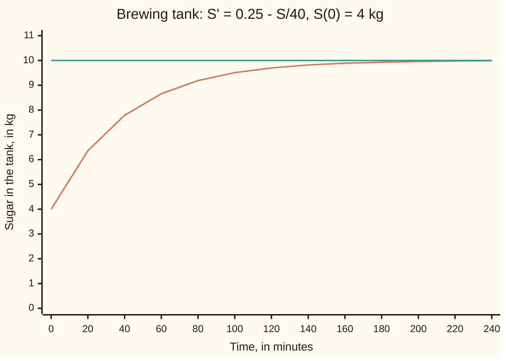
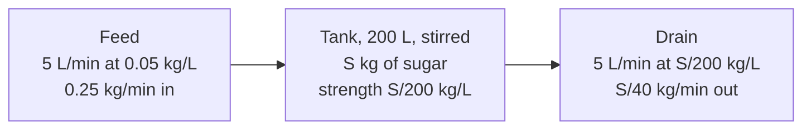

# Mixing tanks: rate in minus rate out is a differential equation, and units keep you honest

[Syllabus](../../../SYLLABUS.md) → [Differential equations and dynamics](../../../SYLLABUS.md#w08) → [Rate Equations](../../../SYLLABUS.md#w08-s01) → Mixing tanks

---

## General Overview

A brewery's 200 L tank holds 4 kg of dissolved sugar. Syrup at 0.05 kg per litre is pumped in at 5 L a minute; a stirrer keeps the tank even; a drain takes 5 L a minute out. How much sugar is there after an hour?

Sugar arrives at 5 × 0.05 = 0.25 kg a minute. It leaves at the tank's current strength: at the start 4 kg in 200 L is 0.02 kg per litre, and 5 litres of that is 0.10 kg a minute. The tank gains 0.15 kg a minute at first, less as it sweetens, and none once it is as sweet as the syrup: 0.05 kg/L × 200 L = 10 kg.

That bookkeeping is a differential equation: a rule linking an unknown amount to its own rate. Solved, it gives 7.79 kg after 40 minutes and 8.66 kg after an hour. With a drip for the pump and the kidneys for the drain, it gives a drug's level in the blood.

**An amount in a stirred volume changes at the rate in minus the rate out, the outflow carries the volume's own concentration, and every term must be in the same units.**

**What kind of fact this is:** a model: conservation of sugar is exact bookkeeping, "well mixed" is the assumption; the solution is derived on this card in Why it works.

### The picture: sugar in the tank, over four hours



Orange: sugar in the tank, from the solved equation. Teal: 10 kg, where the tank matches the syrup.

---

## The formula

Reminder: y' = f(t, y) says "the rate of y at time t is f(t, y)" ([A differential equation](01-what-a-differential-equation-says.md)). For a tank of fixed volume $V$, fed and drained at flow $q$:

$$S' \;=\; \underbrace{q\,c_{in}}_{\text{rate in}} \;-\; \underbrace{q\,\frac{S}{V}}_{\text{rate out}}$$

**Read it aloud:** the sugar's rate of change is the flow times the feed's strength, minus the flow times the tank's own strength.

Solved (Why it works, Step 2):

$$S(t) \;=\; S_\infty + \big(S(0) - S_\infty\big)\,e^{-t/\tau}, \qquad S_\infty = V c_{in}, \qquad \tau = \frac{V}{q}$$

**Read it aloud:** the amount heads to the feed-strength level, and the gap shrinks by a factor of e every time constant.

For the brewery, $S' = 0.25 - S/40$ and $S = 10 - 6e^{-t/40}$ kg.

| Symbol | Plain meaning | In our example | Push it up and the answer… |
| --- | --- | --- | --- |
| $t$ | time since the pumps started, in minutes | 0 to 240 min | the tank gets closer to 10 kg |
| $S$ | sugar in the tank, in kg | 4 at the start, 8.66 at 60 min | — |
| $S'$ | the rate $S$ changes, in kg/min | 0.15 at the start | — |
| $V$ | liquid in the tank, in litres | 200 L | slower to change, same final level per litre |
| $q$ | flow in, which equals flow out, in L/min | 5 L/min | faster approach to the feed's strength |
| $c_{in}$ | sugar per litre of the feed, in kg/L | 0.05 kg/L | a higher final level |
| $S_\infty$ | the level where in equals out, in kg | 10 kg | — |
| $\tau$ | the time constant $V/q$: minutes to pump one tankful through | 40 min | a slower approach |

### When it holds

- **Well mixed.** The drain must carry the tank's average strength. If syrup short-cuts to the drain, less sugar stays; the tank must be split into zones, each its own compartment.
- **Equal flows.** With 4 L/min out the tank grows a litre a minute and holds 10.90 kg at an hour, not the 9.94 kg a fixed-volume model gives (folded proof below).
- **Nothing made or destroyed inside.** If yeast eats sugar, the balance needs a third term, a sink; without it the model overstates the sugar.

---

## Why it works

### Step 0: over a short time, change = in − out

In a short interval of Δt minutes, q Δt litres of feed arrive, carrying q c_in Δt kg of sugar. The same volume leaves, and because the tank is stirred each litre carries S/V kg. So the sugar changes by about q c_in Δt − q (S/V) Δt. "About", because S drifts a little during the interval; that drift vanishes as Δt shrinks. Divide by Δt and let it shrink: the change per minute becomes the rate, and the equation above appears.



### Step 1: check every term's units

Rate in: (L/min) × (kg/L) = kg/min. Rate out: (L/min) × kg ÷ L = kg/min. S' is kg per minute. All agree, so the equation can be right ([Ratios and rates](../../01-Foundations/01-Everyday%20Arithmetic/09-ratios-and-rates.md)). The common wrong equation S' = 0.25 − 5S fails: 5 L/min times S kg is kg·L/min, not kg/min. The division by 200 went missing.

### Step 2: solve with the integrating factor

Rearranged, S' + S/40 = 0.25: linear, since the unknown appears only to the first power. Multiply by the integrating factor e^(t/40) ([The integrating factor](05-integrating-factor.md)); by the product rule the left side becomes the rate of e^(t/40) S:

$$\big(e^{t/40} S\big)' = 0.25\,e^{t/40} \quad\Longrightarrow\quad e^{t/40} S = 10\,e^{t/40} + C$$

The start fixes the constant C: at t = 0, 4 = 10 + C, so C = −6, and S = 10 − 6e^(−t/40) kg. With equal flows the equation also separates ([Separable equations](03-separable-equations.md)); the integrating factor is the road that survives unequal flows.

### Step 3: check the answer back in the tank

At t = 0 the formula gives 10 − 6 = 4 kg, and its rate is 6/40 = 0.15 kg/min: the overview's numbers. As time passes, e^(−t/40) falls to 0 and S rises to 10 kg. The 6 kg gap shrinks by a factor of e every 40 minutes, the time to pump one tankful through. Half of it is gone at 40 ln 2 = 27.73 min (7 kg), 95% at 40 ln 20 = 119.83 min (9.70 kg).

### Step 4: a drug in the bloodstream is the same tank

A drip gives a patient 20 mg of a drug an hour. The drug spreads through 40 L, its **volume of distribution**: the volume that, at the blood's concentration, would hold all the drug in the body. Kidneys and liver remove the drug from 5 L of blood each hour, the **clearance**. The body is the tank, the drip the feed, clearance the drain:

$$A' = 20 - \frac{5}{40}A \quad\Longrightarrow\quad A = 160\,\big(1 - e^{-t/8}\big) \text{ mg}$$

Here A is the drug in the body in mg, and time is in hours. The level settles at 160 mg, 4.00 mg/L: rate in over clearance. After 12 hours it is 124.30 mg, 3.11 mg/L. The time constant is 40/5 = 8 h, so the half-life is 8 ln 2 = 5.55 h, and 95% of steady state arrives at 8 ln 20 = 23.97 h: between four and five half-lives, the ward rule. One stirred volume is a **one-compartment model**; a drug that also soaks into tissue needs two linked tanks.

<details>
<summary>Detailed proof: unequal flows, when the volume changes</summary>

Feed 5 L/min, drain 4 L/min: the tank holds 200 + t litres. By Step 0, sugar in is 0.25 kg/min and sugar out is 4 L/min at S/(200 + t) kg/L:

$$S' + \frac{4}{200+t}\,S = 0.25$$

The integrating factor is e^(∫ 4/(200+t) dt) = (200+t)^4, which makes the left side the rate of (200+t)^4 S:

$$(200+t)^4 S = 0.05\,(200+t)^5 + C.$$

At t = 0, 200^4 × 4 = 0.05 × 200^5 + C, so C = −6 × 200^4, and

$$S = 0.05\,(200+t) - 6\left(\frac{200}{200+t}\right)^4.$$

At 60 minutes: 260 L and 10.90 kg. A model that keeps 200 L has S' = 0.25 − S/50, so S = 12.5 − 8.5e^(−t/50) and 9.94 kg: it thinks the tank stronger than it is and drains sugar too fast. Substituting this S returns the equation, and the start fixes C, so no other solution starts at 4 kg.

</details>

A second road needs no formula: Euler's rule steps along the rate, new value = old value + step length × rate. The code runs it; its own card is [Euler's method](../05-Numerical%20Evolution/01-eulers-method.md).

---

## Worked numbers, by hand

| Step | Arithmetic | Value |
| --- | --- | --- |
| sugar in | 5 L/min × 0.05 kg/L | 0.25 kg/min |
| sugar out | 5 L/min × S/200 kg/L | S/40 kg/min |
| at the start | 0.25 − 4/40 = 0.25 − 0.10 | 0.15 kg/min |
| level where in = out | 0.25 = S/40 | 10 kg |
| time constant | 200 L ÷ 5 L/min | 40 min |
| fix the constant | 4 = 10 + C | C = −6 |
| after 40 min | 10 − 6e^(−1) | **7.79 kg** |
| after 60 min | 10 − 6e^(−1.5) | **8.66 kg** |

After an hour the tank holds 8.66 kg, 0.0433 kg/L: most of the way from 0.02 kg/L to the syrup's 0.05 kg/L.

### What breaks if you drop a piece

| Mistake | Comes out at | What went wrong |
| --- | --- | --- |
| Outflow written 5S, not 5S/200 | settles at 0.05 kg | Units kg·L/min: the per-litre was dropped |
| Drain at the feed's strength | stays at 4.00 kg | The drain carries the tank's strength, not the feed's |
| Volume held at 200 L with 4 L/min out | 9.94 kg at 60 min, not 10.90 | The tank grows a litre a minute |
| Start from a clean tank | 7.77 kg at 60 min, not 8.66 | The 4 kg already in the tank sets C |

The code prints all four.

---

## Code, from first principles, and it actually runs

Two roads to every answer: the solved formula, and Euler steps on the rate law. The Euler error at 60 minutes halves as the step halves, the mark of a first-order method. Euler also times the 7 kg and 9.70 kg crossings and solves the drip and the unequal-flow tank. In the code, h is the step length.

### Python

```python
# Mixing tanks -- the check behind the card.  Standard library only.
# A 200 L brewing tank holds 4 kg of sugar.  Syrup at 0.05 kg/L flows in at
# 5 L/min and the stirred mix drains at 5 L/min, so S' = 0.25 - S/40.
# Road one: the integrating-factor answer.  Road two: Euler steps on the rate
# law itself.  Second case: a drug dripped into 40 L of body water.
import math

V, Q, C_IN, S0 = 200.0, 5.0, 0.05, 4.0            # L, L/min, kg/L, kg
TAU, S_INF = V / Q, V * C_IN                      # 40 min, 10 kg

def exact(t):                                     # S = 10 - 6 e^(-t/40)
    return S_INF + (S0 - S_INF) * math.exp(-t / TAU)

def euler(rate, y, t_end, h):                     # small steps along the slope
    t = 0.0
    for _ in range(round(t_end / h)):
        y, t = y + h * rate(t, y), t + h
    return y

def crossing(rate, y, level, h):                  # step until y reaches level
    t = 0.0
    while y < level:
        y, t = y + h * rate(t, y), t + h
    return t

tank = lambda t, s: Q * C_IN - Q * s / V          # kg/min in minus kg/min out
drug = lambda t, a: 20.0 - 5.0 * a / 40.0         # mg/h dripped in minus mg/h cleared
grow = lambda t, s: Q * C_IN - 4.0 * s / (V + t)  # drain cut to 4 L/min: tank fills
errs = [abs(euler(tank, S0, 60, h) - exact(60)) for h in (1, 0.5, 0.25)]
drug_12 = 160 * (1 - math.exp(-12 / 8))           # A = 160 (1 - e^(-t/8)) mg
grow_60 = 0.05 * 260 - 6 * (200 / 260) ** 4       # integrating factor (200 + t)^4
fixed_60 = 12.5 - 8.5 * math.exp(-60 / 50)        # wrong: volume held at 200 L
print(f"in {Q * C_IN:.2f} kg/min; out S/{TAU:.0f} kg/min, {Q * S0 / V:.2f} at t = 0 ({S0 / V:.2f} kg/L); net {tank(0, S0):.2f} kg/min")
print(f"S = {S_INF:.0f} - {S_INF - S0:.0f} e^(-t/{TAU:.0f}); settles at {S_INF:.2f} kg = {C_IN} kg/L x {V:.0f} L")
print("t (min)", " ".join(f"{t}" for t in range(0, 241, 20)))
print("S (kg) ", " ".join(f"{exact(t):.2f}" for t in range(0, 241, 20)))
print(f"S(40) = {exact(40):.4f} kg; S(60) = {exact(60):.4f} kg, {exact(60) / V:.4f} kg/L")
print(f"Euler h = 0.01 to t = 60: {euler(tank, S0, 60, 0.01):.4f} kg")
print("Euler error at t = 60, h = 1, 0.5, 0.25:", " ".join(f"{e:.4f}" for e in errs))
print(f"error ratios on halving h: {errs[0] / errs[1]:.3f} {errs[1] / errs[2]:.3f}")
print(f"S = 7 kg: formula 40 ln 2 = {TAU * math.log(2):.2f} min; Euler {crossing(tank, S0, 7, 0.001):.2f} min")
print(f"S = 9.70 kg: formula 40 ln 20 = {TAU * math.log(20):.2f} min; Euler {crossing(tank, S0, 9.7, 0.001):.2f} min")
print(f"drug: 20 mg/h into 40 L, cleared 5 L/h; settles at {20 / (5 / 40):.0f} mg = {20 / 5:.2f} mg/L; half-life 8 ln 2 = {8 * math.log(2):.2f} h")
print(f"drug at 12 h: formula {drug_12:.2f} mg; Euler {euler(drug, 0.0, 12, 0.001):.2f} mg; {drug_12 / 40:.2f} mg/L")
print(f"drug at 95% (152 mg): formula 8 ln 20 = {8 * math.log(20):.2f} h; Euler {crossing(drug, 0.0, 152, 0.0001):.2f} h")
print(f"drain 4 L/min, S(60): formula {grow_60:.2f} kg; Euler {euler(grow, S0, 60, 0.001):.2f} kg; in {V + 60:.0f} L")
print(f"mistake, volume held at 200 L with 4 L/min out: S(60) = {fixed_60:.2f} kg")
print(f"mistake, outflow 5S not 5S/200: settles at {euler(lambda t, s: 0.25 - 5 * s, S0, 60, 0.01):.2f} kg")
print(f"mistake, drain at the feed's 0.05 kg/L: S(60) = {euler(lambda t, s: 0.25 - 5 * 0.05, S0, 60, 0.01):.2f} kg")
print(f"mistake, start from a clean tank: S(60) = {S_INF * (1 - math.exp(-60 / TAU)):.2f} kg")
assert abs(euler(tank, S0, 60, 0.01) - exact(60)) < 1e-3         # road two meets road one
assert 1.8 < errs[0] / errs[1] < 2.2 and 1.8 < errs[1] / errs[2] < 2.2  # error halves: order one
assert abs(euler(drug, 0.0, 12, 0.001) - drug_12) < 1e-2        # the drug, both roads
assert abs(euler(grow, S0, 60, 0.001) - grow_60) < 1e-3         # unequal flows, both roads
print("ALL CHECKS PASS")
```

**Ran 2026-09-28 on macOS, Python 3.14.6, standard library only. All checks passed. Output, pasted from the run:**

```
in 0.25 kg/min; out S/40 kg/min, 0.10 at t = 0 (0.02 kg/L); net 0.15 kg/min
S = 10 - 6 e^(-t/40); settles at 10.00 kg = 0.05 kg/L x 200 L
t (min) 0 20 40 60 80 100 120 140 160 180 200 220 240
S (kg)  4.00 6.36 7.79 8.66 9.19 9.51 9.70 9.82 9.89 9.93 9.96 9.98 9.99
S(40) = 7.7927 kg; S(60) = 8.6612 kg, 0.0433 kg/L
Euler h = 0.01 to t = 60: 8.6615 kg
Euler error at t = 60, h = 1, 0.5, 0.25: 0.0253 0.0126 0.0063
error ratios on halving h: 2.007 2.004
S = 7 kg: formula 40 ln 2 = 27.73 min; Euler 27.73 min
S = 9.70 kg: formula 40 ln 20 = 119.83 min; Euler 119.83 min
drug: 20 mg/h into 40 L, cleared 5 L/h; settles at 160 mg = 4.00 mg/L; half-life 8 ln 2 = 5.55 h
drug at 12 h: formula 124.30 mg; Euler 124.30 mg; 3.11 mg/L
drug at 95% (152 mg): formula 8 ln 20 = 23.97 h; Euler 23.97 h
drain 4 L/min, S(60): formula 10.90 kg; Euler 10.90 kg; in 260 L
mistake, volume held at 200 L with 4 L/min out: S(60) = 9.94 kg
mistake, outflow 5S not 5S/200: settles at 0.05 kg
mistake, drain at the feed's 0.05 kg/L: S(60) = 4.00 kg
mistake, start from a clean tank: S(60) = 7.77 kg
ALL CHECKS PASS
```

### Rust

Same numbers, same labels, built with `rustc --edition 2021 -O`.

```rust
// Mixing tanks -- the same check as the Python, in Rust.  No crates.
// A 200 L brewing tank holds 4 kg of sugar.  Syrup at 0.05 kg/L flows in at
// 5 L/min and the stirred mix drains at 5 L/min, so S' = 0.25 - S/40.
// Road one: the integrating-factor answer.  Road two: Euler steps on the rate
// law itself.  Second case: a drug dripped into 40 L of body water.
const V: f64 = 200.0; // L
const Q: f64 = 5.0; // L/min
const C_IN: f64 = 0.05; // kg/L
const S0: f64 = 4.0; // kg
const TAU: f64 = V / Q; // 40 min
const S_INF: f64 = V * C_IN; // 10 kg

fn exact(t: f64) -> f64 { S_INF + (S0 - S_INF) * (-t / TAU).exp() } // S = 10 - 6 e^(-t/40)

fn euler(rate: &dyn Fn(f64, f64) -> f64, mut y: f64, t_end: f64, h: f64) -> f64 {
    let mut t = 0.0; // small steps along the slope
    for _ in 0..(t_end / h).round() as usize { y += h * rate(t, y); t += h }
    y
}

fn crossing(rate: &dyn Fn(f64, f64) -> f64, mut y: f64, level: f64, h: f64) -> f64 {
    let mut t = 0.0; // step until y reaches level
    while y < level { y += h * rate(t, y); t += h }
    t
}

fn main() {
    let tank = |_t: f64, s: f64| Q * C_IN - Q * s / V; // kg/min in minus kg/min out
    let drug = |_t: f64, a: f64| 20.0 - 5.0 * a / 40.0; // mg/h dripped in minus mg/h cleared
    let grow = |t: f64, s: f64| Q * C_IN - 4.0 * s / (V + t); // drain cut to 4 L/min: tank fills
    let errs: Vec<f64> = [1.0, 0.5, 0.25].iter().map(|&h| (euler(&tank, S0, 60.0, h) - exact(60.0)).abs()).collect();
    let drug_12 = 160.0 * (1.0 - (-12.0f64 / 8.0).exp()); // A = 160 (1 - e^(-t/8)) mg
    let grow_60 = 0.05 * 260.0 - 6.0 * (200.0f64 / 260.0).powi(4); // integrating factor (200 + t)^4
    let fixed_60 = 12.5 - 8.5 * (-60.0f64 / 50.0).exp(); // wrong: volume held at 200 L
    let ts: Vec<String> = (0..13).map(|i| format!("{}", 20 * i)).collect();
    let ss: Vec<String> = (0..13).map(|i| format!("{:.2}", exact(20.0 * i as f64))).collect();
    let es: Vec<String> = errs.iter().map(|e| format!("{:.4}", e)).collect();
    println!("in {:.2} kg/min; out S/{:.0} kg/min, {:.2} at t = 0 ({:.2} kg/L); net {:.2} kg/min", Q * C_IN, TAU, Q * S0 / V, S0 / V, tank(0.0, S0));
    println!("S = {:.0} - {:.0} e^(-t/{:.0}); settles at {:.2} kg = {} kg/L x {:.0} L", S_INF, S_INF - S0, TAU, S_INF, C_IN, V);
    println!("t (min) {}", ts.join(" "));
    println!("S (kg)  {}", ss.join(" "));
    println!("S(40) = {:.4} kg; S(60) = {:.4} kg, {:.4} kg/L", exact(40.0), exact(60.0), exact(60.0) / V);
    println!("Euler h = 0.01 to t = 60: {:.4} kg", euler(&tank, S0, 60.0, 0.01));
    println!("Euler error at t = 60, h = 1, 0.5, 0.25: {}", es.join(" "));
    println!("error ratios on halving h: {:.3} {:.3}", errs[0] / errs[1], errs[1] / errs[2]);
    println!("S = 7 kg: formula 40 ln 2 = {:.2} min; Euler {:.2} min", TAU * 2f64.ln(), crossing(&tank, S0, 7.0, 0.001));
    println!("S = 9.70 kg: formula 40 ln 20 = {:.2} min; Euler {:.2} min", TAU * 20f64.ln(), crossing(&tank, S0, 9.7, 0.001));
    println!("drug: 20 mg/h into 40 L, cleared 5 L/h; settles at {:.0} mg = {:.2} mg/L; half-life 8 ln 2 = {:.2} h", 20.0 / (5.0 / 40.0), 20.0 / 5.0, 8.0 * 2f64.ln());
    println!("drug at 12 h: formula {:.2} mg; Euler {:.2} mg; {:.2} mg/L", drug_12, euler(&drug, 0.0, 12.0, 0.001), drug_12 / 40.0);
    println!("drug at 95% (152 mg): formula 8 ln 20 = {:.2} h; Euler {:.2} h", 8.0 * 20f64.ln(), crossing(&drug, 0.0, 152.0, 0.0001));
    println!("drain 4 L/min, S(60): formula {:.2} kg; Euler {:.2} kg; in {:.0} L", grow_60, euler(&grow, S0, 60.0, 0.001), V + 60.0);
    println!("mistake, volume held at 200 L with 4 L/min out: S(60) = {:.2} kg", fixed_60);
    println!("mistake, outflow 5S not 5S/200: settles at {:.2} kg", euler(&|_t, s| 0.25 - 5.0 * s, S0, 60.0, 0.01));
    println!("mistake, drain at the feed's 0.05 kg/L: S(60) = {:.2} kg", euler(&|_t, _s| 0.25 - 5.0 * 0.05, S0, 60.0, 0.01));
    println!("mistake, start from a clean tank: S(60) = {:.2} kg", S_INF * (1.0 - (-60.0 / TAU).exp()));
    assert!((euler(&tank, S0, 60.0, 0.01) - exact(60.0)).abs() < 1e-3); // road two meets road one
    assert!(errs[0] / errs[1] > 1.8 && errs[0] / errs[1] < 2.2 && errs[1] / errs[2] > 1.8 && errs[1] / errs[2] < 2.2);
    assert!((euler(&drug, 0.0, 12.0, 0.001) - drug_12).abs() < 1e-2); // the drug, both roads
    assert!((euler(&grow, S0, 60.0, 0.001) - grow_60).abs() < 1e-3); // unequal flows, both roads
    println!("ALL CHECKS PASS");
}
```

**Ran 2026-09-28 on macOS, rustc 1.98.1, no crates. All checks passed. Output, pasted from the run:**

```
in 0.25 kg/min; out S/40 kg/min, 0.10 at t = 0 (0.02 kg/L); net 0.15 kg/min
S = 10 - 6 e^(-t/40); settles at 10.00 kg = 0.05 kg/L x 200 L
t (min) 0 20 40 60 80 100 120 140 160 180 200 220 240
S (kg)  4.00 6.36 7.79 8.66 9.19 9.51 9.70 9.82 9.89 9.93 9.96 9.98 9.99
S(40) = 7.7927 kg; S(60) = 8.6612 kg, 0.0433 kg/L
Euler h = 0.01 to t = 60: 8.6615 kg
Euler error at t = 60, h = 1, 0.5, 0.25: 0.0253 0.0126 0.0063
error ratios on halving h: 2.007 2.004
S = 7 kg: formula 40 ln 2 = 27.73 min; Euler 27.73 min
S = 9.70 kg: formula 40 ln 20 = 119.83 min; Euler 119.83 min
drug: 20 mg/h into 40 L, cleared 5 L/h; settles at 160 mg = 4.00 mg/L; half-life 8 ln 2 = 5.55 h
drug at 12 h: formula 124.30 mg; Euler 124.30 mg; 3.11 mg/L
drug at 95% (152 mg): formula 8 ln 20 = 23.97 h; Euler 23.97 h
drain 4 L/min, S(60): formula 10.90 kg; Euler 10.90 kg; in 260 L
mistake, volume held at 200 L with 4 L/min out: S(60) = 9.94 kg
mistake, outflow 5S not 5S/200: settles at 0.05 kg
mistake, drain at the feed's 0.05 kg/L: S(60) = 4.00 kg
mistake, start from a clean tank: S(60) = 7.77 kg
ALL CHECKS PASS
```

The two outputs match line for line.

> [!TIP]
> **Try changing**
> Guess first, then run it.
> - **Double the pumps.** Set `Q` to `10.0`. S(40) reads 9.1880 kg, the old value at 80 minutes. The last assert stops the run: its formula assumes 5 L/min.
> - **Longer steps.** Use `(4, 2, 1)` for the step lengths. The ratios stay near 2; the last error is the old first, 0.0253.
> - **Halve the clearance.** In `drug`, change `5.0 * a` to `2.5 * a`. The steady level doubles; the drug formula still says 5 L/h, so the third assert stops the run.

---

## The usual mistake

> [!warning]
> **Writing the outflow as flow times amount instead of flow times concentration.** Each litre drained carries S/200 kg, not S kg. Written as 5S, the equation settles at 0.05 kg, the feed's strength misread as a mass. A units check on each term catches it before any solving.
>
> - **Mixing hours and minutes.** Clearance in L/h against a drip in mg/min is off by a factor of 60.

---

## Where you meet it in real life

- **Brewing and food processing.** Blending toward a target strength, or flushing between batches, with time constant volume over flow.
- **Drug dosing.** An infusion's steady level is rate in over clearance, reached in four to five half-lives.
- **Cooling.** A cup losing heat to a room is the same shape with the room as the feed ([Growth, decay and cooling](04-exponential-growth-decay-and-cooling.md)).

> **Say it back**
> In a stirred volume, the amount's rate of change is rate in minus rate out. The rate out is the outflow times the volume's own concentration. Every term must be in amount per time; one that is not is wrong. With equal flows the amount heads to the feed's strength, closing the gap by a factor of e every volume-over-flow. The tank holds 8.66 kg after an hour; a drug drip settles at rate in over clearance.

---

## What this builds on

- [The integrating factor](05-integrating-factor.md): the multiplier that makes a linear equation's left side a single rate, used in Step 2 and the unequal-flow proof.
- [Ratios and rates](../../01-Foundations/01-Everyday%20Arithmetic/09-ratios-and-rates.md): kg per litre times litres per minute, and cancelling units.

## Where this goes next

- Evolution as an equation: a chain of tanks, or a drug moving between blood and tissue, is a system of balances; with the state a whole function, this card settles when the answer is still an exponential.

---

## Sources

Verified 2026-09-28: every link below resolves to the publisher's page.

- OpenStax. *Calculus Volume 2*, section 4.3, "Separable Equations". [Free text](https://openstax.org/books/calculus-volume-2/pages/4-3-separable-equations). Worked tank problems with a fixed volume.
- Dawkins, Paul. "Modeling with First Order Differential Equations." Paul's Online Notes, Lamar University. [Notes](https://tutorial.math.lamar.edu/Classes/DE/Modeling.aspx). Mixing problems, including a tank whose volume changes.
- Boyce, William E., Richard C. DiPrima and Douglas B. Meade. *Elementary Differential Equations*, 12th ed. Wiley, 2021. [Publisher page](https://www.wiley.com/en-us/Elementary+Differential+Equations%2C+12th+Edition-p-9781119777755). Section 2.3: modelling with first-order equations.
- Hallare, Jericho, and Valerie Gerriets. "Elimination Half-Life of Drugs." StatPearls, NCBI Bookshelf. [Article](https://www.ncbi.nlm.nih.gov/books/NBK554498/). Half-life as ln 2 times volume of distribution over clearance, and steady state after four to five half-lives.
