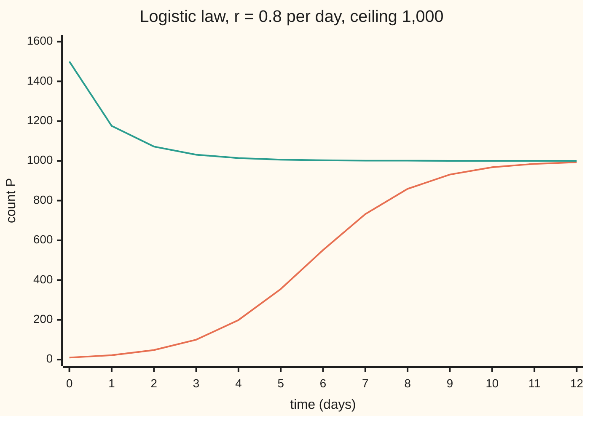
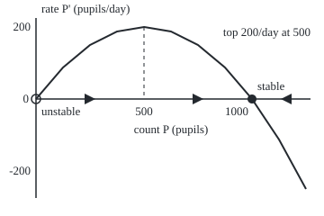

# Logistic growth: a ceiling bends the exponential into an S-curve

[Syllabus](../../../SYLLABUS.md) → [Differential equations and dynamics](../README.md) → [Rate Equations](../README.md#s01) → Logistic growth

---

## General Overview

A school has 1,000 pupils. On Monday morning 10 of them know a rumour. Each pupil who knows it passes it on in the corridors, and the more pupils know, the faster it spreads. At first the count grows like compound interest: about 8 new pupils a day, and 100 pupils by day 3.

That cannot go on. A rumour told to someone who already knows it spreads nothing. When most of the school knows, most conversations are wasted, and the count flattens under 1,000.

The law multiplies how many pupils know by the fraction still to hear. Its solution is an S-shaped curve. Half the school knows by day 5.74, 999 pupils by day 14.38, and the count never quite reaches 1,000.

**Growth proportional to the count, times the fraction of room left, gives an S-curve that carries any positive start toward the ceiling, from below or above; the ceiling attracts, and zero repels.**

**What kind of fact this is:** a model, an assumption about how spread works that fits well-mixed groups; its solution, the S-curve, is a theorem proved on this card in Why it works.

### The picture: the rumour's S-curve, and a start above the ceiling



Orange: the rumour, from 10 pupils. Green: the same law from 1,500, impossible in the school but possible in a pond stocked above capacity. Both close in on 1,000 from their own side; neither crosses it.

---

## The formula

Notation from [A differential equation](01-what-a-differential-equation-says.md): $P'$ is the rate of $P$, read "the rate of P at time t is …". The logistic law and its starting value are

$$P' = rP\left(1 - \frac{P}{K}\right), \qquad P(0) = P_0 .$$

**Read it aloud:** the count grows at a fixed rate, times the count, times the fraction of room left.

Its solution, derived below, is

$$P(t) = \frac{K}{1 + A\,e^{-rt}}, \qquad A = \frac{K}{P_0} - 1 .$$

**Read it aloud:** the count is the ceiling divided by one plus a starting gap that fades exponentially.

For the rumour, $A$ = 1000/10 − 1 = 99, so the count is 1000/(1 + 99e^(−0.8t)).

| Symbol | Plain meaning | In our example | Push it up and the answer… |
| --- | --- | --- | --- |
| $t$ | time since Monday morning, in days | day 0 to 12 | closer to the ceiling |
| $P$ | pupils who have heard the rumour | 10 at the start | the empty fraction shrinks |
| $P'$ | rate of spread, pupils per day | 7.92 on day 0, 200 at the peak | the curve climbs faster |
| $r$ | growth rate while almost nobody knows | 0.8 per day | every date comes sooner |
| $K$ | carrying capacity: the ceiling the count settles on | 1,000 pupils | the curve flattens higher |
| $P_0$ | the count at time 0 | 10 pupils | the half-way day comes sooner |
| $A$ | starting gap: $K/P_0 - 1$ | 99 | the S shifts later |
| $f$, $f'$ | the rate law as a rule on $P$, and its slope | $f'$ = +0.8 at 0, −0.8 at 1,000 per day | above zero at a rest, the rest repels |

The factor $1 - P/K$ is the fraction still to hear. **Carrying capacity** is ecology's name: the population a habitat can carry.

### When it holds

- **The school is well mixed.** Every knower is as likely to meet every non-knower. If friendships cluster in classes, the rumour stalls at class edges and runs slower.
- **The rate and the ceiling stay fixed.** A half-term week cuts meetings, so $r$ falls and every date slides later.
- **Nobody forgets.** If knowers drop out steadily, the law gains a subtracted term and the count settles below 1,000.
- **Counts are large enough to treat as smooth.** "Never quite everyone" is the smooth model speaking; in a real school the last pupil does hear.

---

## Why it works

### Step 0: spread needs a knower to meet someone who does not know

A new hearer is made when a knower meets a non-knower. Such meetings grow with the knowers, $P$, and with the share still to hear, $1 - P/K$. Their product, scaled by $r$, is the logistic law. For small $P$ the share is almost 1 and the law is plain exponential growth, $P' \approx rP$; near $K$ the share, and the growth, vanish.

### Step 1: separate the variables

The law ignores the clock, so it separates, by the method of [Separable equations](03-separable-equations.md). Divide both sides by $P(1 - P/K)$, which is not zero while $P$ sits strictly between 0 and $K$:

$$\frac{1}{P\,(1 - P/K)}\,\frac{dP}{dt} = r .$$

### Step 2: split the fraction by partial fractions

Rewrite $1/(P(1 - P/K))$ as $K/(P(K - P))$ and split it, by [Partial fractions](../../06-Calculus%20and%20analysis/04-Integrals/05-partial-fractions.md), into two easy ones:

$$\frac{K}{P\,(K - P)} = \frac{1}{P} + \frac{1}{K - P} .$$

Over one denominator the tops add to $(K - P) + P = K$, as they should. Integrating each piece gives a logarithm:

$$\ln\lvert P\rvert - \ln\lvert K - P\rvert = rt + \text{constant} .$$

### Step 3: undo the logarithm and fix the constant

Exponentiate: $P/(K - P)$ is a constant times $e^{rt}$, and at time 0 it is $P_0/(K - P_0)$, which is $1/A$. So

$$\frac{P}{K - P} = \frac{e^{rt}}{A}, \qquad\text{hence}\qquad P = \frac{K}{1 + A\,e^{-rt}} .$$

For the rumour, 10/990 = 1/99, and the denominator at time 0 is 1 + 99 = 100, so the curve starts at 10.

<details>
<summary>Detailed proof: the formula solves the law, and nothing else does</summary>

Write D = 1 + A e^(−rt). Differentiating P = K/D gives P' = K A r e^(−rt) / D^2. Also 1 − P/K = (D − 1)/D = A e^(−rt)/D, so rP(1 − P/K) = r (K/D)(A e^(−rt)/D), the same expression. At t = 0, P = K/(1 + A) = P_0. So the formula solves the law for any P_0 > 0, on either side of K.

Uniqueness: on any bounded range of counts the law's slope, r(1 − 2P/K), is bounded. That is the Lipschitz condition from this wing's second shelf, which guarantees exactly one solution through each start. So no other curve starts at 10, and none touches the constant solutions 0 or K.

</details>

### Step 4: the phase line, without the formula

Write $f(P)$ for $rP(1 - P/K)$. By [Slope fields and the phase line](02-slope-fields-and-the-phase-line.md), the rests are where $f$ is zero: $P = 0$ and $P = K$. Between them $f$ is positive and the count rises; above $K$ it is negative and the count falls.

The slope test agrees. Here $f'(P) = r(1 - 2P/K)$. At 0 it is $+r$ = +0.8 per day: arrows point away, so zero **repels**. At $K$ it is $-r$ = −0.8 per day: arrows point in, so the ceiling **attracts**.

### The picture: the rate against the count, and the phase line under it

<p align="center"></p>

Scale: 0.24 units per pupil across, 0.4 units per pupil/day up, plotted every 125 pupils. The horizontal axis is the phase line: the count moves right under the hump and left where the curve dips below.

### Step 5: a start above the ceiling

If $P_0 > K$, the same algebra holds, but $K - P$ is negative: that is why the logarithms carry absolute values. Now $A$ is negative: from 1,500, $A$ = 1000/1500 − 1 = −1/3. The denominator 1 − e^(−0.8t)/3 rises from 2/3 toward 1, so the count falls from 1,500 toward 1,000 without crossing it: 1,176 after one day, 1,072 after two.

### Step 6: the fastest day is the half-way day

Set the count to half the ceiling: 1 + $A$e^(−rt) = 2, so e^(−rt) = 1/$A$ and $t = \ln A / r$, a positive time when the start is below $K/2$, so that $A > 1$. For the rumour that is ln 99 ÷ 0.8 = 5.74 days. The rate $f(P)$ is a hump in $P$ with its top at $P = K/2$, where it equals $rK/4$ = 200 pupils per day. So the half-way day is the fastest day. By the chain rule $P'' = f'(P)\,P'$, positive below $K/2$ and negative above: the curve bends up, then down. That bend is the S.

---

## Worked numbers, by hand

| Step | Arithmetic | Value |
| --- | --- | --- |
| starting gap | $A$ = 1000/10 − 1 | 99 |
| rate on day 0 | 0.8 × 10 × (1 − 10/1000) | 7.92 pupils/day |
| half the school | 1 + 99e^(−0.8t) = 2, so t = ln 99 ÷ 0.8 = 4.595120 ÷ 0.8 | **5.74 days** |
| fastest spread | 0.8 × 500 × (1 − 500/1000) | 200 pupils/day |
| count on day 6 | 99 × e^(−4.8) = 0.8147, then 1000 ÷ 1.8147 | 551.04 pupils |
| 999 pupils | 99e^(−0.8t) = 1/999, so t = ln(99 × 999) ÷ 0.8 | 14.38 days |
| start above | $A$ = 1000/1500 − 1 = −0.3333; after 2 days | 1,072.15 |

Half the school has heard by day 5.74, when the rumour moves fastest. By day 20 the model reaches 999.989: never all.

### What breaks if you drop a piece

| Mistake | Comes out at | What went wrong |
| --- | --- | --- |
| Dropping the crowding factor, 10e^(0.8t) | 990 pupils at day 5.74; 2,704.26 by day 7, in a school of 1,000 | It ignores wasted conversations |
| Dropping the sign of $A$ for a start at 1,500 | the curve starts at 750, not 1,500 | Above the ceiling $K - P$ is negative; the logarithm's absolute value matters |
| Stepping along the slope with 3-day steps | 10, 33.76, 112.05, 350.83, 897.43, 1,118.35, 800.70 | Near 1,000 each step multiplies the gap by 1 − 2.4 = −1.4: it jumps across the ceiling, which the true solution never does |

---

## Code, from first principles, and it actually runs

Three roads reach the half-way day. Road one is the closed form, ln 99 ÷ 0.8. Road two walks the slope by Euler's rule: from the current count, move for a short time h along the slope there. Its error on day 6 halves as the step halves, the mark of a first-order rule, which has its own card on the Numerical Evolution shelf. Road three is the separated equation with no partial fractions: the time is the area under $1/f(P)$ from 10 to 500, measured by Simpson's rule (parabolas through groups of three points). The checks also measure the slope of $f$ at both rests and follow the start at 1,500.

### Python

```python
# Logistic growth -- the check behind the card.  Nothing is imported but
# math.exp and math.log.  A rumour in a 1,000-pupil school: P' = 0.8 P (1 - P/1000),
# P pupils who have heard it, t in days, 10 pupils on day 0.  Road one is the
# closed form; road two steps along the slope; road three is the area under
# 1/rate, the separated equation integrated with no partial fractions.
from math import exp, log
R, K, P0 = 0.8, 1000.0, 10.0

def rate(p): return R * p * (1 - p / K)                    # the right-hand side

def closed(p0, t): return K / (1 + (K / p0 - 1) * exp(-R * t))

def euler(p0, t, h):                                       # small steps along the slope
    p = p0
    for _ in range(round(t / h)): p += h * rate(p)
    return p

def simpson(f, a, b, n=20000):                             # area under f, written out
    h = (b - a) / n
    return (f(a) + f(b) + sum((4 if i % 2 else 2) * f(a + i * h) for i in range(1, n))) * h / 3

def slope(p, d=1e-4): return (rate(p + d) - rate(p - d)) / (2 * d)   # f' by differences
def row(xs, fmt): return " ".join(format(x, fmt) for x in xs)
A = K / P0 - 1
t_half = log(A) / R
area = simpson(lambda p: 1 / rate(p), P0, K / 2)
p, n = P0, 0
while p < K / 2: p, n = p + 0.001 * rate(p), n + 1       # step until half the school
err = [euler(P0, 6, h) - closed(P0, 6) for h in (0.1, 0.05, 0.025)]
coarse = [P0]
for _ in range(6): coarse.append(coarse[-1] + 3 * rate(coarse[-1]))
print(f"rate law P' = 0.8 P (1 - P/1000), pupils and days; A = K/P0 - 1 = {A:.0f}")
print(f"rests: rate at 0 = {rate(0):.2f}, at 1000 = {rate(K):.2f}; slope there {slope(0):+.6f} and {slope(K):+.6f} per day")
print(f"phase line signs: rate at 10 = {rate(10):.2f}, at 500 = {rate(500):.2f} (up, the fastest), at 1250 = {rate(1250):.2f} (down)")
print(f"half the school, closed form ln(99)/0.8 = {log(A):.6f}/0.8: {t_half:.6f} days")
print(f"half the school, area under 1/rate from 10 to 500: {area:.6f} days")
print(f"half the school, Euler h = 0.001: {n * 0.001:.3f} days")
print("chart, from 10, days 0 to 12:", row((closed(P0, t) for t in range(13)), ".0f"))
print("chart, from 1500, days 0 to 12:", row((closed(1500, t) for t in range(13)), ".0f"))
print(f"day 6 from 10: 99 e^(-4.8) = {A * exp(-4.8):.4f}; closed {closed(P0, 6):.2f}, Euler h = 0.001 {euler(P0, 6, 0.001):.2f}")
print(f"day 2 from 1500: A = {K / 1500 - 1:.4f}, 1 + A = {K / 1500:.4f}; closed {closed(1500, 2):.2f}, Euler h = 0.001 {euler(1500, 2, 0.001):.2f}")
print("Euler error at day 6, h = 0.1, 0.05, 0.025:", row(err, ".4f"))
print(f"never everyone: 999 pupils at day {log(A * 999) / R:.2f}; day 20 gives {closed(P0, 20):.3f}")
print(f"mistake 1, no crowding factor: 10 e^(0.8 t) at day 5.74 = {P0 * exp(R * t_half):.2f}, at day 7 = {P0 * exp(R * 7):.2f}")
print(f"mistake 2, sign of A dropped from 1500: A = {abs(K / 1500 - 1):.4f}, P(0) = {K / (1 + abs(K / 1500 - 1)):.2f}")
print("mistake 3, Euler h = 3 days from 10:", row(coarse, ".2f"))
X = lambda q: 40 + 0.24 * q; Y = lambda q: 110 - 0.4 * rate(q)   # 0.24 per pupil, 0.4 per pupil/day
print(f"figure, axis y = 110; rests at x = {X(0):.1f} and {X(K):.1f}; top at ({X(500):.1f}, {Y(500):.1f})")
print("figure, rate curve:", " ".join(f"{X(q):.1f},{Y(q):.1f}" for q in range(0, 1251, 125)))
assert abs(area - log(99) / 0.8) < 1e-6                     # separation, two ways
assert abs(n * 0.001 - t_half) < 0.01 and 1.9 < err[0] / err[1] < 2.1   # stepping, order one
assert abs(slope(0) - R) < 1e-6 and abs(slope(K) + R) < 1e-6          # 0 repels, K attracts
assert 1000 < euler(1500, 2, 0.001) < 1500 and abs(euler(1500, 2, 0.001) - closed(1500, 2)) < 0.5
print("ALL CHECKS PASS")
```

**Ran 2026-09-28 on macOS, Python 3.14.6, standard library only. All checks passed. Output, pasted from the run:**

```
rate law P' = 0.8 P (1 - P/1000), pupils and days; A = K/P0 - 1 = 99
rests: rate at 0 = 0.00, at 1000 = 0.00; slope there +0.800000 and -0.800000 per day
phase line signs: rate at 10 = 7.92, at 500 = 200.00 (up, the fastest), at 1250 = -250.00 (down)
half the school, closed form ln(99)/0.8 = 4.595120/0.8: 5.743900 days
half the school, area under 1/rate from 10 to 500: 5.743900 days
half the school, Euler h = 0.001: 5.746 days
chart, from 10, days 0 to 12: 10 22 48 100 199 355 551 732 859 931 968 985 993
chart, from 1500, days 0 to 12: 1500 1176 1072 1031 1014 1006 1003 1001 1001 1000 1000 1000 1000
day 6 from 10: 99 e^(-4.8) = 0.8147; closed 551.04, Euler h = 0.001 550.72
day 2 from 1500: A = -0.3333, 1 + A = 0.6667; closed 1072.15, Euler h = 0.001 1072.08
Euler error at day 6, h = 0.1, 0.05, 0.025: -31.8967 -15.9473 -7.9693
never everyone: 999 pupils at day 14.38; day 20 gives 999.989
mistake 1, no crowding factor: 10 e^(0.8 t) at day 5.74 = 990.00, at day 7 = 2704.26
mistake 2, sign of A dropped from 1500: A = 0.3333, P(0) = 750.00
mistake 3, Euler h = 3 days from 10: 10.00 33.76 112.05 350.83 897.43 1118.35 800.70
figure, axis y = 110; rests at x = 40.0 and 280.0; top at (160.0, 30.0)
figure, rate curve: 40.0,110.0 70.0,75.0 100.0,50.0 130.0,35.0 160.0,30.0 190.0,35.0 220.0,50.0 250.0,75.0 280.0,110.0 310.0,155.0 340.0,210.0
ALL CHECKS PASS
```

### Rust

Same numbers, same labels, built with `rustc --edition 2021 -O`.

```rust
// Logistic growth -- the same check as the Python, in Rust.  No crates.  A
// rumour in a 1,000-pupil school: P' = 0.8 P (1 - P/1000), P pupils who have
// heard it, t in days, 10 pupils on day 0.  Road one is the closed form; road
// two steps along the slope; road three is the area under 1/rate, the
// separated equation integrated with no partial fractions.
const R: f64 = 0.8;
const K: f64 = 1000.0;
const P0: f64 = 10.0;

fn rate(p: f64) -> f64 { R * p * (1.0 - p / K) }            // the right-hand side

fn closed(p0: f64, t: f64) -> f64 { K / (1.0 + (K / p0 - 1.0) * (-R * t).exp()) }

fn euler(p0: f64, t: f64, h: f64) -> f64 {                   // small steps along the slope
    let mut p = p0;
    for _ in 0..(t / h).round() as i64 { p += h * rate(p) }
    p
}

fn simpson(f: &dyn Fn(f64) -> f64, a: f64, b: f64, n: usize) -> f64 {   // area under f
    let h = (b - a) / n as f64;
    let inner: f64 = (1..n).map(|i| (if i % 2 == 1 { 4.0 } else { 2.0 }) * f(a + i as f64 * h)).sum();
    (f(a) + f(b) + inner) * h / 3.0
}

fn slope(p: f64) -> f64 { let d = 1e-4; (rate(p + d) - rate(p - d)) / (2.0 * d) }   // f' by differences

fn row(xs: &[f64], prec: usize) -> String {
    xs.iter().map(|x| format!("{:.*}", prec, x)).collect::<Vec<_>>().join(" ")
}

fn main() {
    let a = K / P0 - 1.0;
    let t_half = a.ln() / R;
    let area = simpson(&|p| 1.0 / rate(p), P0, K / 2.0, 20000);
    let (mut p, mut n) = (P0, 0);
    while p < K / 2.0 { p += 0.001 * rate(p); n += 1 }        // step until half the school
    let err: Vec<f64> = [0.1, 0.05, 0.025].iter().map(|&h| euler(P0, 6.0, h) - closed(P0, 6.0)).collect();
    let mut coarse = vec![P0];
    for _ in 0..6 { let q = *coarse.last().unwrap(); coarse.push(q + 3.0 * rate(q)) }
    let c10: Vec<f64> = (0..13).map(|t| closed(P0, t as f64)).collect();
    let c1500: Vec<f64> = (0..13).map(|t| closed(1500.0, t as f64)).collect();
    let a_wrong = (K / 1500.0 - 1.0).abs();
    println!("rate law P' = 0.8 P (1 - P/1000), pupils and days; A = K/P0 - 1 = {:.0}", a);
    println!("rests: rate at 0 = {:.2}, at 1000 = {:.2}; slope there {:+.6} and {:+.6} per day", rate(0.0), rate(K), slope(0.0), slope(K));
    println!("phase line signs: rate at 10 = {:.2}, at 500 = {:.2} (up, the fastest), at 1250 = {:.2} (down)", rate(10.0), rate(500.0), rate(1250.0));
    println!("half the school, closed form ln(99)/0.8 = {:.6}/0.8: {:.6} days", a.ln(), t_half);
    println!("half the school, area under 1/rate from 10 to 500: {:.6} days", area);
    println!("half the school, Euler h = 0.001: {:.3} days", n as f64 * 0.001);
    println!("chart, from 10, days 0 to 12: {}", row(&c10, 0));
    println!("chart, from 1500, days 0 to 12: {}", row(&c1500, 0));
    println!("day 6 from 10: 99 e^(-4.8) = {:.4}; closed {:.2}, Euler h = 0.001 {:.2}", a * (-4.8f64).exp(), closed(P0, 6.0), euler(P0, 6.0, 0.001));
    println!("day 2 from 1500: A = {:.4}, 1 + A = {:.4}; closed {:.2}, Euler h = 0.001 {:.2}", K / 1500.0 - 1.0, K / 1500.0, closed(1500.0, 2.0), euler(1500.0, 2.0, 0.001));
    println!("Euler error at day 6, h = 0.1, 0.05, 0.025: {}", row(&err, 4));
    println!("never everyone: 999 pupils at day {:.2}; day 20 gives {:.3}", (a * 999.0).ln() / R, closed(P0, 20.0));
    println!("mistake 1, no crowding factor: 10 e^(0.8 t) at day 5.74 = {:.2}, at day 7 = {:.2}", P0 * (R * t_half).exp(), P0 * (R * 7.0).exp());
    println!("mistake 2, sign of A dropped from 1500: A = {:.4}, P(0) = {:.2}", a_wrong, K / (1.0 + a_wrong));
    println!("mistake 3, Euler h = 3 days from 10: {}", row(&coarse, 2));
    let x = |q: f64| 40.0 + 0.24 * q;                         // 0.24 per pupil
    let y = |q: f64| 110.0 - 0.4 * rate(q);                   // 0.4 per pupil/day
    println!("figure, axis y = 110; rests at x = {:.1} and {:.1}; top at ({:.1}, {:.1})", x(0.0), x(K), x(500.0), y(500.0));
    let pts: Vec<String> = (0..11).map(|i| { let q = 125.0 * i as f64; format!("{:.1},{:.1}", x(q), y(q)) }).collect();
    println!("figure, rate curve: {}", pts.join(" "));
    assert!((area - 99f64.ln() / 0.8).abs() < 1e-6);                        // separation, two ways
    assert!((n as f64 * 0.001 - t_half).abs() < 0.01 && err[0] / err[1] > 1.9 && err[0] / err[1] < 2.1);
    assert!((slope(0.0) - R).abs() < 1e-6 && (slope(K) + R).abs() < 1e-6);  // 0 repels, K attracts
    let e1500 = euler(1500.0, 2.0, 0.001);
    assert!(e1500 > 1000.0 && e1500 < 1500.0 && (e1500 - closed(1500.0, 2.0)).abs() < 0.5);
    println!("ALL CHECKS PASS");
}
```

**Ran 2026-09-28 on macOS, rustc 1.98.1, no crates. All checks passed. Output, pasted from the run:**

```
rate law P' = 0.8 P (1 - P/1000), pupils and days; A = K/P0 - 1 = 99
rests: rate at 0 = 0.00, at 1000 = 0.00; slope there +0.800000 and -0.800000 per day
phase line signs: rate at 10 = 7.92, at 500 = 200.00 (up, the fastest), at 1250 = -250.00 (down)
half the school, closed form ln(99)/0.8 = 4.595120/0.8: 5.743900 days
half the school, area under 1/rate from 10 to 500: 5.743900 days
half the school, Euler h = 0.001: 5.746 days
chart, from 10, days 0 to 12: 10 22 48 100 199 355 551 732 859 931 968 985 993
chart, from 1500, days 0 to 12: 1500 1176 1072 1031 1014 1006 1003 1001 1001 1000 1000 1000 1000
day 6 from 10: 99 e^(-4.8) = 0.8147; closed 551.04, Euler h = 0.001 550.72
day 2 from 1500: A = -0.3333, 1 + A = 0.6667; closed 1072.15, Euler h = 0.001 1072.08
Euler error at day 6, h = 0.1, 0.05, 0.025: -31.8967 -15.9473 -7.9693
never everyone: 999 pupils at day 14.38; day 20 gives 999.989
mistake 1, no crowding factor: 10 e^(0.8 t) at day 5.74 = 990.00, at day 7 = 2704.26
mistake 2, sign of A dropped from 1500: A = 0.3333, P(0) = 750.00
mistake 3, Euler h = 3 days from 10: 10.00 33.76 112.05 350.83 897.43 1118.35 800.70
figure, axis y = 110; rests at x = 40.0 and 280.0; top at (160.0, 30.0)
figure, rate curve: 40.0,110.0 70.0,75.0 100.0,50.0 130.0,35.0 160.0,30.0 190.0,35.0 220.0,50.0 250.0,75.0 280.0,110.0 310.0,155.0 340.0,210.0
ALL CHECKS PASS
```

The two outputs match line for line.

> [!TIP]
> **Try changing**
> Guess first, then run it.
> - **Double the rate.** Set `R` to `1.6`. Every date halves: the half-way lines print 2.871950 days, then the first assert, pinned to 0.8, stops the run.
> - **One-day steps.** In the mistake-3 loop change `3 * rate` to `1 * rate`. Near the ceiling each step now multiplies the gap by 1 − 0.8 = 0.2, so nothing overshoots: 10.00, 17.92, 32.00 and on.
> - **Start on the ceiling.** In the second chart line, change `closed(1500, t)` to `closed(1000, t)`. Now $A$ is 0 and the line prints 1000 every day.

---

## The usual mistake

> [!warning]
> **Reading the ceiling as a wall the count hits.** The carrying capacity is a rest the count approaches from either side and never reaches. At day 20 the rumour count is 999.989. A start above the ceiling is allowed; the law pulls it back down.
>
> - **Fastest spread at the start.** On day 0 the rate is 7.92 pupils per day; the peak is 200 per day at half the school, on day 5.74.

---

## Where you meet it in real life

- **New products.** Adoption often runs slow, fast, saturated; sales peak at the half-way point.
- **Epidemics in a closed group.** The simplest infection model has this shape while nobody recovers.
- **Fish stocks.** Fisheries aim to hold a stock near $K/2$, where the logistic rate, and so the sustainable catch, is largest.

> **Say it back**
> Logistic growth multiplies the count by the fraction of room left, so small counts grow exponentially and large ones stall. Separating the variables and splitting 1/(P(K − P)) into two logarithms gives the S-curve K/(1 + Ae^(−rt)). Zero repels and the ceiling attracts, so every positive start, below or above, closes in on K. The fastest growth is at half the ceiling: day 5.74 for the rumour.

---

## What this builds on

- [Slope fields and the phase line](02-slope-fields-and-the-phase-line.md): rests, arrows and the slope test that sort 0 and K.
- [Separable equations](03-separable-equations.md): moving every $P$ to one side and every $t$ to the other.
- [Partial fractions](../../06-Calculus%20and%20analysis/04-Integrals/05-partial-fractions.md): splitting 1/(P(K − P)) into two logarithms.

## Where this goes next

- [Bernoulli and Riccati equations](09-bernoulli-and-riccati-substitutions.md): the logistic law is a Bernoulli equation, and the substitution u = 1/P turns it into a linear one, a second road to the same S-curve.

---

## Sources

Verified 2026-09-28: every link below resolves to the publisher's page.

- OpenStax. *Calculus Volume 2*, section 4.4, "The Logistic Equation." [Page](https://openstax.org/books/calculus-volume-2/pages/4-4-the-logistic-equation). The law, carrying capacity, and the solution by partial fractions.
- Strogatz, Steven H. *Nonlinear Dynamics and Chaos*, 2nd ed. CRC Press. [Publisher page](https://www.routledge.com/Nonlinear-Dynamics-and-Chaos-With-Applications-to-Physics-Biology-Chemistry-and-Engineering/Strogatz/p/book/9780367026509). Section 2.3, "Population Growth": logistic growth read from its phase line.
- Dawkins, Paul. "Equilibrium Solutions." Paul's Online Notes, Lamar University. [Page](https://tutorial.math.lamar.edu/Classes/DE/EquilibriumSolutions.aspx). Stable and unstable equilibrium solutions read from the sign of the rate.
