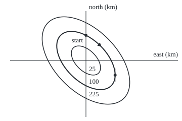

# Exact equations: when the equation is the derivative of a hidden function, find that function

[Syllabus](../../../SYLLABUS.md) → [Differential equations and dynamics](../README.md) → [Rate Equations](../README.md#s01) → Exact equations

---

## General Overview

A hiker stands in a bowl-shaped valley, 1 km north of its lowest point. The map has lost its contour lines; only the slopes survive. The hiker wants to walk without climbing or dropping. Which way is level?

Measure x km east and y km north of the valley floor, and height in hundreds of metres. The ground rises 2x + y hundred metres per km going east, and x + 2y going north. A small step dx east and dy north changes the height by about (2x + y)dx + (x + 2y)dy. Walking level means that change is zero:

$$(2x + y)\,dx + (x + 2y)\,dy = 0.$$

That is a differential equation for the path, solved by rebuilding the lost map: if one height function has these slopes, the level paths are its contours. Here the height is x^2 + xy + y^2, and the level paths are the ellipses x^2 + xy + y^2 = C, one for each height C. An equation whose left side is the change of one hidden function is called **exact**.

**An equation M dx + N dy = 0 is exact when M and N are the two slopes of one hidden function F; the test is that M's rate in y equals N's rate in x, F is rebuilt by integrating twice, and every solution runs along a level curve F = C.**

**What kind of fact this is:** a method resting on a theorem, the exactness test; Why it works proves both on a rectangle.

### The picture: the valley's contours, rebuilt from its slopes

<p align="center"></p>

To scale, 50 px per km, floor where the axes cross. Rings: the 25, 100 and 225 m contours (C = 0.25, 1, 2.25). Top dot: the start (0, 1); triangle: the walk heading east. Right-hand dot: where the 100 m ring turns vertical, at (1.1547, −0.5774).

---

## The formula

Notation first, in words. $M\,dx + N\,dy = 0$ says a small step $dx$ east and $dy$ north changes the hidden quantity by nothing. On a path y(x) it means $M + N y' = 0$: the slope is $y' = -M/N$. A **partial derivative** $\partial M/\partial y$ is M's rate as y moves with x held fixed ([Partial derivatives](../../06-Calculus%20and%20analysis/07-Several%20Variables/01-partial-derivatives.md)).

The test for exactness:

$$\frac{\partial M}{\partial y} = \frac{\partial N}{\partial x}$$

When it passes, there is a function $F$ with $\partial F/\partial x = M$ and $\partial F/\partial y = N$, built by integrating twice:

$$F(x, y) = \int M\,dx + g(y), \qquad g'(y) = N - \frac{\partial}{\partial y}\int M\,dx,$$

and the solutions are the level curves

$$F(x, y) = C.$$

**Read it aloud:** if M's rate going north equals N's rate going east, integrate M in x, fix the leftover piece in y by matching N, and each solution holds F at one value.

| Symbol | Plain meaning | In our example | Push it up and the answer… |
| --- | --- | --- | --- |
| $x$, $y$ | km east and north of the valley floor | start at (0, 1) | — |
| $M$, $N$ | slopes of the ground east and north, 100 m per km | 2x + y and x + 2y; 1 and 2 at the start | — |
| $\partial M/\partial y$, $\partial N/\partial x$ | M's rate going north, N's going east | both 1 | unequal: no F |
| $F$ | the hidden function: height, in hundreds of metres | x^2 + xy + y^2 | — |
| $g$ | the leftover from integrating in x, a function of y | y^2 | — |
| $C$ | the level held along a solution | 1, the 100 m contour | a larger ring |
| $y'$ | the path's slope, km north per km east | −0.5 at the start | — |
| $dx$, $dy$ | a small step east and north, in km | — | — |

### When it holds

- **Continuous partials.** Without them the test proves nothing.
- **A region with no holes.** On a rectangle or disc a passed test guarantees F. The angle form, M = −y/(x^2 + y^2) and N = x/(x^2 + y^2), passes off the origin, yet a lap of the unit circle climbs 6.2832: no single height fits.
- **Exactness belongs to the written form.** Divide by N and the same slope fails the test. A failed form may pass after multiplying by a well-chosen factor ([The integrating factor](05-integrating-factor.md)).
- **A graph y(x) only where N is not zero.** At (1.1547, −0.5774), N = 0 and M = 1.7321: the ring goes on, the graph stops.

---

## Why it works

### Step 0: a level path keeps the hidden function constant

Suppose F has slopes M and N. Along a path y(x), the two-variable chain rule gives F's rate:

$$\frac{d}{dx}F(x, y(x)) = \frac{\partial F}{\partial x} + \frac{\partial F}{\partial y}\,y' = M + N y'.$$

The equation says this is zero, so F is constant along every solution; and every smooth path along a level of F solves the equation. Solving and drawing contours are one job.

### Step 1: the test is necessary

If F exists, $\partial M/\partial y$ is F differentiated in x then y, and $\partial N/\partial x$ the same in the other order. With continuous second partials the order does not matter: the Hessian's off-diagonal entries agree ([Hessian](../../06-Calculus%20and%20analysis/07-Several%20Variables/05-hessian-and-second-order-approximation.md)). Unequal partials mean no F.

### Step 2: the test is sufficient, and integrating twice builds F

Integrate M = 2x + y in x, holding y fixed: x^2 + xy. The constant of integration may depend on y; call it g(y). The y-rate of x^2 + xy + g(y) must equal N = x + 2y:

$$x + g'(y) = x + 2y.$$

The x cancels: g'(y) = 2y, g(y) = y^2, F = x^2 + xy + y^2. The cancellation is the test at work: in general the leftover's x-rate is $\partial N/\partial x - \partial M/\partial y$, zero by the test, so one more integral in y finishes F.

<details>
<summary>Detailed proof: on a rectangle, a passed test builds F</summary>

Let M and N have continuous first partials on an open rectangle containing (a, b), with matching mixed partials. Define
F(x, y) = ∫ from a to x of M(s, b) ds + ∫ from b to y of N(x, t) dt.
The first term has no y, so the y-rate of F is N(x, y).
For the x-rate, differentiate under the integral sign, allowed since N's x-rate is continuous:
x-rate of F = M(x, b) + ∫ from b to y of (x-rate of N)(x, t) dt = M(x, b) + ∫ from b to y of (y-rate of M)(x, t) dt = M(x, b) + M(x, y) − M(x, b) = M(x, y).
The middle step is the test; the last is the fundamental theorem of calculus. The rectangle keeps both legs inside the region; around a hole the angle form shows the conclusion can fail. Two such F differ by a constant.

</details>

### Step 3: fix the level from the start

At the start (0, 1), F = 1: the path is the 100 m ring x^2 + xy + y^2 = 1. As a quadratic in y,

$$y = \frac{-x + \sqrt{4 - 3x^2}}{2},$$

the branch through (0, 1), valid for x within 1.1547 km of zero. At x = 0.5 the hiker is 0.6514 km north; at x = 1, due east of the floor.

### Step 4: a second road to the height, with no formula

F is the climb from the floor: sum M dx + N dy along a route to (1, 2). East first, slope 2x: climb 1. Then north at x = 1, slope 1 + 2y: climb 6. Total 7 = F(1, 2). Along y = 2x^2 the climb is also 7. An exact form climbs the same by every route; that is what a height is.

A third road, Euler's rule ([Euler's method](../05-Numerical%20Evolution/01-eulers-method.md)), moves h east and h times the slope −M/N north, step after step; it never sees F. A separable equation, written as (time part) dt − dy/(unknown's part) = 0, has both mixed partials zero: it is exact, with F the pair of antiderivatives from [Separable equations](03-separable-equations.md).

---

## Worked numbers, by hand

| Step | Arithmetic | Value |
| --- | --- | --- |
| the test | ∂(2x + y)/∂y and ∂(x + 2y)/∂x | 1 and 1 |
| integrate M in x, match N | x + g'(y) = x + 2y | g = y^2 |
| the hidden function | x^2 + xy + y^2 | **F** |
| check by climbing | 1 east, then 6 north, to (1, 2) | **7 = F(1, 2)** |
| the start's level | F(0, 1) = 1 | **C = 1, the 100 m ring** |
| at x = 0.5 | (−0.5 + √3.25)/2 | **0.6514 km north** |
| where y(x) stops | x = 2/√3, N = 0 | 1.1547 km east |

The level walk is an ellipse reaching 1.4142 km from the floor to the south-east, 0.8165 km to the north-east.

### What breaks if you drop a piece

| Mistake | Comes out at | What went wrong |
| --- | --- | --- |
| Treat g(y) as a plain constant | F(1, 2) = 3, not 7 | The leftover may depend on y |
| Divide by N, then test | at (1, 0): −3 against 0 | Exactness belongs to the form, not the slope |
| Recipe on (2x + 2y)dx + (x + 2y)dy | g'(1) is 2 at x = 0, 1 at x = 1 | Partials 2 and 1: not exact |
| Trust the test around a hole | angle form: a lap climbs 6.2832 | A hole allows climb with no height |

The code prints all four.

---

## Code, from first principles, and it actually runs

Road one: F by integrating twice, and its level curve solved for y. Road two never uses F: it sums M dx + N dy along two routes by Simpson's rule (a weighted sum of samples), and takes Euler steps h of 0.05, 0.025 and 0.0125 km along y' = −M/N; the error halves with h. Four asserts tie the roads together.

### Python

```python
# Exact equations -- the check behind the card.  Standard library only.  A valley:
# x, y in km east and north of its floor, height in hundreds of metres.  Road one:
# F = x^2 + xy + y^2 by integrating twice.  Road two: climbs and Euler steps, blind to F.
import math

M = lambda x, y: 2 * x + y                        # eastward slope, 100 m per km
N = lambda x, y: x + 2 * y                        # northward slope, 100 m per km
F = lambda x, y: x * x + x * y + y * y            # road one: integrate M in x, match N
contour = lambda x: (-x + math.sqrt(4 - 3 * x * x)) / 2   # F = 1 solved for y, through (0, 1)
d = 1e-5

def simpson(f, a, b, n=200):                      # area under f from a to b, n even
    s = f(a) + f(b) + sum((4 if i % 2 else 2) * f(a + i * (b - a) / n) for i in range(1, n))
    return s * (b - a) / (3 * n)

def climb(p, v, m=M, n=N):                        # sum of m dx + n dy along s -> p(s), s from 0 to 1
    return simpson(lambda s: m(*p(s)) * v(s)[0] + n(*p(s)) * v(s)[1], 0, 1)

def euler(x_end, h):                              # small steps along the slope y' = -M/N
    x, y = 0.0, 1.0
    for _ in range(round(x_end / h)):
        x, y = x + h, y - h * M(x, y) / N(x, y)
    return y

my, nx = (M(1, 2 + d) - M(1, 2 - d)) / (2 * d), (N(1 + d, 2) - N(1 - d, 2)) / (2 * d)
east, north = climb(lambda s: (s, 0), lambda s: (1, 0)), climb(lambda s: (1, 2 * s), lambda s: (0, 2))
curve = climb(lambda s: (s, 2 * s * s), lambda s: (1, 4 * s))
eul = [euler(0.5, h) for h in (0.05, 0.025, 0.0125)]
err = [abs(e - contour(0.5)) for e in eul]
sl, secant = -M(0.5, contour(0.5)) / N(0.5, contour(0.5)), (contour(0.5 + d) - contour(0.5 - d)) / (2 * d)
xv, yv = 2 / math.sqrt(3), -1 / math.sqrt(3)
bad_my = (M(1, d) / N(1, d) - M(1, -d) / N(1, -d)) / (2 * d)   # the equation divided by N first
angle = climb(lambda s: (math.cos(2 * math.pi * s), math.sin(2 * math.pi * s)),
              lambda s: (-2 * math.pi * math.sin(2 * math.pi * s), 2 * math.pi * math.cos(2 * math.pi * s)),
              lambda x, y: -y / (x * x + y * y), lambda x, y: x / (x * x + y * y))
px = lambda x, y: (170 + 50 * x, 120 - 50 * y)   # figure: 50 px per km, floor at (170, 120)
(ax, ay), r = px(0.5, contour(0.5)), math.hypot(1, sl)   # arrow on the contour, pointing along it
arrow = [ax + 8 / r, ay - 8 * sl / r, ax + 4 * sl / r, ay + 4 / r, ax - 4 * sl / r, ay - 4 / r]
print(f"exactness test at (1, 2): dM/dy {my:.6f}, dN/dx {nx:.6f}")
print(f"F(1, 2) by integrating twice {F(1, 2):.6f}; climbed east then north {east:.6f} + {north:.6f}; along y = 2x^2 {curve:.6f}")
print(f"start (0, 1): M = {M(0, 1)}, N = {N(0, 1)}, level C = {F(0, 1):.4f}, slope -M/N = {-M(0, 1) / N(0, 1):.4f}")
print("contour y at x = 0, 0.5, 1:", " ".join(f"{contour(x):.4f}" for x in (0, 0.5, 1)))
print(f"slope at x = 0.5: -M/N {sl:.4f}; secant of the contour {secant:.4f}")
print("Euler y(0.5), h = 0.05, 0.025, 0.0125:", " ".join(f"{e:.4f}" for e in eul))
print("Euler errors:", " ".join(f"{e:.4f}" for e in err) + f"; ratios {err[0] / err[1]:.3f} {err[1] / err[2]:.3f}")
print(f"height on the Euler path at x = 0.5, h = 0.05: {F(0.5, eul[0]):.4f}, not 1")
print(f"vertical tangent at ({xv:.4f}, {yv:.4f}): M = {M(xv, yv):.4f}, N = {abs(N(xv, yv)):.4f}")
print(f"contour C = 1 half-widths: {math.sqrt(2 / 3):.4f} km along y = x, {math.sqrt(2):.4f} km along y = -x")
print(f"mistake, g(y) dropped: x^2 + xy at (1, 2) = {F(1, 2) - 2 ** 2}, not 7")
print(f"mistake, divided by N first: at (1, 0) dM/dy {bad_my:.4f}, dN/dx 0")
print(f"mistake, (2x + 2y)dx + (x + 2y)dy: dM/dy 2, dN/dx 1; g'(1) at x = 0 is {N(0, 1) - 2 * 0}, at x = 1 is {N(1, 1) - 2 * 1}")
print(f"mistake, angle form round the unit circle: {angle:.4f}, not 0")
print("figure, rings C = 0.25, 1, 2.25 (25, 100, 225 m), rx ry:", " ".join(f"{50 * math.sqrt(2 * c / 3):.2f} {50 * math.sqrt(2 * c):.2f}" for c in (0.25, 1, 2.25)))
print("figure, 50 px per km, floor 170 120; start {:.1f} {:.1f}; tangent {:.1f} {:.1f}; arrow".format(*px(0, 1), *px(xv, yv)), " ".join(f"{a:.1f}" for a in arrow))
assert abs(east + north - F(1, 2)) < 1e-9 and abs(curve - F(1, 2)) < 1e-9   # road two meets road one
assert abs(my - nx) < 1e-6 and abs(bad_my + 3) < 1e-4               # exact; divided form is not
assert abs(secant - sl) < 1e-6 and err[2] < 0.003                    # the contour obeys the law
assert 1.8 < err[0] / err[1] < 2.2 and abs(angle - 2 * math.pi) < 1e-9
print("ALL CHECKS PASS")
```

**Ran 2026-09-28 on macOS, Python 3.14.6, standard library only. All checks passed. Output, pasted from the run:**

```
exactness test at (1, 2): dM/dy 1.000000, dN/dx 1.000000
F(1, 2) by integrating twice 7.000000; climbed east then north 1.000000 + 6.000000; along y = 2x^2 7.000000
start (0, 1): M = 1, N = 2, level C = 1.0000, slope -M/N = -0.5000
contour y at x = 0, 0.5, 1: 1.0000 0.6514 0.0000
slope at x = 0.5: -M/N -0.9160; secant of the contour -0.9160
Euler y(0.5), h = 0.05, 0.025, 0.0125: 0.6623 0.6569 0.6542
Euler errors: 0.0109 0.0055 0.0028; ratios 1.983 1.991
height on the Euler path at x = 0.5, h = 0.05: 1.0198, not 1
vertical tangent at (1.1547, -0.5774): M = 1.7321, N = 0.0000
contour C = 1 half-widths: 0.8165 km along y = x, 1.4142 km along y = -x
mistake, g(y) dropped: x^2 + xy at (1, 2) = 3, not 7
mistake, divided by N first: at (1, 0) dM/dy -3.0000, dN/dx 0
mistake, (2x + 2y)dx + (x + 2y)dy: dM/dy 2, dN/dx 1; g'(1) at x = 0 is 2, at x = 1 is 1
mistake, angle form round the unit circle: 6.2832, not 0
figure, rings C = 0.25, 1, 2.25 (25, 100, 225 m), rx ry: 20.41 35.36 40.82 70.71 61.24 106.07
figure, 50 px per km, floor 170 120; start 170.0 70.0; tangent 227.7 148.9; arrow 200.9 92.8 192.3 90.4 197.7 84.5
ALL CHECKS PASS
```

### Rust

Same numbers, same labels, built with `rustc --edition 2021 -O`.

```rust
// Exact equations -- the same check as the Python, in Rust.  No crates.  A valley:
// x, y in km east and north of its floor, height in hundreds of metres.  Road one:
// F = x^2 + xy + y^2 by integrating twice.  Road two: climbs and Euler steps, blind to F.
use std::f64::consts::PI;

fn m(x: f64, y: f64) -> f64 { 2.0 * x + y }             // eastward slope, 100 m per km
fn n(x: f64, y: f64) -> f64 { x + 2.0 * y }             // northward slope, 100 m per km
fn f(x: f64, y: f64) -> f64 { x * x + x * y + y * y }   // road one: integrate M in x, match N
fn contour(x: f64) -> f64 { (-x + (4.0 - 3.0 * x * x).sqrt()) / 2.0 } // F = 1 through (0, 1)
const D: f64 = 1e-5;

fn simpson(g: &dyn Fn(f64) -> f64, a: f64, b: f64, k: usize) -> f64 {
    let mut s = g(a) + g(b);                            // area under g from a to b, k even
    for i in 1..k { s += (if i % 2 == 1 { 4.0 } else { 2.0 }) * g(a + i as f64 * (b - a) / k as f64) }
    s * (b - a) / (3.0 * k as f64)
}

// sum of mm dx + nn dy along s -> p(s), s from 0 to 1, with velocity v(s)
fn climb(p: &dyn Fn(f64) -> (f64, f64), v: &dyn Fn(f64) -> (f64, f64),
         mm: &dyn Fn(f64, f64) -> f64, nn: &dyn Fn(f64, f64) -> f64) -> f64 {
    simpson(&|s| { let ((x, y), (vx, vy)) = (p(s), v(s)); mm(x, y) * vx + nn(x, y) * vy }, 0.0, 1.0, 200)
}

fn euler(x_end: f64, h: f64) -> f64 {                   // small steps along y' = -M/N
    let (mut x, mut y) = (0.0, 1.0);
    for _ in 0..(x_end / h).round() as usize { let dy = h * m(x, y) / n(x, y); x += h; y -= dy }
    y
}

fn main() {
    let (my, nx) = ((m(1.0, 2.0 + D) - m(1.0, 2.0 - D)) / (2.0 * D), (n(1.0 + D, 2.0) - n(1.0 - D, 2.0)) / (2.0 * D));
    let (east, north) = (climb(&|s| (s, 0.0), &|_| (1.0, 0.0), &m, &n), climb(&|s| (1.0, 2.0 * s), &|_| (0.0, 2.0), &m, &n));
    let curve = climb(&|s| (s, 2.0 * s * s), &|s| (1.0, 4.0 * s), &m, &n);
    let eul: Vec<f64> = [0.05, 0.025, 0.0125].iter().map(|&h| euler(0.5, h)).collect();
    let err: Vec<f64> = eul.iter().map(|e| (e - contour(0.5)).abs()).collect();
    let (sl, secant) = (-m(0.5, contour(0.5)) / n(0.5, contour(0.5)), (contour(0.5 + D) - contour(0.5 - D)) / (2.0 * D));
    let (xv, yv) = (2.0 / 3f64.sqrt(), -1.0 / 3f64.sqrt());
    let bad_my = (m(1.0, D) / n(1.0, D) - m(1.0, -D) / n(1.0, -D)) / (2.0 * D); // divided by N first
    let angle = climb(&|s| ((2.0 * PI * s).cos(), (2.0 * PI * s).sin()),
                      &|s| (-2.0 * PI * (2.0 * PI * s).sin(), 2.0 * PI * (2.0 * PI * s).cos()),
                      &|x, y| -y / (x * x + y * y), &|x, y| x / (x * x + y * y));
    let px = |x: f64, y: f64| (170.0 + 50.0 * x, 120.0 - 50.0 * y); // figure: 50 px per km
    let ((ax, ay), r) = (px(0.5, contour(0.5)), (1.0 + sl * sl).sqrt());
    let arrow = [ax + 8.0 / r, ay - 8.0 * sl / r, ax + 4.0 * sl / r, ay + 4.0 / r, ax - 4.0 * sl / r, ay - 4.0 / r];
    let j = |v: &[f64], p: usize| v.iter().map(|a| format!("{:.*}", p, a)).collect::<Vec<_>>().join(" ");
    println!("exactness test at (1, 2): dM/dy {:.6}, dN/dx {:.6}", my, nx);
    println!("F(1, 2) by integrating twice {:.6}; climbed east then north {:.6} + {:.6}; along y = 2x^2 {:.6}", f(1.0, 2.0), east, north, curve);
    println!("start (0, 1): M = {}, N = {}, level C = {:.4}, slope -M/N = {:.4}", m(0.0, 1.0), n(0.0, 1.0), f(0.0, 1.0), -m(0.0, 1.0) / n(0.0, 1.0));
    println!("contour y at x = 0, 0.5, 1: {}", j(&[contour(0.0), contour(0.5), contour(1.0)], 4));
    println!("slope at x = 0.5: -M/N {:.4}; secant of the contour {:.4}", sl, secant);
    println!("Euler y(0.5), h = 0.05, 0.025, 0.0125: {}", j(&eul, 4));
    println!("Euler errors: {}; ratios {:.3} {:.3}", j(&err, 4), err[0] / err[1], err[1] / err[2]);
    println!("height on the Euler path at x = 0.5, h = 0.05: {:.4}, not 1", f(0.5, eul[0]));
    println!("vertical tangent at ({:.4}, {:.4}): M = {:.4}, N = {:.4}", xv, yv, m(xv, yv), n(xv, yv).abs());
    println!("contour C = 1 half-widths: {:.4} km along y = x, {:.4} km along y = -x", (2.0f64 / 3.0).sqrt(), 2f64.sqrt());
    println!("mistake, g(y) dropped: x^2 + xy at (1, 2) = {}, not 7", f(1.0, 2.0) - 4.0);
    println!("mistake, divided by N first: at (1, 0) dM/dy {:.4}, dN/dx 0", bad_my);
    println!("mistake, (2x + 2y)dx + (x + 2y)dy: dM/dy 2, dN/dx 1; g'(1) at x = 0 is {}, at x = 1 is {}", n(0.0, 1.0), n(1.0, 1.0) - 2.0);
    println!("mistake, angle form round the unit circle: {:.4}, not 0", angle);
    let rr: Vec<f64> = [0.25, 1.0, 2.25].iter().flat_map(|&c: &f64| [50.0 * (2.0 * c / 3.0).sqrt(), 50.0 * (2.0 * c).sqrt()]).collect();
    println!("figure, rings C = 0.25, 1, 2.25 (25, 100, 225 m), rx ry: {}", j(&rr, 2));
    let (s0, t0) = (px(0.0, 1.0), px(xv, yv));
    println!("figure, 50 px per km, floor 170 120; start {:.1} {:.1}; tangent {:.1} {:.1}; arrow {}", s0.0, s0.1, t0.0, t0.1, j(&arrow, 1));
    assert!((east + north - f(1.0, 2.0)).abs() < 1e-9 && (curve - f(1.0, 2.0)).abs() < 1e-9); // road two meets road one
    assert!((my - nx).abs() < 1e-6 && (bad_my + 3.0).abs() < 1e-4);                 // exact; divided form is not
    assert!((secant - sl).abs() < 1e-6 && err[2] < 0.003);                          // the contour obeys the law
    assert!(err[0] / err[1] > 1.8 && err[0] / err[1] < 2.2 && (angle - 2.0 * PI).abs() < 1e-9);
    println!("ALL CHECKS PASS");
}
```

**Ran 2026-09-28 on macOS, rustc 1.98.1, no crates. All checks passed. Output, pasted from the run:**

```
exactness test at (1, 2): dM/dy 1.000000, dN/dx 1.000000
F(1, 2) by integrating twice 7.000000; climbed east then north 1.000000 + 6.000000; along y = 2x^2 7.000000
start (0, 1): M = 1, N = 2, level C = 1.0000, slope -M/N = -0.5000
contour y at x = 0, 0.5, 1: 1.0000 0.6514 0.0000
slope at x = 0.5: -M/N -0.9160; secant of the contour -0.9160
Euler y(0.5), h = 0.05, 0.025, 0.0125: 0.6623 0.6569 0.6542
Euler errors: 0.0109 0.0055 0.0028; ratios 1.983 1.991
height on the Euler path at x = 0.5, h = 0.05: 1.0198, not 1
vertical tangent at (1.1547, -0.5774): M = 1.7321, N = 0.0000
contour C = 1 half-widths: 0.8165 km along y = x, 1.4142 km along y = -x
mistake, g(y) dropped: x^2 + xy at (1, 2) = 3, not 7
mistake, divided by N first: at (1, 0) dM/dy -3.0000, dN/dx 0
mistake, (2x + 2y)dx + (x + 2y)dy: dM/dy 2, dN/dx 1; g'(1) at x = 0 is 2, at x = 1 is 1
mistake, angle form round the unit circle: 6.2832, not 0
figure, rings C = 0.25, 1, 2.25 (25, 100, 225 m), rx ry: 20.41 35.36 40.82 70.71 61.24 106.07
figure, 50 px per km, floor 170 120; start 170.0 70.0; tangent 227.7 148.9; arrow 200.9 92.8 192.3 90.4 197.7 84.5
ALL CHECKS PASS
```

At h = 0.05 the Euler path ends at height 1.0198, not 1: tangent steps drift outward off a curving contour.

> [!TIP]
> **Try changing**
> Guess first, then run it.
> - **Break the exactness.** Set `M` to `2 * x + 2 * y`. The partials print 2 and 1, and the two routes climb 7.000000 and 7.666667: with no height, the route matters. The first assert stops the run.
> - **Forget g(y).** Delete `+ y * y` from `F`. F(1, 2) prints 3.000000; both climbs stay 7.000000; the first assert fails.
> - **Halve every step.** Use `(0.025, 0.0125, 0.00625)`. Errors 0.0055, 0.0028, 0.0014: still halving.

---

## The usual mistake

> [!warning]
> **Integrating M in x and adding a plain constant.** With y held fixed, the "constant" can be any function of y. Drop it and F = x^2 + xy, whose y-rate is x, not x + 2y: the height at (1, 2) comes out 3 instead of 7. Always match the y-rate to N.
>
> - **Testing after dividing.** (2x + y)/(x + 2y) dx + dy fails the test at (1, 0). Test the form as given.
> - **Skipping the test.** On (2x + 2y)dx + (x + 2y)dy the "function of y alone" changes with x.
> - **Ignoring a hole.** The angle form passes the test yet has no height.

---

## Where you meet it in real life

- **Potential energy.** Gravity does no net work round a closed loop, so it has a potential; the exactness test checks a force for one.
- **Thermodynamics.** A small change of internal energy is exact; heat and work separately are not, so a gas holds energy but no stored amount of heat.
- **Conserved quantities.** A frictionless pendulum's orbits are level curves of its energy.

> **Say it back**
> M dx + N dy = 0 is exact when M and N are the two slopes of one hidden function F. The test: M's rate going north equals N's rate going east. Integrate M in x, keep the leftover as a function of y, and fix it by matching N. Every solution holds F constant, so solutions are F's level curves. The valley's slopes rebuild F = x^2 + xy + y^2, and the level walk from 1 km north is the ellipse x^2 + xy + y^2 = 1.

---

## What this builds on

- [Separable equations](03-separable-equations.md): implicit answers H(y) = G(t) + C, the simplest exact case.
- [Partial derivatives](../../06-Calculus%20and%20analysis/07-Several%20Variables/01-partial-derivatives.md): slopes in one direction with the other variable held fixed, and the two-variable chain rule of Step 0.
- [Hessian](../../06-Calculus%20and%20analysis/07-Several%20Variables/05-hessian-and-second-order-approximation.md): mixed second partials agree, which makes the test necessary.

## Where this goes next

- [Bernoulli and Riccati equations](09-bernoulli-and-riccati-substitutions.md): equations made linear by a change of unknown.
- [Euler's method](../05-Numerical%20Evolution/01-eulers-method.md): the code's small-step road, and why its error falls with the step.
- [The Picard-Lindelof theorem](../02-Existence%2C%20Uniqueness%20and%20Sensitivity/02-lipschitz-and-the-picard-lindelof-theorem.md): why one start fixes one contour where N is not zero.

A form that fails the test may pass once multiplied by the right factor; for linear equations that factor is [The integrating factor](05-integrating-factor.md).

---

## Sources

Verified 2026-09-28: every link below resolves to the publisher's page.

- Boyce, William E., Richard C. DiPrima and Douglas B. Meade. *Elementary Differential Equations*, 12th ed. Wiley, 2021. [Publisher page](https://www.wiley.com/en-us/Elementary+Differential+Equations%2C+12th+Edition-p-9781119777755). Exact equations and integrating factors: the test and the two integrations.
- Dawkins, Paul. *Paul's Online Notes: Differential Equations*, "Exact Equations". Lamar University. [Free text](https://tutorial.math.lamar.edu/classes/de/exact.aspx). The recipe step by step.
- Teschl, Gerald. *Ordinary Differential Equations and Dynamical Systems*. AMS Graduate Studies in Mathematics 140, 2012. [Author's text, posted with AMS permission](https://mat.univie.ac.at/~gerald/ftp/book-ode/). Section 1.4: exact equations, stated carefully.
- Coddington, Earl A. *An Introduction to Ordinary Differential Equations*. Dover, 1989. [Publisher page](https://store.doverpublications.com/products/9780486659428). First-order equations: exact equations and F built on a rectangle.
