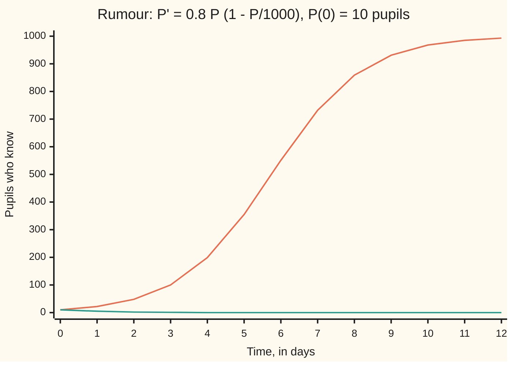

# Bernoulli and Riccati equations: one substitution turns a nonlinear equation into a linear one

Differential equations and dynamics → Rate Equations → Changing the unknown → Bernoulli and Riccati equations

---

## General Overview

A rumour starts with 10 pupils in a school of 1000. Each pupil who knows it passes it on at 0.8 per day, but only to the fraction still in the dark: new knowers per day = 0.8 × P × (1 − P/1000), where P counts those who know. That is the logistic law of [logistic-growth](07-logistic-growth.md), which solved it by separating and partial fractions.

The law contains P^2, so it is **nonlinear**: the unknown appears squared. Track v = 1/P instead, and the new unknown obeys a linear law. Solve it, flip back, and the same answer arrives: 355 pupils know by day 5, half the school by day 5.74.

A **Bernoulli equation** has one power of the unknown on its right side; the substitution v = y^(1−n) removes it. A **Riccati equation** mixes a square with lower terms; given one solution already known, y = known + 1/w turns it linear. A skydiver under air drag is the Riccati example.

**When the only nonlinear piece of a rate law is a power of the unknown, a new unknown built from that power obeys a linear law; solve the linear law and translate back.**

**What kind of fact this is:** a method, proved on this card in Why it works.

### The picture: the rumour, day by day



Orange: the Bernoulli answer, P = 1000/(1 + 99e^(−0.8t)). Teal: the same substitution with the factor (1 − n) dropped, a rumour that dies in four days.

---

## The formula

Reminder: y' is the rate of y at time t. A **linear** equation, y' + p(t) y = q(t), is solved by the [integrating-factor](05-integrating-factor.md).

A Bernoulli equation adds one power $n$ of the unknown on the right. The new unknown $v = y^{1-n}$ obeys a linear law:

$$y' + p(t)\,y = q(t)\,y^{n} \quad\Longrightarrow\quad v' + (1-n)\,p(t)\,v = (1-n)\,q(t)$$

**Read it aloud:** y to the power one minus n has a linear law, both coefficients multiplied by one minus n.

A Riccati equation allows a constant term, a linear term and a square. Given one solution $y_1$, the new unknown $w$ with $y = y_1 + 1/w$ obeys a linear law:

$$y' = a(t) + b(t)\,y + c(t)\,y^{2} \quad\Longrightarrow\quad w' = -\big(b(t) + 2c(t)\,y_1\big)\,w - c(t)$$

**Read it aloud:** one known solution plus one over a new unknown makes the Riccati law linear.

| Symbol | Plain meaning | In our example | Push it up and the answer… |
| --- | --- | --- | --- |
| $t$ | time | days; for the skydiver, units of 5 s | P nears 1000, y nears −1 |
| $y$, $P$ | the unknown; P counts knowers | P(0) = 10; skydiver y(0) = 0 | half the school sooner |
| $p$, $q$ | Bernoulli's coefficients | −0.8 per day, −0.0008 per pupil per day | the ceiling p/q = 1000 moves |
| $n$ | the power of the unknown | 2 | v = y^(1−n) changes with it |
| $v$, $w$ | new unknowns: y^(1−n) and 1/(y − y1) | v = 1/P, 0.1 at the start | v: fewer knowers |
| $a$, $b$, $c$ | Riccati's coefficients | −1, 0, 1 | a more negative: faster terminal speed |
| $y_1$ | a solution already known | y1 = 1, the constant solution | y1 = −1 gives the same y |
| $C$ | constant of integration | 0.099; skydiver −1 | rumour: a smaller start |

The rumour, P' − 0.8P = −0.0008P^2, is Bernoulli with n = 2, so v = 1/P.

### When it holds

- **One power of the unknown (Bernoulli).** y^2 and y^3 together admit no single v.
- **n is not 0 or 1.** At those powers the equation is already linear; at n = 1 the new unknown y^0 = 1 carries nothing.
- **Division by y^n loses y = 0.** A school where nobody knows stays at 0 pupils, but v = 1/P cannot start there.
- **Riccati needs one solution in hand.** Joseph Liouville proved in 1841 that some Riccati equations, y' = y^2 + t among them, have no solution built from integrals of elementary functions.
- **The answer may end in finite time.** 1/w can blow up where w crosses 0: y' = y^2 − 1 started at y = 3 runs off to infinity at t = 0.3466.

---

## Why it works

### Step 0: the power is the rate of something

Divide by the troublesome y^n. The left then starts with y^(−n) y', which by the [chain-rule](../../06-Calculus%20and%20analysis/02-Derivatives/03-chain-rule.md) is the rate of y^(1−n) divided by 1 − n. The equation is already linear in y^(1−n); the substitution names it.

### Step 1: the Bernoulli equation becomes linear

Where y is not 0, dividing gives y^(−n) y' + p y^(1−n) = q. Put v = y^(1−n), so y^(−n) y' = v'/(1 − n), and

v'/(1 − n) + p v = q, that is v' + (1 − n) p v = (1 − n) q.

Each step reverses, so v gives back y = v^(1/(1−n)).

### Step 2: the rumour, through v = 1/P

With 1 − n = −1, p = −0.8 and q = −0.0008, the linear law is v' + 0.8v = 0.0008. Times the integrating factor e^(0.8t), the left is the rate of v e^(0.8t) and the right integrates to 0.001 e^(0.8t). So v = 0.001 + C e^(−0.8t); v(0) = 0.1 gives C = 0.099. Flip back:

P = 1/(0.001 + 0.099 e^(−0.8t)) = 1000/(1 + 99 e^(−0.8t)),

the answer [logistic-growth](07-logistic-growth.md) reached by separation.

The gap 1/P − 1/1000 shrinks by the factor e^(−0.8t), as the coffee's gap above room temperature shrinks in [exponential-growth-decay-and-cooling](04-exponential-growth-decay-and-cooling.md). The rumour is a cooling law seen through a reciprocal.

### Step 3: a Riccati equation is a Bernoulli equation one step removed

Suppose $y_1$ solves y' = a + b y + c y^2. Write y = y1 + u, u the gap between two solutions. Subtract the two laws; a cancels:

u' = (b + 2c y1) u + c u^2.

That is Bernoulli with n = 2, so Step 1 says v = 1/u makes it linear. Together, y = y1 + 1/w, and w' = −(b + 2c y1) w − c.

### Step 4: the skydiver

A skydiver falls from rest. Velocity V counts upward, in m/s, so falling is V below 0. Gravity gives 9.8 m/s^2; drag grows as speed squared and matches gravity at 49 m/s. While falling, V' = −9.8 (1 − (V/49)^2). In units of 49 m/s for velocity, y = V/49, and 49/9.8 = 5 s for time, the law is y' = y^2 − 1: Riccati with a = −1, b = 0, c = 1.

Its constant solutions are y = 1 and y = −1, the second falling at 49 m/s. Take y1 = 1. Then w' = −2w − 1, so w = −1/2 + A e^(−2t) for a constant A. Put C = 1/(2A) and y = 1 + 1/w tidies to

y = (1 + C e^(2t))/(1 − C e^(2t)).

From rest, y(0) = 0 gives C = −1, and y = (1 − e^(2t))/(1 + e^(2t)). After one time unit, 5 s, y = −0.761594: the skydiver falls at 37.32 m/s, and reaches 95% of 49 m/s at 9.16 s.

The known solution y = 1, rising at 49 m/s, is outside the physics, since this drag term holds only while falling. The substitution uses it as algebra.

<details>
<summary>Detailed proof: the substitutions miss no solution</summary>

Bernoulli, with p and q continuous and n not 0 or 1. On an interval where a solution y stays positive, v = y^(1−n) is differentiable and, by Step 1, solves the linear law. A linear law with continuous coefficients has one solution per start, the integrating factor's. So y = v^(1/(1−n)) is the formula's answer and no other. If y is 0 at one time and n is at least 1, uniqueness for the original law keeps y = 0 for all time: the lost solution.

Riccati, with a, b, c continuous. For a solution y other than y1, u = y − y1 obeys u' = (b + c(y + y1)) u, a linear law with no constant term, so u = u(0) e^(∫(b + c(y + y1)) dt) is never 0. Then w = 1/u gives w' = −u'/u^2 = −(b + 2c y1) w − c; conversely any w away from 0 gives back y. In the skydiver's family C = 0 is y1, and y = −1 is the limit as C runs off to infinity.

</details>

A second road needs no algebra: Euler's rule, new value = old value + step × rate ([eulers-method](../05-Numerical%20Evolution/01-eulers-method.md)). The code takes it.

---

## Worked numbers, by hand

| Step | Arithmetic | Value |
| --- | --- | --- |
| linear law for v = 1/P | v' + 0.8v = 0.0008 | v = 0.001 + C e^(−0.8t) |
| fix C at day 0 | 1/10 − 0.001 | C = 0.099 |
| day 5 | 1/(0.001 + 0.099 e^(−4)) | **355.46 pupils** |
| half the school | 99 e^(−0.8t) = 1, so t = ln(99)/0.8 | **5.74 days** |
| skydiver, y1 = 1 | w' = −2w − 1 | y = (1 + C e^(2t))/(1 − C e^(2t)) |
| from rest | y(0) = 0 gives (1 + C)/(1 − C) = 0 | C = −1 |
| after 5 s, t = 1 | 49 × (1 − e^2)/(1 + e^2) | **−37.32 m/s** |

By day 5 a third of the school has heard; after 5 s the skydiver has three quarters of terminal speed.

### What breaks if you drop a piece

| Mistake | Comes out at | What went wrong |
| --- | --- | --- |
| Drop the factor (1 − n) | P(5) = 0.1850 pupils | v grows, so the rumour dies |
| Drop the square: y = 1 + w, w' = 2w | V(5 s) = −313.06 m/s | No terminal speed left |
| Start with nobody knowing | v = 1/0, no value | P = 0 is lost; stepping keeps it at 0 |

---

## Code, from first principles, and it actually runs

Road one: the substitutions' closed forms, and for the skydiver a second one from y = −1 + 1/w, w' = 2w − 1. Road two: Euler steps on the nonlinear law at three step sizes; the error halves with the step. The rumour is also stepped on the linear law for v and inverted, testing the substitution without a formula. A start above y = 1 is stepped past a million to time the blow-up.

### Python

```python
# Bernoulli and Riccati equations -- the check behind the card.  Standard
# library only.  Bernoulli: the rumour P' = 0.8 P (1 - P/1000), P(0) = 10,
# through v = 1/P.  Riccati: a skydiver's scaled velocity y' = y^2 - 1 from
# rest, through y = 1 + 1/w and again through y = -1 + 1/w.  Second road:
# plain Euler steps on each equation, error printed at three step sizes.
import math

def bernoulli(t):                         # v' + 0.8 v = 0.0008 solved, then P = 1/v
    return 1 / (0.001 + (0.1 - 0.001) * math.exp(-0.8 * t))

def no_factor(t):                         # the (1 - n) dropped: v' - 0.8 v = -0.0008
    return 1 / (0.001 + (0.1 - 0.001) * math.exp(0.8 * t))

def euler(f, y, t_end, h):                # plain small steps along the slope
    for _ in range(round(t_end / h)):
        y = y + h * f(y)
    return y

rumour = lambda p: 0.8 * p * (1 - p / 1000)
linear_v = lambda v: 0.0008 - 0.8 * v     # the equation v = 1/P obeys
riccati = lambda y: y * y - 1

def from_plus_one(t, y0):                 # y = 1 + 1/w: y = (1 + C e^(2t)) / (1 - C e^(2t))
    c = (y0 - 1) / (y0 + 1)
    return (1 + c * math.exp(2 * t)) / (1 - c * math.exp(2 * t))

def from_minus_one(t, y0):                # y = -1 + 1/w, w' = 2w - 1, w = 1/2 + B e^(2t)
    return -1 + 1 / (0.5 + (1 / (y0 + 1) - 0.5) * math.exp(2 * t))

days = list(range(13))
errs = [abs(euler(rumour, 10.0, 5, h) - bernoulli(5)) for h in (0.1, 0.05, 0.025)]
p_by_v = 1 / euler(linear_v, 0.1, 5, 0.001)
y_errs = [abs(euler(riccati, 0.0, 1, h) - from_plus_one(1, 0.0)) for h in (0.01, 0.005, 0.0025)]
y, n = 3.0, 0                             # a start above y = 1: step until it runs off
while y < 1e6:
    y, n = y + 1e-5 * riccati(y), n + 1
print("day               ", days)
print("P, Bernoulli      ", [round(bernoulli(t)) for t in days])
print("P, (1 - n) dropped", [round(no_factor(t)) for t in days])
print(f"P(5): Bernoulli {bernoulli(5):.4f}; Euler on P {euler(rumour, 10.0, 5, 0.001):.4f}; Euler on v, inverted {p_by_v:.4f}")
print("Euler error in P(5), h = 0.1, 0.05, 0.025:", " ".join(f"{e:.4f}" for e in errs))
print(f"error ratios on halving h: {errs[0] / errs[1]:.3f} {errs[1] / errs[2]:.3f}")
print(f"half the school: ln(99) / 0.8 = {math.log(99) / 0.8:.4f} days; 1/P - 1/1000 at day 5 = {0.099 * math.exp(-4):.6f}")
print(f"mistake, (1 - n) dropped: P(5) = {no_factor(5):.4f} pupils; nobody-knows start stays at {euler(rumour, 0.0, 5, 0.001):.1f}")
print(f"skydiver y(1): from y = 1 {from_plus_one(1, 0.0):.6f}; from y = -1 {from_minus_one(1, 0.0):.6f}; Euler h = 0.001 {euler(riccati, 0.0, 1, 0.001):.6f}")
print("Euler error in y(1), h = 0.01, 0.005, 0.0025:", " ".join(f"{e:.6f}" for e in y_errs))
print(f"in metres per second: V(5 s) = {49 * from_plus_one(1, 0.0):.2f}; 95% of 49 m/s at {5 * 0.5 * math.log(1.95 / 0.05):.2f} s")
print(f"mistake, w^2 term dropped: y = 1 - e^(2t), V(5 s) = {49 * (1 - math.exp(2)):.2f} m/s")
print(f"start y(0) = 3: C = 0.5, runs off at ln(2)/2 = {math.log(2) / 2:.4f}; Euler passes 10^6 at {n * 1e-5:.4f}")
assert abs(euler(rumour, 10.0, 5, 0.001) - bernoulli(5)) < 0.5 and abs(p_by_v - bernoulli(5)) < 0.5
assert all(1.8 < a / b < 2.2 for a, b in ((errs[0], errs[1]), (errs[1], errs[2]), (y_errs[0], y_errs[1])))
assert abs(from_plus_one(1, 0.0) - from_minus_one(1, 0.0)) < 1e-12
assert abs(n * 1e-5 - math.log(2) / 2) < 1e-3   # blow-up time, by steps and by formula
print("ALL CHECKS PASS")
```

**Ran 2026-09-28 on macOS, Python 3.14.6, standard library only. All checks passed. Output, pasted from the run:**

```
day                [0, 1, 2, 3, 4, 5, 6, 7, 8, 9, 10, 11, 12]
P, Bernoulli       [10, 22, 48, 100, 199, 355, 551, 732, 859, 931, 968, 985, 993]
P, (1 - n) dropped [10, 5, 2, 1, 0, 0, 0, 0, 0, 0, 0, 0, 0]
P(5): Bernoulli 355.4610; Euler on P 355.1732; Euler on v, inverted 355.8278
Euler error in P(5), h = 0.1, 0.05, 0.025: 27.6725 14.1190 7.1291
error ratios on halving h: 1.960 1.980
half the school: ln(99) / 0.8 = 5.7439 days; 1/P - 1/1000 at day 5 = 0.001813
mistake, (1 - n) dropped: P(5) = 0.1850 pupils; nobody-knows start stays at 0.0
skydiver y(1): from y = 1 -0.761594; from y = -1 -0.761594; Euler h = 0.001 -0.761776
Euler error in y(1), h = 0.01, 0.005, 0.0025: 0.001828 0.000912 0.000456
in metres per second: V(5 s) = -37.32; 95% of 49 m/s at 9.16 s
mistake, w^2 term dropped: y = 1 - e^(2t), V(5 s) = -313.06 m/s
start y(0) = 3: C = 0.5, runs off at ln(2)/2 = 0.3466; Euler passes 10^6 at 0.3467
ALL CHECKS PASS
```

### Rust

Same numbers, same labels, built with `rustc --edition 2021 -O`.

```rust
// Bernoulli and Riccati equations -- the same check as the Python, in Rust.
// No crates.  Bernoulli: the rumour P' = 0.8 P (1 - P/1000), P(0) = 10,
// through v = 1/P.  Riccati: a skydiver's scaled velocity y' = y^2 - 1 from
// rest, through y = 1 + 1/w and again through y = -1 + 1/w.  Second road:
// plain Euler steps on each equation, error printed at three step sizes.

fn bernoulli(t: f64) -> f64 {             // v' + 0.8 v = 0.0008 solved, then P = 1/v
    1.0 / (0.001 + (0.1 - 0.001) * (-0.8 * t).exp())
}

fn no_factor(t: f64) -> f64 {             // the (1 - n) dropped: v' - 0.8 v = -0.0008
    1.0 / (0.001 + (0.1 - 0.001) * (0.8 * t).exp())
}

fn euler(f: &dyn Fn(f64) -> f64, mut y: f64, t_end: f64, h: f64) -> f64 {
    for _ in 0..(t_end / h).round() as usize { y += h * f(y) } // plain small steps along the slope
    y
}

fn rumour(p: f64) -> f64 { 0.8 * p * (1.0 - p / 1000.0) }
fn linear_v(v: f64) -> f64 { 0.0008 - 0.8 * v }        // the equation v = 1/P obeys
fn riccati(y: f64) -> f64 { y * y - 1.0 }

fn from_plus_one(t: f64, y0: f64) -> f64 {  // y = 1 + 1/w: y = (1 + C e^(2t)) / (1 - C e^(2t))
    let c = (y0 - 1.0) / (y0 + 1.0);
    (1.0 + c * (2.0 * t).exp()) / (1.0 - c * (2.0 * t).exp())
}

fn from_minus_one(t: f64, y0: f64) -> f64 { // y = -1 + 1/w, w' = 2w - 1, w = 1/2 + B e^(2t)
    -1.0 + 1.0 / (0.5 + (1.0 / (y0 + 1.0) - 0.5) * (2.0 * t).exp())
}

fn main() {
    let days: Vec<i64> = (0..13).collect();
    let pb: Vec<i64> = days.iter().map(|&t| bernoulli(t as f64).round() as i64).collect();
    let pw: Vec<i64> = days.iter().map(|&t| no_factor(t as f64).round() as i64).collect();
    let errs: Vec<f64> = [0.1, 0.05, 0.025].iter().map(|&h| (euler(&rumour, 10.0, 5.0, h) - bernoulli(5.0)).abs()).collect();
    let p_by_v = 1.0 / euler(&linear_v, 0.1, 5.0, 0.001);
    let y_errs: Vec<f64> = [0.01, 0.005, 0.0025].iter().map(|&h| (euler(&riccati, 0.0, 1.0, h) - from_plus_one(1.0, 0.0)).abs()).collect();
    let (mut y, mut n) = (3.0f64, 0u64);  // a start above y = 1: step until it runs off
    while y < 1e6 { y += 1e-5 * riccati(y); n += 1 }
    let e: Vec<String> = errs.iter().map(|x| format!("{:.4}", x)).collect();
    let ye: Vec<String> = y_errs.iter().map(|x| format!("{:.6}", x)).collect();
    let p_euler = euler(&rumour, 10.0, 5.0, 0.001);
    println!("day                {:?}", days);
    println!("P, Bernoulli       {:?}", pb);
    println!("P, (1 - n) dropped {:?}", pw);
    println!("P(5): Bernoulli {:.4}; Euler on P {:.4}; Euler on v, inverted {:.4}", bernoulli(5.0), p_euler, p_by_v);
    println!("Euler error in P(5), h = 0.1, 0.05, 0.025: {}", e.join(" "));
    println!("error ratios on halving h: {:.3} {:.3}", errs[0] / errs[1], errs[1] / errs[2]);
    println!("half the school: ln(99) / 0.8 = {:.4} days; 1/P - 1/1000 at day 5 = {:.6}", 99f64.ln() / 0.8, 0.099 * (-4f64).exp());
    println!("mistake, (1 - n) dropped: P(5) = {:.4} pupils; nobody-knows start stays at {:.1}", no_factor(5.0), euler(&rumour, 0.0, 5.0, 0.001));
    println!("skydiver y(1): from y = 1 {:.6}; from y = -1 {:.6}; Euler h = 0.001 {:.6}",
             from_plus_one(1.0, 0.0), from_minus_one(1.0, 0.0), euler(&riccati, 0.0, 1.0, 0.001));
    println!("Euler error in y(1), h = 0.01, 0.005, 0.0025: {}", ye.join(" "));
    println!("in metres per second: V(5 s) = {:.2}; 95% of 49 m/s at {:.2} s", 49.0 * from_plus_one(1.0, 0.0), 5.0 * 0.5 * (1.95f64 / 0.05).ln());
    println!("mistake, w^2 term dropped: y = 1 - e^(2t), V(5 s) = {:.2} m/s", 49.0 * (1.0 - 2f64.exp()));
    println!("start y(0) = 3: C = 0.5, runs off at ln(2)/2 = {:.4}; Euler passes 10^6 at {:.4}", 2f64.ln() / 2.0, n as f64 * 1e-5);
    assert!((p_euler - bernoulli(5.0)).abs() < 0.5 && (p_by_v - bernoulli(5.0)).abs() < 0.5);
    assert!([(errs[0], errs[1]), (errs[1], errs[2]), (y_errs[0], y_errs[1])].iter().all(|&(a, b)| a / b > 1.8 && a / b < 2.2));
    assert!((from_plus_one(1.0, 0.0) - from_minus_one(1.0, 0.0)).abs() < 1e-12);
    assert!((n as f64 * 1e-5 - 2f64.ln() / 2.0).abs() < 1e-3); // blow-up time, by steps and by formula
    println!("ALL CHECKS PASS");
}
```

**Ran 2026-09-28 on macOS, rustc 1.98.1, no crates. All checks passed. Output, pasted from the run:**

```
day                [0, 1, 2, 3, 4, 5, 6, 7, 8, 9, 10, 11, 12]
P, Bernoulli       [10, 22, 48, 100, 199, 355, 551, 732, 859, 931, 968, 985, 993]
P, (1 - n) dropped [10, 5, 2, 1, 0, 0, 0, 0, 0, 0, 0, 0, 0]
P(5): Bernoulli 355.4610; Euler on P 355.1732; Euler on v, inverted 355.8278
Euler error in P(5), h = 0.1, 0.05, 0.025: 27.6725 14.1190 7.1291
error ratios on halving h: 1.960 1.980
half the school: ln(99) / 0.8 = 5.7439 days; 1/P - 1/1000 at day 5 = 0.001813
mistake, (1 - n) dropped: P(5) = 0.1850 pupils; nobody-knows start stays at 0.0
skydiver y(1): from y = 1 -0.761594; from y = -1 -0.761594; Euler h = 0.001 -0.761776
Euler error in y(1), h = 0.01, 0.005, 0.0025: 0.001828 0.000912 0.000456
in metres per second: V(5 s) = -37.32; 95% of 49 m/s at 9.16 s
mistake, w^2 term dropped: y = 1 - e^(2t), V(5 s) = -313.06 m/s
start y(0) = 3: C = 0.5, runs off at ln(2)/2 = 0.3466; Euler passes 10^6 at 0.3467
ALL CHECKS PASS
```

The two outputs match line for line. Euler on P lands below the formula and Euler on v above it, bracketing the answer.

> [!TIP]
> **Try changing**
> Guess first, then run it.
> - **A slower rumour.** Change 0.8 to 0.4 in `rumour` only. Euler's P(5) falls to 69.4289, and the first assert stops the run.
> - **Thrown down at 98 m/s.** Change the three `0.0` starts in the `skydiver y(1)` print line to `-2.0`. Both closed forms give y(1) = −1.094486, Euler −1.094217: drag slows the fall towards 49 m/s. The asserts, pinned to rest, still pass.
> - **A lower start.** Change `y, n = 3.0, 0` to `y, n = 2.0, 0`. C becomes 1/3, Euler passes a million at 0.5494, near ln(3)/2 = 0.5493, and the last assert stops the run.

---

## The usual mistake

> [!warning]
> **Forgetting the factor (1 − n).** By the chain rule, v = y^(1−n) has rate (1 − n) y^(−n) y'. Leave it out and, for n = 2, the linear law's sign flips: v grows, and the rumour reaches 0.1850 pupils on day 5 instead of 355.46.
>
> - **Linearising a Riccati equation.** Dropping the square after y = 1 + w gives a skydiver at −313.06 m/s after 5 s. The substitution y = y1 + 1/w keeps the square exactly.
> - **Losing y = 0.** The division assumes y is never 0; the constant solution y = 0 is never in the formula.
> - **Reading the known solution as the answer.** y = 1 starts at 49 m/s upward, not at rest; C carries the actual start.

---

## Where you meet it in real life

- **Spread with a ceiling.** Rumours, epidemics, a product's adopters: every logistic law is Bernoulli with n = 2.
- **Falling with drag.** Skydivers and raindrops obey the square-drag Riccati law; terminal speed is its constant solution.
- **Control and filtering.** Optimal steering at a quadratic cost and the Kalman filter's error both obey Riccati equations with a matrix unknown: [the-hjb-equation-and-the-linear-quadratic-regulator](../12-Calculus%20of%20Variations%20and%20Optimal%20Control/08-the-hjb-equation-and-the-linear-quadratic-regulator.md).

> **Say it back**
> A Bernoulli equation is linear except for one power y^n. The chain rule makes v = y^(1−n) obey a linear law, coefficients scaled by 1 − n. The rumour's 1/P settles to 1/1000 like cooling coffee, and flipping back gives the logistic curve. A Riccati equation adds a square; one known solution and y = y1 + 1/w make it linear.

---

## What this builds on

- [integrating-factor](05-integrating-factor.md): solves every linear law the substitutions produce.
- [logistic-growth](07-logistic-growth.md): the rumour, solved there by separation.

## Where this goes next

- [the-hjb-equation-and-the-linear-quadratic-regulator](../12-Calculus%20of%20Variations%20and%20Optimal%20Control/08-the-hjb-equation-and-the-linear-quadratic-regulator.md): a matrix Riccati equation, run backwards from a deadline, gives the best feedback for steering a system.

---

## Sources

Verified 2026-09-28: every link below resolves to the publisher's page.

- Boyce, William E., Richard C. DiPrima and Douglas B. Meade. *Elementary Differential Equations*, 12th ed. Wiley, 2021. [Publisher page](https://www.wiley.com/en-us/Elementary+Differential+Equations%2C+12th+Edition-p-9781119777755). Chapter 2's problems set both substitutions.
- Teschl, Gerald. *Ordinary Differential Equations and Dynamical Systems*. AMS Graduate Studies in Mathematics 140, 2012. [Author's text, posted with AMS permission](https://mat.univie.ac.at/~gerald/ftp/book-ode/). Section 1.4: both, among the explicit methods.
- Kalman, R. E., and R. S. Bucy. "New Results in Linear Filtering and Prediction Theory." *Journal of Basic Engineering* 83(1), 1961. [DOI](https://doi.org/10.1115/1.3658902). The filter's error obeys a matrix Riccati equation.
