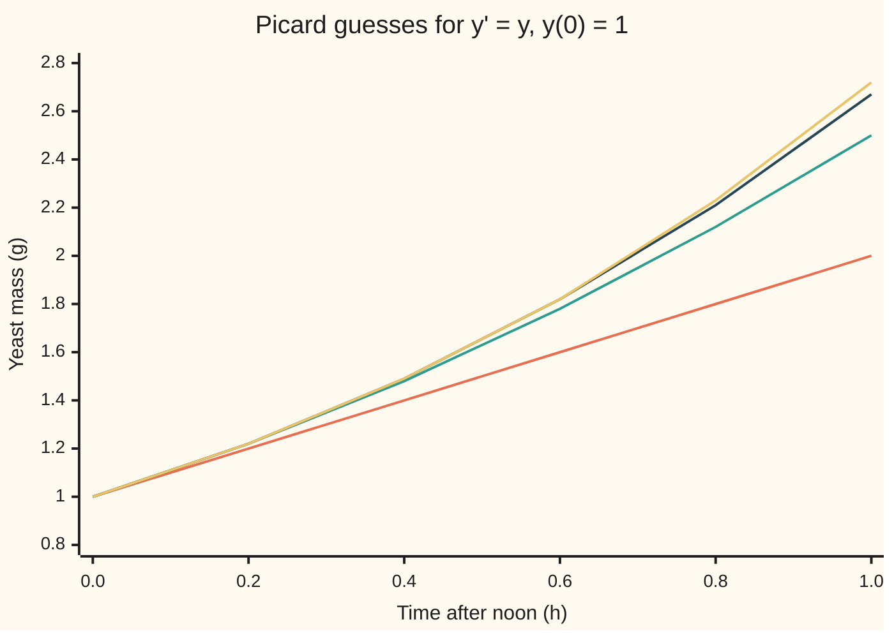

# Picard iteration: turn the equation into an integral, then keep feeding the guess back in

Differential equations and dynamics → Existence, Uniqueness and Sensitivity → Successive approximation → Picard iteration

---

## General Overview

A yeast culture weighs 1 gram at noon. While food is plentiful it grows, in grams per hour, at a rate equal to its mass: at 1 g it gains 1 g per hour, at 2 g it gains 2. What does it weigh at 1 pm?

Suppose no formula is known. Guess that the mass stays at 1 g. That guess gives a rate, 1 g per hour, and adding up that rate gives a better guess: 1 + t grams after t hours. Feed that back into the rule and add up again: 1 + t + t^2/2. After five passes the guess reads 2.7167 g at 1 pm; the true mass is e = 2.7183 g.

This loop is **Picard iteration**, after Émile Picard, who used it late in the nineteenth century to prove that solutions exist. It swaps "find a curve whose slope obeys the rule" for "find a curve that reproduces itself when its rate is added up", and repetition answers the second.

**Rewrite the equation as "the solution is its starting value plus its accumulated rate", start from a constant guess and keep substituting; when the rate cannot change faster than a fixed multiple of the unknown, the guesses converge to the solution.**

**What kind of fact this is:** a method; that its guesses converge is a theorem, proved in Why it works, and completed into existence and uniqueness on [lipschitz-and-the-picard-lindelof-theorem](02-lipschitz-and-the-picard-lindelof-theorem.md).

### The picture: each guess hugs the true curve a little longer



From the bottom: guess 1, the line 1 + t (orange); guess 2 (green); guess 3 (dark blue); the true mass e^t (yellow). The flat starting guess is left off. Each pass stays on the true curve further from noon.

---

## The formula

Notation first, in words. The unknown is $y$, the mass in grams, and the rule is $f$: $y' = f(t, y)$, "the rate of y at time t is f of t and y", from $y(0) = y_0$. The guess made by the n-th pass is the whole curve $\phi_n$, read "phi n". Inside an integral the running time is $s$, leaving $t$ as the end point.

The equation and its starting value together are one integral equation:

$$y(t) = y_0 + \int_0^t f\bigl(s, y(s)\bigr)\,ds$$

**Read it aloud:** the value at time t is the starting value plus all the rate collected since time 0.

Picard iteration turns that into a recipe:

$$\phi_0(t) = y_0, \qquad \phi_{n+1}(t) = y_0 + \int_0^t f\bigl(s, \phi_n(s)\bigr)\,ds$$

**Read it aloud:** start with the constant curve; for each next guess, put the current guess into the rule, integrate from 0 to t, and add the starting value.

For the yeast, $f(t, y) = y$ and $y_0 = 1$, and the guesses are partial sums of the exponential series:

$$\phi_n(t) = 1 + t + \frac{t^2}{2!} + \dots + \frac{t^n}{n!}$$

| Symbol | Plain meaning | In our example | Push it up and the answer… |
| --- | --- | --- | --- |
| $t$, $s$ | hours after noon; $s$ runs from 0 to t inside the integral | t = 1 | more passes needed |
| $y$, $y'$ | mass (g) and its rate (g per hour) | 1 g, 1 g/h at noon | — |
| $f$ | the rate rule | rate equals mass | a faster rule needs more passes |
| $y_0$ | the starting value | 1 g | every guess scales with it |
| $\phi_n$, $n$ | the n-th guess, a whole curve; the pass number | guess 5: 2.7167 at t = 1 | closer to the solution |
| $L$ | Lipschitz constant: most change in rate per unit change in the unknown | 1 per hour | slower convergence |
| $M$ | largest rate the starting guess produces | 1 g/h | larger error bound |
| $e$ | 2.71828…, the true mass at 1 pm | 2.718282 g | — |

### When it holds

- **The rule is continuous.** Then every integral exists. If the rule jumps, the limit need not have a slope everywhere.
- **The rule has a Lipschitz constant $L$:** the rate changes by at most L times any change in the unknown. Without it the guesses may find one solution among several: y' = √y from 0 gives the zero curve and misses t^2/4.
- **The guesses stay where the constant holds.** For y' = y, everywhere. For y' = y^2 the constant grows with y, and convergence stops at the blow-up time: [blow-up-and-the-life-span-of-a-solution](03-blow-up-and-the-life-span-of-a-solution.md).
- **The integrals are exact.** On a computer each carries a quadrature error, and the guesses converge to the discretised problem's solution.

---

## Why it works

### Step 0: integrating smooths, differentiating roughens

A guess with a small wiggle can have a wildly wrong slope but a nearly right integral: a small error added up over a short time stays small. So the equation moves from slopes to areas.

### Step 1: the integral equation says the same thing

If $y$ solves the equation, integrate both sides from 0 to t: by the fundamental theorem of calculus, $y(t) - y_0$ is the integral of $f$ along the curve. Conversely, if a continuous curve satisfies the integral equation, its integrand is continuous, so the fundamental theorem differentiates the right side into $y' = f(t, y)$, and t = 0 gives $y(0) = y_0$. One integral equation carries both statements.

### Step 2: for the yeast, each pass adds one term

The rule returns the guess itself, so $\phi_1(t) = 1 + \int_0^t 1\,ds = 1 + t$. Integrating $s^k/k!$ from 0 to t gives $t^{k+1}/(k+1)!$, so each pass lifts every term one power and puts a fresh 1 in front. By induction $\phi_n$ is the degree-n Taylor polynomial of $e^t$ ([taylor-series](../../06-Calculus%20and%20analysis/06-Series/05-taylor-series.md)). The method rebuilt the exponential without using it.

### Step 3: the gaps between guesses shrink like a factorial

Two consecutive passes differ only through the rule, which changes by at most L times the change in the unknown. So each new gap is at most L times the integral of the previous one. The first gap is at most M t, and integrating repeatedly turns t into t^2/2, t^3/6, and so on:

$$|\phi_{n+1}(t) - \phi_n(t)| \le \frac{M L^n t^{n+1}}{(n+1)!}$$

The factorial beats any power, so the gaps add up to a finite total, $(M/L)(e^{Lt} - 1)$, wherever the constant holds, and the guesses settle. For the yeast, M = L = 1 and the gap is exactly $t^{n+1}/(n+1)!$. Over the first hour the gaps after guess n add to at most 2/(n+1)!: 0.002778 for guess 5, against a true gap of 0.001615.

### Step 4: the limit solves the equation

The gaps shrink at the same rate at every time, so the limit curve is continuous. Guesses within d of the limit give integrals within L d t of its integral, so the limit satisfies the integral equation, and by Step 1 it solves the problem.

<details>
<summary>Detailed proof: the guesses converge to a solution</summary>

Let $f$ be continuous for $0 \le t \le T$ and all y, with $|f(t, a) - f(t, b)| \le L|a - b|$, and let M be the largest value of $|f(t, y_0)|$ there.

Claim: $|\phi_{n+1}(t) - \phi_n(t)| \le M L^n t^{n+1}/(n+1)!$ on [0, T]. For n = 0 the integrand is at most M, so the gap is at most M t. If the claim holds for n − 1, the rule's bound gives $|\phi_{n+1}(t) - \phi_n(t)| \le L \int_0^t M L^{n-1} s^n/n!\,ds = M L^n t^{n+1}/(n+1)!$.

These bounds sum to $(M/L)(e^{LT} - 1)$, so for every ε > 0 there is an N with $|\phi_m(t) - \phi_n(t)| < ε$ for all m > n ≥ N and every t in [0, T]. The guesses converge uniformly to a continuous y. The integrals of the rule along $\phi_n$ and along y differ by at most L T times the largest gap, which tends to 0, so y satisfies the integral equation, and by the fundamental theorem of calculus it solves the problem. That y is the only solution is proved on the Picard-Lindelöf card.

</details>

### Step 5: no series needed

The method does not need polynomials. A bucket holds water h = 25 cm deep and drains as h' = −0.2 √h cm per minute. The first pass uses the starting rate, 1 cm per minute: 15 cm at 10 minutes. The second integrates −0.2 √(25 − s) and reads 16.0793 cm. Four more, by trapezoids on a grid, settle at 16.0000 cm, which the exact solution (5 − 0.1t)^2 confirms; the bucket empties at 50 minutes.

A second road to the yeast is Euler's rule: from each point, step a short time along the slope the rule gives. It has its own card, [eulers-method](../05-Numerical%20Evolution/01-eulers-method.md). Steps of 0.01 h reach 2.704814 g; steps of 0.001 h reach 2.716924 g. Stepping marches through time; Picard improves the whole curve at once.

---

## Worked numbers, by hand

The yeast at 1 pm, t = 1 hour.

| Step | Arithmetic | Value |
| --- | --- | --- |
| guess 0 | the starting mass | 1 g |
| guess 1 | 1 + 1 | 2 g |
| guess 2 | 2 + 1/2 | 2.5 g |
| guess 3 | 2.5 + 1/6 | 2.666667 g |
| guess 4 | 2.666667 + 1/24 | 2.708333 g |
| guess 5 | 2.708333 + 1/120 | **2.716667 g** |
| gap to the solution | e − 2.716667 | 0.001615 g |
| guaranteed gap | 2/6! = 2/720 | 0.002778 g |

After five passes the predicted mass at 1 pm is 1.6 milligrams light, inside the 2.8 milligrams Step 3 guarantees without knowing e.

### What breaks if you drop a piece

| Mistake | Comes out at | What went wrong |
| --- | --- | --- |
| Stop at guess 2 | 2.5 g, 0.218282 g short | a partial sum, not the solution |
| Integrate but never add $y_0$ | guess 5 reads 0.008333 g | only the term t^5/5! survives |
| No Lipschitz constant: y' = √y, y(0) = 0 | guesses read 0.0000 at t = 2; t^2/4 also solves it, reading 1.0000 | iteration finds a solution, not the only one |

The code prints all three.

---

## Code, from first principles, and it actually runs

Two roads sharing no arithmetic. Road one stores each guess as polynomial coefficients and integrates exactly. Road two stores each guess as values at 1,000 grid times and adds up trapezoids, so it works for any rule. They must agree on every guess, and the gaps to e must sit inside Step 3's bound. The code also steps Euler's rule, runs the bucket, and prints the three failures.

### Python

```python
# Picard iteration -- the check behind the card.  Standard library only.
# Road one feeds polynomial coefficients back in, exactly.  Road two feeds a
# curve sampled on a grid back in, adding up trapezoids; it never learns the
# curves are polynomials.  exp and sqrt are primitives; the iteration is ours.
from fractions import Fraction
from math import exp, factorial, sqrt

def coeffs(n, lead=1):                # y' = y, y(0) = 1: integrate, then add lead
    c = [Fraction(1)]
    for _ in range(n):
        c = [Fraction(lead)] + [a / (k + 1) for k, a in enumerate(c)]
    return c

def value(c, t):
    return float(sum(a * Fraction(t) ** k for k, a in enumerate(c)))

def picard_grid(f, y0, T, sweeps, guess, N=1000):   # end value of each iterate
    dt = T / N
    ts = [i * dt for i in range(N + 1)]
    ys = [guess(t) for t in ts]
    ends = [ys[-1]]
    for _ in range(sweeps):
        rate = [f(t, y) for t, y in zip(ts, ys)]
        ys = [y0]
        for i in range(N):
            ys.append(ys[-1] + dt * (rate[i] + rate[i + 1]) / 2)
        ends.append(ys[-1])
    return ends

def euler(h):                         # small steps along the slope, to t = 1
    y = 1.0
    for _ in range(round(1 / h)):
        y += h * y
    return y

e = exp(1)
grid = picard_grid(lambda t, y: y, 1.0, 1.0, 5, lambda t: 1.0)
for n in range(6):
    v, bound = value(coeffs(n), 1), 2 / factorial(n + 1)
    print(f"iterate {n} at t=1: coefficients {v:.6f}, grid {grid[n]:.6f}, gap to e {e - v:.6f}, bound {bound:.6f}")
ts = [0.0, 0.2, 0.4, 0.6, 0.8, 1.0]
print("figure, t (h): " + " ".join(f"{t:.1f}" for t in ts))
for n in (1, 2, 3):
    print(f"figure, iterate {n}: " + " ".join(f"{value(coeffs(n), Fraction(t).limit_denominator(10)):.2f}" for t in ts))
print("figure, e^t: " + " ".join(f"{exp(t):.2f}" for t in ts))
e1, e2 = euler(0.01), euler(0.001)
print(f"euler's rule to t=1: step 0.01 gives {e1:.6f} (gap {e - e1:.6f}), step 0.001 gives {e2:.6f} (gap {e - e2:.6f})")
bucket = picard_grid(lambda t, h: -0.2 * sqrt(h), 25.0, 10.0, 6, lambda t: 25.0)
exact = (5 - 0.1 * 10) ** 2
print("bucket at t=10 min, iterates 0-6: " + " ".join(f"{b:.4f}" for b in bucket) + f"; exact {exact:.4f}")
root = lambda t, y: sqrt(max(y, 0.0))
zero = picard_grid(root, 0.0, 2.0, 5, lambda t: 0.0)
other = picard_grid(root, 0.0, 2.0, 1, lambda t: t * t / 4)
print(f"y' = sqrt(y), y(0) = 0, at t=2: iterates from 0 give {zero[-1]:.4f}; t^2/4 fed in returns {other[-1]:.4f}")
print(f"mistake, y0 not added after integrating: iterate 5 at t=1 is {value(coeffs(5, 0), 1):.6f}")
assert abs(grid[5] - value(coeffs(5), 1)) < 1e-5               # two roads, one iterate
assert all(0 < e - value(coeffs(n), 1) <= 2 / factorial(n + 1) for n in range(6))
assert abs(bucket[-1] - exact) < 1e-4                          # the bucket converges
assert 9 < (e - e1) / (e - e2) < 11 and abs(e - e2) < 2e-3     # stepping closes in
print("ALL CHECKS PASS")
```

**Ran 2026-09-28 on macOS, Python 3.14.6, standard library only. All checks passed. Output, pasted from the run:**

```
iterate 0 at t=1: coefficients 1.000000, grid 1.000000, gap to e 1.718282, bound 2.000000
iterate 1 at t=1: coefficients 2.000000, grid 2.000000, gap to e 0.718282, bound 1.000000
iterate 2 at t=1: coefficients 2.500000, grid 2.500000, gap to e 0.218282, bound 0.333333
iterate 3 at t=1: coefficients 2.666667, grid 2.666667, gap to e 0.051615, bound 0.083333
iterate 4 at t=1: coefficients 2.708333, grid 2.708333, gap to e 0.009948, bound 0.016667
iterate 5 at t=1: coefficients 2.716667, grid 2.716667, gap to e 0.001615, bound 0.002778
figure, t (h): 0.0 0.2 0.4 0.6 0.8 1.0
figure, iterate 1: 1.00 1.20 1.40 1.60 1.80 2.00
figure, iterate 2: 1.00 1.22 1.48 1.78 2.12 2.50
figure, iterate 3: 1.00 1.22 1.49 1.82 2.21 2.67
figure, e^t: 1.00 1.22 1.49 1.82 2.23 2.72
euler's rule to t=1: step 0.01 gives 2.704814 (gap 0.013468), step 0.001 gives 2.716924 (gap 0.001358)
bucket at t=10 min, iterates 0-6: 25.0000 15.0000 16.0793 15.9954 16.0002 16.0000 16.0000; exact 16.0000
y' = sqrt(y), y(0) = 0, at t=2: iterates from 0 give 0.0000; t^2/4 fed in returns 1.0000
mistake, y0 not added after integrating: iterate 5 at t=1 is 0.008333
ALL CHECKS PASS
```

### Rust

Same labels, built with `rustc --edition 2021 -O`; road one keeps the coefficients as floating-point numbers, not fractions.

```rust
// Picard iteration -- the same check as the Python, in Rust.  No crates.
// Road one feeds polynomial coefficients back in.  Road two feeds a curve
// sampled on a grid back in, adding up trapezoids; it never learns the curves
// are polynomials.  exp and sqrt are primitives; the iteration is ours.
fn coeffs(n: usize, lead: f64) -> Vec<f64> { // y' = y, y(0) = 1: integrate, then add lead
    let mut c = vec![1.0];
    for _ in 0..n {
        let mut next = vec![lead];
        next.extend(c.iter().enumerate().map(|(k, a)| a / (k + 1) as f64));
        c = next;
    }
    c
}

fn value(c: &[f64], t: f64) -> f64 { c.iter().enumerate().map(|(k, a)| a * t.powi(k as i32)).sum() }

fn picard_grid(f: &dyn Fn(f64, f64) -> f64, y0: f64, big_t: f64, sweeps: usize, guess: &dyn Fn(f64) -> f64) -> Vec<f64> {
    let n = 1000;                        // end value of each iterate
    let dt = big_t / n as f64;
    let ts: Vec<f64> = (0..=n).map(|i| i as f64 * dt).collect();
    let mut ys: Vec<f64> = ts.iter().map(|&t| guess(t)).collect();
    let mut ends = vec![ys[n]];
    for _ in 0..sweeps {
        let rate: Vec<f64> = ts.iter().zip(&ys).map(|(&t, &y)| f(t, y)).collect();
        ys = vec![y0];
        for i in 0..n { let last = ys[i]; ys.push(last + dt * (rate[i] + rate[i + 1]) / 2.0) }
        ends.push(ys[n]);
    }
    ends
}

fn euler(h: f64) -> f64 {                // small steps along the slope, to t = 1
    let mut y = 1.0;
    for _ in 0..(1.0 / h).round() as usize { y += h * y }
    y
}

fn fact(n: usize) -> f64 { (1..=n).map(|k| k as f64).product() }

fn row(v: &[f64], d: usize) -> String { v.iter().map(|x| format!("{:.*}", d, x)).collect::<Vec<_>>().join(" ") }

fn main() {
    let e = 1f64.exp();
    let grid = picard_grid(&|_t, y| y, 1.0, 1.0, 5, &|_t| 1.0);
    for n in 0..6 {
        let (v, bound) = (value(&coeffs(n, 1.0), 1.0), 2.0 / fact(n + 1));
        println!("iterate {} at t=1: coefficients {:.6}, grid {:.6}, gap to e {:.6}, bound {:.6}", n, v, grid[n], e - v, bound);
    }
    let ts = [0.0, 0.2, 0.4, 0.6, 0.8, 1.0];
    println!("figure, t (h): {}", row(&ts, 1));
    for n in 1..4 {
        let vals: Vec<f64> = ts.iter().map(|&t| value(&coeffs(n, 1.0), t)).collect();
        println!("figure, iterate {}: {}", n, row(&vals, 2));
    }
    println!("figure, e^t: {}", row(&ts.iter().map(|t| t.exp()).collect::<Vec<_>>(), 2));
    let (e1, e2) = (euler(0.01), euler(0.001));
    println!("euler's rule to t=1: step 0.01 gives {:.6} (gap {:.6}), step 0.001 gives {:.6} (gap {:.6})", e1, e - e1, e2, e - e2);
    let bucket = picard_grid(&|_t, h: f64| -0.2 * h.sqrt(), 25.0, 10.0, 6, &|_t| 25.0);
    let exact = (5.0 - 0.1 * 10.0f64).powi(2);
    println!("bucket at t=10 min, iterates 0-6: {}; exact {:.4}", row(&bucket, 4), exact);
    let root = |_t: f64, y: f64| y.max(0.0).sqrt();
    let zero = picard_grid(&root, 0.0, 2.0, 5, &|_t| 0.0);
    let other = picard_grid(&root, 0.0, 2.0, 1, &|t| t * t / 4.0);
    println!("y' = sqrt(y), y(0) = 0, at t=2: iterates from 0 give {:.4}; t^2/4 fed in returns {:.4}", zero[5], other[1]);
    println!("mistake, y0 not added after integrating: iterate 5 at t=1 is {:.6}", value(&coeffs(5, 0.0), 1.0));
    assert!((grid[5] - value(&coeffs(5, 1.0), 1.0)).abs() < 1e-5);             // two roads, one iterate
    assert!((0..6).all(|n| { let g = e - value(&coeffs(n, 1.0), 1.0); 0.0 < g && g <= 2.0 / fact(n + 1) }));
    assert!((bucket[6] - exact).abs() < 1e-4);                            // the bucket converges
    assert!(9.0 < (e - e1) / (e - e2) && (e - e1) / (e - e2) < 11.0 && (e - e2).abs() < 2e-3);
    println!("ALL CHECKS PASS");
}
```

**Ran 2026-09-28 on macOS, rustc 1.98.1, no crates. All checks passed. Output, pasted from the run:**

```
iterate 0 at t=1: coefficients 1.000000, grid 1.000000, gap to e 1.718282, bound 2.000000
iterate 1 at t=1: coefficients 2.000000, grid 2.000000, gap to e 0.718282, bound 1.000000
iterate 2 at t=1: coefficients 2.500000, grid 2.500000, gap to e 0.218282, bound 0.333333
iterate 3 at t=1: coefficients 2.666667, grid 2.666667, gap to e 0.051615, bound 0.083333
iterate 4 at t=1: coefficients 2.708333, grid 2.708333, gap to e 0.009948, bound 0.016667
iterate 5 at t=1: coefficients 2.716667, grid 2.716667, gap to e 0.001615, bound 0.002778
figure, t (h): 0.0 0.2 0.4 0.6 0.8 1.0
figure, iterate 1: 1.00 1.20 1.40 1.60 1.80 2.00
figure, iterate 2: 1.00 1.22 1.48 1.78 2.12 2.50
figure, iterate 3: 1.00 1.22 1.49 1.82 2.21 2.67
figure, e^t: 1.00 1.22 1.49 1.82 2.23 2.72
euler's rule to t=1: step 0.01 gives 2.704814 (gap 0.013468), step 0.001 gives 2.716924 (gap 0.001358)
bucket at t=10 min, iterates 0-6: 25.0000 15.0000 16.0793 15.9954 16.0002 16.0000 16.0000; exact 16.0000
y' = sqrt(y), y(0) = 0, at t=2: iterates from 0 give 0.0000; t^2/4 fed in returns 1.0000
mistake, y0 not added after integrating: iterate 5 at t=1 is 0.008333
ALL CHECKS PASS
```

The two outputs match line for line. A tenfold smaller Euler step cuts its gap tenfold, 0.013468 to 0.001358: first order.

> [!TIP]
> **Try changing**
> Guess first, then run it.
> - **More passes.** Change `range(6)` to `range(9)` and the grid call's `5` to `8`. Guess 8 reads 2.718279 g, about 3 millionths short of e.
> - **Two hours.** Evaluate the coefficients at t = 2. Guess 5 reads 7.266667 against e^2 = 7.389056: five passes are worse further out.
> - **Drop the trapezoid.** Replace `(rate[i] + rate[i + 1]) / 2` with `rate[i]`. The grid road lags by about 0.0013 at guess 5, and the first assert stops the run.

---

## The usual mistake

> [!warning]
> **Treating the pass number as time.** Each guess is a whole curve, not a value at a later moment. Guess 5 covers noon to 1 pm and beyond; it is good near noon and worse far away, and more passes push the good region outward.
>
> - **Reporting a guess as exact.** Guess 2 is 0.218282 g short at 1 pm.
> - **Reading convergence as uniqueness.** y' = √y from 0 iterates to 0, while t^2/4 also solves it; uniqueness needs the Lipschitz constant.

---

## Where you meet it in real life

- **Existence proofs.** Most textbook proofs that an initial value problem has a solution build it this way.
- **Series solutions.** For a polynomial rule, a few passes by hand give a solution's first power-series terms.
- **Sensitivity to the start.** The same gap estimate, applied to two solutions from different starts, bounds how far they drift apart: [gronwall-and-continuous-dependence](04-gronwall-and-continuous-dependence.md).

> **Say it back**
> A differential equation with a starting value is one integral equation: the value is the start plus the accumulated rate. Picard iteration starts from the constant curve and keeps putting the latest guess into the rule and integrating. With a Lipschitz constant the gaps between guesses shrink like a factorial, and the limit solves the equation. For y' = y from 1 the guesses are the partial sums of e^t; the fifth reads 2.7167 at t = 1 against 2.7183.

---

## What this builds on

- [what-a-differential-equation-says](../01-Rate%20Equations/01-what-a-differential-equation-says.md): rate rule, starting value, solution.
- [fundamental-theorem-of-calculus](../../06-Calculus%20and%20analysis/04-Integrals/02-fundamental-theorem-of-calculus.md): the bridge between the equation and its integral form.
- [taylor-series](../../06-Calculus%20and%20analysis/06-Series/05-taylor-series.md): the polynomials the yeast's guesses become.

## Where this goes next

- [lipschitz-and-the-picard-lindelof-theorem](02-lipschitz-and-the-picard-lindelof-theorem.md): the limit exists, and it is the only solution.
- banach-fixed-point-in-metric-spaces: any map that shrinks distances has one fixed point, Picard's recipe being one.
- schauder-fixed-point-theorem: a fixed point without shrinking, giving solutions when the rule has no Lipschitz constant.

---

## Sources

Verified 28 Sep 2026: every link below resolves to the author's or archive's page.

- Lebl, Jiří. *Basic Analysis*, §7.6. [Author's page](https://www.jirka.org/ra/html/sec_metpicard.html). The iteration as a contraction on continuous functions.
- Lebl, Jiří. *Notes on Diffy Qs*, §1.2. [Author's page](https://www.jirka.org/diffyqs/html/slopefields_section.html). Picard's theorem for a first course; y' = 2√|y| from 0 has two solutions.
- Teschl, Gerald. *Ordinary Differential Equations and Dynamical Systems*, AMS Graduate Studies in Mathematics 140. [Author's page](https://www.mat.univie.ac.at/~gerald/ftp/book-ode/). Chapter 2 builds solutions by Picard iteration.
- O'Connor, J. J., and E. F. Robertson. "Charles Émile Picard." MacTutor, University of St Andrews. [Biography](https://mathshistory.st-andrews.ac.uk/Biographies/Picard_Emile/). His successive approximations for existence.
