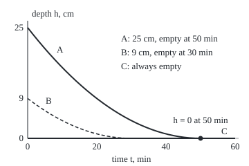

# The Picard-Lindelof theorem: a speed limit on the rate guarantees exactly one solution

Differential equations and dynamics → Existence, Uniqueness and Sensitivity → Speed limits on a rate law → The Picard-Lindelof theorem

---

## General Overview

A bucket holds water 25 cm deep and leaks through a hole in its floor. The fuller it is, the faster it drains: the depth falls at 0.2 times its square root, in cm per minute. At 25 cm that is 1 cm a minute. At empty, nothing moves.

Start full, and the rate law allows one curve: 16 cm after 10 minutes, empty at 50. Now run it backwards: found empty at minute 50, how deep was it at minute 0? The rate law cannot say. "Always empty" fits. "Full, then drained" fits. "9 cm, empty at minute 30" fits too.

The difference is how sharply the rate reacts to the depth. Near 25 cm, a millimetre more water barely changes the leak. Near empty, a sliver of water changes it out of all proportion. A bound on that sharpness is a **Lipschitz condition**, and the theorem of Émile Picard and Ernst Lindelöf says such a bound buys exactly one solution.

**If the rate law is continuous and changes with the current value no faster than a fixed multiple of the change in value, then from any starting value there is exactly one solution, at least for a stretch of time that can be computed in advance.**

**What kind of fact this is:** a theorem, proved on this card in Why it works, with the step that needs the most care folded into a Detailed proof.

### The picture: three pasts, one empty bucket

<p align="center"></p>

Drawn to scale: 5 px per minute across, 6.4 px per cm up. Each drain curve is an exact parabola: A from (40, 40) to (290, 200), B from (40, 142.4) to (190, 200), each bent toward a control point, (165, 200) and (115, 200), where its starting slope meets the time axis. All three reach the dot; backwards from it, the rate law cannot choose.

---

## The formula

A rate law is written $y' = f(t, y)$: the rate of $y$ at time $t$ is the rule $f$ applied to the time and the current value, starting from the value $y_0$ at time $t_0$. For the bucket the unknown is the depth $h$ and $f(t, h) = -0.2\sqrt{h}$.

Everything happens in a **box** around the start: times within $a$ of $t_0$, values within $b$ of $y_0$. The Lipschitz condition asks for one number $L$ bounding how fast the rule changes with the value:

$$\lvert f(t, y) - f(t, z)\rvert \le L\,\lvert y - z\rvert \quad\text{for every } t, y, z \text{ in the box}$$

**Read it aloud:** two values a distance apart get rates at most L times that distance apart.

The theorem. Let $f$ be continuous in the box with Lipschitz constant $L$, and let $M$ be the largest size of $f$ in the box. Then

$$y' = f(t, y),\;\; y(t_0) = y_0 \quad\text{has exactly one solution for } \lvert t - t_0\rvert \le T, \qquad T = \min\!\left(a,\ \frac{b}{M}\right).$$

**Read it aloud:** the start fixes one solution, lasting at least until the box's time runs out or the solution could first reach its edge.

The proof uses the **Picard map** $P$ of [picard-iteration](01-picard-iteration.md): a guessed curve in, the start value plus the rule's integral along the guess out.

$$P[y](t) = y_0 + \int_{t_0}^{t} f\bigl(s, y(s)\bigr)\,ds$$

| Symbol | Plain meaning | In our example | Push it up and the answer… |
| --- | --- | --- | --- |
| $y$, $h$ | the unknown; for the bucket, depth in cm | $h$ | — |
| $t$, $t_0$ | time in minutes; the start time | $t_0 = 0$ | — |
| $y_0$ | the starting value | 25 cm | — |
| $f$ | the rate law, cm per minute | $-0.2\sqrt{h}$ | a faster rule, a larger $M$ |
| $a$, $b$ | the box's half-widths in time and value | 10 min, 16 cm | a longer promise, until $b/M$ binds |
| $M$ | the largest size of $f$ in the box | $0.2\sqrt{41} = 1.280625$ cm/min | a shorter window $b/M$ |
| $L$ | the Lipschitz constant, per minute | $0.1/\sqrt{9} = 0.033333$ | each Picard round shrinks less |
| $T$, $P$ | the guaranteed window; the Picard map | 10 min | — |

When $f$ has a derivative in the value, $L$ is its steepest slope in the box, by the mean value theorem: for the bucket, $0.1/\sqrt{h}$ at the shallow end, 9 cm.

### When it holds

- **The rule is continuous in the box.** Drop this and there may be no solution: with rate −1 at zero and above, +1 below, every curve from zero is pushed back across.
- **A Lipschitz bound on the state.** Drop it and a solution still exists (Peano's theorem: continuity alone gives existence, not uniqueness), but several may leave the same start. The bucket at empty has infinitely many.
- **Time only up to $T$.** The promise is local: $y' = y^2$ from $y = 1$ reaches infinity at $t = 1$ ([blow-up-and-the-life-span-of-a-solution](03-blow-up-and-the-life-span-of-a-solution.md)).

---

## Why it works

### Step 0: a solution is a curve the Picard map leaves unchanged

By the fundamental theorem of calculus, a continuous curve solves $y' = f(t, y)$ with $y(t_0) = y_0$ exactly when $P[y] = y$. So "how many solutions?" becomes "how many curves does $P$ leave fixed?" The contraction principle answers that ([fixed-point-iteration-and-the-contraction-principle](../../06-Calculus%20and%20analysis/03-What%20Derivatives%20Tell%20You/07-fixed-point-iteration-and-the-contraction-principle.md)): a map that brings any two inputs closer by a fixed factor below 1 has exactly one fixed point.

### Step 1: the map keeps curves inside the box

The rule's size is at most $M$ in the box, so $P[y]$ drifts from $y_0$ by at most $M$ per minute: at most $b$ over $T \le b/M$ minutes. A guess inside the box comes back inside, where the Lipschitz bound applies. For the bucket, $b/M = 16/1.280625 = 12.49$ minutes, so $T = 10$ minutes.

### Step 2: the map shrinks the gap between two guesses

Take two guesses $y$ and $z$; their gap is the largest distance between them over the window. At each moment their rates differ by at most $L$ times the gap, so after at most $T$ minutes of integrating, the outputs differ by at most $L \cdot T$ times the gap. For the bucket $L \cdot T = (1/30) \times 10 = 1/3$: each round cuts any gap to a third or less.

### Step 3: the rounds settle on a curve

Start from the flat guess $y_0$ and apply $P$ repeatedly. Each move is at most a third of the last, so the moves total at most $10 + 10/3 + 10/9 + \dots = 15$ cm, and the curves close in on one limit ([sequences-and-limits](../../06-Calculus%20and%20analysis/01-Limits%20and%20Continuity/03-sequences-and-limits.md)). $P$ leaves the limit fixed: a solution exists.

### Step 4: two solutions would have to coincide

If $y$ and $z$ both solve the problem, both are fixed by $P$, so their gap is at most a third of itself. That gap is zero.

### Step 5: why the empty bucket escapes

Near empty, the rate's change divided by the depth's change is $0.2/\sqrt{h}$: 0.2 from 1 cm, 2 from 0.01 cm, 20 from 0.0001 cm. No $L$ covers a box touching zero, so Step 2 has no factor and Step 4 nothing to squeeze. The fork in the picture fills that hole.

<details>
<summary>Detailed proof: dropping the need for $L \cdot T &lt; 1$</summary>

Let $d_j(t)$ be the largest distance between the j-th rounds from two guesses, over times from $t_0$ to $t$, and $d$ the starting gap. The Lipschitz bound inside the integral gives $d_1(t) \le L\lvert t - t_0\rvert d$; feeding that back in, $d_2(t) \le \tfrac{1}{2}(L\lvert t - t_0\rvert)^2 d$, and by induction
$$d_j(t) \le \frac{(L\lvert t - t_0\rvert)^j}{j!}\, d.$$
The factorial beats any power, so for some count of rounds the factor falls below 1 and that many rounds of $P$ form a contraction. Its fixed point is fixed by $P$ too, since $P$ of it is another fixed point of the same rounds. Every solution stays in the box up to time $T$ by Step 1, so every solution is that point. Epsilon form: given $\varepsilon > 0$, past the round whose factor drops below $\varepsilon$, the curves stay within $\varepsilon d$ of each other.

</details>

The factorial is why the code's measured shrink falls from 0.107930 to 0.037537, under the promised 1/3. Gronwall's inequality reaches uniqueness without iterating ([gronwall-and-continuous-dependence](04-gronwall-and-continuous-dependence.md)).

---

## Worked numbers, by hand

The bucket from 25 cm at minute 0, box of 10 minutes by 16 cm.

| Step | Arithmetic | Value |
| --- | --- | --- |
| fastest fall in the box | $0.2\sqrt{41}$ | 1.280625 cm/min |
| time to reach the box's edge | $16 / 1.280625$ | 12.49 min |
| guaranteed window | the smaller of 10 and 12.49 | $T = 10$ min |
| Lipschitz constant | steepest slope, $0.1/\sqrt{9}$ | 0.033333 per min |
| promised shrink per round | $L \cdot T = 0.033333 \times 10$ | 1/3 |
| round 1 at 10 min | $25 + 10 \times (-0.2\sqrt{25})$ | 15 cm |
| round 2 at 10 min | $25 - \tfrac{2}{15}(125 - 15^{3/2})$ | 16.0793 cm |
| separation formula | $(5 - 0.1 \times 10)^2$ | **16 cm** |

Four more rounds land on 16.000000 cm, the value [separable-equations](../01-Rate%20Equations/03-separable-equations.md) gives. After 10 minutes the bucket holds 16 cm, and no other depth is possible.

### What breaks if you drop a piece

| Mistake | Comes out at | What went wrong |
| --- | --- | --- |
| Start from empty at 50 min, where no $L$ exists | depth at 0 min: 0, 25 or 9 cm, all valid | slope quotients 0.2, 2, 20 near empty: no speed limit |
| Stretch the window to 40 min, same box | $L \cdot T = 1.333333$; depth hits the box's floor, 9 cm, at 20 min | no shrink below 1, and the curve leaves the box |
| Take a solver's answer as the only one | Euler's rule stepped back 50 min from empty: 0.000000 cm | a method follows one branch |

---

## Code, from first principles, and it actually runs

Three roads to the depth at 10 minutes: the separation formula; six Picard rounds, integrating by the trapezoid rule (averaging the rate at both ends of each small slice); and Euler's rule, small steps along the slope ([eulers-method](../05-Numerical%20Evolution/01-eulers-method.md)), whose error halves with the step. $L$ is found by calculus and by the largest quotient on a fine grid. The full-bucket past is checked against the integral equation, not the formula that drew it.

### Python

```python
# Picard-Lindelof on a leaking bucket -- the check behind the card.  Standard
# library only.  Rate law h' = -0.2 sqrt(h): depth h in cm, time t in minutes.
from math import sqrt

def f(h):                                      # the rate law, in cm per minute
    return -0.2 * sqrt(max(h, 0.0))

def exact(t):                                  # road one: separation, full at t = 0
    return (5.0 - 0.1 * t) ** 2 if t <= 50 else 0.0

A, B, H0 = 10.0, 16.0, 25.0                    # the box: 10 min, depth 25 +- 16 cm
M = 0.2 * sqrt(H0 + B)                         # fastest fall anywhere in the box
L = 0.1 / sqrt(H0 - B)                         # steepest slope of f in the box, by calculus
T = min(A, B / M)
grid = [H0 - B + 0.01 * k for k in range(3201)]
L_seen = max(abs(f(u) - f(v)) / (v - u) for u, v in zip(grid, grid[1:]))
print(f"box: M = {M:.6f} cm/min, b/M = {B / M:.6f} min, window T = {T:.6f} min")
print(f"L = {L:.6f} per min by calculus; largest quotient on a 0.01 cm grid {L_seen:.6f}; slope at 25 cm {0.1 / sqrt(H0):.6f}")
print(f"promised shrink per round, L x T = {L * T:.6f}")

N = 1000; dt = T / N                           # road two: Picard rounds, trapezoid integral
phi, gaps = [H0] * (N + 1), []
for n in range(1, 7):
    new = [H0]
    for i in range(N):
        new.append(new[-1] + 0.5 * dt * (f(phi[i]) + f(phi[i + 1])))
    gaps.append(max(abs(u - v) for u, v in zip(new, phi)))
    phi = new
    ratio = f"{gaps[-1] / gaps[-2]:.6f}" if n > 1 else "-"
    print(f"round {n}: depth at 10 min {phi[-1]:.6f} cm, gap {gaps[-1]:.6f}, shrink {ratio}")
print(f"separation formula at 10 min: {exact(T):.6f} cm; empty at t = 50 min: {exact(50):.6f}; rate at 25 cm {-f(H0):.6f}")

errs = []                                      # road three: Euler steps against the formula
for step in (1.0, 0.5, 0.25):
    h = H0
    for _ in range(round(T / step)):
        h += step * f(h)
    errs.append(h - exact(T))
print("Euler error at 10 min, steps 1, 0.5, 0.25 min: " + ", ".join(f"{e:.6f}" for e in errs))

for q in (1.0, 0.01, 0.0001):                  # the slope of f blows up at empty
    print(f"slope quotient between h = {q:g} and 0: {abs(f(q) - f(0.0)) / q:.6f}")
past = lambda t, e: (0.1 * (e - t)) ** 2 if t <= e else 0.0   # emptied at minute e
K = 5000; ds = 50.0 / K                        # integral equation back from h(50) = 0
back = -sum(0.5 * ds * (f(past(k * ds, 50)) + f(past((k + 1) * ds, 50))) for k in range(K))
print(f"from h(50) = 0, depth at t = 0: stay empty {-50 * f(0.0):.6f}; emptied at 50: {past(0, 50):.6f}; "
      f"emptied at 30: {past(0, 30):.6f}")
eb = 0.0                                       # Euler, 1-minute steps back from empty
for _ in range(50): eb -= f(eb)
print(f"integral equation for the emptied-at-50 past, depth at t = 0: {back:.6f}; Euler back: {eb:.6f}")
print(f"window stretched to 40 min: L x T = {L * 40:.6f}; depth at 20 min {exact(20):.6f}, the box's floor")
def fig(e):                                    # quadratic Bezier: start, control, end
    d = past(0, e)
    return f"(40, {200 - 6.4 * d:.1f}) ctrl ({40 + 5 * d / -f(d):.0f}, 200) to ({40 + 5 * e:.0f}, 200)"
print(f"figure, full {fig(50)}; emptied at 30 {fig(30)}")
assert abs(phi[-1] - exact(T)) < 1e-5 and abs(errs[2]) < abs(errs[0]) / 3   # roads agree
assert all(g2 <= L * T * g1 for g1, g2 in zip(gaps, gaps[1:]))           # contraction bound
assert abs(L_seen - L) < 1e-4                                            # L two ways
assert abs(back - past(0, 50)) < 1e-6                                    # a second past fits
print("ALL CHECKS PASS")
```

**Ran 2026-09-28 on macOS, Python 3.14.6, standard library only. All checks passed. Output, pasted from the run:**

```
box: M = 1.280625 cm/min, b/M = 12.493901 min, window T = 10.000000 min
L = 0.033333 per min by calculus; largest quotient on a 0.01 cm grid 0.033324; slope at 25 cm 0.020000
promised shrink per round, L x T = 0.333333
round 1: depth at 10 min 15.000000 cm, gap 10.000000, shrink -
round 2: depth at 10 min 16.079300 cm, gap 1.079300, shrink 0.107930
round 3: depth at 10 min 15.995447 cm, gap 0.083853, shrink 0.077692
round 4: depth at 10 min 16.000207 cm, gap 0.004760, shrink 0.056771
round 5: depth at 10 min 15.999992 cm, gap 0.000215, shrink 0.045203
round 6: depth at 10 min 16.000000 cm, gap 0.000008, shrink 0.037537
separation formula at 10 min: 16.000000 cm; empty at t = 50 min: 0.000000; rate at 25 cm 1.000000
Euler error at 10 min, steps 1, 0.5, 0.25 min: -0.090257, -0.044878, -0.022376
slope quotient between h = 1 and 0: 0.200000
slope quotient between h = 0.01 and 0: 2.000000
slope quotient between h = 0.0001 and 0: 20.000000
from h(50) = 0, depth at t = 0: stay empty 0.000000; emptied at 50: 25.000000; emptied at 30: 9.000000
integral equation for the emptied-at-50 past, depth at t = 0: 25.000000; Euler back: 0.000000
window stretched to 40 min: L x T = 1.333333; depth at 20 min 9.000000, the box's floor
figure, full (40, 40.0) ctrl (165, 200) to (290, 200); emptied at 30 (40, 142.4) ctrl (115, 200) to (190, 200)
ALL CHECKS PASS
```

### Rust

Same numbers, same labels, built with `rustc --edition 2021 -O`.

```rust
// Picard-Lindelof on a leaking bucket -- the same check as the Python, in Rust.
// No crates.  Rate law h' = -0.2 sqrt(h): depth h in cm, time t in minutes.
fn f(h: f64) -> f64 { -0.2 * h.max(0.0).sqrt() }             // the rate law, cm per minute

fn exact(t: f64) -> f64 { if t <= 50.0 { (5.0 - 0.1 * t).powi(2) } else { 0.0 } }

fn past(t: f64, e: f64) -> f64 { if t <= e { (0.1 * (e - t)).powi(2) } else { 0.0 } }

fn fig(e: f64) -> String {                                   // quadratic Bezier: start, control, end
    let d = past(0.0, e);
    format!("(40, {:.1}) ctrl ({:.0}, 200) to ({:.0}, 200)", 200.0 - 6.4 * d, 40.0 + 5.0 * d / -f(d), 40.0 + 5.0 * e)
}

fn main() {
    let (a, b, h0) = (10.0_f64, 16.0_f64, 25.0_f64);         // the box: 10 min, depth 25 +- 16 cm
    let m = 0.2 * (h0 + b).sqrt();                           // fastest fall anywhere in the box
    let l = 0.1 / (h0 - b).sqrt();                           // steepest slope of f, by calculus
    let t = a.min(b / m);
    let grid: Vec<f64> = (0..3201).map(|k| h0 - b + 0.01 * k as f64).collect();
    let l_seen = grid.windows(2).map(|w| (f(w[0]) - f(w[1])).abs() / (w[1] - w[0])).fold(0.0, f64::max);
    println!("box: M = {:.6} cm/min, b/M = {:.6} min, window T = {:.6} min", m, b / m, t);
    println!("L = {:.6} per min by calculus; largest quotient on a 0.01 cm grid {:.6}; slope at 25 cm {:.6}", l, l_seen, 0.1 / h0.sqrt());
    println!("promised shrink per round, L x T = {:.6}", l * t);

    let n = 1000;                                            // road two: Picard rounds, trapezoid integral
    let dt = t / n as f64;
    let (mut phi, mut gaps) = (vec![h0; n + 1], Vec::new());
    for r in 1..7 {
        let mut new = vec![h0];
        for i in 0..n {
            let last = new[i];
            new.push(last + 0.5 * dt * (f(phi[i]) + f(phi[i + 1])));
        }
        gaps.push(new.iter().zip(&phi).map(|(u, v)| (u - v).abs()).fold(0.0, f64::max));
        phi = new;
        let g = gaps.len();
        let ratio = if r > 1 { format!("{:.6}", gaps[g - 1] / gaps[g - 2]) } else { "-".to_string() };
        println!("round {}: depth at 10 min {:.6} cm, gap {:.6}, shrink {}", r, phi[n], gaps[g - 1], ratio);
    }
    println!("separation formula at 10 min: {:.6} cm; empty at t = 50 min: {:.6}; rate at 25 cm {:.6}", exact(t), exact(50.0), -f(h0));

    let mut errs = Vec::new();                               // road three: Euler steps against the formula
    for step in [1.0_f64, 0.5, 0.25] {
        let mut h = h0;
        for _ in 0..(t / step).round() as usize { h += step * f(h) }
        errs.push(h - exact(t));
    }
    println!("Euler error at 10 min, steps 1, 0.5, 0.25 min: {:.6}, {:.6}, {:.6}", errs[0], errs[1], errs[2]);

    for q in [1.0_f64, 0.01, 0.0001] {                       // the slope of f blows up at empty
        println!("slope quotient between h = {} and 0: {:.6}", q, (f(q) - f(0.0)).abs() / q);
    }
    let (k, ds) = (5000, 50.0 / 5000.0);                     // integral equation back from h(50) = 0
    let back: f64 = -(0..k).map(|j| 0.5 * ds * (f(past(j as f64 * ds, 50.0)) + f(past((j + 1) as f64 * ds, 50.0)))).sum::<f64>();
    println!("from h(50) = 0, depth at t = 0: stay empty {:.6}; emptied at 50: {:.6}; emptied at 30: {:.6}",
             -50.0 * f(0.0), past(0.0, 50.0), past(0.0, 30.0));
    let mut eb = 0.0;                                        // Euler, 1-minute steps back from empty
    for _ in 0..50 { eb -= f(eb) }
    println!("integral equation for the emptied-at-50 past, depth at t = 0: {:.6}; Euler back: {:.6}", back, eb);
    println!("window stretched to 40 min: L x T = {:.6}; depth at 20 min {:.6}, the box's floor", l * 40.0, exact(20.0));
    println!("figure, full {}; emptied at 30 {}", fig(50.0), fig(30.0));
    assert!((phi[n] - exact(t)).abs() < 1e-5 && errs[2].abs() < errs[0].abs() / 3.0);   // roads agree
    assert!(gaps.windows(2).all(|g| g[1] <= l * t * g[0]));                            // contraction bound
    assert!((l_seen - l).abs() < 1e-4);                                                // L two ways
    assert!((back - past(0.0, 50.0)).abs() < 1e-6);                                    // a second past fits
    println!("ALL CHECKS PASS");
}
```

**Ran 2026-09-28 on macOS, rustc 1.98.1, no crates. All checks passed. Output, pasted from the run:**

```
box: M = 1.280625 cm/min, b/M = 12.493901 min, window T = 10.000000 min
L = 0.033333 per min by calculus; largest quotient on a 0.01 cm grid 0.033324; slope at 25 cm 0.020000
promised shrink per round, L x T = 0.333333
round 1: depth at 10 min 15.000000 cm, gap 10.000000, shrink -
round 2: depth at 10 min 16.079300 cm, gap 1.079300, shrink 0.107930
round 3: depth at 10 min 15.995447 cm, gap 0.083853, shrink 0.077692
round 4: depth at 10 min 16.000207 cm, gap 0.004760, shrink 0.056771
round 5: depth at 10 min 15.999992 cm, gap 0.000215, shrink 0.045203
round 6: depth at 10 min 16.000000 cm, gap 0.000008, shrink 0.037537
separation formula at 10 min: 16.000000 cm; empty at t = 50 min: 0.000000; rate at 25 cm 1.000000
Euler error at 10 min, steps 1, 0.5, 0.25 min: -0.090257, -0.044878, -0.022376
slope quotient between h = 1 and 0: 0.200000
slope quotient between h = 0.01 and 0: 2.000000
slope quotient between h = 0.0001 and 0: 20.000000
from h(50) = 0, depth at t = 0: stay empty 0.000000; emptied at 50: 25.000000; emptied at 30: 9.000000
integral equation for the emptied-at-50 past, depth at t = 0: 25.000000; Euler back: 0.000000
window stretched to 40 min: L x T = 1.333333; depth at 20 min 9.000000, the box's floor
figure, full (40, 40.0) ctrl (165, 200) to (290, 200); emptied at 30 (40, 142.4) ctrl (115, 200) to (190, 200)
ALL CHECKS PASS
```

The outputs match line for line.

> [!TIP]
> **Try changing**
> Guess first, then run it.
> - **Widen the box.** Set `B` to `20.0`, reaching down to 5 cm. $L$ rises to 0.044721 and the promised shrink to 0.447214; the rounds still settle on 16 cm.
> - **Shorten the window.** Set `A` to `5.0`. The promise tightens to 0.166667, and the rounds land on (5 − 0.5)^2 = 20.25 cm, the depth at 5 minutes (the label still says 10).
> - **Break the rate law.** Change `-0.2` to `-0.3` in `f` only. The rounds land on (5 − 1.5)^2 = 12.25 cm, the formula still says 16, and the first assert stops the run.

---

## The usual mistake

> [!warning]
> **Reading the theorem as "continuous rules have one solution".** Continuity buys only existence. The bucket's rule is continuous at empty, and three pasts reach the same empty bucket. Uniqueness needs the speed limit $L$, which $\sqrt{h}$ lacks at zero.
>
> - **Reading a failed hypothesis as proof of many solutions.** Without $L$ the theorem is silent. Forwards from empty the bucket has one future, since depth cannot go negative; the fork is in the past.
> - **Treating the window as the solution's life.** The promise is 10 minutes; the curve lives on to empty at 50.
> - **Measuring $L$ at the start only.** The slope at 25 cm is 0.020000 per minute; at the box's floor it is 0.033333, and the proof needs the worst.

---

## Where you meet it in real life

- **Draining tanks.** Torricelli's law makes outflow grow with the square root of the depth, so an empty tank does not reveal when it emptied; reconstructing past levels needs extra data.
- **Simulation software.** A solver assumes the current state fixes the next; $L$ also governs how its errors grow (convergence-of-one-step-methods).

> **Say it back**
> A rate law can allow several solutions from one start. If the rule is continuous and its rate changes at most L times as fast as the value, the Picard map shrinks the gap between any two guesses by a fixed factor. Its rounds settle on one curve, and no second curve exists, for a window the box fixes. The bucket from 25 cm has one future; the empty bucket has many pasts, because the square root has no such bound at zero.

---

## What this builds on

- [picard-iteration](01-picard-iteration.md): the Picard map and its rounds.
- [separable-equations](../01-Rate%20Equations/03-separable-equations.md): the closed form $(5 - 0.1t)^2$.
- [fixed-point-iteration-and-the-contraction-principle](../../06-Calculus%20and%20analysis/03-What%20Derivatives%20Tell%20You/07-fixed-point-iteration-and-the-contraction-principle.md): a shrinking map has exactly one fixed point.
- [sequences-and-limits](../../06-Calculus%20and%20analysis/01-Limits%20and%20Continuity/03-sequences-and-limits.md): why shrinking moves have a limit.

## Where this goes next

- [blow-up-and-the-life-span-of-a-solution](03-blow-up-and-the-life-span-of-a-solution.md): how long a unique solution runs.
- [gronwall-and-continuous-dependence](04-gronwall-and-continuous-dependence.md): $L$ bounds how nearby starts drift apart.
- [fixed-points-of-a-map](../11-Discrete%20Dynamics%20and%20Chaos/02-fixed-points-of-a-map.md): shrinking maps on numbers.
- [existence-and-uniqueness-for-sdes](../../11-Stochastic%20processes%20and%20calculus/06-Ito%20Calculus/07-existence-and-uniqueness-for-sdes.md): the argument with noise added.
- convergence-of-one-step-methods: $L$ controlling solver error.
- vector-fields-and-flows: one solution through every point.

The theorem certifies 10 minutes; how long a solution actually survives, and whether it can reach infinity in finite time, is answered in [blow-up-and-the-life-span-of-a-solution](03-blow-up-and-the-life-span-of-a-solution.md).

---

## Sources

Verified 2026-09-28: every link below resolves to the publisher's or author's page.

- Teschl, Gerald. *Ordinary Differential Equations and Dynamical Systems*. Graduate Studies in Mathematics 140, American Mathematical Society, 2012. [Author's page with the free text](https://www.mat.univie.ac.at/~gerald/ftp/book-ode/). Chapter 2: the theorem by the factorial estimate, Peano's theorem, the square-root fork.
- Hirsch, Morris W., Stephen Smale and Robert L. Devaney. *Differential Equations, Dynamical Systems, and an Introduction to Chaos*, 3rd ed. Academic Press (Elsevier), 2012. [Publisher page](https://shop.elsevier.com/books/differential-equations-dynamical-systems-and-an-introduction-to-chaos/hirsch/978-0-12-382010-5). Chapter 17: existence and uniqueness by Picard's rounds.
