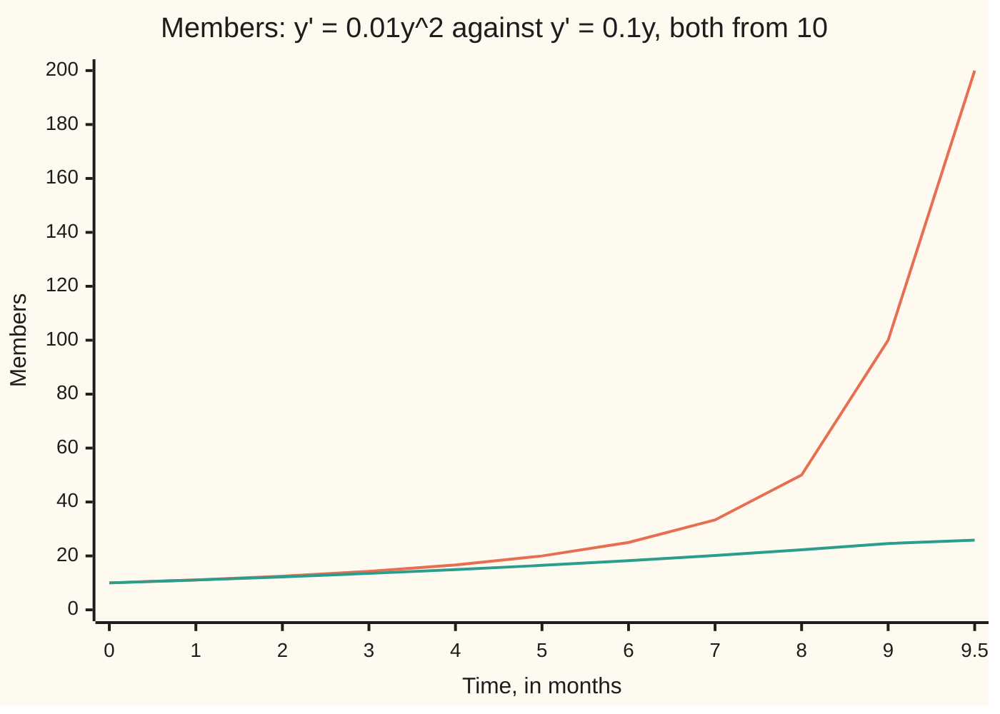

# Blow-up: a smooth equation can send its solution to infinity in finite time

Differential equations and dynamics → Existence, Uniqueness and Sensitivity → How long a solution lasts → Blow-up

---

## General Overview

A pyramid scheme starts with 10 members. New members are recruited by pairs of existing members, and the number of pairs grows like the square of the membership. Take the recruiting rate as 0.01 times the square of the members, per month: 1 new member a month at the start.

An ordinary scheme, where each member recruits alone at 10% a month, also starts at 1 a month. After 4 months the two are close: 16.67 members against 14.92. Then they part. The ordinary scheme doubles every 6.93 months and holds 27.18 members at month 10. The square scheme holds 20 at month 5, 100 at month 9, 200 at month 9.5, and reaches infinity at month 10.

The rate is a smooth square, with no jumps or corners, yet the solution ends.

**When the rate grows like the square of the amount, each doubling takes half as long as the last, the doubling times add up to a finite total, and the solution reaches infinity at that moment; a rate linear in the amount can never do this.**

**What kind of fact this is:** a theorem, proved on this card in Why it works, with the general rule in a folded detailed proof.

### The picture: two schemes, the same start



Orange: the square scheme, y = 100/(10 − t), heading for infinity at 10 months. Teal: the linear scheme, y = 10e^(0.1t), finite at every time. The last point is at 9.5 months.

---

## The formula

Reminder: y' = f(t, y) says "the rate of y at time t is f(t, y)", with y(0) = y0 the start ([what-a-differential-equation-says](../01-Rate%20Equations/01-what-a-differential-equation-says.md)). For the square scheme:

$$y' = k\,y^2,\quad y(0) = y_0>0 \qquad\Longrightarrow\qquad y(t) = \frac{y_0}{1 - k\,y_0\,t},\qquad T = \frac{1}{k\,y_0}$$

**Read it aloud:** a rate of k times the amount squared gives the start over one minus k y0 t, infinite at the time T = 1/(k y0).

With $k$ = 0.01 and $y_0$ = 10: y = 100/(10 − t) and $T$ = 10 months. For y' = y^2, k = 1 and T = 1/y0.

A solution's **maximal interval** is the longest time interval, containing the start, on which it exists; from here on, its life span. For the scheme it runs from minus infinity to 10 months. The start matters: from y0 = 0 the solution stays 0 forever, and from a negative start it shrinks toward 0 for all later time.

**Blow-up alternative.** If $f$ meets the Picard-Lindelof conditions everywhere, a life span ending at a finite time T ends with |y| growing without bound.

**Linear equations never blow up.** If the rate is linear in y,

$$y' = a(t)\,y + b(t),$$

with $a$ and $b$ continuous for all time, the solution exists for all time.

**Read it aloud:** a rate linear in the amount gives a solution that lasts forever.

| Symbol | Plain meaning | In our example | Push it up and the answer… |
| --- | --- | --- | --- |
| $t$ | time since the start, in months | 0 to 10 | — |
| $y$, $y_0$ | members, and members at the start | 10 at the start | ends sooner: 20 ends at 5 months |
| $y'$ | the recruiting rate, members per month | 1 at the start | — |
| $k$ | recruiting constant, per member per month | 0.01 | ends sooner |
| $T$ | blow-up time, the end of the life span | 10 months | — |
| $f$ | the rate rule | 0.01y^2 | — |
| $a$, $b$ | a(t) multiplies y; b(t) is added whatever y is | 0.1 per month and 0 | faster growth, no end |
| $Y$ | size at the start of a doubling | 10, 20, 40, … | quicker doubling |

### When it holds

- **The rate is locally Lipschitz in y** (on any bounded patch it changes by at most a fixed multiple of the change in y). Without it, h' = −sqrt(h) reaches h = 0 along many different paths, so an empty bucket's past is not determined, and "the" solution is not defined.
- **The rate is defined and Lipschitz for every y.** Otherwise a solution can end at an edge: the leaking bucket h' = −0.2 sqrt(h), h(0) = 25, is Lipschitz only for h > 0, and there its solution h = (5 − 0.1t)^2 ends at t = 50, at the finite height 0.
- **Growth at most linear in y**, for global existence, a solution for all time. The rate 0.01y^2 outgrows every multiple of y, and ends at 10 months.

---

## Why it works

### Step 0: a doubling that speeds up has a finite total

For the linear scheme every doubling takes the same 6.93 months, so infinitely many take forever. For the square scheme the rate at size Y is proportional to Y^2, so gaining Y takes time proportional to Y/Y^2 = 1/Y. Each doubling takes half as long as the last. Halves of halves add to a finite total, and by then the membership has doubled infinitely often.

### Step 1: separate and solve

The equation is separable ([separable-equations](../01-Rate%20Equations/03-separable-equations.md)). While y > 0, divide by y^2 and integrate both sides from 0 to t:

$$\int_{y_0}^{y}\frac{du}{u^2} = \int_0^t k\,ds \qquad\Longrightarrow\qquad \frac{1}{y_0} - \frac{1}{y} = k\,t.$$

Here u and s stand in for y and t inside the integrals. Solving, y = y0/(1 − k y0 t), whose denominator reaches zero at t = 1/(k y0). For the scheme, 1/y = 0.1 − 0.01t reaches zero at 10 months. Uniqueness, from the Picard-Lindelof theorem, makes this the scheme's only future.

### Step 2: the doubling times, added

Doubling from Y to 2Y takes the time

$$\int_Y^{2Y}\frac{du}{k\,u^2} = \frac{1}{k}\Big(\frac{1}{Y} - \frac{1}{2Y}\Big) = \frac{1}{2kY}.$$

At Y = 10 that is 5 months, then 2.5, 1.25, 0.625. The total is 5 × (1 + 1/2 + 1/4 + …) = 10 months, Step 1's T by another road. For the rate 0.1y the same integral gives ln 2/0.1 = 6.93 months at every size: 40 doublings take 277.26 months, and the total has no limit.

### Step 3: a life span ends only at infinity or at an edge

The Picard-Lindelof theorem gives a solution for a short time from any start ([lipschitz-and-the-picard-lindelof-theorem](02-lipschitz-and-the-picard-lindelof-theorem.md)), and how short depends only on how big the rate gets near the start. If a solution stayed in a bounded range near a finite end T, one fixed step would fit from every point near T and carry it past T. So a finite end needs |y| to grow without bound, or an edge.

<details>
<summary>Detailed proof</summary>

Let f be continuous on the plane and Lipschitz in y on every bounded rectangle. By uniqueness, gluing all solutions through (0, y0) gives one solution on a largest open interval (T−, T+) containing 0.

Suppose T+ is finite and |y(t)| does not tend to infinity as t → T+. Then some number M and times t_n → T+ have |y(t_n)| ≤ M. Let R be the rectangle 0 ≤ t ≤ T+ + 1, |y| ≤ M + 1, and C the largest value of |f| on R, finite since R is closed and bounded. From any start (s, z) with 0 ≤ s ≤ T+ and |z| ≤ M, the rectangle of height 1 around z lies in R, and the Picard-Lindelof theorem gives a solution on s ≤ t ≤ s + δ, with δ = min(1, 1/C). The step δ does not depend on s or z.

Choose n with t_n > T+ − δ. The solution from (t_n, y(t_n)) exists up to t_n + δ > T+ and, by uniqueness, agrees with y on the overlap. Glued to y, it is a solution on a longer interval than (T−, T+), contradicting maximality. So |y(t)| → ∞ as t → T+. The same argument runs backwards for T−.

For y' = a(t)y + b(t) with a and b continuous on the real line, set A(t) = ∫ from 0 to t of a(s) ds. The integrating factor gives
y(t) = e^(A(t)) (y0 + ∫ from 0 to t of e^(−A(s)) b(s) ds).
Every piece is continuous and finite for every real t, so the solution lives on the whole line. More generally, if |f(t, y)| ≤ α + β|y| for constants α and β, Gronwall's inequality gives |y| ≤ (|y0| + αt)e^(βt) for t ≥ 0, finite at every t, and the alternative rules out an end.

</details>

### Step 4: linear equations last forever

The integrating factor ([integrating-factor](../01-Rate%20Equations/05-integrating-factor.md)) writes a linear equation's solution with exponentials and integrals of continuous functions, none of which becomes infinite at a finite time. For the linear scheme it is 10e^(0.1t): 27.18 members at month 10. A rate growing no faster than a multiple of y allows at most exponential growth, the bound made exact in [gronwall-and-continuous-dependence](04-gronwall-and-continuous-dependence.md).

<details>
<summary>Which rates blow up?</summary>

For y' = f(y) with f positive, the time to reach infinity is the integral of 1/f(u) from y0 to infinity: Step 2's doublings added in one piece. For f = u^p it is finite exactly when p is bigger than 1, so u^1.5 blows up too, more slowly.

</details>

A formula-free road: Euler's rule, new value = old value + step length × rate ([eulers-method](../05-Numerical%20Evolution/01-eulers-method.md)). With steps of 0.0001 month it passes a million members at t = 10.0011; the formula says 9.9999.

---

## Worked numbers, by hand

| Step | Arithmetic | Value |
| --- | --- | --- |
| starting rate, square | 0.01 × 10^2 | 1.00 member a month |
| square at 5 months | 100/(10 − 5) | 20.00 members |
| first doubling time | 1/(2 × 0.01 × 10) | 5.00 months |
| doubling times added | 5 + 2.5 + 1.25 + … = 5 × 2 | 10 months |
| blow-up time | 1/(0.01 × 10) | **10.00 months** |
| linear at 10 months | 10e^1 | 27.18 members |
| linear doubling time | ln 2/0.1 | **6.93 months** |

The model promises infinitely many members at month 10; a real scheme collapses first, when recruits run out.

### What breaks if you drop a piece

| Mistake | Comes out at | What went wrong |
| --- | --- | --- |
| Exponential at the starting rate, 0.1 per month | 27.18 members at month 10 | The rate is not linear in y, so global existence fails; the truth is infinite |
| Formula read past blow-up, t = 12 | −50.00 members | Another branch of 100/(10 − t); the life span ended at 10 |
| Euler, 0.5-month steps through month 10 | 95.53 members | A finite step never sees infinity |
| Bucket h' = −0.2 sqrt(h) expected to last or blow up | empty at t = 50.00 | The rate is Lipschitz only for h > 0: the life span ends at that edge |

---

## Code, from first principles, and it actually runs

Three roads to the blow-up time: the closed form; Simpson's rule (an area from parabolas through evenly spaced points) on 40 doubling times, added; and Euler's steps to a million members. Bisection, halving a bracket, finds the linear doubling time without a logarithm.

### Python

```python
# Blow-up -- the check behind the card.  Standard library only.  The square
# scheme y' = 0.01 y^2, y(0) = 10 is answered by three roads: the closed form
# y = 100/(10 - t); Euler's small steps along the slope; and the time for each
# doubling, integrated by Simpson's rule and summed.  None calls another.
import math
K, Y0 = 0.01, 10.0

def closed(t):                              # separating gives 1/y0 - 1/y = k t
    return 1 / (1 / Y0 - K * t)

def euler(f, y, t_end, h):                  # new value = old value + step x rate
    for _ in range(round(t_end / h)):
        y = y + h * f(y)
    return y

def simpson(g, a, b, n=100):                # area under g from a to b, n even
    w = (b - a) / n
    return w / 3 * sum(g(a + i * w) * (1 if i in (0, n) else 4 if i % 2 else 2) for i in range(n + 1))

sq, lin = (lambda y: K * y * y), (lambda y: 0.1 * y)
dbl = [simpson(lambda y: 1 / sq(y), Y0 * 2**j, Y0 * 2**(j + 1)) for j in range(40)]
dbl_lin = [simpson(lambda y: 1 / lin(y), Y0 * 2**j, Y0 * 2**(j + 1)) for j in range(40)]
lo, hi = 0.0, 20.0                          # bisection: when does 10 e^(0.1t) reach 20?
for _ in range(100):
    mid = (lo + hi) / 2
    lo, hi = (mid, hi) if 10 * math.exp(0.1 * mid) < 20 else (lo, mid)
t, y, h = 0.0, Y0, 1e-4                     # Euler until the members pass a million
while y < 1e6:
    y, t = y + h * sq(y), t + h
hs = (0.1, 0.05, 0.025)
e5 = [euler(sq, Y0, 5, h) for h in hs]
errs = [abs(v - closed(5)) for v in e5]
ts = list(range(10)) + [9.5]
fmt = lambda xs, d: " ".join(f"{x:.{d}f}" for x in xs)
print(f"square scheme: y' = 0.01 y^2, y(0) = 10; blow-up time 1/(k y0) = {1 / (K * Y0):.2f} months")
print(f"starting rate: square 0.01 x 10^2 = {sq(Y0):.2f}, linear 0.1 x 10 = {lin(Y0):.2f} members per month")
print(f"t (months):  {fmt(ts, 1)}")
print(f"square y:    {fmt([closed(s) for s in ts], 2)}")
print(f"linear y:    {fmt([10 * math.exp(0.1 * s) for s in ts], 2)}")
print(f"linear at t = 10: {10 * math.exp(1):.2f} members; doubling ln 2 / 0.1 = {math.log(2) / 0.1:.4f}, bisection {lo:.4f} months")
print(f"square doublings, 10->20, 20->40, ... (Simpson): {fmt(dbl[:5], 4)} months")
print(f"sum of 40 square doublings = {sum(dbl):.6f} months, ending at {Y0 * 2**40:.0f} members")
print(f"linear doublings (Simpson): {fmt(dbl_lin[:3], 4)} ...; 40 of them = {sum(dbl_lin):.2f} months")
print(f"Euler, h = 0.0001, passes 1,000,000 members at t = {t:.4f}; formula: {1 / (K * Y0) - 1 / (K * 1e6):.4f}")
print(f"Euler at t = 5, h = 0.1, 0.05, 0.025: {fmt(e5, 4)}; exact {closed(5):.4f}")
print(f"errors {fmt(errs, 4)}; ratios on halving h: {errs[0] / errs[1]:.3f} {errs[1] / errs[2]:.3f}")
print(f"life span 1/(k y0) for y0 = 5, 20, 100: {fmt([1 / (K * v) for v in (5, 20, 100)], 2)} months")
print(f"bucket h' = -0.2 sqrt(h), h(0) = 25: h = (5 - 0.1t)^2 is 0 at t = {math.sqrt(25) / 0.1:.2f}, its edge")
print(f"mistake, exponential at the starting rate 0.1 per month: y(10) = {10 * math.exp(1):.2f}, not infinite")
print(f"mistake, formula read past blow-up, t = 12: y = {closed(12):.2f} members")
print(f"mistake, Euler with h = 0.5 steps through t = 10: y(10) = {euler(sq, Y0, 10, 0.5):.2f}")
assert abs(sum(dbl) - 1 / (K * Y0)) < 1e-6          # doubling sum meets the formula
assert abs(t - 10) < 0.01                            # Euler's blow-up time meets it too
assert 1.8 < errs[0] / errs[1] < 2.2 and 1.8 < errs[1] / errs[2] < 2.2  # Euler is order one
assert abs(lo - dbl_lin[0]) < 1e-6                   # bisection meets Simpson on 6.93
print("ALL CHECKS PASS")
```

**Ran 2026-09-28 on macOS, Python 3.14.6, standard library only. All checks passed. Output, pasted from the run:**

```
square scheme: y' = 0.01 y^2, y(0) = 10; blow-up time 1/(k y0) = 10.00 months
starting rate: square 0.01 x 10^2 = 1.00, linear 0.1 x 10 = 1.00 members per month
t (months):  0.0 1.0 2.0 3.0 4.0 5.0 6.0 7.0 8.0 9.0 9.5
square y:    10.00 11.11 12.50 14.29 16.67 20.00 25.00 33.33 50.00 100.00 200.00
linear y:    10.00 11.05 12.21 13.50 14.92 16.49 18.22 20.14 22.26 24.60 25.86
linear at t = 10: 27.18 members; doubling ln 2 / 0.1 = 6.9315, bisection 6.9315 months
square doublings, 10->20, 20->40, ... (Simpson): 5.0000 2.5000 1.2500 0.6250 0.3125 months
sum of 40 square doublings = 10.000000 months, ending at 10995116277760 members
linear doublings (Simpson): 6.9315 6.9315 6.9315 ...; 40 of them = 277.26 months
Euler, h = 0.0001, passes 1,000,000 members at t = 10.0011; formula: 9.9999
Euler at t = 5, h = 0.1, 0.05, 0.025: 19.7336 19.8642 19.9314; exact 20.0000
errors 0.2664 0.1358 0.0686; ratios on halving h: 1.961 1.980
life span 1/(k y0) for y0 = 5, 20, 100: 20.00 5.00 1.00 months
bucket h' = -0.2 sqrt(h), h(0) = 25: h = (5 - 0.1t)^2 is 0 at t = 50.00, its edge
mistake, exponential at the starting rate 0.1 per month: y(10) = 27.18, not infinite
mistake, formula read past blow-up, t = 12: y = -50.00 members
mistake, Euler with h = 0.5 steps through t = 10: y(10) = 95.53
ALL CHECKS PASS
```

### Rust

Same numbers, same labels, built with `rustc --edition 2021 -O`.

```rust
// Blow-up -- the same check as the Python, in Rust.  No crates.  The square
// scheme y' = 0.01 y^2, y(0) = 10 is answered by three roads: the closed form
// y = 100/(10 - t); Euler's small steps along the slope; and the time for each
// doubling, integrated by Simpson's rule and summed.  None calls another.
const K: f64 = 0.01;
const Y0: f64 = 10.0;

fn closed(t: f64) -> f64 { 1.0 / (1.0 / Y0 - K * t) }    // 1/y0 - 1/y = k t

fn euler(f: &dyn Fn(f64) -> f64, mut y: f64, t_end: f64, h: f64) -> f64 {
    for _ in 0..(t_end / h).round() as usize { y += h * f(y) } // new = old + step x rate
    y
}

fn simpson(g: &dyn Fn(f64) -> f64, a: f64, b: f64, n: usize) -> f64 {
    let w = (b - a) / n as f64;                           // area under g, n even
    let s: f64 = (0..=n).map(|i| {
        let c = if i == 0 || i == n { 1.0 } else if i % 2 == 1 { 4.0 } else { 2.0 };
        g(a + i as f64 * w) * c
    }).sum();
    w / 3.0 * s
}

fn fmt(xs: &[f64], d: usize) -> String {
    xs.iter().map(|x| format!("{:.*}", d, x)).collect::<Vec<_>>().join(" ")
}

fn main() {
    let sq = |y: f64| K * y * y;
    let lin = |y: f64| 0.1 * y;
    let span = |j: i32| (Y0 * 2f64.powi(j), Y0 * 2f64.powi(j + 1));
    let dbl: Vec<f64> = (0..40).map(|j| { let (a, b) = span(j); simpson(&|y| 1.0 / sq(y), a, b, 100) }).collect();
    let dbl_lin: Vec<f64> = (0..40).map(|j| { let (a, b) = span(j); simpson(&|y| 1.0 / lin(y), a, b, 100) }).collect();
    let (mut lo, mut hi) = (0.0f64, 20.0f64);             // bisection: 10 e^(0.1t) = 20
    for _ in 0..100 {
        let mid = (lo + hi) / 2.0;
        if 10.0 * (0.1 * mid).exp() < 20.0 { lo = mid } else { hi = mid }
    }
    let (mut t, mut y, h) = (0.0f64, Y0, 1e-4);           // Euler until a million members
    while y < 1e6 { y += h * sq(y); t += h; }
    let hs = [0.1, 0.05, 0.025];
    let e5: Vec<f64> = hs.iter().map(|&h| euler(&sq, Y0, 5.0, h)).collect();
    let errs: Vec<f64> = e5.iter().map(|v| (v - closed(5.0)).abs()).collect();
    let ts: Vec<f64> = (0..10).map(|i| i as f64).chain(std::iter::once(9.5)).collect();
    let sum: f64 = dbl.iter().sum();
    let sum_lin: f64 = dbl_lin.iter().sum();
    println!("square scheme: y' = 0.01 y^2, y(0) = 10; blow-up time 1/(k y0) = {:.2} months", 1.0 / (K * Y0));
    println!("starting rate: square 0.01 x 10^2 = {:.2}, linear 0.1 x 10 = {:.2} members per month", sq(Y0), lin(Y0));
    println!("t (months):  {}", fmt(&ts, 1));
    println!("square y:    {}", fmt(&ts.iter().map(|&s| closed(s)).collect::<Vec<_>>(), 2));
    println!("linear y:    {}", fmt(&ts.iter().map(|&s| 10.0 * (0.1 * s).exp()).collect::<Vec<_>>(), 2));
    println!("linear at t = 10: {:.2} members; doubling ln 2 / 0.1 = {:.4}, bisection {:.4} months", 10.0 * 1f64.exp(), 2f64.ln() / 0.1, lo);
    println!("square doublings, 10->20, 20->40, ... (Simpson): {} months", fmt(&dbl[..5], 4));
    println!("sum of 40 square doublings = {:.6} months, ending at {:.0} members", sum, Y0 * 2f64.powi(40));
    println!("linear doublings (Simpson): {} ...; 40 of them = {:.2} months", fmt(&dbl_lin[..3], 4), sum_lin);
    println!("Euler, h = 0.0001, passes 1,000,000 members at t = {:.4}; formula: {:.4}", t, 1.0 / (K * Y0) - 1.0 / (K * 1e6));
    println!("Euler at t = 5, h = 0.1, 0.05, 0.025: {}; exact {:.4}", fmt(&e5, 4), closed(5.0));
    println!("errors {}; ratios on halving h: {:.3} {:.3}", fmt(&errs, 4), errs[0] / errs[1], errs[1] / errs[2]);
    println!("life span 1/(k y0) for y0 = 5, 20, 100: {} months", fmt(&[5.0, 20.0, 100.0].map(|v: f64| 1.0 / (K * v)), 2));
    println!("bucket h' = -0.2 sqrt(h), h(0) = 25: h = (5 - 0.1t)^2 is 0 at t = {:.2}, its edge", 25f64.sqrt() / 0.1);
    println!("mistake, exponential at the starting rate 0.1 per month: y(10) = {:.2}, not infinite", 10.0 * 1f64.exp());
    println!("mistake, formula read past blow-up, t = 12: y = {:.2} members", closed(12.0));
    println!("mistake, Euler with h = 0.5 steps through t = 10: y(10) = {:.2}", euler(&sq, Y0, 10.0, 0.5));
    assert!((sum - 1.0 / (K * Y0)).abs() < 1e-6);         // doubling sum meets the formula
    assert!((t - 10.0).abs() < 0.01);                      // Euler's blow-up time meets it too
    assert!(errs[0] / errs[1] > 1.8 && errs[0] / errs[1] < 2.2 && errs[1] / errs[2] > 1.8 && errs[1] / errs[2] < 2.2);
    assert!((lo - dbl_lin[0]).abs() < 1e-6);               // bisection meets Simpson on 6.93
    println!("ALL CHECKS PASS");
}
```

**Ran 2026-09-28 on macOS, rustc 1.98.1, no crates. All checks passed. Output, pasted from the run:**

```
square scheme: y' = 0.01 y^2, y(0) = 10; blow-up time 1/(k y0) = 10.00 months
starting rate: square 0.01 x 10^2 = 1.00, linear 0.1 x 10 = 1.00 members per month
t (months):  0.0 1.0 2.0 3.0 4.0 5.0 6.0 7.0 8.0 9.0 9.5
square y:    10.00 11.11 12.50 14.29 16.67 20.00 25.00 33.33 50.00 100.00 200.00
linear y:    10.00 11.05 12.21 13.50 14.92 16.49 18.22 20.14 22.26 24.60 25.86
linear at t = 10: 27.18 members; doubling ln 2 / 0.1 = 6.9315, bisection 6.9315 months
square doublings, 10->20, 20->40, ... (Simpson): 5.0000 2.5000 1.2500 0.6250 0.3125 months
sum of 40 square doublings = 10.000000 months, ending at 10995116277760 members
linear doublings (Simpson): 6.9315 6.9315 6.9315 ...; 40 of them = 277.26 months
Euler, h = 0.0001, passes 1,000,000 members at t = 10.0011; formula: 9.9999
Euler at t = 5, h = 0.1, 0.05, 0.025: 19.7336 19.8642 19.9314; exact 20.0000
errors 0.2664 0.1358 0.0686; ratios on halving h: 1.961 1.980
life span 1/(k y0) for y0 = 5, 20, 100: 20.00 5.00 1.00 months
bucket h' = -0.2 sqrt(h), h(0) = 25: h = (5 - 0.1t)^2 is 0 at t = 50.00, its edge
mistake, exponential at the starting rate 0.1 per month: y(10) = 27.18, not infinite
mistake, formula read past blow-up, t = 12: y = -50.00 members
mistake, Euler with h = 0.5 steps through t = 10: y(10) = 95.53
ALL CHECKS PASS
```

The two outputs match line for line.

> [!TIP]
> **Try changing**
> Guess first, then run it.
> - **Twice the founders.** Change `Y0 = 10.0` to `Y0 = 20.0`. The run stops dividing by zero at t = 5: the life span is now 5 months.
> - **A gentler power.** Change `K * y * y` to `K * y ** 1.5`. Doublings take 18.52, 13.10, 9.26 months; 40 add to 63.25. Still blow-up; the first assert stops the run, since 1/(k y0) belongs to the square.
> - **A faster linear scheme.** Change `0.1 * y` to `0.2 * y` in `lin`. Each doubling takes 3.47 months, 40 take 138.63; the fourth assert stops the run, since the bisection still uses 0.1.

---

## The usual mistake

> [!warning]
> **Believing a smooth rate law gives a solution for all time.** The Picard-Lindelof theorem promises a solution only for a short while. The smooth rate 0.01y^2 ends at 10 months. Global existence needs growth no faster than linear in y.
>
> - **Reading the formula past its end.** −50.00 at month 12 is a number, not a membership.
> - **Trusting a stepper near blow-up.** Half-month Euler steps report 95.53 members at month 10.

---

## Where you meet it in real life

- **Thermal runaway.** Heat that speeds up its own reaction faster than linearly is modelled by a rate like y^2; the blow-up time is the time to ignition.
- **Population models.** The logistic law caps growth by crowding ([logistic-growth](../01-Rate%20Equations/07-logistic-growth.md)); a square rate without the cap blows up.

> **Say it back**
> The solution of y' = k y^2 is y0/(1 − k y0 t), infinite at 1/(k y0). Each doubling takes half as long as the last, and the halves add to that time. A maximal interval ends at a finite time only by blow-up or at an edge. Linear rate laws have finite explicit solutions, so they last forever.

---

## What this builds on

- [lipschitz-and-the-picard-lindelof-theorem](02-lipschitz-and-the-picard-lindelof-theorem.md): the short-time solution behind the blow-up alternative.
- [linear-vs-exponential-growth](../../01-Foundations/03-Powers%2C%20Roots%20and%20Logarithms/02-linear-vs-exponential-growth.md): the comparison of growth rates, pushed here past exponential.

## Where this goes next

- [the-flow-of-an-equation](05-the-flow-of-an-equation.md): every start carried forward by its own solution, defined only where each start's life span reaches.

---

## Sources

Verified 2026-09-28: every link below resolves to the publisher's page.

- Teschl, Gerald. *Ordinary Differential Equations and Dynamical Systems*. AMS Graduate Studies in Mathematics 140, 2012. [Author's text, posted with AMS permission](https://mat.univie.ac.at/~gerald/ftp/book-ode/). Chapter 2: the maximal solution, extension, and the blow-up alternative, proved in full.
- Hirsch, Morris W., Stephen Smale and Robert L. Devaney. *Differential Equations, Dynamical Systems, and an Introduction to Chaos*, 3rd ed. Academic Press, 2013. [Publisher page](https://shop.elsevier.com/books/differential-equations-dynamical-systems-and-an-introduction-to-chaos/hirsch/978-0-12-382010-5). Chapter 7: existence, uniqueness and how far solutions extend.
