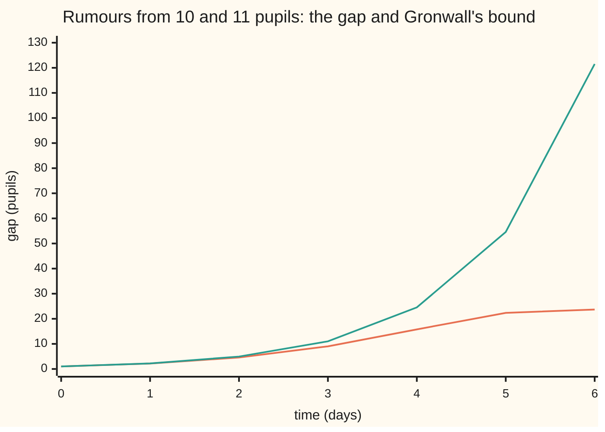

# Gronwall's inequality: nearby starts stay nearby for a while, and here is the bound

[Syllabus](../../../SYLLABUS.md) → [Differential equations and dynamics](../../../SYLLABUS.md#w08) → [Existence, Uniqueness and Sensitivity](../../../SYLLABUS.md#w08-s02) → Gronwall's inequality

---

## General Overview

Two cups of coffee are poured in a 20 C room, one at 80 C and one at 81 C. Each cup's temperature falls at 0.1 per minute times its excess over the room ([Growth, decay and cooling](../01-Rate%20Equations/04-exponential-growth-decay-and-cooling.md)). The hotter cup cools faster, so the 1 C gap shrinks to 0.3679 C after 10 minutes. They stay within 1 C forever.

Two rumours start in a 1,000-pupil school, one with 10 pupils and one with 11. Both spread by the logistic law with rate 0.8 per day ([Logistic growth](../01-Rate%20Equations/07-logistic-growth.md)). Here the gap grows, to 9.02 pupils by day 3 and a widest 24.08 on day 5.68, before the ceiling of 1,000 squeezes the counts together.

Gronwall's inequality controls such gaps without solving anything: for the rumours, the gap is at most e^(0.8t) pupils after t days. With existence and uniqueness, that bound makes a model **well-posed**: its answer exists, is the only one, and moves only a little when the start moves a little.

**If the rate law never makes a difference between two states grow faster than L times that difference, two solutions that start a distance δ apart are at most δe^(Lt) apart at time t.**

**What kind of fact this is:** a theorem, proved on this card in Why it works; "well-posed" is a definition built on it.

### The picture: the rumours' gap under its bound



Orange: the true gap between the two rumour counts. Green: the bound e^(0.8t). They nearly agree for two days; then the ceiling slows the gap and the bound runs away.

---

## The formula

Notation ([A differential equation](../01-Rate%20Equations/01-what-a-differential-equation-says.md)): $y' = f(t, y)$ says "the rate of $y$ at time $t$ is $f(t, y)$". Vertical bars, $|y - z|$, mean the distance between two numbers.

**Gronwall's inequality, integral form.** Let $w$ be continuous and never negative for times from 0 to $T$, and $L \ge 0$, $\delta \ge 0$ constants. If, at every such time,

$$w(t) \le \delta + \int_0^t L\,w(s)\,ds,$$

then, at every such time,

$$w(t) \le \delta\,e^{Lt}.$$

**Read it aloud:** a quantity never above a constant δ plus L times its own running total is never above δ grown exponentially at rate L.

**Continuous dependence.** Suppose $|f(t, y) - f(t, z)| \le L\,|y - z|$ in a region, the Lipschitz condition of [The Picard-Lindelof theorem](02-lipschitz-and-the-picard-lindelof-theorem.md). If two solutions of $y' = f(t, y)$ start at $y_0$ and $z_0$ and stay in that region up to time $T$, then up to $T$

$$|y(t) - z(t)| \le |y_0 - z_0|\,e^{Lt}.$$

**Read it aloud:** the gap between two solutions is at most the starting gap, grown exponentially at the Lipschitz rate.

| Symbol | Plain meaning | In our example | Push it up and the answer… |
| --- | --- | --- | --- |
| $t$, $s$, $T$ | time; a running time in an integral; the last time | days; minutes for coffee | the bound grows |
| $y$, $z$ | two solutions of one law | rumour counts; cup temperatures | — |
| $y_0$, $z_0$ | their starts | 10 and 11 pupils; 80 and 81 C | — |
| $f$ | the rate law | 0.8y(1 − y/1000) per day | — |
| $L$ | Lipschitz constant: most stretch of a difference per unit time | 0.8 per day; 0.1 per minute | the bound grows faster |
| $k$ | a signed rate (Step 4) | −0.1 per minute | negative shrinks the bound |
| $w$, $H$ | the bounded quantity, here the gap; $H$, its smooth ceiling | 23.69 pupils on day 6 | — |
| $\delta$ | the starting gap | 1 pupil; 1 C | the bound scales with it |

For the rumours, the law's slope 0.8(1 − 2y/1000) lies between −0.8 and 0.8 for counts from 0 to 1,000, so by the mean value theorem $L$ = 0.8 per day.

### When it holds

- **One constant wherever both solutions go.** For $y' = y^2$ the slope 2y grows as solutions climb; a constant read at the start fails (What breaks).
- **Both solutions exist throughout.** If one blows up first ([Blow-up](03-blow-up-and-the-life-span-of-a-solution.md)), there is nothing to compare.
- **A Lipschitz condition at all.** The leaking bucket run backwards from empty has none at zero depth: two runs start 0 apart and end 25 apart.
- **A finite horizon.** The rumour bound passes 1,000 pupils, the whole school, on day 8.63 and says nothing useful after.
- **L at least zero in the integral form.** A law that pulls solutions together needs the one-sided form of Step 4.

---

## Why it works

### Step 0: bound the gap by something smooth, then solve for that

The gap $|y - z|$ has a corner wherever the solutions cross, so the proof never differentiates it. It builds a smooth ceiling over the gap, shows the ceiling grows no faster than $L$ times itself, and solves that with an integrating factor (a multiplier that turns the left side into one exact rate).

### Step 1: prove the integral form

Call the hypothesis's right side $H$, so $w \le H$. By the fundamental theorem of calculus the rate of $H$ is $L\,w$, which is at most $L\,H$ since $L \ge 0$. By the product rule the rate of $e^{-Lt}H$ is $e^{-Lt}(H' - LH)$, at most zero. So $e^{-Lt}H$ never rises above its value at time 0, which is $\delta$. Multiply back:

$$w(t) \le H(t) \le \delta\,e^{Lt}.$$

A negative $L$ would flip the step from $L\,w$ to $L\,H$.

### Step 2: turn two solutions into the hypothesis

Integrate each equation from 0: $y(t) = y_0 + \int_0^t f(s, y(s))\,ds$, and the same for $z$. Subtract; the size of an integral is at most the integral of the size:

$$|y(t) - z(t)| \le |y_0 - z_0| + \int_0^t |f(s, y(s)) - f(s, z(s))|\,ds \le \delta + \int_0^t L\,|y(s) - z(s)|\,ds.$$

The second inequality uses the Lipschitz condition at every time, so it must hold wherever the solutions go. Step 1 now gives $w(t) \le \delta e^{Lt}$. For the rumours: at most e^(0.8 × 3) = 11.02 pupils after 3 days, against a true 9.02.

### Step 3: uniqueness, and what "well-posed" means

Set $\delta = 0$: two solutions from one start stay 0 apart, so they are the same solution. That is a second proof of uniqueness in Picard-Lindelöf.

A problem is **well-posed**, in Jacques Hadamard's term, when a solution exists, is unique, and depends continuously on the data: on a fixed time interval, a small enough change in the start keeps the whole solution as close as required. For a Lipschitz law, Picard-Lindelöf gives the first two and Gronwall the third. The promise is for a fixed horizon only: the rumour bound at day 10 is 2,980.96 pupils.

<details>
<summary>Detailed proof: continuous dependence in epsilon-and-delta form</summary>

Fix a horizon $T$ and a tolerance $\varepsilon > 0$. Suppose both solutions stay, up to $T$, in a region where $|f(t, y) - f(t, z)| \le L|y - z|$ with $L \ge 0$. Choose any starting gap $\delta < \varepsilon e^{-LT}$. Steps 1 and 2 give, for every $t$ from 0 to $T$,
$$|y(t) - z(t)| \le \delta e^{Lt} \le \delta e^{LT} < \varepsilon.$$
The largest gap over the interval is below $\varepsilon$: the whole solution depends continuously on its start.

</details>

### Step 4: when the law pulls solutions together

The coffee's law, $y' = -0.1(y - 20)$ with $y$ in C, has $L$ = 0.1 per minute, so Step 2 allows 403.4288 C after an hour. True and useless: the integral form lost a sign.

Subtract the two cooling laws directly: the gap $w = z - y$ obeys $w' = -0.1\,w$. The one-sided form says: if $w' \le k\,w$ for a constant $k$ of either sign, then $w(t) \le w(0)\,e^{kt}$, because the rate of $e^{-kt}w$ is $e^{-kt}(w' - kw)$, at most zero. With $k = -0.1$ per minute the gap never exceeds 1 C.

Differentiating the solution with respect to its start is [The flow](05-the-flow-of-an-equation.md).

---

## Worked numbers, by hand

| Step | Arithmetic | Value |
| --- | --- | --- |
| rumour Lipschitz constant | slope 0.8(1 − 2y/1000) at its steepest, y = 0 or 1000 | 0.8 per day |
| starting gap | 11 − 10 | 1 pupil |
| bound after 3 days | e^(0.8 × 3) | 11.02 pupils; true gap 9.02 |
| bound after 6 days | e^(0.8 × 6) | 121.51 pupils; true gap 23.69 |
| bound reaches the school's size | 1 × e^(0.8t) = 1000, t = ln(1000)/0.8 | **day 8.63** |
| coffee gap after 10 minutes, one-sided form | 1 × e^(−0.1 × 10) | **0.3679 C** |

The bound holds every day, is tight early, and after day 8.63 allows a gap larger than the school.

### What breaks if you drop a piece

| Mistake | Comes out at | What went wrong |
| --- | --- | --- |
| $L$ read at the start for $y' = y^2$, starts 1 and 1.01 | bound 0.0710 at t = 0.98; true gap 49.02 | The slope 2y grows toward blow-up |
| No Lipschitz constant: the bucket $h' = -0.2\sqrt{h}$ run backwards from empty | two runs start 0 apart, end 25.00 apart at s = 50 | The square root has no finite slope at zero depth |
| The integral bound read as the coffee's gap | 2.7183 C at 10 minutes; true gap 0.3679 C | Only the one-sided form sees the cups pulled together |
| The bound read past its horizon | 2,980.96 pupils on day 10; true gap 2.87 | e^(Lt) knows nothing of the ceiling |

Reversed, with $s$ the time counted back from empty, the bucket obeys $g' = 0.2\sqrt{g}$, $g(0) = 0$; both $g = 0$ and $g = (0.1s)^2$ solve it. The code prints all four rows.

---

## Code, from first principles, and it actually runs

Two roads to every gap: subtracting closed-form solutions, and walking both solutions by Euler's rule, a short time h along the slope at a time (its own card is on the Numerical Evolution shelf). Stepping never calls exp; its error halves as h halves. $L$ is not typed in: the check scans the law's slope by finite differences (change over a tiny step, divided by the step) and finds 0.8. Asserts test that scan, the gap under the bound, the coffee within 1 C, and the bucket's second solution.

### Python

```python
# Gronwall's inequality -- the check behind the card.  Nothing is imported
# but math.exp, math.sqrt and math.log.  Two rumours in a 1,000-pupil school,
# P' = 0.8 P (1 - P/1000), started at 10 and 11 pupils, t in days; two cups
# of coffee, T' = -0.1 (T - 20), poured at 80 C and 81 C, t in minutes.
# Road one: the closed-form solutions.  Road two: Euler's small steps along
# the slope, which never call exp.  The bound is gap(0) * e^(L t).
from math import exp, sqrt, log
R, K, L = 0.8, 1000.0, 0.8

def rumour(p): return R * p * (1 - p / K)
def coffee(T): return -0.1 * (T - 20)
def closed_rumour(p0, t): return K / (1 + (K / p0 - 1) * exp(-R * t))
def closed_coffee(T0, t): return 20 + (T0 - 20) * exp(-0.1 * t)

def euler(f, y0, t, h):                          # step along the slope, h at a time
    y = y0
    for _ in range(round(t / h)): y += h * f(y)
    return y

def gaps(f, a, b, days, h):                      # stepped gap at whole times
    return [euler(f, b, t, h) - euler(f, a, t, h) for t in days]

days = range(0, 11)
closed = [closed_rumour(11, t) - closed_rumour(10, t) for t in days]
stepped = gaps(rumour, 10.0, 11.0, days, 0.001)
bound = [exp(L * t) for t in days]
slopes = [abs(rumour(p + 1e-4) - rumour(p - 1e-4)) / 2e-4 for p in range(0, 1001, 5)]
err = [gaps(rumour, 10.0, 11.0, [6], h)[0] - closed[6] for h in (0.02, 0.01, 0.005)]
cup = [0, 10, 30, 60]
cup_closed = [closed_coffee(81, t) - closed_coffee(80, t) for t in cup]
cup_step = gaps(coffee, 80.0, 81.0, cup, 0.001)
print("rumours from 10 and 11 pupils, P' = 0.8 P (1 - P/1000), days 0 to 10")
print(f"largest slope |f'(P)| on 0..1000 by differences: L = {max(slopes):.6f} per day")
print("gap, closed form: ", " ".join(f"{g:.2f}" for g in closed))
print("gap, Euler h=0.001:", " ".join(f"{g:.2f}" for g in stepped))
print("bound e^(0.8 t):  ", " ".join(f"{b:.2f}" for b in bound))
top = max(range(1101), key=lambda i: closed_rumour(11, i / 100) - closed_rumour(10, i / 100))
print(f"bound passes 1000 pupils at day ln(1000)/0.8 = {log(K) / L:.2f}")
print(f"widest gap: {closed_rumour(11, top / 100) - closed_rumour(10, top / 100):.2f} pupils at day {top / 100:.2f}")
print("Euler gap error at day 6, h = 0.02, 0.01, 0.005:", " ".join(f"{e:.4f}" for e in err))
print("coffee from 80 and 81 C, minutes 0, 10, 30, 60")
print("gap, closed e^(-0.1 t):", " ".join(f"{g:.4f}" for g in cup_closed))
print("gap, Euler h=0.001:    ", " ".join(f"{g:.4f}" for g in cup_step))
print("crude bound e^(0.1 t): ", " ".join(f"{exp(0.1 * t):.4f}" for t in cup))
z, t = 1.01, 0.98                              # y' = y^2: L = 2 read at the start
print(f"y' = y^2 from 1 and 1.01 at t = 0.98: gap {1 / (1 / z - t) - 1 / (1 - t):.2f}, start-slope bound {0.01 * exp(2 * t):.4f}")
back = lambda q: 0.2 * sqrt(q)                   # the bucket run backwards from empty
g2 = lambda s: (0.1 * s) ** 2                    # its second solution besides g = 0
fd = [(g2(s + 1e-3) - g2(s - 1e-3)) / 2e-3 for s in (10, 30, 50)]
print(f"bucket reversed, g' = 0.2 sqrt(g), g(0) = 0: g = 0 or (0.1 s)^2 = {g2(50):.2f} at s = 50")
print(f"slope of (0.1 s)^2 at s = 30: differences {fd[1]:.4f}, law 0.2 sqrt(g) = {back(g2(30)):.4f}; Euler from 0 stays at {euler(back, 0.0, 50, 0.01):.2f}")
assert abs(max(slopes) - L) < 1e-6                                    # L found by scanning
assert all(abs(a - b) < 0.05 and b <= c for a, b, c in zip(closed, stepped, bound))   # two roads; the theorem
assert all(abs(a - b) < 1e-4 and a <= 1 for a, b in zip(cup_closed, cup_step))       # coffee within 1 C
assert all(abs(d - back(g2(s))) < 1e-6 for d, s in zip(fd, (10, 30, 50))) and 1.9 < err[0] / err[1] < 2.1   # second solution; order one
print("ALL CHECKS PASS")
```

**Ran 2026-09-28 on macOS, Python 3.14.6, standard library only. All checks passed. Output, pasted from the run:**

```
rumours from 10 and 11 pupils, P' = 0.8 P (1 - P/1000), days 0 to 10
largest slope |f'(P)| on 0..1000 by differences: L = 0.800000 per day
gap, closed form:  1.00 2.17 4.57 9.02 15.78 22.36 23.69 18.47 11.29 5.92 2.87
gap, Euler h=0.001: 1.00 2.17 4.56 9.02 15.77 22.36 23.71 18.49 11.30 5.93 2.87
bound e^(0.8 t):   1.00 2.23 4.95 11.02 24.53 54.60 121.51 270.43 601.85 1339.43 2980.96
bound passes 1000 pupils at day ln(1000)/0.8 = 8.63
widest gap: 24.08 pupils at day 5.68
Euler gap error at day 6, h = 0.02, 0.01, 0.005: 0.2789 0.1409 0.0708
coffee from 80 and 81 C, minutes 0, 10, 30, 60
gap, closed e^(-0.1 t): 1.0000 0.3679 0.0498 0.0025
gap, Euler h=0.001:     1.0000 0.3679 0.0498 0.0025
crude bound e^(0.1 t):  1.0000 2.7183 20.0855 403.4288
y' = y^2 from 1 and 1.01 at t = 0.98: gap 49.02, start-slope bound 0.0710
bucket reversed, g' = 0.2 sqrt(g), g(0) = 0: g = 0 or (0.1 s)^2 = 25.00 at s = 50
slope of (0.1 s)^2 at s = 30: differences 0.6000, law 0.2 sqrt(g) = 0.6000; Euler from 0 stays at 0.00
ALL CHECKS PASS
```

### Rust

Same numbers, same labels, built with `rustc --edition 2021 -O`.

```rust
// Gronwall's inequality -- the same check as the Python, in Rust.  No crates.
// Two rumours in a 1,000-pupil school, P' = 0.8 P (1 - P/1000), started at 10
// and 11 pupils, t in days; two cups of coffee, T' = -0.1 (T - 20), poured at
// 80 C and 81 C, t in minutes.  Road one: the closed-form solutions.  Road two:
// Euler's small steps along the slope, which never call exp.  The bound is
// gap(0) * e^(L t).
const R: f64 = 0.8;
const K: f64 = 1000.0;
const L: f64 = 0.8;

fn rumour(p: f64) -> f64 { R * p * (1.0 - p / K) }
fn coffee(t: f64) -> f64 { -0.1 * (t - 20.0) }
fn closed_rumour(p0: f64, t: f64) -> f64 { K / (1.0 + (K / p0 - 1.0) * (-R * t).exp()) }
fn closed_coffee(t0: f64, t: f64) -> f64 { 20.0 + (t0 - 20.0) * (-0.1 * t).exp() }

fn euler(f: &dyn Fn(f64) -> f64, y0: f64, t: f64, h: f64) -> f64 {   // step along the slope
    let mut y = y0;
    for _ in 0..(t / h).round() as i64 { y += h * f(y) }
    y
}

fn gaps(f: &dyn Fn(f64) -> f64, a: f64, b: f64, times: &[f64], h: f64) -> Vec<f64> {
    times.iter().map(|&t| euler(f, b, t, h) - euler(f, a, t, h)).collect()
}

fn row(xs: &[f64], prec: usize) -> String {
    xs.iter().map(|x| format!("{:.*}", prec, x)).collect::<Vec<_>>().join(" ")
}

fn main() {
    let days: Vec<f64> = (0..11).map(|t| t as f64).collect();
    let closed: Vec<f64> = days.iter().map(|&t| closed_rumour(11.0, t) - closed_rumour(10.0, t)).collect();
    let stepped = gaps(&rumour, 10.0, 11.0, &days, 0.001);
    let bound: Vec<f64> = days.iter().map(|&t| (L * t).exp()).collect();
    let slopes: Vec<f64> = (0..201).map(|i| { let p = 5.0 * i as f64; (rumour(p + 1e-4) - rumour(p - 1e-4)).abs() / 2e-4 }).collect();
    let lmax = slopes.iter().cloned().fold(0.0, f64::max);
    let err: Vec<f64> = [0.02, 0.01, 0.005].iter().map(|&h| gaps(&rumour, 10.0, 11.0, &[6.0], h)[0] - closed[6]).collect();
    let cup = [0.0, 10.0, 30.0, 60.0];
    let cup_closed: Vec<f64> = cup.iter().map(|&t| closed_coffee(81.0, t) - closed_coffee(80.0, t)).collect();
    let cup_step = gaps(&coffee, 80.0, 81.0, &cup, 0.001);
    let crude: Vec<f64> = cup.iter().map(|&t| (0.1 * t).exp()).collect();
    let wide = |i: usize| closed_rumour(11.0, i as f64 / 100.0) - closed_rumour(10.0, i as f64 / 100.0);
    let top = (0..1101).fold(0, |b, i| if wide(i) > wide(b) { i } else { b });
    println!("rumours from 10 and 11 pupils, P' = 0.8 P (1 - P/1000), days 0 to 10");
    println!("largest slope |f'(P)| on 0..1000 by differences: L = {:.6} per day", lmax);
    println!("gap, closed form:  {}", row(&closed, 2));
    println!("gap, Euler h=0.001: {}", row(&stepped, 2));
    println!("bound e^(0.8 t):   {}", row(&bound, 2));
    println!("bound passes 1000 pupils at day ln(1000)/0.8 = {:.2}", K.ln() / L);
    println!("widest gap: {:.2} pupils at day {:.2}", wide(top), top as f64 / 100.0);
    println!("Euler gap error at day 6, h = 0.02, 0.01, 0.005: {}", row(&err, 4));
    println!("coffee from 80 and 81 C, minutes 0, 10, 30, 60");
    println!("gap, closed e^(-0.1 t): {}", row(&cup_closed, 4));
    println!("gap, Euler h=0.001:     {}", row(&cup_step, 4));
    println!("crude bound e^(0.1 t):  {}", row(&crude, 4));
    let (z, t) = (1.01_f64, 0.98_f64);                          // y' = y^2: L = 2 read at the start
    println!("y' = y^2 from 1 and 1.01 at t = 0.98: gap {:.2}, start-slope bound {:.4}", 1.0 / (1.0 / z - t) - 1.0 / (1.0 - t), 0.01 * (2.0 * t).exp());
    let back = |q: f64| 0.2 * q.sqrt();                       // the bucket run backwards from empty
    let g2 = |s: f64| (0.1 * s).powi(2);                       // its second solution besides g = 0
    let fd: Vec<f64> = [10.0, 30.0, 50.0].iter().map(|&s| (g2(s + 1e-3) - g2(s - 1e-3)) / 2e-3).collect();
    println!("bucket reversed, g' = 0.2 sqrt(g), g(0) = 0: g = 0 or (0.1 s)^2 = {:.2} at s = 50", g2(50.0));
    println!("slope of (0.1 s)^2 at s = 30: differences {:.4}, law 0.2 sqrt(g) = {:.4}; Euler from 0 stays at {:.2}", fd[1], back(g2(30.0)), euler(&back, 0.0, 50.0, 0.01));
    assert!((lmax - L).abs() < 1e-6);                                               // L found by scanning
    assert!((0..11).all(|i| (closed[i] - stepped[i]).abs() < 0.05 && stepped[i] <= bound[i]));   // two roads; the theorem
    assert!((0..4).all(|i| (cup_closed[i] - cup_step[i]).abs() < 1e-4 && cup_closed[i] <= 1.0));   // coffee within 1 C
    assert!([10.0, 30.0, 50.0].iter().zip(&fd).all(|(&s, &d)| (d - back(g2(s))).abs() < 1e-6) && err[0] / err[1] > 1.9 && err[0] / err[1] < 2.1);   // second solution; order one
    println!("ALL CHECKS PASS");
}
```

**Ran 2026-09-28 on macOS, rustc 1.98.1, no crates. All checks passed. Output, pasted from the run:**

```
rumours from 10 and 11 pupils, P' = 0.8 P (1 - P/1000), days 0 to 10
largest slope |f'(P)| on 0..1000 by differences: L = 0.800000 per day
gap, closed form:  1.00 2.17 4.57 9.02 15.78 22.36 23.69 18.47 11.29 5.92 2.87
gap, Euler h=0.001: 1.00 2.17 4.56 9.02 15.77 22.36 23.71 18.49 11.30 5.93 2.87
bound e^(0.8 t):   1.00 2.23 4.95 11.02 24.53 54.60 121.51 270.43 601.85 1339.43 2980.96
bound passes 1000 pupils at day ln(1000)/0.8 = 8.63
widest gap: 24.08 pupils at day 5.68
Euler gap error at day 6, h = 0.02, 0.01, 0.005: 0.2789 0.1409 0.0708
coffee from 80 and 81 C, minutes 0, 10, 30, 60
gap, closed e^(-0.1 t): 1.0000 0.3679 0.0498 0.0025
gap, Euler h=0.001:     1.0000 0.3679 0.0498 0.0025
crude bound e^(0.1 t):  1.0000 2.7183 20.0855 403.4288
y' = y^2 from 1 and 1.01 at t = 0.98: gap 49.02, start-slope bound 0.0710
bucket reversed, g' = 0.2 sqrt(g), g(0) = 0: g = 0 or (0.1 s)^2 = 25.00 at s = 50
slope of (0.1 s)^2 at s = 30: differences 0.6000, law 0.2 sqrt(g) = 0.6000; Euler from 0 stays at 0.00
ALL CHECKS PASS
```

The two outputs match line for line.

> [!TIP]
> **Try changing**
> Guess first, then run it.
> - **Start the second rumour at 20.** In the `closed` and `stepped` lines change 11 to 20. The day-0 gap prints 10.00, above the bound line, which still assumes a starting gap of 1; the theorem assert stops the run.
> - **Cool twice as fast.** Change both −0.1 rates in the coffee to −0.2. The 10-minute gap prints 0.1353 C, e^(−2); the crude bound line does not change, since it is written with 0.1.
> - **Coarser steps.** Change the stepped rumour's h from 0.001 to 0.01. The day-6 gap prints 23.84 against the closed form's 23.69, and the two-roads assert, tolerance 0.05, stops the run.

---

## The usual mistake

> [!warning]
> **Reading continuous dependence as "small errors stay small".** They stay small for a fixed time, under a limit that grows like e^(Lt): the rumour bound is 2.23 pupils on day 1 and 2,980.96 on day 10.
>
> - **A Lipschitz constant from one point.** For $y' = y^2$ the start gives 2; the bound 0.0710 at t = 0.98 misses a gap of 49.02.
> - **The bound taken as the gap.** The coffee's integral bound is 2.7183 C at 10 minutes; the gap is 0.3679 C.
> - **A negative L in the integral form.** Step 1 needs L at least zero; use the one-sided form instead.

---

## Where you meet it in real life

- **Weather forecasting.** A forecast starts from slightly wrong measurements. Bounds of this kind keep its error controlled over a fixed horizon but allow exponential growth with the horizon. In the atmosphere that growth really happens, which is why forecasts stop after some days.
- **Numerical solvers.** Each step's error is a small starting gap for the rest of the run. Adding those up, each grown by e^(Lt), is how From local error to global error proves a solver converges.
- **Measured starting values.** A thermometer 1 C off shifts a cooling prediction by at most 1 C.

> **Say it back**
> If a law never stretches a difference by more than L per unit time, two solutions' gap is at most the starting gap times e^(Lt). The proof bounds the gap by a smooth running total and solves that with an integrating factor. A zero starting gap gives uniqueness. Existence, uniqueness and this continuous dependence make a problem well-posed, over a fixed horizon.

---

## What this builds on

- [The Picard-Lindelof theorem](02-lipschitz-and-the-picard-lindelof-theorem.md): the Lipschitz condition, and the existence and uniqueness that well-posedness also needs.

## Where this goes next

- [The flow](05-the-flow-of-an-equation.md): the map from a start to its whole solution, now known to be continuous.
- From local error to global error: step errors added up by this bound.
- Well posed: well-posedness for equations in time and place, where it can fail.

Gronwall says the solution moves continuously with its start; how fast it moves, as a rate that can be computed, is the question the flow answers.

---

## Sources

Verified 2026-09-28: every link below resolves to the cited work.

- Teschl, Gerald. *Ordinary Differential Equations and Dynamical Systems*. Graduate Studies in Mathematics 140, American Mathematical Society, 2012. [Author's page, with the free text](https://www.mat.univie.ac.at/~gerald/ftp/book-ode/). Section 2.4 proves the inequality and continuous dependence.
- Gronwall, T. H. "Note on the Derivatives with Respect to a Parameter of the Solutions of a System of Differential Equations." *Annals of Mathematics* 20 (1919): 292-296. [DOI](https://doi.org/10.2307/1967124). The original paper.
