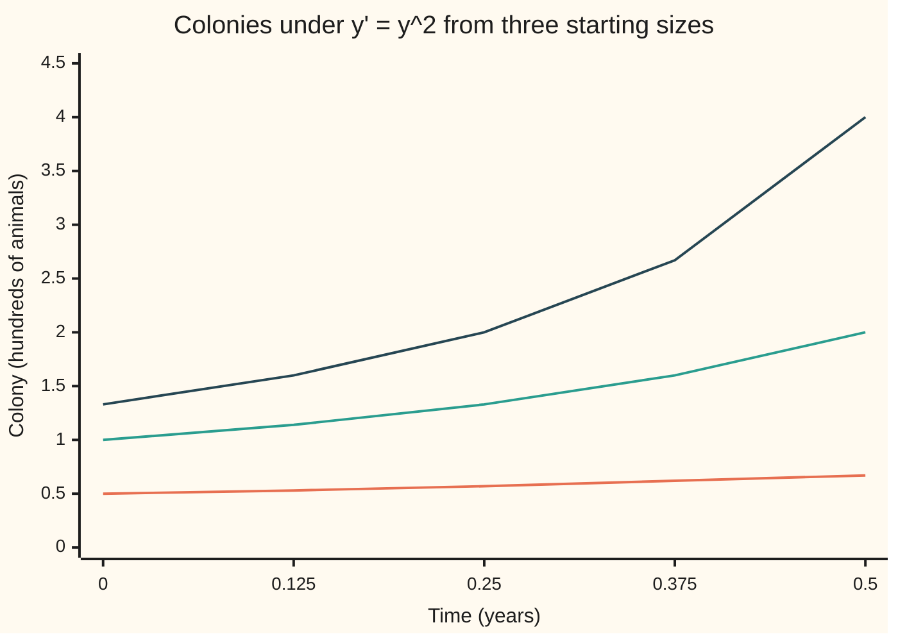
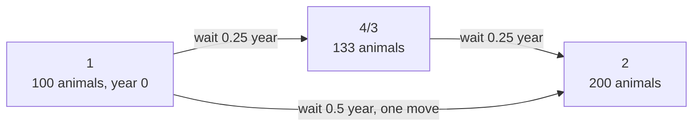

# The flow: a rule that moves every starting point forward by t, and running it twice is running it longer

[Syllabus](../../../SYLLABUS.md) → [Differential equations and dynamics](../../../SYLLABUS.md#w08) → [Existence, Uniqueness and Sensitivity](../../../SYLLABUS.md#w08-s02) → The flow

---

## General Overview

A colony of 100 animals lives thinly spread over an island. A birth needs two animals to meet, and meetings go up with the square of the head count. Count in hundreds and time in years: the colony gains its own size squared, in hundreds per year. At 100 animals it gains 100 a year; at 200, 400.

Start with 100 animals and wait three months: 133. Wait three more: 200. Start again from 100 and wait six months in one go: 200 again. Two short waits land where one long wait lands. In symbols, with $y$ the colony in hundreds and $t$ the time in years, the law is $y' = y^2$.

The law never looks at the calendar, only at the head count. So "wait three months" is one fixed rule taking any head count to a later one, whatever the date. From here on that rule is the **flow** of the equation: the map that moves every starting value forward by a given time.

**When the rule ignores the clock, the flow moves every starting value forward by t; moving by t then by s is moving by s + t, and since one start gives one history, solution curves never cross.**

**What kind of fact this is:** a definition. The composition rule and the no-crossing rule are theorems, proved on this card in Why it works from the uniqueness of solutions.

### The picture: three colonies, one law



From the bottom: colonies of 50 (orange), 100 (green) and 133 (dark blue). Dark blue is green moved a quarter-year to the left: it reads 2.00 at 0.25 years, where green reads 2.00 at 0.5. No two lines cross.

---

## The formula

Notation first, in words. A rule $y' = f(y)$, whose rate depends on the state alone and not on the time, is called **autonomous**. The flow is written $\varphi_t$, read "phi t": $\varphi_t(x)$ is where the solution that starts at $x$ stands after time $t$. A small circle means "after", as on the [Composing functions](../../01-Foundations/08-Relations%20and%20Functions/03-composition.md) card: $\varphi_s \circ \varphi_t$ applies $\varphi_t$ first, then $\varphi_s$.

For the colony, $y' = y^2$, the flow is

$$\varphi_t(x) = \frac{x}{1 - t x}, \qquad \text{for } t x < 1.$$

**Read it aloud:** a colony that starts at x hundred animals holds x divided by one minus t times x after t years.

Every flow of an autonomous equation obeys two laws:

$$\varphi_0(x) = x, \qquad \varphi_s\bigl(\varphi_t(x)\bigr) = \varphi_{s+t}(x).$$

**Read it aloud:** waiting no time changes nothing, and waiting t then waiting s is the same as waiting s plus t.

| Symbol | Plain meaning | In our example | Push it up and the answer… |
| --- | --- | --- | --- |
| $y$, $y'$ | colony size in hundreds; its rate, hundreds per year | 1 at the start; rate 1 per year there | grows faster, by the square |
| $f$ | the rule giving the rate from the state alone | $f(y) = y^2$ | — |
| $x$ | the starting value | 1, that is 100 animals | curve starts higher, ends sooner |
| $t$, $s$ | two lengths of time, years; negative runs backwards | 0.25 and 0.25 | the flow carries further |
| $\varphi_t$, $\varphi_s$ | the flow: start to state after time $t$ (or $s$) | $\varphi_{0.25}(1) = 4/3$ | — |
| $\circ$ | "after": apply the right-hand map first | $\varphi_{0.25} \circ \varphi_{0.25}$ | — |
| $1/x$ | the life span: time until the colony formula runs to infinity | 1 year from 100 animals | — |
| $h$ | water height in the shelf's leaking bucket, cm | 25 cm at the start | empties later |

### The picture: two moves or one



Both routes end at 2, as the composition law promises for every start and every pair of waits inside the life span.

### When it holds

- **The rule reads only the state.** If it reads the clock, as in $y' = 2ty$, a wait depends on when it begins: the map from year 0, used twice, gives 1.1331 against 1.2840 for one move. Such an equation needs a map from a start time to an end time.
- **One start gives one history, both ways in time.** Otherwise the flow is no function. The [The Picard-Lindelof theorem](02-lipschitz-and-the-picard-lindelof-theorem.md) card guarantees it when $f$ is Lipschitz: its slope stays bounded. The leaking bucket, $h' = -0.2\sqrt{h}$, fails that at empty. Forward it is fine, but starts of 25 cm and 1 cm both read 0.00 at 60 s, so running back from empty has no single answer.
- **The time stays inside the life span** ([Blow-up](03-blow-up-and-the-life-span-of-a-solution.md)). From 100 animals that is under 1 year; at 1.5 years the formula prints −2.00, which is no colony.
- **The colony model fits only while it is sparse.** Crowding stops real growth long before infinity.

---

## Why it works

### Step 0: a rule that ignores the clock treats every start date alike

If a curve obeys $y' = y^2$, the same curve delayed a quarter-year obeys it too: its slopes are unchanged, and the rule asks only for the height. A history starting on 1 January and one starting on 1 April from the same head count are one history, delayed. That is why "wait three months" can be a single map.

### Step 1: one start, one history, so the flow is a function

The rule $f(y) = y^2$ is Lipschitz on any bounded range of head counts, since its slope $2y$ stays bounded there. So by the Picard-Lindelöf theorem each start gives exactly one solution, and $\varphi_t(x)$ has one value whenever that solution lives to time $t$.

### Step 2: find the colony's flow

By the chain rule the rate of $1/y$ is $-y'/y^2$, which the law makes exactly $-1$. So $1/y = 1/x - t$, and $y = x/(1 - tx)$. At $t = 1/x$ the reciprocal reaches zero and the colony runs to infinity: the life span.

### Step 3: waiting twice is waiting once, longer

Start at $x$, wait $t$, and call the result $z = \varphi_t(x)$. From that moment compare two curves in the extra wait $s$: the flow from $z$, $\varphi_s(z)$, and the original history carried on, $\varphi_{s+t}(x)$. By Step 0 both obey the law; at $s = 0$ both read $z$. By Step 1 they are one solution, so $\varphi_s(\varphi_t(x)) = \varphi_{s+t}(x)$.

For the colony the algebra agrees. Put $z = x/(1 - tx)$ into the flow:

$$\varphi_s(z) = \frac{x/(1 - tx)}{1 - s x/(1 - tx)} = \frac{x}{1 - tx - sx} = \varphi_{s+t}(x).$$

### Step 4: the flow can be undone

Take $s = -t$: $\varphi_{-t}(\varphi_t(x)) = \varphi_0(x) = x$. Running backwards by $t$ returns the start, $\varphi_{-0.5}(2) = 1$, so no two starts are sent to one place.

### Step 5: two solution curves never cross

Two histories with the same head count at the same moment are both the unique solution from that meeting: one history. So graphs over time run side by side, as the three colonies do on the chart.

A **system** has several quantities with linked rates; its **orbit** is the path the state traces, with time left off. If two orbits of an autonomous system share one state, even at different times, Step 0 makes one history the other delayed, so the orbits are one path: they coincide or never meet. The dark blue colony is the green one delayed by 0.25 years; the code confirms $\varphi_t(4/3) = \varphi_{t+0.25}(1)$ to within 1.07e-14.

<details>
<summary>Detailed proof: the composition law, with its domain</summary>

Let $f$ be locally Lipschitz ([The Picard-Lindelof theorem](02-lipschitz-and-the-picard-lindelof-theorem.md)). For each start $x$ let $t \mapsto \varphi_t(x)$ be the unique solution of $y' = f(y)$, $y(0) = x$, on its largest open time interval $J(x)$ containing 0.

Fix $t$ in $J(x)$, put $z = \varphi_t(x)$ and $u(s) = \varphi_{s+t}(x)$ for $s + t$ in $J(x)$. Then $u'(s) = f(u(s))$ and $u(0) = z$, so by uniqueness $u(s) = \varphi_s(z)$, and $J(x) - t \subseteq J(z)$ by maximality. If $J(z)$ reached beyond $J(x) - t$, the curve $s \mapsto \varphi_{s-t}(z)$ would extend the solution from $x$ past its largest interval; so equality holds: $J(z) = J(x) - t$.

Non-crossing: if $\varphi_{t_1}(p) = \varphi_{t_2}(q)$, the law gives $\varphi_{t_1+s}(p) = \varphi_{t_2+s}(q)$ for every admissible $s$, so the two orbits are one set.

</details>

A second road needs no flow formula. The time to grow from one head count to a larger one is the area under `1/u^2` between them, 1/start − 1/end. Times add: a quarter-year from 1 to 4/3, a quarter-year from 4/3 to 2, half a year from 1 to 2. That additivity is the composition law. A third road steps along the slope, Euler's rule ([Euler's method](../05-Numerical%20Evolution/01-eulers-method.md)).

---

## Worked numbers, by hand

| Step | Arithmetic | Value |
| --- | --- | --- |
| first quarter-year | 1 / (1 − 0.25 × 1) | 4/3, about 133 animals |
| second quarter-year | (4/3) / (1 − 0.25 × 4/3) = (4/3) / (2/3) | 2 |
| one move of half a year | 1 / (1 − 0.5 × 1) | **2** |
| back half a year from 2 | 2 / (1 + 0.5 × 2) | 1 |
| time to grow 1 to 2 | 1/1 − 1/2 | 0.5 years |
| life span from 1 | 1/1 | 1 year |

### What breaks if you drop a piece

| Mistake | Comes out at | What went wrong |
| --- | --- | --- |
| Rule reads the clock, $y' = 2ty$: the year-0 map used twice | 1.1331 against 1.2840 | Waiting depends on when the wait starts |
| Growth factor reused: 4/3 squared | 1.7778, not 2.0000 | Factors repeat only for a linear law such as $y' = y$ |
| Formula used past the life span: $\varphi_{1.5}(1)$ | −2.00 | The colony ran out at 1 year; the flow is undefined there |
| Bucket $h' = -0.2\sqrt{h}$ run backwards from empty | 0.00 or 1.00 cm, 10 s earlier | Two histories meet at empty, so no backward flow |

---

## Code, from first principles, and it actually runs

Road one tests the composition law on 36 combinations of start and waits, and the delay between two colonies. Road two recovers the times by Simpson's rule, a weighted sum of heights under `1/u^2`. Road three steps with Euler's rule; its error shrinks tenfold with each tenfold smaller step.

### Python

```python
# The flow of an equation -- the check behind the card.  Standard library only.
# The colony obeys y' = y^2 (y in hundreds of animals, t in years).  Road one:
# the flow formula x / (1 - t x).  Road two: the travel time from a to b, the
# integral of 1/u^2, by Simpson's rule.  Road three: Euler steps along the slope.
import math

def phi(t, x):                                 # the flow: where x is after time t
    return x / (1 - t * x)

def travel(a, b, n=1000):                      # years to grow from a to b
    h = (b - a) / n
    w = lambda k: 1 if k in (0, n) else (4 if k % 2 else 2)
    return h / 3 * sum(w(k) / (a + k * h) ** 2 for k in range(n + 1))

def euler(x, t, h):                            # small steps along the slope x^2
    for _ in range(round(t / h)):
        x += h * x * x
    return x

def level(t, h0):                              # bucket h' = -0.2 sqrt(h), in cm
    return max(math.sqrt(h0) - 0.1 * t, 0.0) ** 2

a, c = phi(0.25, 1.0), phi(0.5, 1.0)
b = phi(0.25, a)
print(f"flow: phi_0.25(1) = {a:.4f}; phi_0.25({a:.4f}) = {b:.4f}; phi_0.5(1) = {c:.4f}; "
      f"phi_-0.5(2) = {phi(-0.5, 2.0):.4f}")
t1, t2, t12 = travel(1.0, a), travel(a, 2.0), travel(1.0, 2.0)
print(f"travel time, 1 to 1.3333: {t1:.6f}; 1.3333 to 2: {t2:.6f}; 1 to 2: {t12:.6f}")
hs = (0.001, 0.0001, 0.00001)
errs = [abs(euler(1.0, 0.5, h) - c) for h in hs]
for h, e in zip(hs, errs):
    print(f"euler, step {h:.5f}: y(0.5) = {euler(1.0, 0.5, h):.5f}, error {e:.5f}")
print(f"euler, error ratio 0.00010 vs 0.00001: {errs[1] / errs[2]:.2f}")
grid = [(s, t, x) for s in (-0.3, 0.1, 0.2, 0.4) for t in (-0.2, 0.1, 0.3)
        for x in (0.5, 1.0, 1.2) if t * x < 1 and s * phi(t, x) < 1]
worst = max(abs(phi(s, phi(t, x)) - phi(s + t, x)) for s, t, x in grid)
shift = max(abs(phi(k / 20, 4 / 3) - phi(k / 20 + 0.25, 1.0)) for k in range(15))
print(f"composition, {len(grid)} triples (s, t, x): largest gap {worst:.2e}")
print(f"time shift, start 4/3 against start 1 moved on 0.25, t = 0..0.7: largest gap {shift:.2e}")
ts = (0, 0.125, 0.25, 0.375, 0.5)
for x in (0.5, 1.0, 4 / 3):
    print(f"chart, start {x:.2f}: " + ", ".join(f"{phi(t, x):.2f}" for t in ts))
order = all(phi(t, 0.5) < phi(t, 1.0) < phi(t, 4 / 3) for t in ts)
print(f"order kept at every chart time: {'yes' if order else 'no'}; life span from 1: {1 / 1.0:.2f}, from 2: {1 / 2.0:.2f}")
m = lambda t, x: x * math.exp(t * t)           # y' = 2ty, map read from clock 0
print(f"mistake, y' = 2ty: map from 0 used twice {m(0.25, m(0.25, 1.0)):.4f}, "
      f"one move of 0.5 {m(0.5, 1.0):.4f}")
print(f"mistake, growth factor reused: {a:.4f} x {a:.4f} = {a * a:.4f}, not {c:.4f}")
print(f"mistake, formula past the life span: phi_1.5(1) = {phi(1.5, 1.0):.2f}")
print(f"bucket: 25 cm empties at t = {math.sqrt(25) / 0.1:.0f}; at t = 60 starts of 25 cm and 1 cm "
      f"read {level(60, 25):.2f} and {level(60, 1):.2f}; 10 s before empty: 0.00 or {level(-10, 0):.2f}")
assert abs(t1 - 0.25) < 1e-9 and abs(t12 - 0.5) < 1e-9     # the integral recovers the times
assert abs(euler(1.0, 0.5, 1e-5) - 2) < 1e-3 and 8 < errs[1] / errs[2] < 12
assert worst < 1e-12 and shift < 1e-12                     # twice short equals once long
assert abs(m(0.25, m(0.25, 1.0)) - m(0.5, 1.0)) > 0.1      # a clock-reading rule breaks it
print("ALL CHECKS PASS")
```

**Ran 2026-09-28 on macOS, Python 3.14.6, standard library only. All checks passed. Output, pasted from the run:**

```
flow: phi_0.25(1) = 1.3333; phi_0.25(1.3333) = 2.0000; phi_0.5(1) = 2.0000; phi_-0.5(2) = 1.0000
travel time, 1 to 1.3333: 0.250000; 1.3333 to 2: 0.250000; 1 to 2: 0.500000
euler, step 0.00100: y(0.5) = 1.99724, error 0.00276
euler, step 0.00010: y(0.5) = 1.99972, error 0.00028
euler, step 0.00001: y(0.5) = 1.99997, error 0.00003
euler, error ratio 0.00010 vs 0.00001: 10.00
composition, 36 triples (s, t, x): largest gap 1.78e-15
time shift, start 4/3 against start 1 moved on 0.25, t = 0..0.7: largest gap 1.07e-14
chart, start 0.50: 0.50, 0.53, 0.57, 0.62, 0.67
chart, start 1.00: 1.00, 1.14, 1.33, 1.60, 2.00
chart, start 1.33: 1.33, 1.60, 2.00, 2.67, 4.00
order kept at every chart time: yes; life span from 1: 1.00, from 2: 0.50
mistake, y' = 2ty: map from 0 used twice 1.1331, one move of 0.5 1.2840
mistake, growth factor reused: 1.3333 x 1.3333 = 1.7778, not 2.0000
mistake, formula past the life span: phi_1.5(1) = -2.00
bucket: 25 cm empties at t = 50; at t = 60 starts of 25 cm and 1 cm read 0.00 and 0.00; 10 s before empty: 0.00 or 1.00
ALL CHECKS PASS
```

### Rust

Same numbers, same labels, built with `rustc --edition 2021 -O`.

```rust
// The flow of an equation -- the same check as the Python, in Rust, std only.
// The colony obeys y' = y^2 (y in hundreds of animals, t in years).  Road one:
// the flow formula x / (1 - t x).  Road two: the travel time from a to b, the
// integral of 1/u^2, by Simpson's rule.  Road three: Euler steps along the slope.

fn phi(t: f64, x: f64) -> f64 { x / (1.0 - t * x) } // where x is after time t

fn travel(a: f64, b: f64) -> f64 { // years to grow from a to b
    let n = 1000;
    let h = (b - a) / n as f64;
    let w = |k: usize| if k == 0 || k == n { 1.0 } else if k % 2 == 1 { 4.0 } else { 2.0 };
    h / 3.0 * (0..=n).map(|k| w(k) / (a + k as f64 * h).powi(2)).sum::<f64>()
}

fn euler(mut x: f64, t: f64, h: f64) -> f64 { // small steps along the slope x^2
    for _ in 0..(t / h).round() as usize { x += h * x * x; }
    x
}

fn level(t: f64, h0: f64) -> f64 { (h0.sqrt() - 0.1 * t).max(0.0).powi(2) } // bucket, cm

fn m(t: f64, x: f64) -> f64 { x * (t * t).exp() } // y' = 2ty, map read from clock 0

fn main() {
    let (a, c) = (phi(0.25, 1.0), phi(0.5, 1.0));
    let b = phi(0.25, a);
    println!("flow: phi_0.25(1) = {:.4}; phi_0.25({:.4}) = {:.4}; phi_0.5(1) = {:.4}; phi_-0.5(2) = {:.4}",
        a, a, b, c, phi(-0.5, 2.0));
    let (t1, t2, t12) = (travel(1.0, a), travel(a, 2.0), travel(1.0, 2.0));
    println!("travel time, 1 to 1.3333: {:.6}; 1.3333 to 2: {:.6}; 1 to 2: {:.6}", t1, t2, t12);
    let hs = [0.001, 0.0001, 0.00001];
    let errs: Vec<f64> = hs.iter().map(|&h| (euler(1.0, 0.5, h) - c).abs()).collect();
    for (h, e) in hs.iter().zip(&errs) {
        println!("euler, step {:.5}: y(0.5) = {:.5}, error {:.5}", h, euler(1.0, 0.5, *h), e);
    }
    println!("euler, error ratio 0.00010 vs 0.00001: {:.2}", errs[1] / errs[2]);
    let (mut worst, mut count): (f64, usize) = (0.0, 0);
    for s in [-0.3, 0.1, 0.2, 0.4] { for t in [-0.2, 0.1, 0.3] { for x in [0.5, 1.0, 1.2] {
        if t * x < 1.0 && s * phi(t, x) < 1.0 {
            worst = worst.max((phi(s, phi(t, x)) - phi(s + t, x)).abs());
            count += 1;
        }
    } } }
    let shift = (0..15).map(|k| (phi(k as f64 / 20.0, 4.0 / 3.0) - phi(k as f64 / 20.0 + 0.25, 1.0)).abs())
        .fold(0.0f64, f64::max);
    println!("composition, {} triples (s, t, x): largest gap {:.2e}", count, worst);
    println!("time shift, start 4/3 against start 1 moved on 0.25, t = 0..0.7: largest gap {:.2e}", shift);
    let ts = [0.0, 0.125, 0.25, 0.375, 0.5];
    for x in [0.5, 1.0, 4.0 / 3.0] {
        let pts: Vec<String> = ts.iter().map(|&t| format!("{:.2}", phi(t, x))).collect();
        println!("chart, start {:.2}: {}", x, pts.join(", "));
    }
    let order = ts.iter().all(|&t| phi(t, 0.5) < phi(t, 1.0) && phi(t, 1.0) < phi(t, 4.0 / 3.0));
    println!("order kept at every chart time: {}; life span from 1: {:.2}, from 2: {:.2}",
        if order { "yes" } else { "no" }, 1.0 / 1.0, 1.0 / 2.0);
    println!("mistake, y' = 2ty: map from 0 used twice {:.4}, one move of 0.5 {:.4}", m(0.25, m(0.25, 1.0)), m(0.5, 1.0));
    println!("mistake, growth factor reused: {:.4} x {:.4} = {:.4}, not {:.4}", a, a, a * a, c);
    println!("mistake, formula past the life span: phi_1.5(1) = {:.2}", phi(1.5, 1.0));
    println!("bucket: 25 cm empties at t = {:.0}; at t = 60 starts of 25 cm and 1 cm read {:.2} and {:.2}; 10 s before empty: 0.00 or {:.2}",
        25f64.sqrt() / 0.1, level(60.0, 25.0), level(60.0, 1.0), level(-10.0, 0.0));
    assert!((t1 - 0.25).abs() < 1e-9 && (t12 - 0.5).abs() < 1e-9); // the integral recovers the times
    assert!((euler(1.0, 0.5, 1e-5) - 2.0).abs() < 1e-3 && errs[1] / errs[2] > 8.0 && errs[1] / errs[2] < 12.0);
    assert!(worst < 1e-12 && shift < 1e-12); // twice short equals once long
    assert!((m(0.25, m(0.25, 1.0)) - m(0.5, 1.0)).abs() > 0.1); // a clock-reading rule breaks it
    println!("ALL CHECKS PASS");
}
```

**Ran 2026-09-28 on macOS, rustc 1.98.1, no crates. All checks passed. Output, pasted from the run:**

```
flow: phi_0.25(1) = 1.3333; phi_0.25(1.3333) = 2.0000; phi_0.5(1) = 2.0000; phi_-0.5(2) = 1.0000
travel time, 1 to 1.3333: 0.250000; 1.3333 to 2: 0.250000; 1 to 2: 0.500000
euler, step 0.00100: y(0.5) = 1.99724, error 0.00276
euler, step 0.00010: y(0.5) = 1.99972, error 0.00028
euler, step 0.00001: y(0.5) = 1.99997, error 0.00003
euler, error ratio 0.00010 vs 0.00001: 10.00
composition, 36 triples (s, t, x): largest gap 1.78e-15
time shift, start 4/3 against start 1 moved on 0.25, t = 0..0.7: largest gap 1.07e-14
chart, start 0.50: 0.50, 0.53, 0.57, 0.62, 0.67
chart, start 1.00: 1.00, 1.14, 1.33, 1.60, 2.00
chart, start 1.33: 1.33, 1.60, 2.00, 2.67, 4.00
order kept at every chart time: yes; life span from 1: 1.00, from 2: 0.50
mistake, y' = 2ty: map from 0 used twice 1.1331, one move of 0.5 1.2840
mistake, growth factor reused: 1.3333 x 1.3333 = 1.7778, not 2.0000
mistake, formula past the life span: phi_1.5(1) = -2.00
bucket: 25 cm empties at t = 50; at t = 60 starts of 25 cm and 1 cm read 0.00 and 0.00; 10 s before empty: 0.00 or 1.00
ALL CHECKS PASS
```

> [!TIP]
> **Try changing**
> - **Start the colony at 200 animals.** Guess its life span first. It is 0.50 years: its curve is the green line moved half a year to the left.
> - **Take the house example $y' = y$, whose flow multiplies by a fixed factor.** Guess whether reusing the growth factor now works. It does: a linear law's flow is multiplication.
> - **Replace `math.exp(t * t)` by `math.exp(t)`.** Guess which assert fails. The last: $y' = y$ ignores the clock, so its map composes and the gap closes.

---

## The usual mistake

> [!warning]
> **Treating the flow as a growth factor.** A quarter-year multiplies 100 animals by 4/3, so it is tempting to multiply by 4/3 again: 1.7778 hundred, not 2.0000. The flow composes by applying the map to the new state, and 133 animals grow faster than 100 did.
>
> - **Composing a clock-reading rule with itself.** For $y' = 2ty$ this gives 1.1331 instead of 1.2840.
> - **Forgetting the life span.** $\varphi_{1.5}(1) = -2$ is algebra past the blow-up at 1 year, not a population.
> - **Running back without uniqueness.** 10 s before an empty reading, the bucket held anything from 0.00 to 1.00 cm.

---

## Where you meet it in real life

- **Restarting a long simulation.** Climate and orbit programs save the state and resume from it; for laws that ignore the clock, the composition law makes two halves equal the whole run.
- **Mechanics.** A planet's state is position and speed together; Newton's laws ignore the clock, so its orbit in that state space never crosses itself except by repeating.
- **A pollutant in a river.** Each drop rides the river's flow, and the concentration is found by following those paths backwards ([The transport equation](../10-The%20Classical%20PDEs/02-the-transport-equation-and-characteristics.md)).

> **Say it back**
> The flow takes every starting value to where its solution stands after a given time. When the rule reads only the state, a later start is the same solution delayed, and uniqueness makes waiting t then s equal to waiting s plus t. The colony of 100 holds 200 after six months by either route. A negative wait runs the flow backwards. One start gives one history, so solution curves never cross.

---

## What this builds on

- [Gronwall's inequality](04-gronwall-and-continuous-dependence.md): nearby starts stay nearby under the flow.
- [Blow-up](03-blow-up-and-the-life-span-of-a-solution.md): the life span that limits how far the flow reaches.
- [Composing functions](../../01-Foundations/08-Relations%20and%20Functions/03-composition.md): one map after another.

## Where this goes next

- [The transport equation](../10-The%20Classical%20PDEs/02-the-transport-equation-and-characteristics.md): a partial differential equation solved by riding a flow.
- Semigroups: the composition law as a definition, for heat spreading in a rod.
- Vector field and its flow: flows on curved spaces.

---

## Sources

Verified 28 Sep 2026: every link below resolves to the publisher's or the author's own page.

- Hirsch, Morris W., Stephen Smale and Robert L. Devaney. *Differential Equations, Dynamical Systems, and an Introduction to Chaos*, 3rd ed. Academic Press, 2013. [Publisher page](https://shop.elsevier.com/books/differential-equations-dynamical-systems-and-an-introduction-to-chaos/hirsch/978-0-12-382010-5). The flow and its composition law.
- Teschl, Gerald. *Ordinary Differential Equations and Dynamical Systems*. Graduate Studies in Mathematics 140, American Mathematical Society, 2012. [Author's page for the book](https://www.mat.univie.ac.at/~gerald/ftp/book-ode/). The flow on its largest domain, as in the detailed proof.
- Lebl, Jiří. *Notes on Diffy Qs*, §1.6 "Autonomous equations". [Author's free edition](https://www.jirka.org/diffyqs/html/auteq_section.html). Autonomous equations.
