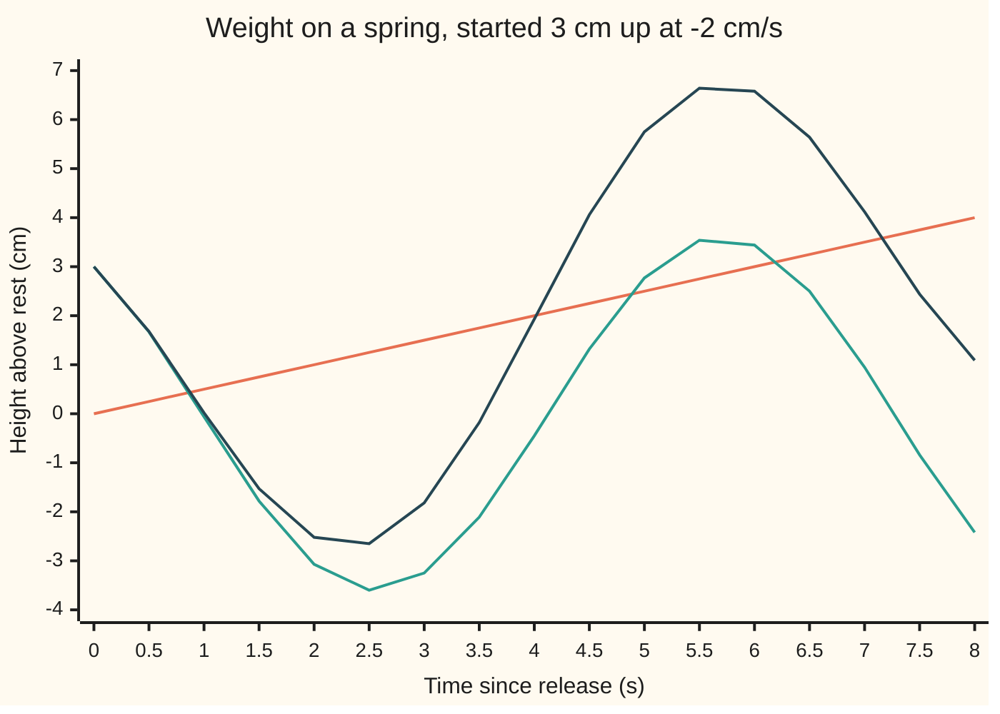

# Superposition: for a linear equation, solutions add and scale, so two of them are enough

[Syllabus](../../../SYLLABUS.md) → [Differential equations and dynamics](../README.md) → [Oscillators - Second-Order Linear Equations](../README.md#s03) → Superposition

---

## General Overview

A weight hangs from a spring. Pull it 1 cm up and let go: it bobs, back at 1 cm every 6.28 seconds. Start it at rest height with an upward flick of 1 cm per second: same rhythm, a quarter-swing later. Now pull it 3 cm up and flick it down at 2 cm per second. No new calculation is needed: the motion is 3 copies of the first swing minus 2 copies of the second.

It works because the spring's pull is proportional to the stretch. An equation built only from the unknown and its rates, each times a number, then added, is called **linear**. Its solutions add and scale the way the pulls do, and that is called **superposition**.

Two independent swings (neither a multiple of the other), weighted by two numbers, cover every motion; the starting height and speed fix the numbers. Lift the ceiling hook at a steady 0.5 cm per second, and one motion that copes with the hook, plus the free family, gives every motion.

**For a linear equation, any weighted sum of free solutions is a free solution; two independent ones cover them all, two starting values pick the weights, and a forced equation's solutions are one forced solution plus that free family.**

**What kind of fact this is:** a theorem, proved for the spring in Why it works; the general second-order case is in the Detailed proof, resting on [The Picard-Lindelof theorem](../02-Existence%2C%20Uniqueness%20and%20Sensitivity/02-lipschitz-and-the-picard-lindelof-theorem.md).

### The picture: a free swing, the hook, and the forced motion



Orange, straight: the hook's height t/2 cm, itself a forced solution. Green: the free swing 3 cos t − 2 sin t, peaking at 3.61 cm. Dark blue: the same start with the hook rising.

---

## The formula

Notation first, in words. As on [A differential equation](../01-Rate%20Equations/01-what-a-differential-equation-says.md), a dash means a rate: $y'$ is the weight's speed, and $y''$, "y double prime", its acceleration. $L[y]$ is a machine that takes a whole curve and returns another: the curve's acceleration plus the curve itself.

The spring pulls 1 cm/s^2 per cm of stretch (stiffness over mass, 1 per s^2), so with the hook fixed

$$L[y] = y'' + y = 0.$$

**Read it aloud:** the acceleration is always the height with its sign flipped.

For any numbers $a$ and $b$ and any curves $y_1$ and $y_2$,

$$L[a\,y_1 + b\,y_2] = a\,L[y_1] + b\,L[y_2].$$

**Read it aloud:** the machine applied to a weighted sum is the same weighted sum of its outputs.

Every free solution is (Step 3 proves nothing is missed)

$$y_h = c_1 \cos t + c_2 \sin t, \qquad c_1 = y(0),\; c_2 = y'(0),$$

and with the hook rising, $L[y] = f(t)$ with $f(t) = t/2$, every solution is

$$y = y_p + c_1 \cos t + c_2 \sin t, \qquad y_p = t/2.$$

**Read it aloud:** one forced motion plus any free swing.

| Symbol | Plain meaning | In our example | Push it up and the answer… |
| --- | --- | --- | --- |
| $t$ | time since release, s | 0 to 8 s | the swing repeats every 6.28 s |
| $y$, $y'$, $y''$ | height above rest (cm), speed (cm/s), acceleration (cm/s^2) | 3 cm and −2 cm/s at the start | — |
| $L[y]$ | acceleration plus height: the push per kg the curve needs | 0 for a free swing | — |
| $f(t)$ | the forcing: the hook's pull per kg, set by its height | t/2 | the motion drifts upwards |
| $y_1$, $y_2$ | two free solutions | cos t and sin t | — |
| $a$, $b$, $c_1$, $c_2$ | weights in a sum; $c_1$, $c_2$ are the ones the start fixes | 3 and −2 free, 3 and −2.5 forced | taller swing |
| $y_h$, $y_p$ | a free (homogeneous) solution; one particular forced solution | 3 cos t − 2 sin t; t/2 | — |
| $E$ | twice the energy per kg: speed squared plus height squared | 13 for the free swing | — |

**Homogeneous** means the forcing is zero, the hook held still. A **particular solution** is any one solution of the forced equation.

### When it holds

- **The equation is linear:** each term is the unknown or a rate, times a number or a function of time. A pendulum's sin y breaks it: its upside-down balance at π radians is a solution, half of it is not.
- **Only free solutions add.** Two forced solutions add to one with the forcing doubled, 2.000 instead of 1.000 at t = 2 s.
- **The two solutions are independent.** cos t and 2 cos t both start at speed 0, so no mix of them starts at −2 cm/s.
- **Two starting values.** Height alone leaves the second weight free.

---

## Why it works

### Step 0: rates respect sums and multiples

The rate of a sum is the sum of the rates; the rate of 3 times a curve is 3 times its rate. Twice over, for the acceleration: $L[a\,y_1 + b\,y_2] = a\,y_1'' + b\,y_2'' + a\,y_1 + b\,y_2 = a\,L[y_1] + b\,L[y_2]$.

### Step 1: weighted sums of free swings are free swings

cos t has acceleration −cos t, so $L[\cos t] = 0$; likewise $L[\sin t] = 0$. By Step 0, $L[3\cos t - 2\sin t] = 3 \times 0 - 2 \times 0 = 0$. The free solutions are closed under weighted sums ([Linear combinations and span](../../03-Algebra/03-Vectors/03-linear-combinations-and-span.md)): a vector space whose members are curves.

### Step 2: two starting readings fix the two weights

At t = 0, cos is 1 with speed 0 and sin is 0 with speed 1, so $y_h(0) = c_1$ and $y_h'(0) = c_2$: here 3 and −2. Height alone allows 3 cos t + c sin t for every number c. The pair works because its starting table, height and speed of each, has determinant 1, not 0; that test is [The Wronskian](04-wronskian-and-reduction-of-order.md).

### Step 3: nothing is missed

Take any free motion $y$. Build $w = y(0)\cos t + y'(0)\sin t$, which starts the same way. The difference $z = y - w$ is free and starts at height 0, speed 0. Its $E = z'^2 + z^2$ has rate $2z'z'' + 2zz' = 2z'(z'' + z) = 0$, so $E$ stays at its starting value, 0. Two squares summing to 0 force $z = 0$. So $y = w$: the free solutions form a space of dimension 2 with basis cos t and sin t ([Basis and dimension](../../03-Algebra/03-Vectors/05-basis-and-dimension.md)).

For the swing 3 cos t − 2 sin t, $E$ reads 13 throughout, so it peaks at √13 = 3.61 cm.

### Step 4: forced motions differ by a free motion

If $y$ and $y_p$ both solve $L[y] = t/2$, Step 0 gives $L[y - y_p] = t/2 - t/2 = 0$, so the difference is free, and by Step 3 it is $c_1 \cos t + c_2 \sin t$. A straight line has acceleration 0, so $L[t/2] = t/2$: following the hook is one forced motion. The start 3 cm, −2 cm/s gives $c_1 = 3$ and $1/2 + c_2 = -2$, so $c_2 = -2.5$.

### Step 5: forcing scales and adds

$L[2y] = 2L[y]$: twice a motion needs twice the forcing. Raise the hook at 1 cm/s, start at 6 cm, −4 cm/s, and the weight moves exactly twice as far. Two forcings together are met by the sum of their responses, which is why [Undetermined coefficients](05-undetermined-coefficients.md) can treat a forcing term by term.

<details>
<summary>Detailed proof: any second-order linear equation</summary>

Let the coefficients p(t), q(t) and the forcing f(t) be continuous on an interval containing 0, and L[y] = y'' + p(t)y' + q(t)y. Step 0 holds unchanged whatever the coefficients.

Send each homogeneous solution to its starting pair, height and speed at 0. This map is linear. By the existence and uniqueness theorem for linear equations, each pair is reached by exactly one solution on the whole interval, since linear equations never blow up ([Blow-up](../02-Existence%2C%20Uniqueness%20and%20Sensitivity/03-blow-up-and-the-life-span-of-a-solution.md)). So the map is one-to-one and onto the plane: the solutions form a vector space of dimension 2, and two of them are a basis exactly when their starting pairs are independent.

For $L[y] = f$, if $y_p$ is one solution then $L[y - y_p] = 0$ for every other, so $y - y_p$ lies in that plane of solutions. The forced solutions are one point plus that plane, not a vector space: two of them sum to forcing 2f.

</details>

A second road needs no formula: from the start, step the height by the speed and the speed by the rule's acceleration, in small time steps. This is Euler's rule, given its own card at [Euler's method](../05-Numerical%20Evolution/01-eulers-method.md).

---

## Worked numbers, by hand

| Step | Arithmetic | Value |
| --- | --- | --- |
| free weights | $c_1$ = height, $c_2$ = speed at the start | 3 and −2 |
| energy of the free swing | (−2)^2 + 3^2 | 13, so a peak of 3.61 cm |
| one forced solution | L[t/2] = 0 + t/2 | t/2 |
| forced weights | 3 = 0 + $c_1$; −2 = 1/2 + $c_2$ | 3 and −2.5 |
| cos and sin at 2 s | from tables or a calculator | −0.4161 and 0.9093 |
| forced motion at t = 2 s | 1 + 3 × (−0.4161) − 2.5 × 0.9093 | **−2.5217 cm** |
| doubled hook and start | 2 × (−2.5217) | −5.0434 cm |

Two seconds in, the weight is 2.52 cm below rest though the hook has risen 1 cm: the swing outweighs the drift.

### What breaks if you drop a piece

| Mistake | Comes out at | What went wrong |
| --- | --- | --- |
| Adding two forced solutions | forcing 2.000 at t = 2 s, not 1.000 | Forcings add too |
| Halving the pendulum's balance, $y'' + \sin y = 0$, from y = π to π/2 | residual 1.000 rad/s^2, not 0.000 | sin y is not linear |
| A dependent pair, cos t and 2 cos t | start determinant 0.000 | Both start at speed 0; no mix reaches −2 cm/s |
| Height as the only starting value | 3 cos t + c sin t, any c | The speed is needed too |

---

## Code, from first principles, and it actually runs

Two roads. Road one puts each closed form into $L$, measuring acceleration by a centred difference. Road two is Euler's rule, stepping from the start with the rate law alone; it must match the closed form at t = 2 s, its error falling tenfold with the step. The doubled case is stepped separately and must land at twice the formula. Every chart point and what-breaks number is printed.

### Python

```python
# Superposition -- the check behind the card.  Standard library only.
# A weight on a spring: y'' + y = f(t), y in cm above rest, t in s.  Road one:
# closed forms, tested by substitution.  Road two: Euler's rule, rate law only.
import math

cos, sin, pi = math.cos, math.sin, math.pi

def L(y, t, d=1e-3):                   # y'' + y, with y'' by a centred difference
    return (y(t + d) - 2 * y(t) + y(t - d)) / d ** 2 + y(t)

def D(y, t, d=1e-6):                   # slope by a centred difference
    return (y(t + d) - y(t - d)) / (2 * d)

def det(g1, g2):                       # starting values of two solutions, as a determinant
    return g1(0) * D(g2, 0) - g2(0) * D(g1, 0)

def euler(f, y0, v0, t_end, n):        # y' = v, v' = f(t) - y, in n small steps
    h, y, v = t_end / n, y0, v0
    for k in range(n):
        y, v = y + h * v, v + h * (f(k * h) - y)
    return y

combo = lambda t: 3 * cos(t) - 2 * sin(t)          # free swing from 3 cm, -2 cm/s
hook = lambda t: t / 2                             # one forced solution: follow the hook
forced = lambda t: t / 2 + 3 * cos(t) - 2.5 * sin(t)
ts, grid = [0.5, 1, 2, 3], [k / 2 for k in range(17)]
worst = max(abs(L(g, t)) for g in (cos, sin, combo) for t in ts)
c1, c2 = 3, -2 - 0.5                               # y(0) = c1, y'(0) = 1/2 + c2
energy = [(-3 * sin(t) - 2 * cos(t)) ** 2 + combo(t) ** 2 for t in (0, 1, 2)]
print(f"residual y'' + y, largest over cos t, sin t, 3 cos t - 2 sin t: {worst:.6f}")
print(f"y'^2 + y^2 for 3 cos t - 2 sin t at t = 0, 1, 2: " + ", ".join(f"{e:.3f}" for e in energy)
      + f"; amplitude {math.sqrt(energy[0]):.2f} cm")
print("forcing of t/2 at t = 1, 2, 3: " + ", ".join(f"{L(hook, t):.3f}" for t in (1, 2, 3)))
print(f"forced solution: c1 = {c1:.1f}, c2 = {c2:.1f}; start {forced(0):.3f} cm, {D(forced, 0):.3f} cm/s; "
      f"forcing at t = 2 is {L(forced, 2):.3f}")
for name, g in (("t/2", hook), ("3 cos t - 2 sin t", combo), ("t/2 + 3 cos t - 2.5 sin t", forced)):
    print(f"chart, {name}: " + ", ".join(f"{g(t):.2f}" for t in grid))
f_half, f_one, errs = (lambda t: t / 2), (lambda t: t), []
for n in (1000, 10000, 100000):
    y = euler(f_half, 3, -2, 2, n)
    errs.append(abs(y - forced(2)))
    print(f"euler, {n} steps to t = 2: y = {y:.4f}, closed form {forced(2):.4f}, error {errs[-1]:.5f}")
print(f"euler, error ratio 10000 vs 100000 steps: {errs[1] / errs[2]:.2f}")
free = euler(lambda t: 0, 3, -2, 2, 100000)
print(f"at t = 2: cos t = {cos(2):.4f}, sin t = {sin(2):.4f}; euler free swing {free:.4f}, "
      f"closed form {combo(2):.4f}; period 2 pi = {2 * pi:.4f}")
double = euler(f_one, 6, -4, 2, 100000)
print(f"doubled: hook at 1 cm/s from 6 cm, -4 cm/s: euler {double:.4f}, 2 x closed form {2 * forced(2):.4f}")
both = lambda t: hook(t) + forced(t)
print(f"mistake, adding two forced solutions: forcing at t = 2 is {L(both, 2):.3f}, not {hook(2):.3f}")
pend = lambda y, t: L(y, t) - y(t) + sin(y(t))      # the pendulum's y'' + sin y
print(f"mistake, pendulum y'' + sin y = 0: y = pi leaves {pend(lambda t: pi, 1):.3f}, "
      f"y = pi/2 leaves {pend(lambda t: pi / 2, 1):.3f}")
print(f"mistake, start determinant: cos t, sin t -> {det(cos, sin):.3f}; "
      f"cos t, 2 cos t -> {det(cos, lambda t: 2 * cos(t)):.3f}")
assert worst < 1e-5 and abs(L(both, 2) - 2.0) < 1e-5        # combinations pass; a sum of forced ones does not
assert abs(euler(f_half, 3, -2, 2, 100000) - forced(2)) < 1e-3  # the two roads agree
assert 9 < errs[1] / errs[2] < 11                            # error shrinks with the step
assert abs(double - 2 * forced(2)) < 2e-3                   # double the forcing, double the answer
print("ALL CHECKS PASS")
```

**Ran 2026-09-28 on macOS, Python 3.14.6, standard library only. All checks passed. Output, pasted from the run:**

```
residual y'' + y, largest over cos t, sin t, 3 cos t - 2 sin t: 0.000000
y'^2 + y^2 for 3 cos t - 2 sin t at t = 0, 1, 2: 13.000, 13.000, 13.000; amplitude 3.61 cm
forcing of t/2 at t = 1, 2, 3: 0.500, 1.000, 1.500
forced solution: c1 = 3.0, c2 = -2.5; start 3.000 cm, -2.000 cm/s; forcing at t = 2 is 1.000
chart, t/2: 0.00, 0.25, 0.50, 0.75, 1.00, 1.25, 1.50, 1.75, 2.00, 2.25, 2.50, 2.75, 3.00, 3.25, 3.50, 3.75, 4.00
chart, 3 cos t - 2 sin t: 3.00, 1.67, -0.06, -1.78, -3.07, -3.60, -3.25, -2.11, -0.45, 1.32, 2.77, 3.54, 3.44, 2.50, 0.95, -0.84, -2.42
chart, t/2 + 3 cos t - 2.5 sin t: 3.00, 1.68, 0.02, -1.53, -2.52, -2.65, -1.82, -0.18, 1.93, 4.06, 5.75, 6.64, 6.58, 5.64, 4.12, 2.44, 1.09
euler, 1000 steps to t = 2: y = -2.5287, closed form -2.5217, error 0.00705
euler, 10000 steps to t = 2: y = -2.5224, closed form -2.5217, error 0.00070
euler, 100000 steps to t = 2: y = -2.5218, closed form -2.5217, error 0.00007
euler, error ratio 10000 vs 100000 steps: 10.00
at t = 2: cos t = -0.4161, sin t = 0.9093; euler free swing -3.0671, closed form -3.0670; period 2 pi = 6.2832
doubled: hook at 1 cm/s from 6 cm, -4 cm/s: euler -5.0435, 2 x closed form -5.0434
mistake, adding two forced solutions: forcing at t = 2 is 2.000, not 1.000
mistake, pendulum y'' + sin y = 0: y = pi leaves 0.000, y = pi/2 leaves 1.000
mistake, start determinant: cos t, sin t -> 1.000; cos t, 2 cos t -> 0.000
ALL CHECKS PASS
```

### Rust

Same numbers, same labels, built with `rustc --edition 2021 -O`.

```rust
// Superposition -- the same check as the Python, in Rust, std only.
// A weight on a spring: y'' + y = f(t), y in cm above rest, t in s.  Road one:
// closed forms, tested by substitution.  Road two: Euler's rule.
use std::f64::consts::PI;

// y'' + y, with y'' by a centred difference
fn l(y: &dyn Fn(f64) -> f64, t: f64) -> f64 {
    let d = 1e-3;
    (y(t + d) - 2.0 * y(t) + y(t - d)) / (d * d) + y(t)
}
fn slope(y: &dyn Fn(f64) -> f64, t: f64) -> f64 { let d = 1e-6; (y(t + d) - y(t - d)) / (2.0 * d) }
fn det(g1: &dyn Fn(f64) -> f64, g2: &dyn Fn(f64) -> f64) -> f64 { g1(0.0) * slope(g2, 0.0) - g2(0.0) * slope(g1, 0.0) }
// y' = v, v' = f(t) - y, in n small steps
fn euler(f: &dyn Fn(f64) -> f64, y0: f64, v0: f64, t_end: f64, n: usize) -> f64 {
    let (h, mut y, mut v) = (t_end / n as f64, y0, v0);
    for k in 0..n { let (y1, v1) = (y + h * v, v + h * (f(k as f64 * h) - y)); y = y1; v = v1; }
    y
}
fn list(g: &dyn Fn(f64) -> f64, ts: &[f64], p: usize) -> String {
    ts.iter().map(|&t| format!("{:.*}", p, g(t))).collect::<Vec<_>>().join(", ")
}

fn main() {
    let (cos, sin) = (|t: f64| t.cos(), |t: f64| t.sin());
    let combo = |t: f64| 3.0 * t.cos() - 2.0 * t.sin(); // free swing from 3 cm, -2 cm/s
    let hook = |t: f64| t / 2.0; // one forced solution: follow the hook
    let forced = |t: f64| t / 2.0 + 3.0 * t.cos() - 2.5 * t.sin();
    let ts = [0.5, 1.0, 2.0, 3.0];
    let grid: Vec<f64> = (0..17).map(|k| k as f64 / 2.0).collect();
    let mut worst: f64 = 0.0;
    for g in [&cos as &dyn Fn(f64) -> f64, &sin, &combo] { for &t in &ts { worst = worst.max(l(g, t).abs()); } }
    let (c1, c2) = (3.0, -2.0 - 0.5); // y(0) = c1, y'(0) = 1/2 + c2
    let energy: Vec<f64> = [0.0f64, 1.0, 2.0].iter()
        .map(|&t| (-3.0 * t.sin() - 2.0 * t.cos()).powi(2) + combo(t).powi(2)).collect();
    println!("residual y'' + y, largest over cos t, sin t, 3 cos t - 2 sin t: {:.6}", worst);
    println!("y'^2 + y^2 for 3 cos t - 2 sin t at t = 0, 1, 2: {:.3}, {:.3}, {:.3}; amplitude {:.2} cm",
        energy[0], energy[1], energy[2], energy[0].sqrt());
    println!("forcing of t/2 at t = 1, 2, 3: {}", list(&|t| l(&hook, t), &[1.0, 2.0, 3.0], 3));
    println!("forced solution: c1 = {:.1}, c2 = {:.1}; start {:.3} cm, {:.3} cm/s; forcing at t = 2 is {:.3}",
        c1, c2, forced(0.0), slope(&forced, 0.0), l(&forced, 2.0));
    println!("chart, t/2: {}", list(&hook, &grid, 2));
    println!("chart, 3 cos t - 2 sin t: {}", list(&combo, &grid, 2));
    println!("chart, t/2 + 3 cos t - 2.5 sin t: {}", list(&forced, &grid, 2));
    let (f_half, f_one) = (|t: f64| t / 2.0, |t: f64| t);
    let mut errs = Vec::new();
    for n in [1000usize, 10000, 100000] {
        let y = euler(&f_half, 3.0, -2.0, 2.0, n);
        errs.push((y - forced(2.0)).abs());
        println!("euler, {} steps to t = 2: y = {:.4}, closed form {:.4}, error {:.5}", n, y, forced(2.0), errs[errs.len() - 1]);
    }
    println!("euler, error ratio 10000 vs 100000 steps: {:.2}", errs[1] / errs[2]);
    let free = euler(&|_t| 0.0, 3.0, -2.0, 2.0, 100000);
    println!("at t = 2: cos t = {:.4}, sin t = {:.4}; euler free swing {:.4}, closed form {:.4}; period 2 pi = {:.4}",
        2f64.cos(), 2f64.sin(), free, combo(2.0), 2.0 * PI);
    let double = euler(&f_one, 6.0, -4.0, 2.0, 100000);
    println!("doubled: hook at 1 cm/s from 6 cm, -4 cm/s: euler {:.4}, 2 x closed form {:.4}", double, 2.0 * forced(2.0));
    let both = |t: f64| hook(t) + forced(t);
    println!("mistake, adding two forced solutions: forcing at t = 2 is {:.3}, not {:.3}", l(&both, 2.0), hook(2.0));
    let pend = |y: &dyn Fn(f64) -> f64, t: f64| l(y, t) - y(t) + y(t).sin(); // the pendulum's y'' + sin y
    println!("mistake, pendulum y'' + sin y = 0: y = pi leaves {:.3}, y = pi/2 leaves {:.3}",
        pend(&|_t| PI, 1.0), pend(&|_t| PI / 2.0, 1.0));
    println!("mistake, start determinant: cos t, sin t -> {:.3}; cos t, 2 cos t -> {:.3}",
        det(&cos, &sin), det(&cos, &|t: f64| 2.0 * t.cos()));
    assert!(worst < 1e-5 && (l(&both, 2.0) - 2.0).abs() < 1e-5); // combinations pass; a sum of forced ones does not
    assert!((euler(&f_half, 3.0, -2.0, 2.0, 100000) - forced(2.0)).abs() < 1e-3); // the two roads agree
    assert!(errs[1] / errs[2] > 9.0 && errs[1] / errs[2] < 11.0); // error shrinks with the step
    assert!((double - 2.0 * forced(2.0)).abs() < 2e-3); // double the forcing, double the answer
    println!("ALL CHECKS PASS");
}
```

**Ran 2026-09-28 on macOS, rustc 1.98.1, no crates. All checks passed. Output, pasted from the run:**

```
residual y'' + y, largest over cos t, sin t, 3 cos t - 2 sin t: 0.000000
y'^2 + y^2 for 3 cos t - 2 sin t at t = 0, 1, 2: 13.000, 13.000, 13.000; amplitude 3.61 cm
forcing of t/2 at t = 1, 2, 3: 0.500, 1.000, 1.500
forced solution: c1 = 3.0, c2 = -2.5; start 3.000 cm, -2.000 cm/s; forcing at t = 2 is 1.000
chart, t/2: 0.00, 0.25, 0.50, 0.75, 1.00, 1.25, 1.50, 1.75, 2.00, 2.25, 2.50, 2.75, 3.00, 3.25, 3.50, 3.75, 4.00
chart, 3 cos t - 2 sin t: 3.00, 1.67, -0.06, -1.78, -3.07, -3.60, -3.25, -2.11, -0.45, 1.32, 2.77, 3.54, 3.44, 2.50, 0.95, -0.84, -2.42
chart, t/2 + 3 cos t - 2.5 sin t: 3.00, 1.68, 0.02, -1.53, -2.52, -2.65, -1.82, -0.18, 1.93, 4.06, 5.75, 6.64, 6.58, 5.64, 4.12, 2.44, 1.09
euler, 1000 steps to t = 2: y = -2.5287, closed form -2.5217, error 0.00705
euler, 10000 steps to t = 2: y = -2.5224, closed form -2.5217, error 0.00070
euler, 100000 steps to t = 2: y = -2.5218, closed form -2.5217, error 0.00007
euler, error ratio 10000 vs 100000 steps: 10.00
at t = 2: cos t = -0.4161, sin t = 0.9093; euler free swing -3.0671, closed form -3.0670; period 2 pi = 6.2832
doubled: hook at 1 cm/s from 6 cm, -4 cm/s: euler -5.0435, 2 x closed form -5.0434
mistake, adding two forced solutions: forcing at t = 2 is 2.000, not 1.000
mistake, pendulum y'' + sin y = 0: y = pi leaves 0.000, y = pi/2 leaves 1.000
mistake, start determinant: cos t, sin t -> 1.000; cos t, 2 cos t -> 0.000
ALL CHECKS PASS
```

> [!TIP]
> **Try changing**
> - **Start the forced Euler run at 6 and −4 but keep the forcing t/2.** Guess whether the answer doubles. It does not: the hook part t/2 stays single, so the result lands below −5.0434.
> - **Add 1000000 to the list of step counts.** Guess the error first. About a tenth of 0.00007: Euler's rule is first order.
> - **Swap the second function in the start determinant for cos t + sin t.** Guess whether the pair is independent. It is: the determinant reads 1.000, and every start can be reached.

---

## The usual mistake

> [!warning]
> **Adding solutions of a forced equation.** Two forced solutions add to one for twice the forcing: 2.000 cm/s^2 at t = 2 s, not 1.000.
>
> - **Fixing the weights before adding the particular solution.** The free family alone gives −2 for the second weight; the hook's own 0.5 cm/s must be counted, giving −2.5.
> - **Superposing a nonlinear equation.** For a wide-swinging pendulum twice a motion is not a motion: the upside-down balance halved leaves a residual of 1.000.

---

## Where you meet it in real life

- **Structural engineering.** Under small loads a beam bends linearly, so each load case is computed alone and the results added; this fails once the steel yields.
- **Electrical circuits.** A circuit of resistors, coils and capacitors obeys the spring's kind of equation; its response to two sources is the sum of the responses ([The RLC circuit](08-the-rlc-circuit-and-the-spring.md)).
- **Shaking at the natural rhythm.** Shake the hook at the spring's own rhythm and the particular solution grows without bound: [Resonance](06-resonance-and-beats.md).

> **Say it back**
> For a linear equation, the machine that checks a curve respects sums and multiples. So weighted sums of free solutions are free solutions, and two independent ones, here cos t and sin t, cover every free motion. The starting height and speed fix the two weights. A forced solution is one particular solution, here t/2, plus a free one. Double the forcing and the start, and the motion doubles.

---

## What this builds on

- [A differential equation](../01-Rate%20Equations/01-what-a-differential-equation-says.md): rate rules, substitution, and the order counting starting values.
- [Linear combinations and span](../../03-Algebra/03-Vectors/03-linear-combinations-and-span.md): weighted sums, and the set they reach.
- [Basis and dimension](../../03-Algebra/03-Vectors/05-basis-and-dimension.md): why two independent solutions are exactly enough.

## Where this goes next

- [The characteristic equation](02-the-characteristic-equation.md): the two solutions of any constant-coefficient equation, by trying an exponential.
- [Series solutions](../07-Series%20Solutions%20and%20Boundary%20Problems/01-power-series-at-an-ordinary-point.md): the two solutions as power series when coefficients vary.

For a damped spring, such as a car's shock absorber, the characteristic equation supplies the two solutions.

---

## Sources

Verified 28 Sep 2026: every link below resolves to the publisher's or the author's own page.

- Lebl, Jiří. *Notes on Diffy Qs: Differential Equations for Engineers*, §2.1 "Second-order linear ODEs". [Author's free edition](https://www.jirka.org/diffyqs/html/solinear_section.html). Superposition (Theorem 2.1.1), uniqueness, and the general solution.
- OpenStax. *Calculus Volume 3*, §7.1 "Second-Order Linear Equations". [OpenStax](https://openstax.org/books/calculus-volume-3/pages/7-1-second-order-linear-equations). Superposition, and particular plus homogeneous for forced equations.
- Teschl, Gerald. *Ordinary Differential Equations and Dynamical Systems*. AMS Graduate Studies in Mathematics 140. [Author's text, posted with AMS permission](https://mat.univie.ac.at/~gerald/ftp/book-ode/). §3.2 and §3.5: the solution space's dimension, and forced solutions as one plus that space.
